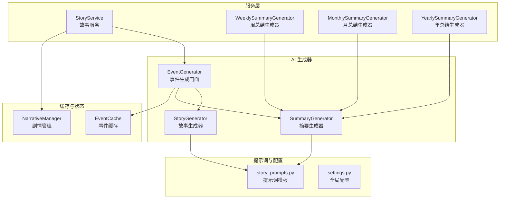
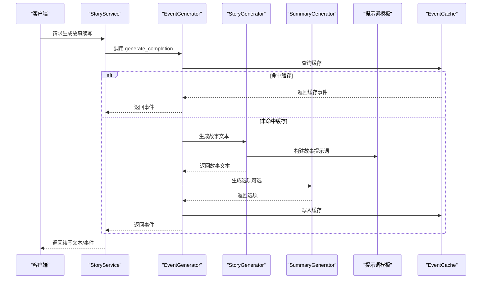
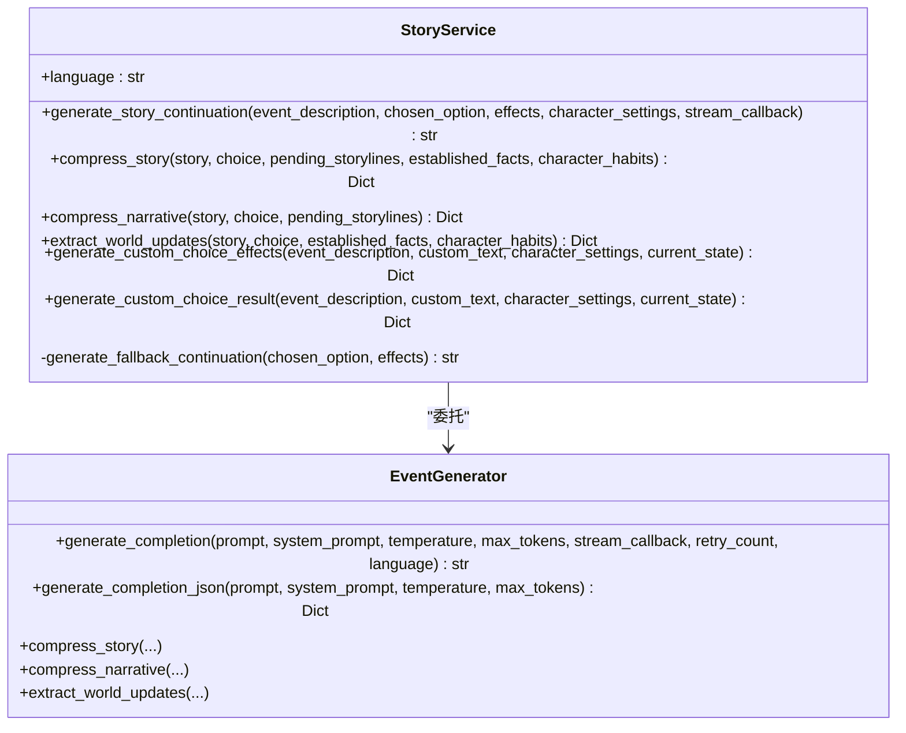
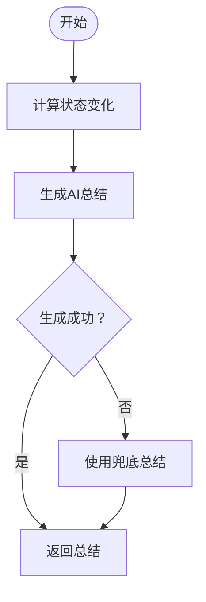
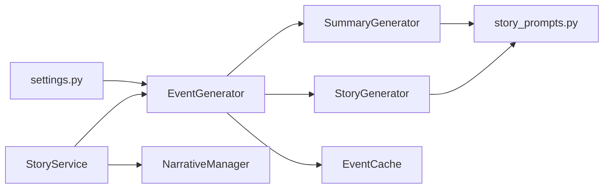

# 故事服务系统

<cite>
**本文档引用的文件**
- [src/game/story_service.py](file://src/game/story_service.py)
- [src/game/weekly_summary.py](file://src/game/weekly_summary.py)
- [src/game/monthly_summary.py](file://src/game/monthly_summary.py)
- [src/game/yearly_summary.py](file://src/game/yearly_summary.py)
- [src/ai/story_generator.py](file://src/ai/story_generator.py)
- [src/ai/summary_generator.py](file://src/ai/summary_generator.py)
- [src/ai/generator.py](file://src/ai/generator.py)
- [src/ai/cache.py](file://src/ai/cache.py)
- [src/game/narrative_manager.py](file://src/game/narrative_manager.py)
- [config/prompts/story_prompts.py](file://config/prompts/story_prompts.py)
- [config/settings.py](file://config/settings.py)
</cite>

## 目录
1. [简介](#简介)
2. [项目结构](#项目结构)
3. [核心组件](#核心组件)
4. [架构总览](#架构总览)
5. [详细组件分析](#详细组件分析)
6. [依赖关系分析](#依赖关系分析)
7. [性能考量](#性能考量)
8. [故障排查指南](#故障排查指南)
9. [结论](#结论)

## 简介
本技术文档围绕故事服务系统展开，重点阐释 StoryService 类的设计架构与实现细节，涵盖故事生成、摘要创建与历史记录管理。文档还深入解析周/月/年总结的生成算法与时机控制，说明不同类型摘要的特点与用途及其对游戏体验的影响。同时，文档阐述故事服务与 AI 生成器的协作关系（参数传递与结果处理）、配置选项与自定义方法、故事质量评估与优化策略、在游戏进度跟踪与回顾中的作用，以及性能考虑与缓存机制，并给出与其他系统组件的集成方式。

## 项目结构
故事服务系统位于游戏核心模块中，采用“服务层 + AI 生成器 + 提示词模板 + 缓存”的分层设计：
- 服务层：StoryService 负责故事续写、压缩、自定义选择效果与结果生成
- AI 生成器：EventGenerator 作为门面，委托 StoryGenerator、SummaryGenerator、OptionGenerator 等子服务
- 提示词模板：config/prompts 下的 story_prompts.py 提供多语言、多阶段的提示词
- 缓存：EventCache 降低 API 调用频率，提升响应速度
- 剧情管理：NarrativeManager 负责故事线、事实、预示种子与习惯的生命周期管理

图表来源
- [src/game/story_service.py](file://src/game/story_service.py#L11-L312)
- [src/game/weekly_summary.py](file://src/game/weekly_summary.py#L11-L120)
- [src/game/monthly_summary.py](file://src/game/monthly_summary.py#L11-L139)
- [src/game/yearly_summary.py](file://src/game/yearly_summary.py#L11-L171)
- [src/ai/generator.py](file://src/ai/generator.py#L30-L497)
- [src/ai/story_generator.py](file://src/ai/story_generator.py#L24-L439)
- [src/ai/summary_generator.py](file://src/ai/summary_generator.py#L17-L589)
- [config/prompts/story_prompts.py](file://config/prompts/story_prompts.py#L1-L1099)
- [src/ai/cache.py](file://src/ai/cache.py#L13-L139)
- [src/game/narrative_manager.py](file://src/game/narrative_manager.py#L15-L584)

章节来源
- [src/game/story_service.py](file://src/game/story_service.py#L1-L312)
- [src/ai/generator.py](file://src/ai/generator.py#L30-L497)
- [config/prompts/story_prompts.py](file://config/prompts/story_prompts.py#L1-L1099)
- [src/ai/cache.py](file://src/ai/cache.py#L13-L139)
- [src/game/narrative_manager.py](file://src/game/narrative_manager.py#L15-L584)

## 核心组件
- StoryService：负责故事续写、压缩、自定义选择效果与结果生成，封装 EventGenerator 的能力，提供友好的接口与降级策略
- WeeklySummaryGenerator/MonthlySummaryGenerator/YearlySummaryGenerator：分别生成周/月/年总结，结合玩家状态变化与决策统计
- EventGenerator：门面模式，聚合 StoryGenerator、SummaryGenerator、OptionGenerator、StoryRewriter
- StoryGenerator/SummaryGenerator：分别负责故事生成与摘要生成，内置重试与一致性校验
- EventCache：事件缓存，降低重复请求成本
- NarrativeManager：管理故事线、世界事实、预示种子与角色习惯

章节来源
- [src/game/story_service.py](file://src/game/story_service.py#L11-L312)
- [src/game/weekly_summary.py](file://src/game/weekly_summary.py#L11-L120)
- [src/game/monthly_summary.py](file://src/game/monthly_summary.py#L11-L139)
- [src/game/yearly_summary.py](file://src/game/yearly_summary.py#L11-L171)
- [src/ai/generator.py](file://src/ai/generator.py#L30-L497)
- [src/ai/story_generator.py](file://src/ai/story_generator.py#L24-L439)
- [src/ai/summary_generator.py](file://src/ai/summary_generator.py#L17-L589)
- [src/ai/cache.py](file://src/ai/cache.py#L13-L139)
- [src/game/narrative_manager.py](file://src/game/narrative_manager.py#L15-L584)

## 架构总览
故事服务系统采用“两阶段生成 + 分层缓存 + 剧情管理”的架构：
- 两阶段生成：先生成故事文本，再基于故事生成选项（OptionGenerator）
- 分层缓存：EventCache 缓存事件，EventGenerator 控制缓存开关
- 剧情管理：NarrativeManager 统一处理故事线、事实、预示种子与习惯，保证世界一致性
- 提示词模板：多语言、多阶段、多约束的提示词模板，确保生成内容与角色设定一致

图表来源
- [src/game/story_service.py](file://src/game/story_service.py#L18-L74)
- [src/ai/generator.py](file://src/ai/generator.py#L211-L268)
- [src/ai/story_generator.py](file://src/ai/story_generator.py#L32-L190)
- [src/ai/summary_generator.py](file://src/ai/summary_generator.py#L316-L332)
- [config/prompts/story_prompts.py](file://config/prompts/story_prompts.py#L612-L780)
- [src/ai/cache.py](file://src/ai/cache.py#L78-L101)

## 详细组件分析

### StoryService 设计与实现
- 角色定位：面向游戏流程的“故事续写与压缩”服务，负责在用户做出选择后生成续写、在回合结束时进行压缩与抽取
- 主要职责
  - generate_story_continuation：基于事件描述、选择与效果生成 500-800 字续写，支持流式回调
  - compress_story/compress_narrative/extract_world_updates：故事压缩、叙事压缩与世界抽取，支持并行化
  - generate_custom_choice_effects/generate_custom_choice_result：为自定义输入生成属性变化或完整结果
  - 降级策略：AI 失败时回退到本地生成的兜底文本
- 参数传递与结果处理
  - 通过 EventGenerator 的 generate_completion/generate_completion_json 接口与 AI 交互
  - 支持温度、最大令牌数、语言等参数控制
  - 结果包含错误反馈与重试机制
- 配置与自定义
  - language 参数控制多语言
  - 支持自定义 character_settings 与 current_state 上下文
  - 自定义选择的属性变化范围与合理性约束

图表来源
- [src/game/story_service.py](file://src/game/story_service.py#L11-L312)
- [src/ai/generator.py](file://src/ai/generator.py#L30-L497)

章节来源
- [src/game/story_service.py](file://src/game/story_service.py#L11-L312)
- [src/ai/generator.py](file://src/ai/generator.py#L88-L146)

### 周/月/年总结生成算法与时机控制
- 周总结（WeeklySummaryGenerator）
  - 计算状态变化：能量、情绪、学识、财富
  - 生成 AI 总结：50-100 字，描述一周的主要变化与感受
  - 时机：每周结束时，结合当周决策数量与最终状态
- 月总结（MonthlySummaryGenerator）
  - 计算月度变化：同上，但覆盖整月
  - 生成 AI 总结：80-150 字，包含关键决策与状态
  - 时机：每月结束时，结合周跨度与决策列表
- 年总结（YearlySummaryGenerator）
  - 计算年度变化：增加年龄增长
  - 生成 AI 总结：150-250 字，整合月度摘要片段与关键决策
  - 时机：每年结束时，汇总全年摘要与决策

图表来源
- [src/game/weekly_summary.py](file://src/game/weekly_summary.py#L25-L64)
- [src/game/monthly_summary.py](file://src/game/monthly_summary.py#L25-L70)
- [src/game/yearly_summary.py](file://src/game/yearly_summary.py#L25-L83)

章节来源
- [src/game/weekly_summary.py](file://src/game/weekly_summary.py#L11-L120)
- [src/game/monthly_summary.py](file://src/game/monthly_summary.py#L11-L139)
- [src/game/yearly_summary.py](file://src/game/yearly_summary.py#L11-L171)

### 不同类型摘要的特点与用途
- 周总结
  - 特点：短小精悍，聚焦一周内的变化与决策
  - 用途：帮助玩家快速回顾与反思，形成短期反馈闭环
- 月总结
  - 特点：涵盖更广的时间跨度，突出关键事件与趋势
  - 用途：引导玩家进行阶段性回顾，发现行为模式与成长轨迹
- 年总结
  - 特点：整合全年片段，强调整体轨迹与转折点
  - 用途：提供年度回顾与目标检视，增强叙事完整性与成就感

章节来源
- [src/game/weekly_summary.py](file://src/game/weekly_summary.py#L76-L112)
- [src/game/monthly_summary.py](file://src/game/monthly_summary.py#L82-L128)
- [src/game/yearly_summary.py](file://src/game/yearly_summary.py#L96-L160)

### 故事服务与 AI 生成器的协作关系
- 参数传递
  - StoryService 将事件描述、选择、效果、角色设定、语言等上下文传递给 EventGenerator
  - EventGenerator 再委派给 StoryGenerator 或 SummaryGenerator，构建提示词并调用底层 AI 客户端
- 结果处理
  - 生成结果通过 JSON 解析与清洗，确保格式正确与内容安全
  - 失败时执行重试与兜底策略，保证用户体验连续性
- 一致性与约束
  - StoryGenerator 支持一致性校验与重试，避免生成与设定或历史矛盾的内容
  - 提示词模板严格约束角色背景、时代设定、人物来源与叙事边界

章节来源
- [src/game/story_service.py](file://src/game/story_service.py#L43-L63)
- [src/ai/generator.py](file://src/ai/generator.py#L211-L268)
- [src/ai/story_generator.py](file://src/ai/story_generator.py#L332-L425)
- [config/prompts/story_prompts.py](file://config/prompts/story_prompts.py#L612-L780)

### 配置选项与自定义方法
- 全局配置（settings.py）
  - OPENAI_API_KEY/OPENAI_MODEL：AI 服务接入参数
  - DEFAULT_LANGUAGE：默认语言
  - CACHE_EVENTS：是否启用事件缓存
  - 生成超时、资源上下限、周数与里程碑等常量
- 提示词定制（story_prompts.py）
  - 多语言模板：中文与英文提示词
  - 多阶段模板：事件生成、故事生成、选项生成、压缩与摘要
  - 约束模板：时代背景、人物来源、逻辑一致性、叙事边界
- 缓存配置（EventCache）
  - 基于状态签名的缓存键生成，带随机概率使用缓存
  - 事件序列化与持久化

章节来源
- [config/settings.py](file://config/settings.py#L27-L168)
- [config/prompts/story_prompts.py](file://config/prompts/story_prompts.py#L1-L1099)
- [src/ai/cache.py](file://src/ai/cache.py#L47-L128)

### 故事质量评估与优化策略
- 质量评估维度
  - 一致性：与角色设定、时代背景、历史事件一致
  - 可读性：语言流畅、对话自然、场景丰富
  - 逻辑性：因果链清晰、选项有取舍、结局留悬念
- 优化策略
  - 渐进式温度策略：初次生成较高温度，重试时逐步降低，提升稳定性
  - 一致性校验与重试：检测到严重问题时自动重试并附带修复指令
  - JSON 解析与兜底：解析失败时尝试提取摘要或回退到固定文本
  - 并行压缩：叙事压缩与世界抽取并行执行，缩短生成时延

章节来源
- [src/ai/story_generator.py](file://src/ai/story_generator.py#L106-L125)
- [src/ai/story_generator.py](file://src/ai/story_generator.py#L334-L425)
- [src/ai/summary_generator.py](file://src/ai/summary_generator.py#L51-L140)
- [src/ai/summary_generator.py](file://src/ai/summary_generator.py#L144-L226)
- [src/ai/summary_generator.py](file://src/ai/summary_generator.py#L228-L300)

### 在游戏进度跟踪与回顾中的作用
- 进度跟踪
  - 周/月/年总结作为阶段性里程碑，帮助玩家感知时间流逝与成长轨迹
  - 压缩与抽取功能将长篇故事转化为可检索的事实、故事线与习惯，便于回顾
- 回顾机制
  - 年度总结整合月度摘要片段，形成整体叙事弧线
  - 预示种子与故事线管理确保长期叙事连贯性与可追踪性

章节来源
- [src/game/weekly_summary.py](file://src/game/weekly_summary.py#L25-L64)
- [src/game/monthly_summary.py](file://src/game/monthly_summary.py#L25-L70)
- [src/game/yearly_summary.py](file://src/game/yearly_summary.py#L25-L83)
- [src/game/narrative_manager.py](file://src/game/narrative_manager.py#L15-L584)

### 性能考虑与缓存机制
- 缓存策略
  - EventCache 基于状态签名生成缓存键，降低重复请求
  - 随机概率使用缓存，平衡稳定性与多样性
  - 事件序列化与持久化，支持跨会话复用
- 并行化与降级
  - 压缩与抽取并行执行，缩短总时延
  - 失败时快速回退到兜底文本，保证界面流畅
- 资源控制
  - 温度与令牌上限控制生成质量与成本
  - 生成超时与重试策略避免阻塞

章节来源
- [src/ai/cache.py](file://src/ai/cache.py#L47-L128)
- [src/ai/generator.py](file://src/ai/generator.py#L211-L268)
- [src/ai/summary_generator.py](file://src/ai/summary_generator.py#L144-L226)
- [config/settings.py](file://config/settings.py#L70-L106)

### 与其他系统组件的集成方式
- 与游戏循环集成
  - 事件生成与选项生成在游戏循环中按周推进，周/月/年总结在对应节点触发
- 与状态管理集成
  - StoryService 与 NarrativeManager 协作，将压缩结果转化为故事线、事实、习惯与预示种子
- 与前端集成
  - 流式回调支持前端实时渲染，状态回调用于 UI 阶段切换与重试提示

章节来源
- [src/game/narrative_manager.py](file://src/game/narrative_manager.py#L22-L95)
- [src/game/narrative_manager.py](file://src/game/narrative_manager.py#L101-L182)
- [src/game/narrative_manager.py](file://src/game/narrative_manager.py#L187-L285)
- [src/game/narrative_manager.py](file://src/game/narrative_manager.py#L420-L584)

## 依赖关系分析
- 组件耦合
  - StoryService 依赖 EventGenerator，后者聚合多个子服务，降低耦合度
  - 提示词模板集中管理，便于统一约束与多语言支持
- 外部依赖
  - OpenAI API（或兼容接口），受 settings.py 中的配置控制
  - 文件系统缓存（EventCache），受 CACHE_EVENTS 控制
- 循环依赖
  - 通过门面模式与模块拆分避免循环依赖

图表来源
- [src/game/story_service.py](file://src/game/story_service.py#L14-L16)
- [src/ai/generator.py](file://src/ai/generator.py#L30-L66)
- [src/ai/story_generator.py](file://src/ai/story_generator.py#L24-L29)
- [src/ai/summary_generator.py](file://src/ai/summary_generator.py#L17-L22)
- [src/ai/cache.py](file://src/ai/cache.py#L13-L26)
- [src/game/narrative_manager.py](file://src/game/narrative_manager.py#L15-L16)
- [config/settings.py](file://config/settings.py#L27-L34)

章节来源
- [src/game/story_service.py](file://src/game/story_service.py#L1-L312)
- [src/ai/generator.py](file://src/ai/generator.py#L30-L497)
- [config/prompts/story_prompts.py](file://config/prompts/story_prompts.py#L1-L1099)
- [src/ai/cache.py](file://src/ai/cache.py#L13-L139)
- [src/game/narrative_manager.py](file://src/game/narrative_manager.py#L15-L584)
- [config/settings.py](file://config/settings.py#L27-L168)

## 性能考量
- 生成时延优化
  - 并行压缩与抽取，减少等待时间
  - 渐进式温度策略与重试，提高成功率，减少无效重试
- 成本控制
  - 缓存命中率与随机概率平衡，避免过度缓存导致多样性不足
  - 令牌上限与超时控制，防止长时间占用资源
- 可靠性保障
  - 失败兜底与错误反馈，保证 UI 与交互连续性
  - 一致性校验与重试，避免生成与设定冲突

## 故障排查指南
- 常见问题
  - AI 生成失败：检查 OPENAI_API_KEY 与网络连接，确认提示词约束是否合理
  - JSON 解析失败：检查提示词输出格式，启用重试与兜底策略
  - 缓存异常：检查缓存文件权限与磁盘空间
- 排查步骤
  - 查看日志：定位失败阶段与错误原因
  - 降低温度或简化提示词，验证最小可运行路径
  - 清理缓存或禁用缓存，排除缓存污染

章节来源
- [config/settings.py](file://config/settings.py#L143-L149)
- [src/ai/summary_generator.py](file://src/ai/summary_generator.py#L51-L140)
- [src/ai/cache.py](file://src/ai/cache.py#L28-L46)

## 结论
故事服务系统通过“服务层 + AI 生成器 + 提示词模板 + 缓存 + 剧情管理”的分层架构，实现了高质量、可扩展、可维护的故事生成与摘要体系。其在游戏中的作用不仅体现在沉浸式叙事与选择反馈，更在于通过周/月/年总结与剧情管理，构建出连贯、可追踪、可回顾的长期叙事体验。配合性能优化与可靠性保障，系统能够在保证质量的同时，满足大规模用户的使用需求。