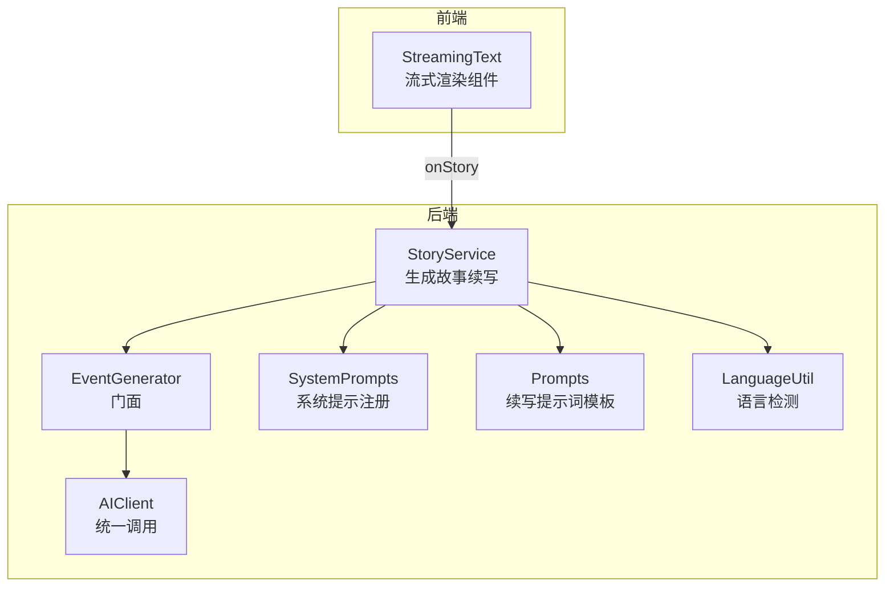
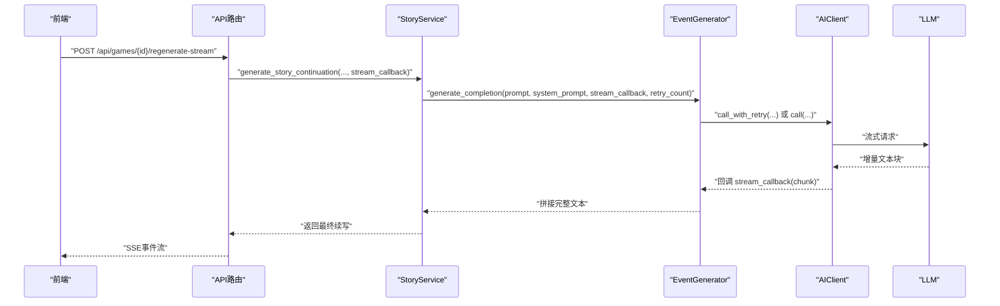
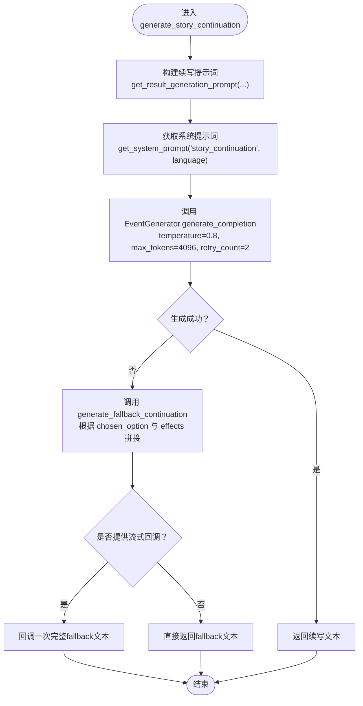
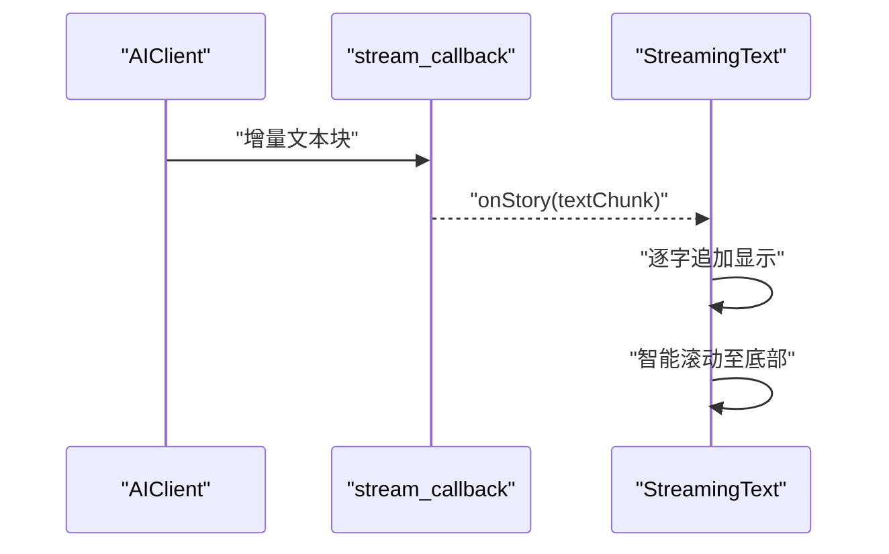
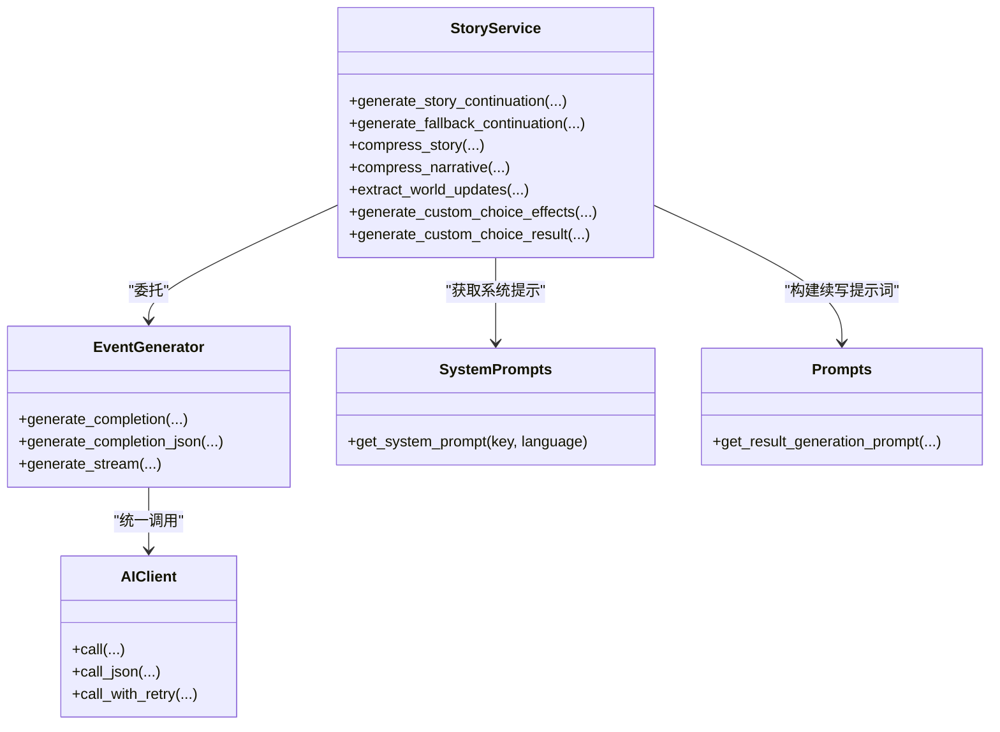

# 故事续写生成

<cite>
**本文引用的文件**
- [src/game/story_service.py](file://src/game/story_service.py)
- [config/prompts/story_prompts.py](file://config/prompts/story_prompts.py)
- [src/ai/system_prompts.py](file://src/ai/system_prompts.py)
- [src/ai/generator.py](file://src/ai/generator.py)
- [src/ai/client.py](file://src/ai/client.py)
- [src/utils/language.py](file://src/utils/language.py)
- [frontend/src/components/game/StreamingText.tsx](file://frontend/src/components/game/StreamingText.tsx)
- [src/api/routers/story.py](file://src/api/routers/story.py)
- [tests/test_game_modules.py](file://tests/test_game_modules.py)
- [src/ai/story_generator.py](file://src/ai/story_generator.py)
- [src/ai/consistency_validator.py](file://src/ai/consistency_validator.py)
</cite>

## 目录
1. [简介](#简介)
2. [项目结构](#项目结构)
3. [核心组件](#核心组件)
4. [架构总览](#架构总览)
5. [详细组件分析](#详细组件分析)
6. [依赖关系分析](#依赖关系分析)
7. [性能考量](#性能考量)
8. [故障排查指南](#故障排查指南)
9. [结论](#结论)
10. [附录](#附录)

## 简介
本文围绕“故事续写生成”功能，系统梳理 generate_story_continuation 方法的实现原理与工程实践，涵盖参数处理、提示词构建、AI生成流程、长度控制（500-800字符）、情感渲染与场景描述技术、fallback机制、stream_callback回调与实时文本流处理、多语言支持与语言切换机制、质量评估与优化建议、与AI生成器的集成与错误处理策略，以及在游戏叙事中的作用与用户体验影响。

## 项目结构
故事续写生成位于后端服务层，核心由以下模块协作完成：
- 业务服务层：StoryService 负责生成故事续写、压缩、自定义选择结果等
- 提示词层：config.prompts.story_prompts 提供续写提示词模板
- 系统提示层：src.ai.system_prompts 提供系统提示词注册表
- AI生成器层：src.ai.generator.EventGenerator 作为门面，委托至 AIClient
- 客户端层：src.ai.client.AIClient 统一调用 OpenAI SDK，支持流式与重试
- 前端组件：StreamingText.tsx 实现打字机式流式渲染
- API路由：story.py 提供SSE流式重新生成接口

图表来源
- [src/game/story_service.py](file://src/game/story_service.py#L18-L73)
- [src/ai/generator.py](file://src/ai/generator.py#L30-L129)
- [src/ai/client.py](file://src/ai/client.py#L22-L124)
- [src/ai/system_prompts.py](file://src/ai/system_prompts.py#L242-L279)
- [config/prompts/story_prompts.py](file://config/prompts/story_prompts.py#L364-L438)
- [src/utils/language.py](file://src/utils/language.py#L5-L27)
- [frontend/src/components/game/StreamingText.tsx](file://frontend/src/components/game/StreamingText.tsx#L30-L76)

章节来源
- [src/game/story_service.py](file://src/game/story_service.py#L1-L117)
- [config/prompts/story_prompts.py](file://config/prompts/story_prompts.py#L364-L438)
- [src/ai/system_prompts.py](file://src/ai/system_prompts.py#L242-L279)
- [src/ai/generator.py](file://src/ai/generator.py#L30-L129)
- [src/ai/client.py](file://src/ai/client.py#L22-L124)
- [src/utils/language.py](file://src/utils/language.py#L5-L27)
- [frontend/src/components/game/StreamingText.tsx](file://frontend/src/components/game/StreamingText.tsx#L30-L76)

## 核心组件
- StoryService.generate_story_continuation：主入口，负责参数处理、提示词构建、调用AI生成器、fallback回退与流式回调
- EventGenerator.generate_completion：门面方法，封装AIClient调用，支持重试与流式回调
- AIClient.call/AIClient.call_with_retry：统一AI调用抽象，支持流式输出、最大token限制、错误反馈注入与重试
- get_result_generation_prompt：构建续写提示词，限定500-800字符，强调沉浸式第二人称叙事
- get_system_prompt：按场景获取系统提示词（story_continuation）
- StreamingText：前端流式渲染组件，实现打字机效果与智能滚动

章节来源
- [src/game/story_service.py](file://src/game/story_service.py#L18-L73)
- [src/ai/generator.py](file://src/ai/generator.py#L88-L129)
- [src/ai/client.py](file://src/ai/client.py#L51-L124)
- [config/prompts/story_prompts.py](file://config/prompts/story_prompts.py#L364-L438)
- [src/ai/system_prompts.py](file://src/ai/system_prompts.py#L264-L279)
- [frontend/src/components/game/StreamingText.tsx](file://frontend/src/components/game/StreamingText.tsx#L30-L76)

## 架构总览
故事续写生成采用分层架构：
- 表现层：API路由 story.py 提供SSE流式接口
- 业务层：StoryService 负责业务逻辑与fallback
- 提示词层：config.prompts 与 src.ai.system_prompts 提供模板与系统提示
- AI层：EventGenerator 门面 + AIClient 抽象，统一调用与错误处理
- 前端层：StreamingText 组件负责实时渲染

图表来源
- [src/api/routers/story.py](file://src/api/routers/story.py#L117-L155)
- [src/game/story_service.py](file://src/game/story_service.py#L18-L73)
- [src/ai/generator.py](file://src/ai/generator.py#L88-L129)
- [src/ai/client.py](file://src/ai/client.py#L159-L232)

## 详细组件分析

### generate_story_continuation 方法详解
- 参数处理
  - event_description：原始事件/故事文本
  - chosen_option：玩家选择文本
  - effects：选择带来的属性变化字典（能量、情绪、学识、财富、关系等）
  - character_settings：角色背景设置（可选）
  - stream_callback：可选的流式回调
- 提示词构建
  - 使用 get_result_generation_prompt 构建续写提示词，限定500-800字符，强调沉浸式第二人称叙事，包含角色信息、当前故事、玩家选择与影响
  - 系统提示词通过 get_system_prompt("story_continuation", language) 获取
- AI生成流程
  - 调用 EventGenerator.generate_completion，传入 temperature=0.8、max_tokens=4096、retry_count=2
  - 支持流式回调 stream_callback，逐块推送增量文本
- 长度控制与质量约束
  - 续写提示词模板明确要求500-800字，系统提示词强调沉浸式第二人称叙事与禁止跳脱叙事
- fallback机制
  - 若生成异常，记录警告日志，回退到 generate_fallback_continuation
  - 回退文本根据语言与effects动态拼接（中文/英文），包含情绪、知识、关系等影响
  - 若存在流式回调，回退文本作为单个chunk推送
- 多语言支持
  - 语言由 StoryService 初始化时的语言参数决定
  - 提示词模板与系统提示词均支持 zh/en
  - 语言检测工具 detect_language_from_state 可用于从状态推断语言（在其他模块中使用）

图表来源
- [src/game/story_service.py](file://src/game/story_service.py#L18-L73)
- [config/prompts/story_prompts.py](file://config/prompts/story_prompts.py#L364-L438)
- [src/ai/system_prompts.py](file://src/ai/system_prompts.py#L242-L279)

章节来源
- [src/game/story_service.py](file://src/game/story_service.py#L18-L117)
- [config/prompts/story_prompts.py](file://config/prompts/story_prompts.py#L364-L438)
- [src/ai/system_prompts.py](file://src/ai/system_prompts.py#L242-L279)

### 提示词构建与长度控制（500-800字符）
- get_result_generation_prompt 模板明确要求续写500-800字，包含场景描写、人物反应、丰富对话（至少3-5轮自然对话）、沉浸式第二人称叙事、禁止跳脱叙事
- 通过系统提示词与用户提示词的组合，确保生成内容在长度与风格上满足预期

章节来源
- [config/prompts/story_prompts.py](file://config/prompts/story_prompts.py#L364-L438)
- [src/ai/system_prompts.py](file://src/ai/system_prompts.py#L101-L109)

### 情感渲染与场景描述技术
- 情感渲染：根据 effects 中的 mood/knowledge/relationships 等字段动态生成情感变化与知识增长描述
- 场景描述：提示词模板要求包含具体场景、人物反应与丰富对话，增强沉浸感
- 第二人称叙事：系统提示词强调第二人称视角，提升玩家代入感

章节来源
- [src/game/story_service.py](file://src/game/story_service.py#L75-L117)
- [config/prompts/story_prompts.py](file://config/prompts/story_prompts.py#L364-L438)
- [src/ai/system_prompts.py](file://src/ai/system_prompts.py#L101-L109)

### fallback机制与回退策略
- 触发条件：AI生成异常（如网络错误、API错误、格式错误等）
- 回退策略：
  - 中文：包含“你选择了...”、“情绪变化”、“获得领悟”、“关系变化”等片段
  - 英文：包含“you chose to...”、“lifted your spirits”、“gained insights”等片段
  - 若提供流式回调，fallback文本作为单个chunk推送，保证前端一致性

章节来源
- [src/game/story_service.py](file://src/game/story_service.py#L67-L73)
- [src/game/story_service.py](file://src/game/story_service.py#L75-L117)
- [tests/test_game_modules.py](file://tests/test_game_modules.py#L297-L354)

### stream_callback回调与实时文本流处理
- 后端：AIClient 在流式模式下逐块推送增量文本，调用传入的 stream_callback
- 前端：StreamingText 组件实现打字机效果，逐字追加显示，支持智能滚动与用户滚动检测
- 交互体验：前端在 isStreaming=true 时启用逐字显示，避免一次性加载造成卡顿

图表来源
- [src/ai/client.py](file://src/ai/client.py#L80-L106)
- [frontend/src/components/game/StreamingText.tsx](file://frontend/src/components/game/StreamingText.tsx#L44-L88)

章节来源
- [src/ai/client.py](file://src/ai/client.py#L80-L106)
- [frontend/src/components/game/StreamingText.tsx](file://frontend/src/components/game/StreamingText.tsx#L30-L148)

### 多语言支持与语言切换机制
- 语言来源：StoryService 初始化时的语言参数 language
- 提示词与系统提示：config.prompts 与 src.ai.system_prompts 均提供 zh/en 版本
- 语言检测：detect_language_from_state 可从角色设定的 era_description 推断语言（在其他模块中使用）

章节来源
- [src/game/story_service.py](file://src/game/story_service.py#L14-L16)
- [config/prompts/story_prompts.py](file://config/prompts/story_prompts.py#L364-L438)
- [src/ai/system_prompts.py](file://src/ai/system_prompts.py#L242-L279)
- [src/utils/language.py](file://src/utils/language.py#L5-L27)

### 与AI生成器的集成与错误处理策略
- EventGenerator 门面：封装 AIClient 调用，提供 generate_completion/generate_completion_json/generate_stream 等接口
- AIClient.call_with_retry：支持重试与错误反馈注入，首次失败后将错误原因注入提示词，提高后续成功率
- 错误处理：捕获异常后记录警告日志并触发 fallback；流式模式下仅在首次尝试使用回调，后续重试不使用回调

章节来源
- [src/ai/generator.py](file://src/ai/generator.py#L88-L129)
- [src/ai/client.py](file://src/ai/client.py#L159-L232)

### 在游戏叙事中的作用与用户体验影响
- 增强沉浸感：500-800字符的续写提供足够细节，配合第二人称叙事与丰富对话，提升玩家代入感
- 实时反馈：流式渲染减少等待时间，打字机效果增强参与感
- 一致性保障：结合一致性校验与重试策略，确保续写与角色设定、世界模型一致
- 语言适配：多语言支持满足国际化需求，语言检测辅助自动适配

章节来源
- [config/prompts/story_prompts.py](file://config/prompts/story_prompts.py#L364-L438)
- [frontend/src/components/game/StreamingText.tsx](file://frontend/src/components/game/StreamingText.tsx#L30-L148)
- [src/ai/story_generator.py](file://src/ai/story_generator.py#L334-L415)
- [src/ai/consistency_validator.py](file://src/ai/consistency_validator.py#L79-L114)

## 依赖关系分析

图表来源
- [src/game/story_service.py](file://src/game/story_service.py#L11-L117)
- [src/ai/generator.py](file://src/ai/generator.py#L30-L129)
- [src/ai/client.py](file://src/ai/client.py#L22-L124)
- [src/ai/system_prompts.py](file://src/ai/system_prompts.py#L242-L279)
- [config/prompts/story_prompts.py](file://config/prompts/story_prompts.py#L364-L438)

章节来源
- [src/game/story_service.py](file://src/game/story_service.py#L11-L117)
- [src/ai/generator.py](file://src/ai/generator.py#L30-L129)
- [src/ai/client.py](file://src/ai/client.py#L22-L124)
- [src/ai/system_prompts.py](file://src/ai/system_prompts.py#L242-L279)
- [config/prompts/story_prompts.py](file://config/prompts/story_prompts.py#L364-L438)

## 性能考量
- 流式输出：减少首屏延迟，提升交互响应速度
- 温度与token：temperature=0.8 平衡创意与稳定性；max_tokens=4096 避免截断
- 重试策略：call_with_retry 注入错误反馈，提高成功率，避免重复失败
- 前端渲染：StreamingText 的逐字显示与智能滚动，避免频繁DOM更新导致卡顿

章节来源
- [src/ai/client.py](file://src/ai/client.py#L51-L124)
- [src/ai/generator.py](file://src/ai/generator.py#L88-L129)
- [frontend/src/components/game/StreamingText.tsx](file://frontend/src/components/game/StreamingText.tsx#L44-L88)

## 故障排查指南
- 生成失败
  - 现象：generate_story_continuation 抛出异常
  - 处理：记录警告日志并触发 fallback；若提供流式回调，回退文本作为单个chunk推送
- JSON解析失败
  - 现象：generate_custom_choice_result/generate_custom_choice_effects 解析失败
  - 处理：重试两次并在失败后使用安全回退值
- 一致性校验失败
  - 现象：续写与世界模型存在矛盾
  - 处理：通过一致性校验器生成修复指令并重试，固定温度0.7确保严格约束
- 前端流式渲染异常
  - 现象：打字机效果不生效或滚动异常
  - 处理：检查 isStreaming、charsPerFrame、frameInterval 参数；确认容器滚动事件监听与用户滚动检测逻辑

章节来源
- [src/game/story_service.py](file://src/game/story_service.py#L67-L73)
- [src/game/story_service.py](file://src/game/story_service.py#L194-L227)
- [src/game/story_service.py](file://src/game/story_service.py#L284-L311)
- [src/ai/story_generator.py](file://src/ai/story_generator.py#L334-L415)
- [src/ai/consistency_validator.py](file://src/ai/consistency_validator.py#L79-L114)
- [frontend/src/components/game/StreamingText.tsx](file://frontend/src/components/game/StreamingText.tsx#L78-L113)

## 结论
generate_story_continuation 方法通过严谨的参数处理、精心设计的提示词模板与系统提示词、可靠的AI生成器门面与客户端抽象、完善的fallback机制与流式回调，实现了高质量、低延迟、多语言支持的故事续写生成。其在游戏叙事中扮演着连接玩家选择与沉浸式体验的关键角色，显著提升了用户的参与感与满意度。

## 附录

### 质量评估指标与优化建议
- 质量评估指标
  - 长度合规率：续写长度在500-800字符的比例
  - 情感一致性：mood/knowledge/relationships变化与选择逻辑匹配度
  - 场景丰富度：场景描写、对话轮数、细节描述评分
  - 一致性通过率：与角色设定、世界模型的一致性校验通过率
  - 用户满意度：通过用户反馈与留存数据衡量
- 优化建议
  - 动态温度调整：根据选择复杂度与历史一致性动态调整temperature
  - 上下文增强：引入更多角色画像与历史摘要，提升续写连贯性
  - 多轮校验：在生成后进行多层级一致性校验，必要时进行二次修复
  - A/B测试：对比不同提示词模板与系统提示词的效果，持续迭代

章节来源
- [config/prompts/story_prompts.py](file://config/prompts/story_prompts.py#L364-L438)
- [src/ai/story_generator.py](file://src/ai/story_generator.py#L334-L415)
- [src/ai/consistency_validator.py](file://src/ai/consistency_validator.py#L79-L114)