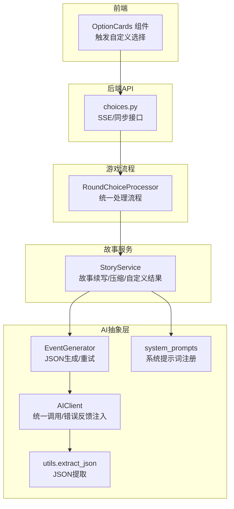
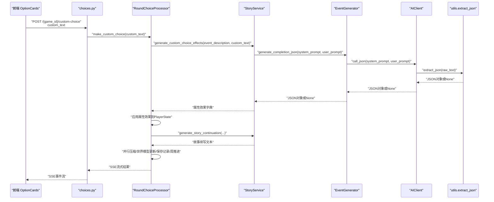
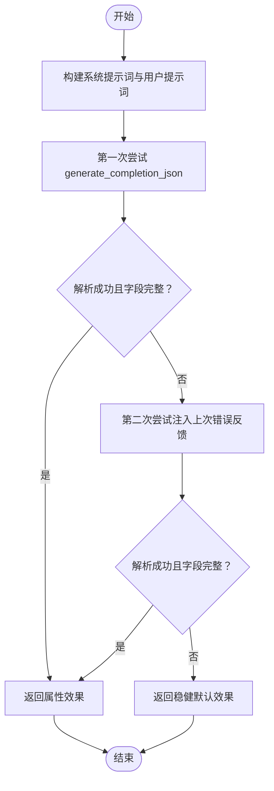
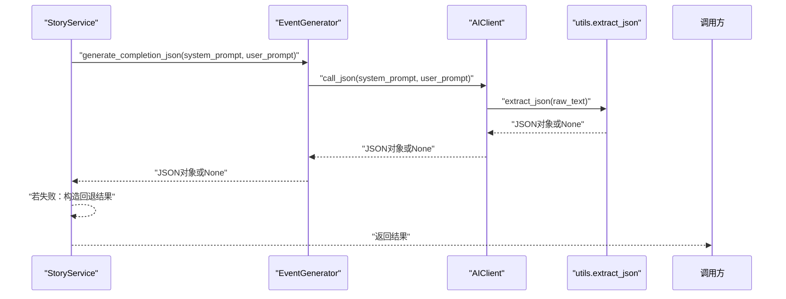

# 自定义选择处理

<cite>
**本文引用的文件**
- [src/game/round/choice_processor.py](file://src/game/round/choice_processor.py)
- [src/game/story_service.py](file://src/game/story_service.py)
- [src/ai/system_prompts.py](file://src/ai/system_prompts.py)
- [src/ai/generator.py](file://src/ai/generator.py)
- [src/ai/client.py](file://src/ai/client.py)
- [src/ai/utils.py](file://src/ai/utils.py)
- [src/api/routers/gameplay/choices.py](file://src/api/routers/gameplay/choices.py)
- [frontend/src/components/game/OptionCards.tsx](file://frontend/src/components/game/OptionCards.tsx)
</cite>

## 目录
1. [简介](#简介)
2. [项目结构](#项目结构)
3. [核心组件](#核心组件)
4. [架构总览](#架构总览)
5. [详细组件分析](#详细组件分析)
6. [依赖关系分析](#依赖关系分析)
7. [性能考量](#性能考量)
8. [故障排查指南](#故障排查指南)
9. [结论](#结论)
10. [附录](#附录)

## 简介
本技术文档聚焦“自定义选择处理”能力，围绕两个关键方法展开：generate_custom_choice_effects（自定义选择属性效果生成）与generate_custom_choice_result（自定义选择结果的双重生成）。文档将深入解释设计理念、实现细节、属性变化范围控制与合理性检查、JSON格式输出的严格要求与错误恢复策略、故事续写与属性效果的协同处理、系统提示词设计与参数传递机制、限制条件与边界情况处理，以及该机制在游戏自由度与叙事一致性之间的平衡策略，并说明其对游戏状态与世界模型的影响。

## 项目结构
自定义选择处理贯穿后端服务层与前端交互层：
- 后端
  - API路由：接收自定义选择请求并支持SSE流式响应与同步回退
  - 游戏流程编排：RoundChoiceProcessor负责标准选项与自定义选择的统一处理流程
  - 故事服务：StoryService封装故事续写、压缩与自定义选择结果生成
  - AI抽象层：EventGenerator与AIClient提供统一的文本/JSON生成与重试机制
  - 提示词模板：system_prompts提供系统提示词注册与获取
- 前端
  - OptionCards组件：提供标准选项卡片与自定义输入框，触发自定义选择

**图表来源**
- [src/api/routers/gameplay/choices.py](file://src/api/routers/gameplay/choices.py#L116-L152)
- [src/game/round/choice_processor.py](file://src/game/round/choice_processor.py#L135-L201)
- [src/game/story_service.py](file://src/game/story_service.py#L143-L311)
- [src/ai/generator.py](file://src/ai/generator.py#L131-L146)
- [src/ai/client.py](file://src/ai/client.py#L127-L155)
- [src/ai/utils.py](file://src/ai/utils.py#L10-L77)
- [src/ai/system_prompts.py](file://src/ai/system_prompts.py#L242-L279)
- [frontend/src/components/game/OptionCards.tsx](file://frontend/src/components/game/OptionCards.tsx#L39-L44)

**章节来源**
- [src/api/routers/gameplay/choices.py](file://src/api/routers/gameplay/choices.py#L1-L224)
- [src/game/round/choice_processor.py](file://src/game/round/choice_processor.py#L1-L381)
- [src/game/story_service.py](file://src/game/story_service.py#L1-L312)
- [src/ai/generator.py](file://src/ai/generator.py#L1-L200)
- [src/ai/client.py](file://src/ai/client.py#L1-L200)
- [src/ai/utils.py](file://src/ai/utils.py#L1-L77)
- [src/ai/system_prompts.py](file://src/ai/system_prompts.py#L211-L279)
- [frontend/src/components/game/OptionCards.tsx](file://frontend/src/components/game/OptionCards.tsx#L1-L152)

## 核心组件
- 自定义选择处理器（RoundChoiceProcessor）
  - 统一处理标准选项与自定义选择，串联属性应用、故事续写、并行压缩与世界模型更新、历史记录保存、周推进与周总结触发
- 故事服务（StoryService）
  - 提供故事续写、压缩、世界模型抽取与自定义选择结果生成；其中generate_custom_choice_effects与generate_custom_choice_result分别承担“属性效果生成”与“结果双重生成”
- AI生成器（EventGenerator/AIClient）
  - 提供generate_completion与generate_completion_json两类接口；后者通过AIClient调用并使用utils.extract_json进行鲁棒性提取
- 系统提示词（system_prompts）
  - 提供CUSTOM_CHOICE_TEMPLATE等模板，规范自定义选择的JSON输出结构与属性范围约束
- 前端组件（OptionCards）
  - 提供自定义输入框，提交时触发onCustomChoice回调，进入后端SSE流式处理

**章节来源**
- [src/game/round/choice_processor.py](file://src/game/round/choice_processor.py#L16-L52)
- [src/game/story_service.py](file://src/game/story_service.py#L11-L17)
- [src/ai/generator.py](file://src/ai/generator.py#L30-L66)
- [src/ai/client.py](file://src/ai/client.py#L22-L48)
- [src/ai/system_prompts.py](file://src/ai/system_prompts.py#L211-L237)
- [frontend/src/components/game/OptionCards.tsx](file://frontend/src/components/game/OptionCards.tsx#L39-L44)

## 架构总览
自定义选择处理的关键流程如下：

**图表来源**
- [src/api/routers/gameplay/choices.py](file://src/api/routers/gameplay/choices.py#L116-L152)
- [src/game/round/choice_processor.py](file://src/game/round/choice_processor.py#L135-L201)
- [src/game/story_service.py](file://src/game/story_service.py#L143-L311)
- [src/ai/generator.py](file://src/ai/generator.py#L131-L146)
- [src/ai/client.py](file://src/ai/client.py#L127-L155)
- [src/ai/utils.py](file://src/ai/utils.py#L10-L77)

## 详细组件分析

### generate_custom_choice_effects 设计与实现
- 目标
  - 仅生成自定义选择的属性变化（energy/mood/knowledge/wealth），不生成故事续写
- 输入参数
  - event_description：当前事件描述
  - custom_text：用户自定义选择文本
  - character_settings/current_state：角色设定与当前状态上下文
- 输出
  - 属性效果字典，包含energy/mood/knowledge/wealth键
- 设计要点
  - 使用系统提示词模板，明确属性变化范围与合理性约束
  - 采用generate_completion_json接口，确保严格JSON输出
  - 双次尝试与错误反馈注入，提升成功率
  - 若解析失败或字段缺失，返回稳健的默认值
- 错误恢复
  - 第一次失败：记录last_error
  - 第二次尝试：在user_prompt末尾追加“上次生成失败原因”的显式反馈，引导模型修正
  - 两次均失败：返回预设的保守效果（如轻微负面体力、正向情绪）

**图表来源**
- [src/game/story_service.py](file://src/game/story_service.py#L143-L227)
- [src/ai/generator.py](file://src/ai/generator.py#L131-L146)
- [src/ai/client.py](file://src/ai/client.py#L159-L200)
- [src/ai/utils.py](file://src/ai/utils.py#L10-L77)

**章节来源**
- [src/game/story_service.py](file://src/game/story_service.py#L143-L227)
- [src/ai/system_prompts.py](file://src/ai/system_prompts.py#L211-L237)
- [src/ai/generator.py](file://src/ai/generator.py#L131-L146)
- [src/ai/client.py](file://src/ai/client.py#L159-L200)
- [src/ai/utils.py](file://src/ai/utils.py#L10-L77)

### generate_custom_choice_result 设计与实现
- 目标
  - 同时生成“故事续写”与“属性效果”，形成完整的自定义选择结果
- 输入参数
  - event_description/custom_text/character_settings/current_state
- 输出
  - 字典：包含story_continuation与effects
- 设计要点
  - 系统提示词强调“先生成合理的故事续写，再生成合理的属性变化”
  - 明确JSON结构要求，包含story_continuation与effects子对象
  - 与generate_custom_choice_effects相同的双次尝试与错误反馈注入机制
- 错误恢复
  - 两次尝试失败：返回包含简要故事续写与最小化效果的回退结果，保证用户体验连续性

**图表来源**
- [src/game/story_service.py](file://src/game/story_service.py#L229-L311)
- [src/ai/generator.py](file://src/ai/generator.py#L131-L146)
- [src/ai/client.py](file://src/ai/client.py#L127-L155)
- [src/ai/utils.py](file://src/ai/utils.py#L10-L77)

**章节来源**
- [src/game/story_service.py](file://src/game/story_service.py#L229-L311)
- [src/ai/system_prompts.py](file://src/ai/system_prompts.py#L213-L237)
- [src/ai/generator.py](file://src/ai/generator.py#L131-L146)
- [src/ai/client.py](file://src/ai/client.py#L127-L155)
- [src/ai/utils.py](file://src/ai/utils.py#L10-L77)

### 属性效果生成机制：范围控制与合理性检查
- 范围约束
  - energy：±20
  - mood：±20
  - knowledge：±10到+15
  - wealth：±1000（日常变化应较小）
- 合理性检查
  - 系统提示词明确“大多数情况下变化应在-10到+10之间”，避免极端值
  - 通过双次尝试与错误反馈注入，引导模型遵循范围与合理性
- 默认回退
  - 当JSON解析失败或字段缺失时，返回稳健效果（如轻微负面体力、正向情绪），以维持游戏体验

**章节来源**
- [src/game/story_service.py](file://src/game/story_service.py#L170-L176)
- [src/game/story_service.py](file://src/game/story_service.py#L257-L263)
- [src/ai/system_prompts.py](file://src/ai/system_prompts.py#L220-L226)
- [src/game/story_service.py](file://src/game/story_service.py#L221-L227)
- [src/game/story_service.py](file://src/game/story_service.py#L304-L311)

### JSON格式输出的严格要求与错误恢复策略
- 严格要求
  - generate_custom_choice_effects：仅返回属性效果JSON对象
  - generate_custom_choice_result：返回包含story_continuation与effects的完整JSON对象
  - 系统提示词提供固定JSON结构模板，确保字段一致
- 错误恢复
  - 双次尝试：首次失败后在user_prompt末尾追加“上次失败原因”的显式反馈
  - JSON提取：使用extract_json鲁棒提取，兼容代码块与嵌入式JSON
  - 回退策略：两次失败后返回预设的稳健结果，保证流程继续

**章节来源**
- [src/game/story_service.py](file://src/game/story_service.py#L178-L184)
- [src/game/story_service.py](file://src/game/story_service.py#L265-L274)
- [src/ai/utils.py](file://src/ai/utils.py#L10-L77)
- [src/ai/client.py](file://src/ai/client.py#L159-L200)

### 自定义选择结果的双重生成模式：故事续写与属性效果的协同处理
- 流程拆分
  - 先生成属性效果（独立JSON），再生成故事续写（文本）
  - 或一次性生成“故事续写+属性效果”的完整结果
- 协同处理
  - 属性效果用于实时更新PlayerState，驱动后续世界模型与叙事更新
  - 故事续写作为即时叙述反馈，增强沉浸感
- 并行处理
  - 在后端统一处理流程中，故事续写生成与属性效果生成可并行进行（在其他路径中体现），自定义选择场景下优先保证属性效果的稳定性

**章节来源**
- [src/game/round/choice_processor.py](file://src/game/round/choice_processor.py#L165-L185)
- [src/game/story_service.py](file://src/game/story_service.py#L18-L74)
- [src/game/story_service.py](file://src/game/story_service.py#L143-L227)
- [src/game/story_service.py](file://src/game/story_service.py#L229-L311)

### 系统提示词的设计思路与参数传递机制
- 设计思路
  - 明确任务顺序：先故事续写，再属性效果
  - 提供角色设定与当前状态上下文，增强一致性
  - 给出严格的属性变化范围与合理性建议
  - 强制JSON结构输出，减少歧义
- 参数传递
  - character_settings/current_state通过JSON序列化注入系统提示词
  - event_description/custom_text作为用户提示词的核心内容
  - 语言由StoryService.language控制，系统提示词按语言选择

**章节来源**
- [src/ai/system_prompts.py](file://src/ai/system_prompts.py#L213-L237)
- [src/game/story_service.py](file://src/game/story_service.py#L165-L191)
- [src/game/story_service.py](file://src/game/story_service.py#L250-L281)
- [src/game/story_service.py](file://src/game/story_service.py#L14-L16)

### 限制条件与边界情况处理
- 限制条件
  - 必须存在当前事件与已启动的游戏状态
  - 自定义输入不能为空
  - API层在SSE重连时支持Last-Event-ID
- 边界情况
  - 事件恢复失败：返回“无当前事件”或“选择已处理”的HTTP错误
  - AI生成失败：双次尝试与错误反馈注入；最终回退
  - JSON提取失败：回退到稳健效果或简要故事续写
  - 流式输出中断：前端可基于SSE重连继续接收

**章节来源**
- [src/game/round/choice_processor.py](file://src/game/round/choice_processor.py#L155-L161)
- [src/api/routers/gameplay/choices.py](file://src/api/routers/gameplay/choices.py#L31-L72)
- [src/api/routers/gameplay/choices.py](file://src/api/routers/gameplay/choices.py#L116-L152)
- [src/game/story_service.py](file://src/game/story_service.py#L193-L227)
- [src/game/story_service.py](file://src/game/story_service.py#L283-L311)

### 游戏自由度与叙事一致性的平衡策略
- 自由度
  - 允许玩家以任意自然语言表达自定义行为，提升创造性与参与感
- 一致性
  - 通过系统提示词与属性范围约束，确保行为后果在可接受范围内
  - 双次尝试与错误反馈注入，降低输出偏差
  - 回退策略保证叙事连续性与可玩性
- 结果协同
  - 属性效果驱动世界模型与叙事更新，保持因果一致性
  - 故事续写即时反馈，强化玩家意图与结果的关联

**章节来源**
- [src/ai/system_prompts.py](file://src/ai/system_prompts.py#L213-L237)
- [src/game/story_service.py](file://src/game/story_service.py#L170-L176)
- [src/game/round/choice_processor.py](file://src/game/round/choice_processor.py#L229-L246)

### 对游戏状态与世界模型的影响
- 游戏状态
  - 自定义选择的属性效果直接更新PlayerState，影响后续事件生成与选项权重
- 世界模型
  - 并行执行的叙事压缩与世界模型抽取，将自定义选择转化为地点、职业、承诺、因果链等增量更新
  - 通过NarrativeManager与WorldModelUpdater维护故事线、事实、前兆种子与角色习惯的长期演化

**章节来源**
- [src/game/round/choice_processor.py](file://src/game/round/choice_processor.py#L229-L277)
- [src/game/narrative_manager.py](file://src/game/narrative_manager.py#L15-L200)
- [src/game/world_model_updater.py](file://src/game/world_model_updater.py#L15-L200)

## 依赖关系分析
- 组件耦合
  - RoundChoiceProcessor依赖StoryService进行故事续写与自定义结果生成
  - StoryService依赖EventGenerator/AIClient进行AI调用与JSON提取
  - API层通过SSE与同步接口连接前端与游戏循环
- 外部依赖
  - OpenAI客户端配置与基础URL由settings提供
  - JSON提取工具对多类代码块与嵌入式JSON具备鲁棒性

**图表来源**
- [src/api/routers/gameplay/choices.py](file://src/api/routers/gameplay/choices.py#L1-L224)
- [src/game/round/choice_processor.py](file://src/game/round/choice_processor.py#L1-L381)
- [src/game/story_service.py](file://src/game/story_service.py#L1-L312)
- [src/ai/generator.py](file://src/ai/generator.py#L1-L200)
- [src/ai/client.py](file://src/ai/client.py#L1-L200)
- [src/ai/utils.py](file://src/ai/utils.py#L1-L77)
- [src/ai/system_prompts.py](file://src/ai/system_prompts.py#L242-L279)
- [frontend/src/components/game/OptionCards.tsx](file://frontend/src/components/game/OptionCards.tsx#L1-L152)

**章节来源**
- [src/api/routers/gameplay/choices.py](file://src/api/routers/gameplay/choices.py#L1-L224)
- [src/game/round/choice_processor.py](file://src/game/round/choice_processor.py#L1-L381)
- [src/game/story_service.py](file://src/game/story_service.py#L1-L312)
- [src/ai/generator.py](file://src/ai/generator.py#L1-L200)
- [src/ai/client.py](file://src/ai/client.py#L1-L200)
- [src/ai/utils.py](file://src/ai/utils.py#L1-L77)
- [src/ai/system_prompts.py](file://src/ai/system_prompts.py#L242-L279)
- [frontend/src/components/game/OptionCards.tsx](file://frontend/src/components/game/OptionCards.tsx#L1-L152)

## 性能考量
- 并行化
  - 自定义选择处理流程中，故事续写与属性效果生成在统一后处理阶段采用并行压缩与世界模型更新，提升吞吐
- Token与截断
  - 适当提高max_tokens以避免长文本截断，同时关注日志警告提示
- 缓存与重试
  - AI调用具备重试与错误反馈注入，减少重复失败带来的等待时间
- 前端体验
  - SSE流式输出与Last-Event-ID支持，适配移动端网络波动

[本节为通用指导，无需特定文件引用]

## 故障排查指南
- 常见问题
  - 无当前事件：检查数据库恢复逻辑或是否已生成事件
  - 自定义输入为空：前端校验与后端拒绝无效请求
  - AI生成失败：查看日志中的last_error并确认是否触发双次尝试
  - JSON解析失败：确认系统提示词模板与模型输出格式
- 排查步骤
  - 查看API层错误码与消息（如“choice_already_processed”）
  - 检查StoryService的回退路径是否被触发
  - 核对AIClient的错误反馈注入是否生效
  - 确认utils.extract_json是否正确提取JSON

**章节来源**
- [src/api/routers/gameplay/choices.py](file://src/api/routers/gameplay/choices.py#L31-L72)
- [src/game/story_service.py](file://src/game/story_service.py#L193-L227)
- [src/game/story_service.py](file://src/game/story_service.py#L283-L311)
- [src/ai/client.py](file://src/ai/client.py#L159-L200)
- [src/ai/utils.py](file://src/ai/utils.py#L10-L77)

## 结论
自定义选择处理通过“属性效果生成+故事续写”的双轨设计，在保障玩家自由度的同时，借助系统提示词、属性范围约束、双次尝试与错误反馈注入、稳健回退策略，实现了高一致性与高可用性。该机制与并行压缩、世界模型更新协同工作，既增强了叙事沉浸感，也确保了游戏状态与世界模型的长期一致性与可演进性。

[本节为总结性内容，无需特定文件引用]

## 附录
- 关键提示词模板
  - CUSTOM_CHOICE_TEMPLATE：强制JSON结构与属性范围约束
- JSON结构参考
  - 属性效果：包含energy/mood/knowledge/wealth键
  - 完整结果：包含story_continuation与effects子对象
- 前端交互
  - OptionCards提供自定义输入框，触发onCustomChoice回调

**章节来源**
- [src/ai/system_prompts.py](file://src/ai/system_prompts.py#L213-L237)
- [frontend/src/components/game/OptionCards.tsx](file://frontend/src/components/game/OptionCards.tsx#L39-L44)