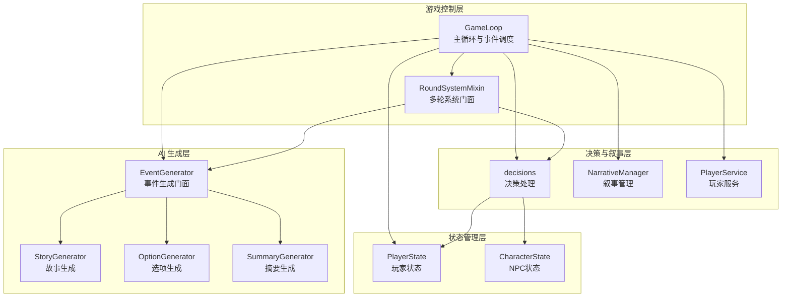
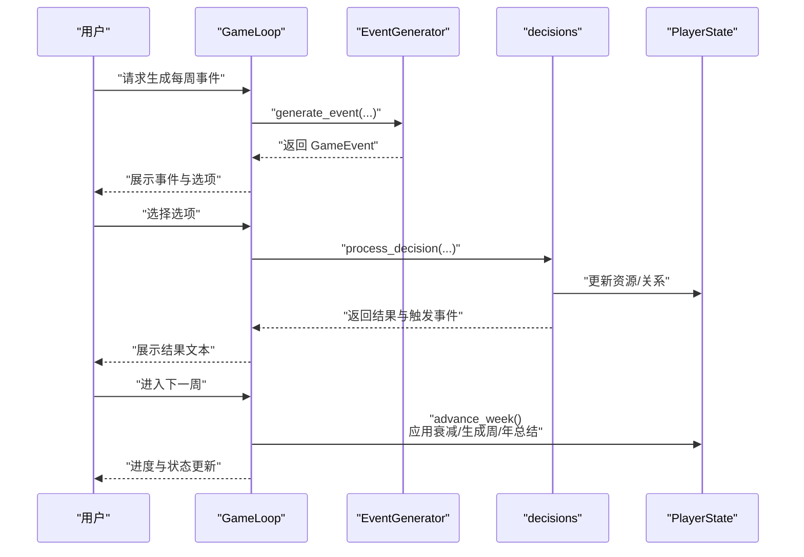
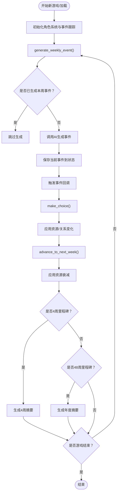
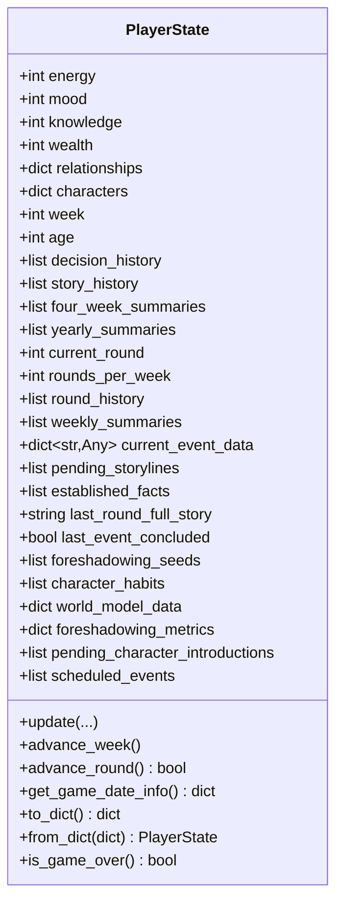
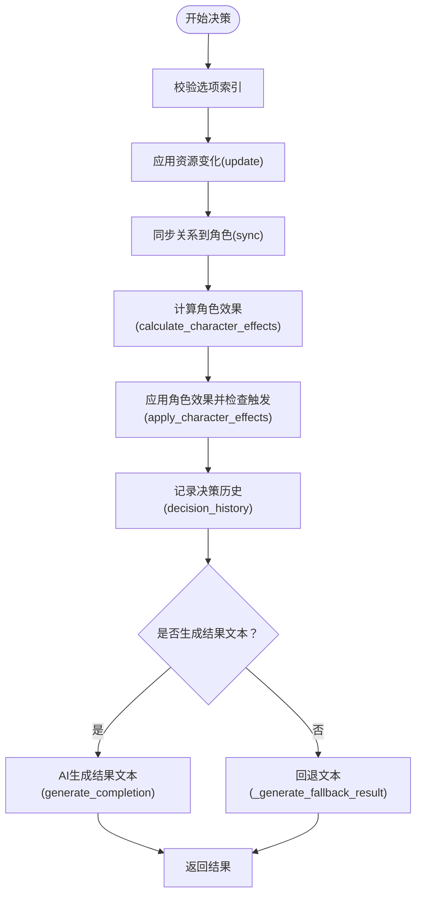
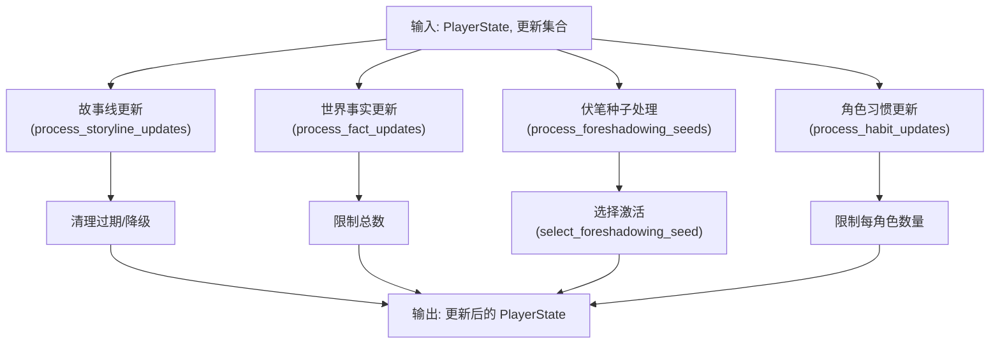
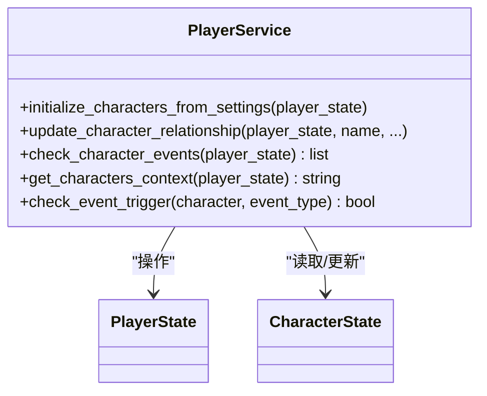
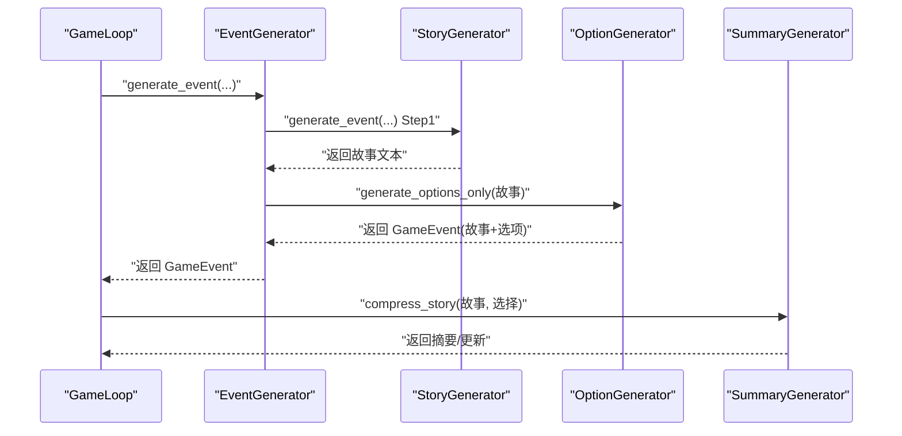
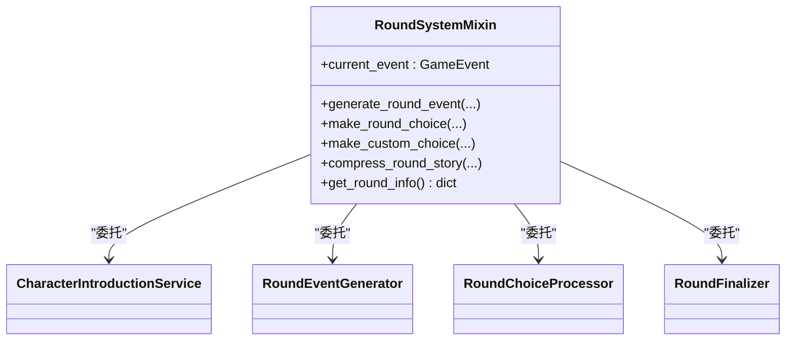
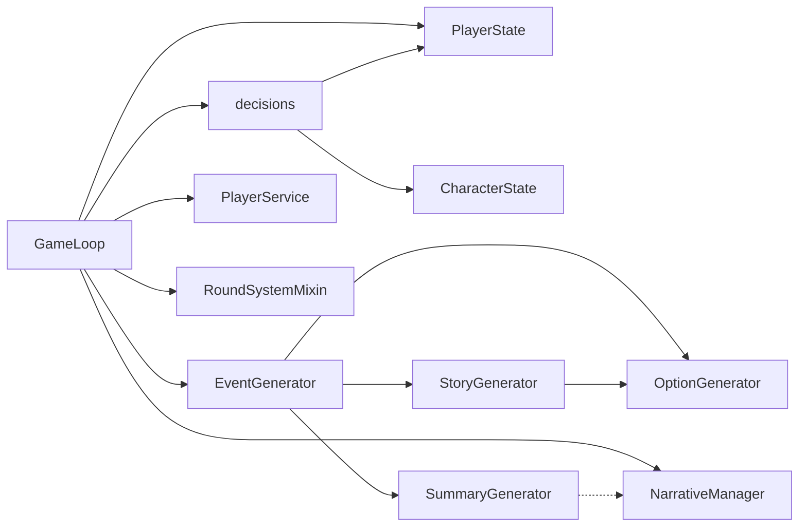

# 核心游戏系统

<cite>
**本文档引用的文件**
- [src/game/game_loop.py](file://src/game/game_loop.py)
- [src/game/state/player_state.py](file://src/game/state/player_state.py)
- [src/game/narrative_manager.py](file://src/game/narrative_manager.py)
- [src/game/player_service.py](file://src/game/player_service.py)
- [src/game/decisions.py](file://src/game/decisions.py)
- [src/ai/generator.py](file://src/ai/generator.py)
- [src/ai/story_generator.py](file://src/ai/story_generator.py)
- [src/ai/option_generator.py](file://src/ai/option_generator.py)
- [src/ai/summary_generator.py](file://src/ai/summary_generator.py)
- [src/game/round/system_mixin.py](file://src/game/round/system_mixin.py)
- [config/settings.py](file://config/settings.py)
- [src/game/state/character_state.py](file://src/game/state/character_state.py)
</cite>

## 目录
1. [简介](#简介)
2. [项目结构](#项目结构)
3. [核心组件](#核心组件)
4. [架构总览](#架构总览)
5. [详细组件分析](#详细组件分析)
6. [依赖关系分析](#依赖关系分析)
7. [性能考量](#性能考量)
8. [故障排查指南](#故障排查指南)
9. [结论](#结论)
10. [附录](#附录)

## 简介
本文件面向“人生草稿本”的核心游戏系统，围绕以下目标展开：
- 深入解释 GameLoop 类的工作原理：游戏循环机制、事件调度与状态管理
- 详述 PlayerState 状态管理系统的实现：四维资源系统（能量、情绪、知识、财富）的计算与平衡
- 阐明决策处理流程：从事件生成到结果评估的完整链路
- 解释 NarrativeManager 的叙事状态管理：故事线维护与事实更新机制
- 说明 PlayerService 的玩家服务与数据持久化策略
- 提供具体代码示例路径、配置项与使用模式
- 说明组件间关系与集成方式
- 给出常见问题与解决方案

## 项目结构
核心代码位于 src/game 与 src/ai 目录，采用“分层+职责分离”的设计：
- 游戏控制层：GameLoop（主循环）、RoundSystemMixin（多轮系统门面）
- 状态管理层：PlayerState（玩家状态）、CharacterState（NPC状态）
- 决策与叙事层：decisions（决策处理）、narrative_manager（叙事管理）
- AI 生成层：generator（事件生成门面）、story_generator（故事生成）、option_generator（选项生成）、summary_generator（摘要生成）

图表来源
- [src/game/game_loop.py](file://src/game/game_loop.py#L25-L592)
- [src/game/round/system_mixin.py](file://src/game/round/system_mixin.py#L34-L255)
- [src/game/state/player_state.py](file://src/game/state/player_state.py#L15-L590)
- [src/game/state/character_state.py](file://src/game/state/character_state.py#L13-L243)
- [src/game/decisions.py](file://src/game/decisions.py#L135-L241)
- [src/game/narrative_manager.py](file://src/game/narrative_manager.py#L15-L584)
- [src/game/player_service.py](file://src/game/player_service.py#L9-L176)
- [src/ai/generator.py](file://src/ai/generator.py#L30-L497)
- [src/ai/story_generator.py](file://src/ai/story_generator.py#L24-L439)
- [src/ai/option_generator.py](file://src/ai/option_generator.py#L17-L264)
- [src/ai/summary_generator.py](file://src/ai/summary_generator.py#L17-L589)

章节来源
- [src/game/game_loop.py](file://src/game/game_loop.py#L25-L160)
- [src/game/round/system_mixin.py](file://src/game/round/system_mixin.py#L34-L100)

## 核心组件
- GameLoop：负责每周事件生成、决策处理、周推进与总结生成；继承自 RoundSystemMixin，提供多轮系统门面
- PlayerState：集中管理玩家四维资源、时间进度、决策历史、角色系统、叙事相关数据（故事线、事实、伏笔、习惯、世界模型等）
- decisions：处理玩家选择，应用资源变化与角色关系变化，生成结果文本
- NarrativeManager：处理故事线、世界事实、伏笔种子、角色习惯的增删改与清理
- PlayerService：封装复杂业务逻辑（角色初始化、关系更新、事件触发检查、角色上下文生成）
- EventGenerator/StoryGenerator/OptionGenerator/SummaryGenerator：AI 生成门面与子服务，负责故事、选项、摘要的生成与验证
- RoundSystemMixin：多轮系统门面，统一对外接口，内部委托给专门的服务类

章节来源
- [src/game/game_loop.py](file://src/game/game_loop.py#L25-L160)
- [src/game/state/player_state.py](file://src/game/state/player_state.py#L15-L122)
- [src/game/decisions.py](file://src/game/decisions.py#L135-L241)
- [src/game/narrative_manager.py](file://src/game/narrative_manager.py#L15-L96)
- [src/game/player_service.py](file://src/game/player_service.py#L9-L104)
- [src/ai/generator.py](file://src/ai/generator.py#L30-L66)
- [src/ai/story_generator.py](file://src/ai/story_generator.py#L24-L86)
- [src/ai/option_generator.py](file://src/ai/option_generator.py#L17-L53)
- [src/ai/summary_generator.py](file://src/ai/summary_generator.py#L17-L48)
- [src/game/round/system_mixin.py](file://src/game/round/system_mixin.py#L34-L84)

## 架构总览
下面以序列图展示一次完整的游戏循环流程：事件生成 → 决策处理 → 状态更新 → 周推进与总结。

图表来源
- [src/game/game_loop.py](file://src/game/game_loop.py#L161-L358)
- [src/ai/generator.py](file://src/ai/generator.py#L211-L268)
- [src/game/decisions.py](file://src/game/decisions.py#L135-L241)
- [src/game/state/player_state.py](file://src/game/state/player_state.py#L197-L218)

## 详细组件分析

### GameLoop：游戏循环与事件调度
- 初始化与语言、AI 生成器、回调注入
- 新游戏启动与加载：恢复角色系统、事件状态、年界与周事件跟踪
- 事件生成：按周生成，支持里程碑事件、4周/年摘要上下文、回退事件
- 决策处理：转换选项为字典、调用决策处理器、清理当前事件
- 周推进：保存故事、应用资源衰减、生成4周/年摘要、判定游戏结束
- 用户触发摘要：按 N 周生成摘要
- 资源衰减：低能量/低情绪时自动衰减
- 进度查询：周数、总周数、年龄、百分比

图表来源
- [src/game/game_loop.py](file://src/game/game_loop.py#L69-L159)
- [src/game/game_loop.py](file://src/game/game_loop.py#L161-L264)
- [src/game/game_loop.py](file://src/game/game_loop.py#L266-L358)
- [src/game/game_loop.py](file://src/game/game_loop.py#L360-L444)
- [src/game/game_loop.py](file://src/game/game_loop.py#L445-L447)

章节来源
- [src/game/game_loop.py](file://src/game/game_loop.py#L25-L160)
- [src/game/game_loop.py](file://src/game/game_loop.py#L161-L264)
- [src/game/game_loop.py](file://src/game/game_loop.py#L266-L358)
- [src/game/game_loop.py](file://src/game/game_loop.py#L360-L444)
- [src/game/game_loop.py](file://src/game/game_loop.py#L445-L447)
- [src/game/game_loop.py](file://src/game/game_loop.py#L506-L570)
- [src/game/game_loop.py](file://src/game/game_loop.py#L571-L592)

### PlayerState：四维资源系统与状态管理
- 四维资源：能量、情绪、知识、财富（上限/下限约束）
- 时间与阶段：周数、年龄、生命阶段（早起/建立/成长/巩固）
- 决策历史与故事历史：记录每回合事件与选择
- 多轮系统：当前轮次、每周轮次数、轮次历史、周总结
- 叙事数据：未完结故事线、已建立事实、伏笔种子、角色习惯、世界模型数据、预定事件
- 角色系统：NPC 字典、关系映射、角色初始化、关系同步
- 更新与推进：update、advance_week、advance_round、日期信息构建
- 校验与边界：validate、范围校验

图表来源
- [src/game/state/player_state.py](file://src/game/state/player_state.py#L15-L122)
- [src/game/state/player_state.py](file://src/game/state/player_state.py#L159-L196)
- [src/game/state/player_state.py](file://src/game/state/player_state.py#L197-L218)
- [src/game/state/player_state.py](file://src/game/state/player_state.py#L239-L273)
- [src/game/state/player_state.py](file://src/game/state/player_state.py#L340-L347)
- [src/game/state/player_state.py](file://src/game/state/player_state.py#L349-L353)

章节来源
- [src/game/state/player_state.py](file://src/game/state/player_state.py#L15-L122)
- [src/game/state/player_state.py](file://src/game/state/player_state.py#L159-L196)
- [src/game/state/player_state.py](file://src/game/state/player_state.py#L197-L218)
- [src/game/state/player_state.py](file://src/game/state/player_state.py#L239-L273)
- [src/game/state/player_state.py](file://src/game/state/player_state.py#L340-L353)

### 决策处理流程：从事件到结果
- 输入：事件描述、选项索引、选项列表（含效果）、语言、AI 生成器
- 步骤：
  - 校验选项索引
  - 应用资源变化（能量/情绪/知识/财富/关系）
  - 同步关系至角色字典
  - 计算角色效果（关系变化→亲密度/信任/尊重/情绪）
  - 应用角色效果并检查触发事件
  - 记录决策历史
  - 生成结果文本（AI 或回退）
- 输出：结果文本、应用的效果、是否成功、触发的特殊事件

图表来源
- [src/game/decisions.py](file://src/game/decisions.py#L135-L241)
- [src/game/decisions.py](file://src/game/decisions.py#L14-L61)
- [src/game/decisions.py](file://src/game/decisions.py#L63-L108)
- [src/game/decisions.py](file://src/game/decisions.py#L243-L271)

章节来源
- [src/game/decisions.py](file://src/game/decisions.py#L135-L241)
- [src/game/decisions.py](file://src/game/decisions.py#L14-L61)
- [src/game/decisions.py](file://src/game/decisions.py#L63-L108)
- [src/game/decisions.py](file://src/game/decisions.py#L243-L271)

### NarrativeManager：叙事状态管理
- 故事线更新：新增/解决/延续；按周清理与降级
- 世界事实更新：新增/更新/移除；限制总数
- 伏笔种子选择：成熟度概率、权重、上下文匹配、激活与回收距离统计
- 伏笔种子处理：新增去重、清理激活/过期、限制数量
- 角色习惯更新：新增/强化/弱化/移除/变更；限制每角色数量

图表来源
- [src/game/narrative_manager.py](file://src/game/narrative_manager.py#L22-L96)
- [src/game/narrative_manager.py](file://src/game/narrative_manager.py#L101-L182)
- [src/game/narrative_manager.py](file://src/game/narrative_manager.py#L187-L285)
- [src/game/narrative_manager.py](file://src/game/narrative_manager.py#L291-L415)
- [src/game/narrative_manager.py](file://src/game/narrative_manager.py#L420-L584)

章节来源
- [src/game/narrative_manager.py](file://src/game/narrative_manager.py#L15-L96)
- [src/game/narrative_manager.py](file://src/game/narrative_manager.py#L97-L182)
- [src/game/narrative_manager.py](file://src/game/narrative_manager.py#L183-L285)
- [src/game/narrative_manager.py](file://src/game/narrative_manager.py#L286-L415)
- [src/game/narrative_manager.py](file://src/game/narrative_manager.py#L416-L584)

### PlayerService：玩家服务与角色管理
- 从角色设置初始化角色系统，保留既有关系值
- 更新角色关系属性（亲密度/信任/尊重/情绪），记录互动摘要
- 检查角色特殊事件触发（深度友谊/冲突/求助/秘密分享/背叛风险等）
- 生成角色上下文字符串，供 AI 使用

图表来源
- [src/game/player_service.py](file://src/game/player_service.py#L9-L104)
- [src/game/player_service.py](file://src/game/player_service.py#L105-L130)
- [src/game/player_service.py](file://src/game/player_service.py#L131-L151)
- [src/game/player_service.py](file://src/game/player_service.py#L152-L176)
- [src/game/state/character_state.py](file://src/game/state/character_state.py#L13-L121)

章节来源
- [src/game/player_service.py](file://src/game/player_service.py#L9-L104)
- [src/game/player_service.py](file://src/game/player_service.py#L105-L130)
- [src/game/player_service.py](file://src/game/player_service.py#L131-L151)
- [src/game/player_service.py](file://src/game/player_service.py#L152-L176)
- [src/game/state/character_state.py](file://src/game/state/character_state.py#L13-L121)

### AI 生成器与摘要：两阶段流水线
- EventGenerator（门面）：聚合 StoryGenerator、OptionGenerator、SummaryGenerator、StoryRewriter
- StoryGenerator：故事文本生成（两阶段流水线第一步），支持一致性校验与重试
- OptionGenerator：基于故事生成选项，校验关系名、质量检查
- SummaryGenerator：故事压缩、周/4周/年摘要生成、世界状态抽取

图表来源
- [src/ai/generator.py](file://src/ai/generator.py#L211-L268)
- [src/ai/story_generator.py](file://src/ai/story_generator.py#L32-L191)
- [src/ai/option_generator.py](file://src/ai/option_generator.py#L25-L133)
- [src/ai/summary_generator.py](file://src/ai/summary_generator.py#L25-L141)

章节来源
- [src/ai/generator.py](file://src/ai/generator.py#L30-L66)
- [src/ai/generator.py](file://src/ai/generator.py#L211-L268)
- [src/ai/story_generator.py](file://src/ai/story_generator.py#L32-L191)
- [src/ai/option_generator.py](file://src/ai/option_generator.py#L25-L133)
- [src/ai/summary_generator.py](file://src/ai/summary_generator.py#L25-L141)

### 多轮系统门面：RoundSystemMixin
- 作为 GameLoop 的 mixin，提供对外一致接口
- 内部委托：
  - CharacterIntroductionService：角色生成与引入
  - RoundEventGenerator：轮次事件生成
  - RoundChoiceProcessor：轮次选择处理
  - RoundFinalizer：周终总结与压缩
- 属性与方法代理 current_event、generate_round_event、make_round_choice、compress_round_story 等

图表来源
- [src/game/round/system_mixin.py](file://src/game/round/system_mixin.py#L34-L84)
- [src/game/round/system_mixin.py](file://src/game/round/system_mixin.py#L87-L255)

章节来源
- [src/game/round/system_mixin.py](file://src/game/round/system_mixin.py#L34-L100)
- [src/game/round/system_mixin.py](file://src/game/round/system_mixin.py#L101-L255)

## 依赖关系分析
- GameLoop 依赖 PlayerState、EventGenerator、decisions、NarrativeManager、PlayerService、RoundSystemMixin
- decisions 依赖 PlayerState、CharacterState、AI 生成器（可选）
- EventGenerator 依赖 StoryGenerator、OptionGenerator、SummaryGenerator、AIClient、缓存
- StoryGenerator 依赖 OptionGenerator、AIClient、一致性校验器
- SummaryGenerator 依赖 AIClient、提示词模板
- RoundSystemMixin 依赖多个轮次专用服务

图表来源
- [src/game/game_loop.py](file://src/game/game_loop.py#L25-L64)
- [src/game/decisions.py](file://src/game/decisions.py#L1-L10)
- [src/ai/generator.py](file://src/ai/generator.py#L30-L66)
- [src/ai/story_generator.py](file://src/ai/story_generator.py#L24-L29)
- [src/ai/option_generator.py](file://src/ai/option_generator.py#L17-L22)
- [src/ai/summary_generator.py](file://src/ai/summary_generator.py#L17-L22)
- [src/game/narrative_manager.py](file://src/game/narrative_manager.py#L15-L16)

章节来源
- [src/game/game_loop.py](file://src/game/game_loop.py#L25-L64)
- [src/game/decisions.py](file://src/game/decisions.py#L1-L10)
- [src/ai/generator.py](file://src/ai/generator.py#L30-L66)
- [src/ai/story_generator.py](file://src/ai/story_generator.py#L24-L29)
- [src/ai/option_generator.py](file://src/ai/option_generator.py#L17-L22)
- [src/ai/summary_generator.py](file://src/ai/summary_generator.py#L17-L22)
- [src/game/narrative_manager.py](file://src/game/narrative_manager.py#L15-L16)

## 性能考量
- 事件生成与选项生成采用两阶段流水线，先生成故事再生成选项，减少重复计算
- 一致性校验仅在世界模型约束启用时进行，且仅对关键问题重试一次，避免过度重试
- 缓存机制：EventCache 可缓存事件，减少重复生成
- 温度策略：故事生成采用渐进式温度降低，提高稳定性
- 并行摘要：Narrative 与 World Extraction 可并行执行，缩短周终处理时间
- 资源衰减：低阈值自动衰减，避免资源无限增长导致的数值膨胀

## 故障排查指南
- 事件生成失败：检查 AI 密钥与模型配置、网络连通性；查看日志中的错误堆栈；使用回退事件保障体验
- 选项格式异常：OptionGenerator 对 JSON 解析失败时会回退默认选项；检查提示词与模型输出稳定性
- 一致性校验失败：StoryGenerator 在检测到关键矛盾时会重试；前端可通过状态回调感知“重试”过程
- 状态越界：PlayerState.validate 会在资源/周数/年龄异常时抛错；检查 update 参数与边界
- 伏笔/事实过多：NarrativeManager 会对伏笔与事实进行清理与限制，避免内存膨胀
- 多轮系统初始化：若缺失属性，RoundFinalizer 会进行检查与修复

章节来源
- [src/ai/generator.py](file://src/ai/generator.py#L131-L147)
- [src/ai/story_generator.py](file://src/ai/story_generator.py#L334-L426)
- [src/ai/option_generator.py](file://src/ai/option_generator.py#L118-L133)
- [src/game/state/player_state.py](file://src/game/state/player_state.py#L318-L338)
- [src/game/narrative_manager.py](file://src/game/narrative_manager.py#L378-L415)
- [src/game/round/system_mixin.py](file://src/game/round/system_mixin.py#L244-L255)

## 结论
本系统通过清晰的分层与职责分离，实现了稳定、可扩展的核心游戏循环。GameLoop 作为协调者，结合 PlayerState 的集中状态管理、decisions 的严谨决策处理、NarrativeManager 的叙事维护、PlayerService 的角色业务逻辑，以及 EventGenerator/StoryGenerator/OptionGenerator/SummaryGenerator 的 AI 生成流水线，形成了从事件生成到结果评估、从资源管理到叙事演进的完整闭环。多轮系统门面进一步提升了接口一致性与可维护性。

## 附录
- 配置项与默认值（节选）
  - 语言与缓存：DEFAULT_LANGUAGE、CACHE_EVENTS
  - 游戏常量：STARTING_AGE、ENDING_AGE、WEEKS_PER_YEAR、TOTAL_WEEKS
  - 初始资源：INITIAL_ENERGY、INITIAL_MOOD、INITIAL_KNOWLEDGE、INITIAL_WEALTH
  - 资源边界：MIN_RESOURCE、MAX_RESOURCE、MAX_WEALTH
  - 衰减：ENERGY_DECAY、MOOD_DECAY
  - 多轮系统：ROUNDS_PER_WEEK、MILESTONE_WEEKS
  - 生成超时：GENERATION_TIMEOUT
  - 数据库：DATABASE_URL、DATABASE_PATH

章节来源
- [config/settings.py](file://config/settings.py#L70-L168)