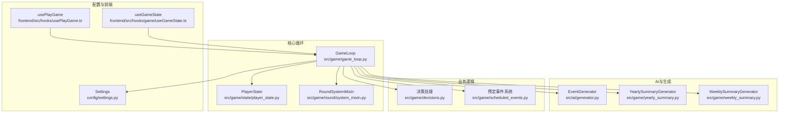
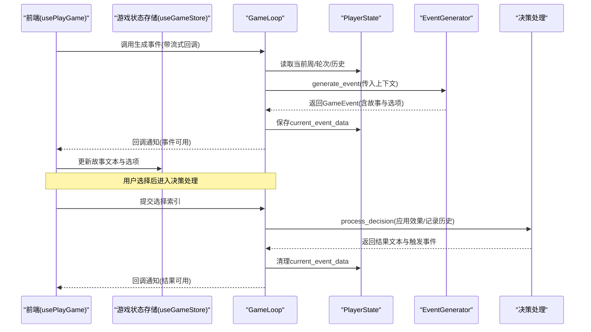
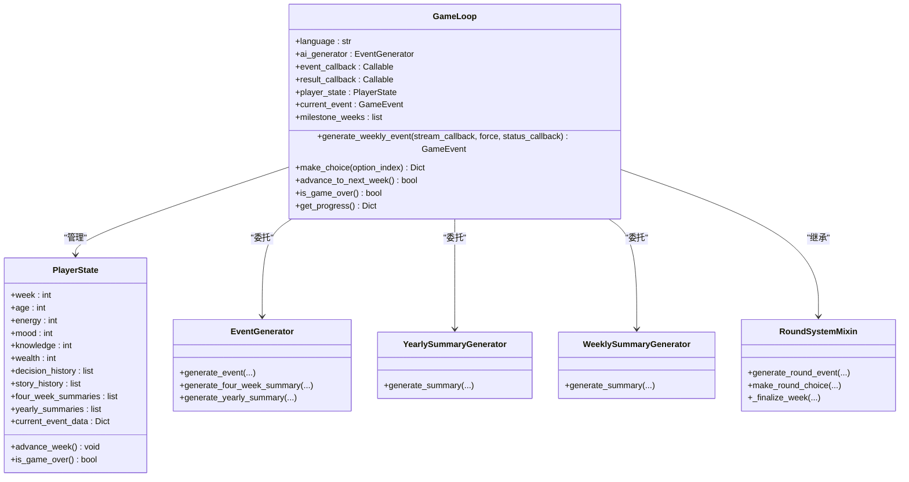
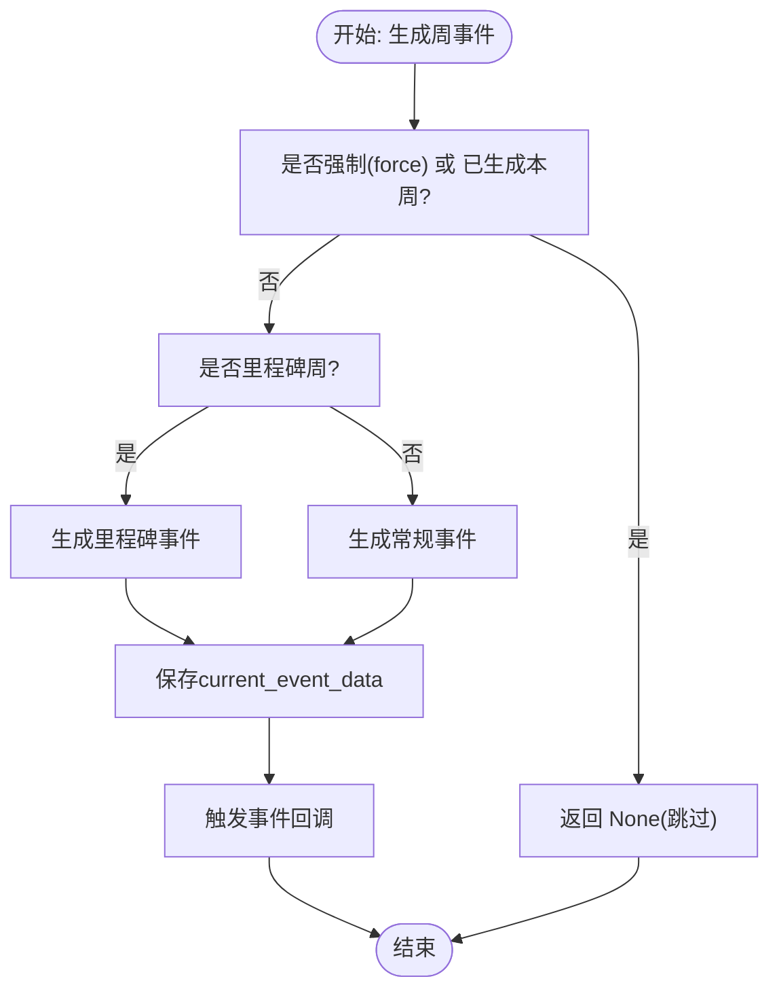
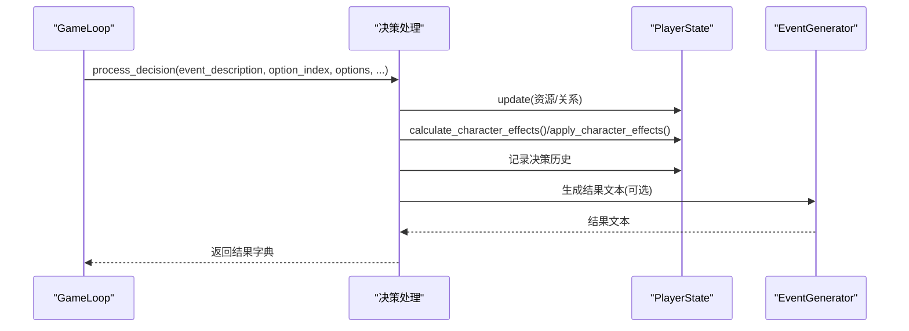
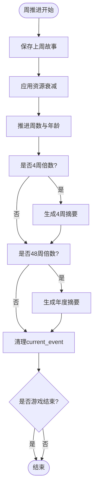
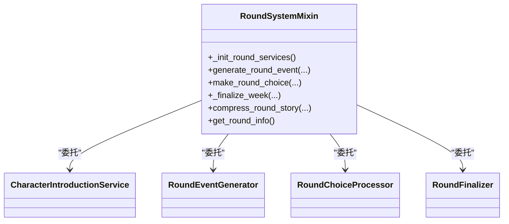
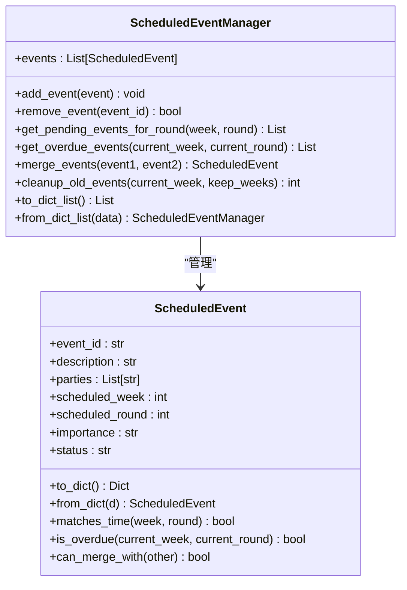
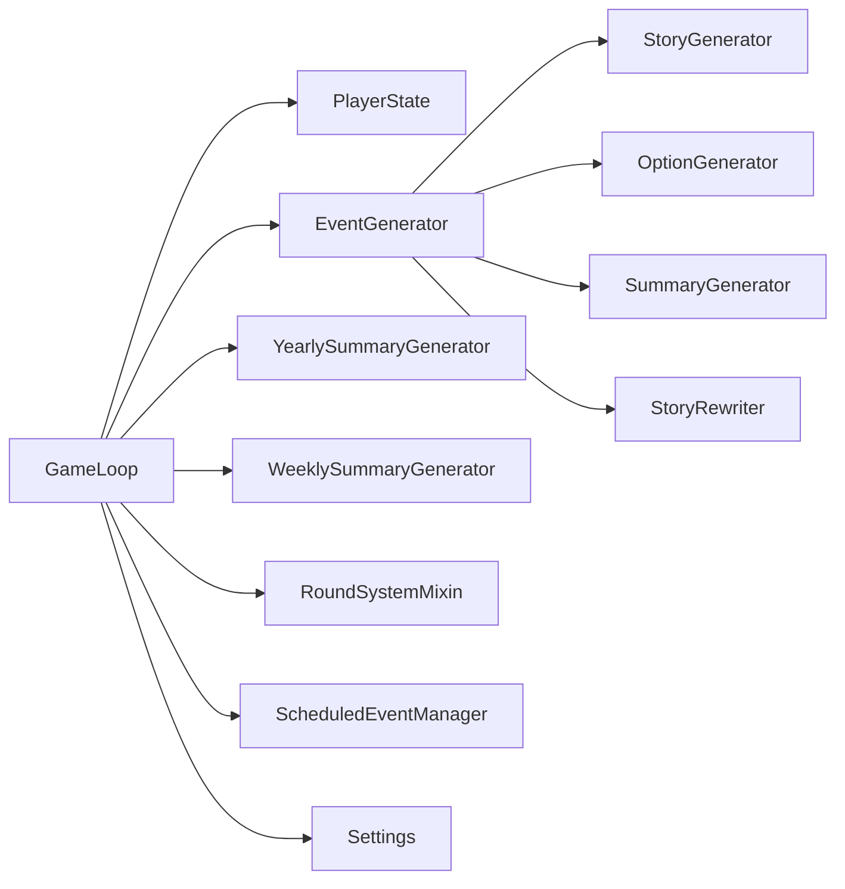

# 游戏循环机制

<cite>
**本文档引用的文件**
- [src/game/game_loop.py](file://src/game/game_loop.py)
- [src/game/state/player_state.py](file://src/game/state/player_state.py)
- [src/ai/generator.py](file://src/ai/generator.py)
- [src/game/decisions.py](file://src/game/decisions.py)
- [src/game/yearly_summary.py](file://src/game/yearly_summary.py)
- [src/game/weekly_summary.py](file://src/game/weekly_summary.py)
- [src/game/scheduled_events.py](file://src/game/scheduled_events.py)
- [src/game/round/system_mixin.py](file://src/game/round/system_mixin.py)
- [config/settings.py](file://config/settings.py)
- [tests/test_game_loop.py](file://tests/test_game_loop.py)
- [frontend/src/hooks/usePlayGame.ts](file://frontend/src/hooks/usePlayGame.ts)
- [frontend/src/hooks/game/useGameState.ts](file://frontend/src/hooks/game/useGameState.ts)
</cite>

## 目录
1. [引言](#引言)
2. [项目结构](#项目结构)
3. [核心组件](#核心组件)
4. [架构总览](#架构总览)
5. [详细组件分析](#详细组件分析)
6. [依赖关系分析](#依赖关系分析)
7. [性能考虑](#性能考虑)
8. [故障排除指南](#故障排除指南)
9. [结论](#结论)
10. [附录](#附录)

## 引言
本文件面向希望深入理解“游戏循环机制”的开发者与产品人员，系统性阐述 GameLoop 类的工作原理、事件调度机制、状态管理流程、里程碑事件与每周事件生成策略、进度推进与结束判定、异常处理与回调机制，并给出与 AI 生成器、状态管理器、回合系统等组件的交互关系图与实践建议。文档同时提供基于仓库实际代码的可视化图示与定位路径，便于快速查阅与落地实施。

## 项目结构
围绕游戏循环的关键模块分布如下：
- 核心循环与状态：src/game/game_loop.py、src/game/state/player_state.py
- AI 事件生成：src/ai/generator.py
- 决策与结果：src/game/decisions.py
- 总结生成：src/game/yearly_summary.py、src/game/weekly_summary.py
- 回合系统：src/game/round/system_mixin.py
- 预定事件：src/game/scheduled_events.py
- 配置：config/settings.py
- 前端集成：frontend/src/hooks/usePlayGame.ts、frontend/src/hooks/game/useGameState.ts
- 测试：tests/test_game_loop.py

图表来源
- [src/game/game_loop.py](file://src/game/game_loop.py#L25-L68)
- [src/game/state/player_state.py](file://src/game/state/player_state.py#L15-L122)
- [src/ai/generator.py](file://src/ai/generator.py#L30-L66)
- [src/game/decisions.py](file://src/game/decisions.py#L135-L240)
- [src/game/yearly_summary.py](file://src/game/yearly_summary.py#L11-L24)
- [src/game/weekly_summary.py](file://src/game/weekly_summary.py#L11-L24)
- [src/game/scheduled_events.py](file://src/game/scheduled_events.py#L19-L53)
- [src/game/round/system_mixin.py](file://src/game/round/system_mixin.py#L34-L83)
- [config/settings.py](file://config/settings.py#L70-L106)
- [frontend/src/hooks/usePlayGame.ts](file://frontend/src/hooks/usePlayGame.ts#L26-L127)
- [frontend/src/hooks/game/useGameState.ts](file://frontend/src/hooks/game/useGameState.ts#L40-L106)

章节来源
- [src/game/game_loop.py](file://src/game/game_loop.py#L25-L68)
- [src/game/state/player_state.py](file://src/game/state/player_state.py#L15-L122)
- [src/ai/generator.py](file://src/ai/generator.py#L30-L66)
- [src/game/decisions.py](file://src/game/decisions.py#L135-L240)
- [src/game/yearly_summary.py](file://src/game/yearly_summary.py#L11-L24)
- [src/game/weekly_summary.py](file://src/game/weekly_summary.py#L11-L24)
- [src/game/scheduled_events.py](file://src/game/scheduled_events.py#L19-L53)
- [src/game/round/system_mixin.py](file://src/game/round/system_mixin.py#L34-L83)
- [config/settings.py](file://config/settings.py#L70-L106)
- [frontend/src/hooks/usePlayGame.ts](file://frontend/src/hooks/usePlayGame.ts#L26-L127)
- [frontend/src/hooks/game/useGameState.ts](file://frontend/src/hooks/game/useGameState.ts#L40-L106)

## 核心组件
- GameLoop：主循环控制器，负责事件生成、决策处理、周推进、里程碑与周期性总结、状态持久化与回调通知。
- PlayerState：玩家状态容器，维护资源、时间、角色、历史、总结、预定事件等。
- EventGenerator：AI 事件生成门面，封装故事生成、选项生成、摘要生成与重写。
- 决策处理：根据选项效果更新玩家与角色状态，生成结果文本，触发角色特事件。
- Yearly/WeeklySummaryGenerator：周期性总结生成器。
- RoundSystemMixin：回合系统门面，解耦多轮次流程，委托给专用服务类。
- ScheduledEvents：预定事件系统，保证承诺在指定轮次强制触发。
- Settings：全局配置，含里程碑周、衰减、轮次等常量。

章节来源
- [src/game/game_loop.py](file://src/game/game_loop.py#L25-L68)
- [src/game/state/player_state.py](file://src/game/state/player_state.py#L15-L122)
- [src/ai/generator.py](file://src/ai/generator.py#L30-L66)
- [src/game/decisions.py](file://src/game/decisions.py#L135-L240)
- [src/game/yearly_summary.py](file://src/game/yearly_summary.py#L11-L24)
- [src/game/weekly_summary.py](file://src/game/weekly_summary.py#L11-L24)
- [src/game/round/system_mixin.py](file://src/game/round/system_mixin.py#L34-L83)
- [src/game/scheduled_events.py](file://src/game/scheduled_events.py#L19-L53)
- [config/settings.py](file://config/settings.py#L70-L106)

## 架构总览
下面的时序图展示了从前端发起“生成事件”到“显示选项”的完整调用链路，以及 GameLoop 如何与 AI 生成器、状态管理器协作。

图表来源
- [frontend/src/hooks/usePlayGame.ts](file://frontend/src/hooks/usePlayGame.ts#L129-L154)
- [frontend/src/hooks/game/useGameState.ts](file://frontend/src/hooks/game/useGameState.ts#L108-L143)
- [src/game/game_loop.py](file://src/game/game_loop.py#L161-L264)
- [src/ai/generator.py](file://src/ai/generator.py#L211-L268)
- [src/game/decisions.py](file://src/game/decisions.py#L135-L240)

## 详细组件分析

### GameLoop 类：主循环与事件调度
- 初始化与依赖注入
  - 接受语言、AI 生成器、事件/结果回调，内部组合 PlayerState、AI 生成器、故事服务、关系服务、世界模型更新器、历史摘要选择器等。
  - 里程碑周来自配置，支持强制生成与超时保护。
- 新局与加载
  - start_new_game：构建初始 PlayerState，按设置初始化角色，重置事件跟踪。
  - load_game：从持久化状态重建 PlayerState，恢复 current_event，重建年边界与周事件跟踪。
- 事件生成
  - generate_weekly_event：按周生成事件，优先检查里程碑周；若未强制，避免重复生成；支持流式回调与状态回调；异常时回退为简单事件。
  - 里程碑事件：预留 _generate_milestone_event，当前返回 None，可扩展预设事件。
- 决策与结果
  - make_choice：校验当前周已有事件，转换选项格式，调用 process_decision 应用效果并生成结果文本，回调通知。
- 周推进与总结
  - advance_to_next_week：保存上一周故事，应用资源衰减，推进周数，按 4 周/48 周生成周期性总结，清理 current_event，检测游戏结束。
  - _generate_four_week_summary/_generate_yearly_summary：聚合历史生成周期总结。
- 其他能力
  - generate_summary：用户触发的 N 周回顾摘要。
  - _generate_fallback_event：AI 失败时的兜底事件。
  - is_game_over/get_progress：结束判定与进度查询。

图表来源
- [src/game/game_loop.py](file://src/game/game_loop.py#L25-L68)
- [src/game/state/player_state.py](file://src/game/state/player_state.py#L15-L122)
- [src/ai/generator.py](file://src/ai/generator.py#L211-L268)
- [src/game/yearly_summary.py](file://src/game/yearly_summary.py#L25-L83)
- [src/game/weekly_summary.py](file://src/game/weekly_summary.py#L25-L64)
- [src/game/round/system_mixin.py](file://src/game/round/system_mixin.py#L34-L83)

章节来源
- [src/game/game_loop.py](file://src/game/game_loop.py#L69-L159)
- [src/game/game_loop.py](file://src/game/game_loop.py#L161-L264)
- [src/game/game_loop.py](file://src/game/game_loop.py#L266-L358)
- [src/game/game_loop.py](file://src/game/game_loop.py#L360-L444)
- [src/game/game_loop.py](file://src/game/game_loop.py#L458-L570)
- [src/game/game_loop.py](file://src/game/game_loop.py#L571-L592)

### 事件生成与里程碑机制
- 周事件生成
  - 依据周数 last_event_week 与 force 参数决定是否生成；里程碑周优先。
  - 上下文包含最近 4 周摘要、年度摘要（随机概率）、日期信息、未完结事件、世界模型种子等。
- 里程碑事件
  - settings.MILESTONE_WEEKS 定义里程碑周；当前实现预留 _generate_milestone_event，可扩展预设事件。
- 回退策略
  - AI 生成失败时，_generate_fallback_event 生成简单事件，保障体验连续性。

图表来源
- [src/game/game_loop.py](file://src/game/game_loop.py#L161-L264)
- [config/settings.py](file://config/settings.py#L102)

章节来源
- [src/game/game_loop.py](file://src/game/game_loop.py#L161-L264)
- [config/settings.py](file://config/settings.py#L102)

### 决策处理与状态变更
- 输入：事件描述、选项索引、选项列表（含效果）、语言、AI 生成器。
- 处理流程：
  - 校验索引有效性。
  - 应用资源变化与关系变化至 PlayerState。
  - 计算角色效果并调用角色关系服务，检查触发特殊事件。
  - 记录决策历史，生成结果文本（可回退）。
  - 返回结果文本、应用效果、触发事件列表。

图表来源
- [src/game/decisions.py](file://src/game/decisions.py#L135-L240)
- [src/game/game_loop.py](file://src/game/game_loop.py#L266-L307)

章节来源
- [src/game/decisions.py](file://src/game/decisions.py#L135-L240)
- [src/game/game_loop.py](file://src/game/game_loop.py#L266-L307)

### 周推进与周期性总结
- advance_to_next_week：
  - 保存上周故事，应用资源衰减，推进周数与年龄。
  - 每 4 周生成一次 4 周摘要；每 48 周生成一次年度摘要。
  - 清理 current_event，检测游戏结束。
- 摘要生成器：
  - YearlySummaryGenerator/WeeklySummaryGenerator 分别按年/周聚合历史与决策，生成总结文本。

图表来源
- [src/game/game_loop.py](file://src/game/game_loop.py#L309-L358)
- [src/game/game_loop.py](file://src/game/game_loop.py#L360-L444)
- [src/game/yearly_summary.py](file://src/game/yearly_summary.py#L25-L83)
- [src/game/weekly_summary.py](file://src/game/weekly_summary.py#L25-L64)

章节来源
- [src/game/game_loop.py](file://src/game/game_loop.py#L309-L358)
- [src/game/game_loop.py](file://src/game/game_loop.py#L360-L444)
- [src/game/yearly_summary.py](file://src/game/yearly_summary.py#L25-L83)
- [src/game/weekly_summary.py](file://src/game/weekly_summary.py#L25-L64)

### 回合系统与多轮次交互
- RoundSystemMixin 将复杂流程拆分为：
  - CharacterIntroductionService：角色引入
  - RoundEventGenerator：回合事件生成
  - RoundChoiceProcessor：回合选择处理
  - RoundFinalizer：周终总结与压缩
- GameLoop 继承 RoundSystemMixin，通过属性代理与初始化方法委派到具体服务，保持对外接口稳定。

图表来源
- [src/game/round/system_mixin.py](file://src/game/round/system_mixin.py#L34-L83)
- [src/game/round/system_mixin.py](file://src/game/round/system_mixin.py#L101-L112)
- [src/game/round/system_mixin.py](file://src/game/round/system_mixin.py#L154-L184)
- [src/game/round/system_mixin.py](file://src/game/round/system_mixin.py#L188-L196)

章节来源
- [src/game/round/system_mixin.py](file://src/game/round/system_mixin.py#L34-L83)
- [src/game/round/system_mixin.py](file://src/game/round/system_mixin.py#L101-L112)
- [src/game/round/system_mixin.py](file://src/game/round/system_mixin.py#L154-L184)
- [src/game/round/system_mixin.py](file://src/game/round/system_mixin.py#L188-L196)

### 预定事件系统
- ScheduledEvent：描述承诺事件，包含时间点、重要度、状态、合并信息等。
- ScheduledEventManager：管理预定事件的增删查、过期检查、合并与清理。
- 与 PlayerState 的集成：通过 scheduled_events 字段持久化，提供查询与同步方法。

图表来源
- [src/game/scheduled_events.py](file://src/game/scheduled_events.py#L19-L53)
- [src/game/scheduled_events.py](file://src/game/scheduled_events.py#L280-L426)

章节来源
- [src/game/scheduled_events.py](file://src/game/scheduled_events.py#L19-L53)
- [src/game/scheduled_events.py](file://src/game/scheduled_events.py#L280-L426)

### 前端集成与交互
- usePlayGame：组合 usePhaseManager、useEventGenerator、useChoiceHandler、useGameState、useHistoryViewer，统一管理游戏阶段、事件生成、选择处理与历史查看。
- useGameState：封装保存、继续、调整与重新生成逻辑，支持 SSE 流式再生。
- 前端通过 store 与 GameLoop 协作，实现事件回调、结果回调与状态同步。

章节来源
- [frontend/src/hooks/usePlayGame.ts](file://frontend/src/hooks/usePlayGame.ts#L26-L127)
- [frontend/src/hooks/game/useGameState.ts](file://frontend/src/hooks/game/useGameState.ts#L40-L106)
- [frontend/src/hooks/game/useGameState.ts](file://frontend/src/hooks/game/useGameState.ts#L108-L143)
- [frontend/src/hooks/game/useGameState.ts](file://frontend/src/hooks/game/useGameState.ts#L150-L288)

## 依赖关系分析
- GameLoop 对 PlayerState、EventGenerator、Yearly/WeeklySummaryGenerator、RoundSystemMixin、ScheduledEvents、Settings 存在直接依赖。
- EventGenerator 作为门面，进一步委托 StoryGenerator、OptionGenerator、SummaryGenerator、StoryRewriter。
- 前端通过 usePlayGame/useGameState 间接调用 GameLoop，形成“前端-后端循环”的闭环。

图表来源
- [src/game/game_loop.py](file://src/game/game_loop.py#L25-L68)
- [src/ai/generator.py](file://src/ai/generator.py#L30-L66)
- [src/game/yearly_summary.py](file://src/game/yearly_summary.py#L11-L24)
- [src/game/weekly_summary.py](file://src/game/weekly_summary.py#L11-L24)
- [src/game/round/system_mixin.py](file://src/game/round/system_mixin.py#L34-L83)
- [src/game/scheduled_events.py](file://src/game/scheduled_events.py#L280-L426)
- [config/settings.py](file://config/settings.py#L70-L106)

章节来源
- [src/game/game_loop.py](file://src/game/game_loop.py#L25-L68)
- [src/ai/generator.py](file://src/ai/generator.py#L30-L66)

## 性能考虑
- 事件缓存：EventGenerator 支持缓存，GameLoop 在非强制模式下可复用缓存事件，减少重复调用。
- 并发与超时：GameLoop 内部有生成超时控制与并发生成标志，避免重复生成与长时间阻塞。
- 资源衰减：按周衰减低资源，降低极端状态下的生成复杂度。
- 周期性摘要：仅在 4 周/48 周触发，避免频繁 AI 调用。
- 前端流式渲染：前端使用 SSE 流式接收，缩短首屏等待时间。

章节来源
- [src/ai/generator.py](file://src/ai/generator.py#L55-L56)
- [src/game/game_loop.py](file://src/game/game_loop.py#L53-L56)
- [src/game/game_loop.py](file://src/game/game_loop.py#L445-L457)

## 故障排除指南
- 事件生成失败
  - 现象：generate_weekly_event 返回 None 或抛出异常。
  - 处理：触发 _generate_fallback_event；检查 AI 密钥与网络；查看日志中的异常类型与周数。
- 决策无效
  - 现象：make_choice 抛出索引无效。
  - 处理：确认前端选项索引与后端 options 数量一致；检查事件是否已加载。
- 游戏结束判定
  - 现象：advance_to_next_week 返回 False。
  - 处理：确认 settings.TOTAL_WEEKS；检查 PlayerState.week 是否达到上限。
- 前端会话丢失
  - 现象：SSE 重生成报 404。
  - 处理：useGameState 自动尝试恢复会话；若失败，引导刷新页面。

章节来源
- [src/game/game_loop.py](file://src/game/game_loop.py#L254-L264)
- [src/game/decisions.py](file://src/game/decisions.py#L163-L164)
- [src/game/state/player_state.py](file://src/game/state/player_state.py#L349-L352)
- [frontend/src/hooks/game/useGameState.ts](file://frontend/src/hooks/game/useGameState.ts#L230-L251)

## 结论
GameLoop 通过清晰的职责划分与门面设计，将复杂的事件生成、决策处理、周期性总结与回合系统解耦，既保证了扩展性，又维持了对外接口的稳定性。结合 AI 生成器、状态管理器与前端交互，形成了完整的“生成-选择-推进-总结”的循环机制。建议在里程碑事件、预定事件与世界模型更新方面持续增强，以提升叙事连贯性与玩家沉浸感。

## 附录

### 代码示例路径（不含具体代码内容）
- 初始化游戏循环与生成事件
  - [src/game/game_loop.py](file://src/game/game_loop.py#L69-L98)
  - [src/game/game_loop.py](file://src/game/game_loop.py#L161-L264)
- 处理玩家选择与应用效果
  - [src/game/decisions.py](file://src/game/decisions.py#L135-L240)
  - [src/game/game_loop.py](file://src/game/game_loop.py#L266-L307)
- 推进到下一周并生成周期性总结
  - [src/game/game_loop.py](file://src/game/game_loop.py#L309-L358)
  - [src/game/game_loop.py](file://src/game/game_loop.py#L360-L444)
- 周期性摘要生成器使用
  - [src/game/yearly_summary.py](file://src/game/yearly_summary.py#L25-L83)
  - [src/game/weekly_summary.py](file://src/game/weekly_summary.py#L25-L64)
- 前端集成与交互
  - [frontend/src/hooks/usePlayGame.ts](file://frontend/src/hooks/usePlayGame.ts#L129-L154)
  - [frontend/src/hooks/game/useGameState.ts](file://frontend/src/hooks/game/useGameState.ts#L108-L143)
- 测试用例参考
  - [tests/test_game_loop.py](file://tests/test_game_loop.py#L12-L75)