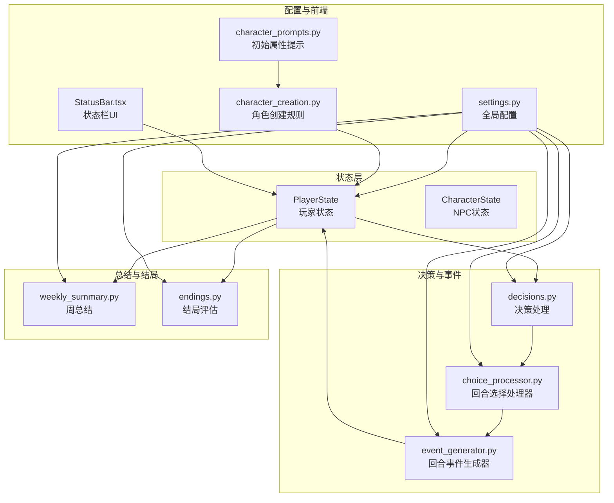
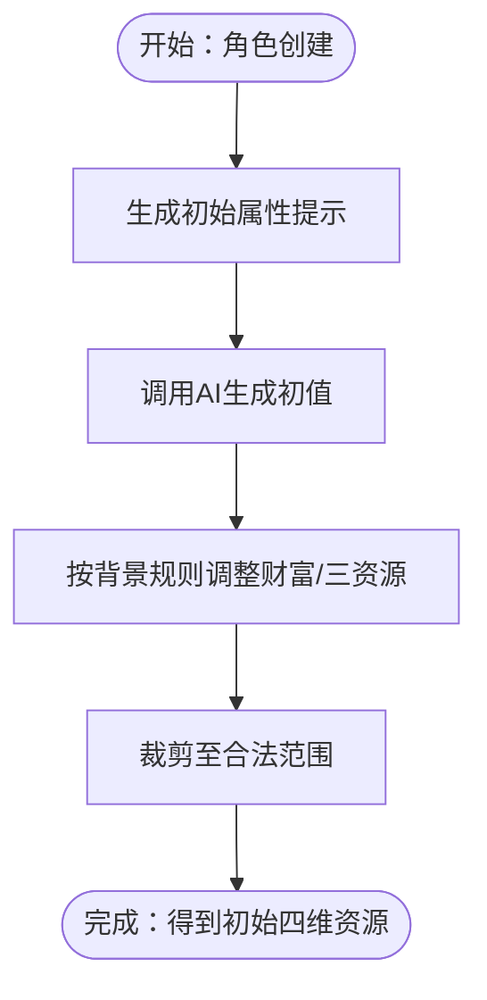
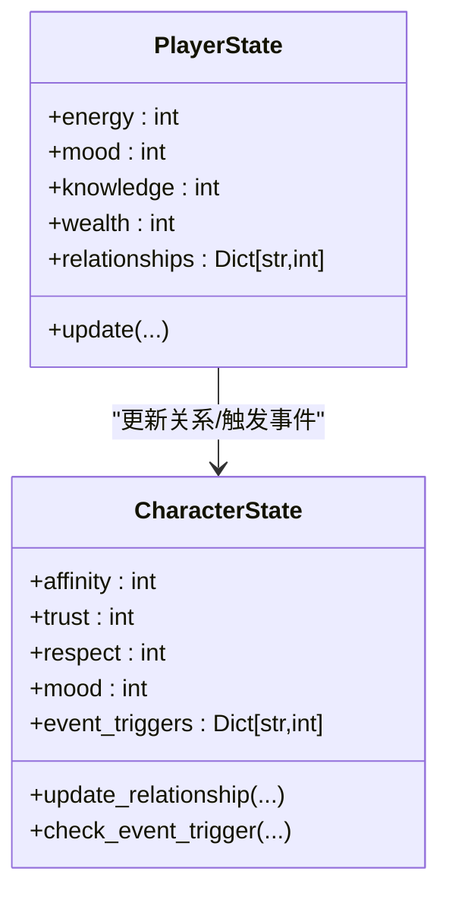
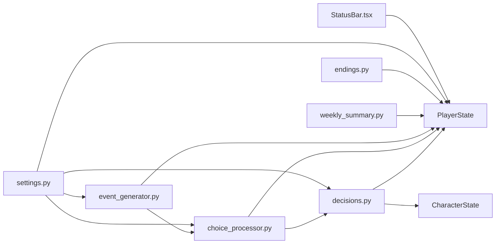

# 四维资源系统

<cite>
**本文引用的文件**
- [src/game/state/player_state.py](file://src/game/state/player_state.py)
- [src/game/state/character_state.py](file://src/game/state/character_state.py)
- [config/settings.py](file://config/settings.py)
- [src/game/decisions.py](file://src/game/decisions.py)
- [src/game/round/choice_processor.py](file://src/game/round/choice_processor.py)
- [src/game/round/event_generator.py](file://src/game/round/event_generator.py)
- [src/game/endings.py](file://src/game/endings.py)
- [src/game/weekly_summary.py](file://src/game/weekly_summary.py)
- [frontend/src/components/game/StatusBar.tsx](file://frontend/src/components/game/StatusBar.tsx)
- [config/prompts/character_prompts.py](file://config/prompts/character_prompts.py)
- [src/game/character_creation.py](file://src/game/character_creation.py)
- [tests/test_game_modules.py](file://tests/test_game_modules.py)
</cite>

## 目录
1. [引言](#引言)
2. [项目结构](#项目结构)
3. [核心组件](#核心组件)
4. [架构总览](#架构总览)
5. [详细组件分析](#详细组件分析)
6. [依赖分析](#依赖分析)
7. [性能考虑](#性能考虑)
8. [故障排查指南](#故障排查指南)
9. [结论](#结论)
10. [附录](#附录)

## 引言
本技术文档聚焦“四维资源系统”，即能量、情绪、知识、财富四个核心维度。文档从设计理念、初始值设定、增长与衰减规则、资源间相互影响与平衡机制、资源获取与消耗规则、可视化与监控指标、异常处理与保护措施，以及与游戏其他模块的集成方式（决策影响评估与结局触发条件）等方面进行系统化阐述，并辅以图示与来源标注，帮助开发者与策划人员全面理解与维护该系统。

## 项目结构
四维资源系统贯穿状态管理、决策处理、事件生成、周/月总结、结局评估与前端展示等模块，形成“事件驱动—状态更新—叙事产出—周期总结—结局评估”的闭环。



**图表来源**
- [src/game/state/player_state.py](file://src/game/state/player_state.py#L15-L122)
- [src/game/state/character_state.py](file://src/game/state/character_state.py#L13-L121)
- [src/game/decisions.py](file://src/game/decisions.py#L135-L241)
- [src/game/round/choice_processor.py](file://src/game/round/choice_processor.py#L66-L347)
- [src/game/round/event_generator.py](file://src/game/round/event_generator.py#L75-L261)
- [src/game/weekly_summary.py](file://src/game/weekly_summary.py#L25-L64)
- [src/game/endings.py](file://src/game/endings.py#L47-L95)
- [config/settings.py](file://config/settings.py#L70-L106)
- [config/prompts/character_prompts.py](file://config/prompts/character_prompts.py#L633-L701)
- [src/game/character_creation.py](file://src/game/character_creation.py#L475-L511)
- [frontend/src/components/game/StatusBar.tsx](file://frontend/src/components/game/StatusBar.tsx#L41-L171)

**章节来源**
- [src/game/state/player_state.py](file://src/game/state/player_state.py#L15-L122)
- [config/settings.py](file://config/settings.py#L70-L106)

## 核心组件
- PlayerState：集中管理能量、情绪、知识、财富等四维资源，以及年龄、周数、决策历史、世界模型、伏笔系统等扩展状态。
- CharacterState：管理NPC角色的动态属性与关系阈值，支持事件触发与互动记录。
- decisions.py：解析选项效果，应用到PlayerState与角色关系，记录决策历史。
- choice_processor.py：回合选择后的叙事压缩、世界模型更新、记录保存与周推进。
- event_generator.py：基于上下文生成回合事件，支持预定事件强制触发。
- weekly_summary.py / monthly_summary.py：按周/月生成总结，反映资源变化。
- endings.py：基于最终状态与关系评分确定结局类型并生成总结。
- settings.py：统一配置初始值、边界、衰减、回合数等常量。
- 前端StatusBar：资源可视化与进度指示。

**章节来源**
- [src/game/state/player_state.py](file://src/game/state/player_state.py#L15-L122)
- [src/game/state/character_state.py](file://src/game/state/character_state.py#L13-L121)
- [src/game/decisions.py](file://src/game/decisions.py#L135-L241)
- [src/game/round/choice_processor.py](file://src/game/round/choice_processor.py#L66-L347)
- [src/game/round/event_generator.py](file://src/game/round/event_generator.py#L75-L261)
- [src/game/weekly_summary.py](file://src/game/weekly_summary.py#L25-L64)
- [src/game/endings.py](file://src/game/endings.py#L47-L95)
- [config/settings.py](file://config/settings.py#L70-L106)
- [frontend/src/components/game/StatusBar.tsx](file://frontend/src/components/game/StatusBar.tsx#L41-L171)

## 架构总览
四维资源系统采用“事件驱动 + 状态机 + 叙事生成”的架构：
- 事件生成：每轮事件由AI生成，携带资源效果。
- 决策处理：选项效果直接作用于PlayerState四维资源与角色关系。
- 周期推进：回合完成后进入周总结阶段，记录变化并生成叙事摘要。
- 结局评估：游戏结束时综合四维资源与关系评分决定结局类型。

```mermaid
sequenceDiagram
participant UI as "前端UI"
participant EG as "事件生成器"
participant CP as "回合选择处理器"
participant DEC as "决策处理"
participant PS as "PlayerState"
participant SUM as "周/月总结"
participant END as "结局评估"
UI->>EG : 请求生成回合事件
EG-->>UI : 返回事件(描述+选项+效果)
UI->>CP : 提交选择
CP->>DEC : 应用效果(资源/关系)
DEC->>PS : 更新能量/情绪/知识/财富/关系
CP->>PS : 保存回合记录/推进回合
alt 周末且需周结
CP->>SUM : 生成周总结
SUM->>PS : 记录周变化
end
UI->>END : 游戏结束请求
END->>PS : 读取最终状态
END-->>UI : 输出结局类型与总结
```

**图表来源**
- [src/game/round/event_generator.py](file://src/game/round/event_generator.py#L75-L261)
- [src/game/round/choice_processor.py](file://src/game/round/choice_processor.py#L66-L347)
- [src/game/decisions.py](file://src/game/decisions.py#L135-L241)
- [src/game/weekly_summary.py](file://src/game/weekly_summary.py#L25-L64)
- [src/game/endings.py](file://src/game/endings.py#L47-L95)

## 详细组件分析

### 设计理念与边界
- 资源范围
  - 能量、情绪、知识：0-100（MIN_RESOURCE/MAX_RESOURCE）
  - 财富：≥0，无上限（MAX_WEALTH无上限）
- 初始值
  - INITIAL_ENERGY/INITIAL_MOOD/INITIAL_KNOWLEDGE/INITIAL_WEALTH
- 衰减与恢复
  - 设置中定义了能量与情绪的衰减值（如无休息/压力情境），可在事件或规则中叠加
- 多轮系统
  - ROUNDS_PER_WEEK定义每周轮次，周末统一生成周总结

**章节来源**
- [config/settings.py](file://config/settings.py#L75-L106)
- [src/game/state/player_state.py](file://src/game/state/player_state.py#L22-L26)
- [src/game/state/player_state.py](file://src/game/state/player_state.py#L177-L187)

### 初始值设定与角色创建规则
- Prompt引导
  - character_prompts.py中明确要求生成能量、情绪、知识、财富的初始值，并给出范围与合理性建议
- 角色创建规则
  - character_creation.py依据家庭经济、时代背景、年龄、能力等因素对财富进行加减调整，同时对能量、情绪、知识进行裁剪至合理区间



**图表来源**
- [config/prompts/character_prompts.py](file://config/prompts/character_prompts.py#L633-L701)
- [src/game/character_creation.py](file://src/game/character_creation.py#L475-L511)

**章节来源**
- [config/prompts/character_prompts.py](file://config/prompts/character_prompts.py#L633-L701)
- [src/game/character_creation.py](file://src/game/character_creation.py#L475-L511)

### 资源增长与衰减机制
- 直接增减
  - 决策选项effects中可直接给出energy/mood/knowledge/wealth的正负变化
- 衰减规则
  - settings中定义了能量与情绪的基础衰减值，可在事件或规则中叠加
- 关系联动
  - relationships变化会转化为角色affinity/trust/respect/mood的联动变化，间接影响后续事件触发

**章节来源**
- [src/game/decisions.py](file://src/game/decisions.py#L170-L182)
- [src/game/decisions.py](file://src/game/decisions.py#L42-L53)
- [config/settings.py](file://config/settings.py#L96-L99)

### 资源间的相互影响与平衡机制
- 关系阈值与事件触发
  - CharacterState维护事件触发阈值，当affinity/trust/respect达到阈值时触发特殊事件
- 关系变化的传播
  - decisions.py将relationships映射为角色的affinity/trust/respect/mood变化，形成资源间的耦合
- 结局评估中的平衡
  - endings.py综合平均属性、财富与关系评分决定结局类型，体现资源平衡的重要性



**图表来源**
- [src/game/state/player_state.py](file://src/game/state/player_state.py#L15-L122)
- [src/game/state/character_state.py](file://src/game/state/character_state.py#L13-L121)
- [src/game/decisions.py](file://src/game/decisions.py#L63-L107)

**章节来源**
- [src/game/state/character_state.py](file://src/game/state/character_state.py#L84-L114)
- [src/game/decisions.py](file://src/game/decisions.py#L63-L107)
- [src/game/endings.py](file://src/game/endings.py#L97-L122)

### 资源消耗与获取规则
- 日常活动
  - 事件生成器在生成回合事件时，结合历史周/年总结、关系事件、世界模型等上下文，使资源变化更贴近叙事
- 决策选择
  - 选项effects直接改变资源；relationships变化经转换后影响角色关系
- 特殊事件
  - 预定事件（ScheduledEvent）强制触发，要求围绕承诺展开，通常带来资源波动

**章节来源**
- [src/game/round/event_generator.py](file://src/game/round/event_generator.py#L124-L140)
- [src/game/round/event_generator.py](file://src/game/round/event_generator.py#L290-L396)
- [src/game/decisions.py](file://src/game/decisions.py#L169-L191)

### 资源可视化与监控指标
- 前端状态栏
  - StatusBar组件展示年龄、周数、当前轮次与四维资源，使用颜色区分资源健康度
- 周/月总结
  - weekly_summary.py与monthly_summary.py统计并生成资源变化摘要，便于回顾
- 结局面板
  - 结局页展示最终四维资源与关系列表，便于复盘

**章节来源**
- [frontend/src/components/game/StatusBar.tsx](file://frontend/src/components/game/StatusBar.tsx#L41-L171)
- [src/game/weekly_summary.py](file://src/game/weekly_summary.py#L46-L64)
- [tests/test_game_modules.py](file://tests/test_game_modules.py#L109-L126)

### 异常处理与保护措施
- 状态边界保护
  - PlayerState.update对资源进行边界裁剪，财富无上限但非负
- 状态验证
  - PlayerState.validate在更新后进行边界校验，异常时记录日志
- 事件生成超时与并发控制
  - event_generator对生成过程设置超时与并发标志，防止重复生成
- 回退策略
  - 事件与总结均提供回退方案，保证流程可用性

**章节来源**
- [src/game/state/player_state.py](file://src/game/state/player_state.py#L177-L196)
- [src/game/state/player_state.py](file://src/game/state/player_state.py#L318-L338)
- [src/game/round/event_generator.py](file://src/game/round/event_generator.py#L100-L115)
- [src/game/weekly_summary.py](file://src/game/weekly_summary.py#L104-L112)

### 与游戏其他模块的集成
- 决策影响评估
  - decisions.process_decision记录决策历史与效果，供周/月总结与结局评估使用
- 结局触发条件
  - endings.evaluate_ending综合四维资源与关系评分，决定结局类型
- 世界模型与叙事
  - choice_processor在应用效果后执行叙事压缩与世界模型更新，确保资源变化与世界一致性

**章节来源**
- [src/game/decisions.py](file://src/game/decisions.py#L198-L211)
- [src/game/endings.py](file://src/game/endings.py#L64-L95)
- [src/game/round/choice_processor.py](file://src/game/round/choice_processor.py#L221-L277)

## 依赖分析
四维资源系统的关键依赖关系如下：



**图表来源**
- [src/game/decisions.py](file://src/game/decisions.py#L135-L241)
- [src/game/round/choice_processor.py](file://src/game/round/choice_processor.py#L66-L347)
- [src/game/round/event_generator.py](file://src/game/round/event_generator.py#L75-L261)
- [src/game/weekly_summary.py](file://src/game/weekly_summary.py#L25-L64)
- [src/game/endings.py](file://src/game/endings.py#L47-L95)
- [config/settings.py](file://config/settings.py#L70-L106)
- [frontend/src/components/game/StatusBar.tsx](file://frontend/src/components/game/StatusBar.tsx#L41-L171)

**章节来源**
- [src/game/decisions.py](file://src/game/decisions.py#L135-L241)
- [src/game/round/choice_processor.py](file://src/game/round/choice_processor.py#L66-L347)
- [src/game/round/event_generator.py](file://src/game/round/event_generator.py#L75-L261)
- [src/game/weekly_summary.py](file://src/game/weekly_summary.py#L25-L64)
- [src/game/endings.py](file://src/game/endings.py#L47-L95)
- [config/settings.py](file://config/settings.py#L70-L106)
- [frontend/src/components/game/StatusBar.tsx](file://frontend/src/components/game/StatusBar.tsx#L41-L171)

## 性能考虑
- 并行处理：choice_processor在后处理阶段使用线程池并行执行叙事压缩、世界抽取与分析，提高吞吐
- 事件生成超时：event_generator对生成过程设置超时与并发标志，避免长时间阻塞
- 回退策略：事件与总结均提供回退方案，降低失败率
- 建议
  - 控制周/月总结的AI调用频率，必要时缓存摘要
  - 在高并发场景下限制AI生成速率，避免资源争用

[本节为通用指导，无需列出具体文件来源]

## 故障排查指南
- 状态越界
  - 现象：更新后抛出边界异常
  - 排查：确认effects是否超出边界；检查settings中的MIN_RESOURCE/MAX_RESOURCE/MAX_WEALTH
- 事件生成卡住
  - 现象：重复生成报错或长时间无响应
  - 排查：检查_GENERATION_TIMEOUT与并发标志；确认AI服务可用性
- 结局评估异常
  - 现象：结局类型不符合预期
  - 排查：核对最终状态与关系评分阈值；检查决策历史是否被正确记录

**章节来源**
- [src/game/state/player_state.py](file://src/game/state/player_state.py#L318-L338)
- [src/game/round/event_generator.py](file://src/game/round/event_generator.py#L100-L115)
- [src/game/endings.py](file://src/game/endings.py#L97-L122)

## 结论
四维资源系统通过明确的边界、初始值设定、事件驱动的资源变化、周/月总结与结局评估，形成了完整的叙事驱动闭环。其设计强调资源间的耦合与平衡，配合前端可视化与回退策略，既保证了可玩性，又提升了系统的鲁棒性。建议在后续迭代中进一步细化衰减与恢复规则、完善资源保护与异常处理，并持续优化AI生成质量与性能。

[本节为总结性内容，无需列出具体文件来源]

## 附录
- 相关测试
  - 测试用例覆盖结局评估与成就系统，验证平衡/富有/学者/社交/挣扎等结局类型的判定逻辑

**章节来源**
- [tests/test_game_modules.py](file://tests/test_game_modules.py#L109-L126)