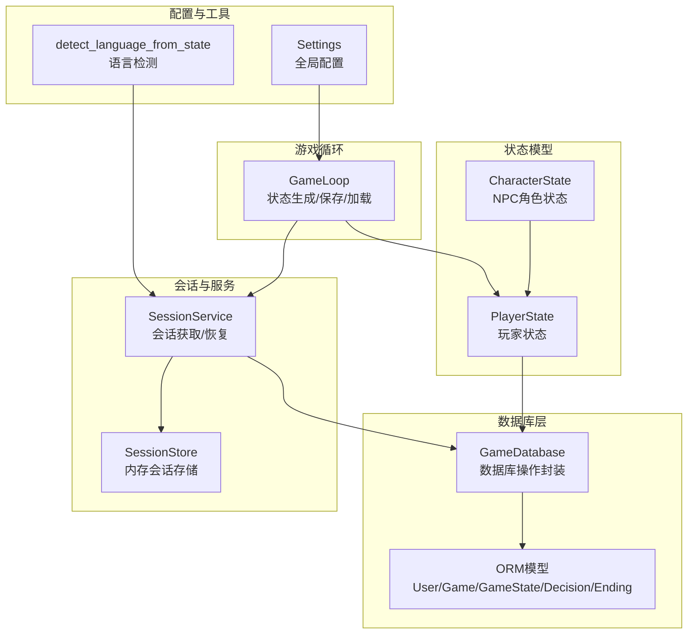
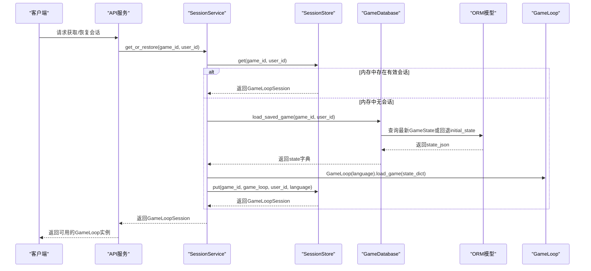
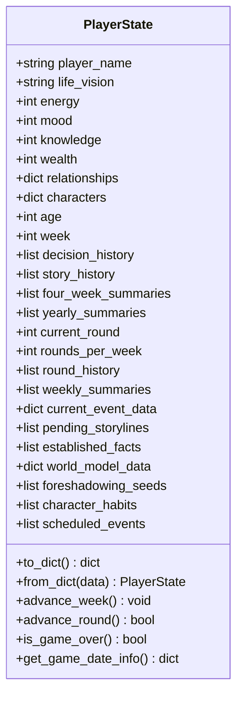
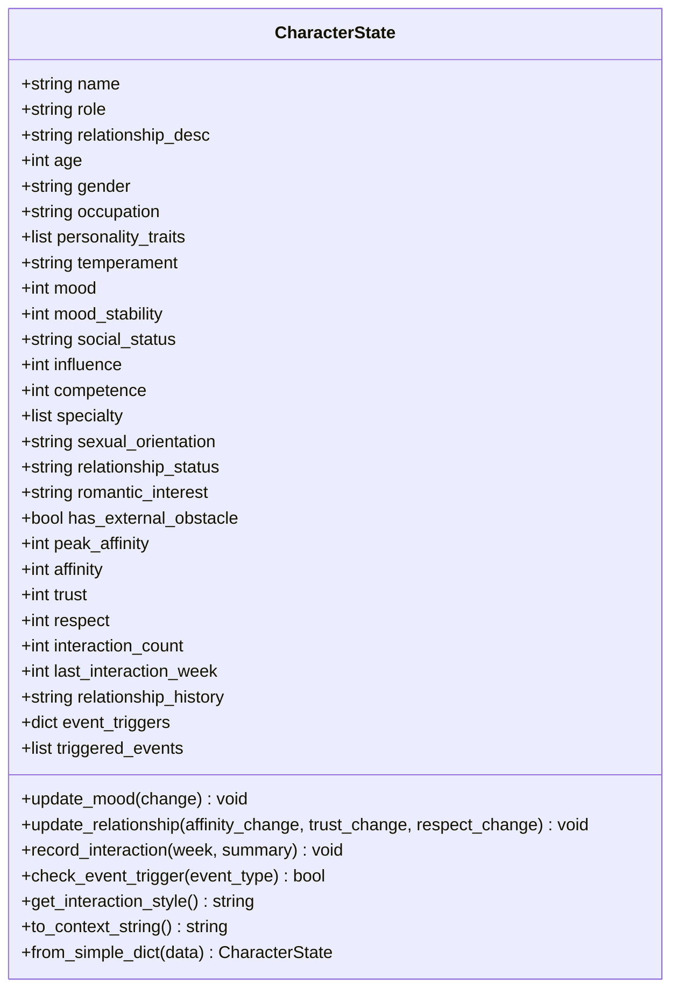
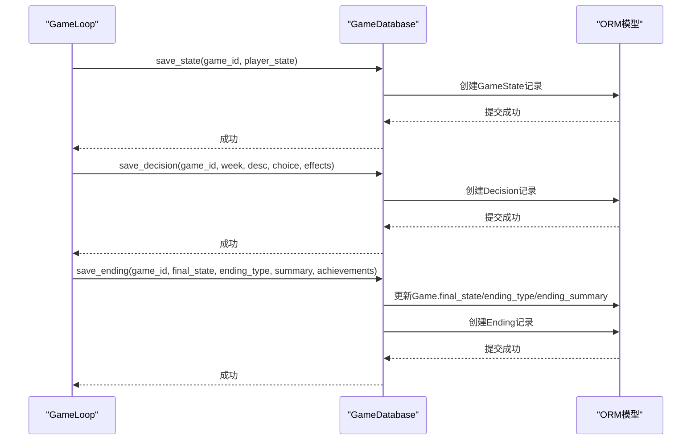
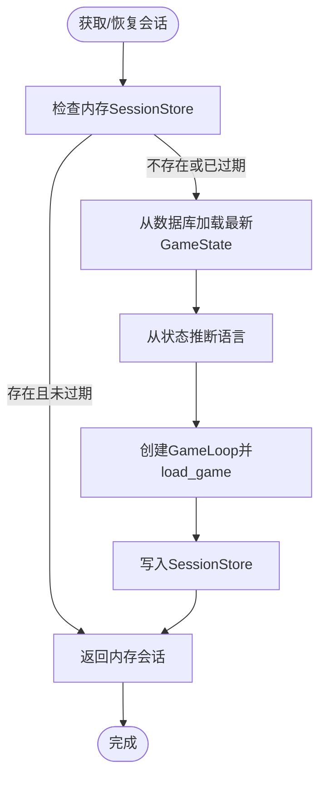
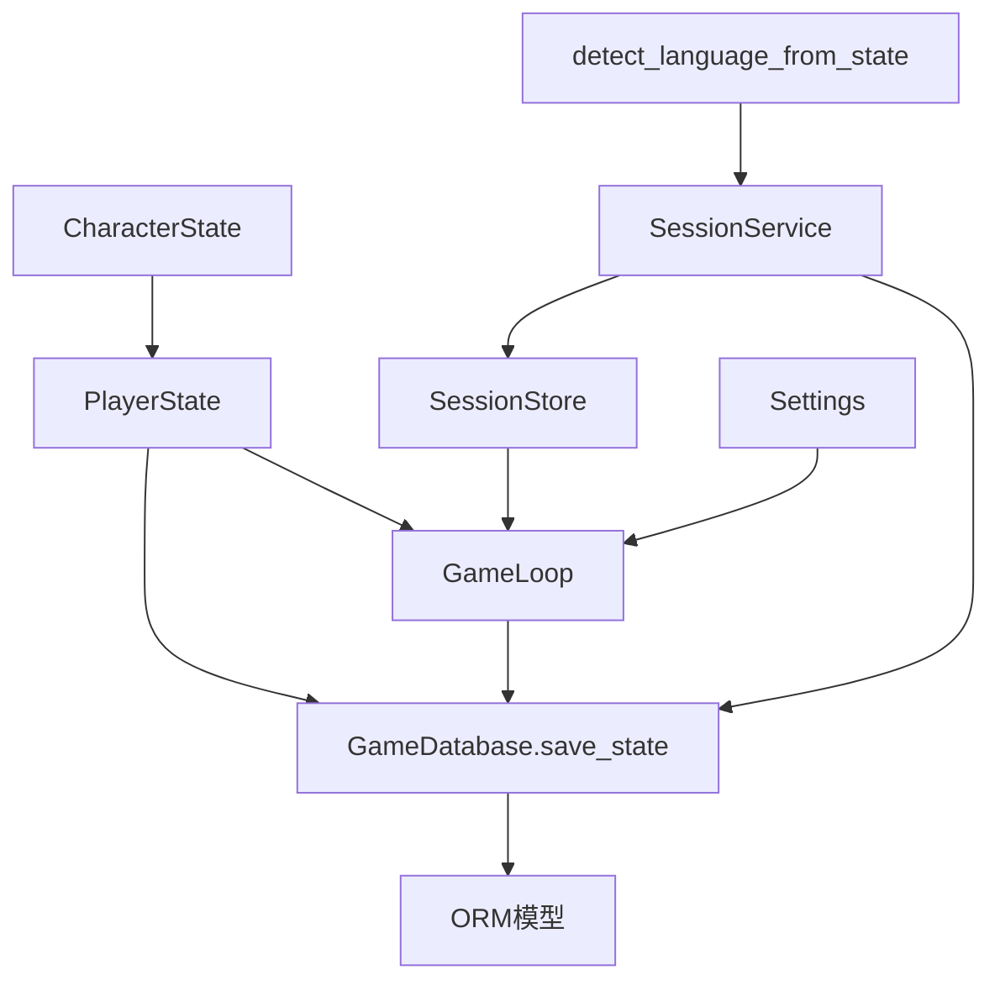

# 状态持久化机制

<cite>
**本文档引用的文件**
- [src/game/state/player_state.py](file://src/game/state/player_state.py)
- [src/game/state/character_state.py](file://src/game/state/character_state.py)
- [src/game/state.py](file://src/game/state.py)
- [src/database/models.py](file://src/database/models.py)
- [src/database/db.py](file://src/database/db.py)
- [src/api/session_store.py](file://src/api/session_store.py)
- [src/api/services/session_service.py](file://src/api/services/session_service.py)
- [src/game/game_loop.py](file://src/game/game_loop.py)
- [config/settings.py](file://config/settings.py)
- [src/utils/language.py](file://src/utils/language.py)
- [tests/test_state.py](file://tests/test_state.py)
- [tests/test_database.py](file://tests/test_database.py)
</cite>

## 目录
1. [简介](#简介)
2. [项目结构](#项目结构)
3. [核心组件](#核心组件)
4. [架构总览](#架构总览)
5. [详细组件分析](#详细组件分析)
6. [依赖关系分析](#依赖关系分析)
7. [性能考虑](#性能考虑)
8. [故障排除指南](#故障排除指南)
9. [结论](#结论)
10. [附录](#附录)

## 简介
本文件系统性阐述本项目的“状态持久化机制”，涵盖以下方面：
- 玩家状态数据的序列化与反序列化（JSON格式设计与数据压缩策略）
- 状态数据的存储结构与数据库表设计（字段映射与索引优化）
- 状态保存与加载的完整流程（事务处理与错误恢复）
- 状态版本管理与兼容性策略
- 状态增量更新与批量操作方案
- 安全存储与备份恢复机制
- 与API层的状态同步与并发控制
- 状态损坏检测与修复算法

## 项目结构
围绕状态持久化的关键模块分布如下：
- 状态模型层：玩家状态与NPC角色状态定义
- 数据库层：ORM模型与数据库操作封装
- 会话与服务层：内存会话管理与自动恢复逻辑
- 游戏循环层：状态生成、保存与加载入口
- 配置与工具：全局配置、语言检测等



**图表来源**
- [src/game/state/player_state.py](file://src/game/state/player_state.py#L15-L590)
- [src/game/state/character_state.py](file://src/game/state/character_state.py#L13-L243)
- [src/database/models.py](file://src/database/models.py#L11-L295)
- [src/database/db.py](file://src/database/db.py#L13-L910)
- [src/api/services/session_service.py](file://src/api/services/session_service.py#L24-L158)
- [src/api/session_store.py](file://src/api/session_store.py#L100-L200)
- [src/game/game_loop.py](file://src/game/game_loop.py#L25-L592)
- [config/settings.py](file://config/settings.py#L27-L168)
- [src/utils/language.py](file://src/utils/language.py#L5-L28)

**章节来源**
- [src/game/state/player_state.py](file://src/game/state/player_state.py#L1-L590)
- [src/database/models.py](file://src/database/models.py#L1-L295)
- [src/database/db.py](file://src/database/db.py#L1-L910)
- [src/api/session_store.py](file://src/api/session_store.py#L1-L200)
- [src/api/services/session_service.py](file://src/api/services/session_service.py#L1-L158)
- [src/game/game_loop.py](file://src/game/game_loop.py#L1-L592)
- [config/settings.py](file://config/settings.py#L1-L168)
- [src/utils/language.py](file://src/utils/language.py#L1-L28)

## 核心组件
- 玩家状态模型（PlayerState）：集中管理玩家核心属性、关系、角色系统、回合制系统、世界模型、预定事件等，并提供to_dict/from_dict序列化接口。
- NPC角色模型（CharacterState）：管理NPC的动态状态、关系属性、互动记录与事件触发阈值。
- 数据库模型（ORM）：定义User、Game、GameState、Decision、Ending、CharacterPreset、Image、SceneImage等表及索引。
- 数据库操作（GameDatabase）：封装创建游戏、保存状态、加载状态、保存决策、保存结局、存档点管理、活跃游戏管理等。
- 会话服务（SessionService/SessionStore）：内存会话管理与自动恢复（从数据库恢复）。
- 游戏循环（GameLoop）：状态生成、保存、加载的业务入口。

**章节来源**
- [src/game/state/player_state.py](file://src/game/state/player_state.py#L15-L590)
- [src/game/state/character_state.py](file://src/game/state/character_state.py#L13-L243)
- [src/database/models.py](file://src/database/models.py#L11-L295)
- [src/database/db.py](file://src/database/db.py#L13-L910)
- [src/api/session_store.py](file://src/api/session_store.py#L100-L200)
- [src/api/services/session_service.py](file://src/api/services/session_service.py#L24-L158)
- [src/game/game_loop.py](file://src/game/game_loop.py#L25-L592)

## 架构总览
状态持久化贯穿“内存状态—数据库快照—会话恢复”的闭环：



**图表来源**
- [src/api/services/session_service.py](file://src/api/services/session_service.py#L49-L122)
- [src/api/session_store.py](file://src/api/session_store.py#L123-L167)
- [src/database/db.py](file://src/database/db.py#L385-L427)
- [src/game/game_loop.py](file://src/game/game_loop.py#L100-L159)

## 详细组件分析

### 玩家状态序列化与JSON设计
- 序列化接口
  - PlayerState提供to_dict/model_dump与from_dict构造器，确保状态可直接以JSON形式持久化。
  - to_dict用于保存到数据库；from_dict用于从数据库恢复。
- JSON字段设计
  - 基础字段：player_name、life_vision、age、week、energy、mood、knowledge、wealth等。
  - 关系与角色：relationships（向后兼容）、characters（NPC角色字典）。
  - 历史与摘要：decision_history、story_history、four_week_summaries、yearly_summaries。
  - 回合制：current_round、rounds_per_week、round_history、weekly_summaries。
  - 事件与世界模型：current_event_data、pending_storylines、established_facts、world_model_data、foreshadowing_seeds、character_habits、scheduled_events。
  - 兼容性：通过字段默认值与校验器保证旧版本数据可恢复。
- 数据压缩策略
  - 当前实现采用标准JSON序列化；未见专用压缩算法。建议在高频率写入场景中引入gzip压缩或二进制序列化（如msgpack）以降低存储体积与网络传输开销。



**图表来源**
- [src/game/state/player_state.py](file://src/game/state/player_state.py#L15-L590)

**章节来源**
- [src/game/state/player_state.py](file://src/game/state/player_state.py#L340-L348)
- [src/game/state/player_state.py](file://src/game/state/player_state.py#L197-L229)
- [src/game/state/player_state.py](file://src/game/state/player_state.py#L349-L353)

### NPC角色状态模型
- 字段设计
  - 基础信息：name、role、relationship_desc、age、gender、occupation。
  - 性格与动态：personality_traits、temperament、mood、mood_stability。
  - 社会与能力：social_status、influence、competence、specialty。
  - 隐藏属性：sexual_orientation、relationship_status、romantic_interest、has_external_obstacle、peak_affinity。
  - 关系属性：affinity、trust、respect。
  - 互动记录：interaction_count、last_interaction_week、relationship_history。
  - 事件触发阈值：event_triggers（含多种事件类型阈值）。
  - 已触发事件：triggered_events。
- 方法
  - update_mood：根据情绪稳定性调整变化幅度。
  - update_relationship：更新与主角的关系属性并维护峰值亲密度。
  - record_interaction：记录互动次数与简述。
  - check_event_trigger：委托给PlayerService进行事件触发判定。
  - to_context_string：生成AI上下文描述。
  - from_simple_dict：兼容旧数据格式的快速构建。



**图表来源**
- [src/game/state/character_state.py](file://src/game/state/character_state.py#L13-L243)

**章节来源**
- [src/game/state/character_state.py](file://src/game/state/character_state.py#L122-L152)
- [src/game/state/character_state.py](file://src/game/state/character_state.py#L169-L173)
- [src/game/state/character_state.py](file://src/game/state/character_state.py#L207-L225)

### 数据库表设计与字段映射
- User（用户）
  - 字段：user_id（PK）、private_id（唯一索引）、public_id（唯一索引）、display_name、created_at、last_login、last_active_game_id（FK）。
  - 关系：games、sent_friend_requests、received_friend_requests。
- Friendship（好友关系）
  - 字段：id（PK）、user_id、friend_id、status、created_at、updated_at。
  - 复合唯一索引：ix_friendship_pair。
- Game（游戏会话）
  - 字段：game_id（PK）、user_id（FK）、created_at、updated_at、language、initial_state（JSON）、final_state（JSON，可空）、ending_type、ending_summary、is_public。
  - 关系：user、states、decisions、ending、images、scene_images。
- GameState（状态快照）
  - 字段：state_id（PK）、game_id（FK）、week、age、state_json（JSON）、created_at、is_save_point（布尔）、save_name。
  - 关系：game。
- Decision（决策记录）
  - 字段：decision_id（PK）、game_id（FK）、week、event_description、choice_text、effects（JSON）、created_at。
  - 关系：game。
- Ending（结局记录）
  - 字段：ending_id（PK）、game_id（FK，唯一）、final_state（JSON）、ending_type、summary、achievements（JSON，可空）、created_at。
  - 关系：game。
- CharacterPreset（角色预设）
  - 字段：preset_id（PK）、user_id（FK，可空）、preset_name、player_name、life_vision、character_settings（JSON）、created_at、updated_at。
  - 关系：user。
- Image（图片）
  - 字段：image_id（PK）、game_id（FK）、image_type、entity_name、entity_key、prompt_text、storage_path、storage_type、metadata_json、version、is_active、is_primary、primary_image_id（FK）、created_at。
  - 关系：game。
  - 复合索引：ix_images_game_type_entity。
- SceneImage（场景插图）
  - 字段：scene_id（PK）、game_id（FK）、round_number、stage、scene_description、final_prompt、storage_path、storage_type、referenced_images、importance_score、created_at。
  - 关系：game。
  - 复合索引：ix_scene_images_game_round_stage。

```mermaid
erDiagram
USER {
int user_id PK
string private_id UK
string public_id UK
string display_name
datetime created_at
datetime last_login
int last_active_game_id FK
}
GAME {
int game_id PK
int user_id FK
datetime created_at
datetime updated_at
string language
json initial_state
json final_state
string ending_type
text ending_summary
bool is_public
}
GAME_STATE {
int state_id PK
int game_id FK
int week
int age
json state_json
datetime created_at
bool is_save_point
string save_name
}
DECISION {
int decision_id PK
int game_id FK
int week
text event_description
string choice_text
json effects
datetime created_at
}
ENDING {
int ending_id PK
int game_id FK UK
json final_state
string ending_type
text summary
json achievements
datetime created_at
}
CHARACTER_PRESET {
int preset_id PK
int user_id FK
string preset_name
string player_name
text life_vision
json character_settings
datetime created_at
datetime updated_at
}
FRIENDSHIP {
int id PK
int user_id FK
int friend_id FK
string status
datetime created_at
datetime updated_at
}
IMAGE {
int image_id PK
int game_id FK
string image_type
string entity_name
string entity_key
text prompt_text
string storage_path
string storage_type
json metadata_json
int version
bool is_active
bool is_primary
int primary_image_id FK
datetime created_at
}
SCENE_IMAGE {
int scene_id PK
int game_id FK
int round_number
string stage
text scene_description
text final_prompt
string storage_path
string storage_type
json referenced_images
string importance_score
datetime created_at
}
USER ||--o{ GAME : "拥有"
GAME ||--o{ GAME_STATE : "包含"
GAME ||--o{ DECISION : "包含"
GAME ||--o{ ENDING : "包含"
USER ||--o{ CHARACTER_PRESET : "拥有"
USER ||--o{ FRIENDSHIP : "发起/接收"
GAME ||--o{ IMAGE : "包含"
GAME ||--o{ SCENE_IMAGE : "包含"
```

**图表来源**
- [src/database/models.py](file://src/database/models.py#L11-L295)

**章节来源**
- [src/database/models.py](file://src/database/models.py#L11-L295)

### 状态保存与加载流程（事务处理与错误恢复）
- 保存流程
  - GameLoop在适当时机调用GameDatabase.save_state/save_game_progress，将PlayerState转换为字典并写入GameState表。
  - 保存决策：GameLoop调用GameDatabase.save_decision，记录事件描述、选择文本与效果。
  - 保存结局：GameLoop调用GameDatabase.save_ending，同时更新Game表的final_state、ending_type、ending_summary。
- 加载流程
  - SessionService.get_or_restore优先从内存SessionStore获取；若不存在，则调用GameDatabase.load_saved_game。
  - load_saved_game按created_at倒序取最新GameState，若无则回退到Game.initial_state，并补充缺失字段（如player_name、life_vision）。
  - GameLoop.load_game将字典还原为PlayerState，并重建current_event（如有）。
- 事务与错误恢复
  - GameDatabase.save_game_progress在异常时执行rollback并返回False，确保状态一致性。
  - SessionService对数据库异常进行HTTP 404包装，避免内部异常泄露。



**图表来源**
- [src/database/db.py](file://src/database/db.py#L51-L138)
- [src/database/db.py](file://src/database/db.py#L336-L384)
- [src/database/db.py](file://src/database/db.py#L385-L427)

**章节来源**
- [src/database/db.py](file://src/database/db.py#L51-L138)
- [src/database/db.py](file://src/database/db.py#L336-L384)
- [src/database/db.py](file://src/database/db.py#L385-L427)
- [src/api/services/session_service.py](file://src/api/services/session_service.py#L74-L122)

### 会话管理与并发控制
- 内存会话（SessionStore）
  - 以“user_{user_id}_game_{game_id}”或“anon_game_{game_id}”为键，线程安全存储GameLoopSession。
  - 支持超时清理（默认2小时）、访问时间touch、SSE缓存（最多500条）。
- 会话恢复（SessionService）
  - get_or_restore：先查内存，再查数据库；从数据库恢复后注入GameLoop并写入内存。
  - 语言检测：根据状态中的era_description推断语言，确保AI生成与界面一致。
- 并发控制
  - SessionStore使用threading.Lock保证并发安全。
  - GameLoop内部通过_generating标志与超时机制防止并发生成。



**图表来源**
- [src/api/session_store.py](file://src/api/session_store.py#L123-L167)
- [src/api/services/session_service.py](file://src/api/services/session_service.py#L49-L122)
- [src/utils/language.py](file://src/utils/language.py#L5-L28)

**章节来源**
- [src/api/session_store.py](file://src/api/session_store.py#L100-L200)
- [src/api/services/session_service.py](file://src/api/services/session_service.py#L24-L158)
- [src/utils/language.py](file://src/utils/language.py#L5-L28)

### 状态版本管理与兼容性策略
- 向后兼容
  - src/game/state.py保留向后兼容导入，确保旧模块路径仍可使用PlayerState/CharacterState。
  - PlayerState中保留relationships字段以兼容旧数据；提供同步方法将characters中的affinity同步回relationships。
- 字段补全
  - load_saved_game在返回state时，若缺失player_name或life_vision，从Game.initial_state补全。
- 类型约束
  - PlayerState使用Pydantic Field与validator确保数值边界与类型正确，避免脏数据进入数据库。

**章节来源**
- [src/game/state.py](file://src/game/state.py#L1-L18)
- [src/game/state/player_state.py](file://src/game/state/player_state.py#L153-L158)
- [src/game/state/player_state.py](file://src/game/state/player_state.py#L466-L481)
- [src/database/db.py](file://src/database/db.py#L415-L424)

### 增量更新与批量操作
- 增量更新
  - GameLoop在每周推进时仅追加新的story_history、四/五周期间生成摘要、更新age与week，避免全量覆盖。
  - save_game_progress每次仅新增一条GameState记录，形成时间序列快照。
- 批量操作
  - GameDatabase.list_saved_games聚合多个Game的最新GameState，便于前端批量展示。
  - GameDatabase.list_save_points列出手动存档点，支持时间回溯。

**章节来源**
- [src/game/game_loop.py](file://src/game/game_loop.py#L309-L358)
- [src/database/db.py](file://src/database/db.py#L336-L384)
- [src/database/db.py](file://src/database/db.py#L284-L334)
- [src/database/db.py](file://src/database/db.py#L743-L787)

### 安全存储与备份恢复
- 访问控制
  - 所有数据库读写均带user_id权限校验（如get_game、load_saved_game、create_save_point）。
- 备份与恢复
  - 手动存档点（is_save_point=True）持久化展示，支持用户随时回溯。
  - 服务端会话恢复：User.last_active_game_id记录最近活跃游戏ID，用于iPad Safari等场景的自动恢复。
- 数据完整性
  - ORM关系使用级联删除（cascade="all, delete-orphan"），确保删除Game时自动清理关联记录。

**章节来源**
- [src/database/db.py](file://src/database/db.py#L396-L427)
- [src/database/db.py](file://src/database/db.py#L603-L684)
- [src/database/models.py](file://src/database/models.py#L86-L91)

### 状态损坏检测与修复
- 损坏检测
  - PlayerState.validate对数值边界进行严格校验，异常时抛出ValueError。
  - GameDatabase.save_game_progress捕获异常并rollback，返回False，避免半写入。
- 修复策略
  - 从最新GameState回退到Game.initial_state作为最终兜底。
  - 通过字段补全（player_name、life_vision）与关系同步（characters↔relationships）提升兼容性。
  - 建议：在生产环境增加定期一致性校验任务（如对比story_history与decision历史）。

**章节来源**
- [src/game/state/player_state.py](file://src/game/state/player_state.py#L318-L339)
- [src/database/db.py](file://src/database/db.py#L378-L382)
- [src/database/db.py](file://src/database/db.py#L415-L424)

## 依赖关系分析



**图表来源**
- [src/game/state/player_state.py](file://src/game/state/player_state.py#L1-L590)
- [src/game/state/character_state.py](file://src/game/state/character_state.py#L1-L243)
- [src/database/db.py](file://src/database/db.py#L1-L910)
- [src/api/services/session_service.py](file://src/api/services/session_service.py#L1-L158)
- [src/api/session_store.py](file://src/api/session_store.py#L1-L200)
- [src/game/game_loop.py](file://src/game/game_loop.py#L1-L592)
- [config/settings.py](file://config/settings.py#L1-L168)
- [src/utils/language.py](file://src/utils/language.py#L1-L28)

**章节来源**
- [src/game/state/player_state.py](file://src/game/state/player_state.py#L1-L590)
- [src/database/db.py](file://src/database/db.py#L1-L910)
- [src/api/services/session_service.py](file://src/api/services/session_service.py#L1-L158)
- [src/api/session_store.py](file://src/api/session_store.py#L1-L200)
- [src/game/game_loop.py](file://src/game/game_loop.py#L1-L592)
- [config/settings.py](file://config/settings.py#L1-L168)
- [src/utils/language.py](file://src/utils/language.py#L1-L28)

## 性能考虑
- 序列化与I/O
  - 建议对频繁写入的GameState启用压缩（如gzip）或二进制序列化（如msgpack）以降低存储与网络开销。
- 索引优化
  - 已有关键索引：User.private_id/public_id、Friendship.ix_friendship_pair、Image.ix_images_game_type_entity、SceneImage.ix_scene_images_game_round_stage。
  - 建议：在GameState上增加(game_id, week)复合索引以加速按周检索。
- 并发与锁
  - SessionStore使用threading.Lock，适合单进程多线程模型；在异步或多进程部署中需替换为进程安全的锁或分布式锁。
- 缓存与回放
  - SSE缓存（MAX_SSE_CACHE_SIZE=500）避免重连丢失，建议结合LRU策略或定期清理。

[本节为通用指导，无需特定文件引用]

## 故障排除指南
- 无法加载会话
  - 检查SessionStore是否过期或被清理；确认SessionService.get_or_restore是否正确调用数据库加载。
  - 若数据库无记录，确认Game与GameState是否存在以及user_id权限。
- 状态异常或崩溃
  - 使用PlayerState.validate进行快速校验；必要时回退到initial_state。
  - 查看GameDatabase.save_game_progress的rollback日志，定位写入失败原因。
- 语言显示异常
  - 检查detect_language_from_state逻辑与状态中的era_description内容。
- 性能问题
  - 关注ORM查询是否命中索引；对高频查询增加复合索引；减少不必要的JSON解析。

**章节来源**
- [src/api/services/session_service.py](file://src/api/services/session_service.py#L114-L122)
- [src/database/db.py](file://src/database/db.py#L378-L382)
- [src/utils/language.py](file://src/utils/language.py#L5-L28)
- [src/database/models.py](file://src/database/models.py#L197-L201)
- [src/database/models.py](file://src/database/models.py#L232-L234)

## 结论
本项目的状态持久化机制以PlayerState为核心，结合ORM模型与数据库操作封装，实现了从内存状态到数据库快照的可靠流转。通过会话服务与内存会话存储，系统具备自动恢复能力；通过手动存档点与活跃游戏管理，增强了用户可控的时间回溯能力。建议在生产环境中进一步完善数据压缩、索引优化与并发控制策略，以提升整体性能与可靠性。

[本节为总结性内容，无需特定文件引用]

## 附录
- 单元测试要点
  - 状态序列化与反序列化：test_to_dict_from_dict
  - 边界值与有效性：test_update_energy、test_validate
  - 周推进与阶段判断：test_advance_week、test_get_current_phase
  - 数据库读写与回退：test_save_and_load_state、test_load_game_state_fallback_to_initial
  - 权限与所有权：test_get_game_with_user_id
  - 活跃游戏管理：test_set_active_game、test_get_active_game、test_clear_active_game

**章节来源**
- [tests/test_state.py](file://tests/test_state.py#L53-L99)
- [tests/test_database.py](file://tests/test_database.py#L295-L334)
- [tests/test_database.py](file://tests/test_database.py#L398-L428)
- [tests/test_database.py](file://tests/test_database.py#L435-L449)
- [tests/test_database.py](file://tests/test_database.py#L687-L756)