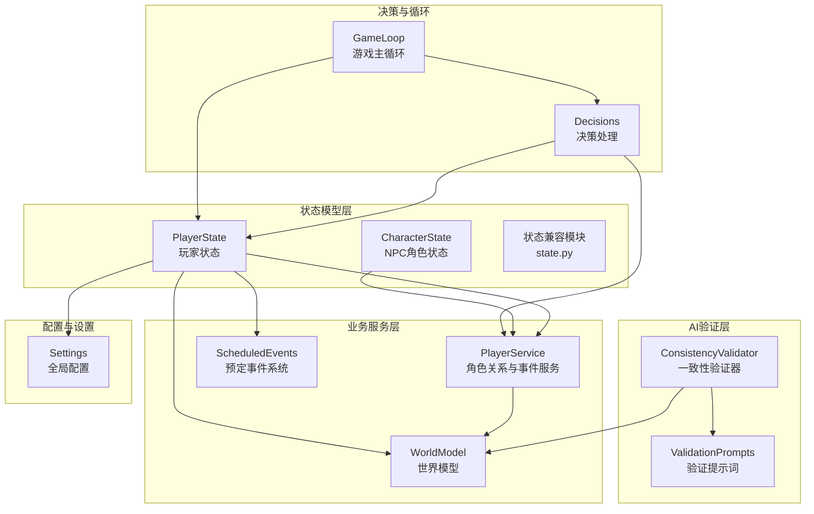
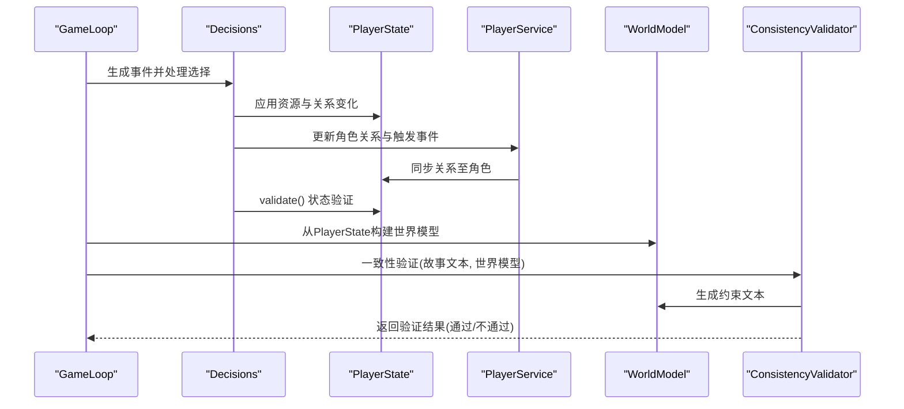
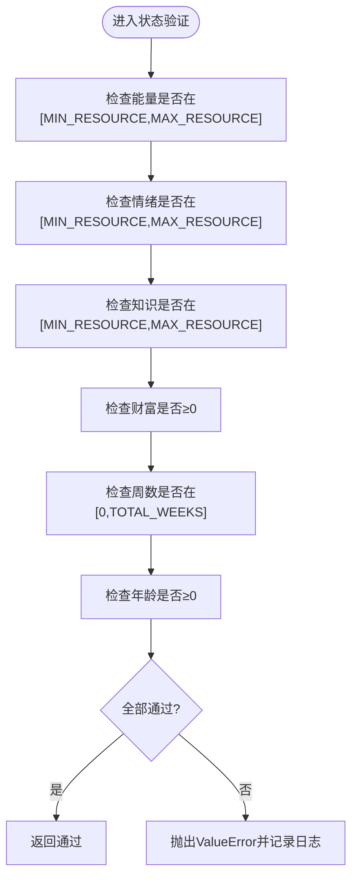
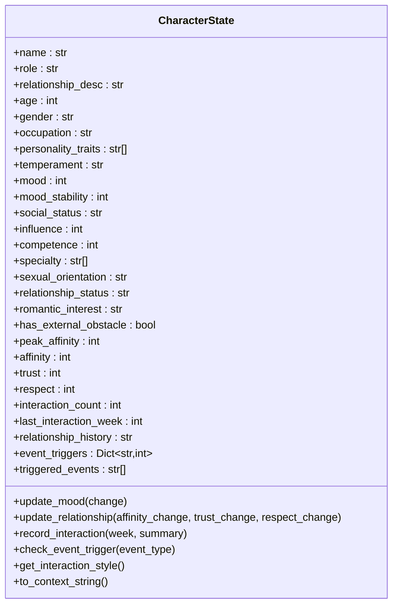
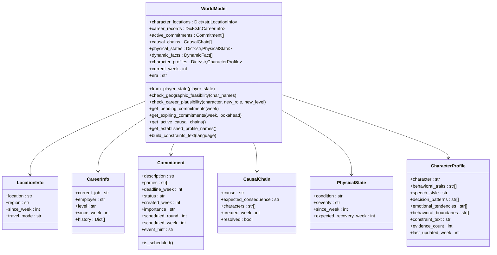
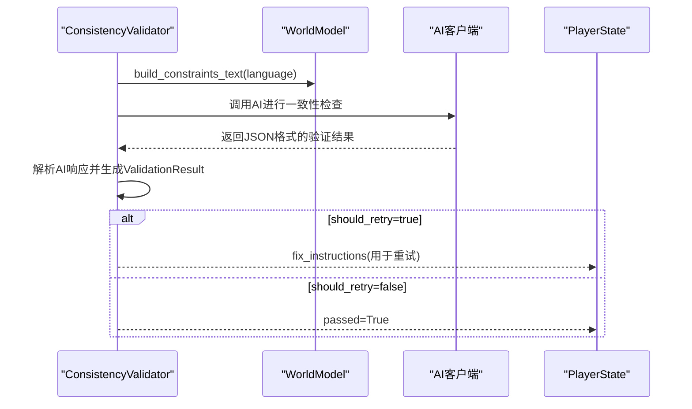
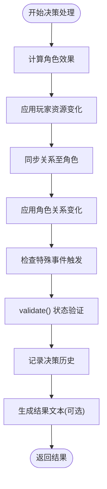
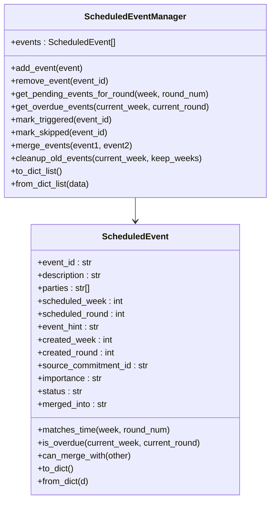
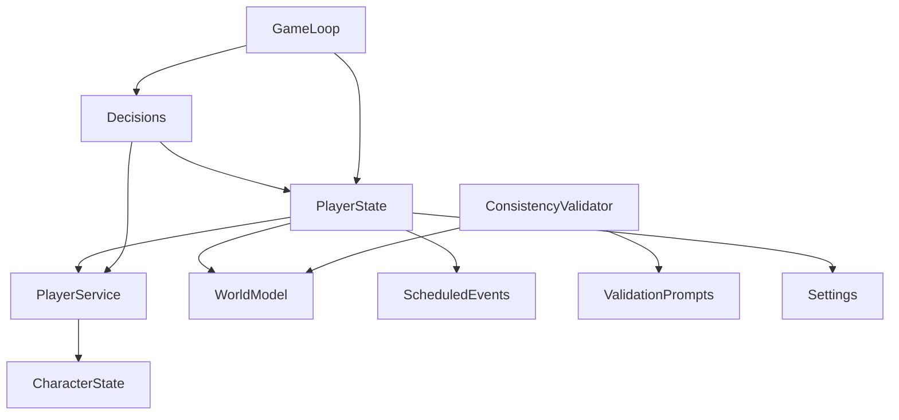

# 状态验证与约束系统

<cite>
**本文档引用的文件**
- [player_state.py](file://src/game/player_state.py)
- [character_state.py](file://src/game/state/character_state.py)
- [state.py](file://src/game/state.py)
- [consistency_validator.py](file://src/ai/consistency_validator.py)
- [validation_prompts.py](file://config/prompts/validation_prompts.py)
- [world_model.py](file://src/game/world_model.py)
- [settings.py](file://config/settings.py)
- [scheduled_events.py](file://src/game/scheduled_events.py)
- [decisions.py](file://src/game/decisions.py)
- [game_loop.py](file://src/game/game_loop.py)
- [player_service.py](file://src/game/player_service.py)
</cite>

## 目录
1. [简介](#简介)
2. [项目结构](#项目结构)
3. [核心组件](#核心组件)
4. [架构概览](#架构概览)
5. [详细组件分析](#详细组件分析)
6. [依赖关系分析](#依赖关系分析)
7. [性能考量](#性能考量)
8. [故障排除指南](#故障排除指南)
9. [结论](#结论)

## 简介
本文件面向状态验证与约束系统的技术文档，深入解释状态完整性验证的实现机制、约束规则设计原理、权限控制与安全检查、异常状态检测与自动修复策略、错误处理与用户反馈机制，以及状态审计与日志记录方案。同时涵盖与AI一致性验证器的集成方式与冲突解决机制，以及状态验证的性能优化策略和批量验证处理。

## 项目结构
状态验证与约束系统主要分布在以下模块：
- 状态模型层：玩家状态与NPC角色状态的数据结构与边界检查
- 业务服务层：角色关系更新、事件触发检查、世界模型约束生成
- AI验证层：一致性验证器与提示词工程
- 配置与设置：全局常量与资源边界
- 定时/预定事件：跨轮次强制触发机制
- 决策与循环：状态变更后的验证与错误处理

图表来源
- [player_state.py](file://src/game/player_state.py#L15-L590)
- [character_state.py](file://src/game/state/character_state.py#L13-L243)
- [state.py](file://src/game/state.py#L1-L18)
- [player_service.py](file://src/game/player_service.py#L9-L176)
- [world_model.py](file://src/game/world_model.py#L198-L697)
- [scheduled_events.py](file://src/game/scheduled_events.py#L19-L426)
- [consistency_validator.py](file://src/ai/consistency_validator.py#L42-L405)
- [validation_prompts.py](file://config/prompts/validation_prompts.py#L203-L410)
- [settings.py](file://config/settings.py#L27-L168)
- [decisions.py](file://src/game/decisions.py#L135-L271)
- [game_loop.py](file://src/game/game_loop.py#L25-L592)

章节来源
- [player_state.py](file://src/game/player_state.py#L15-L590)
- [character_state.py](file://src/game/state/character_state.py#L13-L243)
- [state.py](file://src/game/state.py#L1-L18)

## 核心组件
- 玩家状态(PlayerState)：集中管理玩家资源、时间、决策历史、角色系统、世界模型数据、预定事件等，提供边界检查与一致性验证入口。
- NPC角色状态(CharacterState)：管理角色属性、关系、互动记录与事件阈值，提供情绪与关系更新逻辑。
- 世界模型(WorldModel)：从玩家状态抽取结构化约束，生成约束文本，提供地理、职业、承诺、因果链、身体状态、动态事实与行为画像等维度的验证能力。
- 一致性验证器(ConsistencyValidator)：基于AI的多维度一致性检查，支持历史交叉验证与冲突分级。
- 验证提示词(ValidationPrompts)：定义一致性检查的提示词模板，涵盖fabrication、causal、personality等维度。
- 预定事件系统(ScheduledEvents)：跨轮次强制触发机制，确保承诺事件按时发生。
- 决策处理(Decisions)：应用决策效果、更新角色关系、触发事件并进行状态验证与错误处理。
- 游戏主循环(GameLoop)：协调事件生成、决策处理、周推进与摘要生成，贯穿状态验证流程。

章节来源
- [player_state.py](file://src/game/player_state.py#L15-L590)
- [character_state.py](file://src/game/state/character_state.py#L13-L243)
- [world_model.py](file://src/game/world_model.py#L198-L697)
- [consistency_validator.py](file://src/ai/consistency_validator.py#L42-L405)
- [validation_prompts.py](file://config/prompts/validation_prompts.py#L203-L410)
- [scheduled_events.py](file://src/game/scheduled_events.py#L19-L426)
- [decisions.py](file://src/game/decisions.py#L135-L271)
- [game_loop.py](file://src/game/game_loop.py#L25-L592)

## 架构概览
状态验证与约束系统采用“数据模型 + 业务服务 + AI验证 + 配置”的分层架构：
- 数据模型层负责状态完整性与边界约束
- 业务服务层负责关系与事件的逻辑一致性
- AI验证层负责跨轮次、跨故事的语义一致性
- 配置层提供统一的资源边界与常量

图表来源
- [game_loop.py](file://src/game/game_loop.py#L266-L308)
- [decisions.py](file://src/game/decisions.py#L135-L241)
- [player_state.py](file://src/game/player_state.py#L318-L339)
- [player_service.py](file://src/game/player_service.py#L56-L104)
- [world_model.py](file://src/game/world_model.py#L216-L301)
- [consistency_validator.py](file://src/ai/consistency_validator.py#L60-L122)

## 详细组件分析

### 玩家状态验证与边界控制
- 资源边界：能量、情绪、知识在[0,100]范围内，财富无上限但不可为负，周数与年龄有上下界。
- 时间推进：周推进时重置轮次计数，按周数计算年龄。
- 多轮系统：每轮记录压缩摘要与决策，周结束时生成周总结。
- 世界模型数据：结构化存储地理位置、职业、承诺、因果链、身体状态、动态事实与行为画像。
- 预定事件：支持跨轮次强制触发，关键承诺不过期策略，过期事件追踪与合并。

图表来源
- [player_state.py](file://src/game/player_state.py#L318-L339)
- [settings.py](file://config/settings.py#L91-L98)

章节来源
- [player_state.py](file://src/game/player_state.py#L159-L339)
- [settings.py](file://config/settings.py#L75-L103)

### NPC角色状态与关系一致性
- 属性体系：基础信息、性格系统、动态状态、社会属性、能力属性、隐藏属性、与主角关联属性、互动记录、事件触发阈值。
- 情绪更新：受情绪稳定性影响，变化幅度衰减。
- 关系更新：亲密度、信任度、尊重度联动更新，峰值亲密度用于反目成仇判断。
- 事件触发：基于阈值与关系状态的多维触发逻辑。
- 上下文生成：用于AI的描述字符串，包含互动风格与历史简述。

图表来源
- [character_state.py](file://src/game/state/character_state.py#L13-L243)

章节来源
- [character_state.py](file://src/game/state/character_state.py#L122-L206)

### 世界模型约束与一致性生成
- 结构化数据：位置、职业、承诺、因果链、身体状态、动态事实、行为画像。
- 约束生成：将结构化数据转换为提示词中的约束文本，涵盖地理、职业、承诺、因果、身体状态、动态事实与行为画像。
- 有效性策略：关键承诺不过期，紧急承诺优先提示，因果链未解决时持续提醒。
- 画像约束：基于证据数量的严格程度分级，角色言行必须与画像一致。

图表来源
- [world_model.py](file://src/game/world_model.py#L198-L697)

章节来源
- [world_model.py](file://src/game/world_model.py#L216-L301)
- [world_model.py](file://src/game/world_model.py#L394-L658)

### AI一致性验证器与冲突解决
- 多维度验证：地理、职业、性格、时间、承诺、因果、编造事实。
- 历史交叉验证：结合数据库历史故事与动态事实进行一致性检查。
- 严重级别：由AI综合判断，支持CRITICAL/WARNING分级与重试建议。
- 冲突解决：根据AI建议生成修复指令，注入到重试提示中，确保故事修正。

图表来源
- [consistency_validator.py](file://src/ai/consistency_validator.py#L60-L122)
- [consistency_validator.py](file://src/ai/consistency_validator.py#L241-L358)
- [validation_prompts.py](file://config/prompts/validation_prompts.py#L203-L410)
- [world_model.py](file://src/game/world_model.py#L394-L448)

章节来源
- [consistency_validator.py](file://src/ai/consistency_validator.py#L123-L240)
- [consistency_validator.py](file://src/ai/consistency_validator.py#L241-L405)
- [validation_prompts.py](file://config/prompts/validation_prompts.py#L203-L410)

### 决策处理与状态变更验证
- 决策效果计算：将事件效果映射到角色关系变化，正负向互动分别影响信任、尊重与情绪。
- 角色效果应用：更新角色属性并检查特殊事件触发。
- 状态验证：决策后调用validate()进行边界检查，异常记录日志但不影响流程继续。
- 回退机制：AI生成失败时生成简单回退事件，保证用户体验连续性。

图表来源
- [decisions.py](file://src/game/decisions.py#L135-L241)

章节来源
- [decisions.py](file://src/game/decisions.py#L135-L241)

### 预定事件系统与跨轮次约束
- 预定事件：承诺在特定轮次强制触发，支持合并与优先级排序。
- 时间解析：支持中英文时间表述解析，计算周数与轮次。
- 过期处理：关键承诺不过期策略，普通承诺过期时发出警告。
- 管理器：提供事件增删改查、合并清理与序列化。

图表来源
- [scheduled_events.py](file://src/game/scheduled_events.py#L19-L426)

章节来源
- [scheduled_events.py](file://src/game/scheduled_events.py#L127-L172)
- [scheduled_events.py](file://src/game/scheduled_events.py#L174-L278)
- [scheduled_events.py](file://src/game/scheduled_events.py#L280-L426)

### 权限控制与安全检查
- 状态边界：通过validate()统一检查资源范围与时间边界，防止非法状态。
- 关系同步：更新角色关系时同步到relationships字典，避免数据不一致。
- 事件触发：基于阈值与状态的事件触发，避免异常触发。
- AI验证：通过ConsistencyValidator进行语义一致性检查，防止fabrication与causal断裂。

章节来源
- [player_state.py](file://src/game/player_state.py#L318-L339)
- [player_service.py](file://src/game/player_service.py#L56-L104)
- [consistency_validator.py](file://src/ai/consistency_validator.py#L60-L122)

### 异常状态检测与自动修复策略
- 异常检测：validate()检测数值越界；ConsistencyValidator检测fabrication与causal断裂；ScheduledEventManager检测过期承诺。
- 自动修复：ConsistencyValidator生成fix_instructions，注入到重试提示中；关键承诺不过期策略减少过期触发；回退事件保证流程继续。
- 日志记录：所有异常均记录日志，便于审计与调试。

章节来源
- [player_state.py](file://src/game/player_state.py#L318-L339)
- [consistency_validator.py](file://src/ai/consistency_validator.py#L123-L240)
- [scheduled_events.py](file://src/game/scheduled_events.py#L330-L333)

### 错误处理与用户反馈机制
- 决策阶段：validate()异常记录日志，不影响决策流程；AI生成失败时回退到简单事件。
- 一致性验证：AI解析失败时按通过处理，避免阻塞；严重级别由AI决定，支持重试与建议改进。
- 用户反馈：通过回调函数传递事件与结果，前端可据此展示进度与状态。

章节来源
- [decisions.py](file://src/game/decisions.py#L192-L241)
- [consistency_validator.py](file://src/ai/consistency_validator.py#L118-L122)
- [game_loop.py](file://src/game/game_loop.py#L248-L250)

### 状态审计与日志记录
- 决策历史：记录每周事件、选择与效果，支持生成摘要与回溯。
- 一致性日志：记录验证结果、严重级别与AI理由，便于审计。
- 预定事件日志：记录事件创建、触发、跳过与合并过程。
- 状态验证日志：记录validate()失败原因与上下文。

章节来源
- [player_state.py](file://src/game/player_state.py#L39-L49)
- [consistency_validator.py](file://src/ai/consistency_validator.py#L222-L234)
- [scheduled_events.py](file://src/game/scheduled_events.py#L166-L171)

## 依赖关系分析

图表来源
- [player_state.py](file://src/game/player_state.py#L15-L590)
- [player_service.py](file://src/game/player_service.py#L9-L176)
- [character_state.py](file://src/game/state/character_state.py#L13-L243)
- [world_model.py](file://src/game/world_model.py#L198-L697)
- [scheduled_events.py](file://src/game/scheduled_events.py#L19-L426)
- [decisions.py](file://src/game/decisions.py#L135-L271)
- [game_loop.py](file://src/game/game_loop.py#L25-L592)
- [consistency_validator.py](file://src/ai/consistency_validator.py#L42-L405)
- [validation_prompts.py](file://config/prompts/validation_prompts.py#L203-L410)
- [settings.py](file://config/settings.py#L27-L168)

章节来源
- [player_state.py](file://src/game/player_state.py#L15-L590)
- [player_service.py](file://src/game/player_service.py#L9-L176)
- [world_model.py](file://src/game/world_model.py#L198-L697)
- [consistency_validator.py](file://src/ai/consistency_validator.py#L42-L405)

## 性能考量
- 状态验证：validate()为O(1)检查，开销极低；ConsistencyValidator依赖AI调用，需考虑超时与重试策略。
- 提示词长度：WorldModel.build_constraints_text()限制动态事实数量与重要性排序，避免提示词过长。
- 批量验证：AI验证建议在必要时进行，避免频繁调用；可通过缓存与增量更新减少重复计算。
- 资源边界：统一的MIN_RESOURCE/MAX_RESOURCE与边界裁剪，降低后续处理复杂度。

[本节为通用指导，无需特定文件引用]

## 故障排除指南
- 状态验证失败：检查validate()报错信息，确认资源范围与时序边界；查看日志定位具体字段。
- AI一致性验证失败：关注CRITICAL/WARNING问题与AI理由；根据fix_instructions修正故事；必要时启用重试。
- 预定事件未触发：检查scheduled_week/scheduled_round与当前轮次匹配；查看过期策略与合并状态。
- 决策处理异常：确认option_index合法性；查看日志中的ValueError；检查角色是否存在。

章节来源
- [player_state.py](file://src/game/player_state.py#L318-L339)
- [consistency_validator.py](file://src/ai/consistency_validator.py#L222-L234)
- [scheduled_events.py](file://src/game/scheduled_events.py#L330-L333)
- [decisions.py](file://src/game/decisions.py#L163-L165)

## 结论
状态验证与约束系统通过“数据模型边界 + 业务逻辑一致性 + AI语义验证 + 预定事件强制约束”的多层保障，实现了高可靠的状态完整性与故事连贯性。系统具备完善的错误处理与日志审计能力，支持AI驱动的自动修复与冲突解决，同时提供性能优化策略与批量处理能力，满足复杂叙事场景下的状态管理需求。