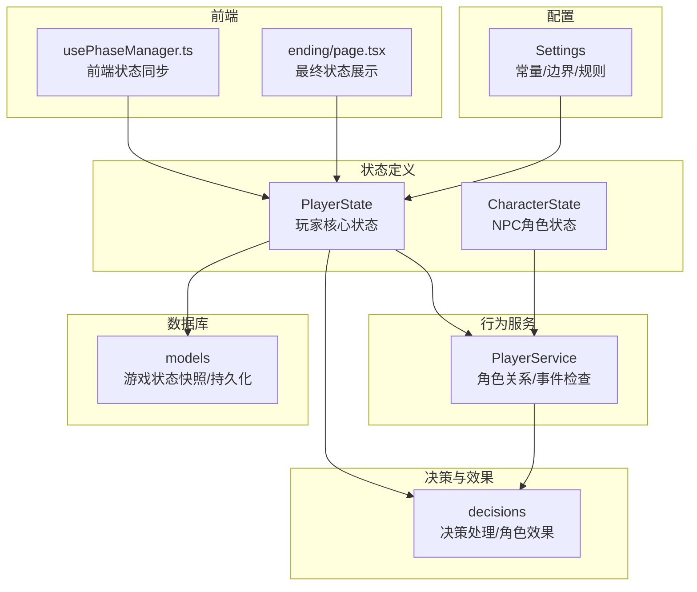
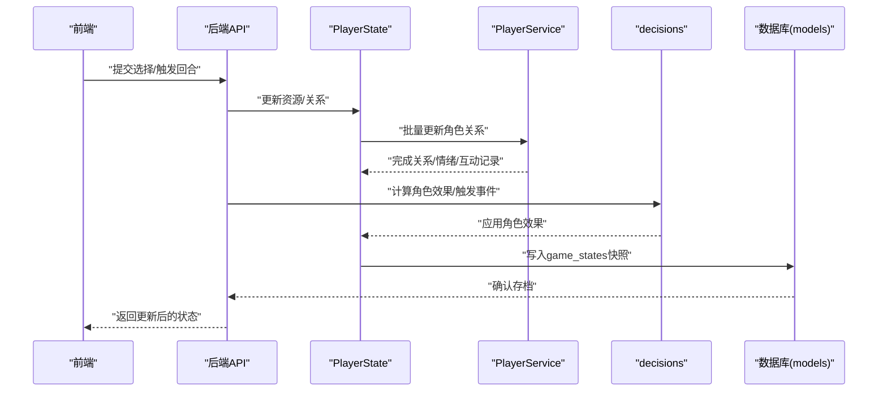
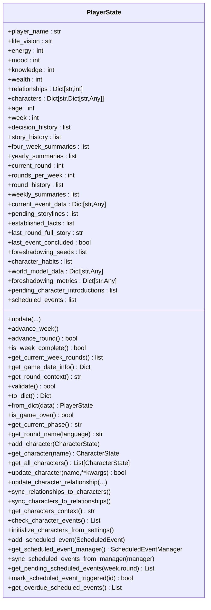
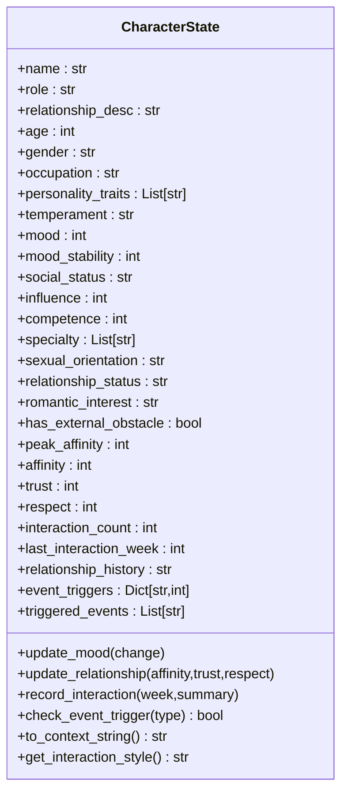
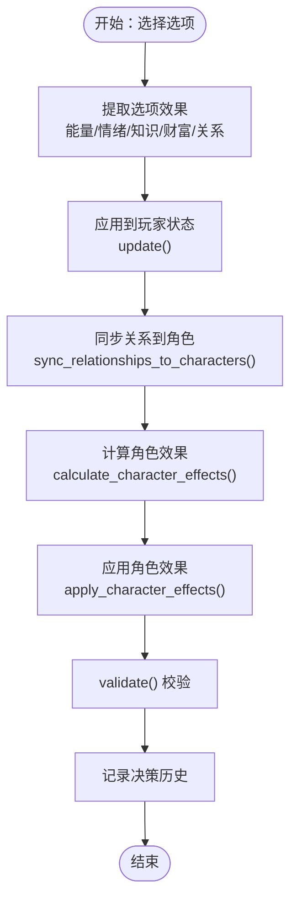
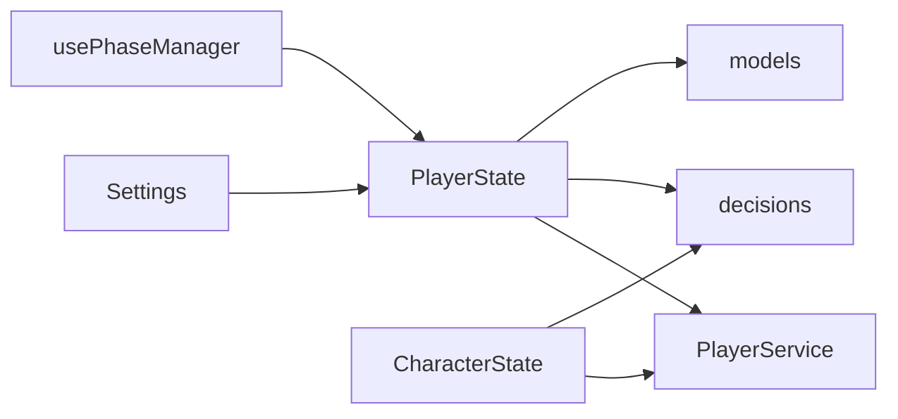

# 玩家状态管理

<cite>
**本文引用的文件**
- [player_state.py](file://src/game/state/player_state.py)
- [character_state.py](file://src/game/state/character_state.py)
- [settings.py](file://config/settings.py)
- [player_service.py](file://src/game/player_service.py)
- [models.py](file://src/database/models.py)
- [decisions.py](file://src/game/decisions.py)
- [system_mixin.py](file://src/game/round/system_mixin.py)
- [usePhaseManager.ts](file://frontend/src/hooks/game/usePhaseManager.ts)
- [page.tsx](file://frontend/src/app/ending/page.tsx)
</cite>

## 目录
1. [简介](#简介)
2. [项目结构](#项目结构)
3. [核心组件](#核心组件)
4. [架构总览](#架构总览)
5. [详细组件分析](#详细组件分析)
6. [依赖关系分析](#依赖关系分析)
7. [性能考量](#性能考量)
8. [故障排查指南](#故障排查指南)
9. [结论](#结论)
10. [附录](#附录)

## 简介
本技术文档围绕故事驱动游戏中“玩家状态管理系统”展开，重点剖析 PlayerState 类的设计架构与实现细节，涵盖四维资源系统（能量、情绪、知识、财富）的计算逻辑与平衡机制；角色状态管理（角色属性、关系网络、行为模式）；状态数据的序列化与反序列化、持久化策略；状态验证与约束检查；状态更新方法与效果计算公式；状态查询与修改的最佳实践，以及异常处理方案；并说明与其他系统组件的集成方式与数据交换格式。

## 项目结构
状态管理相关代码主要分布在以下模块：
- 状态定义层：PlayerState（玩家核心状态）、CharacterState（NPC角色状态）
- 行为服务层：PlayerService（角色关系与事件检查等业务逻辑）
- 配置层：Settings（全局常量与边界值）
- 决策与效果层：decisions（决策处理与角色效果计算）
- 数据库层：models（游戏状态快照与持久化）
- 前端集成：usePhaseManager（前端状态同步与UI阶段管理）

图表来源
- [player_state.py](file://src/game/state/player_state.py#L15-L590)
- [character_state.py](file://src/game/state/character_state.py#L13-L243)
- [player_service.py](file://src/game/player_service.py#L9-L176)
- [settings.py](file://config/settings.py#L70-L103)
- [decisions.py](file://src/game/decisions.py#L1-L200)
- [models.py](file://src/database/models.py#L94-L143)
- [usePhaseManager.ts](file://frontend/src/hooks/game/usePhaseManager.ts#L35-L65)
- [page.tsx](file://frontend/src/app/ending/page.tsx#L80-L105)

章节来源
- [player_state.py](file://src/game/state/player_state.py#L1-L590)
- [character_state.py](file://src/game/state/character_state.py#L1-L243)
- [settings.py](file://config/settings.py#L70-L103)

## 核心组件
- PlayerState：集中管理玩家四维资源、时间进度、决策历史、故事摘要、角色系统、世界模型、预定事件等，提供状态更新、周/轮推进、上下文构建、校验与序列化等方法。
- CharacterState：管理NPC角色的动态属性（情绪、亲密度、信任、尊重等）与事件触发阈值，提供关系更新、情绪调整、互动记录与上下文生成。
- PlayerService：封装复杂业务逻辑，如从设置初始化角色、批量更新角色关系、检查特殊事件、生成角色上下文等。
- Settings：集中定义初始值、资源边界、周数、轮数、衰减等常量，作为状态更新与校验的依据。
- decisions：负责将事件效果映射为玩家与角色的属性变化，并进行触发事件检查与历史记录。
- models：定义游戏状态快照表（game_states）与持久化字段，支撑存档/回溯/公共结局等能力。
- 前端 usePhaseManager：负责前端状态同步、阶段切换与连接状态管理，确保与后端状态一致。

章节来源
- [player_state.py](file://src/game/state/player_state.py#L15-L590)
- [character_state.py](file://src/game/state/character_state.py#L13-L243)
- [player_service.py](file://src/game/player_service.py#L9-L176)
- [settings.py](file://config/settings.py#L70-L103)
- [decisions.py](file://src/game/decisions.py#L1-L200)
- [models.py](file://src/database/models.py#L94-L143)
- [usePhaseManager.ts](file://frontend/src/hooks/game/usePhaseManager.ts#L35-L65)

## 架构总览
系统采用“数据模型 + 业务服务 + 决策效果 + 持久化 + 前端同步”的分层架构：
- 数据模型层：PlayerState/CharacterState 定义状态结构与边界
- 业务服务层：PlayerService 提供角色关系与事件检查等行为
- 决策效果层：decisions 将事件效果转化为资源与角色属性变化
- 持久化层：models 定义快照与归档字段，支持自动/手动存档
- 前端层：usePhaseManager 负责状态同步与UI阶段管理

图表来源
- [player_state.py](file://src/game/state/player_state.py#L159-L218)
- [player_service.py](file://src/game/player_service.py#L56-L103)
- [decisions.py](file://src/game/decisions.py#L135-L200)
- [models.py](file://src/database/models.py#L94-L111)

## 详细组件分析

### PlayerState 设计与实现
- 四维资源系统
  - 能量、情绪、知识：0-100整数边界，受 MIN_RESOURCE/MAX_RESOURCE 约束
  - 财富：非负整数，上限 MAX_WEALTH（配置中未设上限）
  - 资源衰减：配置中提供 ENERGY_DECAY、MOOD_DECAY（用于无休息/压力场景）
- 时间与轮次系统
  - age、week、current_round、rounds_per_week 控制多轮周循环
  - advance_week/advance_round/is_week_complete/get_current_week_rounds 管理周/轮推进
- 关系与角色系统
  - relationships 与 characters 字段并行，提供同步方法（sync_relationships_to_characters/sync_characters_to_relationships）
  - add_character/get_character/update_character/update_character_relationship 提供角色全生命周期管理
- 事件与摘要
  - current_event_data/current_round/full_story/last_event_concluded 支持断点续写与事件完结检测
  - round_history/weekly_summaries/four_week_summaries/yearly_summaries 维护叙事节奏
- 世界模型与预定事件
  - world_model_data 与 scheduled_events 字段承载世界一致性与未来事件
- 序列化与校验
  - to_dict/from_dict 提供 Pydantic 序列化/反序列化
  - validate 校验资源范围、周数、年龄等

图表来源
- [player_state.py](file://src/game/state/player_state.py#L15-L590)

章节来源
- [player_state.py](file://src/game/state/player_state.py#L15-L590)
- [settings.py](file://config/settings.py#L91-L98)

### CharacterState 设计与实现
- 基础信息：name、role、relationship_desc、age、gender、occupation
- 性格与气质：personality_traits、temperament
- 动态状态：mood、mood_stability
- 社会属性：social_status、influence
- 能力属性：competence、specialty
- 隐藏属性：sexual_orientation、relationship_status、romantic_interest、has_external_obstacle、peak_affinity
- 与主角关系：affinity、trust、respect
- 互动记录：interaction_count、last_interaction_week、relationship_history
- 事件触发阈值：event_triggers（包含多种事件类型的阈值）
- 行为方法：update_mood、update_relationship、record_interaction、check_event_trigger、to_context_string、get_interaction_style

图表来源
- [character_state.py](file://src/game/state/character_state.py#L13-L243)

章节来源
- [character_state.py](file://src/game/state/character_state.py#L13-L243)

### 状态更新与效果计算流程
- 决策处理
  - process_decision 校验选项索引，应用资源变化（能量、情绪、知识、财富）与关系变化
  - 同步 relationships 到 characters
  - calculate_character_effects 将 relationships 与 character_effects 转换为角色属性变化
  - apply_character_effects 批量更新角色关系与情绪，并检查事件触发
  - validate 在更新后进行状态校验
- 效果计算公式
  - 资源变化：直接累加，受 MIN_RESOURCE/MAX_RESOURCE 或非负约束限制
  - 关系变化：根据亲密度变化推导 trust/respect/mood 的微调变化（正向/负向不同系数）
  - 角色情绪：update_mood 受 mood_stability 影响，稳定性越高，变化幅度越小

图表来源
- [decisions.py](file://src/game/decisions.py#L135-L200)
- [player_state.py](file://src/game/state/player_state.py#L159-L196)
- [character_state.py](file://src/game/state/character_state.py#L122-L151)

章节来源
- [decisions.py](file://src/game/decisions.py#L1-L200)
- [player_state.py](file://src/game/state/player_state.py#L159-L196)
- [character_state.py](file://src/game/state/character_state.py#L122-L151)

### 状态验证与约束检查
- 资源边界：MIN_RESOURCE/MAX_RESOURCE 与非负约束
- 时间边界：week 在合理范围内，age 非负
- 校验入口：validate 抛出 ValueError 以保证游戏逻辑一致性
- 前端校验：usePhaseManager 负责前端状态同步与错误处理，避免不一致状态进入渲染

章节来源
- [player_state.py](file://src/game/state/player_state.py#L318-L338)
- [usePhaseManager.ts](file://frontend/src/hooks/game/usePhaseManager.ts#L35-L65)

### 序列化与持久化策略
- 序列化/反序列化：to_dict/model_dump 与 from_dict/model_construct
- 持久化：game_states 表保存每周快照，包含 state_json、week、age、is_save_point/save_name 等字段
- 前端持久化：localStorage（通过 persistStorage 包装）用于本地存档与恢复
- 端到端一致性：前端在加载后清空 currentEvent，避免恢复旧事件导致的不一致

章节来源
- [player_state.py](file://src/game/state/player_state.py#L340-L347)
- [models.py](file://src/database/models.py#L94-L111)
- [usePhaseManager.ts](file://frontend/src/hooks/game/usePhaseManager.ts#L1049-L1061)

### 与其他系统组件的集成
- 多轮系统：system_mixin 提供周/轮推进的外观与委托，确保每轮结束后生成周摘要
- 前端阶段管理：usePhaseManager 管理加载/连接/阶段切换，配合后端状态同步
- 结局页展示：ending/page.tsx 展示最终状态指标（能量、情绪、知识、财富）

章节来源
- [system_mixin.py](file://src/game/round/system_mixin.py#L34-L65)
- [usePhaseManager.ts](file://frontend/src/hooks/game/usePhaseManager.ts#L35-L65)
- [page.tsx](file://frontend/src/app/ending/page.tsx#L80-L105)

## 依赖关系分析
- PlayerState 依赖 Settings（常量与边界）
- PlayerService 依赖 PlayerState/CharacterState，提供关系与事件检查
- decisions 依赖 PlayerState/CharacterState，负责效果映射与事件触发
- models 依赖 SQLAlchemy 定义快照表结构
- 前端 usePhaseManager 依赖浏览器存储与后端状态同步

图表来源
- [settings.py](file://config/settings.py#L70-L103)
- [player_state.py](file://src/game/state/player_state.py#L15-L590)
- [player_service.py](file://src/game/player_service.py#L9-L176)
- [decisions.py](file://src/game/decisions.py#L1-L200)
- [models.py](file://src/database/models.py#L94-L143)
- [usePhaseManager.ts](file://frontend/src/hooks/game/usePhaseManager.ts#L35-L65)

章节来源
- [settings.py](file://config/settings.py#L70-L103)
- [player_state.py](file://src/game/state/player_state.py#L15-L590)
- [player_service.py](file://src/game/player_service.py#L9-L176)
- [decisions.py](file://src/game/decisions.py#L1-L200)
- [models.py](file://src/database/models.py#L94-L143)
- [usePhaseManager.ts](file://frontend/src/hooks/game/usePhaseManager.ts#L35-L65)

## 性能考量
- 状态更新复杂度：update/update_character_relationship 为 O(1)，批量更新角色关系为 O(n)
- 校验复杂度：validate 为 O(1)，仅检查边界
- 前端同步：usePhaseManager 使用浅比较（shallowChanged）减少不必要的重渲染
- 数据库写入：game_states 按周快照，is_save_point 标记手动存档点，避免频繁写入

## 故障排查指南
- 状态越界
  - 现象：validate 抛出 ValueError
  - 排查：检查资源变化是否超出 MIN_RESOURCE/MAX_RESOURCE 或财富为负
  - 处理：在应用层统一收敛至边界值
- 关系不一致
  - 现象：relationships 与 characters 不一致
  - 排查：调用 sync_relationships_to_characters/sync_characters_to_relationships 同步
- 事件未触发
  - 现象：期望事件未发生
  - 排查：检查 CharacterState.event_triggers 阈值与当前 affin/trust 状态
- 前端状态不同步
  - 现象：UI 与后端状态不一致
  - 排查：usePhaseManager 的同步逻辑与 localStorage 存档
  - 处理：加载后清空 currentEvent，避免恢复旧事件

章节来源
- [player_state.py](file://src/game/state/player_state.py#L318-L338)
- [player_state.py](file://src/game/state/player_state.py#L466-L481)
- [character_state.py](file://src/game/state/character_state.py#L169-L175)
- [usePhaseManager.ts](file://frontend/src/hooks/game/usePhaseManager.ts#L1049-L1061)

## 结论
PlayerState 通过清晰的数据模型与严格的边界约束，结合 PlayerService 的业务逻辑与 decisions 的效果映射，实现了稳定、可扩展且可验证的玩家状态管理。配合多轮系统、世界模型与预定事件，系统能够支撑复杂叙事与角色交互。持久化与前端同步策略确保了可恢复性与一致性。建议在后续迭代中持续完善事件阈值与平衡参数，加强异常日志与监控，以进一步提升稳定性与可维护性。

## 附录
- 最佳实践
  - 更新资源时统一收敛至边界，避免越界
  - 批量更新角色关系时先计算角色效果，再一次性应用
  - 每周/轮推进后及时生成摘要，保持叙事连贯
  - 使用 validate 在关键节点进行状态校验
  - 前端加载后清空 currentEvent，防止旧事件干扰
- 数据交换格式
  - PlayerState/CharacterState 使用 Pydantic JSON 序列化
  - game_states.state_json 存储完整状态快照
  - 前端 localStorage 使用 JSON 字符串存储