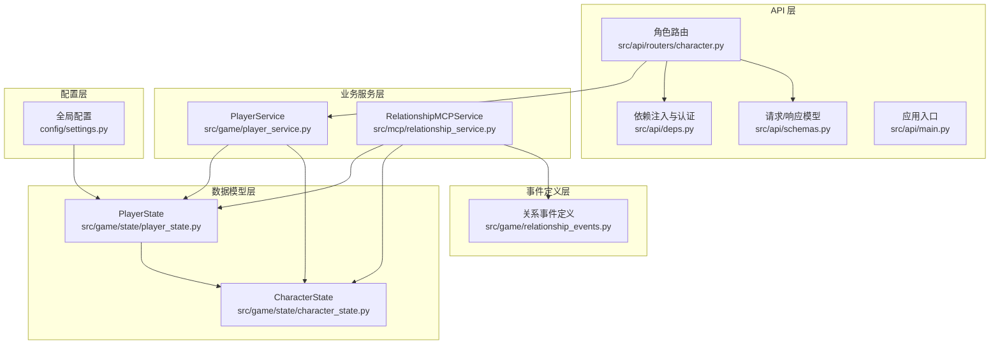
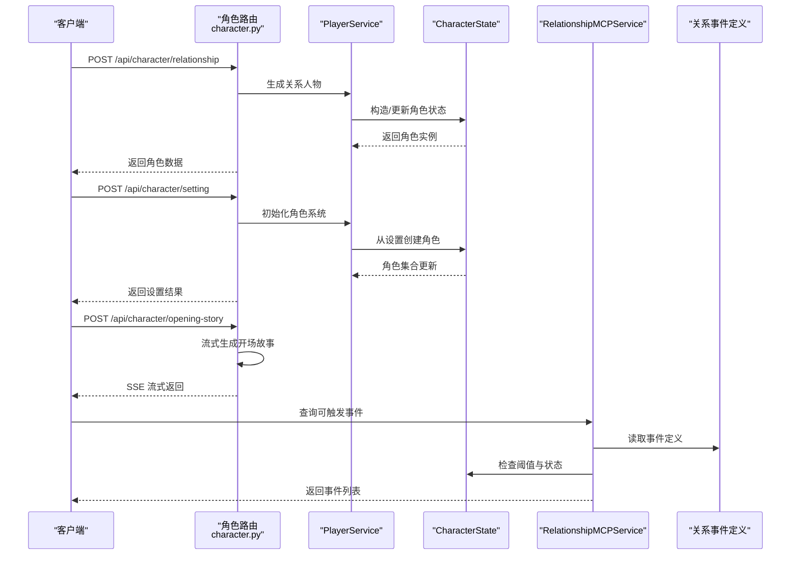
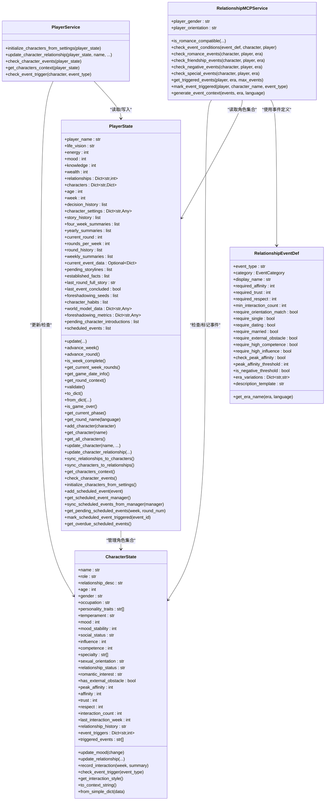
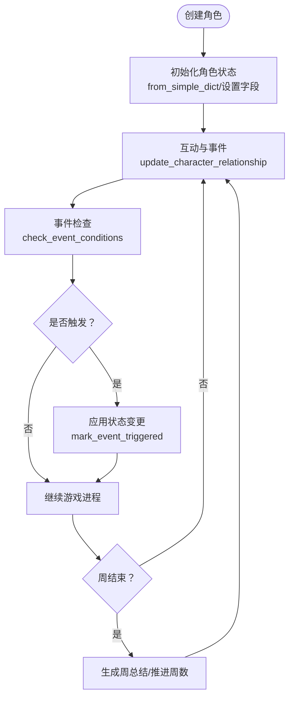

# 角色状态管理

<cite>
**本文引用的文件**
- [src/game/state/character_state.py](file://src/game/state/character_state.py)
- [src/game/state/player_state.py](file://src/game/state/player_state.py)
- [src/mcp/relationship_service.py](file://src/mcp/relationship_service.py)
- [src/game/relationship_events.py](file://src/game/relationship_events.py)
- [src/game/player_service.py](file://src/game/player_service.py)
- [src/api/routers/character.py](file://src/api/routers/character.py)
- [src/api/schemas.py](file://src/api/schemas.py)
- [src/api/deps.py](file://src/api/deps.py)
- [src/api/main.py](file://src/api/main.py)
- [config/settings.py](file://config/settings.py)
- [tests/test_character_state.py](file://tests/test_character_state.py)
- [tests/test_mcp_service.py](file://tests/test_mcp_service.py)
</cite>

## 目录
1. [简介](#简介)
2. [项目结构](#项目结构)
3. [核心组件](#核心组件)
4. [架构总览](#架构总览)
5. [详细组件分析](#详细组件分析)
6. [依赖关系分析](#依赖关系分析)
7. [性能考虑](#性能考虑)
8. [故障排查指南](#故障排查指南)
9. [结论](#结论)
10. [附录](#附录)

## 简介
本技术文档围绕“角色状态管理”主题，系统阐述 CharacterState 类的设计架构与数据结构，解析角色属性的计算与叠加机制，梳理角色状态的生命周期（从创建、成长到变化），说明角色关系网络的维护与事件触发机制，并提供与 MCP 服务的关系管理集成与外部数据同步方案。同时给出角色状态查询与修改的 API 接口文档、状态验证与约束检查的实现细节，以及与前端交互的序列图与类图，帮助开发者快速理解与扩展。

## 项目结构
角色状态管理涉及以下关键模块：
- 数据模型层：CharacterState（NPC 角色）、PlayerState（玩家状态）
- 业务服务层：PlayerService（角色关系更新与事件检查）、RelationshipMCPService（关系事件检测与触发）
- 事件定义层：relationship_events（关系事件定义与时代适配）
- API 层：character 路由（角色创建与属性生成）、公共依赖与异常处理
- 配置层：settings（全局常量与边界约束）

图表来源
- [src/api/routers/character.py](file://src/api/routers/character.py#L1-L210)
- [src/api/schemas.py](file://src/api/schemas.py#L1-L333)
- [src/api/deps.py](file://src/api/deps.py#L1-L150)
- [src/api/main.py](file://src/api/main.py#L1-L134)
- [src/game/player_service.py](file://src/game/player_service.py#L1-L176)
- [src/mcp/relationship_service.py](file://src/mcp/relationship_service.py#L1-L520)
- [src/game/state/character_state.py](file://src/game/state/character_state.py#L1-L243)
- [src/game/state/player_state.py](file://src/game/state/player_state.py#L1-L590)
- [src/game/relationship_events.py](file://src/game/relationship_events.py#L1-L354)
- [config/settings.py](file://config/settings.py#L1-L168)

章节来源
- [src/api/routers/character.py](file://src/api/routers/character.py#L1-L210)
- [src/game/state/character_state.py](file://src/game/state/character_state.py#L1-L243)
- [src/game/state/player_state.py](file://src/game/state/player_state.py#L1-L590)
- [src/mcp/relationship_service.py](file://src/mcp/relationship_service.py#L1-L520)
- [src/game/relationship_events.py](file://src/game/relationship_events.py#L1-L354)
- [src/game/player_service.py](file://src/game/player_service.py#L1-L176)
- [src/api/schemas.py](file://src/api/schemas.py#L1-L333)
- [src/api/deps.py](file://src/api/deps.py#L1-L150)
- [src/api/main.py](file://src/api/main.py#L1-L134)
- [config/settings.py](file://config/settings.py#L1-L168)

## 核心组件
- CharacterState：NPC 角色的属性系统，包含基础信息、动态状态、社会属性、能力属性、隐藏属性、与主角关系、互动记录、事件阈值与已触发事件等字段，提供情绪更新、关系更新、互动记录、事件触发检查、上下文生成等方法。
- PlayerState：玩家核心状态，包含资源属性、时间进度、决策历史、角色集合、世界模型、预定事件等，提供资源更新、周/轮推进、上下文构建、角色管理、事件检查等方法。
- PlayerService：封装复杂业务逻辑，负责从设置初始化角色、更新角色关系、检查特殊事件、生成角色上下文。
- RelationshipMCPService：关系事件检测与触发服务，负责兼容性判断、事件条件检查、事件触发标记与状态变更、事件上下文生成。
- 关系事件定义：定义 15 种关系事件及其阈值、时代适配与描述模板。

章节来源
- [src/game/state/character_state.py](file://src/game/state/character_state.py#L13-L243)
- [src/game/state/player_state.py](file://src/game/state/player_state.py#L15-L590)
- [src/game/player_service.py](file://src/game/player_service.py#L9-L176)
- [src/mcp/relationship_service.py](file://src/mcp/relationship_service.py#L45-L520)
- [src/game/relationship_events.py](file://src/game/relationship_events.py#L10-L354)

## 架构总览
角色状态管理采用“数据模型 + 业务服务 + API 路由”的分层架构。API 路由接收请求，调用 PlayerService 或 MCP 服务进行业务处理，最终将状态持久化或返回给前端。PlayerState 维护角色集合，CharacterState 作为单个 NPC 的属性载体；MCP 服务通过事件定义驱动角色关系网络的演化。

图表来源
- [src/api/routers/character.py](file://src/api/routers/character.py#L27-L210)
- [src/game/player_service.py](file://src/game/player_service.py#L13-L176)
- [src/game/state/character_state.py](file://src/game/state/character_state.py#L13-L243)
- [src/mcp/relationship_service.py](file://src/mcp/relationship_service.py#L330-L387)
- [src/game/relationship_events.py](file://src/game/relationship_events.py#L95-L338)

## 详细组件分析

### CharacterState 类设计与数据结构
- 基础信息：姓名、角色定位、关系描述、年龄、性别、职业
- 性格系统：性格标签列表、气质类型（五种气质之一）
- 动态状态：当前情绪、情绪稳定性（影响情绪变化幅度）
- 社会属性：社会地位（学生/普通/专业人士/领导者/精英）、影响力
- 能力属性：能力水平、专长领域
- 隐藏属性：性倾向、感情状态、浪漫兴趣、外部阻力、历史最高亲密度
- 与主角关系：亲密度、信任度、尊重度
- 互动记录：互动次数、最近互动周数、关系发展简述
- 事件阈值：15 种关系事件的触发阈值字典
- 已触发事件：避免重复触发的事件类型列表

方法要点：
- 情绪更新：受情绪稳定性影响，变化幅度按稳定性系数调整
- 关系更新：分别更新亲密度、信任度、尊重度，并维护历史最高亲密度
- 互动记录：累计互动次数与周数，追加关系发展简述
- 事件触发检查：委托 PlayerService 检查阈值条件
- 上下文生成：生成用于 AI 的角色描述字符串
- 兼容构造：支持从简单字典创建角色

章节来源
- [src/game/state/character_state.py](file://src/game/state/character_state.py#L13-L243)
- [tests/test_character_state.py](file://tests/test_character_state.py#L1-L205)

### PlayerState 类设计与生命周期
- 资源属性：体力、情绪、知识、财富（边界由配置控制）
- 关系字典：向后兼容的亲密度映射
- 角色集合：以字典形式存储 CharacterState 的序列化结果
- 时间进度：年龄、周数、轮次、周内轮次数
- 决策与历史：决策历史、故事历史、周/年总结
- 世界模型：地点、职业、承诺、因果链、身体状态等结构化数据
- 预定事件：带时间点的承诺事件，到达轮次自动触发
- 方法：资源更新、周推进、轮推进、日期信息、上下文构建、角色管理、事件检查、校验与序列化

章节来源
- [src/game/state/player_state.py](file://src/game/state/player_state.py#L15-L590)
- [config/settings.py](file://config/settings.py#L70-L102)

### PlayerService 业务逻辑
- 从设置初始化角色：将 key_people 转换为 CharacterState，保留既有亲密度
- 更新角色关系：统一更新亲密度/信任度/尊重度、情绪、互动记录，并同步回 PlayerState
- 检查特殊事件：遍历角色集合，依据事件阈值判断是否触发
- 生成角色上下文：拼接所有角色的描述字符串供 AI 使用
- 事件触发判定：根据事件类型与阈值策略判断

章节来源
- [src/game/player_service.py](file://src/game/player_service.py#L9-L176)

### RelationshipMCPService 事件检测与触发
- 兼容性判断：根据主角与 NPC 的性别/性倾向判断是否可能发展浪漫关系
- 事件条件检查：逐项校验亲密度/信任度/尊重度、互动次数、感情状态、外部阻力、高能力/高影响力、历史最高亲密度等
- 事件分类：浪漫关系、友谊信任、负面关系、特殊关系四类
- 事件触发：标记事件已触发，应用状态变更（如感情状态、浪漫兴趣、外部阻力移除）
- 事件上下文：生成供 AI 自然融入故事的事件上下文

章节来源
- [src/mcp/relationship_service.py](file://src/mcp/relationship_service.py#L45-L520)
- [src/game/relationship_events.py](file://src/game/relationship_events.py#L10-L354)
- [tests/test_mcp_service.py](file://tests/test_mcp_service.py#L1-L286)

### 关系事件定义与时代适配
- 事件分类：浪漫关系（恋爱萌芽、求婚/成婚、分手/离婚、私奔）、友谊信任（结拜、知己、创业合伙、托付）、负面关系（反目成仇、背叛、决裂、暗中陷害）、特殊关系（师徒传承、贵人提携、生育子女）
- 阈值与条件：每类事件定义亲密度/信任度/尊重度阈值、互动次数、感情状态、外部阻力、高能力/高影响力、历史最高亲密度等
- 时代适配：事件名称按时代（现代/近代/古代中国/古代西方）映射

章节来源
- [src/game/relationship_events.py](file://src/game/relationship_events.py#L10-L354)

### API 接口文档（角色状态相关）
- 角色设置生成
  - POST /api/character/setting
  - 请求体：GenerateSettingRequest（setting_type、player_name、life_vision、previous_settings、feedback、language）
  - 返回：生成的设置字典
- 单个关系人物生成
  - POST /api/character/relationship
  - 请求体：GenerateRelationshipRequest（existing_people、person_index、total_needed、feedback、language）
  - 返回：关系人物的完整属性（含 CharacterState 字段）
- 初始属性生成
  - POST /api/character/attributes
  - 请求体：GenerateAttributesRequest（character_settings、language）
  - 返回：energy、mood、knowledge、wealth 初始值
- 开场故事生成（SSE）
  - POST /api/character/opening-story
  - 请求体：OpeningStoryRequest（character_settings、player_name、life_vision、language）
  - 返回：SSE 流式文本
- 关系总结合成
  - POST /api/character/relationships-summary
  - 请求体：RelationshipsSummaryRequest（key_people、language）
  - 返回：relationships_description

章节来源
- [src/api/routers/character.py](file://src/api/routers/character.py#L27-L210)
- [src/api/schemas.py](file://src/api/schemas.py#L76-L110)

### 角色状态验证与约束检查
- PlayerState 校验：确保资源值在边界内、周数与年龄合理、财富非负
- CharacterState 校验：字段范围约束（如年龄、情绪、亲密度等）由 Pydantic Field 的 ge/le 控制
- 关系阈值：事件触发依赖于阈值与状态，避免无效触发
- 重复触发防护：triggered_events 列表避免同一事件重复触发

章节来源
- [src/game/state/player_state.py](file://src/game/state/player_state.py#L318-L338)
- [src/game/state/character_state.py](file://src/game/state/character_state.py#L13-L243)
- [src/mcp/relationship_service.py](file://src/mcp/relationship_service.py#L163-L238)

### 与 MCP 服务的关系管理集成与外部数据同步
- MCP 服务从 PlayerState 的角色集合中读取 CharacterState，检查事件条件并返回可触发事件列表
- 标记事件已触发后，应用状态变更（如感情状态、浪漫兴趣、外部阻力），并同步回 PlayerState
- 事件上下文生成：将事件自然融入故事叙述，供 AI 使用
- 外部数据同步：角色集合以字典形式存储，便于与数据库/会话存储交互

章节来源
- [src/mcp/relationship_service.py](file://src/mcp/relationship_service.py#L330-L489)
- [src/game/state/player_state.py](file://src/game/state/player_state.py#L384-L496)

## 依赖关系分析

图表来源
- [src/game/state/character_state.py](file://src/game/state/character_state.py#L13-L243)
- [src/game/state/player_state.py](file://src/game/state/player_state.py#L15-L590)
- [src/game/player_service.py](file://src/game/player_service.py#L9-L176)
- [src/mcp/relationship_service.py](file://src/mcp/relationship_service.py#L45-L520)
- [src/game/relationship_events.py](file://src/game/relationship_events.py#L18-L91)

## 性能考虑
- 字典存储与序列化：PlayerState 以字典形式存储角色，便于快速读取与持久化；注意避免频繁深拷贝。
- 事件检查批量化：MCP 服务一次性遍历所有角色与事件类别，建议在角色数量较多时进行分页或缓存热点角色。
- SSE 流式生成：开场故事采用流式返回，减少前端等待时间，需注意超时与错误处理。
- 边界校验：PlayerState 的 validate 方法在关键节点执行，避免异常状态进入后续流程。

## 故障排查指南
- 事件未触发
  - 检查角色的亲密度/信任度/尊重度是否达到阈值
  - 确认感情状态、外部阻力、高能力/高影响力等附加条件
  - 查看 triggered_events 是否已包含该事件类型
- 情绪波动异常
  - 检查情绪稳定性对变化幅度的影响
  - 确认更新路径是否正确（通过 CharacterState.update_mood 或 PlayerService.update_character_relationship）
- 关系同步不一致
  - 确认 PlayerState.relationships 与 CharacterState.affinity 的同步逻辑
  - 使用 sync_relationships_to_characters 或 sync_characters_to_relationships
- API 返回异常
  - 检查依赖注入与认证头（Cookie/Bearer Token）
  - 查看全局异常处理器返回的错误详情

章节来源
- [src/mcp/relationship_service.py](file://src/mcp/relationship_service.py#L146-L238)
- [src/game/state/character_state.py](file://src/game/state/character_state.py#L122-L152)
- [src/game/state/player_state.py](file://src/game/state/player_state.py#L466-L481)
- [src/api/deps.py](file://src/api/deps.py#L90-L133)
- [src/api/main.py](file://src/api/main.py#L70-L77)

## 结论
本角色状态管理体系以 CharacterState 为核心数据模型，配合 PlayerState 的生命周期管理与 PlayerService/MCP 服务的业务逻辑，实现了从角色创建、属性计算、关系维护到事件触发与外部数据同步的完整闭环。通过清晰的阈值与时代适配机制，系统能够稳定地驱动角色关系网络的演进，并为 AI 故事生成提供高质量的上下文。建议在大规模角色场景下引入缓存与批处理策略，持续优化事件检查与状态同步性能。

## 附录

### 角色属性计算与叠加机制
- 基础属性：由角色设定生成（如初始属性），受时代、家庭背景、年龄等因素影响
- 临时修饰：通过事件与互动产生的短期变化（如情绪波动、亲密度变化）
- 永久增益：通过高能力/高影响力等条件达成的长期状态提升
- 叠加原则：临时修饰在当前轮次生效，永久增益通过阈值与状态检查逐步体现

### 角色状态生命周期流程

图表来源
- [src/game/state/character_state.py](file://src/game/state/character_state.py#L122-L173)
- [src/mcp/relationship_service.py](file://src/mcp/relationship_service.py#L389-L429)
- [src/game/state/player_state.py](file://src/game/state/player_state.py#L197-L218)