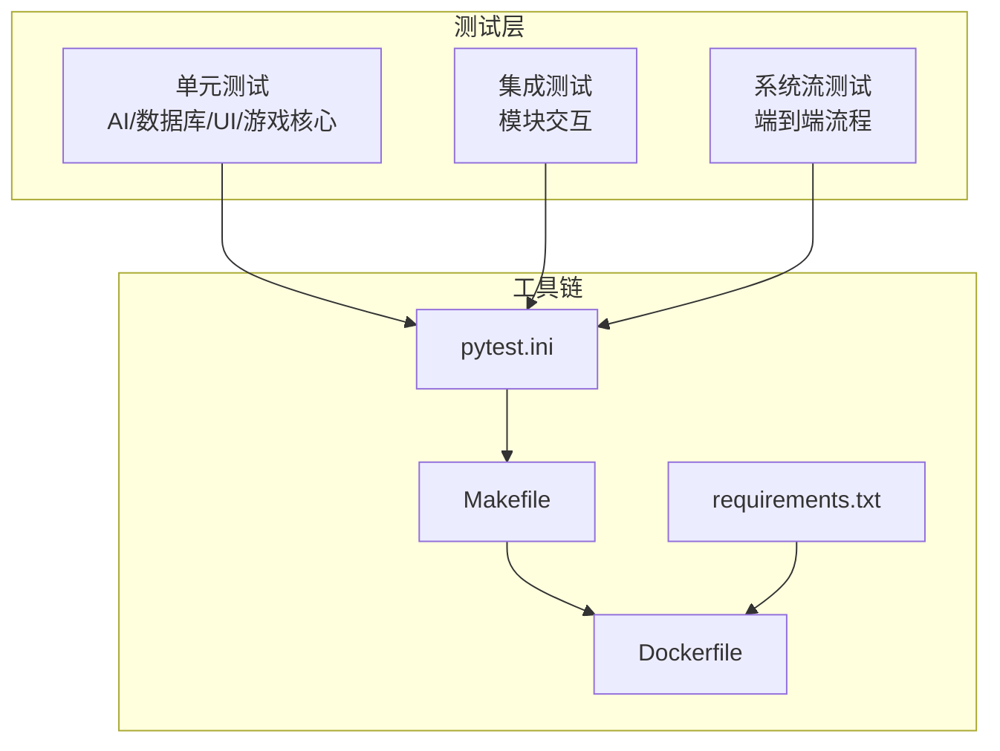
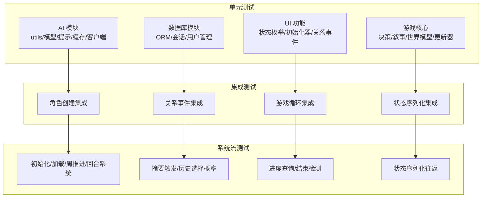
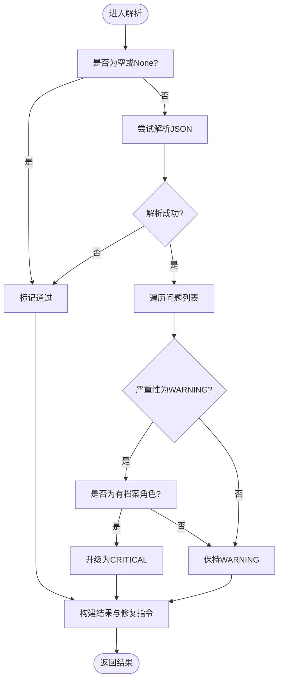
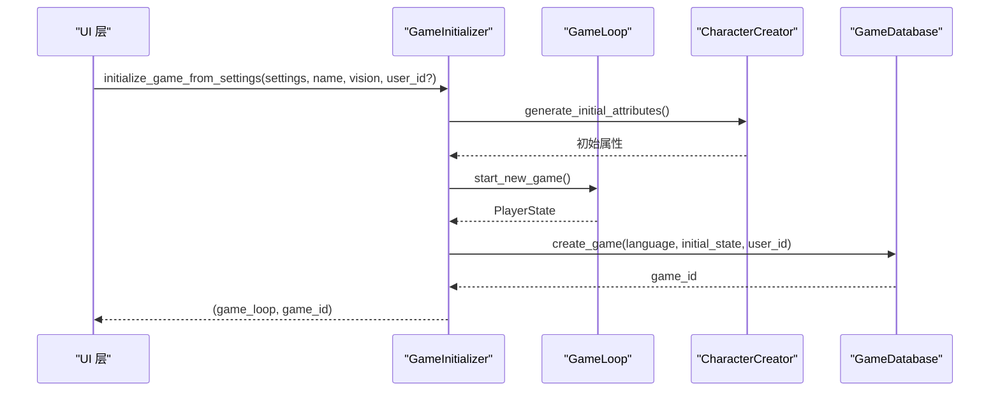
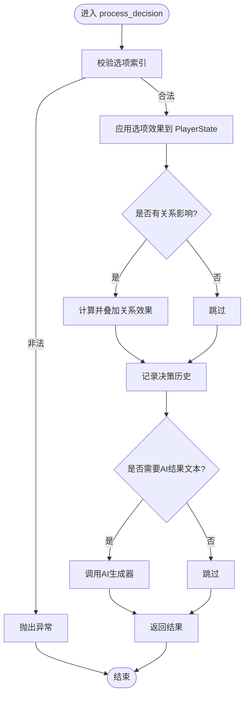
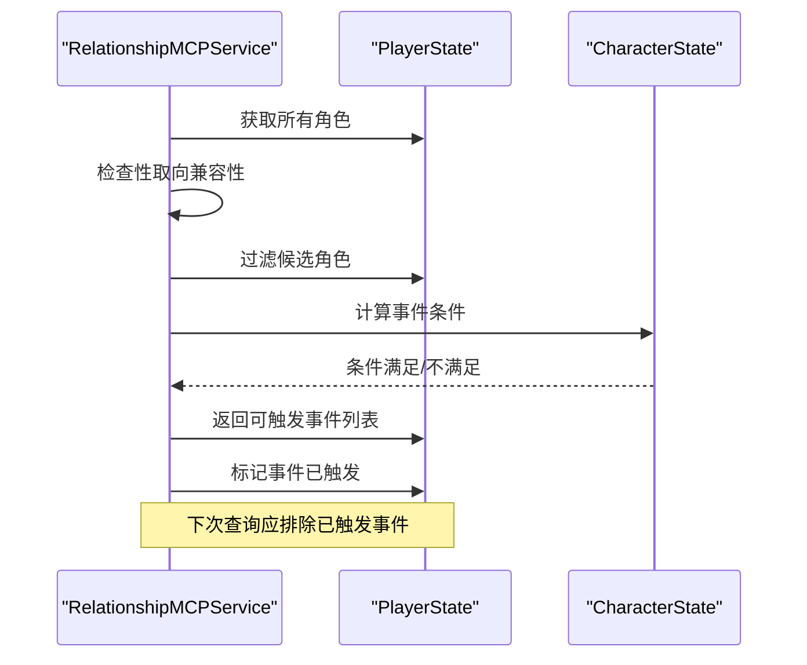
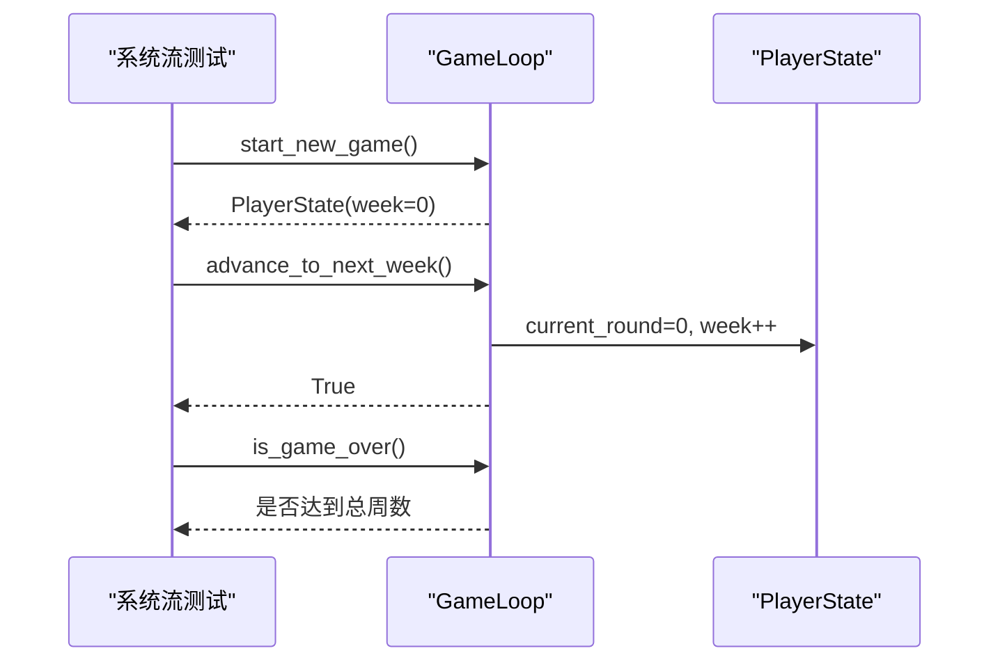
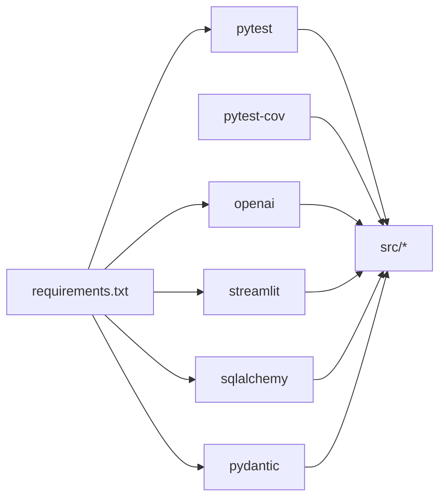

# 测试策略

<cite>
**本文引用的文件**
- [pytest.ini](file://pytest.ini)
- [Makefile](file://Makefile)
- [Dockerfile](file://Dockerfile)
- [requirements.txt](file://requirements.txt)
- [tests/test_ai_modules.py](file://tests/test_ai_modules.py)
- [tests/test_database.py](file://tests/test_database.py)
- [tests/test_ui_functional.py](file://tests/test_ui_functional.py)
- [tests/test_game_core.py](file://tests/test_game_core.py)
- [tests/test_integration.py](file://tests/test_integration.py)
- [tests/test_character_creation.py](file://tests/test_character_creation.py)
- [tests/test_mcp_service.py](file://tests/test_mcp_service.py)
- [tests/test_system_flow.py](file://tests/test_system_flow.py)
- [test_continuity_fix.py](file://test_continuity_fix.py)
- [test_state_machine.py](file://test_state_machine.py)
</cite>

## 目录
1. [引言](#引言)
2. [项目结构](#项目结构)
3. [核心组件](#核心组件)
4. [架构总览](#架构总览)
5. [详细组件分析](#详细组件分析)
6. [依赖分析](#依赖分析)
7. [性能考量](#性能考量)
8. [故障排查指南](#故障排查指南)
9. [结论](#结论)
10. [附录](#附录)

## 引言
本测试策略文档面向该故事类交互式游戏项目的测试架构与质量保证体系，系统阐述单元测试、集成测试与端到端测试的设计原则与实施方法；覆盖 AI 服务测试、数据库测试与 UI 测试的特殊考虑；明确测试数据管理、模拟对象使用与测试环境配置；给出测试覆盖率与质量门禁建议；解释持续集成与自动化测试执行流程，并提供调试技巧与性能测试方法。

## 项目结构
该项目采用分层模块化组织，测试用例按功能域划分在 tests 目录中，配合 pytest 配置与 Makefile 提供一键执行与覆盖率统计能力。Dockerfile 支持容器化运行与健康检查，requirements.txt 明确运行与测试依赖。



图表来源
- [pytest.ini](file://pytest.ini#L1-L7)
- [Makefile](file://Makefile#L1-L93)
- [Dockerfile](file://Dockerfile#L1-L48)
- [requirements.txt](file://requirements.txt#L1-L9)

章节来源
- [pytest.ini](file://pytest.ini#L1-L7)
- [Makefile](file://Makefile#L1-L93)
- [Dockerfile](file://Dockerfile#L1-L48)
- [requirements.txt](file://requirements.txt#L1-L9)

## 核心组件
- 测试框架与执行
  - 使用 pytest 进行测试发现与执行，通过 pytest.ini 统一配置测试路径、命名规范与输出格式。
  - Makefile 提供测试快捷命令：test、test-fast(-x)、test-cov(--cov=src) 等，便于本地与 CI 执行。
- 覆盖率与质量门禁
  - 使用 pytest-cov 生成 HTML 与终端报告，默认对 src 目录进行覆盖率统计。
  - 建议在 CI 中设置覆盖率阈值（如语句/分支均不低于 80%）作为质量门禁。
- 模拟与隔离
  - 大量使用 unittest.mock.patch/Mock 对外部依赖（如 OpenAI 客户端、数据库会话）进行模拟，确保测试可重复且快速。
- 数据与状态
  - 数据库测试采用内存 SQLite，通过 SQLAlchemy fixture 构建临时表与会话，避免污染真实数据。
  - 游戏状态与 UI 状态通过序列化/反序列化验证一致性，减少对运行时环境的依赖。

章节来源
- [pytest.ini](file://pytest.ini#L1-L7)
- [Makefile](file://Makefile#L19-L31)
- [Makefile](file://Makefile#L23-L26)

## 架构总览
测试架构分为三层：单元测试、集成测试与系统流测试。单元测试聚焦原子函数与小模块；集成测试关注跨模块协作；系统流测试覆盖从初始化到结束的完整流程。



图表来源
- [tests/test_ai_modules.py](file://tests/test_ai_modules.py#L1-L522)
- [tests/test_database.py](file://tests/test_database.py#L1-L643)
- [tests/test_ui_functional.py](file://tests/test_ui_functional.py#L1-L227)
- [tests/test_game_core.py](file://tests/test_game_core.py#L1-L651)
- [tests/test_integration.py](file://tests/test_integration.py#L1-L238)
- [tests/test_system_flow.py](file://tests/test_system_flow.py#L1-L332)

## 详细组件分析

### AI 服务测试
- 设计原则
  - 以行为驱动：围绕 AIClient 的调用、重试、流式回调；ConsistencyValidator 的解析与升级逻辑；ProfileSynthesizer 的合成流程。
  - 以边界覆盖：空输入、无效 JSON、语言差异、角色特征升级为严重性等。
- 实施要点
  - 使用 patch 替换 openai.OpenAI，控制返回值与异常，验证错误处理与回退。
  - 使用临时目录测试 EventCache 的键生成、大小与清理。
  - 使用 JSON 字符串与多语言断言 fix 指令与严重性。
- 关键流程图：验证响应解析与严重性升级



图表来源
- [tests/test_ai_modules.py](file://tests/test_ai_modules.py#L214-L292)

章节来源
- [tests/test_ai_modules.py](file://tests/test_ai_modules.py#L1-L522)

### 数据库测试
- 设计原则
  - 使用内存 SQLite 与 SQLAlchemy fixture，确保每个测试独立、可重复。
  - 覆盖唯一性约束、级联删除、关联状态变更等关键业务规则。
- 实施要点
  - 通过自定义 SessionLocal 与 init_db 的 patch，隔离真实数据库连接。
  - 验证 GameDatabase 的创建/保存/加载/删除等操作。
  - 用户管理测试包括 ID 生成格式、去重、登录规范化、好友请求与状态机等。
- 关键类图：ORM 模型与 GameDatabase

```mermaid
classDiagram
class User {
+uuid user_id
+string private_id
+string public_id
+string display_name
+datetime created_at
}
class Friendship {
+uuid id
+uuid user_id
+uuid friend_id
+string status
}
class Game {
+uuid game_id
+uuid user_id
+string language
+dict initial_state
}
class GameState {
+uuid state_id
+uuid game_id
+int week
+int age
+dict state_json
}
class Decision {
+uuid decision_id
+uuid game_id
+int week
+string event_description
+string choice_text
+dict effects
}
class Ending {
+uuid ending_id
+uuid game_id
+dict final_state
+string ending_type
+string summary
}
class CharacterPreset {
+uuid preset_id
+string preset_name
+string player_name
+dict character_settings
}
User ||--o{ Friendship : "拥有"
User ||--o{ Game : "拥有"
Game ||--o{ GameState : "包含"
Game ||--o{ Decision : "包含"
Game ||--o{ Ending : "可能包含"
User ||--o{ CharacterPreset : "拥有"
```

图表来源
- [tests/test_database.py](file://tests/test_database.py#L11-L12)

章节来源
- [tests/test_database.py](file://tests/test_database.py#L1-L643)

### UI 测试
- 设计原则
  - 以状态枚举与服务初始化器为核心，验证状态转换与设置加载。
  - 通过 Mock 驱动 GameLoop 与 CharacterCreator，验证初始化流程与参数传递。
- 实施要点
  - 测试 GameState 枚举值与序列化往返。
  - 验证从设置中加载关系、年龄等配置，以及与数据库交互时 user_id 的传递。
  - 验证关系事件模块可导入，保障 UI 侧依赖稳定。
- 关键序列图：游戏初始化流程



图表来源
- [tests/test_ui_functional.py](file://tests/test_ui_functional.py#L109-L183)

章节来源
- [tests/test_ui_functional.py](file://tests/test_ui_functional.py#L1-L227)

### 游戏核心测试
- 设计原则
  - 决策系统：校验关系影响、角色效果叠加、回退文案生成。
  - 叙事管理：故事线、事实、伏笔种子、习惯的增删改查与限制。
  - 世界模型：地点、职业、承诺、因果链、身体状态、人物画像的数据类序列化。
- 实施要点
  - 使用 Mock 的 AI 生成器验证 AI 结果文本注入。
  - 通过大量边界条件测试（空输入、超限、过期清理）保障稳定性。
- 关键流程图：决策处理



图表来源
- [tests/test_game_core.py](file://tests/test_game_core.py#L116-L178)

章节来源
- [tests/test_game_core.py](file://tests/test_game_core.py#L1-L651)

### 集成测试
- 设计原则
  - 角色创建与 PlayerState 同步：隐藏属性、关系字典与角色映射一致性。
  - 关系事件：基于性取向兼容性的触发与防重复机制。
  - 游戏循环：AI 生成器初始化、历史摘要选择的随机回退路径。
  - 状态序列化：PlayerState 与 CharacterState 的 round-trip。
- 实施要点
  - 使用 patch 隔离外部依赖，确保集成测试仅验证交互契约。
  - 验证服务初始化、事件触发、标记与上下文生成。
- 关键序列图：关系事件触发与防重复



图表来源
- [tests/test_integration.py](file://tests/test_integration.py#L65-L133)

章节来源
- [tests/test_integration.py](file://tests/test_integration.py#L1-L238)

### 系统流测试（端到端）
- 设计原则
  - 初始化：从 GameLoop 启动新游戏，加载已有状态。
  - 周推进与回合系统：每周 3 回合，周末推进与回合重置。
  - 摘要触发：周/四周期/年摘要存储。
  - 历史摘要选择：基于距离的概率衰减与回退。
  - 进度与结束：进度百分比、游戏结束检测。
  - 序列化：PlayerState/CharacterState 完整 round-trip。
- 实施要点
  - 使用 patch 驱动 AI 生成器，避免真实 API 调用。
  - 验证 get_round_context 与 _build_continuation_mandate 的上下文拼接。
- 关键序列图：初始化与周推进



图表来源
- [tests/test_system_flow.py](file://tests/test_system_flow.py#L10-L85)

章节来源
- [tests/test_system_flow.py](file://tests/test_system_flow.py#L1-L332)

### 特殊场景与修复验证
- 故事连续性修复验证
  - 验证 _build_continuation_mandate 在事件“已完结”与“未完结”两种情况下的提示词构建。
  - 验证 get_round_context 包含未完结标记。
  - 验证从原始 JSON 中提取摘要的容错处理。
- 状态机验证
  - 使用自定义 MockSessionState 模拟 Streamlit 会话状态，验证按钮切换与状态一致性规则（互斥状态、前置条件）。

章节来源
- [test_continuity_fix.py](file://test_continuity_fix.py#L1-L82)
- [test_state_machine.py](file://test_state_machine.py#L1-L207)

## 依赖分析
- 外部依赖
  - pytest、pytest-cov：测试执行与覆盖率。
  - openai、httpx：AI 服务调用。
  - streamlit：UI 框架。
  - pydantic、sqlalchemy、psycopg2-binary：数据模型与数据库访问。
- 内部耦合
  - 测试对 src.* 的直接依赖通过 patch 降低耦合度。
  - 数据库测试通过 SessionLocal 与 init_db 的 patch 隔离真实连接。
- 循环依赖风险
  - 当前测试未见明显循环依赖；建议后续引入接口抽象进一步降低耦合。



图表来源
- [requirements.txt](file://requirements.txt#L1-L9)

章节来源
- [requirements.txt](file://requirements.txt#L1-L9)

## 性能考量
- 单元测试性能
  - 使用 Mock 与内存数据库，避免网络与磁盘 IO。
  - 将大样本统计测试（如性取向分布）限定在合理采样规模。
- 集成与系统流测试
  - 通过 patch 控制外部调用耗时；必要时使用更短的 TOTAL_WEEKS 或更少周数。
- 覆盖率与性能平衡
  - 建议在 CI 中开启覆盖率统计，但对热点路径优先保证质量而非覆盖率。

## 故障排查指南
- 常见问题定位
  - AI 相关失败：检查 patch 的返回值与异常路径，确认 JSON 解析与语言参数。
  - 数据库失败：核对唯一性约束与级联删除；确认 fixture 初始化顺序。
  - UI 初始化失败：检查 Mock 参数与 GameLoop 的调用链。
- 调试技巧
  - 使用 pytest -v --tb=long 查看详细堆栈。
  - 在关键断点处打印中间状态（如 PlayerState、CharacterState）。
  - 使用 -k 选择性运行特定测试用例。
- 性能测试方法
  - 使用 pytest-benchmark（需安装）对热点函数进行基准测试。
  - 对 AI 生成与数据库批量操作进行压力测试，观察延迟与吞吐。

章节来源
- [pytest.ini](file://pytest.ini#L6-L7)
- [Makefile](file://Makefile#L23-L26)

## 结论
本项目测试策略以 pytest 为核心，结合 Mock 与内存数据库实现高内聚低耦合的测试体系。通过单元、集成与系统流三级测试覆盖关键路径，辅以覆盖率与质量门禁，确保 AI 服务、数据库与 UI 的稳定性与一致性。建议在 CI 中强制覆盖率阈值与健康检查，持续优化测试执行效率与可维护性。

## 附录
- 测试命令与覆盖率
  - 本地执行：make test、make test-fast、make test-cov。
  - CI 建议：在流水线中执行 make test-cov 并上传报告。
- 质量门禁建议
  - 语句覆盖率 ≥ 80%，分支覆盖率 ≥ 70%。
  - 新增/修改代码必须补充或更新对应测试。
- 持续集成流程
  - Dockerfile 提供健康检查；CI 可基于 Dockerfile 构建镜像并运行测试。
  - Makefile 提供统一入口，便于在 CI 中复用。

章节来源
- [Makefile](file://Makefile#L19-L31)
- [Makefile](file://Makefile#L23-L26)
- [Dockerfile](file://Dockerfile#L39-L40)