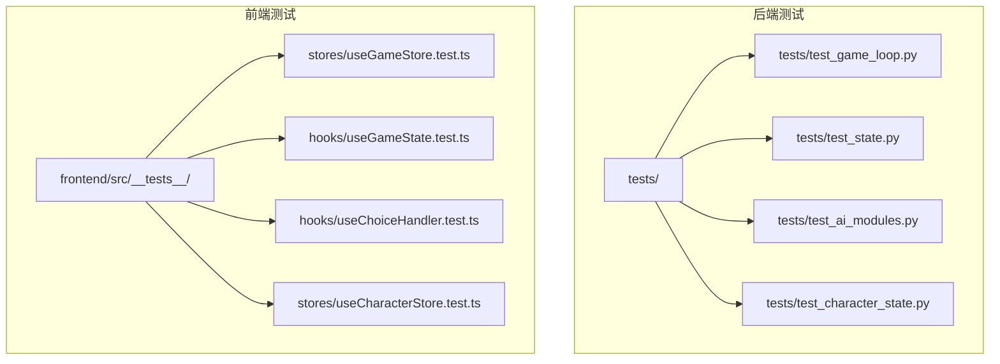
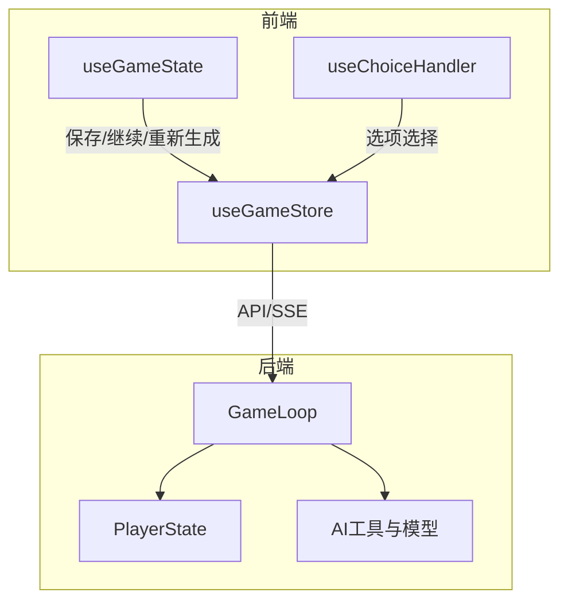
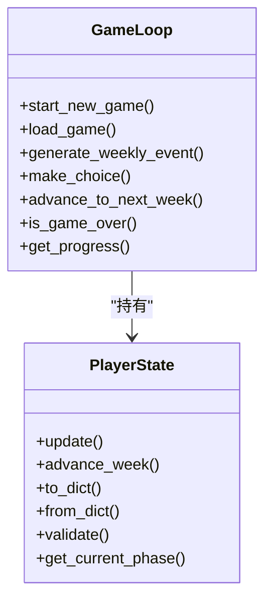
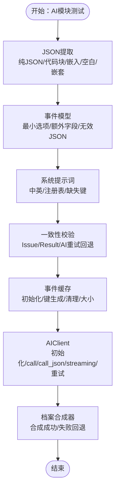
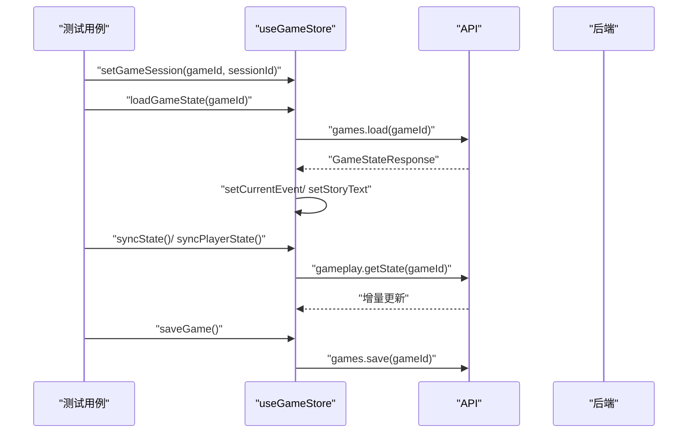
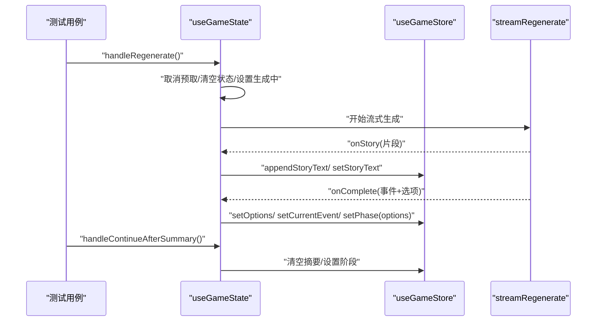
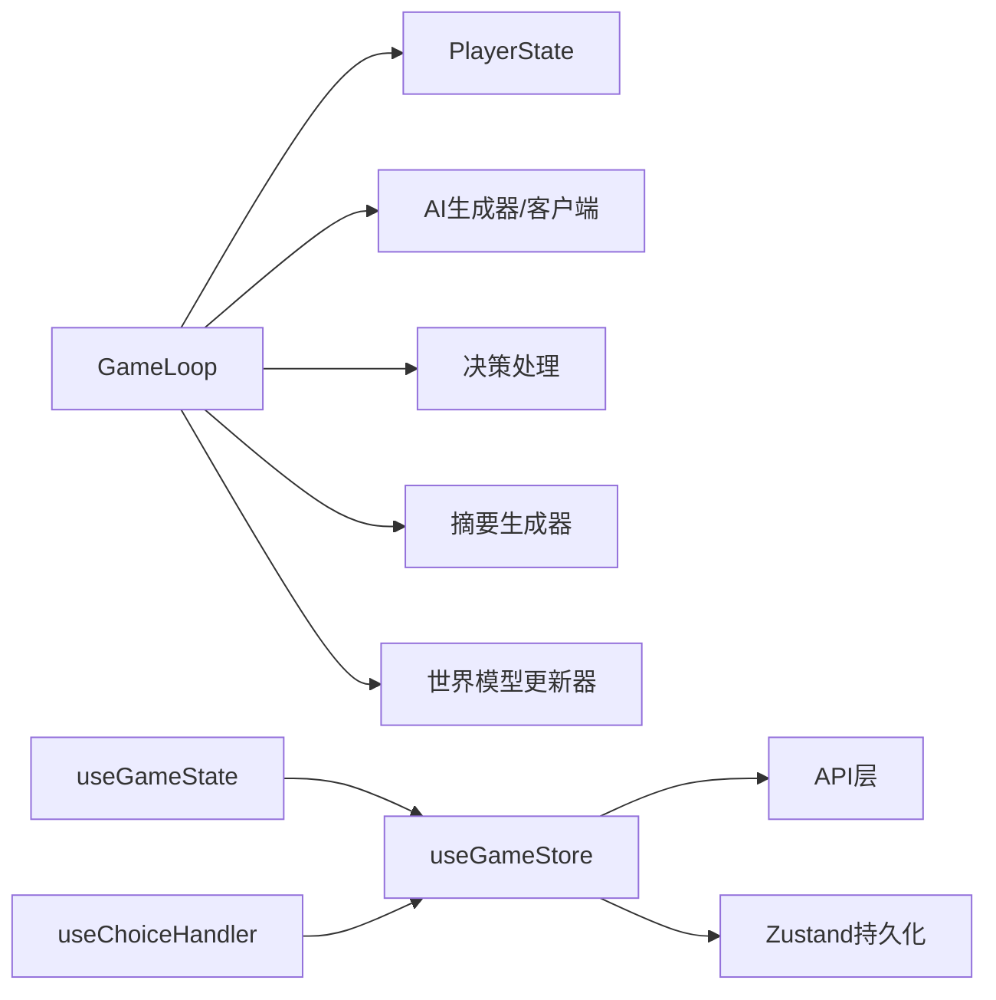

# 单元测试

<cite>
**本文引用的文件**
- [tests/test_game_loop.py](file://tests/test_game_loop.py)
- [tests/test_state.py](file://tests/test_state.py)
- [src/game/state/player_state.py](file://src/game/state/player_state.py)
- [src/game/game_loop.py](file://src/game/game_loop.py)
- [tests/test_ai_modules.py](file://tests/test_ai_modules.py)
- [tests/test_character_state.py](file://tests/test_character_state.py)
- [frontend/src/__tests__/stores/useGameStore.test.ts](file://frontend/src/__tests__/stores/useGameStore.test.ts)
- [frontend/src/__tests__/hooks/useGameState.test.ts](file://frontend/src/__tests__/hooks/useGameState.test.ts)
- [frontend/src/stores/useGameStore.ts](file://frontend/src/stores/useGameStore.ts)
- [frontend/src/hooks/game/useGameState.ts](file://frontend/src/hooks/game/useGameState.ts)
- [frontend/src/__tests__/hooks/useChoiceHandler.test.ts](file://frontend/src/__tests__/hooks/useChoiceHandler.test.ts)
- [frontend/src/__tests__/stores/useCharacterStore.test.ts](file://frontend/src/__tests__/stores/useCharacterStore.test.ts)
- [pytest.ini](file://pytest.ini)
- [frontend/jest.config.js](file://frontend/jest.config.js)
- [TEST_COVERAGE_REPORT.md](file://TEST_COVERAGE_REPORT.md)
</cite>

## 目录
1. [引言](#引言)
2. [项目结构](#项目结构)
3. [核心组件](#核心组件)
4. [架构总览](#架构总览)
5. [详细组件分析](#详细组件分析)
6. [依赖关系分析](#依赖关系分析)
7. [性能考量](#性能考量)
8. [故障排查指南](#故障排查指南)
9. [结论](#结论)
10. [附录](#附录)

## 引言
本文件面向“人生草稿本”项目的单元测试体系，系统梳理后端Python与前端React两部分的测试实现与最佳实践。重点覆盖以下方面：
- 后端核心组件：GameLoop、PlayerState、AI模块（含缓存、客户端、一致性校验、系统提示词、档案合成器等）
- 前端核心组件：React组件、Hook与Store（useGameStore、useGameState、useChoiceHandler、useCharacterStore）
- 测试设计原则：边界条件、异常处理、Mock策略
- 测试数据准备与清理
- 覆盖率目标与代码质量检查
- 测试执行流程与调试技巧

## 项目结构
项目采用前后端分离的测试布局：
- 后端：tests/ 下按功能模块组织，pytest配置集中于根目录
- 前端：frontend/src/__tests__/ 下按模块组织，Jest配置位于前端根目录

图表来源
- [tests/test_game_loop.py](file://tests/test_game_loop.py#L1-L76)
- [tests/test_state.py](file://tests/test_state.py#L1-L99)
- [tests/test_ai_modules.py](file://tests/test_ai_modules.py#L1-L543)
- [tests/test_character_state.py](file://tests/test_character_state.py#L1-L205)
- [frontend/src/__tests__/stores/useGameStore.test.ts](file://frontend/src/__tests__/stores/useGameStore.test.ts#L1-L974)
- [frontend/src/__tests__/hooks/useGameState.test.ts](file://frontend/src/__tests__/hooks/useGameState.test.ts#L1-L335)
- [frontend/src/__tests__/hooks/useChoiceHandler.test.ts](file://frontend/src/__tests__/hooks/useChoiceHandler.test.ts#L1-L211)
- [frontend/src/__tests__/stores/useCharacterStore.test.ts](file://frontend/src/__tests__/stores/useCharacterStore.test.ts#L1-L178)

章节来源
- [pytest.ini](file://pytest.ini#L1-L8)
- [frontend/jest.config.js](file://frontend/jest.config.js#L1-L38)

## 核心组件
本节概述后端与前端的关键测试对象及其职责。

- 后端核心
  - GameLoop：主游戏循环，负责事件生成、决策处理、周推进、摘要生成、会话恢复等
  - PlayerState：玩家状态模型，包含资源、关系、角色、回合、历史、世界模型等字段
  - AI模块：缓存、客户端、一致性校验、系统提示词、档案合成器、事件模型等
  - NPC角色状态：CharacterState（隐藏属性、关系属性、事件触发阈值等）

- 前端核心
  - useGameStore：游戏会话状态、事件、图片、角色创建、存档/预设管理
  - useGameState：保存、继续、重新生成、摘要生成、结束阶段控制
  - useChoiceHandler：选项选择的SSE回调与状态联动
  - useCharacterStore：角色创建步骤导航与预设加载

章节来源
- [src/game/game_loop.py](file://src/game/game_loop.py#L1-L592)
- [src/game/state/player_state.py](file://src/game/state/player_state.py#L1-L590)
- [tests/test_ai_modules.py](file://tests/test_ai_modules.py#L1-L543)
- [tests/test_character_state.py](file://tests/test_character_state.py#L1-L205)
- [frontend/src/stores/useGameStore.ts](file://frontend/src/stores/useGameStore.ts#L1-L996)
- [frontend/src/hooks/game/useGameState.ts](file://frontend/src/hooks/game/useGameState.ts#L1-L315)
- [frontend/src/__tests__/hooks/useChoiceHandler.test.ts](file://frontend/src/__tests__/hooks/useChoiceHandler.test.ts#L1-L211)
- [frontend/src/__tests__/stores/useCharacterStore.test.ts](file://frontend/src/__tests__/stores/useCharacterStore.test.ts#L1-L178)

## 架构总览
后端与前端测试围绕“状态驱动”的设计展开：后端以PlayerState为核心，GameLoop驱动状态变更；前端以useGameStore为中心，通过API与SSE与后端交互，配合Hooks协调UI状态。

图表来源
- [src/game/game_loop.py](file://src/game/game_loop.py#L25-L68)
- [src/game/state/player_state.py](file://src/game/state/player_state.py#L15-L122)
- [frontend/src/stores/useGameStore.ts](file://frontend/src/stores/useGameStore.ts#L161-L504)
- [frontend/src/hooks/game/useGameState.ts](file://frontend/src/hooks/game/useGameState.ts#L40-L106)
- [frontend/src/__tests__/hooks/useChoiceHandler.test.ts](file://frontend/src/__tests__/hooks/useChoiceHandler.test.ts#L40-L104)

## 详细组件分析

### 后端：GameLoop 与 PlayerState 测试
- GameLoop测试要点
  - 初始化与加载：语言、AI生成器注入、事件回调、结果回调
  - 新游戏启动：年龄、周数、回合数、角色系统初始化
  - 事件生成：常规周事件与里程碑事件、回退事件、上下文拼接
  - 决策处理：选项索引、效果应用、结果回调
  - 周推进：周推进、衰减、4周/48周摘要生成、游戏结束判定
  - 进度查询：周数、年龄、百分比
- PlayerState测试要点
  - 初始值与边界：资源上下限、周数范围、回合数
  - 更新：能量、心情、知识、财富、关系
  - 序列化/反序列化：to_dict/from_dict
  - 校验：validate抛出异常
  - 阶段判断：基于周数的生涯阶段
  - NPC角色：CharacterState集成、关系同步

图表来源
- [src/game/game_loop.py](file://src/game/game_loop.py#L69-L159)
- [src/game/state/player_state.py](file://src/game/state/player_state.py#L159-L383)

章节来源
- [tests/test_game_loop.py](file://tests/test_game_loop.py#L1-L76)
- [tests/test_state.py](file://tests/test_state.py#L1-L99)
- [src/game/game_loop.py](file://src/game/game_loop.py#L1-L592)
- [src/game/state/player_state.py](file://src/game/state/player_state.py#L1-L590)

### 后端：AI 模块测试
- 工具与模型
  - JSON提取：支持代码块、反引号块、嵌入文本、空白处理、嵌套结构
  - GameEvent/EventOption：最小选项数、额外字段、无效JSON处理
- 系统提示词
  - 中英文提示词获取、注册表完整性校验、缺失键处理
- 一致性校验
  - Issue/Result数据结构、AI驱动should_retry、回退逻辑
- 缓存
  - 目录初始化、键生成、大小与清理
- 客户端
  - 初始化、call/call_json/streaming、重试机制
- 档案合成器
  - 合成成功/失败回退

图表来源
- [tests/test_ai_modules.py](file://tests/test_ai_modules.py#L18-L543)

章节来源
- [tests/test_ai_modules.py](file://tests/test_ai_modules.py#L1-L543)

### 后端：NPC 角色状态测试
- 默认值与隐藏属性：性别取向、关系状态、浪漫倾向、外部障碍、峰值亲密度
- 关系属性更新：亲密度、信任、尊重的边界
- 峰值亲密度跟踪：历史峰值不下降
- 触发事件列表：事件加入与存在性检查
- 事件触发阈值：默认阈值集合
- 互动计数与时序：交互次数与上次互动周
- 序列化/反序列化：model_dump与重建
- 有效取值集合：关系状态、社会地位、气质类型

章节来源
- [tests/test_character_state.py](file://tests/test_character_state.py#L1-L205)

### 前端：useGameStore 测试
- 初始状态：会话、玩家状态、进度、回合信息、事件、存档/预设、角色创建、图片、游戏设置
- 会话管理：设置会话、加载状态、同步状态、保存、重置
- 事件管理：设置当前事件、追加/设置/清空故事文本、结束判定
- 摘要管理：生成摘要、清空摘要
- 列表管理：拉取存档/预设、删除、保存
- 角色创建：步骤导航、设置玩家名/愿景、更新角色设定、加载预设、重置
- 图像管理：生成/重新生成/全新生成角色图、开场插画、轮次场景图
- 场景图像：按阶段生成/替换/轮次缓存

图表来源
- [frontend/src/__tests__/stores/useGameStore.test.ts](file://frontend/src/__tests__/stores/useGameStore.test.ts#L77-L563)
- [frontend/src/stores/useGameStore.ts](file://frontend/src/stores/useGameStore.ts#L273-L475)

章节来源
- [frontend/src/__tests__/stores/useGameStore.test.ts](file://frontend/src/__tests__/stores/useGameStore.test.ts#L1-L974)
- [frontend/src/stores/useGameStore.ts](file://frontend/src/stores/useGameStore.ts#L1-L996)

### 前端：useGameState 测试
- 保存：调用store.saveGame，toast反馈
- 继续：结束后进入结局阶段，否则清空事件与故事文本，触发生成
- 重新生成：SSE流式回调，onStory追加文本，onComplete设置事件与选项，错误时恢复会话重试
- 摘要：生成摘要后清空摘要
- 调整器：显示/隐藏

图表来源
- [frontend/src/__tests__/hooks/useGameState.test.ts](file://frontend/src/__tests__/hooks/useGameState.test.ts#L72-L335)
- [frontend/src/hooks/game/useGameState.ts](file://frontend/src/hooks/game/useGameState.ts#L150-L288)

章节来源
- [frontend/src/__tests__/hooks/useGameState.test.ts](file://frontend/src/__tests__/hooks/useGameState.test.ts#L1-L335)
- [frontend/src/hooks/game/useGameState.ts](file://frontend/src/hooks/game/useGameState.ts#L1-L315)

### 前端：useChoiceHandler 测试
- 选项处理：当gameId存在时设置阶段为choosing，abort之前的请求，调用streamChoice
- 自定义选项：当gameId存在时调用streamCustomChoice，传递输入
- SSE回调：onStory追加文本、onStatus设置处理状态、onConnectionStatus设置连接状态、onReconnecting设置重连尝试

章节来源
- [frontend/src/__tests__/hooks/useChoiceHandler.test.ts](file://frontend/src/__tests__/hooks/useChoiceHandler.test.ts#L1-L211)

### 前端：useCharacterStore 测试
- 步骤导航：设置/前进/后退，边界保护
- 角色设定：合并更新、多字段合并
- 玩家信息：设置姓名/愿景/开场故事
- 重置：清空创建数据
- 加载预设：填充姓名、愿景、角色设定，并推进步骤

章节来源
- [frontend/src/__tests__/stores/useCharacterStore.test.ts](file://frontend/src/__tests__/stores/useCharacterStore.test.ts#L1-L178)

## 依赖关系分析
- 后端
  - GameLoop依赖PlayerState、AI生成器、决策处理器、故事服务、年度/4周摘要生成器、世界模型更新器、叙事管理器、关系MCP服务
  - PlayerState依赖配置settings、Pydantic校验器、CharacterState
- 前端
  - useGameStore依赖API层（games、gameplay、presets、images）、Zustand持久化、类型定义
  - useGameState/useChoiceHandler依赖SSE流式接口与useGameStore状态

图表来源
- [src/game/game_loop.py](file://src/game/game_loop.py#L25-L68)
- [src/game/state/player_state.py](file://src/game/state/player_state.py#L15-L122)
- [frontend/src/stores/useGameStore.ts](file://frontend/src/stores/useGameStore.ts#L14-L37)

章节来源
- [src/game/game_loop.py](file://src/game/game_loop.py#L1-L592)
- [src/game/state/player_state.py](file://src/game/state/player_state.py#L1-L590)
- [frontend/src/stores/useGameStore.ts](file://frontend/src/stores/useGameStore.ts#L1-L996)

## 性能考量
- 后端
  - 事件生成与AI调用：通过缓存与回退事件降低失败成本
  - 周推进与摘要生成：批量处理减少重复计算
  - 资源衰减：低阈值自动衰减，避免状态膨胀
- 前端
  - Zustand浅比较：KEY_FIELDS仅在关键字段变化时触发更新
  - SSE流式渲染：分块追加文本，避免长文本一次性渲染
  - 场景图生成：按阶段缓存，避免重复请求

章节来源
- [src/game/game_loop.py](file://src/game/game_loop.py#L445-L457)
- [frontend/src/stores/useGameStore.ts](file://frontend/src/stores/useGameStore.ts#L40-L50)
- [frontend/src/hooks/game/useGameState.ts](file://frontend/src/hooks/game/useGameState.ts#L150-L288)

## 故障排查指南
- 后端
  - 事件生成失败：检查AI生成器返回、回退事件构造、日志输出
  - 状态校验异常：validate抛出异常，检查资源边界与周数范围
  - 会话恢复：404时尝试loadGameState，确认状态清理与图片清空
- 前端
  - SSE错误：onError中区分404并尝试恢复会话，随后重试
  - 预取冲突：继续下一回合前取消预取，清空预取结果
  - 图片生成：缺失gameId或姓名时抛错，确保角色创建完成

章节来源
- [src/game/game_loop.py](file://src/game/game_loop.py#L254-L264)
- [src/game/state/player_state.py](file://src/game/state/player_state.py#L318-L338)
- [frontend/src/stores/useGameStore.ts](file://frontend/src/stores/useGameStore.ts#L346-L427)
- [frontend/src/hooks/game/useGameState.ts](file://frontend/src/hooks/game/useGameState.ts#L230-L266)

## 结论
本项目在后端与前端均建立了较为完善的单元测试体系，覆盖核心状态、流程与异常路径。测试设计遵循边界条件、异常处理与Mock策略，结合覆盖率目标与质量检查，持续提升稳定性与可维护性。建议后续继续完善外部依赖（如图片服务）与异步流式处理的测试，以进一步提升覆盖率与鲁棒性。

## 附录

### 测试设计原则
- 边界条件测试：资源上下限、周数范围、回合数、选项数量
- 异常情况处理：AI失败回退、404会话恢复、SSE错误分类与重试
- Mock对象使用：外部API、文件系统、AI客户端统一Mock，隔离环境依赖
- 数据准备与清理：临时目录、初始状态、会话清理、图片清空

章节来源
- [tests/test_ai_modules.py](file://tests/test_ai_modules.py#L315-L486)
- [frontend/src/__tests__/stores/useGameStore.test.ts](file://frontend/src/__tests__/stores/useGameStore.test.ts#L48-L100)
- [frontend/src/__tests__/hooks/useGameState.test.ts](file://frontend/src/__tests__/hooks/useGameState.test.ts#L262-L286)

### 覆盖率与质量检查
- 后端覆盖率目标：≥70%，高价值模块（AI模型、系统提示词、认证路由等）应保持高覆盖率
- 前端覆盖率目标：Statements/Functions/Branches/Lines ≥ 70%/65%/65%/70%
- 质量检查：测试通过率100%、无console.error警告、Mock策略完备

章节来源
- [TEST_COVERAGE_REPORT.md](file://TEST_COVERAGE_REPORT.md#L193-L214)
- [frontend/jest.config.js](file://frontend/jest.config.js#L23-L30)

### 测试执行流程与调试技巧
- 后端
  - 使用pytest配置：pytest.ini，启用asyncio模式，集中测试路径
  - 建议：对异步SSE与AI调用进行Mock，必要时使用假时钟模拟超时
- 前端
  - 使用Jest配置：jsdom环境、模块映射、缓存目录、覆盖率阈值
  - 建议：对SSE与API进行Mock，使用act包裹状态变更，断言副作用

章节来源
- [pytest.ini](file://pytest.ini#L1-L8)
- [frontend/jest.config.js](file://frontend/jest.config.js#L1-L38)