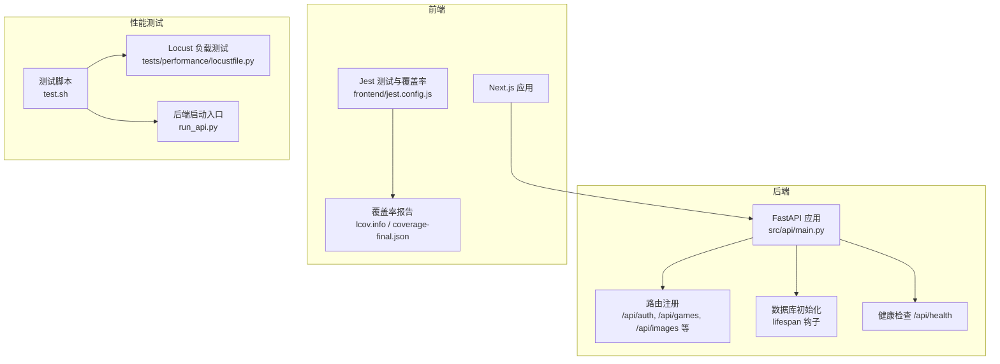
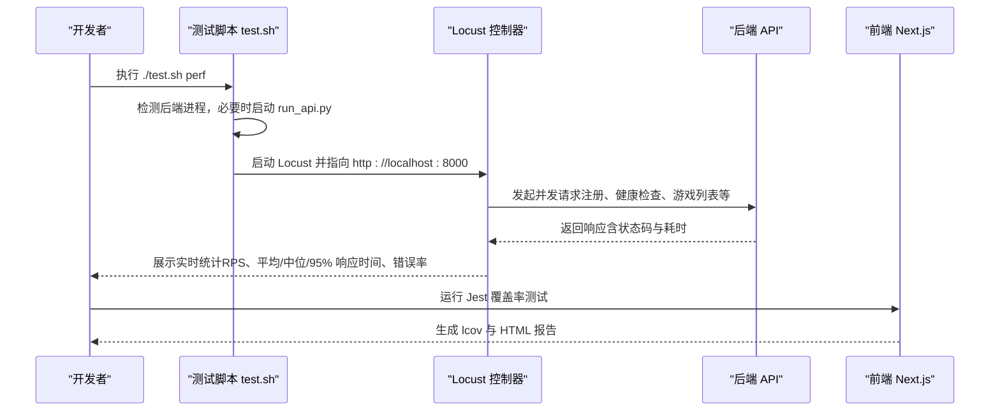
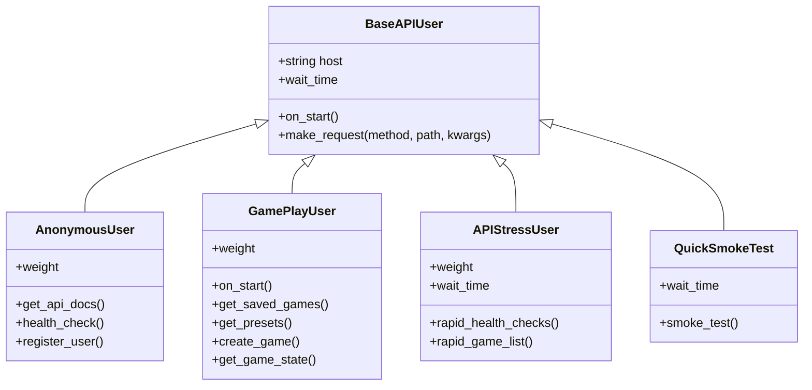
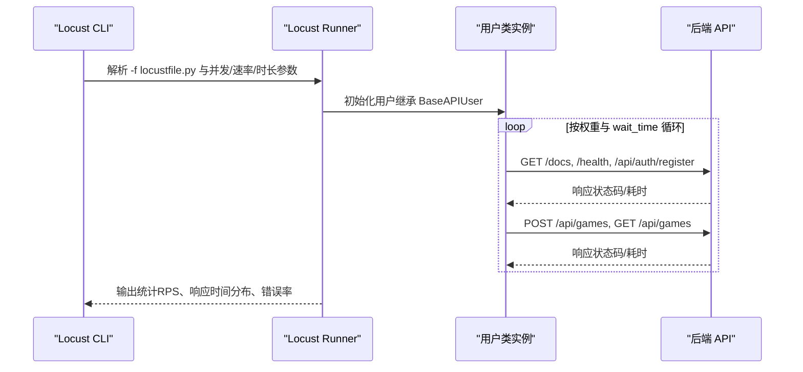
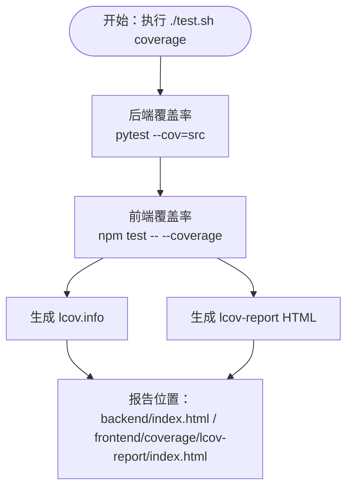
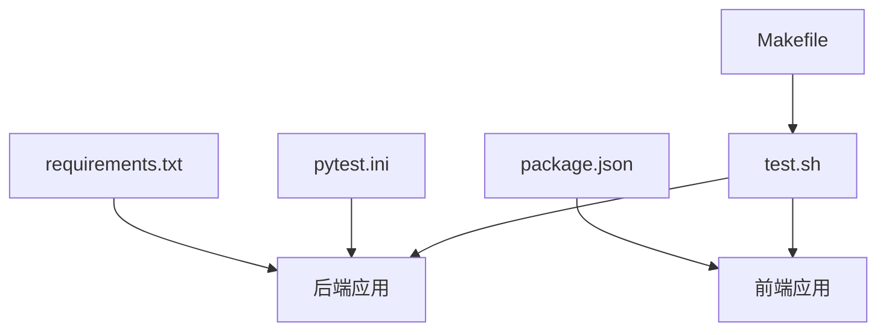

# 性能测试

<cite>
**本文引用的文件**
- [tests/performance/locustfile.py](file://tests/performance/locustfile.py)
- [frontend/jest.config.js](file://frontend/jest.config.js)
- [frontend/TEST_COVERAGE_PLAN.md](file://frontend/TEST_COVERAGE_PLAN.md)
- [TEST_COVERAGE_REPORT.md](file://TEST_COVERAGE_REPORT.md)
- [frontend/coverage/coverage-final.json](file://frontend/coverage/coverage-final.json)
- [frontend/coverage/lcov.info](file://frontend/coverage/lcov.info)
- [frontend/jest.setup.js](file://frontend/jest.setup.js)
- [test.sh](file://test.sh)
- [Makefile](file://Makefile)
- [run_api.py](file://run_api.py)
- [src/api/main.py](file://src/api/main.py)
- [pytest.ini](file://pytest.ini)
- [requirements.txt](file://requirements.txt)
</cite>

## 目录
1. [简介](#简介)
2. [项目结构](#项目结构)
3. [核心组件](#核心组件)
4. [架构总览](#架构总览)
5. [详细组件分析](#详细组件分析)
6. [依赖分析](#依赖分析)
7. [性能考虑](#性能考虑)
8. [故障排查指南](#故障排查指南)
9. [结论](#结论)
10. [附录](#附录)

## 简介
本文件面向“人生草稿本”项目的性能测试体系，涵盖以下内容：
- Locust 负载测试的配置与实施：并发用户模拟、请求频率控制、响应时间监控与报告输出。
- 前端代码覆盖率测试：Jest 覆盖率配置、报告生成与持续优化策略。
- 性能基准测试策略：内存使用分析、CPU 占用监控、数据库查询优化与瓶颈识别。
- 性能测试工具使用指南与测试结果分析。
- 性能优化最佳实践与监控指标设置。

## 项目结构
本项目采用前后端分离架构，性能测试主要涉及：
- 后端 FastAPI 应用与路由，提供健康检查、认证、游戏数据、图片等接口。
- 前端 Next.js 应用，配合 Jest 进行单元测试与覆盖率统计。
- 性能测试脚本与 Locust 负载测试文件，统一通过测试脚本进行编排。

图表来源
- [src/api/main.py](file://src/api/main.py#L35-L90)
- [tests/performance/locustfile.py](file://tests/performance/locustfile.py#L29-L61)
- [test.sh](file://test.sh#L101-L120)
- [run_api.py](file://run_api.py#L18-L31)
- [frontend/jest.config.js](file://frontend/jest.config.js#L1-L38)

章节来源
- [src/api/main.py](file://src/api/main.py#L35-L90)
- [tests/performance/locustfile.py](file://tests/performance/locustfile.py#L29-L61)
- [test.sh](file://test.sh#L101-L120)
- [run_api.py](file://run_api.py#L18-L31)
- [frontend/jest.config.js](file://frontend/jest.config.js#L1-L38)

## 核心组件
- Locust 负载测试：定义匿名用户、游戏用户与高压用户三类角色，模拟注册、健康检查、游戏列表、创建游戏、获取状态等典型 API 场景，并提供快速冒烟测试场景。
- 前端 Jest 覆盖率：配置测试环境、模块映射、缓存目录、转换规则、覆盖率阈值与忽略路径；配套覆盖率报告生成与可视化。
- 后端健康检查：提供 /api/health 接口，返回服务状态与活动会话数，便于性能测试中快速验证后端可用性。
- 测试脚本编排：统一执行后端/前端/E2E/覆盖率/性能/安全等测试套件，支持自动启动后端服务与 Locust UI。

章节来源
- [tests/performance/locustfile.py](file://tests/performance/locustfile.py#L63-L178)
- [frontend/jest.config.js](file://frontend/jest.config.js#L1-L38)
- [src/api/main.py](file://src/api/main.py#L92-L99)
- [test.sh](file://test.sh#L101-L120)

## 架构总览
性能测试整体流程如下：
- 后端服务启动：通过 run_api.py 启动 Uvicorn 服务器，默认监听 0.0.0.0:8000。
- 性能测试启动：test.sh 调用 Locust，连接 http://localhost:8000，进入 Web UI 配置并发与运行时长。
- 前端覆盖率：Jest 在前端目录执行测试并生成 lcov 与 HTML 报告，供人工与 CI 分析。

图表来源
- [test.sh](file://test.sh#L101-L120)
- [run_api.py](file://run_api.py#L18-L31)
- [tests/performance/locustfile.py](file://tests/performance/locustfile.py#L182-L196)

章节来源
- [test.sh](file://test.sh#L101-L120)
- [run_api.py](file://run_api.py#L18-L31)
- [tests/performance/locustfile.py](file://tests/performance/locustfile.py#L182-L196)

## 详细组件分析

### Locust 负载测试配置与实施
- 用户模型与权重
  - 匿名用户（30%）：访问文档、健康检查、注册。
  - 游戏用户（50%）：获取存档列表、预设、创建游戏、获取游戏状态。
  - 高压用户（20%）：短间隔高频健康检查与游戏列表请求。
- 请求频率控制
  - 基类用户 wait_time 设为 1–3 秒，高压用户缩短至 0.1–0.5 秒。
  - 通过 Locust Web UI 或命令行参数控制并发用户数（-u）、每秒启动数（-r）、运行时长（-t）。
- 错误处理与监控
  - 统一封装 make_request，对 5xx 视为服务器错误，4xx 视为客户端错误，记录失败并输出错误信息。
  - 事件钩子 on_test_start/on_test_stop 输出测试开始/结束提示。
- 快速冒烟测试
  - QuickSmokeTest 类适合 CI 中快速验证健康检查、文档与注册流程。

图表来源
- [tests/performance/locustfile.py](file://tests/performance/locustfile.py#L34-L61)
- [tests/performance/locustfile.py](file://tests/performance/locustfile.py#L63-L96)
- [tests/performance/locustfile.py](file://tests/performance/locustfile.py#L96-L156)
- [tests/performance/locustfile.py](file://tests/performance/locustfile.py#L158-L178)
- [tests/performance/locustfile.py](file://tests/performance/locustfile.py#L200-L224)

章节来源
- [tests/performance/locustfile.py](file://tests/performance/locustfile.py#L34-L61)
- [tests/performance/locustfile.py](file://tests/performance/locustfile.py#L63-L178)
- [tests/performance/locustfile.py](file://tests/performance/locustfile.py#L182-L196)
- [tests/performance/locustfile.py](file://tests/performance/locustfile.py#L200-L224)

#### Locust 运行流程（序列图）

图表来源
- [tests/performance/locustfile.py](file://tests/performance/locustfile.py#L29-L61)
- [tests/performance/locustfile.py](file://tests/performance/locustfile.py#L75-L94)
- [tests/performance/locustfile.py](file://tests/performance/locustfile.py#L125-L156)

章节来源
- [tests/performance/locustfile.py](file://tests/performance/locustfile.py#L29-L61)
- [tests/performance/locustfile.py](file://tests/performance/locustfile.py#L75-L94)
- [tests/performance/locustfile.py](file://tests/performance/locustfile.py#L125-L156)

### 前端代码覆盖率测试
- Jest 配置要点
  - 测试环境：jest-environment-jsdom。
  - 模块映射：@/ 指向 src/。
  - 缓存目录：使用项目内 .jest-cache，避免 macOS 沙箱权限问题。
  - 转换规则：ts-jest 配合 tsconfig 与 useESM。
  - 收集范围：src/**/*.{ts,tsx}，排除 d.ts 与 types.ts。
  - 覆盖率阈值：全局 Statements、Branches、Functions、Lines 均不低于阈值。
  - 忽略路径：node_modules、.next、e2e。
- 覆盖率报告
  - lcov.info：标准覆盖率数据，可用于 CI 分析。
  - coverage-final.json：按文件维度的覆盖率明细，包含语句、分支、函数、行的命中情况。
  - lcov-report：HTML 报告，便于在浏览器查看详细覆盖路径。
- 测试脚本
  - test.sh coverage：分别生成后端与前端覆盖率报告，并输出报告位置。

图表来源
- [test.sh](file://test.sh#L77-L99)
- [frontend/jest.config.js](file://frontend/jest.config.js#L18-L34)
- [frontend/coverage/lcov.info](file://frontend/coverage/lcov.info#L1-L800)
- [frontend/coverage/coverage-final.json](file://frontend/coverage/coverage-final.json#L1-L55)

章节来源
- [test.sh](file://test.sh#L77-L99)
- [frontend/jest.config.js](file://frontend/jest.config.js#L1-L38)
- [frontend/coverage/lcov.info](file://frontend/coverage/lcov.info#L1-L800)
- [frontend/coverage/coverage-final.json](file://frontend/coverage/coverage-final.json#L1-L55)

### 性能基准测试策略
- 内存使用分析
  - 使用系统工具（如 top、htop、Activity Monitor）观察后端进程内存峰值与增长趋势。
  - 结合 Locust 并发逐步提升，记录内存与 GC 行为变化。
- CPU 占用监控
  - 通过系统监控工具观察 CPU 利用率、上下文切换与阻塞点。
  - 关注高并发下的线程池与异步处理开销。
- 数据库查询优化
  - 使用 SQL 日志或慢查询分析工具定位热点查询。
  - 优化索引、减少 N+1 查询、合并冗余查询。
- 瓶颈识别
  - 以响应时间分布（p50/p90/p95/p99）与错误率作为关键指标。
  - 通过 Locust UI 与日志定位慢请求来源（路由、数据库、AI 服务）。

章节来源
- [src/api/main.py](file://src/api/main.py#L92-L99)
- [tests/performance/locustfile.py](file://tests/performance/locustfile.py#L182-L196)

### 性能测试工具使用指南
- 启动后端服务
  - 直接运行 run_api.py，默认监听 0.0.0.0:8000。
- 启动性能测试
  - 使用 test.sh perf 自动检测并启动后端，随后启动 Locust UI（默认 http://localhost:8089），在 UI 中配置并发与运行时长。
- 生成覆盖率报告
  - 使用 test.sh coverage 生成后端与前端覆盖率报告。
- 其他常用命令
  - 后端测试：./test.sh backend 或直接 pytest tests/。
  - 前端测试：./test.sh frontend。
  - E2E 测试：./test.sh e2e。
  - 安全扫描：./test.sh security（基于 Bandit）。

章节来源
- [test.sh](file://test.sh#L101-L120)
- [run_api.py](file://run_api.py#L18-L31)
- [pytest.ini](file://pytest.ini#L1-L8)
- [requirements.txt](file://requirements.txt#L1-L12)

### 测试结果分析
- 前端覆盖率现状与目标
  - 当前 Statements 约 71%，目标 75%；Branches 约 59%，目标 65%；Functions 约 67%，目标 70%；Lines 约 72%，目标 75%。
  - 通过分阶段补充核心状态管理、游戏逻辑、页面组件与工具函数的测试用例，逐步提升覆盖率。
- 后端覆盖率现状与优化
  - 高覆盖率模块（>80%）：auth、presets、story、models 等。
  - 低覆盖率模块（<50%）：image_service、world_model_updater、image_storage、sse_helpers。
  - 通过 Mock 外部依赖、临时目录与异步测试，逐步提升覆盖率。

章节来源
- [TEST_COVERAGE_REPORT.md](file://TEST_COVERAGE_REPORT.md#L7-L50)
- [frontend/TEST_COVERAGE_PLAN.md](file://frontend/TEST_COVERAGE_PLAN.md#L1-L279)

## 依赖分析
- 后端依赖
  - FastAPI、Uvicorn、SQLAlchemy、Pydantic、httpx 等。
  - 通过 requirements.txt 管理。
- 前端依赖
  - Jest、ts-jest、Testing Library、Playwright 等。
  - 通过 package.json 管理。
- 测试与性能工具
  - pytest、pytest-cov、Locust、Bandit、Makefile 与 test.sh。

图表来源
- [requirements.txt](file://requirements.txt#L1-L12)
- [frontend/package.json](file://frontend/package.json#L1-L49)
- [pytest.ini](file://pytest.ini#L1-L8)
- [Makefile](file://Makefile#L1-L93)
- [test.sh](file://test.sh#L1-L232)

章节来源
- [requirements.txt](file://requirements.txt#L1-L12)
- [frontend/package.json](file://frontend/package.json#L1-L49)
- [pytest.ini](file://pytest.ini#L1-L8)
- [Makefile](file://Makefile#L1-L93)
- [test.sh](file://test.sh#L1-L232)

## 性能考虑
- 并发与等待时间
  - 通过 wait_time 与权重控制不同用户类型的请求密度，避免瞬时洪峰。
- 错误处理与可观测性
  - make_request 对 4xx/5xx 统一记录失败，便于定位异常。
  - 后端全局异常处理器与 /api/health 健康检查接口，便于快速诊断。
- 前端测试隔离
  - jest.setup.js 提供导航、剪贴板、matchMedia、IntersectionObserver、ResizeObserver 等常见 DOM API 的 Mock，确保测试稳定。
- 覆盖率阈值与持续改进
  - 通过 jest.config.js 的 collectCoverageFrom 与 coverageThreshold，强制提升关键模块覆盖率。
  - 借助覆盖率报告与计划文档，持续补充测试用例。

章节来源
- [tests/performance/locustfile.py](file://tests/performance/locustfile.py#L47-L60)
- [src/api/main.py](file://src/api/main.py#L69-L76)
- [src/api/main.py](file://src/api/main.py#L92-L99)
- [frontend/jest.setup.js](file://frontend/jest.setup.js#L1-L61)
- [frontend/jest.config.js](file://frontend/jest.config.js#L18-L30)

## 故障排查指南
- Locust 无法连接后端
  - 确认 run_api.py 是否在 0.0.0.0:8000 启动；test.sh perf 会自动启动后端，也可手动启动。
- Locust UI 无法访问
  - 默认端口 8089，确认防火墙与端口占用；可在 locustfile.py 中修改 host。
- 前端测试失败或覆盖率异常
  - 检查 jest.setup.js 的 Mock 是否覆盖了必要的浏览器 API。
  - 确认 jest.config.js 的模块映射与缓存目录配置。
- 后端覆盖率报告缺失
  - 确保 pytest.ini 配置正确，且使用 test.sh coverage 生成报告。

章节来源
- [test.sh](file://test.sh#L101-L120)
- [run_api.py](file://run_api.py#L18-L31)
- [frontend/jest.setup.js](file://frontend/jest.setup.js#L1-L61)
- [frontend/jest.config.js](file://frontend/jest.config.js#L1-L38)
- [pytest.ini](file://pytest.ini#L1-L8)

## 结论
本性能测试体系结合了后端健康检查、Locust 负载测试与前端覆盖率测试，辅以测试脚本与报告生成，形成可重复、可量化的性能评估闭环。建议在持续集成中定期运行性能测试与覆盖率检查，持续优化数据库查询与前端渲染性能，确保系统在高并发场景下的稳定性与可维护性。

## 附录
- 常用命令速查
  - 后端测试：./test.sh backend
  - 前端测试：./test.sh frontend
  - E2E 测试：./test.sh e2e
  - 覆盖率报告：./test.sh coverage
  - 性能测试：./test.sh perf
  - 安全扫描：./test.sh security
  - 全部测试：./test.sh all

章节来源
- [test.sh](file://test.sh#L176-L197)