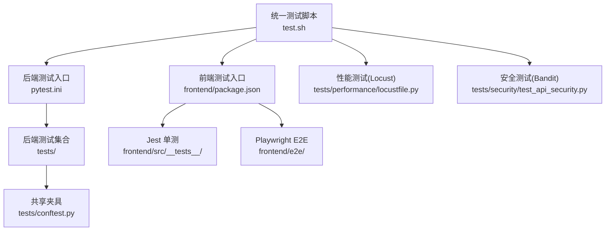
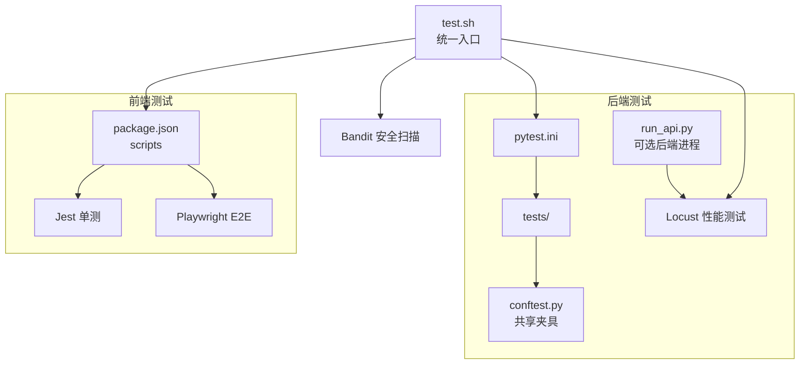
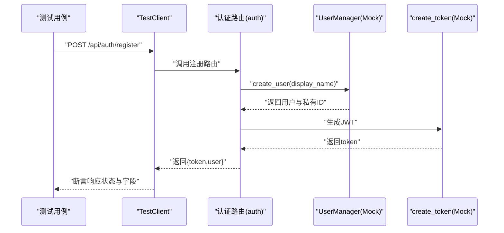
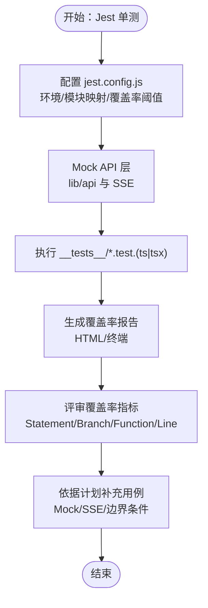
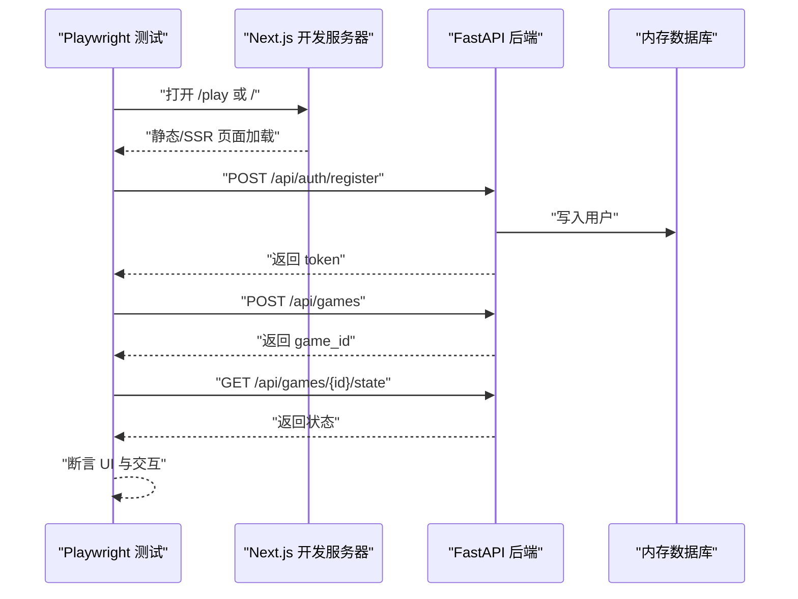
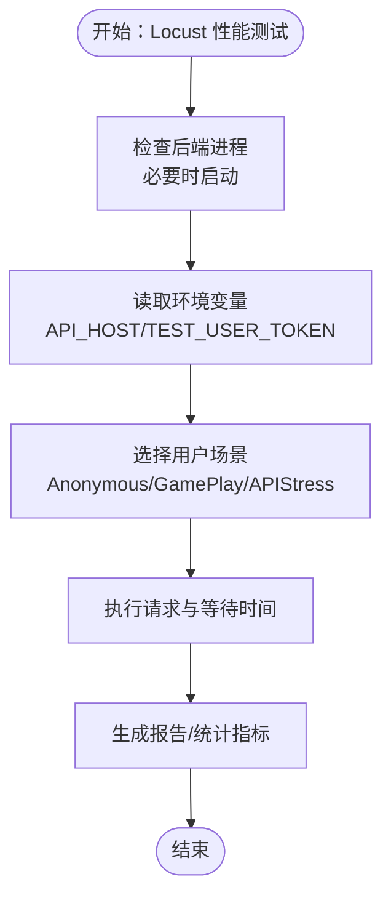
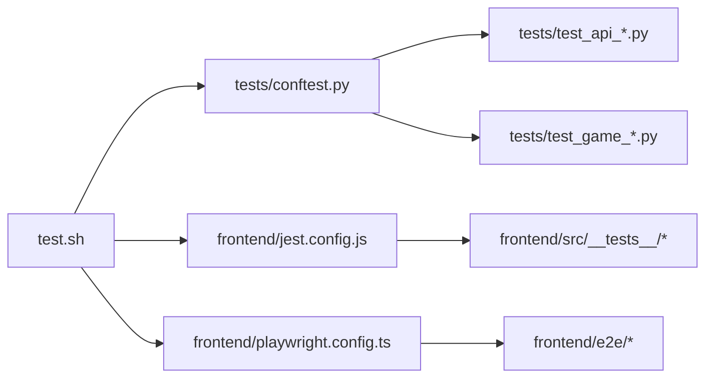

# 测试策略

<cite>
**本文引用的文件**
- [tests/conftest.py](file://tests/conftest.py)
- [pytest.ini](file://pytest.ini)
- [frontend/package.json](file://frontend/package.json)
- [frontend/jest.config.js](file://frontend/jest.config.js)
- [frontend/playwright.config.ts](file://frontend/playwright.config.ts)
- [test.sh](file://test.sh)
- [tests/performance/locustfile.py](file://tests/performance/locustfile.py)
- [tests/security/test_api_security.py](file://tests/security/test_api_security.py)
- [frontend/TEST_COVERAGE_PLAN.md](file://frontend/TEST_COVERAGE_PLAN.md)
- [TEST_COVERAGE_PROGRESS.md](file://TEST_COVERAGE_PROGRESS.md)
- [TEST_COVERAGE_REPORT.md](file://TEST_COVERAGE_REPORT.md)
- [tests/test_api_auth.py](file://tests/test_api_auth.py)
- [tests/test_api_games.py](file://tests/test_api_games.py)
- [frontend/src/__tests__/stores/useGameStore.test.ts](file://frontend/src/__tests__/stores/useGameStore.test.ts)
- [frontend/e2e/gameplay.spec.ts](file://frontend/e2e/gameplay.spec.ts)
</cite>

## 目录
1. [引言](#引言)
2. [项目结构](#项目结构)
3. [核心组件](#核心组件)
4. [架构总览](#架构总览)
5. [详细组件分析](#详细组件分析)
6. [依赖分析](#依赖分析)
7. [性能考虑](#性能考虑)
8. [故障排查指南](#故障排查指南)
9. [结论](#结论)
10. [附录](#附录)

## 引言
本测试策略文档面向“人生草稿本”项目，系统化梳理并规划后端 Python、前端 Jest 与 Playwright 的测试体系，涵盖单元测试、集成测试、端到端测试、性能与安全测试、覆盖率与 CI/CD 流程、测试数据管理与隔离、测试报告与分析、以及测试最佳实践与运维建议。目标是建立可执行、可度量、可持续改进的质量保障闭环。

## 项目结构
项目采用前后端分离与测试分层的组织方式：
- 后端测试集中于 tests/，按模块与功能划分，统一通过 pytest 运行；pytest.ini 定义了默认发现规则与 asyncio 支持。
- 前端测试位于 frontend/src/__tests__/，并以 Jest 驱动；Playwright E2E 测试位于 frontend/e2e/。
- 统一测试脚本 test.sh 提供一键运行后端、前端、E2E、覆盖率、性能与安全测试的能力。
- 前端覆盖率与阈值在 jest.config.js 中配置，覆盖率报告生成与 HTML 输出路径明确。

图表来源
- [pytest.ini](file://pytest.ini#L1-L8)
- [tests/conftest.py](file://tests/conftest.py#L1-L337)
- [frontend/package.json](file://frontend/package.json#L1-L49)
- [frontend/jest.config.js](file://frontend/jest.config.js#L1-L38)
- [frontend/playwright.config.ts](file://frontend/playwright.config.ts#L1-L58)
- [test.sh](file://test.sh#L1-L228)
- [tests/performance/locustfile.py](file://tests/performance/locustfile.py#L1-L224)
- [tests/security/test_api_security.py](file://tests/security/test_api_security.py#L1-L323)

章节来源
- [pytest.ini](file://pytest.ini#L1-L8)
- [frontend/package.json](file://frontend/package.json#L1-L49)
- [frontend/jest.config.js](file://frontend/jest.config.js#L1-L38)
- [frontend/playwright.config.ts](file://frontend/playwright.config.ts#L1-L58)
- [test.sh](file://test.sh#L1-L228)

## 核心组件
- 共享夹具与依赖注入
  - tests/conftest.py 提供 FastAPI TestClient、认证头、数据库引擎/会话、会话存储/服务 Mock、用户管理与令牌 Mock、游戏状态与事件样例、AI 服务 Mock、时间冻结等，确保各测试用例可复用且可控。
- 测试运行与发现
  - pytest.ini 指定测试路径、命名规则、输出格式与 asyncio 模式，便于统一执行。
- 前端测试配置
  - frontend/package.json 定义测试脚本（Jest、E2E），jest.config.js 配置环境、模块映射、覆盖率阈值与忽略路径，playwright.config.ts 配置并行、重试、报告器与本地服务器启动。
- 统一测试脚本
  - test.sh 将后端 pytest、前端 Jest、Playwright、覆盖率、性能（Locust）、安全（Bandit）整合为单一入口，支持 all/coverage/perf/security 等子命令。

章节来源
- [tests/conftest.py](file://tests/conftest.py#L1-L337)
- [pytest.ini](file://pytest.ini#L1-L8)
- [frontend/package.json](file://frontend/package.json#L1-L49)
- [frontend/jest.config.js](file://frontend/jest.config.js#L1-L38)
- [frontend/playwright.config.ts](file://frontend/playwright.config.ts#L1-L58)
- [test.sh](file://test.sh#L1-L228)

## 架构总览
测试架构围绕“夹具—测试—报告—CI”的闭环展开，后端与前端分别独立运行，性能与安全测试作为专项任务执行，并通过统一脚本串联。

图表来源
- [pytest.ini](file://pytest.ini#L1-L8)
- [tests/conftest.py](file://tests/conftest.py#L1-L337)
- [test.sh](file://test.sh#L1-L228)
- [tests/performance/locustfile.py](file://tests/performance/locustfile.py#L1-L224)
- [frontend/package.json](file://frontend/package.json#L1-L49)

## 详细组件分析

### 后端测试框架与组织
- 测试发现与执行
  - pytest.ini 指定 testpaths、类名/函数名前缀、输出与 asyncio 模式，确保异步路由与 SSE 测试可用。
- 共享夹具
  - FastAPI TestClient、认证头、decode_token Mock、数据库引擎/会话、get_db Mock、会话存储/服务 Mock、UserManager 与 create_token Mock、PlayerState/事件样例、AI 客户端/故事生成器 Mock、时间冻结等，覆盖 API、数据库、游戏循环、AI 服务等关键路径。
- API 测试示例
  - 认证接口测试：注册/登录/获取当前用户/登出，覆盖成功、参数校验失败、用户不存在、令牌无效等分支。
  - 游戏接口测试：创建/列出/加载/决策/保存等，覆盖匿名与认证场景、参数校验、异常处理与会话状态。
- 数据库测试
  - 内存 SQLite 引擎与会话，配合 sample_user/sample_game 等夹具，快速构建测试数据并自动清理。
- 覆盖率与报告
  - 通过 test.sh --cov 生成 HTML 报告，定位低覆盖率模块（如 image_service、sse_helpers、image_storage、world_model_updater）并制定优化计划。

图表来源
- [tests/test_api_auth.py](file://tests/test_api_auth.py#L1-L200)
- [tests/conftest.py](file://tests/conftest.py#L1-L337)

章节来源
- [pytest.ini](file://pytest.ini#L1-L8)
- [tests/conftest.py](file://tests/conftest.py#L1-L337)
- [tests/test_api_auth.py](file://tests/test_api_auth.py#L1-L200)
- [tests/test_api_games.py](file://tests/test_api_games.py#L1-L200)
- [test.sh](file://test.sh#L77-L99)

### 前端测试框架与组织
- Jest 单元测试
  - jest.config.js 配置环境、模块别名、缓存目录、TS 转换、覆盖率阈值与忽略路径；通过 __tests__/ 目录组织组件、hooks、stores、lib、pages 等。
- Playwright E2E
  - playwright.config.ts 配置并行、重试、报告器、本地服务器启动、设备项目与截图/追踪策略。
- 前端覆盖率与优化
  - 前端覆盖率计划与进度报告明确了模块目标、用例补充与 Mock 策略，指导逐步提升 Statements/Branches/Functions/Lines 覆盖率。

图表来源
- [frontend/jest.config.js](file://frontend/jest.config.js#L1-L38)
- [frontend/package.json](file://frontend/package.json#L1-L49)
- [frontend/TEST_COVERAGE_PLAN.md](file://frontend/TEST_COVERAGE_PLAN.md#L1-L279)
- [TEST_COVERAGE_PROGRESS.md](file://TEST_COVERAGE_PROGRESS.md#L1-L272)

章节来源
- [frontend/jest.config.js](file://frontend/jest.config.js#L1-L38)
- [frontend/playwright.config.ts](file://frontend/playwright.config.ts#L1-L58)
- [frontend/TEST_COVERAGE_PLAN.md](file://frontend/TEST_COVERAGE_PLAN.md#L1-L279)
- [TEST_COVERAGE_PROGRESS.md](file://TEST_COVERAGE_PROGRESS.md#L1-L272)

### 集成测试与端到端测试
- API 集成测试
  - 通过 FastAPI TestClient 与 conftest 中的 Mock（UserManager、get_db、session_store、session_service 等）组合，覆盖认证、游戏创建/加载/保存、事件生成、决策处理等完整流程。
- 端到端测试（Playwright）
  - e2e 目录包含认证、角色创建、游戏玩法、存档加载等场景，验证页面结构、交互与错误处理；playwright.config.ts 配置本地服务器启动、并行与重试策略，确保 CI 稳定性。

图表来源
- [frontend/e2e/gameplay.spec.ts](file://frontend/e2e/gameplay.spec.ts#L1-L155)
- [tests/test_api_auth.py](file://tests/test_api_auth.py#L1-L200)
- [tests/test_api_games.py](file://tests/test_api_games.py#L1-L200)
- [tests/conftest.py](file://tests/conftest.py#L1-L337)

章节来源
- [tests/test_api_auth.py](file://tests/test_api_auth.py#L1-L200)
- [tests/test_api_games.py](file://tests/test_api_games.py#L1-L200)
- [frontend/e2e/gameplay.spec.ts](file://frontend/e2e/gameplay.spec.ts#L1-L155)

### 性能测试与基准测试
- Locust 负载与压力测试
  - tests/performance/locustfile.py 定义匿名用户、游戏玩家、高压力用户三类场景，覆盖健康检查、注册、获取存档、创建游戏、获取状态等；支持 Web UI 与 Headless 模式，可通过环境变量配置目标主机与令牌。
- 性能测试执行
  - test.sh perf 子命令自动检查后端进程、启动 Locust 并生成报告；可在 CI 中以 Headless 模式运行，指定用户数与时间。

图表来源
- [tests/performance/locustfile.py](file://tests/performance/locustfile.py#L1-L224)
- [test.sh](file://test.sh#L101-L120)

章节来源
- [tests/performance/locustfile.py](file://tests/performance/locustfile.py#L1-L224)
- [test.sh](file://test.sh#L101-L120)

### 安全测试
- 输入验证与注入防护
  - 针对登录与注册接口进行 SQL 注入、XSS、长输入、特殊字符等测试，验证返回码与错误处理。
- 认证与授权
  - 测试缺失/无效/过期令牌、无 user_id 的令牌、越权访问他人游戏等场景，验证拒绝访问与异常传播。
- 敏感信息与错误处理
  - 验证响应中不暴露私有 ID、错误消息不泄露敏感信息；检查 CORS、X-Content-Type-Options、X-Frame-Options 等安全头。
- 速率限制与错误处理
  - 对快速请求进行稳定性测试，确保系统不崩溃。

章节来源
- [tests/security/test_api_security.py](file://tests/security/test_api_security.py#L1-L323)

### 测试覆盖率要求与持续集成
- 覆盖率现状与目标
  - 后端：部分模块覆盖率较低（如 image_service、sse_helpers、image_storage、world_model_updater），计划通过 Mock 与异步测试补齐。
  - 前端：Statements/Branches/Functions/Lines 覆盖率目标分别为 75%/65%/70%/75%，P0 模块需达到 60%。
- 覆盖率阈值与报告
  - jest.config.js 已配置全局阈值；test.sh coverage 分别生成后端 HTML 与前端 HTML 报告，便于对比与追踪。
- CI/CD 集成建议
  - 在 CI 中顺序执行：后端 pytest、前端 Jest、E2E Playwright、性能（可选）、安全 Bandit；结合覆盖率阈值失败阻止合并。

章节来源
- [TEST_COVERAGE_REPORT.md](file://TEST_COVERAGE_REPORT.md#L1-L214)
- [TEST_COVERAGE_PROGRESS.md](file://TEST_COVERAGE_PROGRESS.md#L1-L272)
- [frontend/jest.config.js](file://frontend/jest.config.js#L18-L30)
- [test.sh](file://test.sh#L77-L99)

### 测试数据管理与环境隔离
- 后端数据隔离
  - 使用内存 SQLite 引擎与临时文件数据库，配合 pytest 夹具自动创建/清理；通过 Mock 数据库依赖与会话存储，避免真实持久化。
- 前端数据隔离
  - Jest 测试中通过模块 Mock 与 Zustand 状态 Mock 控制外部依赖；Playwright 通过本地服务器启动与路由拦截模拟网络环境。
- 时间与随机性
  - 使用 freeze_time 夹具冻结时间，确保测试可重复；Locust 使用随机用户名与权重模拟真实用户行为。

章节来源
- [tests/conftest.py](file://tests/conftest.py#L75-L127)
- [tests/performance/locustfile.py](file://tests/performance/locustfile.py#L23-L32)

### 测试自动化与 CI/CD 集成方案
- 统一入口
  - test.sh 提供 backend/frontend/e2e/coverage/perf/security/all 等命令，便于本地与 CI 使用。
- 前端自动化
  - package.json scripts 定义 dev/build/start/test/watch/coverage/e2e；jest.config.js 与 playwright.config.ts 配合 CI 环境。
- 建议的 CI 流水线
  - 安装依赖 → 启动后端（可选）→ 运行后端 pytest → 运行前端 Jest → 运行 Playwright → 生成覆盖率报告 → 运行 Locust Headless（可选）→ 运行 Bandit → 失败即终止。

章节来源
- [test.sh](file://test.sh#L1-L228)
- [frontend/package.json](file://frontend/package.json#L1-L49)
- [frontend/playwright.config.ts](file://frontend/playwright.config.ts#L1-L58)

### 测试最佳实践与代码质量保证
- Mock 策略
  - 外部依赖（AI API、文件系统、数据库）必须 Mock；SSE 与异步流需使用 fake timers 或事件模拟。
- 异步与并发
  - 使用 pytest-asyncio 与 Jest fake timers；数据库测试使用事务回滚或内存数据库。
- 边界与回归
  - 重点覆盖空输入、超长输入、非法字符、越权访问、网络中断、会话过期等边界与异常场景。
- 可观测性
  - E2E 截图与追踪开启 on-first-retry；性能测试关注响应时间、吞吐量与错误率。

章节来源
- [TEST_COVERAGE_REPORT.md](file://TEST_COVERAGE_REPORT.md#L204-L211)
- [frontend/playwright.config.ts](file://frontend/playwright.config.ts#L18-L29)

### 测试报告生成与分析
- 后端
  - pytest --cov=src 生成 HTML 报告，定位低覆盖率模块并制定补测计划。
- 前端
  - Jest --coverage 生成 HTML 报告与终端缺失覆盖项；结合覆盖率计划与进度报告持续优化。
- 性能
  - Locust Web UI 与 Headless 报表用于评估峰值与稳定性；建议在 CI 中固定用户数与时间窗口，形成基线。

章节来源
- [test.sh](file://test.sh#L83-L99)
- [TEST_COVERAGE_REPORT.md](file://TEST_COVERAGE_REPORT.md#L156-L189)

### 性能测试工具与监控指标
- 工具
  - Locust：HTTP 负载与压力测试；Playwright：端到端稳定性与 UI 回归。
- 指标
  - 响应时间（p50/p95/p99）、错误率、吞吐量（RPS）、资源占用（CPU/内存）；E2E 关注首屏时间、交互延迟与错误处理。

章节来源
- [tests/performance/locustfile.py](file://tests/performance/locustfile.py#L1-L224)
- [frontend/playwright.config.ts](file://frontend/playwright.config.ts#L18-L29)

### 测试环境搭建与维护指南
- 后端
  - 安装依赖 → 激活虚拟环境 → 运行 pytest；如需性能测试，确保后端监听端口可用或由 test.sh 启动。
- 前端
  - 安装依赖 → 运行 Jest/Playwright；首次运行 Playwright 会自动安装浏览器；覆盖率报告输出到指定目录。
- 统一脚本
  - ./test.sh 无参运行后端；./test.sh frontend/e2e/coverage/perf/security/all 分别执行对应测试集。

章节来源
- [test.sh](file://test.sh#L21-L170)
- [frontend/package.json](file://frontend/package.json#L5-L15)

## 依赖分析
- 后端测试依赖
  - FastAPI TestClient、SQLAlchemy 内存数据库、conftest 夹具、各服务 Mock（UserManager、session_store、AI 客户端等）。
- 前端测试依赖
  - Jest + Testing Library、JSDOM 环境、TypeScript 转换、模块别名映射、Playwright 设备与本地服务器。
- 测试耦合与内聚
  - conftest 提供高内聚的共享依赖，降低测试用例重复；API 与前端测试相互独立，通过统一脚本编排。

图表来源
- [tests/conftest.py](file://tests/conftest.py#L1-L337)
- [frontend/jest.config.js](file://frontend/jest.config.js#L1-L38)
- [frontend/playwright.config.ts](file://frontend/playwright.config.ts#L1-L58)
- [test.sh](file://test.sh#L1-L228)

章节来源
- [tests/conftest.py](file://tests/conftest.py#L1-L337)
- [frontend/jest.config.js](file://frontend/jest.config.js#L1-L38)
- [frontend/playwright.config.ts](file://frontend/playwright.config.ts#L1-L58)
- [test.sh](file://test.sh#L1-L228)

## 性能考虑
- 测试并发与稳定性
  - Playwright 配置并行与重试；Locust 用户权重与等待时间模拟真实行为；CI 中禁用并行或限制 workers 以稳定结果。
- 资源与成本
  - 内存数据库与 Mock 外部依赖显著降低测试成本；性能测试仅在必要时启用，避免 CI 过度消耗。

[本节为通用指导，无需具体文件分析]

## 故障排查指南
- 前端 Jest
  - 若出现 hoisting 导致的 mock 不生效，参考进度报告中的 isolateModules 方案；调整 jest.config.js 的覆盖率阈值与忽略路径。
- Playwright
  - 首次运行需安装浏览器；若端口冲突，检查 reuseExistingServer 与端口占用；开启 screenshot 与 trace 便于定位失败原因。
- 后端 pytest
  - 未安装 asyncio 支持导致异步路由失败；确认 pytest.ini 的 asyncio_mode；检查 conftest 中 Mock 是否正确注入。
- 性能测试
  - 后端未运行时由 test.sh 自动启动；CI 中使用 Headless 模式并固定用户数与时间，避免波动。

章节来源
- [TEST_COVERAGE_PROGRESS.md](file://TEST_COVERAGE_PROGRESS.md#L129-L157)
- [frontend/playwright.config.ts](file://frontend/playwright.config.ts#L10-L16)
- [pytest.ini](file://pytest.ini#L7-L8)
- [test.sh](file://test.sh#L109-L114)

## 结论
本测试策略以 pytest、Jest、Playwright 为核心，辅以 Locust 与 Bandit，形成覆盖单元、集成、端到端、性能与安全的完整测试矩阵。通过 conftest 夹具与统一脚本，实现高内聚、低耦合、易维护的测试体系；结合覆盖率阈值与 CI 集成，持续提升质量与交付效率。

[本节为总结，无需具体文件分析]

## 附录
- 前端覆盖率优化路线图与验收标准详见前端覆盖率计划与进度报告。
- 后端覆盖率现状与提升建议详见覆盖率报告。

章节来源
- [frontend/TEST_COVERAGE_PLAN.md](file://frontend/TEST_COVERAGE_PLAN.md#L1-L279)
- [TEST_COVERAGE_PROGRESS.md](file://TEST_COVERAGE_PROGRESS.md#L1-L272)
- [TEST_COVERAGE_REPORT.md](file://TEST_COVERAGE_REPORT.md#L1-L214)