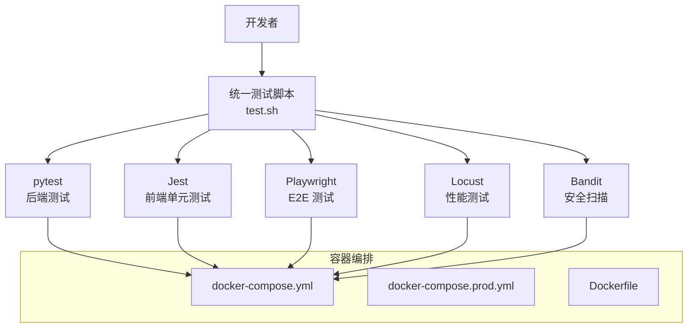
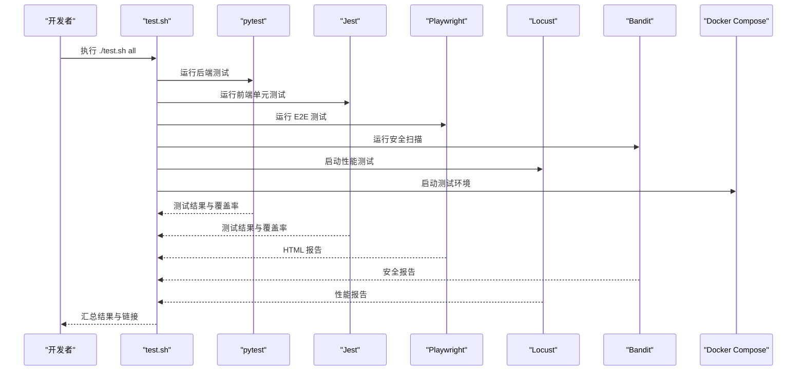
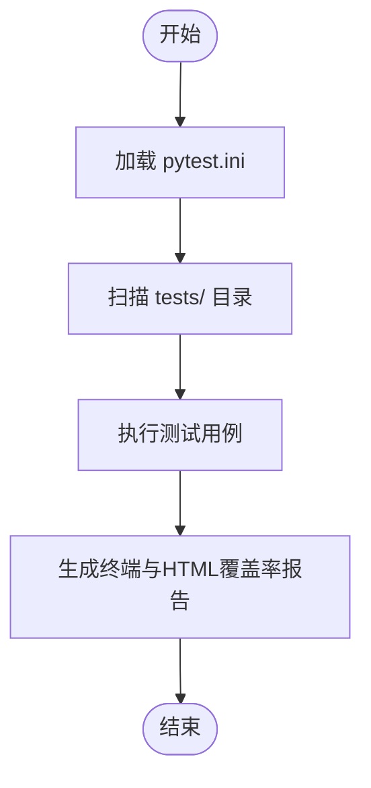
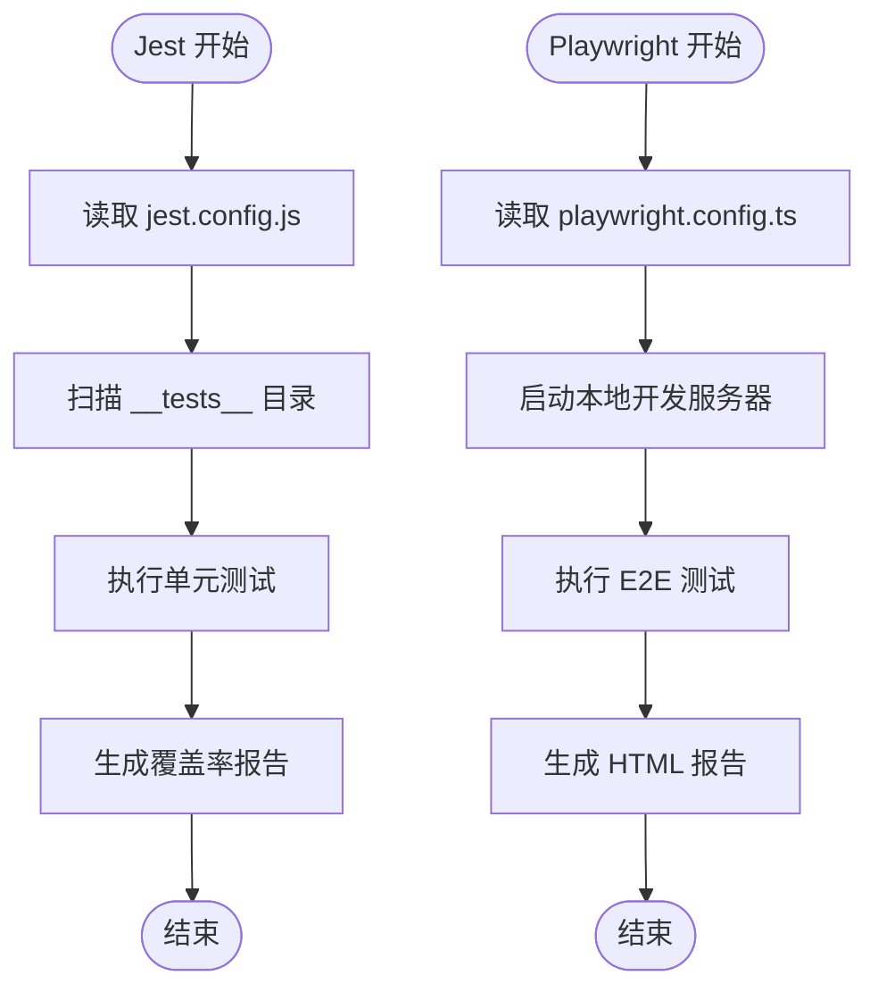
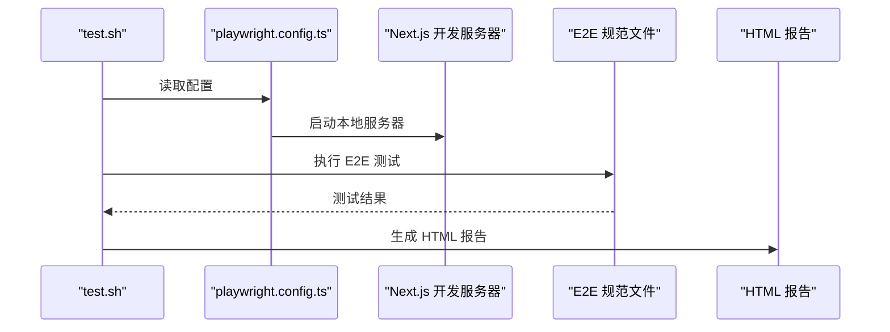
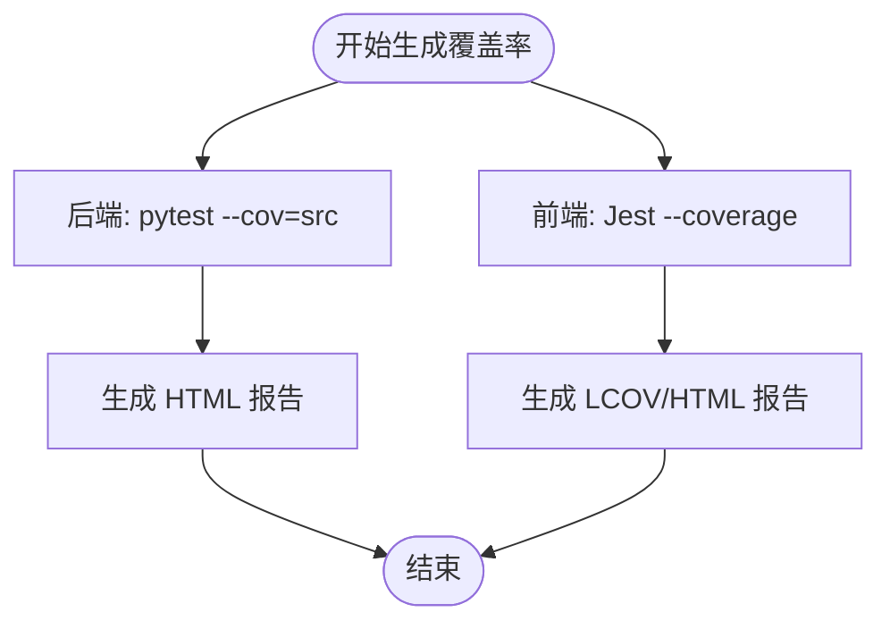
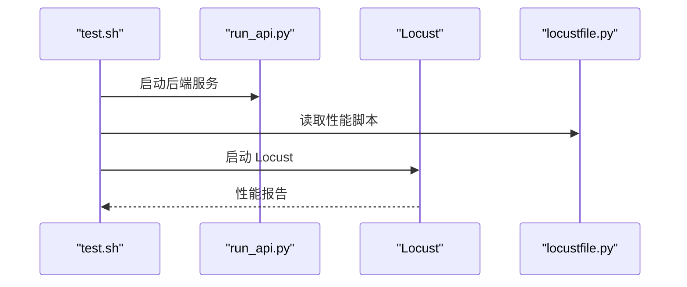
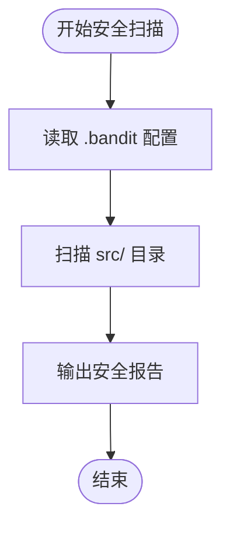
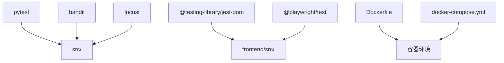

# 测试自动化

<cite>
**本文引用的文件**
- [test.sh](file://test.sh)
- [pytest.ini](file://pytest.ini)
- [Makefile](file://Makefile)
- [frontend/package.json](file://frontend/package.json)
- [frontend/jest.config.js](file://frontend/jest.config.js)
- [frontend/playwright.config.ts](file://frontend/playwright.config.ts)
- [frontend/tsconfig.json](file://frontend/tsconfig.json)
- [frontend/TEST_COVERAGE_PLAN.md](file://frontend/TEST_COVERAGE_PLAN.md)
- [TEST_COVERAGE_REPORT.md](file://TEST_COVERAGE_REPORT.md)
- [TEST_COVERAGE_PROGRESS.md](file://TEST_COVERAGE_PROGRESS.md)
- [tests/conftest.py](file://tests/conftest.py)
- [tests/e2e_regenerate_test.py](file://tests/e2e_regenerate_test.py)
- [tests/test_api_auth.py](file://tests/test_api_auth.py)
- [tests/test_api_character.py](file://tests/test_api_character.py)
- [tests/test_api_friends.py](file://tests/test_api_friends.py)
- [tests/test_api_gameplay.py](file://tests/test_api_gameplay.py)
- [tests/test_api_games.py](file://tests/test_api_games.py)
- [tests/test_api_presets.py](file://tests/test_api_presets.py)
- [tests/test_api_story.py](file://tests/test_api_story.py)
- [tests/test_character_creation.py](file://tests/test_character_creation.py)
- [tests/test_character_creation_deep.py](file://tests/test_character_creation_deep.py)
- [tests/test_character_state.py](file://tests/test_character_state.py)
- [tests/test_database.py](file://tests/test_database.py)
- [tests/test_events.py](file://tests/test_events.py)
- [tests/test_game_core.py](file://tests/test_game_core.py)
- [tests/test_game_loop.py](file://tests/test_game_loop.py)
- [tests/test_game_loop_deep.py](file://tests/test_game_loop_deep.py)
- [tests/test_game_modules.py](file://tests/test_game_modules.py)
- [tests/test_image_service.py](file://tests/test_image_service.py)
- [tests/test_image_storage.py](file://tests/test_image_storage.py)
- [tests/test_integration.py](file://tests/test_integration.py)
- [tests/test_mcp_service.py](file://tests/test_mcp_service.py)
- [tests/test_relationship_events.py](file://tests/test_relationship_events.py)
- [tests/test_scheduled_events.py](file://tests/test_scheduled_events.py)
- [tests/test_sse_helpers.py](file://tests/test_sse_helpers.py)
- [tests/test_state.py](file://tests/test_state.py)
- [tests/test_system_flow.py](file://tests/test_system_flow.py)
- [tests/test_world_model.py](file://tests/test_world_model.py)
- [tests/test_world_model_updater.py](file://tests/test_world_model_updater.py)
- [tests/security/test_api_security.py](file://tests/security/test_api_security.py)
- [tests/performance/locustfile.py](file://tests/performance/locustfile.py)
- [docker-compose.yml](file://docker-compose.yml)
- [docker-compose.prod.yml](file://docker-compose.prod.yml)
- [Dockerfile](file://Dockerfile)
- [start.sh](file://start.sh)
- [run_api.py](file://run_api.py)
- [requirements.txt](file://requirements.txt)
</cite>

## 目录
1. [简介](#简介)
2. [项目结构](#项目结构)
3. [核心组件](#核心组件)
4. [架构总览](#架构总览)
5. [详细组件分析](#详细组件分析)
6. [依赖分析](#依赖分析)
7. [性能考量](#性能考量)
8. [故障排除指南](#故障排除指南)
9. [结论](#结论)
10. [附录](#附录)

## 简介
本文件面向“人生草稿本”项目的测试自动化，系统性梳理并说明CI/CD流水线中的测试自动化配置、测试脚本与构建流程、测试环境的自动化搭建与配置管理、测试报告的自动生成与发布机制、测试数据的自动化管理与清理策略、测试失败的自动通知与故障排除流程，并提供测试自动化最佳实践与维护指南，以及测试环境隔离与并行测试执行策略。

## 项目结构
项目采用前后端分离与容器化部署的组织方式：
- 后端：Python 与 FastAPI，测试位于 tests/ 目录，使用 pytest。
- 前端：Next.js + TypeScript + React，使用 Jest 进行单元测试，Playwright 进行 E2E 测试。
- 测试运行统一入口：根目录 test.sh；Makefile 提供常用开发与测试命令。
- 容器化：Dockerfile 与 docker-compose.yml/docke-compose.prod.yml 支持本地与生产环境一键部署。
- 性能测试：Locust 性能脚本位于 tests/performance/locustfile.py。
- 安全扫描：使用 Bandit 对 Python 源码进行静态安全检测。

图表来源
- [test.sh](file://test.sh#L1-L232)
- [pytest.ini](file://pytest.ini#L1-L8)
- [frontend/jest.config.js](file://frontend/jest.config.js#L1-L38)
- [frontend/playwright.config.ts](file://frontend/playwright.config.ts#L1-L58)
- [tests/performance/locustfile.py](file://tests/performance/locustfile.py)
- [docker-compose.yml](file://docker-compose.yml)
- [docker-compose.prod.yml](file://docker-compose.prod.yml)
- [Dockerfile](file://Dockerfile)

章节来源
- [test.sh](file://test.sh#L1-L232)
- [pytest.ini](file://pytest.ini#L1-L8)
- [frontend/package.json](file://frontend/package.json#L1-L49)
- [frontend/jest.config.js](file://frontend/jest.config.js#L1-L38)
- [frontend/playwright.config.ts](file://frontend/playwright.config.ts#L1-L58)
- [docker-compose.yml](file://docker-compose.yml)
- [docker-compose.prod.yml](file://docker-compose.prod.yml)
- [Dockerfile](file://Dockerfile)

## 核心组件
- 统一测试脚本：提供后端、前端、E2E、覆盖率、性能、安全、全量测试等命令入口，支持颜色化输出与失败计数汇总。
- 后端测试：pytest 配置集中于 pytest.ini，测试路径、命名规范、异步模式等均在此统一。
- 前端测试：Jest 配置集中于 jest.config.js，含模块映射、缓存目录、覆盖率阈值、忽略路径等；Playwright 配置集中于 playwright.config.ts，含并行策略、重试、报告器、设备项目、本地服务器启动等。
- 容器化与部署：Dockerfile 与 docker-compose.* 提供本地开发与生产部署的一致环境；start.sh 与 run_api.py 用于本地启动。
- 性能与安全：Locust 性能脚本；Bandit 安全扫描；Makefile 提供一键构建与部署命令。

章节来源
- [test.sh](file://test.sh#L1-L232)
- [pytest.ini](file://pytest.ini#L1-L8)
- [frontend/jest.config.js](file://frontend/jest.config.js#L1-L38)
- [frontend/playwright.config.ts](file://frontend/playwright.config.ts#L1-L58)
- [tests/performance/locustfile.py](file://tests/performance/locustfile.py)
- [Makefile](file://Makefile#L1-L93)
- [start.sh](file://start.sh)
- [run_api.py](file://run_api.py)

## 架构总览
测试自动化体系围绕“统一入口 + 多层测试 + 容器化环境 + 报告与监控”的闭环展开：

图表来源
- [test.sh](file://test.sh#L139-L174)
- [pytest.ini](file://pytest.ini#L1-L8)
- [frontend/jest.config.js](file://frontend/jest.config.js#L18-L30)
- [frontend/playwright.config.ts](file://frontend/playwright.config.ts#L17-L28)
- [tests/performance/locustfile.py](file://tests/performance/locustfile.py)
- [docker-compose.yml](file://docker-compose.yml)

## 详细组件分析

### 后端测试：pytest 配置与执行
- 测试路径与命名规范：通过 pytest.ini 统一配置，确保扫描规则一致。
- 异步测试：pytest.ini 启用 asyncio_mode = auto，便于异步路由与 SSE 辅助模块的测试。
- 执行策略：test.sh 中通过 pytest tests/ -v --tb=short 运行，支持覆盖率导出与HTML报告生成。

图表来源
- [pytest.ini](file://pytest.ini#L1-L8)
- [test.sh](file://test.sh#L21-L36)

章节来源
- [pytest.ini](file://pytest.ini#L1-L8)
- [test.sh](file://test.sh#L21-L36)

### 前端测试：Jest 与 Playwright
- Jest 配置要点：
  - 模块映射：@/ 指向 src/，便于相对导入。
  - 缓存目录：使用项目内 .jest-cache，避免 macOS 沙箱权限问题。
  - 覆盖率阈值：全局 statements/branches/functions/lines 的阈值设定。
  - 忽略路径：node_modules、.next、e2e 目录。
- Playwright 配置要点：
  - 并行与重试：CI 环境下禁用并行，启用重试；本地开发启用并行以提升效率。
  - 报告器：HTML 报告器，便于 CI 展示。
  - 设备项目：包含 Desktop Chrome 与 iPhone 13，兼顾桌面与移动端。
  - 本地服务器：webServer 自动启动 Next.js 开发服务器，支持复用现有进程。

图表来源
- [frontend/jest.config.js](file://frontend/jest.config.js#L1-L38)
- [frontend/playwright.config.ts](file://frontend/playwright.config.ts#L1-L58)

章节来源
- [frontend/jest.config.js](file://frontend/jest.config.js#L1-L38)
- [frontend/playwright.config.ts](file://frontend/playwright.config.ts#L1-L58)

### E2E 测试：Playwright 工作流
- 项目结构：frontend/e2e 下包含 auth、character、gameplay、save-load 等测试文件，覆盖关键业务流程。
- 执行策略：test.sh 中通过 npx playwright test --project=chromium 执行；playwright.config.ts 在 CI 环境下减少并行度，提高稳定性。
- 报告与截图：启用 HTML 报告与失败截图，便于定位问题。

图表来源
- [test.sh](file://test.sh#L54-L75)
- [frontend/playwright.config.ts](file://frontend/playwright.config.ts#L50-L57)

章节来源
- [test.sh](file://test.sh#L54-L75)
- [frontend/playwright.config.ts](file://frontend/playwright.config.ts#L1-L58)

### 覆盖率与报告：统一生成与发布
- 后端覆盖率：pytest --cov=src --cov-report=term-missing --cov-report=html:htmlcov/backend。
- 前端覆盖率：npm test -- --coverage --coverageReporters=text --coverageReporters=html。
- 报告位置：后端 HTML 报告位于 htmlcov/backend/index.html；前端 HTML 报告位于 frontend/coverage/lcov-report/index.html。
- 前端覆盖率优化方案与进度：前端/TEST_COVERAGE_PLAN.md 与 TEST_COVERAGE_REPORT.md/TEST_COVERAGE_PROGRESS.md 提供阶段性目标、实施计划与优化成果。

图表来源
- [test.sh](file://test.sh#L77-L99)
- [frontend/jest.config.js](file://frontend/jest.config.js#L18-L30)

章节来源
- [test.sh](file://test.sh#L77-L99)
- [frontend/TEST_COVERAGE_PLAN.md](file://frontend/TEST_COVERAGE_PLAN.md#L1-L279)
- [TEST_COVERAGE_REPORT.md](file://TEST_COVERAGE_REPORT.md#L1-L217)
- [TEST_COVERAGE_PROGRESS.md](file://TEST_COVERAGE_PROGRESS.md#L1-L298)

### 性能测试：Locust 集成
- 启动流程：test.sh 中若后端未运行则先启动 run_api.py，再在 tests/performance/locustfile.py 上运行 Locust。
- 访问地址：http://localhost:8089 用于配置与启动负载测试。
- 适用场景：评估高并发下的接口响应、数据库连接池与AI服务调用稳定性。

图表来源
- [test.sh](file://test.sh#L101-L120)
- [tests/performance/locustfile.py](file://tests/performance/locustfile.py)

章节来源
- [test.sh](file://test.sh#L101-L120)
- [tests/performance/locustfile.py](file://tests/performance/locustfile.py)

### 安全扫描：Bandit 静态分析
- 执行命令：test.sh 中调用 bandit -r src -c .bandit。
- 作用：对 Python 源码进行安全规则扫描，发现潜在的安全风险（如硬编码、不安全反序列化等）。

图表来源
- [test.sh](file://test.sh#L122-L137)

章节来源
- [test.sh](file://test.sh#L122-L137)

### 测试数据管理与清理
- 前端 Jest：使用 .jest-cache 目录缓存测试结果，避免沙箱权限问题；tsconfig.json 中配置路径别名与严格类型检查。
- 后端测试：pytest.ini 统一扫描规则；conftest.py 可放置通用 fixture，实现测试前置与清理。
- E2E 测试：Playwright 在失败时自动生成截图与 HTML 报告，便于定位问题。
- 数据库与文件系统：测试中对外部依赖（如 AI API、文件系统）进行 Mock，降低真实数据污染风险。

章节来源
- [frontend/jest.config.js](file://frontend/jest.config.js#L8-L9)
- [frontend/tsconfig.json](file://frontend/tsconfig.json#L1-L36)
- [tests/conftest.py](file://tests/conftest.py)
- [frontend/playwright.config.ts](file://frontend/playwright.config.ts#L27-L28)

### 测试失败通知与故障排除
- 失败通知：test.sh 在各测试子流程结束后输出颜色化提示；CI 环境可通过 GitHub Actions 将 HTML 报告与覆盖率报告作为工件上传。
- 故障排除：
  - Playwright 浏览器缓存：首次运行自动安装 Chromium；若缓存损坏，删除缓存目录后重试。
  - Jest Mock 问题：针对 hoisting 问题，可参考 TEST_COVERAGE_PROGRESS.md 中的隔离模块方案。
  - 覆盖率阈值：可在 jest.config.js 中增加更细粒度的覆盖率阈值，确保关键模块达标。

章节来源
- [test.sh](file://test.sh#L55-L75)
- [TEST_COVERAGE_PROGRESS.md](file://TEST_COVERAGE_PROGRESS.md#L151-L176)

## 依赖分析
- 测试工具链：
  - 后端：pytest、pytest-asyncio、pytest-cov、bandit、locust。
  - 前端：jest、@testing-library、ts-jest、playwright。
  - 构建与运行：next、react、zustand、tailwindcss。
- 容器化依赖：Dockerfile 与 docker-compose.* 提供一致的运行环境；start.sh 与 run_api.py 用于本地启动。

图表来源
- [requirements.txt](file://requirements.txt)
- [frontend/package.json](file://frontend/package.json#L28-L47)
- [Dockerfile](file://Dockerfile)
- [docker-compose.yml](file://docker-compose.yml)

章节来源
- [requirements.txt](file://requirements.txt)
- [frontend/package.json](file://frontend/package.json#L1-L49)
- [Dockerfile](file://Dockerfile)
- [docker-compose.yml](file://docker-compose.yml)

## 性能考量
- 并行策略：
  - Playwright：CI 环境禁用并行，提高稳定性；本地开发启用并行以加速反馈。
  - Jest：默认并行执行，结合缓存目录减少重复开销。
- 资源占用：
  - Locust 仅在需要时启动，避免常驻进程占用资源。
  - Playwright 在 CI 中减少 workers 数量，降低并发资源竞争。
- 缓存与复用：
  - Jest 使用 .jest-cache；Playwright 自动安装浏览器缓存；Next.js 开发服务器可复用。

章节来源
- [frontend/playwright.config.ts](file://frontend/playwright.config.ts#L9-L16)
- [frontend/jest.config.js](file://frontend/jest.config.js#L8-L9)
- [test.sh](file://test.sh#L101-L120)

## 故障排除指南
- Playwright 浏览器安装失败：
  - 确认网络可达；首次运行会自动安装 Chromium；若失败，删除缓存后重试。
- Jest Mock 失败或 hoisting 问题：
  - 参考 TEST_COVERAGE_PROGRESS.md 中的 jest.isolateModules 方案，或改用 MSW 替代手动 Mock。
- 覆盖率不达标：
  - 按 FRONTEND/TEST_COVERAGE_PLAN.md 的优先级补充测试；在 jest.config.js 中设置更严格的阈值。
- Locust 无法连接后端：
  - 确认 run_api.py 已启动且监听 8000 端口；检查防火墙与容器网络。
- 容器环境异常：
  - 使用 docker-compose 停止并重建服务；核对环境变量与卷挂载。

章节来源
- [test.sh](file://test.sh#L55-L75)
- [TEST_COVERAGE_PROGRESS.md](file://TEST_COVERAGE_PROGRESS.md#L151-L176)
- [frontend/TEST_COVERAGE_PLAN.md](file://frontend/TEST_COVERAGE_PLAN.md#L203-L246)

## 结论
本项目已建立完善的测试自动化体系：统一入口、多层测试、容器化环境、覆盖率与报告、性能与安全扫描。通过明确的配置与流程，能够稳定地支撑持续集成与交付。建议在 CI 中引入覆盖率阈值检查、报告工件归档与通知机制，并持续补充低覆盖率模块的测试用例，以进一步提升质量保障能力。

## 附录

### CI/CD 流水线建议（基于现有配置）
- 触发条件：push 到 develop/main，或 PR 打开/更新。
- 步骤建议：
  1) 安装依赖与环境准备（Python 虚拟环境、Node.js、Playwright 浏览器）。
  2) 运行后端测试：pytest tests/ --cov=src --cov-report=xml。
  3) 运行前端测试：Jest 并生成覆盖率报告。
  4) 运行 E2E 测试：Playwright，生成 HTML 报告。
  5) 运行安全扫描：Bandit。
  6) 运行性能测试：Locust。
  7) 上传报告工件：后端覆盖率 XML、前端覆盖率 HTML、E2E HTML 报告。
  8) 覆盖率阈值检查：若低于阈值则失败。
  9) 失败通知：通过 Slack/邮件/GitHub Checks 通知。

章节来源
- [test.sh](file://test.sh#L1-L232)
- [pytest.ini](file://pytest.ini#L1-L8)
- [frontend/jest.config.js](file://frontend/jest.config.js#L18-L30)
- [frontend/playwright.config.ts](file://frontend/playwright.config.ts#L17-L28)

### 测试环境隔离与并行策略
- 隔离策略：
  - 使用独立数据库与文件系统（测试专用）；通过 Mock 外部服务。
  - Playwright 在 CI 中减少并行度，避免资源争用。
- 并行策略：
  - Jest 默认并行；Playwright 在本地并行，在 CI 中串行。
  - Makefile 提供快速命令，便于本地并行开发与调试。

章节来源
- [frontend/playwright.config.ts](file://frontend/playwright.config.ts#L9-L16)
- [frontend/jest.config.js](file://frontend/jest.config.js#L1-L38)
- [Makefile](file://Makefile#L1-L93)