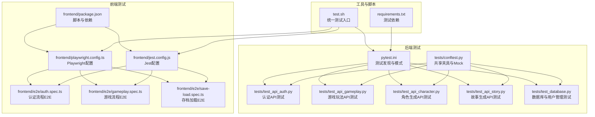
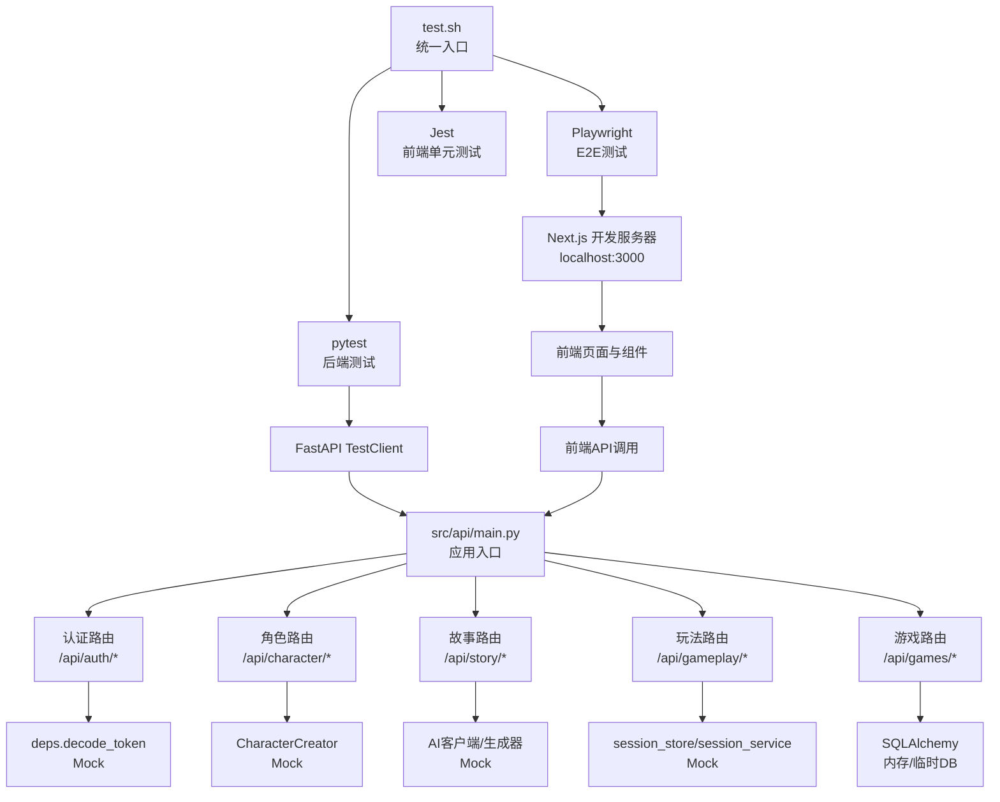
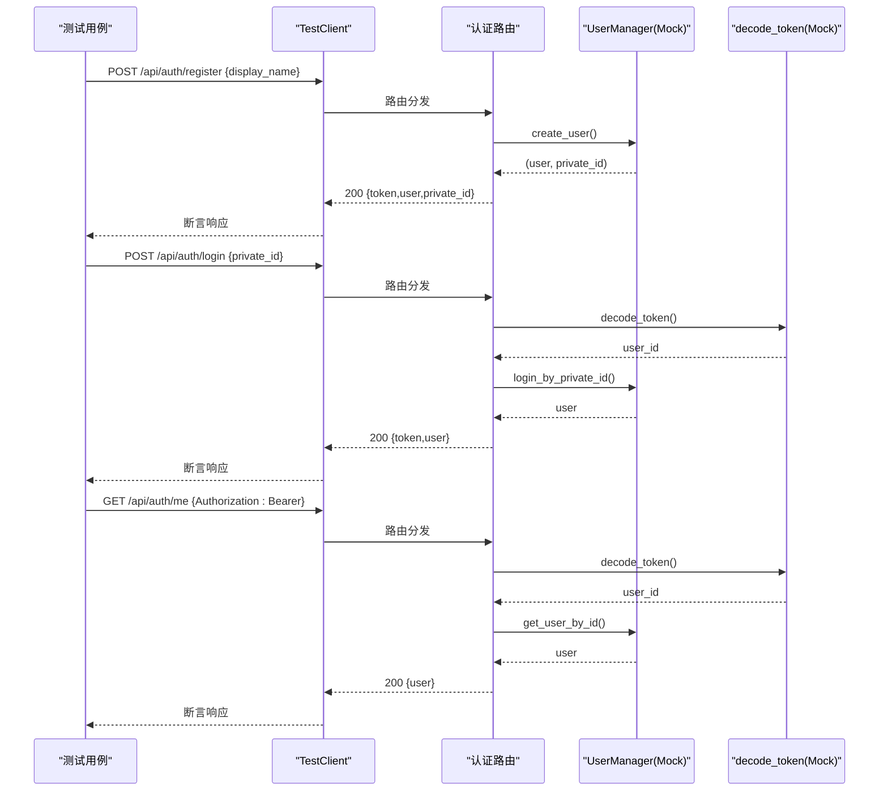
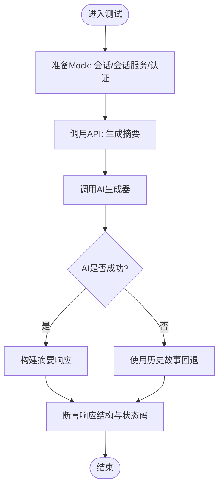
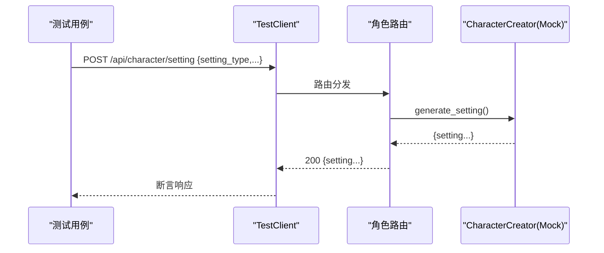
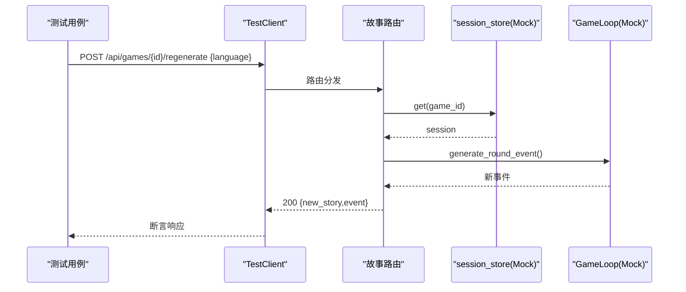
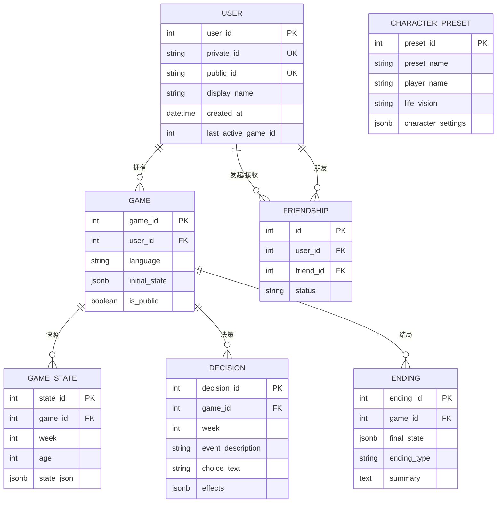
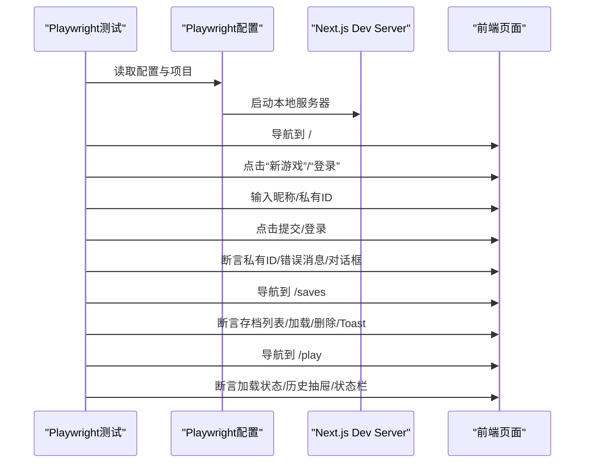
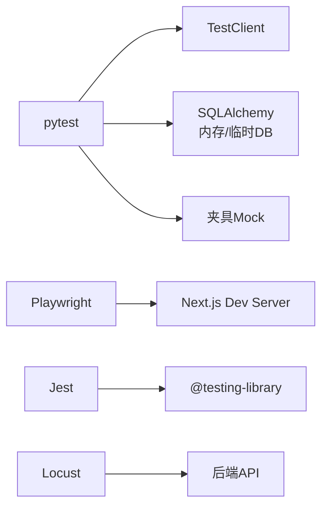

# 集成测试

<cite>
**本文引用的文件**
- [tests/conftest.py](file://tests/conftest.py)
- [pytest.ini](file://pytest.ini)
- [test.sh](file://test.sh)
- [requirements.txt](file://requirements.txt)
- [tests/test_api_auth.py](file://tests/test_api_auth.py)
- [tests/test_api_gameplay.py](file://tests/test_api_gameplay.py)
- [tests/test_api_character.py](file://tests/test_api_character.py)
- [tests/test_api_story.py](file://tests/test_api_story.py)
- [tests/test_database.py](file://tests/test_database.py)
- [frontend/playwright.config.ts](file://frontend/playwright.config.ts)
- [frontend/e2e/auth.spec.ts](file://frontend/e2e/auth.spec.ts)
- [frontend/e2e/gameplay.spec.ts](file://frontend/e2e/gameplay.spec.ts)
- [frontend/e2e/save-load.spec.ts](file://frontend/e2e/save-load.spec.ts)
- [frontend/package.json](file://frontend/package.json)
- [frontend/jest.config.js](file://frontend/jest.config.js)
</cite>

## 目录
1. [简介](#简介)
2. [项目结构](#项目结构)
3. [核心组件](#核心组件)
4. [架构总览](#架构总览)
5. [详细组件分析](#详细组件分析)
6. [依赖分析](#依赖分析)
7. [性能考虑](#性能考虑)
8. [故障排除指南](#故障排除指南)
9. [结论](#结论)
10. [附录](#附录)

## 简介
本文件为“人生草稿本”项目的集成测试文档，覆盖后端API端到端测试、前端Playwright端到端测试、数据库层集成与事务测试、测试环境与数据管理、测试工具使用与报告生成，并提供最佳实践与故障排除建议。目标是帮助开发者与测试工程师系统性地理解与维护本项目的集成测试体系。

## 项目结构
项目采用前后端分离的结构，测试主要分布在以下位置：
- 后端测试：tests/ 下的各类 test_*.py 文件，使用 pytest 作为测试框架，配合 FastAPI TestClient 进行API路由级测试。
- 前端测试：frontend/src 下的单元测试与 Playwright E2E 测试，分别用于组件与端到端用户流程验证。
- 测试配置：pytest.ini 控制测试发现与执行；test.sh 提供一键运行后端/前端/E2E/覆盖率/性能/安全测试的统一入口；requirements.txt 管理测试相关依赖。

图表来源
- [pytest.ini](file://pytest.ini#L1-L8)
- [tests/conftest.py](file://tests/conftest.py#L1-L337)
- [tests/test_api_auth.py](file://tests/test_api_auth.py#L1-L276)
- [tests/test_api_gameplay.py](file://tests/test_api_gameplay.py#L1-L334)
- [tests/test_api_character.py](file://tests/test_api_character.py#L1-L365)
- [tests/test_api_story.py](file://tests/test_api_story.py#L1-L495)
- [tests/test_database.py](file://tests/test_database.py#L1-L798)
- [frontend/playwright.config.ts](file://frontend/playwright.config.ts#L1-L58)
- [frontend/e2e/auth.spec.ts](file://frontend/e2e/auth.spec.ts#L1-L304)
- [frontend/e2e/gameplay.spec.ts](file://frontend/e2e/gameplay.spec.ts#L1-L155)
- [frontend/e2e/save-load.spec.ts](file://frontend/e2e/save-load.spec.ts#L1-L308)
- [frontend/jest.config.js](file://frontend/jest.config.js#L1-L38)
- [frontend/package.json](file://frontend/package.json#L1-L49)
- [test.sh](file://test.sh#L1-L232)
- [requirements.txt](file://requirements.txt#L1-L12)

章节来源
- [pytest.ini](file://pytest.ini#L1-L8)
- [test.sh](file://test.sh#L1-L232)
- [requirements.txt](file://requirements.txt#L1-L12)

## 核心组件
- 共享夹具与Mock（tests/conftest.py）：提供 TestClient、认证头、数据库引擎/会话、会话存储/服务Mock、用户管理Mock、AI服务Mock、样例状态与事件等，确保各测试用例可复用、隔离可控。
- 认证API测试（tests/test_api_auth.py）：覆盖注册、登录、获取当前用户、登出及Cookie优先于Header的认证策略。
- 游戏玩法API测试（tests/test_api_gameplay.py）：覆盖状态获取、选择、自定义选择、摘要生成、结局评估、事件同步、选择同步、自定义同步等。
- 角色生成API测试（tests/test_api_character.py）：覆盖时代/年龄/性别/世界/家庭/特质/财富等设定生成、关系人物生成、初始属性生成、关系摘要生成、开场故事缓存与并发控制。
- 故事生成API测试（tests/test_api_story.py）：覆盖改写、重新生成（含SSE）、聊天、一致性校验重试、世界模型集成、SSE缓存清理等。
- 数据库与用户管理测试（tests/test_database.py）：覆盖ORM模型约束、级联删除、GameDatabase操作、UserManager功能（创建、登录、显示名更新、好友请求、接受/拒绝、删除、公开/私有设置）、活跃游戏会话管理。
- Playwright E2E（frontend/e2e/*.spec.ts）：覆盖欢迎页与认证流程、游戏主流程、存档/加载流程、错误处理与UI一致性验证。
- 前端测试配置（frontend/jest.config.js、frontend/package.json）：Jest运行环境、模块映射、覆盖率阈值、Playwright脚本与依赖。
- 统一测试脚本（test.sh）：一键运行后端/前端/E2E/覆盖率/性能/安全测试，支持CI友好重试与并行策略。

章节来源
- [tests/conftest.py](file://tests/conftest.py#L1-L337)
- [tests/test_api_auth.py](file://tests/test_api_auth.py#L1-L276)
- [tests/test_api_gameplay.py](file://tests/test_api_gameplay.py#L1-L334)
- [tests/test_api_character.py](file://tests/test_api_character.py#L1-L365)
- [tests/test_api_story.py](file://tests/test_api_story.py#L1-L495)
- [tests/test_database.py](file://tests/test_database.py#L1-L798)
- [frontend/playwright.config.ts](file://frontend/playwright.config.ts#L1-L58)
- [frontend/e2e/auth.spec.ts](file://frontend/e2e/auth.spec.ts#L1-L304)
- [frontend/e2e/gameplay.spec.ts](file://frontend/e2e/gameplay.spec.ts#L1-L155)
- [frontend/e2e/save-load.spec.ts](file://frontend/e2e/save-load.spec.ts#L1-L308)
- [frontend/jest.config.js](file://frontend/jest.config.js#L1-L38)
- [frontend/package.json](file://frontend/package.json#L1-L49)
- [test.sh](file://test.sh#L1-L232)

## 架构总览
下图展示从测试入口到被测系统的调用链路与Mock策略：

图表来源
- [test.sh](file://test.sh#L1-L232)
- [pytest.ini](file://pytest.ini#L1-L8)
- [frontend/playwright.config.ts](file://frontend/playwright.config.ts#L1-L58)
- [frontend/package.json](file://frontend/package.json#L1-L49)
- [tests/conftest.py](file://tests/conftest.py#L1-L337)

## 详细组件分析

### 认证模块集成测试
- 测试范围：注册（成功/失败/参数校验/异常）、登录（成功/失败/参数校验/异常）、获取当前用户（Token缺失/无效/用户不存在）、登出（无状态JWT）、Cookie优先策略（注册/登录/鉴权/登出）。
- 关键策略：使用夹具替换认证解码函数与用户管理器，模拟用户创建/登录/查询；断言响应状态码与JSON结构；验证Cookie设置与清除。
- 失败场景：空名称、超长名称、非法私有ID、Token缺失或无效、用户不存在、AI服务异常回退。

图表来源
- [tests/test_api_auth.py](file://tests/test_api_auth.py#L1-L276)
- [tests/conftest.py](file://tests/conftest.py#L1-L190)

章节来源
- [tests/test_api_auth.py](file://tests/test_api_auth.py#L1-L276)
- [tests/conftest.py](file://tests/conftest.py#L1-L190)

### 游戏玩法模块集成测试
- 测试范围：获取状态、选择（索引越界/无会话）、自定义选择（空文本/无会话）、生成摘要（AI异常回退）、获取结局（未结束/无会话）、事件同步（已结束/生成中）、选择同步（索引越界）、自定义同步（空文本）。
- 关键策略：Mock会话服务与会话对象，注入当前事件、回合数、玩家状态；断言状态结构与错误码；验证AI异常时的回退路径与数据库访问。

图表来源
- [tests/test_api_gameplay.py](file://tests/test_api_gameplay.py#L1-L334)
- [tests/conftest.py](file://tests/conftest.py#L1-L107)

章节来源
- [tests/test_api_gameplay.py](file://tests/test_api_gameplay.py#L1-L334)
- [tests/conftest.py](file://tests/conftest.py#L1-L107)

### 角色生成模块集成测试
- 测试范围：时代/年龄/性别/世界/家庭/特质/财富设定生成；关系人物生成；初始属性生成；关系摘要生成；开场故事缓存命中/生成中/并发冲突。
- 关键策略：Mock CharacterCreator；断言返回字段；验证缓存锁与并发控制；覆盖AI异常场景。

图表来源
- [tests/test_api_character.py](file://tests/test_api_character.py#L1-L365)
- [tests/conftest.py](file://tests/conftest.py#L281-L288)

章节来源
- [tests/test_api_character.py](file://tests/test_api_character.py#L1-L365)
- [tests/conftest.py](file://tests/conftest.py#L281-L288)

### 故事生成模块集成测试
- 测试范围：改写（无当前事件也支持）、重新生成（完整 generate_round_event 流程/SSE）、聊天（历史上下文）、一致性校验重试、世界模型集成、SSE缓存清理。
- 关键策略：Mock会话与AI生成器；断言返回格式（new_story/event/options）；验证SSE端点行为与异常处理。

图表来源
- [tests/test_api_story.py](file://tests/test_api_story.py#L1-L495)
- [tests/conftest.py](file://tests/conftest.py#L29-L47)

章节来源
- [tests/test_api_story.py](file://tests/test_api_story.py#L1-L495)
- [tests/conftest.py](file://tests/conftest.py#L29-L47)

### 数据库与用户管理集成测试
- 测试范围：User/Friendship/Game/GameState/Decision/Ending/CharacterPreset 模型约束与级联删除；GameDatabase CRUD（创建/保存/加载/历史/结局/预设）；UserManager 功能（创建/登录/显示名更新/好友请求/接受/拒绝/删除/公开/私有）；活跃游戏会话管理。
- 关键策略：内存SQLite引擎；显式断言唯一性约束与异常；断言级联删除；断言公开/私有字段变更。

图表来源
- [tests/test_database.py](file://tests/test_database.py#L1-L798)

章节来源
- [tests/test_database.py](file://tests/test_database.py#L1-L798)

### Playwright 端到端测试
- 配置要点：测试目录、并行策略、CI友好重试、workers、报告器、baseURL、trace/screenshot策略、多设备项目（Chromium、iPhone 13）、本地开发服务器自动启动。
- 测试覆盖：认证流程（注册/登录/私有ID提示/复制/错误提示）、游戏流程（欢迎页/加载/历史抽屉/状态栏/网络错误容错）、存档/加载（列表/分组/加载/删除/空状态/Toast通知/返回导航）。
- UI一致性验证：标题、按钮可见性、对话框/抽屉打开关闭、键盘交互（Esc）、路由跳转与URL变化。

图表来源
- [frontend/playwright.config.ts](file://frontend/playwright.config.ts#L1-L58)
- [frontend/e2e/auth.spec.ts](file://frontend/e2e/auth.spec.ts#L1-L304)
- [frontend/e2e/gameplay.spec.ts](file://frontend/e2e/gameplay.spec.ts#L1-L155)
- [frontend/e2e/save-load.spec.ts](file://frontend/e2e/save-load.spec.ts#L1-L308)

章节来源
- [frontend/playwright.config.ts](file://frontend/playwright.config.ts#L1-L58)
- [frontend/e2e/auth.spec.ts](file://frontend/e2e/auth.spec.ts#L1-L304)
- [frontend/e2e/gameplay.spec.ts](file://frontend/e2e/gameplay.spec.ts#L1-L155)
- [frontend/e2e/save-load.spec.ts](file://frontend/e2e/save-load.spec.ts#L1-L308)

## 依赖分析
- 测试框架与工具：pytest、FastAPI TestClient、Playwright、Jest/Testing Library、SQLAlchemy（内存/临时DB）、Locust（性能测试）。
- 依赖注入与Mock：通过夹具替换认证解码、数据库会话、会话存储/服务、用户管理器、AI客户端/生成器，保证测试隔离与可控。
- 并行与CI：pytest.ini启用异步模式；test.sh在CI上调整重试与worker数量；Playwright在CI上禁用并行并限制workers。

图表来源
- [pytest.ini](file://pytest.ini#L1-L8)
- [test.sh](file://test.sh#L1-L232)
- [frontend/playwright.config.ts](file://frontend/playwright.config.ts#L1-L58)
- [frontend/jest.config.js](file://frontend/jest.config.js#L1-L38)

章节来源
- [pytest.ini](file://pytest.ini#L1-L8)
- [test.sh](file://test.sh#L1-L232)
- [frontend/playwright.config.ts](file://frontend/playwright.config.ts#L1-L58)
- [frontend/jest.config.js](file://frontend/jest.config.js#L1-L38)

## 性能考虑
- 性能测试：使用 Locust 在后端运行时进行负载测试，支持配置并发与持续时间；通过 test.sh 自动检测后端进程并启动 Locust。
- 前端性能：Playwright测试关注页面渲染与交互延迟，建议在CI上开启trace以定位慢点；对关键路由（/play、/saves）进行端到端时延监控。
- 后端性能：pytest测试中避免真实AI调用，使用Mock减少外部依赖带来的不确定性；数据库使用内存引擎提升速度。

章节来源
- [test.sh](file://test.sh#L101-L120)

## 故障排除指南
- 后端测试失败
  - 现象：pytest执行报错或断言失败。
  - 排查：查看test.sh输出与pytest短错误栈；确认夹具是否正确Mock；检查认证头/会话Mock是否生效；核对数据库引擎/会话是否正确创建与关闭。
  - 参考：tests/conftest.py、pytest.ini。
- 前端E2E失败
  - 现象：Playwright测试在特定浏览器/设备上失败。
  - 排查：确认Playwright浏览器缓存与安装；检查baseURL与webServer配置；查看trace截图；核对页面元素选择器与可见性。
  - 参考：frontend/playwright.config.ts、frontend/e2e/*.spec.ts。
- 数据库相关失败
  - 现象：唯一约束冲突、级联删除异常、公开/私有字段不一致。
  - 排查：确认内存DB初始化与表结构；断言唯一性约束；验证级联删除；检查公开/私有设置流程。
  - 参考：tests/test_database.py。
- 覆盖率报告
  - 现象：覆盖率报告缺失或不完整。
  - 排查：确保test.sh使用--cov参数；前端Jest启用覆盖率；核对报告输出目录。
  - 参考：test.sh、frontend/jest.config.js。

章节来源
- [tests/conftest.py](file://tests/conftest.py#L1-L337)
- [pytest.ini](file://pytest.ini#L1-L8)
- [frontend/playwright.config.ts](file://frontend/playwright.config.ts#L1-L58)
- [frontend/jest.config.js](file://frontend/jest.config.js#L1-L38)
- [test.sh](file://test.sh#L77-L99)
- [tests/test_database.py](file://tests/test_database.py#L1-L798)

## 结论
本项目的集成测试体系通过pytest、Playwright与Jest形成前后端协同的端到端保障：后端以路由级测试覆盖认证、角色、故事与玩法核心流程，并结合数据库与用户管理测试确保数据完整性；前端以Playwright验证用户流程与UI一致性；统一脚本与配置确保CI友好与可重复执行。建议持续完善关键路径的SSE与AI异常回退测试，加强跨设备与网络异常场景的验证。

## 附录
- 测试环境搭建
  - 安装依赖：pip install -r requirements.txt；npm install（前端）。
  - 后端测试：./test.sh backend 或 pytest tests/ -v。
  - 前端测试：./test.sh frontend 或 npm run test。
  - E2E测试：./test.sh e2e 或 npx playwright test。
  - 覆盖率：./test.sh coverage。
  - 性能：./test.sh perf。
  - 安全：./test.sh security。
- 测试数据管理
  - 使用内存SQLite（tests/conftest.py）或临时文件数据库进行隔离测试；必要时使用夹具预置样例用户/游戏数据。
- 最佳实践
  - 尽量使用夹具进行Mock，避免真实外部依赖。
  - 对关键API增加错误路径与边界条件测试。
  - E2E测试中保留trace与截图以便问题定位。
  - 在CI上启用重试与单worker策略，保证稳定性。

章节来源
- [requirements.txt](file://requirements.txt#L1-L12)
- [test.sh](file://test.sh#L1-L232)
- [tests/conftest.py](file://tests/conftest.py#L1-L337)
- [frontend/package.json](file://frontend/package.json#L1-L49)
- [frontend/jest.config.js](file://frontend/jest.config.js#L1-L38)