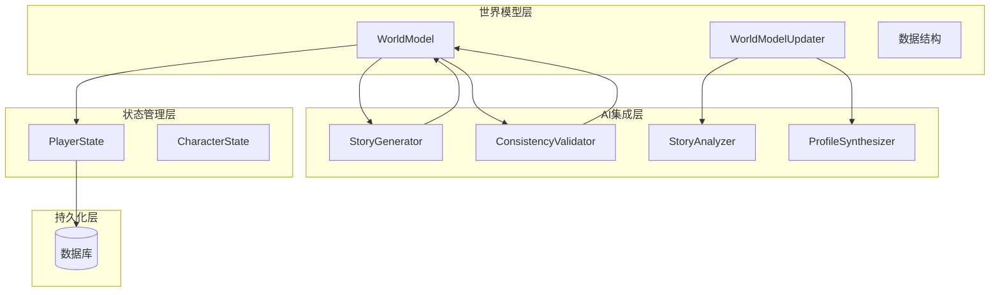
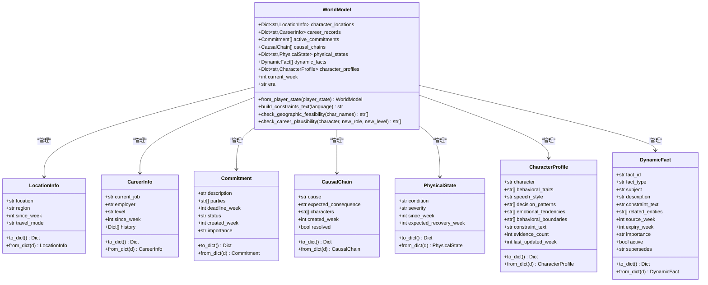
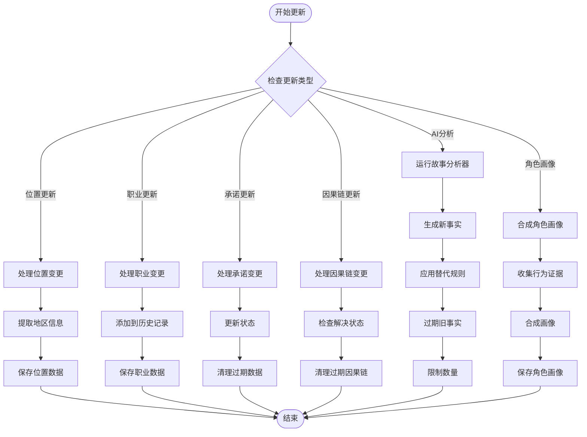
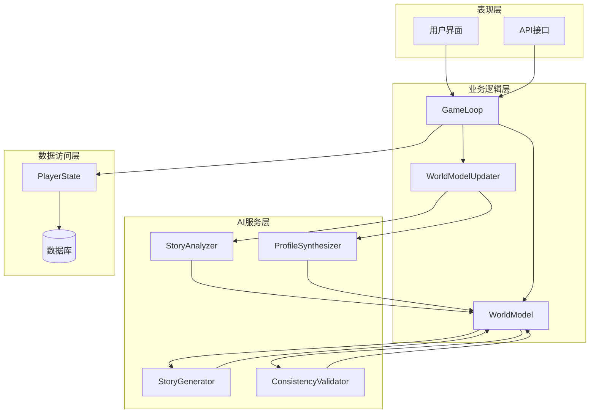
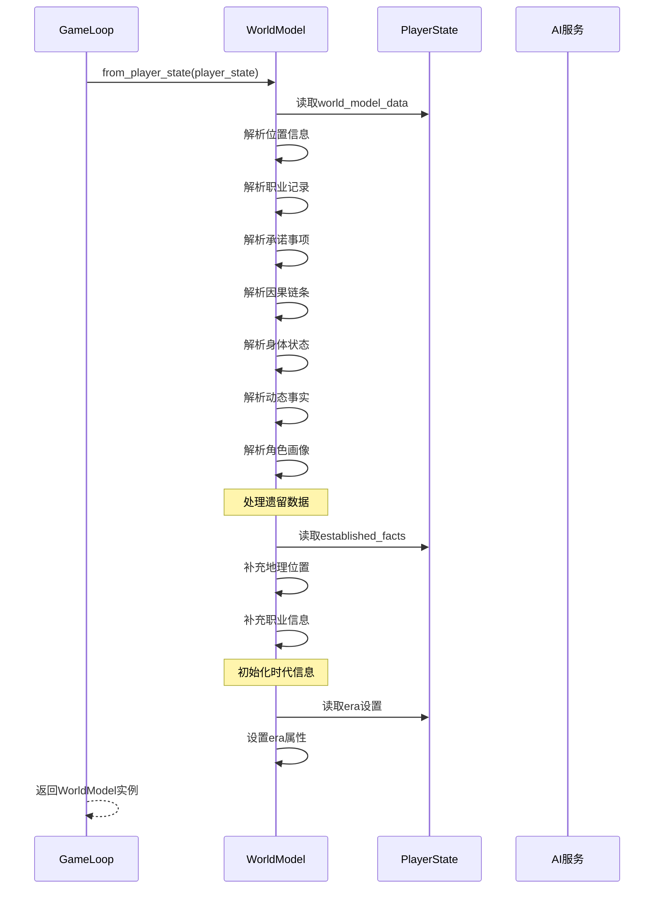
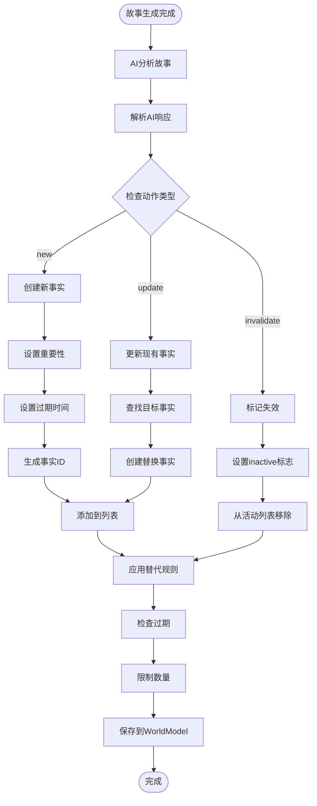
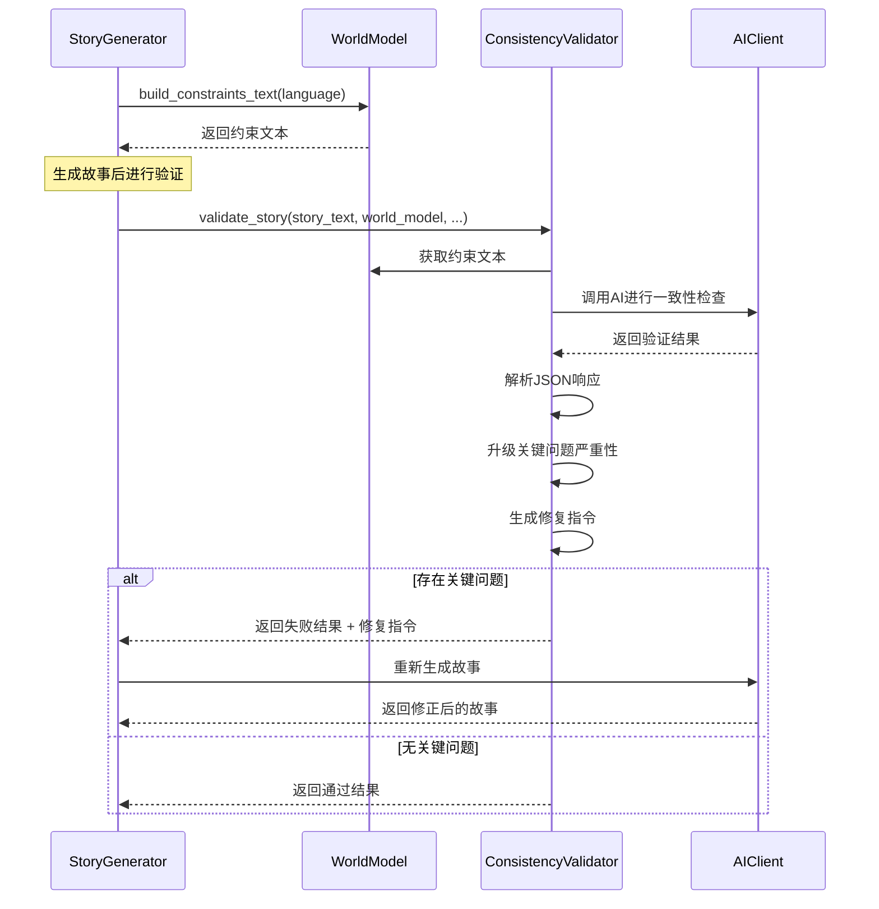
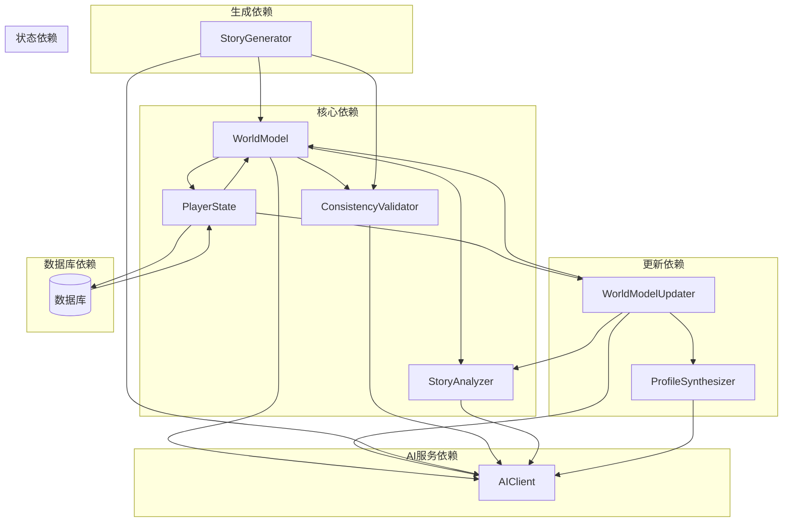
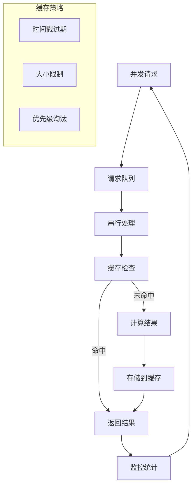

# 世界模型系统

<cite>
**本文档引用的文件**
- [world_model.py](file://src/game/world_model.py)
- [world_model_updater.py](file://src/game/world_model_updater.py)
- [state.py](file://src/game/state.py)
- [story_generator.py](file://src/ai/story_generator.py)
- [consistency_validator.py](file://src/ai/consistency_validator.py)
- [story_analyzer.py](file://src/ai/story_analyzer.py)
- [profile_synthesizer.py](file://src/ai/profile_synthesizer.py)
- [models.py](file://src/database/models.py)
- [game_loop.py](file://src/game/game_loop.py)
</cite>

## 目录
1. [简介](#简介)
2. [项目结构](#项目结构)
3. [核心组件](#核心组件)
4. [架构概览](#架构概览)
5. [详细组件分析](#详细组件分析)
6. [依赖关系分析](#依赖关系分析)
7. [性能考虑](#性能考虑)
8. [故障排除指南](#故障排除指南)
9. [结论](#结论)
10. [附录](#附录)

## 简介

世界模型系统是本项目的核心数据管理机制，负责维护游戏世界的结构化数据状态。该系统通过统一的数据模型和约束机制，确保AI生成内容的一致性和叙事连贯性。

系统主要包含以下核心功能：
- **结构化数据管理**：角色位置、职业记录、承诺事项、因果链条等
- **AI交互机制**：与AI生成器协作，提供约束条件和验证服务
- **动态事实系统**：自动识别和管理世界状态变化
- **一致性保证**：通过约束文本和验证机制确保故事逻辑正确

## 项目结构

世界模型系统位于游戏模块的核心位置，采用分层架构设计：



**图表来源**
- [world_model.py](file://src/game/world_model.py#L185-L641)
- [world_model_updater.py](file://src/game/world_model_updater.py#L14-L520)
- [story_generator.py](file://src/ai/story_generator.py#L24-L387)

**章节来源**
- [world_model.py](file://src/game/world_model.py#L1-L665)
- [world_model_updater.py](file://src/game/world_model_updater.py#L1-L520)
- [state.py](file://src/game/state.py#L244-L709)

## 核心组件

### 数据结构体系

世界模型系统定义了完整的数据结构层次：



**图表来源**
- [world_model.py](file://src/game/world_model.py#L17-L161)

### 更新管理器

WorldModelUpdater负责处理各种数据更新操作：



**图表来源**
- [world_model_updater.py](file://src/game/world_model_updater.py#L21-L520)

**章节来源**
- [world_model.py](file://src/game/world_model.py#L185-L641)
- [world_model_updater.py](file://src/game/world_model_updater.py#L14-L520)

## 架构概览

世界模型系统采用分层架构，实现了数据管理、AI集成和持久化的分离：



**图表来源**
- [game_loop.py](file://src/game/game_loop.py#L23-L1193)
- [story_generator.py](file://src/ai/story_generator.py#L24-L387)
- [consistency_validator.py](file://src/ai/consistency_validator.py#L42-L231)

## 详细组件分析

### 世界模型构建流程

WorldModel.from_player_state()方法负责从PlayerState构建完整的世界模型：



**图表来源**
- [world_model.py](file://src/game/world_model.py#L202-L287)

### 动态事实系统

动态事实系统是世界模型的核心创新，能够自动识别和管理世界状态变化：



**图表来源**
- [story_analyzer.py](file://src/ai/story_analyzer.py#L111-L317)
- [world_model_updater.py](file://src/game/world_model_updater.py#L262-L353)

### 一致性验证机制

ConsistencyValidator确保AI生成内容符合世界模型约束：



**图表来源**
- [consistency_validator.py](file://src/ai/consistency_validator.py#L60-L231)
- [story_generator.py](file://src/ai/story_generator.py#L310-L374)

**章节来源**
- [world_model.py](file://src/game/world_model.py#L381-L627)
- [story_analyzer.py](file://src/ai/story_analyzer.py#L94-L317)
- [consistency_validator.py](file://src/ai/consistency_validator.py#L42-L231)

## 依赖关系分析

世界模型系统与其他模块的依赖关系如下：



**图表来源**
- [world_model.py](file://src/game/world_model.py#L1-L665)
- [world_model_updater.py](file://src/game/world_model_updater.py#L1-L520)
- [state.py](file://src/game/state.py#L1-L709)

**章节来源**
- [game_loop.py](file://src/game/game_loop.py#L1-L200)
- [models.py](file://src/database/models.py#L1-L171)

## 性能考虑

### 数据结构优化

1. **内存效率**
   - 使用dataclass减少内存开销
   - 字典存储支持快速查找和更新
   - 限制动态事实数量防止内存膨胀

2. **查询性能**
   - 基于字典的O(1)查找时间
   - 分类存储便于批量操作
   - 缓存常用查询结果

3. **序列化优化**
   - 自定义to_dict/from_dict方法
   - 支持增量更新减少IO开销
   - 压缩存储结构

### 并发处理



## 故障排除指南

### 常见问题诊断

1. **世界模型构建失败**
   - 检查PlayerState的world_model_data格式
   - 验证数据完整性
   - 查看日志中的错误信息

2. **AI分析器异常**
   - 确认AI客户端配置正确
   - 检查网络连接状态
   - 验证prompt模板完整性

3. **一致性验证错误**
   - 检查约束文本生成
   - 验证AI响应格式
   - 查看具体问题描述

### 调试技巧

```python
# 启用详细日志
import logging
logging.basicConfig(level=logging.DEBUG)

# 检查世界模型状态
def debug_world_model_state(world_model):
    print(f"位置数量: {len(world_model.character_locations)}")
    print(f"职业记录: {len(world_model.career_records)}")
    print(f"承诺事项: {len(world_model.active_commitments)}")
    print(f"因果链条: {len(world_model.causal_chains)}")
    print(f"动态事实: {len(world_model.dynamic_facts)}")

# 验证特定约束
issues = world_model.check_geographic_feasibility(["张三", "李四"])
print(f"地理约束问题: {issues}")
```

**章节来源**
- [consistency_validator.py](file://src/ai/consistency_validator.py#L119-L231)
- [world_model_updater.py](file://src/game/world_model_updater.py#L351-L353)

## 结论

世界模型系统通过结构化的数据管理和智能的AI集成，为游戏提供了强大的叙事一致性保障。系统的主要优势包括：

1. **全面的数据覆盖**：涵盖地理位置、职业发展、承诺事项、因果关系等多个维度
2. **智能的动态管理**：通过AI自动识别和更新世界状态
3. **严格的约束保证**：确保生成内容符合逻辑和一致性要求
4. **良好的扩展性**：模块化设计支持功能扩展和性能优化

该系统为复杂世界状态的管理提供了可靠的解决方案，是实现高质量AI驱动叙事的关键基础设施。

## 附录

### 数据结构示例

以下是世界模型中各类数据结构的典型示例：

**位置信息示例**
```json
{
  "location": "北京市朝阳区",
  "region": "北京",
  "since_week": 12,
  "travel_mode": "resident"
}
```

**职业记录示例**
```json
{
  "current_job": "产品经理",
  "employer": "某科技公司",
  "level": "mid",
  "since_week": 8,
  "history": [
    {
      "job": "初级产品经理",
      "employer": "另一家公司",
      "level": "junior",
      "from_week": 0,
      "to_week": 8,
      "action": "promotion"
    }
  ]
}
```

**承诺事项示例**
```json
{
  "description": "答应周末陪妈妈去医院",
  "parties": ["主角", "母亲"],
  "deadline_week": 15,
  "status": "pending",
  "created_week": 12,
  "importance": "normal"
}
```

**因果链条示例**
```json
{
  "cause": "得罪了部门主管李总",
  "expected_consequence": "可能影响晋升评审",
  "characters": ["张三"],
  "created_week": 10,
  "resolved": false
}
```

**动态事实示例**
```json
{
  "fact_id": "f_zhangwei_injury_w12",
  "fact_type": "physical_state",
  "subject": "张伟",
  "description": "右臂骨折",
  "constraint_text": "张伟右臂打着石膏，不能提重物或做剧烈运动",
  "related_entities": ["张伟"],
  "source_week": 12,
  "expiry_week": 20,
  "importance": "important",
  "active": true,
  "supersedes": ""
}
```

### 查询优化建议

1. **索引策略**
   - 为常用查询字段建立索引
   - 使用复合索引优化多条件查询
   - 定期分析查询性能

2. **缓存策略**
   - 缓存热点数据
   - 实施适当的过期策略
   - 监控缓存命中率

3. **批处理优化**
   - 合并频繁的小更新
   - 使用事务减少锁竞争
   - 异步处理耗时操作

4. **内存管理**
   - 定期清理过期数据
   - 实施内存使用监控
   - 优化数据结构存储