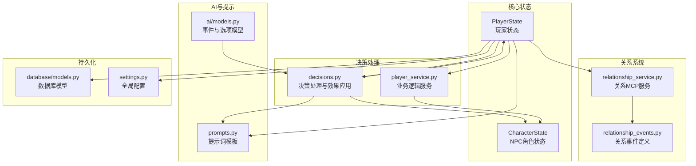
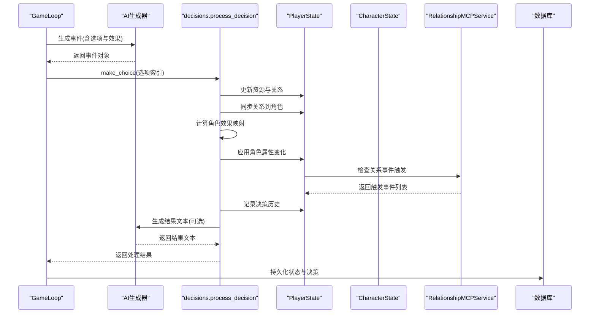
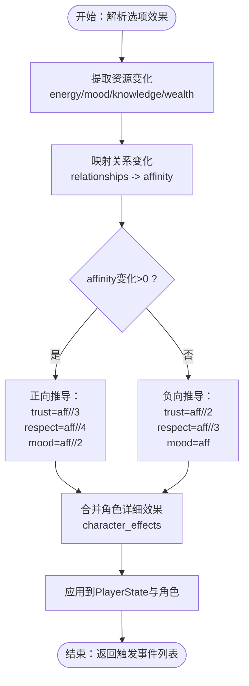
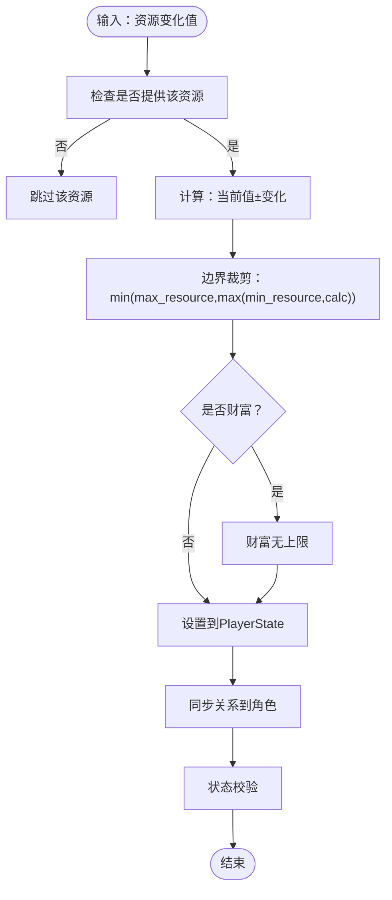
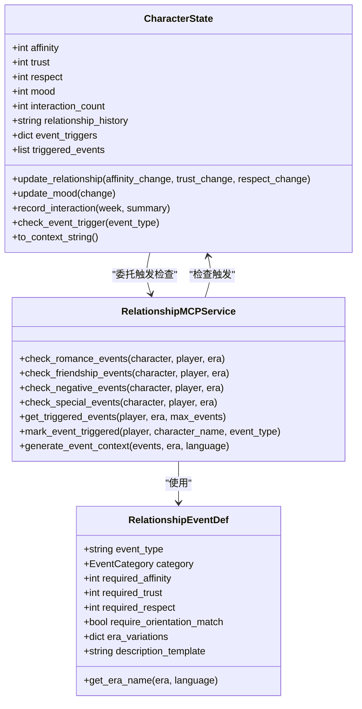
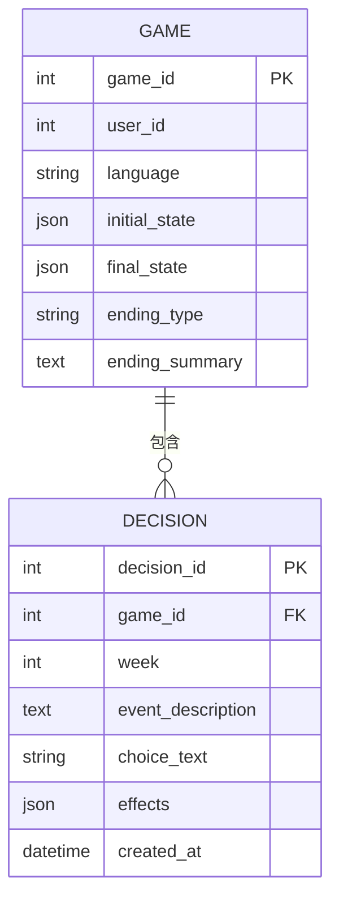
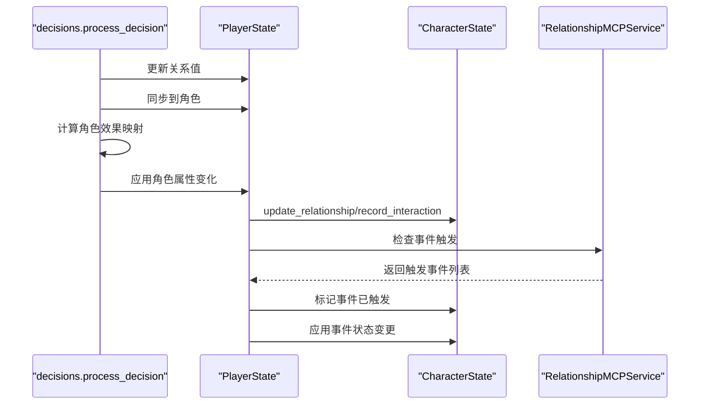
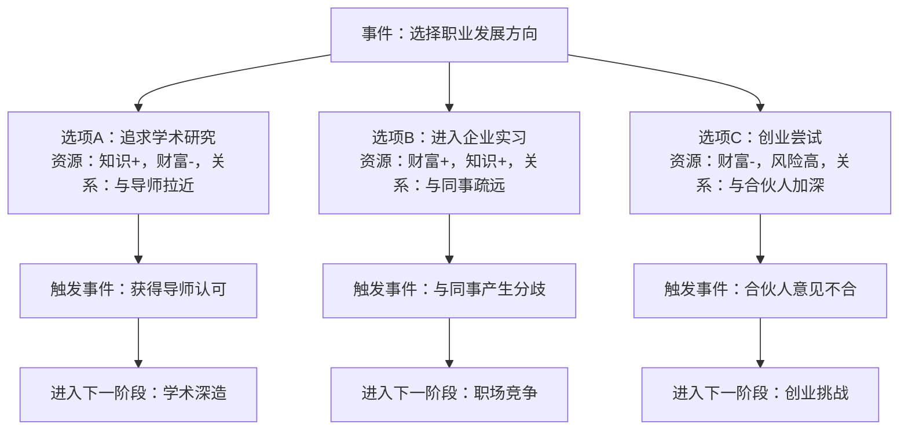
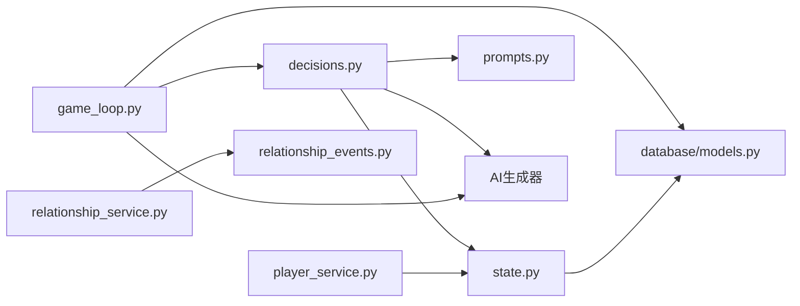

# 决策机制系统

<cite>
**本文档引用的文件**
- [src/game/decisions.py](file://src/game/decisions.py)
- [src/game/state.py](file://src/game/state.py)
- [src/mcp/relationship_service.py](file://src/mcp/relationship_service.py)
- [src/game/player_service.py](file://src/game/player_service.py)
- [src/database/models.py](file://src/database/models.py)
- [src/game/relationship_events.py](file://src/game/relationship_events.py)
- [config/prompts.py](file://config/prompts.py)
- [src/game/game_loop.py](file://src/game/game_loop.py)
- [src/ai/models.py](file://src/ai/models.py)
- [config/settings.py](file://config/settings.py)
</cite>

## 目录
1. [简介](#简介)
2. [项目结构](#项目结构)
3. [核心组件](#核心组件)
4. [架构总览](#架构总览)
5. [详细组件分析](#详细组件分析)
6. [依赖关系分析](#依赖关系分析)
7. [性能考量](#性能考量)
8. [故障排查指南](#故障排查指南)
9. [结论](#结论)
10. [附录](#附录)

## 简介
本文件系统性阐述决策机制系统的设计与实现，重点说明玩家决策如何影响游戏进程与角色发展，涵盖决策数据结构、选项效果映射、资源变化计算、决策历史记录、NPC关系影响机制、故事走向改变方式，以及决策树结构示例与效果计算公式。文档面向开发者与内容创作者，既提供代码级细节，也给出可视化图表帮助理解。

## 项目结构
决策机制系统位于游戏核心模块中，围绕玩家状态(PlayerState)、NPC角色(CharacterState)、决策处理(decisions)、关系事件(RelationshipEvents)与MCP服务(RelationshipMCPService)协同工作。AI生成器负责事件与结果文本，数据库层持久化状态与决策记录。

**图表来源**
- [src/game/decisions.py](file://src/game/decisions.py#L1-L270)
- [src/game/state.py](file://src/game/state.py#L244-L709)
- [src/mcp/relationship_service.py](file://src/mcp/relationship_service.py#L45-L520)
- [src/game/relationship_events.py](file://src/game/relationship_events.py#L18-L354)
- [config/prompts.py](file://config/prompts.py#L674-L800)
- [src/ai/models.py](file://src/ai/models.py#L7-L27)
- [src/database/models.py](file://src/database/models.py#L97-L127)
- [config/settings.py](file://config/settings.py#L30-L100)

**章节来源**
- [src/game/decisions.py](file://src/game/decisions.py#L1-L270)
- [src/game/state.py](file://src/game/state.py#L1-L709)
- [src/mcp/relationship_service.py](file://src/mcp/relationship_service.py#L1-L520)
- [src/game/relationship_events.py](file://src/game/relationship_events.py#L1-L354)
- [config/prompts.py](file://config/prompts.py#L1-L800)
- [src/ai/models.py](file://src/ai/models.py#L1-L27)
- [src/database/models.py](file://src/database/models.py#L1-L171)
- [config/settings.py](file://config/settings.py#L1-L100)

## 核心组件
- 决策处理模块(decisions.py)：解析选项效果、计算角色属性变化、应用资源变化、生成结果文本、记录决策历史。
- 状态管理模块(state.py)：定义PlayerState与CharacterState的数据结构与边界校验，提供资源更新、角色关系更新、互动记录、事件触发检查等方法。
- 关系事件定义与MCP服务：relationship_events.py定义15种关系事件；relationship_service.py实现事件检测、触发条件判断、状态变更与上下文生成。
- AI提示与模型：prompts.py提供事件生成与结果生成的提示词模板；ai/models.py定义事件与选项的数据模型。
- 数据持久化：database/models.py定义数据库表结构，支持游戏状态、决策记录、结局等持久化。
- 全局配置：settings.py集中管理游戏常量、衰减参数、数据库连接等。

**章节来源**
- [src/game/decisions.py](file://src/game/decisions.py#L13-L270)
- [src/game/state.py](file://src/game/state.py#L12-L709)
- [src/mcp/relationship_service.py](file://src/mcp/relationship_service.py#L45-L520)
- [src/game/relationship_events.py](file://src/game/relationship_events.py#L18-L354)
- [config/prompts.py](file://config/prompts.py#L674-L800)
- [src/ai/models.py](file://src/ai/models.py#L7-L27)
- [src/database/models.py](file://src/database/models.py#L97-L127)
- [config/settings.py](file://config/settings.py#L30-L100)

## 架构总览
决策流程从生成事件开始，玩家选择后进入决策处理，更新玩家与NPC状态，触发关系事件，生成结果文本，并持久化决策记录。AI提示词贯穿事件生成与结果生成，确保叙事一致性与时代背景适配。

**图表来源**
- [src/game/game_loop.py](file://src/game/game_loop.py#L257-L299)
- [src/game/decisions.py](file://src/game/decisions.py#L134-L239)
- [src/mcp/relationship_service.py](file://src/mcp/relationship_service.py#L330-L387)
- [src/database/models.py](file://src/database/models.py#L97-L127)

## 详细组件分析

### 决策数据结构与效果映射
- 选项模型(EventOption)：包含选项文本与effects字典，effects支持能量、情绪、知识、财富、关系等资源变化，以及角色详细效果映射。
- 事件模型(GameEvent)：包含事件描述与多个选项，用于UI展示与AI生成。
- 效果映射规则：
  - 资源变化：直接累加到PlayerState对应字段，受最小/最大边界约束。
  - 关系变化：从effects["relationships"]提取{name: change}，映射为角色亲密度变化，再按正负向推导信任、尊重、情绪变化。
  - 角色详细效果：effects["character_effects"]覆盖或补充上述映射，确保复杂交互的精确控制。

**图表来源**
- [src/ai/models.py](file://src/ai/models.py#L7-L27)
- [src/game/decisions.py](file://src/game/decisions.py#L13-L106)

**章节来源**
- [src/ai/models.py](file://src/ai/models.py#L7-L27)
- [src/game/decisions.py](file://src/game/decisions.py#L13-L106)

### 资源变化计算与边界校验
- PlayerState.update：统一处理资源变化，使用边界校验确保数值合法。
- 边界规则：
  - 能量、情绪、知识：0-100
  - 财富：≥0（无上限）
  - 关系值：0-100
- 衰减机制：每周当资源低于阈值时进行衰减，模拟现实压力与疲劳。

**图表来源**
- [src/game/state.py](file://src/game/state.py#L372-L409)
- [src/game/state.py](file://src/game/state.py#L531-L551)

**章节来源**
- [src/game/state.py](file://src/game/state.py#L372-L409)
- [src/game/state.py](file://src/game/state.py#L531-L551)
- [config/settings.py](file://config/settings.py#L64-L66)

### 角色属性变化与事件触发
- 角色属性：亲密度(affinity)、信任(trust)、尊重(respect)、情绪(mood)、互动次数、关系历史等。
- 关系事件触发：基于CharacterState.event_triggers阈值与当前属性，检查是否满足事件条件。
- MCP服务：根据时代背景适配事件名称与描述，检测并标记事件触发，应用状态变更。

**图表来源**
- [src/game/state.py](file://src/game/state.py#L12-L120)
- [src/mcp/relationship_service.py](file://src/mcp/relationship_service.py#L45-L387)
- [src/game/relationship_events.py](file://src/game/relationship_events.py#L18-L91)

**章节来源**
- [src/game/state.py](file://src/game/state.py#L12-L120)
- [src/mcp/relationship_service.py](file://src/mcp/relationship_service.py#L146-L238)
- [src/game/relationship_events.py](file://src/game/relationship_events.py#L18-L91)

### 决策历史记录与查询
- 决策历史结构：包含周数、事件描述、选择文本、应用效果、角色效果映射。
- 查询方法：
  - 按周筛选：遍历decision_history按week字段过滤。
  - 按人物筛选：遍历character_effects字段查找涉及特定角色。
  - 按效果类型筛选：根据effects或character_effects中的键过滤。
- 数据库持久化：Decisions表存储每条决策的事件描述、选择文本、效果JSON与创建时间。

**图表来源**
- [src/database/models.py](file://src/database/models.py#L97-L127)

**章节来源**
- [src/game/decisions.py](file://src/game/decisions.py#L197-L209)
- [src/database/models.py](file://src/database/models.py#L97-L127)

### 决策对NPC关系的影响机制
- 亲密度变化：从relationships映射到affinity，正向互动提升信任与尊重，负向互动降低。
- 情绪联动：角色情绪受互动影响，进而影响后续互动质量。
- 事件驱动：达到阈值后触发关系事件，如“恋爱萌芽”、“结拜”、“背叛”等，改变角色状态与关系历史。
- 时代适配：MCP服务根据时代背景调整事件名称与描述，确保叙事一致性。

**图表来源**
- [src/game/decisions.py](file://src/game/decisions.py#L168-L189)
- [src/game/player_service.py](file://src/game/player_service.py#L56-L103)
- [src/mcp/relationship_service.py](file://src/mcp/relationship_service.py#L330-L428)

**章节来源**
- [src/game/decisions.py](file://src/game/decisions.py#L168-L189)
- [src/game/player_service.py](file://src/game/player_service.py#L56-L103)
- [src/mcp/relationship_service.py](file://src/mcp/relationship_service.py#L330-L428)

### 效果计算公式与扩展方法
- 资源变化公式：new_value = clamp(old_value ± delta, min, max)
- 关系变化公式：
  - 正向：trust = aff//3，respect = aff//4，mood = aff//2
  - 负向：trust = aff//2，respect = aff//3，mood = aff
- 扩展方法：
  - 在effects中添加角色详细效果，覆盖默认映射。
  - 在PlayerState.update中增加新的资源类型。
  - 在RelationshipEventDef中新增事件类型与阈值。
  - 在MCP服务中扩展时代适配与优先级策略。

**章节来源**
- [src/game/decisions.py](file://src/game/decisions.py#L13-L59)
- [src/game/state.py](file://src/game/state.py#L372-L409)
- [src/game/relationship_events.py](file://src/game/relationship_events.py#L95-L338)

### 决策树结构示例与分支逻辑
- 决策树节点：事件描述为根节点，每个选项为分支，分支效果决定后续状态与可选路径。
- 分支条件：资源阈值、关系阈值、时代背景、角色状态等。
- 示例结构（概念图）：

[此图为概念示意，不直接映射具体源码文件]

## 依赖关系分析
- 模块耦合：
  - decisions依赖state与prompts，间接依赖AI生成器。
  - player_service封装复杂业务逻辑，被state与decisions调用。
  - relationship_service依赖relationship_events与state。
  - game_loop协调AI生成、决策处理与持久化。
- 外部依赖：
  - OpenAI API用于事件与结果生成。
  - SQLAlchemy用于数据库访问。
  - Pydantic用于数据模型与校验。

**图表来源**
- [src/game/decisions.py](file://src/game/decisions.py#L1-L8)
- [src/game/state.py](file://src/game/state.py#L1-L7)
- [src/mcp/relationship_service.py](file://src/mcp/relationship_service.py#L9-L15)
- [src/game/relationship_events.py](file://src/game/relationship_events.py#L5-L7)
- [src/game/game_loop.py](file://src/game/game_loop.py#L8-L18)
- [src/database/models.py](file://src/database/models.py#L3-L6)

**章节来源**
- [src/game/decisions.py](file://src/game/decisions.py#L1-L8)
- [src/game/state.py](file://src/game/state.py#L1-L7)
- [src/mcp/relationship_service.py](file://src/mcp/relationship_service.py#L9-L15)
- [src/game/relationship_events.py](file://src/game/relationship_events.py#L5-L7)
- [src/game/game_loop.py](file://src/game/game_loop.py#L8-L18)
- [src/database/models.py](file://src/database/models.py#L3-L6)

## 性能考量
- AI生成成本：事件与结果生成依赖外部API，建议启用缓存与流式回调减少等待。
- 状态更新批量化：批量应用资源变化与关系同步，避免频繁I/O。
- 事件检测优化：MCP服务按类别分组检测，限制返回数量，降低复杂度。
- 数据库写入：决策与状态写入采用事务化操作，保证一致性与性能平衡。

[本节为通用指导，不直接分析具体文件]

## 故障排查指南
- 状态越界：检查PlayerState.validate与边界裁剪逻辑，确认资源变化是否超出范围。
- AI生成失败：捕获异常并回退到简单事件，同时记录日志便于调试。
- 关系事件未触发：核对阈值配置与当前属性，确认事件类型与条件匹配。
- 数据持久化异常：检查数据库连接配置与表结构，确保JSON字段正确序列化。

**章节来源**
- [src/game/state.py](file://src/game/state.py#L531-L551)
- [src/game/game_loop.py](file://src/game/game_loop.py#L245-L255)
- [src/mcp/relationship_service.py](file://src/mcp/relationship_service.py#L146-L238)
- [src/database/models.py](file://src/database/models.py#L146-L171)

## 结论
决策机制系统通过清晰的数据结构、严格的边界校验与灵活的关系事件体系，实现了玩家选择对游戏进程与角色发展的深度影响。结合AI提示词与MCP服务，系统能够在保持叙事一致性的同时，提供丰富的分支与回响。开发者可通过扩展效果映射、事件类型与阈值配置，进一步丰富故事走向与角色关系的复杂度。

## 附录
- 提示词模板：事件生成与结果生成的提示词结构，支持时代背景与角色上下文注入。
- 多轮系统：每周多轮事件生成与总结，增强叙事连续性与沉浸感。
- 世界模型：与Established Facts共同维护世界一致性，避免冲突。

**章节来源**
- [config/prompts.py](file://config/prompts.py#L674-L800)
- [src/game/game_loop.py](file://src/game/game_loop.py#L665-L778)
- [src/game/state.py](file://src/game/state.py#L334-L351)