# 叙事管理系统

<cite>
**本文档引用的文件**
- [src/game/narrative_manager.py](file://src/game/narrative_manager.py)
- [src/game/story_service.py](file://src/game/story_service.py)
- [src/game/weekly_summary.py](file://src/game/weekly_summary.py)
- [src/game/yearly_summary.py](file://src/game/yearly_summary.py)
- [src/game/monthly_summary.py](file://src/game/monthly_summary.py)
- [src/game/state.py](file://src/game/state.py)
- [src/ai/generator.py](file://src/ai/generator.py)
- [src/ai/story_generator.py](file://src/ai/story_generator.py)
- [src/ai/summary_generator.py](file://src/ai/summary_generator.py)
- [src/ai/system_prompts.py](file://src/ai/system_prompts.py)
- [src/game/game_loop.py](file://src/game/game_loop.py)
- [src/game/world_model_updater.py](file://src/game/world_model_updater.py)
- [src/game/historical_summary_selector.py](file://src/game/historical_summary_selector.py)
- [config/prompts.py](file://config/prompts.py)
- [src/database/models.py](file://src/database/models.py)
</cite>

## 目录
1. [简介](#简介)
2. [项目结构](#项目结构)
3. [核心组件](#核心组件)
4. [架构总览](#架构总览)
5. [详细组件分析](#详细组件分析)
6. [依赖关系分析](#依赖关系分析)
7. [性能考量](#性能考量)
8. [故障排除指南](#故障排除指南)
9. [结论](#结论)
10. [附录](#附录)

## 简介
本文件系统性阐述叙事管理系统的架构与实现，重点覆盖以下方面：
- 故事历史记录的数据结构与演进机制（每周/每月/年度总结）
- 多轮叙事的连续性维护（上下文构建、强制续写、承上启下）
- 叙事种子与伏笔回响系统（激活概率、隐蔽度、回收方式）
- AI上下文构建方法与提示词工程
- 世界模型与一致性约束
- 服务化模块与可扩展性设计

该系统通过“两阶段流水线”（先生成故事文本，再生成选项）与“压缩-评估-更新”的闭环，确保叙事的连贯性、可玩性与可维护性。

## 项目结构
项目采用按功能域划分的模块化组织，核心目录与职责如下：
- src/ai：AI调用抽象与各子服务（故事生成、选项生成、压缩、重写、摘要生成）
- src/game：游戏循环、状态管理、叙事管理、总结生成、世界模型更新、历史摘要选择
- config：提示词模板、系统提示注册表、全局设置
- src/database：持久化模型（用户、游戏会话、状态快照、决策、结局）

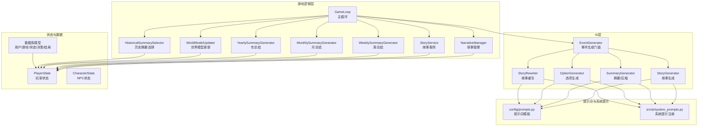

图表来源
- [src/ai/generator.py](file://src/ai/generator.py#L30-L66)
- [src/ai/story_generator.py](file://src/ai/story_generator.py#L24-L52)
- [src/ai/summary_generator.py](file://src/ai/summary_generator.py#L17-L22)
- [src/game/game_loop.py](file://src/game/game_loop.py#L23-L60)
- [src/game/narrative_manager.py](file://src/game/narrative_manager.py#L15-L18)
- [src/game/state.py](file://src/game/state.py#L244-L364)
- [config/prompts.py](file://config/prompts.py#L674-L712)
- [src/ai/system_prompts.py](file://src/ai/system_prompts.py#L196-L226)
- [src/database/models.py](file://src/database/models.py#L11-L171)

章节来源
- [src/ai/generator.py](file://src/ai/generator.py#L30-L66)
- [src/game/game_loop.py](file://src/game/game_loop.py#L23-L60)
- [src/game/state.py](file://src/game/state.py#L244-L364)
- [config/prompts.py](file://config/prompts.py#L674-L712)
- [src/ai/system_prompts.py](file://src/ai/system_prompts.py#L196-L226)
- [src/database/models.py](file://src/database/models.py#L11-L171)

## 核心组件
- 事件生成门面（EventGenerator）：统一调度故事生成、选项生成、摘要生成、重写等子服务，提供向后兼容接口。
- 故事生成器（StoryGenerator）：构造完整提示词，调用LLM生成故事文本，再委托选项生成器生成选项。
- 摘要生成器（SummaryGenerator）：将完整故事压缩为100字左右摘要，同时产出剧情线更新、世界事实更新、伏笔种子、习惯变更等结构化数据。
- 叙事管理器（NarrativeManager）：维护未完结剧情线、世界事实、伏笔种子、角色习惯；负责种子激活概率计算与清理。
- 状态管理（PlayerState/CharacterState）：承载玩家与NPC的动态状态、历史记录、叙事种子、世界模型等。
- 历史摘要选择器（HistoricalSummarySelector）：基于关键词相关性选择最相关的周/年总结注入上下文。
- 世界模型更新器（WorldModelUpdater）：维护角色位置、职业、承诺、因果链等结构性世界数据。
- 总结生成器（Weekly/Monthly/Yearly）：生成周/月/年总结文本，提供AI与回退方案。

章节来源
- [src/ai/generator.py](file://src/ai/generator.py#L30-L66)
- [src/ai/story_generator.py](file://src/ai/story_generator.py#L24-L52)
- [src/ai/summary_generator.py](file://src/ai/summary_generator.py#L17-L22)
- [src/game/narrative_manager.py](file://src/game/narrative_manager.py#L15-L18)
- [src/game/state.py](file://src/game/state.py#L244-L364)
- [src/game/historical_summary_selector.py](file://src/game/historical_summary_selector.py#L14-L153)
- [src/game/world_model_updater.py](file://src/game/world_model_updater.py#L14-L196)
- [src/game/weekly_summary.py](file://src/game/weekly_summary.py#L10-L63)
- [src/game/monthly_summary.py](file://src/game/monthly_summary.py#L10-L69)
- [src/game/yearly_summary.py](file://src/game/yearly_summary.py#L10-L82)

## 架构总览
系统采用“门面+子服务”的分层设计，围绕PlayerState构建上下文，通过提示词模板与系统提示保证一致性与可缓存性。核心流程包括：
- 事件生成：门面构造上下文→故事生成→选项生成→质量校验→缓存
- 压缩评估：故事压缩→产出结构化更新→驱动叙事管理器与世界模型更新
- 总结生成：周/月/年总结分别注入不同粒度的历史上下文
- 连续性保障：强制续写、承上启下、伏笔回响、世界事实约束

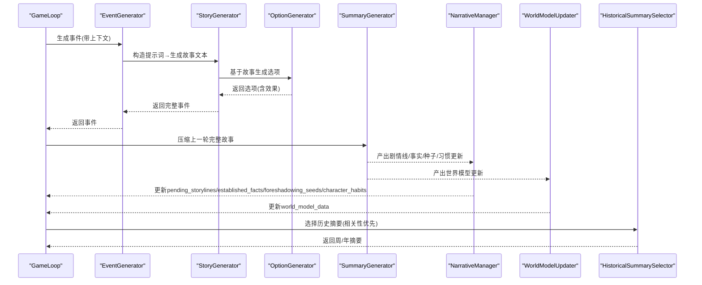

图表来源
- [src/game/game_loop.py](file://src/game/game_loop.py#L153-L200)
- [src/ai/generator.py](file://src/ai/generator.py#L183-L238)
- [src/ai/story_generator.py](file://src/ai/story_generator.py#L32-L175)
- [src/ai/summary_generator.py](file://src/ai/summary_generator.py#L25-L140)
- [src/game/narrative_manager.py](file://src/game/narrative_manager.py#L22-L95)
- [src/game/world_model_updater.py](file://src/game/world_model_updater.py#L21-L135)
- [src/game/historical_summary_selector.py](file://src/game/historical_summary_selector.py#L17-L153)

## 详细组件分析

### 叙事管理器（NarrativeManager）
负责三类叙事要素的生命周期管理：
- 未完结剧情线（pending_storylines）：新增、解决、延续、过期清理
- 世界事实（established_facts）：新增/更新/删除，上限控制
- 伏笔种子（foreshadowing_seeds）：新增、激活概率计算、回收方式、权重排序、过期清理
- 角色习惯（character_habits）：新建/强化/弱化/移除/变更，按强度与时间排序限制

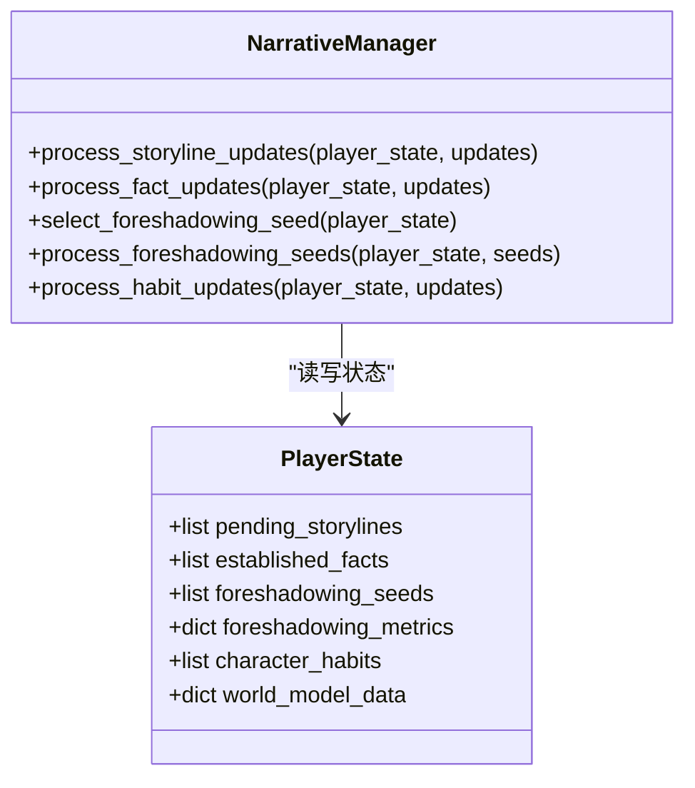

图表来源
- [src/game/narrative_manager.py](file://src/game/narrative_manager.py#L15-L584)
- [src/game/state.py](file://src/game/state.py#L299-L364)

章节来源
- [src/game/narrative_manager.py](file://src/game/narrative_manager.py#L22-L95)
- [src/game/narrative_manager.py](file://src/game/narrative_manager.py#L101-L182)
- [src/game/narrative_manager.py](file://src/game/narrative_manager.py#L187-L285)
- [src/game/narrative_manager.py](file://src/game/narrative_manager.py#L291-L414)
- [src/game/narrative_manager.py](file://src/game/narrative_manager.py#L420-L583)

### 伏笔回响与种子系统
- 激活概率：基于成熟度、隐蔽度、权重、上下文匹配（活跃角色/剧情关键词）进行概率修正，再叠加衰减
- 回收方式：revelation/confirmation/ironic_twist/escalation/echo，指导如何在新故事中自然回响
- 生命周期：最多保留20个未激活种子，超过期限自动清理，激活后短期保留以便统计恢复距离

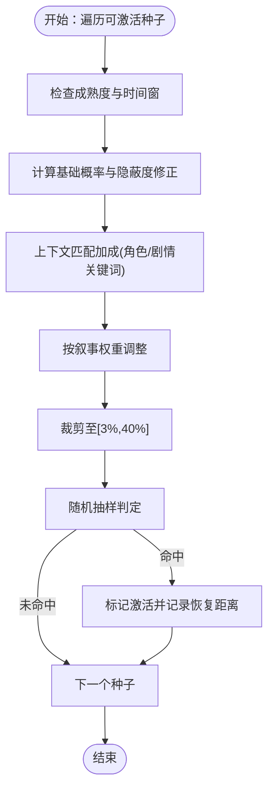

图表来源
- [src/game/narrative_manager.py](file://src/game/narrative_manager.py#L187-L285)

章节来源
- [src/game/narrative_manager.py](file://src/game/narrative_manager.py#L187-L285)

### 故事压缩与结构化更新
- 输入：完整故事文本 + 玩家选择
- 输出：摘要 + 结构化更新（剧情线/事实/种子/习惯）
- 机制：提示词引导AI产出JSON，解析失败时进行摘要抽取与回退

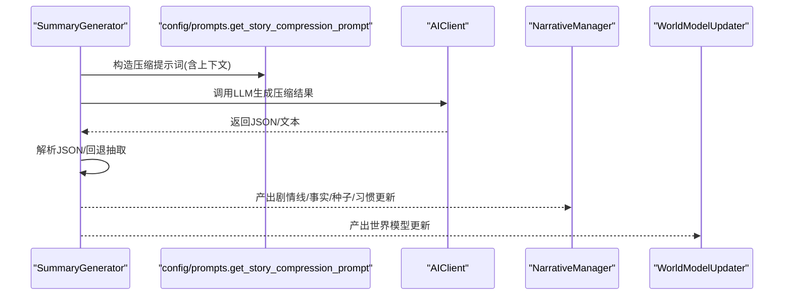

图表来源
- [src/ai/summary_generator.py](file://src/ai/summary_generator.py#L25-L140)
- [config/prompts.py](file://config/prompts.py#L674-L712)

章节来源
- [src/ai/summary_generator.py](file://src/ai/summary_generator.py#L25-L140)

### 多轮叙事连续性维护
- 强制续写：若上一轮事件未完结，必须围绕上一轮“选择后的发展”继续
- 承上启下：若已完结，新故事仍需承接上一轮世界状态与人物记忆
- 上下文构建：包含上一轮完整故事、日期信息、可用人物、未完结剧情线、世界事实、世界模型、角色习惯、伏笔回响等

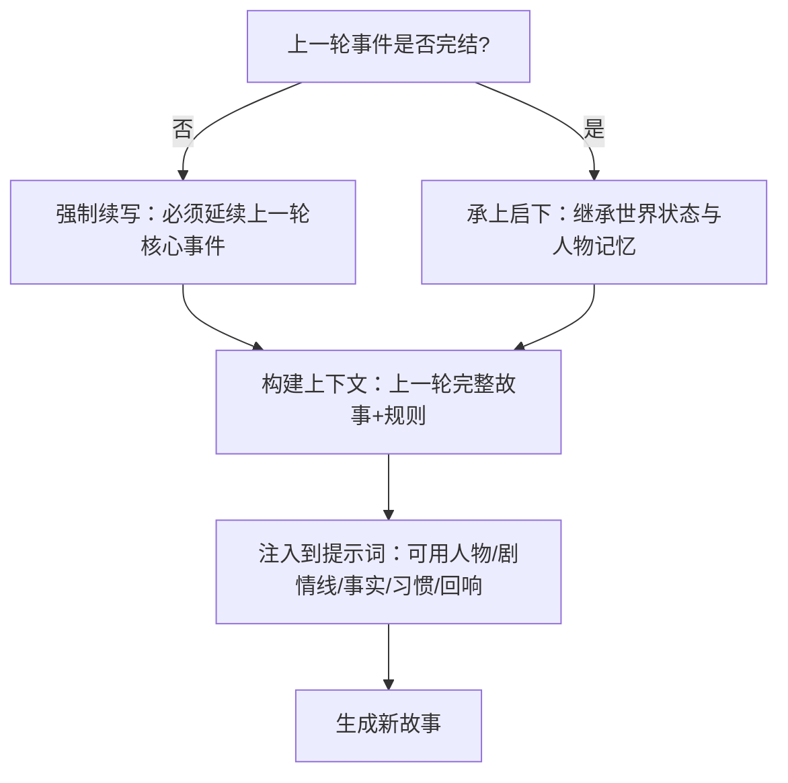

图表来源
- [config/prompts.py](file://config/prompts.py#L172-L273)

章节来源
- [config/prompts.py](file://config/prompts.py#L172-L273)

### 周/月/年总结生成
- 周总结：计算属性变化，结合决策数量与当前状态生成50-100字总结
- 月总结：扩展到月度变化与关键决策，80-150字
- 年总结：汇总年内变化、关键决策、月度亮点，150-250字

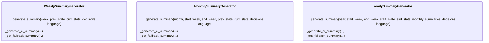

图表来源
- [src/game/weekly_summary.py](file://src/game/weekly_summary.py#L10-L63)
- [src/game/monthly_summary.py](file://src/game/monthly_summary.py#L10-L69)
- [src/game/yearly_summary.py](file://src/game/yearly_summary.py#L10-L82)

章节来源
- [src/game/weekly_summary.py](file://src/game/weekly_summary.py#L24-L63)
- [src/game/monthly_summary.py](file://src/game/monthly_summary.py#L24-L69)
- [src/game/yearly_summary.py](file://src/game/yearly_summary.py#L24-L82)

### 世界模型与一致性约束
- 世界模型数据：角色位置、职业轨迹、承诺、因果链、身体状态、动态事实、角色画像
- 更新机制：位置移动/确认、职业晋升/变更、承诺达成/破裂/过期、因果链推进
- 一致性校验：通过系统提示与约束文本，确保故事与世界模型一致

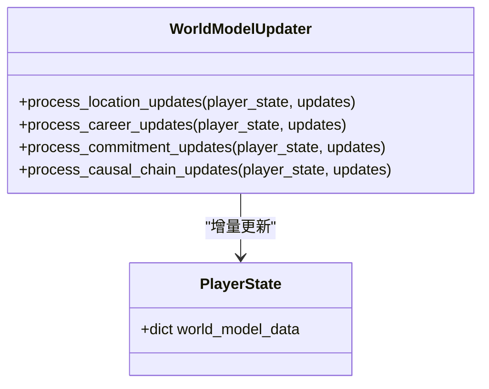

图表来源
- [src/game/world_model_updater.py](file://src/game/world_model_updater.py#L14-L196)
- [src/game/state.py](file://src/game/state.py#L334-L351)

章节来源
- [src/game/world_model_updater.py](file://src/game/world_model_updater.py#L21-L196)
- [src/game/state.py](file://src/game/state.py#L334-L351)

### 历史摘要选择策略
- 相关性优先：从未完结剧情线、活跃承诺、上一轮故事人物名、激活种子中提取关键词，计算与历史摘要的命中数与时间衰减得分
- 随机回退：无关键词时按时间衰减概率随机选择

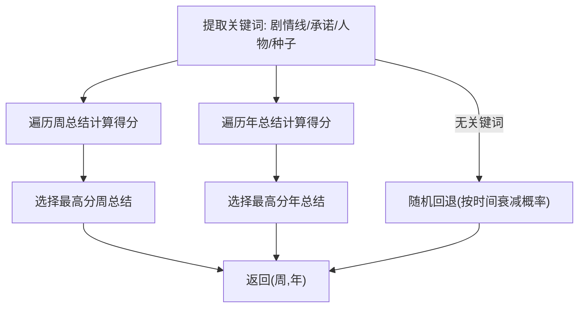

图表来源
- [src/game/historical_summary_selector.py](file://src/game/historical_summary_selector.py#L17-L153)

章节来源
- [src/game/historical_summary_selector.py](file://src/game/historical_summary_selector.py#L17-L153)

### 故事服务与AI上下文构建
- 故事服务：生成故事续写、压缩故事、生成自定义选择的效果与结果
- 上下文构建：角色设定、时间信息、可用人物、未完结剧情线、世界事实、世界模型、角色习惯、上一轮故事、伏笔回响、四周期/年总结

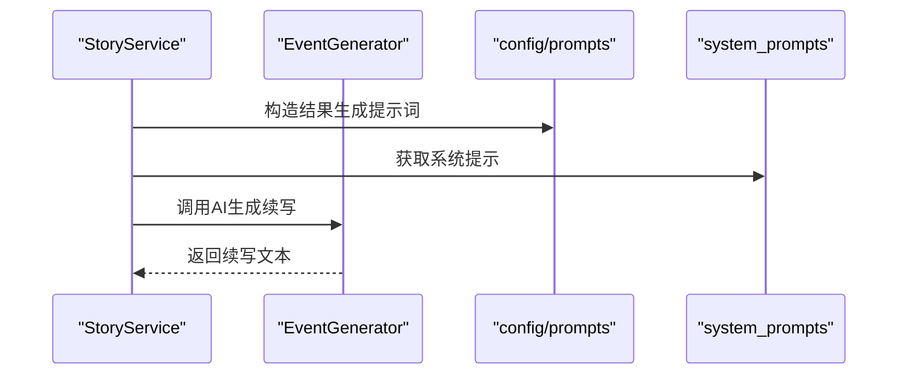

图表来源
- [src/game/story_service.py](file://src/game/story_service.py#L18-L74)
- [config/prompts.py](file://config/prompts.py#L674-L712)
- [src/ai/system_prompts.py](file://src/ai/system_prompts.py#L211-L226)

章节来源
- [src/game/story_service.py](file://src/game/story_service.py#L18-L133)
- [config/prompts.py](file://config/prompts.py#L674-L712)
- [src/ai/system_prompts.py](file://src/ai/system_prompts.py#L211-L226)

## 依赖关系分析
- 模块耦合
  - GameLoop依赖EventGenerator、NarrativeManager、WorldModelUpdater、HistoricalSummarySelector、StoryService、YearlySummaryGenerator
  - EventGenerator聚合StoryGenerator、OptionGenerator、SummaryGenerator、StoryRewriter
  - StoryGenerator依赖config.prompts与system_prompts
  - NarrativeManager/WorldModelUpdater/SummaryGenerator依赖PlayerState
- 外部依赖
  - AIClient封装LLM调用，支持流式回调与重试
  - 数据库模型支撑存档与回放

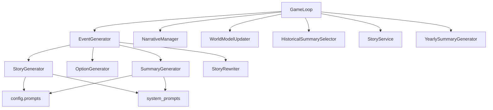

图表来源
- [src/game/game_loop.py](file://src/game/game_loop.py#L23-L60)
- [src/ai/generator.py](file://src/ai/generator.py#L30-L66)
- [src/ai/story_generator.py](file://src/ai/story_generator.py#L24-L52)
- [src/ai/summary_generator.py](file://src/ai/summary_generator.py#L17-L22)
- [config/prompts.py](file://config/prompts.py#L674-L712)
- [src/ai/system_prompts.py](file://src/ai/system_prompts.py#L196-L226)

章节来源
- [src/game/game_loop.py](file://src/game/game_loop.py#L23-L60)
- [src/ai/generator.py](file://src/ai/generator.py#L30-L66)

## 性能考量
- 上下文长度控制：强制续写与承上启下时对上一轮故事进行截断，避免超长输入
- 缓存策略：EventGenerator支持事件缓存，减少重复生成成本
- 令牌预算：各生成器设置max_tokens与温度参数，平衡质量与成本
- 降级回退：总结与压缩失败时采用回退策略，保证流程可用性
- 限流与重试：AIClient支持重试与错误反馈，提升鲁棒性

## 故障排除指南
- 事件生成失败
  - 现象：生成异常或JSON解析失败
  - 处理：启用重试与错误反馈，必要时回退到缓存或固定模板
  - 参考路径：[src/ai/story_generator.py](file://src/ai/story_generator.py#L105-L175)
- 压缩失败
  - 现象：无法解析JSON或缺少字段
  - 处理：尝试摘要抽取回退，或截断故事作为最终回退
  - 参考路径：[src/ai/summary_generator.py](file://src/ai/summary_generator.py#L61-L140)
- 伏笔激活率异常
  - 现象：激活概率过高/过低或无激活
  - 处理：检查隐蔽度、权重、上下文匹配与时间窗设置
  - 参考路径：[src/game/narrative_manager.py](file://src/game/narrative_manager.py#L187-L285)
- 世界模型不一致
  - 现象：故事与位置/职业/承诺冲突
  - 处理：启用一致性校验，修正世界模型或故事
  - 参考路径：[src/game/world_model_updater.py](file://src/game/world_model_updater.py#L21-L196)

章节来源
- [src/ai/story_generator.py](file://src/ai/story_generator.py#L105-L175)
- [src/ai/summary_generator.py](file://src/ai/summary_generator.py#L61-L140)
- [src/game/narrative_manager.py](file://src/game/narrative_manager.py#L187-L285)
- [src/game/world_model_updater.py](file://src/game/world_model_updater.py#L21-L196)

## 结论
本系统通过“事件生成—压缩评估—历史注入—连续性保障—总结沉淀”的闭环，实现了高连贯性与可扩展的叙事管理。NarrativeManager与WorldModelUpdater确保长期一致性，伏笔回响系统增强可玩性与深度，而分层的AI服务与提示词工程提供了稳定的可维护性与可扩展性。

## 附录
- 开发者最佳实践
  - 严格遵循提示词模板与系统提示，确保KV缓存命中与行为一致性
  - 在生成故事时优先从上一轮完整故事中提取关键信息，避免“失忆式”断裂
  - 控制上下文长度，必要时使用历史摘要选择器进行相关性注入
  - 对压缩结果进行结构化解析，失败时采用回退策略
  - 定期清理过期剧情线与种子，维持系统健康度