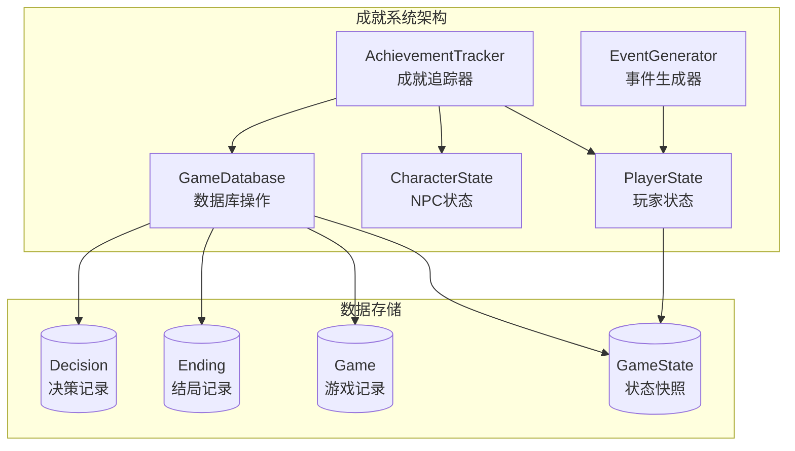
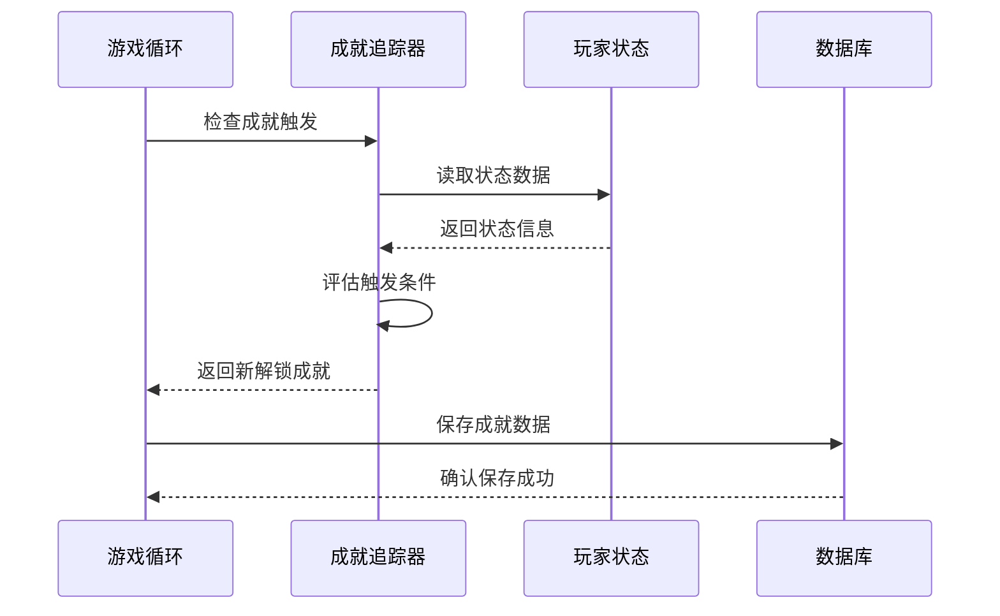
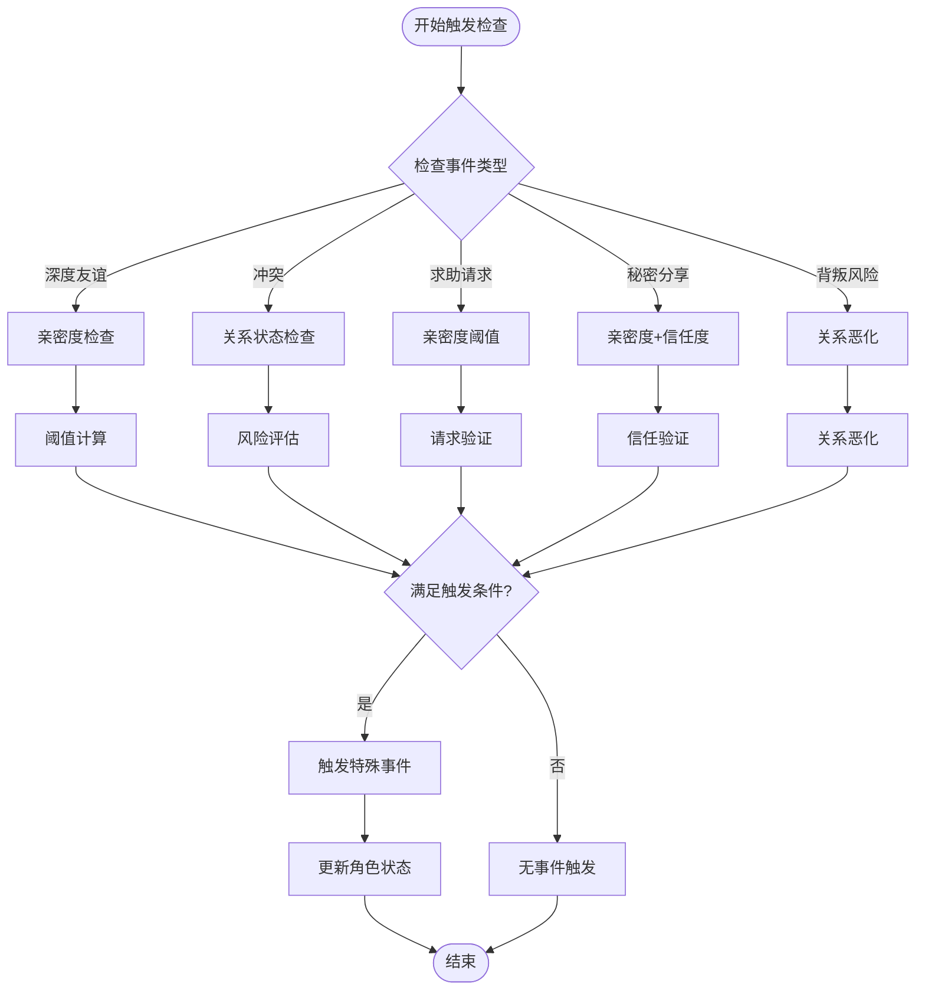
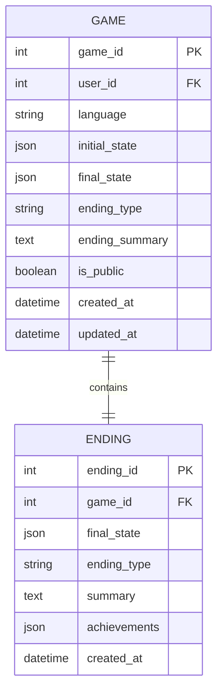
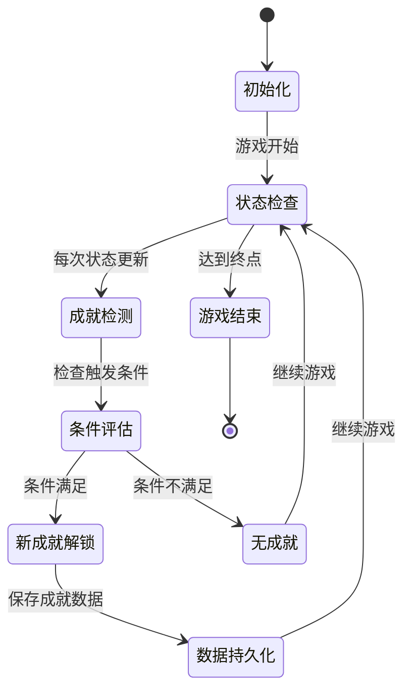
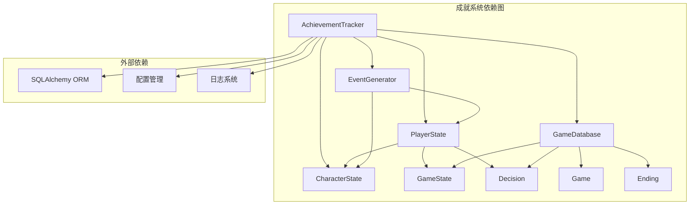

# 成就系统

<cite>
**本文引用的文件**
- [成就系统实现](file://src/game/achievements.py)
- [游戏状态模型](file://src/game/state.py)
- [玩家服务](file://src/game/player_service.py)
- [数据库模型](file://src/database/models.py)
- [数据库操作](file://src/database/db.py)
- [游戏循环](file://src/game/game_loop.py)
- [决策处理](file://src/game/decisions.py)
- [事件预设](file://data/presets/events.json)
- [事件缓存](file://data/cache/events_cache.json)
- [配置设置](file://config/settings.py)
</cite>

## 目录
1. [简介](#简介)
2. [项目结构](#项目结构)
3. [核心组件](#核心组件)
4. [架构概览](#架构概览)
5. [详细组件分析](#详细组件分析)
6. [依赖关系分析](#依赖关系分析)
7. [性能考虑](#性能考虑)
8. [故障排除指南](#故障排除指南)
9. [结论](#结论)
10. [附录](#附录)

## 简介
成就系统是游戏的核心激励机制，通过触发条件和奖励机制驱动玩家行为，增强游戏体验和可玩性。本系统实现了多层次的成就分类，包括财富成就、知识成就、关系成就、决策成就和完美状态成就，为玩家提供明确的目标导向和成就感。

## 项目结构
成就系统位于游戏模块的核心位置，与状态管理、数据库持久化和AI事件生成紧密集成：



**图表来源**
- [成就系统实现](file://src/game/achievements.py#L6-L85)
- [游戏状态模型](file://src/game/state.py#L244-L709)
- [数据库模型](file://src/database/models.py#L61-L127)

## 核心组件
成就系统由四个主要组件构成，每个组件承担特定职责并协同工作：

### 成就追踪器 (AchievementTracker)
负责监控玩家状态并检测成就触发条件，采用即时检查机制确保实时响应玩家行为变化。

### 玩家状态管理 (PlayerState)
维护玩家的完整状态信息，包括资源属性、关系网络、决策历史和时间进度，为成就检测提供数据基础。

### 数据持久化 (GameDatabase)
处理成就数据的存储和检索，支持游戏进度的保存、加载和查询功能。

### 关系事件系统 (Relationship Events)
与NPC关系系统集成，通过特殊事件触发阈值实现动态关系发展和成就解锁。

**章节来源**
- [成就系统实现](file://src/game/achievements.py#L6-L85)
- [游戏状态模型](file://src/game/state.py#L244-L709)
- [数据库模型](file://src/database/models.py#L61-L127)

## 架构概览
成就系统采用分层架构设计，确保职责分离和模块化：



**图表来源**
- [游戏循环](file://src/game/game_loop.py#L23-L90)
- [成就系统实现](file://src/game/achievements.py#L14-L75)
- [数据库操作](file://src/database/db.py#L105-L144)

## 详细组件分析

### 成就类型分类与触发机制

#### 财富成就 (Wealth Achievements)
基于玩家财富积累设定阈值，提供渐进式的财富目标：

| 成就类型 | 触发条件 | 奖励内容 |
|---------|---------|---------|
| 百万富翁 | 财富 ≥ 100,000 | 终身财富成就徽章 |
| 财务自由 | 财富 ≥ 50,000 | 财富自由认证书 |

#### 知识成就 (Knowledge Achievements)
衡量玩家学习成果和智慧增长：

| 成就类型 | 触发条件 | 奖励内容 |
|---------|---------|---------|
| 知识渊博 | 知识 ≥ 90 | 学术声誉徽章 |
| 博学多才 | 知识 ≥ 80 | 知识证书 |

#### 关系成就 (Relationship Achievements)
反映玩家社交能力和人际关系质量：

| 成就类型 | 触发条件 | 奖励内容 |
|---------|---------|---------|
| 社交达人 | 关系数量 ≥ 5 | 社交技能认证 |

#### 决策成就 (Decision Achievements)
基于玩家决策经验和选择质量：

| 成就类型 | 触发条件 | 奖励内容 |
|---------|---------|---------|
| 经验丰富 | 决策数量 ≥ 50 | 决策智慧徽章 |
| 决策者 | 决策数量 ≥ 25 | 决策权威认证 |

#### 完美状态成就 (Perfect State Achievement)
综合评估玩家整体状态平衡：

| 成就类型 | 触发条件 | 奖励内容 |
|---------|---------|---------|
| 完美状态 | 能量 ≥ 80, 情绪 ≥ 80, 知识 ≥ 80 | 完美平衡认证 |

#### 周里程碑成就 (Week Milestone Achievements)
庆祝游戏进度和时间里程碑：

| 成就类型 | 触发条件 | 奖励内容 |
|---------|---------|---------|
| 半程英雄 | 周数 ≥ 50 | 坚持到底奖章 |

**章节来源**
- [成就系统实现](file://src/game/achievements.py#L27-L75)

### 特殊事件触发阈值设定逻辑

成就系统与NPC关系事件深度集成，通过动态阈值实现复杂的行为触发：



**图表来源**
- [玩家服务](file://src/game/player_service.py#L152-L176)
- [游戏状态模型](file://src/game/state.py#L83-L113)

### 成就数据存储格式与查询方法

#### 数据库存储结构
成就数据通过JSON格式存储在数据库中，支持灵活的数据结构和扩展性：



**图表来源**
- [数据库模型](file://src/database/models.py#L61-L127)

#### 查询方法
支持多种查询方式以满足不同场景需求：

1. **实时查询**: 通过AchievementTracker实时检查当前状态
2. **历史查询**: 通过GameDatabase查询历史成就记录
3. **统计查询**: 基于数据库聚合函数进行成就统计分析

**章节来源**
- [数据库模型](file://src/database/models.py#L113-L127)
- [数据库操作](file://src/database/db.py#L105-L144)

### 与游戏进度同步机制

成就系统与游戏进度保持高度同步，通过以下机制确保数据一致性：



**图表来源**
- [成就系统实现](file://src/game/achievements.py#L14-L75)
- [游戏循环](file://src/game/game_loop.py#L300-L350)

### 与NPC关系关联机制

成就系统通过特殊事件触发阈值与NPC关系深度绑定：

#### 关系事件类型
- **深度友谊**: 亲密度≥80且信任度≥70
- **冲突**: 亲密度≤20或信任度≤20  
- **求助请求**: 亲密度≥60
- **秘密分享**: 亲密度≥75且信任度≥65
- **背叛风险**: 亲密度≤15或信任度≤20

#### 触发算法
```python
def check_event_trigger(self, event_type: str) -> bool:
    threshold = self.event_triggers.get(event_type)
    if threshold is None:
        return False
    
    if event_type in ["deep_friendship", "secret_sharing"]:
        return character.affinity >= threshold and character.trust >= threshold - 10
    elif event_type in ["conflict", "betrayal_risk"]:
        return character.affinity <= threshold or character.trust <= threshold
    elif event_type == "help_request":
        return character.affinity >= threshold
```

**章节来源**
- [玩家服务](file://src/game/player_service.py#L152-L176)
- [游戏状态模型](file://src/game/state.py#L83-L113)

### 解锁新游戏内容的机制

成就解锁不仅提供奖励，还能解锁新的游戏内容和功能：

#### 内容解锁流程
1. **成就检测**: 系统检查新解锁的成就
2. **内容映射**: 将成就与可用内容关联
3. **权限授予**: 更新玩家权限状态
4. **内容激活**: 解锁相应的游戏功能

#### 可解锁内容示例
- **特殊事件**: 解锁基于成就的专属事件
- **角色对话**: 解锁新的NPC对话选项
- **隐藏区域**: 解锁之前无法进入的区域
- **特殊物品**: 解锁独特的游戏物品

## 依赖关系分析

成就系统与其他模块存在密切的依赖关系：



**图表来源**
- [成就系统实现](file://src/game/achievements.py#L1-L85)
- [数据库模型](file://src/database/models.py#L1-L171)

**章节来源**
- [成就系统实现](file://src/game/achievements.py#L1-L85)
- [数据库模型](file://src/database/models.py#L1-L171)

## 性能考虑

### 成就检测优化
- **延迟检查**: 在状态变更时才触发成就检测
- **缓存机制**: 缓存已解锁成就避免重复计算
- **批量处理**: 合并多个状态变更后的单一检查

### 数据库性能
- **索引优化**: 为常用查询字段建立索引
- **连接池**: 使用连接池减少数据库连接开销
- **批量操作**: 支持批量保存和查询操作

### 内存管理
- **对象复用**: 复用PlayerState对象避免频繁创建
- **垃圾回收**: 及时清理不再使用的临时对象
- **内存监控**: 监控内存使用情况防止泄漏

## 故障排除指南

### 常见问题及解决方案

#### 成就未正确解锁
1. **检查触发条件**: 确认玩家状态满足成就要求
2. **验证数据完整性**: 检查数据库中是否存在重复或冲突的成就记录
3. **重启游戏**: 重新加载游戏状态以刷新成就状态

#### 成就数据丢失
1. **检查数据库连接**: 确认数据库连接正常
2. **验证事务提交**: 确保成就保存操作已正确提交
3. **查看日志**: 检查错误日志获取具体原因

#### 性能问题
1. **监控数据库查询**: 检查慢查询并优化索引
2. **调整检查频率**: 减少不必要的成就检测
3. **优化状态更新**: 批量处理状态变更

**章节来源**
- [数据库操作](file://src/database/db.py#L285-L321)

## 结论
成就系统通过精心设计的触发机制和奖励体系，为玩家提供了清晰的目标导向和持续的游戏动力。系统采用模块化设计，与游戏其他组件紧密集成，确保了良好的扩展性和维护性。通过合理的阈值设定和数据存储策略，成就系统能够有效提升玩家的游戏体验和参与度。

## 附录

### 开发者配置示例

#### 自定义成就阈值
```python
# 在CharacterState.event_triggers中添加自定义阈值
custom_triggers = {
    "custom_achievement": 75,  # 自定义成就阈值
    "expert_level": 95,       # 专家级成就阈值
}

# 在AchievementTracker中添加对应逻辑
if "custom_achievement" not in self.achievements and condition_met:
    new_achievements.append("自定义成就名称")
    self.achievements.append("custom_achievement")
```

#### 扩展成就类型
1. **定义新成就类别**: 在AchievementTracker中添加新的检查逻辑
2. **配置触发条件**: 设定合理的阈值和条件
3. **设计奖励机制**: 创建相应的奖励内容
4. **测试验证**: 确保成就逻辑正确实现

#### 事件配置示例
```json
{
  "achievement_events": [
    {
      "week": 25,
      "achievement_required": "decisions_25",
      "event_description": "基于你的决策经验，你获得了特殊的机会。",
      "options": [
        {
          "text": "接受挑战",
          "effects": {
            "knowledge": 10,
            "wealth": 5000
          }
        }
      ]
    }
  ]
}
```

**章节来源**
- [事件预设](file://data/presets/events.json#L1-L239)
- [事件缓存](file://data/cache/events_cache.json#L1-L800)