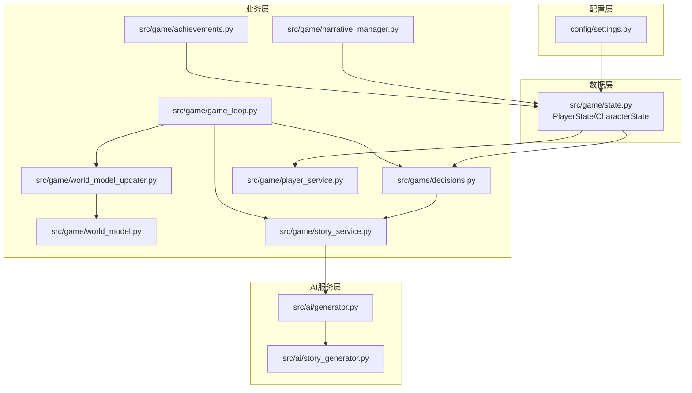
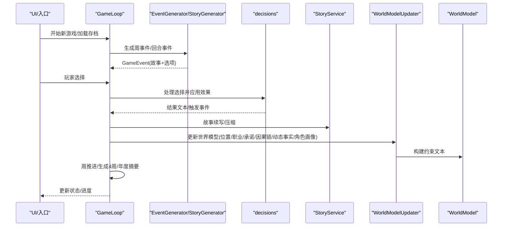
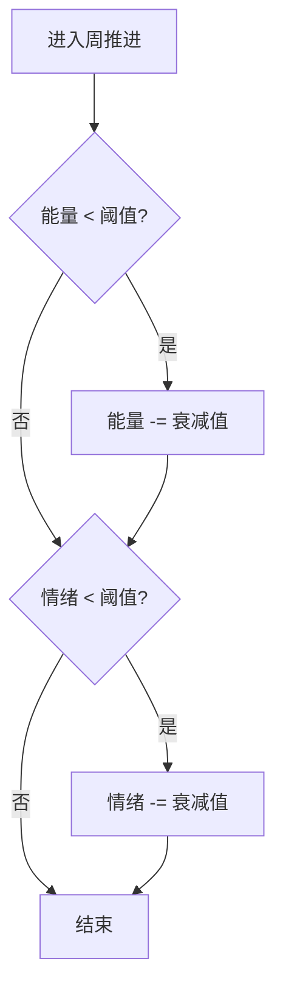
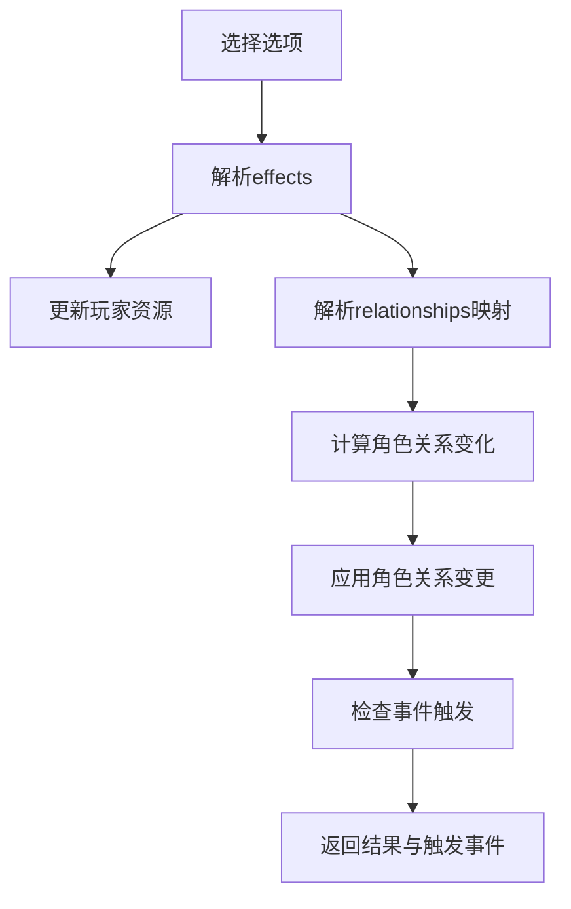
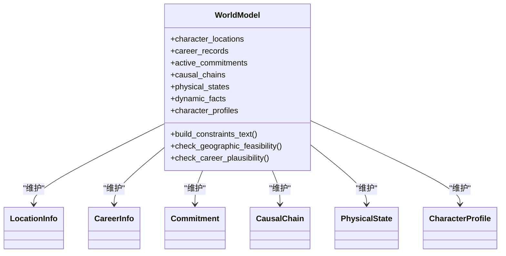
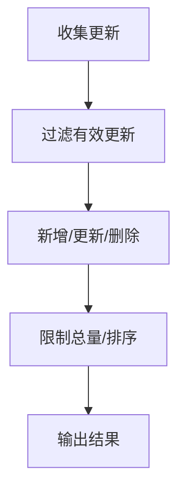
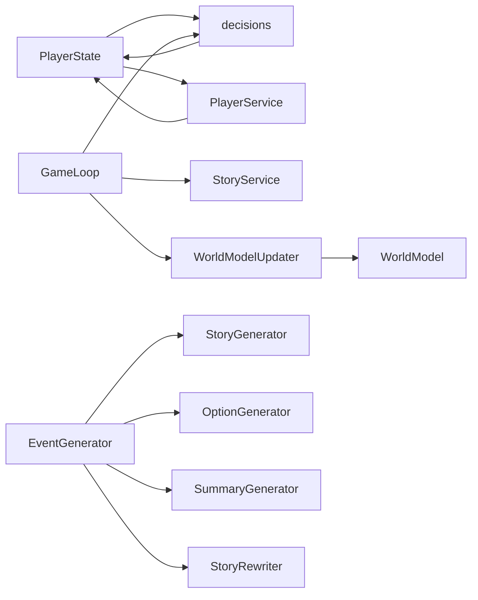

# 游戏机制系统

<cite>
**本文档引用的文件**
- [src/game/state.py](file://src/game/state.py)
- [src/game/decisions.py](file://src/game/decisions.py)
- [src/game/world_model.py](file://src/game/world_model.py)
- [src/game/narrative_manager.py](file://src/game/narrative_manager.py)
- [src/game/achievements.py](file://src/game/achievements.py)
- [src/game/player_service.py](file://src/game/player_service.py)
- [src/game/game_loop.py](file://src/game/game_loop.py)
- [src/ai/generator.py](file://src/ai/generator.py)
- [src/ai/story_generator.py](file://src/ai/story_generator.py)
- [src/game/world_model_updater.py](file://src/game/world_model_updater.py)
- [src/game/story_service.py](file://src/game/story_service.py)
- [config/settings.py](file://config/settings.py)
</cite>

## 目录
1. [简介](#简介)
2. [项目结构](#项目结构)
3. [核心组件](#核心组件)
4. [架构总览](#架构总览)
5. [详细组件分析](#详细组件分析)
6. [依赖关系分析](#依赖关系分析)
7. [性能考量](#性能考量)
8. [故障排查指南](#故障排查指南)
9. [结论](#结论)
10. [附录](#附录)

## 简介
本文件面向开发者与策划人员，系统化梳理“人生模拟”类游戏的核心机制：资源管理（能量、情绪、知识、财富）、决策制定与角色关系、叙事管理与AI内容组织、世界模型与一致性约束、成就系统与平衡性设计。文档以代码为依据，结合图示与算法说明，帮助理解数值与流程设计，并提供调优建议。

## 项目结构
项目采用分层模块化设计：
- 配置层：集中管理游戏参数与API配置
- 数据层：Pydantic模型定义玩家状态与NPC属性
- 业务层：决策、叙事、世界模型、成就等核心机制
- AI服务层：事件生成、选项生成、摘要与重写、一致性校验
- UI/入口层：Web界面与命令行入口

**图表来源**
- [config/settings.py](file://config/settings.py#L30-L96)
- [src/game/state.py](file://src/game/state.py#L244-L709)
- [src/game/decisions.py](file://src/game/decisions.py#L134-L270)
- [src/game/narrative_manager.py](file://src/game/narrative_manager.py#L15-L584)
- [src/game/world_model.py](file://src/game/world_model.py#L185-L665)
- [src/game/world_model_updater.py](file://src/game/world_model_updater.py#L14-L520)
- [src/game/achievements.py](file://src/game/achievements.py#L6-L85)
- [src/game/player_service.py](file://src/game/player_service.py#L9-L176)
- [src/game/game_loop.py](file://src/game/game_loop.py#L23-L1193)
- [src/game/story_service.py](file://src/game/story_service.py#L11-L282)
- [src/ai/generator.py](file://src/ai/generator.py#L30-L407)
- [src/ai/story_generator.py](file://src/ai/story_generator.py#L24-L387)

**章节来源**
- [config/settings.py](file://config/settings.py#L30-L96)
- [src/game/state.py](file://src/game/state.py#L244-L709)
- [src/game/game_loop.py](file://src/game/game_loop.py#L23-L1193)

## 核心组件
- 玩家状态(PlayerState)：承载资源、时间、决策历史、故事历史、世界模型数据、伏笔与习惯等
- NPC角色(CharacterState)：角色属性、关系阈值、互动记录与事件触发
- 决策系统：选项效果解析、角色关系变更、事件触发检测
- 世界模型：地点、职业、承诺、因果链、动态事实、角色画像
- 叙事管理：剧情线、事实、伏笔种子、角色习惯的增删改与清理
- 成就系统：基于资源阈值、决策数量、关系数量、里程碑的解锁判定
- AI生成器：事件/回合故事生成、选项生成、摘要与重写、一致性校验

**章节来源**
- [src/game/state.py](file://src/game/state.py#L244-L709)
- [src/game/decisions.py](file://src/game/decisions.py#L13-L270)
- [src/game/world_model.py](file://src/game/world_model.py#L185-L665)
- [src/game/narrative_manager.py](file://src/game/narrative_manager.py#L15-L584)
- [src/game/achievements.py](file://src/game/achievements.py#L6-L85)
- [src/ai/generator.py](file://src/ai/generator.py#L30-L407)

## 架构总览
游戏运行时序围绕“事件生成—选择—结果—叙事压缩—世界模型更新—周推进”的循环展开。AI生成器负责故事与选项，决策处理器应用效果并触发角色事件，叙事管理器与世界模型更新器负责状态持久化与一致性约束。

**图表来源**
- [src/game/game_loop.py](file://src/game/game_loop.py#L153-L350)
- [src/ai/generator.py](file://src/ai/generator.py#L159-L256)
- [src/ai/story_generator.py](file://src/ai/story_generator.py#L32-L175)
- [src/game/decisions.py](file://src/game/decisions.py#L134-L239)
- [src/game/story_service.py](file://src/game/story_service.py#L116-L131)
- [src/game/world_model_updater.py](file://src/game/world_model_updater.py#L14-L520)
- [src/game/world_model.py](file://src/game/world_model.py#L185-L665)

## 详细组件分析

### 资源管理系统（能量、情绪、知识、财富）
- 初始值与边界
  - 初始值：能量、情绪、知识由配置提供；财富初始值由配置提供
  - 边界：资源最小值为0，最大值为100；财富无上限
- 周衰减机制
  - 当能量低于阈值或情绪低于阈值时，按配置衰减值进行衰减
- 数值示例
  - 初始：能量=70，情绪=60，知识=50，财富=10000
  - 衰减：若能量<30，则-5；若情绪<30，则-2
- 平衡性要点
  - 衰减强度与玩家体验需平衡，避免过早枯竭导致挫败感
  - 财富增长路径应与资源消耗相匹配，避免通货膨胀

**图表来源**
- [src/game/game_loop.py](file://src/game/game_loop.py#L436-L448)
- [config/settings.py](file://config/settings.py#L54-L66)

**章节来源**
- [src/game/state.py](file://src/game/state.py#L372-L409)
- [src/game/game_loop.py](file://src/game/game_loop.py#L436-L448)
- [config/settings.py](file://config/settings.py#L54-L66)

### 决策制定系统与角色关系
- 选项效果解析
  - 支持对玩家资源（能量、情绪、知识、财富）与关系映射（relationships）的直接修改
  - 对角色关系（亲密度、信任度、尊重度、情绪）进行推导式变更
- 角色事件触发
  - 基于角色关系阈值与当前状态，检测深度友谊、冲突、求助、秘密分享、背叛风险等事件
- 数值示例
  - 正面互动：亲密度+Δ，信任度+Δ/3，尊重度+Δ/4，情绪+Δ/2
  - 负面互动：信任度-Δ/2，尊重度-Δ/3，情绪-Δ
- 平衡性要点
  - 事件阈值与关系变化需形成稳定曲线，避免“一蹴而就”或“永远无法触发”
  - 关系变更应与玩家选择动机一致，增强叙事可信度

**图表来源**
- [src/game/decisions.py](file://src/game/decisions.py#L13-L106)
- [src/game/player_service.py](file://src/game/player_service.py#L56-L103)

**章节来源**
- [src/game/decisions.py](file://src/game/decisions.py#L134-L239)
- [src/game/player_service.py](file://src/game/player_service.py#L106-L129)

### 世界模型与一致性约束
- 数据结构
  - 地点(LocationInfo)、职业(CareerInfo)、承诺(Commitment)、因果链(CausalChain)、身体状态(PhysicalState)、角色画像(CharacterProfile)
- 约束生成
  - 构建地理、职业、承诺、因果链、身体状态、动态事实、角色画像等约束文本，注入AI提示词
- 校验与修复
  - 一致性校验器对故事进行关键维度校验，出现严重不一致时触发重生成
- 数值示例
  - 职业晋升最大跳跃=2级；每级最少周数：实习12周、初级24周、中级/高级/主管48周
- 平衡性要点
  - 约束文本需简洁明确，避免过度限制创意；动态事实与角色画像应逐步建立，避免过早强约束

**图表来源**
- [src/game/world_model.py](file://src/game/world_model.py#L185-L665)

**章节来源**
- [src/game/world_model.py](file://src/game/world_model.py#L185-L665)
- [src/ai/story_generator.py](file://src/ai/story_generator.py#L310-L373)

### 叙事管理与AI内容组织
- 剧情线管理
  - 新增/解决/延续；按周数与重要性清理陈旧剧情线
- 世界事实管理
  - 新增/更新/删除；限制总数，按建立周排序
- 伏笔种子
  - 成熟度概率模型：基础概率、遮蔽度修正、权重修正、上下文匹配加成、衰减控制
  - 激活后统计回收距离，评估系统健康度
- 角色习惯
  - 新增/强化/弱化/移除/变更；限制每角色习惯数量
- 数值示例
  - 伏笔成熟度：不同种子类型对应不同成熟周数；遮蔽度0~1；权重major/supporting/minor
  - 习惯强度：emerging → moderate → strong
- 平衡性要点
  - 伏笔激活概率应与剧情密度匹配；习惯更新频率应与叙事节奏一致

**图表来源**
- [src/game/narrative_manager.py](file://src/game/narrative_manager.py#L22-L95)
- [src/game/narrative_manager.py](file://src/game/narrative_manager.py#L101-L182)
- [src/game/narrative_manager.py](file://src/game/narrative_manager.py#L289-L414)
- [src/game/narrative_manager.py](file://src/game/narrative_manager.py#L420-L584)

**章节来源**
- [src/game/narrative_manager.py](file://src/game/narrative_manager.py#L15-L584)

### 成就系统设计与实现
- 解锁条件
  - 财富：≥50000（财务自由）、≥100000（百万富翁）
  - 知识：≥80（博学多才）、≥90（知识渊博）
  - 关系：≥5个关系对象
  - 决策：≥25次（决策者）、≥50次（经验丰富）
  - 完美状态：能量≥80、情绪≥80、知识≥80
  - 周里程碑：≥50周（半程英雄）
- 平衡性要点
  - 条件梯度应与游戏时长匹配；避免后期“刷成就”破坏体验

**章节来源**
- [src/game/achievements.py](file://src/game/achievements.py#L14-L75)

### AI驱动的事件生成与一致性保障
- 事件生成
  - 两阶段：先生成故事文本，再基于故事生成选项
  - 支持周事件与回合事件；可注入历史摘要、剧情线、世界事实、角色习惯、激活的伏笔等上下文
- 一致性校验
  - 对地理、职业、承诺、因果链、身体状态、动态事实、角色画像等维度进行校验
  - 出现严重不一致时，附加修复指令并重生成
- 数值示例
  - 温度：故事生成1.0；续写/摘要0.8；JSON生成0.8
  - 最大Token：故事生成3500；续写600；摘要/重写800
- 平衡性要点
  - 上下文长度与Token预算需平衡；一致性校验成本与质量需权衡

**章节来源**
- [src/ai/generator.py](file://src/ai/generator.py#L159-L256)
- [src/ai/story_generator.py](file://src/ai/story_generator.py#L32-L175)
- [src/ai/story_generator.py](file://src/ai/story_generator.py#L310-L373)

## 依赖关系分析
- 状态与服务解耦
  - PlayerState仅承载数据；PlayerService封装复杂业务逻辑，降低状态类职责
- AI服务分层
  - EventGenerator作为门面，委托StoryGenerator、OptionGenerator、SummaryGenerator、StoryRewriter
- 循环依赖规避
  - 通过延迟导入与模块间接口约束，避免相互依赖

**图表来源**
- [src/game/state.py](file://src/game/state.py#L244-L709)
- [src/game/decisions.py](file://src/game/decisions.py#L134-L239)
- [src/game/player_service.py](file://src/game/player_service.py#L9-L176)
- [src/game/game_loop.py](file://src/game/game_loop.py#L23-L1193)
- [src/game/story_service.py](file://src/game/story_service.py#L11-L282)
- [src/game/world_model_updater.py](file://src/game/world_model_updater.py#L14-L520)
- [src/game/world_model.py](file://src/game/world_model.py#L185-L665)
- [src/ai/generator.py](file://src/ai/generator.py#L30-L407)
- [src/ai/story_generator.py](file://src/ai/story_generator.py#L24-L387)

**章节来源**
- [src/game/state.py](file://src/game/state.py#L244-L709)
- [src/game/decisions.py](file://src/game/decisions.py#L134-L239)
- [src/game/player_service.py](file://src/game/player_service.py#L9-L176)
- [src/ai/generator.py](file://src/ai/generator.py#L30-L407)

## 性能考量
- Token与成本控制
  - 限制动态事实与角色画像数量；回合事件与周事件的上下文长度需平衡
- 缓存策略
  - 事件缓存可显著降低重复生成成本；需考虑状态变化导致的失效
- 一致性校验开销
  - 校验失败重生成会增加成本，应优化提示词与阈值，减少重试概率
- 并发与流式输出
  - 支持流式回调，改善用户体验；需注意并发下的状态一致性

[本节为通用指导，无需特定文件引用]

## 故障排查指南
- 事件生成失败
  - 检查OpenAI密钥与模型配置；查看重试日志与错误原因
  - 若持续失败，启用回退事件生成
- 一致性校验失败
  - 查看严重不一致问题列表；根据修复指令调整故事或提示词
- 成就未解锁
  - 确认当前状态是否满足阈值；语言切换可能导致文案差异
- 世界模型异常
  - 检查地点/职业/承诺/因果链等更新是否正确；确认动态事实与角色画像是否超限

**章节来源**
- [src/ai/generator.py](file://src/ai/generator.py#L159-L214)
- [src/ai/story_generator.py](file://src/ai/story_generator.py#L310-L373)
- [src/game/achievements.py](file://src/game/achievements.py#L14-L75)
- [src/game/world_model_updater.py](file://src/game/world_model_updater.py#L262-L353)

## 结论
本系统通过清晰的数据模型、可扩展的AI生成管线与严格的约束校验，实现了高可塑性的人生模拟体验。资源管理、决策与关系、叙事与世界模型、成就体系共同构成闭环：玩家选择影响短期资源与关系，长期积累塑造角色画像与世界事实，AI在一致性约束下生成连贯且富有变化的故事。建议在后续迭代中进一步细化事件阈值曲线、优化伏笔与习惯的动态平衡，并引入更多个性化与分支结局以增强重玩价值。

[本节为总结，无需特定文件引用]

## 附录
- 配置项速览
  - 初始值：能量、情绪、知识、财富
  - 资源边界：最小0，最大100；财富无上限
  - 周衰减：能量衰减5，情绪衰减2（当低于阈值时）
  - 游戏周期：起始年龄22，结束年龄30，总周数96
- 关键算法参考
  - 事件阈值触发：基于亲密度与信任度的复合判断
  - 伏笔激活概率：成熟度、遮蔽度、权重、上下文匹配与衰减函数
  - 世界模型约束：地理可行性、职业晋升合理性、承诺到期提醒、因果链与动态事实、角色画像一致性

**章节来源**
- [config/settings.py](file://config/settings.py#L44-L66)
- [src/game/player_service.py](file://src/game/player_service.py#L153-L175)
- [src/game/narrative_manager.py](file://src/game/narrative_manager.py#L217-L285)
- [src/game/world_model.py](file://src/game/world_model.py#L319-L348)