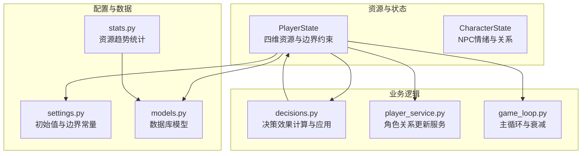
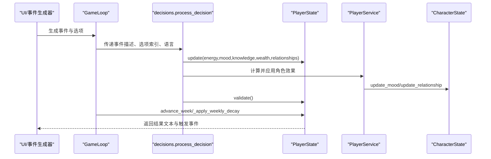
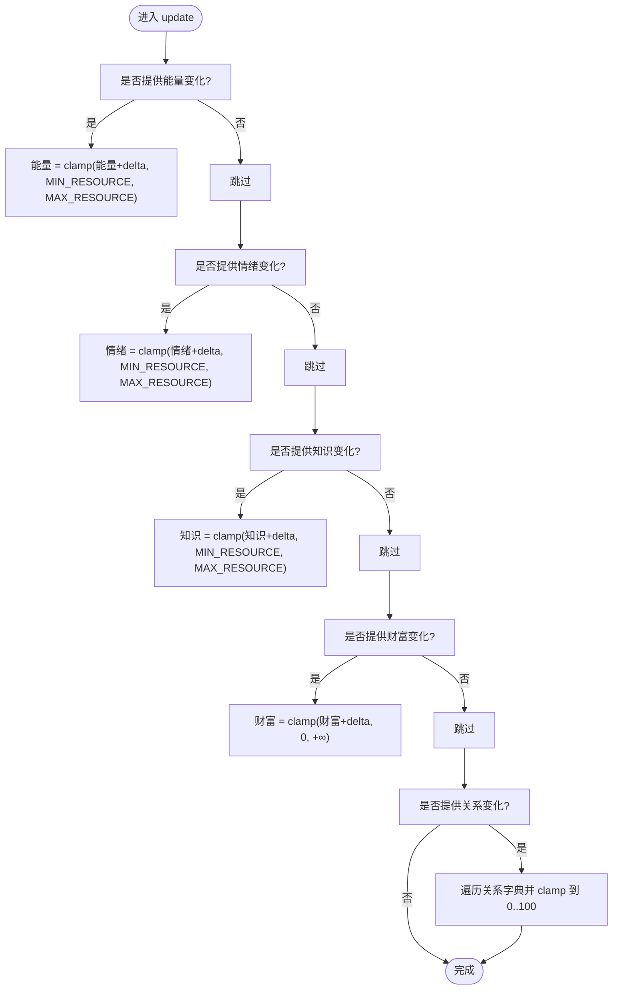
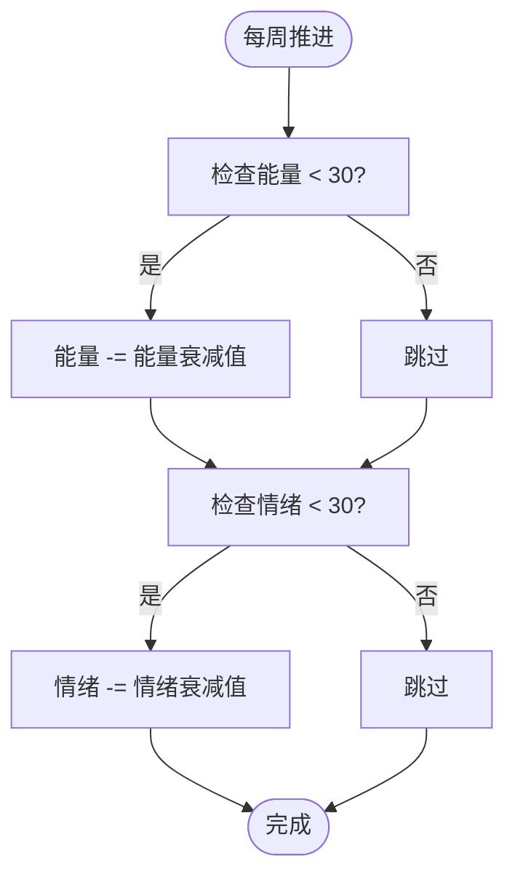
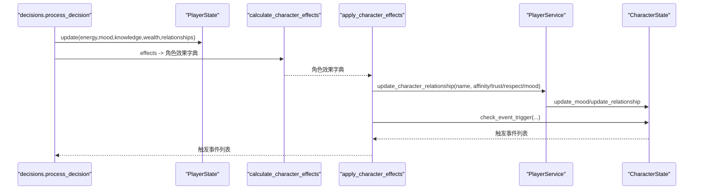
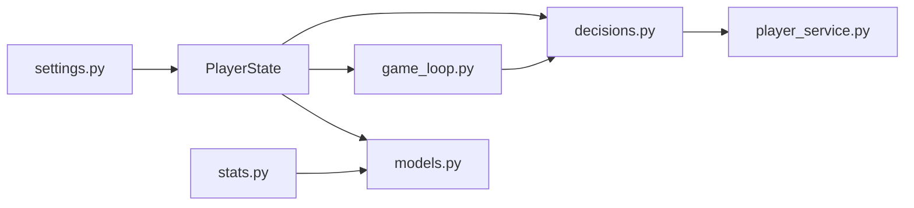

# 资源管理系统

<cite>
**本文引用的文件**
- [src/game/state.py](file://src/game/state.py)
- [src/game/player_service.py](file://src/game/player_service.py)
- [src/game/decisions.py](file://src/game/decisions.py)
- [src/game/game_loop.py](file://src/game/game_loop.py)
- [config/settings.py](file://config/settings.py)
- [src/ui/stats.py](file://src/ui/stats.py)
- [src/database/models.py](file://src/database/models.py)
- [tests/test_state.py](file://tests/test_state.py)
</cite>

## 目录
1. [简介](#简介)
2. [项目结构](#项目结构)
3. [核心组件](#核心组件)
4. [架构总览](#架构总览)
5. [详细组件分析](#详细组件分析)
6. [依赖分析](#依赖分析)
7. [性能考量](#性能考量)
8. [故障排查指南](#故障排查指南)
9. [结论](#结论)
10. [附录](#附录)

## 简介
本文件面向开发者与策划人员，系统化梳理“资源管理系统”的设计与实现，重点覆盖四维资源（能量、情绪、知识、财富）的初始值设定、数值范围限制、衰减算法与平衡机制，并深入解析资源更新函数的实现逻辑（含正负值处理与边界约束）、资源与游戏进程的关系、以及决策如何驱动资源变化。文档同时提供具体数值示例与调优建议，帮助读者理解系统平衡性设计与参数调优方法。

## 项目结构
资源管理相关的核心代码集中在以下模块：
- 游戏状态与资源：src/game/state.py
- 决策与效果应用：src/game/decisions.py
- 游戏主循环与衰减：src/game/game_loop.py
- 配置与常量：config/settings.py
- 数据持久化与统计：src/database/models.py、src/ui/stats.py
- 行为测试：tests/test_state.py

图表来源
- [src/game/state.py](file://src/game/state.py#L244-L709)
- [src/game/decisions.py](file://src/game/decisions.py#L1-L270)
- [src/game/player_service.py](file://src/game/player_service.py#L1-L176)
- [src/game/game_loop.py](file://src/game/game_loop.py#L436-L448)
- [config/settings.py](file://config/settings.py#L53-L67)
- [src/database/models.py](file://src/database/models.py#L82-L111)
- [src/ui/stats.py](file://src/ui/stats.py#L46-L82)

章节来源
- [src/game/state.py](file://src/game/state.py#L244-L709)
- [src/game/decisions.py](file://src/game/decisions.py#L1-L270)
- [src/game/player_service.py](file://src/game/player_service.py#L1-L176)
- [src/game/game_loop.py](file://src/game/game_loop.py#L436-L448)
- [config/settings.py](file://config/settings.py#L53-L67)
- [src/database/models.py](file://src/database/models.py#L82-L111)
- [src/ui/stats.py](file://src/ui/stats.py#L46-L82)

## 核心组件
- PlayerState：承载玩家四维资源（能量、情绪、知识、财富）与时间进度，负责资源更新、边界约束与状态校验。
- CharacterState：承载NPC角色的情绪、关系与触发阈值，支持情绪衰减与关系更新。
- PlayerService：封装角色关系更新、事件触发检查与角色上下文生成等业务逻辑。
- decisions：将事件选项的效果映射为资源变化，计算角色影响并触发事件。
- game_loop：在周推进与回合推进中应用资源衰减、生成周/年总结、推进时间。
- settings：集中定义初始值、边界与衰减常量。
- 数据层与统计：数据库模型与统计分析工具用于资源趋势可视化与平均统计。

章节来源
- [src/game/state.py](file://src/game/state.py#L244-L709)
- [src/game/player_service.py](file://src/game/player_service.py#L9-L176)
- [src/game/decisions.py](file://src/game/decisions.py#L13-L106)
- [src/game/game_loop.py](file://src/game/game_loop.py#L436-L448)
- [config/settings.py](file://config/settings.py#L53-L67)
- [src/database/models.py](file://src/database/models.py#L82-L111)
- [src/ui/stats.py](file://src/ui/stats.py#L46-L82)

## 架构总览
资源系统围绕 PlayerState 展开，通过决策流程将事件效果转化为资源变化；game_loop 在周推进时应用衰减；settings 提供统一的初始值与边界；统计数据模块用于追踪资源趋势。

图表来源
- [src/game/game_loop.py](file://src/game/game_loop.py#L257-L298)
- [src/game/decisions.py](file://src/game/decisions.py#L134-L239)
- [src/game/state.py](file://src/game/state.py#L372-L551)
- [src/game/player_service.py](file://src/game/player_service.py#L56-L103)

## 详细组件分析

### 四维资源定义与初始值
- 资源类型与范围
  - 能量：0-100
  - 情绪：0-100
  - 知识：0-100
  - 财富：≥0（无上限）
- 初始值
  - 能量：70
  - 情绪：60
  - 知识：50
  - 财富：10000
- 边界常量
  - 最小值：0
  - 最大值：100
  - 财富上限：1000000（代码中存在上限定义，但财富更新逻辑采用非负约束）

章节来源
- [config/settings.py](file://config/settings.py#L53-L67)
- [src/game/state.py](file://src/game/state.py#L251-L256)

### 资源更新函数 update 的实现逻辑
- 参数支持：能量、情绪、知识、财富、关系字典
- 正负值处理：允许负值变化，最终通过边界约束进行截断
- 边界约束
  - 能量/情绪/知识：max(MIN_RESOURCE, min(MAX_RESOURCE, value + delta))
  - 财富：max(0, value + delta)，无上限
  - 关系值：max(0, min(100, value + delta))
- 关系同步：当通过 update 更新 relationships 时，同步到 characters 字段

图表来源
- [src/game/state.py](file://src/game/state.py#L372-L408)

章节来源
- [src/game/state.py](file://src/game/state.py#L372-L408)

### 资源衰减算法与平衡机制
- 周期衰减触发条件
  - 能量低于阈值（<30）时衰减
  - 情绪低于阈值（<30）时衰减
- 衰减值
  - 能量衰减：固定值（例如每次触发衰减5）
  - 情绪衰减：固定值（例如每次触发衰减2）
- 应用时机
  - 每周推进时调用 _apply_weekly_decay
  - 与周总结、周奖励效果叠加

图表来源
- [src/game/game_loop.py](file://src/game/game_loop.py#L436-L448)
- [config/settings.py](file://config/settings.py#L64-L67)

章节来源
- [src/game/game_loop.py](file://src/game/game_loop.py#L436-L448)
- [config/settings.py](file://config/settings.py#L64-L67)

### 决策对资源的影响与事件效果
- 决策入口
  - process_decision 解析所选选项的 effects
  - 同步应用到 PlayerState.update
- 角色影响计算
  - calculate_character_effects 将 relationships 与 character_effects 转换为角色属性变化
  - apply_character_effects 调用 PlayerService.update_character_relationship 应用到 NPC
- 触发事件
  - 对每个角色检查事件阈值，满足条件则记录触发事件

图表来源
- [src/game/decisions.py](file://src/game/decisions.py#L134-L239)
- [src/game/player_service.py](file://src/game/player_service.py#L56-L103)
- [src/game/state.py](file://src/game/state.py#L121-L151)

章节来源
- [src/game/decisions.py](file://src/game/decisions.py#L13-L106)
- [src/game/decisions.py](file://src/game/decisions.py#L134-L239)
- [src/game/player_service.py](file://src/game/player_service.py#L56-L103)
- [src/game/state.py](file://src/game/state.py#L121-L151)

### NPC 情绪与关系的衰减与触发
- 情绪衰减
  - update_mood 根据情绪稳定性调整变化幅度，稳定性越高，变化幅度越小
- 关系更新
  - update_relationship 对亲密度、信任度、尊重度分别进行边界约束
  - 同步更新历史最高亲密度 peak_affinity
- 事件触发
  - check_event_trigger 基于阈值表判断是否满足事件触发条件

章节来源
- [src/game/state.py](file://src/game/state.py#L121-L151)
- [src/game/state.py](file://src/game/state.py#L168-L171)

### 资源与游戏进程的关系
- 时间推进
  - advance_week 增加周数并重置回合计数
  - advance_round 增加回合计数，达到每周期限时后返回周完成信号
- 周/年总结
  - 每4周生成一次四周期间总结
  - 每48周生成一次年度总结
- 周末奖励
  - 周总结可能附加 bonus_effects，随后通过 PlayerState.update 应用

章节来源
- [src/game/state.py](file://src/game/state.py#L410-L441)
- [src/game/game_loop.py](file://src/game/game_loop.py#L351-L435)
- [src/game/game_loop.py](file://src/game/game_loop.py#L1035-L1083)

### 数值示例与计算公式
- 初始值
  - 能量：70，情绪：60，知识：50，财富：10000
- 边界约束
  - X = clamp(X + Δ, MIN_RESOURCE, MAX_RESOURCE) 对能量/情绪/知识
  - 财富 = clamp(财富 + Δ, 0, +∞)
- 衰减
  - 若能量 < 30，则能量 -= 能量衰减值
  - 若情绪 < 30，则情绪 -= 情绪衰减值
- 关系变化
  - 关系值 = clamp(当前亲密度 + Δ, 0, 100)

章节来源
- [config/settings.py](file://config/settings.py#L53-L67)
- [src/game/state.py](file://src/game/state.py#L372-L408)
- [src/game/game_loop.py](file://src/game/game_loop.py#L436-L448)

### 资源趋势与统计
- 资源趋势
  - 通过查询 GameState 表按周排序，提取 energy/mood/knowledge/wealth
- 平均终局统计
  - 从 Ending 表聚合最终状态，计算平均值
- 常见选择统计
  - 统计决策表中选项出现频率

章节来源
- [src/ui/stats.py](file://src/ui/stats.py#L46-L82)
- [src/ui/stats.py](file://src/ui/stats.py#L106-L142)
- [src/ui/stats.py](file://src/ui/stats.py#L19-L44)
- [src/database/models.py](file://src/database/models.py#L82-L111)

## 依赖分析
- PlayerState 依赖 settings 提供初始值与边界常量
- decisions 依赖 PlayerState.update 与 PlayerService
- game_loop 依赖 decisions 与 settings，负责衰减与周推进
- 数据层通过 models 定义 GameState/Decision/Ending 存储资源快照与最终状态
- 统计模块依赖数据库模型进行资源趋势与平均统计

图表来源
- [config/settings.py](file://config/settings.py#L53-L67)
- [src/game/state.py](file://src/game/state.py#L244-L709)
- [src/game/decisions.py](file://src/game/decisions.py#L1-L270)
- [src/game/player_service.py](file://src/game/player_service.py#L1-L176)
- [src/game/game_loop.py](file://src/game/game_loop.py#L1-L1193)
- [src/database/models.py](file://src/database/models.py#L82-L111)
- [src/ui/stats.py](file://src/ui/stats.py#L46-L82)

章节来源
- [config/settings.py](file://config/settings.py#L53-L67)
- [src/game/state.py](file://src/game/state.py#L244-L709)
- [src/game/decisions.py](file://src/game/decisions.py#L1-L270)
- [src/game/player_service.py](file://src/game/player_service.py#L1-L176)
- [src/game/game_loop.py](file://src/game/game_loop.py#L1-L1193)
- [src/database/models.py](file://src/database/models.py#L82-L111)
- [src/ui/stats.py](file://src/ui/stats.py#L46-L82)

## 性能考量
- update 函数为 O(1) 资源更新，关系字典遍历为 O(n)（n 为关系数量），通常较小，可忽略
- 衰减逻辑在每周推进时执行，复杂度 O(1)
- 统计查询按周排序，建议在 GameState 上建立 week 索引以优化趋势查询
- 决策处理与事件生成为 IO 密集型，主要瓶颈在 AI 生成器

## 故障排查指南
- 状态越界
  - validate 会在资源越界时抛出异常，检查 update 调用与边界约束
- 财富为负
  - update 对财富采用非负约束，若出现负值，检查是否在其他路径被错误设置
- 关系值异常
  - relationships 字段通过 field_validator 进行边界约束，确保输入合法
- 资源趋势异常
  - 使用 StatisticsAnalyzer.get_resource_trends 核对 GameState 存储是否正确

章节来源
- [src/game/state.py](file://src/game/state.py#L531-L551)
- [src/game/state.py](file://src/game/state.py#L366-L370)
- [src/ui/stats.py](file://src/ui/stats.py#L46-L82)

## 结论
资源管理系统以 PlayerState 为核心，通过明确的初始值、边界约束与周期衰减机制，确保四维资源在叙事驱动的决策过程中保持稳定与可预测。决策流程将事件效果映射为资源变化，并联动 NPC 情绪与关系，形成闭环反馈。通过 settings 集中管理常量，配合数据库与统计模块，系统具备良好的可调性与可观测性。建议在调优时优先关注衰减阈值与衰减值，以平衡紧张感与可玩性。

## 附录
- 调优建议
  - 初始值：根据目标体验微调能量/情绪/知识初始值
  - 边界：维持 0-100 的统一范围，财富可考虑引入上限以控制通胀
  - 衰减：降低阈值提高敏感度，增大衰减值增强压力
  - 关系：结合事件阈值与角色稳定性，平衡社交体验
- 测试参考
  - 使用 tests/test_state.py 的断言验证边界行为与初始值

章节来源
- [tests/test_state.py](file://tests/test_state.py#L10-L44)