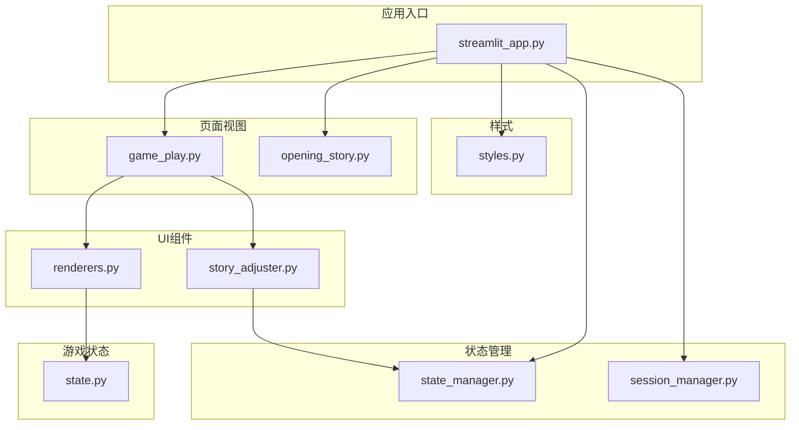
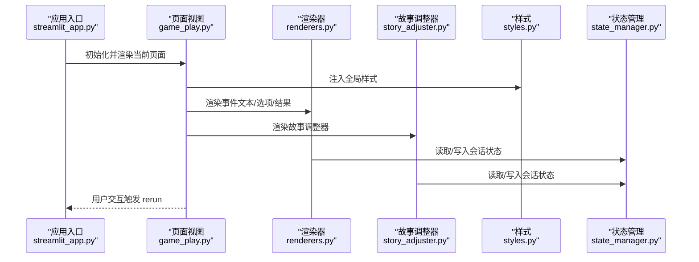
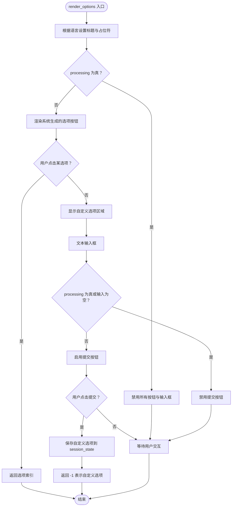
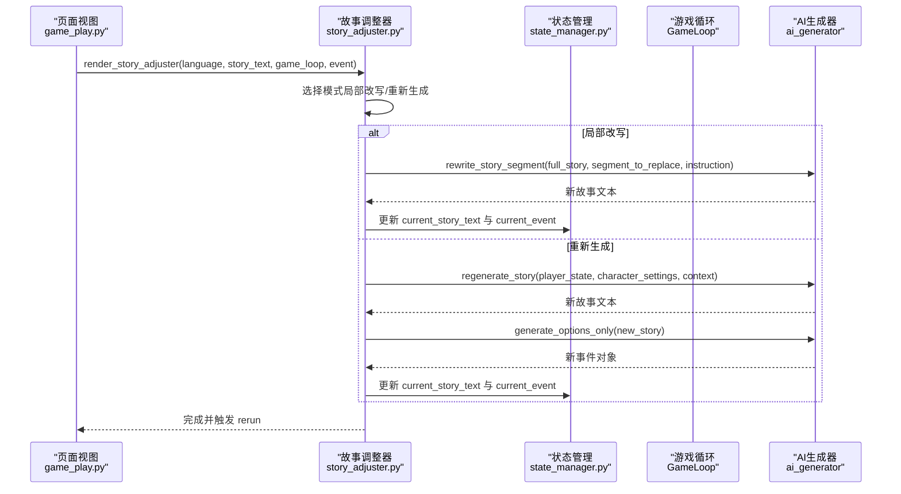
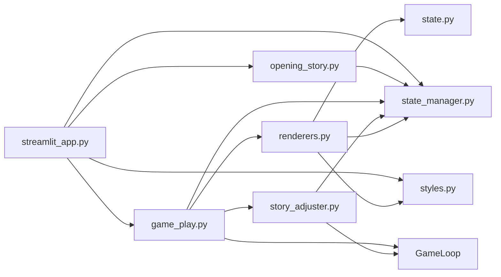

# UI组件库

<cite>
**本文引用的文件**
- [renderers.py](file://src/ui/components/renderers.py)
- [story_adjuster.py](file://src/ui/components/story_adjuster.py)
- [styles.py](file://src/ui/styles.py)
- [state_manager.py](file://src/ui/state_manager.py)
- [session_manager.py](file://src/ui/session_manager.py)
- [game_play.py](file://src/ui/page_views/game_play.py)
- [opening_story.py](file://src/ui/page_views/opening_story.py)
- [streamlit_app.py](file://src/ui/streamlit_app.py)
- [state.py](file://src/game/state.py)
</cite>

## 目录
1. [简介](#简介)
2. [项目结构](#项目结构)
3. [核心组件](#核心组件)
4. [架构总览](#架构总览)
5. [详细组件分析](#详细组件分析)
6. [依赖关系分析](#依赖关系分析)
7. [性能考量](#性能考量)
8. [故障排查指南](#故障排查指南)
9. [结论](#结论)
10. [附录](#附录)

## 简介
本文件面向“UI组件库”的使用者与维护者，系统性梳理并解释可复用UI组件的设计与实现，重点覆盖：
- 渲染器组件（renderers.py）：文本渲染、状态面板、选项按钮、结果展示、上下文聊天、调试控制台等通用UI元素。
- 故事调整器组件（story_adjuster.py）：对故事进行局部改写与整段重生成的能力。
- 属性配置、事件回调、样式定制与主题适配。
- 组件组合使用模式与最佳实践。
- 可扩展性设计与自定义开发指南。

## 项目结构
UI组件库位于 src/ui/components，配合样式注入、状态管理与页面视图共同构成完整的交互层。关键目录与文件如下：
- 组件层：renderers.py、story_adjuster.py
- 样式层：styles.py（CSS注入与渐变文本工具）
- 状态层：state_manager.py（统一会话状态）、session_manager.py（向后兼容）
- 页面视图：game_play.py、opening_story.py 等
- 应用入口：streamlit_app.py
- 游戏状态模型：state.py（PlayerState、CharacterState）

图表来源
- [streamlit_app.py](file://src/ui/streamlit_app.py#L139-L215)
- [game_play.py](file://src/ui/page_views/game_play.py#L1-L662)
- [renderers.py](file://src/ui/components/renderers.py#L1-L385)
- [story_adjuster.py](file://src/ui/components/story_adjuster.py#L1-L160)
- [styles.py](file://src/ui/styles.py#L1-L710)
- [state_manager.py](file://src/ui/state_manager.py#L1-L773)
- [session_manager.py](file://src/ui/session_manager.py#L1-L65)
- [state.py](file://src/game/state.py#L244-L709)

章节来源
- [streamlit_app.py](file://src/ui/streamlit_app.py#L139-L215)
- [game_play.py](file://src/ui/page_views/game_play.py#L1-L662)

## 核心组件
本节概述两大核心模块及其职责与交互要点。

- 渲染器组件（renderers.py）
  - 负责将 PlayerState、事件与结果以UI形式呈现，包含状态面板、事件文本、选项按钮、结果展示、上下文聊天与调试控制台。
  - 通过 get_state_manager() 与会话状态交互，确保渲染内容与游戏状态一致。
  - 通过 styles.py 的 get_gradient_text 实现渐变标题等视觉增强。

- 故事调整器组件（story_adjuster.py）
  - 提供“局部改写”与“整段重生成”两种模式，允许玩家对当前故事进行编辑与再创作。
  - 与 AI 生成器协作，调用 rewrite_story_segment 与 regenerate_story 等接口，更新当前故事与事件对象。

章节来源
- [renderers.py](file://src/ui/components/renderers.py#L1-L385)
- [story_adjuster.py](file://src/ui/components/story_adjuster.py#L1-L160)
- [styles.py](file://src/ui/styles.py#L707-L710)
- [state_manager.py](file://src/ui/state_manager.py#L541-L547)

## 架构总览
UI组件库采用“页面视图 + 组件 + 样式 + 状态管理”的分层架构：
- 页面视图负责业务流程编排（如游戏主界面、开场故事页）。
- 组件层封装可复用UI逻辑（渲染器、故事调整器）。
- 样式层提供主题与动画等视觉统一。
- 状态管理层集中管理会话状态，保证跨组件的一致性与可恢复性。

图表来源
- [streamlit_app.py](file://src/ui/streamlit_app.py#L139-L215)
- [game_play.py](file://src/ui/page_views/game_play.py#L18-L67)
- [renderers.py](file://src/ui/components/renderers.py#L22-L171)
- [story_adjuster.py](file://src/ui/components/story_adjuster.py#L10-L39)
- [styles.py](file://src/ui/styles.py#L5-L704)
- [state_manager.py](file://src/ui/state_manager.py#L67-L105)

## 详细组件分析

### 渲染器组件（renderers.py）
渲染器组件提供一系列可复用的UI渲染函数，涵盖文本渲染、状态面板、选项按钮、结果展示、上下文聊天与调试控制台。

- add_debug_log(message, log_type)
  - 在会话状态中追加调试日志，最多保留100条，便于问题定位。
  - 与 render_debug_console 配合使用。

- render_state_panel(state, language)
  - 渲染侧边栏状态面板，显示年龄、周数、精力、情绪、学识、财富与关系等。
  - 支持中英文切换；财富货币符号来自 character_settings。

- render_event(event, language, week)
  - 返回事件的选项列表，供 render_options 使用。

- render_options(options, language) -> Optional[int]
  - 渲染选项按钮，支持自定义输入与提交。
  - 返回被选中的选项索引；当用户提交自定义选项时返回 -1。
  - 通过 get_state_manager() 获取当前游戏循环与周数，生成唯一按钮键，避免键冲突。
  - 在 processing 标志为真时禁用按钮，防止并发操作。

- render_result(result, language)
  - 渲染决策结果文本与影响描述。
  - 通过 _build_effect_descriptions 将 effects_applied 转换为人类可读的影响说明。

- _build_effect_descriptions(effects, language) -> List[str]
  - 将能量、情绪、学识、财富、关系等数值变化转换为本地化文案。

- render_debug_console(language)
  - 在侧边栏展开调试控制台，显示最近日志并提供清空功能。

- render_context_chat(language)
  - 提供上下文聊天界面，支持用户提问、AI回复与清空历史。
  - 通过 game_loop.ai_generator 调用AI，结合角色设定与当前事件生成回复。
  - 使用 context_chat_processing 控制发送按钮状态与加载提示。

图表来源
- [renderers.py](file://src/ui/components/renderers.py#L79-L143)

章节来源
- [renderers.py](file://src/ui/components/renderers.py#L10-L385)

### 故事调整器组件（story_adjuster.py）
故事调整器提供两种模式，帮助玩家对当前故事进行编辑与再创作。

- render_story_adjuster(language, story_text, game_loop, event)
  - 在 expander 中渲染“人生调整器”，支持“部分改写”与“重新生成本轮故事”。

- _render_partial_rewrite(...)
  - 局部改写：粘贴需要改写的段落与改写说明，调用 ai_generator.rewrite_story_segment 生成新故事。
  - 更新 current_story_text 与 event.event_description，并刷新状态。

- _render_regenerate_story(...)
  - 重新生成本轮故事：调用 ai_generator.regenerate_story 生成新故事，并通过 ai_generator.generate_options_only 生成新事件。
  - 更新 current_story_text 与 current_event，并刷新状态。

图表来源
- [story_adjuster.py](file://src/ui/components/story_adjuster.py#L10-L160)
- [game_play.py](file://src/ui/page_views/game_play.py#L395-L396)

章节来源
- [story_adjuster.py](file://src/ui/components/story_adjuster.py#L10-L160)

### 样式与主题适配（styles.py）
- inject_custom_css()
  - 注入全局样式，包括深色背景、渐变标题、按钮、侧边栏、进度条、输入框、下拉菜单、标签页、展开器、代码块、指标、滚动条等。
  - 通过动画类 fade-in、pulse、slide-in 提供过渡效果。
  - 为卡片、事件卡、选项按钮、结果展示等组件提供专用样式类。

- get_gradient_text(text, gradient)
  - 生成带渐变色的HTML文本，用于标题与强调文本。

章节来源
- [styles.py](file://src/ui/styles.py#L5-L710)

### 状态管理（state_manager.py）
- SessionStateManager
  - 提供类型安全的会话状态访问与初始化，统一管理核心状态、事件状态、角色创建状态、多轮系统状态、用户状态、UI标志与调试状态。
  - 提供 current_event 的单一真实来源，确保与 game_loop 同步。
  - 提供 add_debug_log、clear_user_session_data、clear_game_state 等实用方法。

- get_state_manager()
  - 返回全局状态管理器实例，确保单例访问。

章节来源
- [state_manager.py](file://src/ui/state_manager.py#L42-L547)

### 页面视图中的组件使用
- game_play.py
  - 在主游戏界面中，先渲染控制栏与顶部/底部摘要，再渲染事件文本与故事调整器，最后渲染上下文聊天。
  - 通过 render_options 获取用户选择，调用 game_loop.make_round_choice 或 make_choice 处理决策，并通过 _apply_choice_result 更新会话状态与数据库。

- opening_story.py
  - 在角色创建完成后，渲染开场故事并提供“开始我的人生”按钮，切换至 PLAYING 状态。

章节来源
- [game_play.py](file://src/ui/page_views/game_play.py#L18-L662)
- [opening_story.py](file://src/ui/page_views/opening_story.py#L11-L120)

## 依赖关系分析
- 组件依赖
  - renderers.py 依赖 PlayerState（来自 src/game/state.py）与 get_state_manager（来自 src/ui/state_manager.py），以及 styles.py 的 get_gradient_text。
  - story_adjuster.py 依赖 state_manager.get_state_manager 与 game_loop.ai_generator。
- 页面视图依赖
  - game_play.py 同时依赖 renderers 与 story_adjuster，并与 state_manager、game_loop、database 等交互。
- 样式依赖
  - 所有页面视图在入口处调用 inject_custom_css，确保全局样式生效。

图表来源
- [renderers.py](file://src/ui/components/renderers.py#L1-L10)
- [story_adjuster.py](file://src/ui/components/story_adjuster.py#L1-L7)
- [state.py](file://src/game/state.py#L244-L298)
- [state_manager.py](file://src/ui/state_manager.py#L14-L26)
- [game_play.py](file://src/ui/page_views/game_play.py#L9-L13)
- [opening_story.py](file://src/ui/page_views/opening_story.py#L13-L18)
- [streamlit_app.py](file://src/ui/streamlit_app.py#L13-L19)

章节来源
- [renderers.py](file://src/ui/components/renderers.py#L1-L10)
- [story_adjuster.py](file://src/ui/components/story_adjuster.py#L1-L7)
- [state_manager.py](file://src/ui/state_manager.py#L14-L26)
- [game_play.py](file://src/ui/page_views/game_play.py#L9-L13)
- [opening_story.py](file://src/ui/page_views/opening_story.py#L13-L18)
- [streamlit_app.py](file://src/ui/streamlit_app.py#L13-L19)

## 性能考量
- 渲染性能
  - 使用 st.empty 与占位符流式渲染故事与结果，减少不必要的全量重绘。
  - 在 processing 标志为真时禁用交互，避免重复请求与并发问题。
- 样式性能
  - 通过 CSS 类与动画提供流畅过渡，但需注意复杂动画在低端设备上的表现。
- 数据持久化
  - 在事件生成与决策处理前后及时保存状态，降低中断导致的重复计算成本。

[本节为通用指导，无需特定文件来源]

## 故障排查指南
- 调试日志
  - 使用 add_debug_log 记录关键路径信息；在侧边栏调试控制台查看最近日志。
- 事件生成失败
  - 检查 OPENAI_API_KEY 等环境变量配置；查看错误堆栈与日志输出。
- 选项按钮无响应
  - 确认 processing 标志是否被意外置为 True；检查按钮键是否唯一且与当前周/轮次绑定。
- 故事调整器异常
  - 确认 ai_generator 接口可用；检查 character_settings 与 round_history 上下文是否正确传递。

章节来源
- [renderers.py](file://src/ui/components/renderers.py#L10-L19)
- [renderers.py](file://src/ui/components/renderers.py#L277-L290)
- [game_play.py](file://src/ui/page_views/game_play.py#L369-L381)
- [game_play.py](file://src/ui/page_views/game_play.py#L468-L550)

## 结论
UI组件库通过渲染器与故事调整器实现了高内聚、低耦合的可复用UI能力，配合统一的状态管理与样式系统，提供了良好的主题适配与交互体验。其设计具备良好的扩展性，便于新增组件与定制样式。

[本节为总结性内容，无需特定文件来源]

## 附录

### 组件属性配置与事件回调清单
- render_state_panel(state, language)
  - 输入：PlayerState、语言标识
  - 输出：侧边栏状态面板
- render_event(event, language, week)
  - 输入：事件对象、语言、周数
  - 输出：事件选项列表
- render_options(options, language)
  - 输入：选项列表、语言
  - 输出：选中索引（-1 表示自定义）
  - 事件：按钮点击、文本输入、提交
- render_result(result, language)
  - 输入：结果字典
  - 输出：结果文本与影响描述
- render_context_chat(language)
  - 输入：语言
  - 事件：发送按钮、清空按钮
- render_story_adjuster(language, story_text, game_loop, event)
  - 输入：语言、故事文本、游戏循环、事件对象
  - 事件：局部改写、重新生成
- add_debug_log(message, log_type)
  - 输入：消息、日志类型
  - 输出：会话状态中追加日志

章节来源
- [renderers.py](file://src/ui/components/renderers.py#L22-L171)
- [renderers.py](file://src/ui/components/renderers.py#L277-L385)
- [story_adjuster.py](file://src/ui/components/story_adjuster.py#L10-L160)

### 组合使用模式与最佳实践
- 页面视图中的典型流程
  - 初始化样式与状态 → 渲染事件文本 → 渲染故事调整器 → 渲染选项按钮 → 处理选择 → 渲染结果 → 保存状态 → 触发 rerun。
- 最佳实践
  - 使用 processing 标志控制交互状态，避免并发。
  - 将 UI 与业务逻辑分离，组件只负责渲染与简单交互。
  - 通过 get_state_manager 统一访问状态，避免分散的 st.session_state 直接操作。
  - 对外暴露稳定的函数接口，内部通过依赖注入或全局状态管理解耦。

章节来源
- [game_play.py](file://src/ui/page_views/game_play.py#L18-L662)
- [state_manager.py](file://src/ui/state_manager.py#L67-L105)

### 可扩展性设计与自定义开发指南
- 新增渲染器
  - 在 renderers.py 中新增函数，遵循现有命名与参数约定；必要时引入 get_state_manager 与 styles 工具。
- 新增页面视图
  - 在 page_views 中新增模块，导入所需组件与状态管理器；在 streamlit_app.py 中注册路由。
- 主题与样式
  - 在 styles.py 中扩展 CSS 类与动画；通过 get_gradient_text 统一标题风格。
- 状态扩展
  - 在 state_manager.py 的相应初始化方法中添加新字段；提供类型安全的 getter/setter。
- 与 AI 集成
  - 在 story_adjuster.py 或页面视图中调用 ai_generator 接口；确保上下文（character_settings、round_history）完整传递。

章节来源
- [renderers.py](file://src/ui/components/renderers.py#L1-L385)
- [story_adjuster.py](file://src/ui/components/story_adjuster.py#L1-L160)
- [styles.py](file://src/ui/styles.py#L5-L710)
- [state_manager.py](file://src/ui/state_manager.py#L67-L105)
- [streamlit_app.py](file://src/ui/streamlit_app.py#L139-L215)