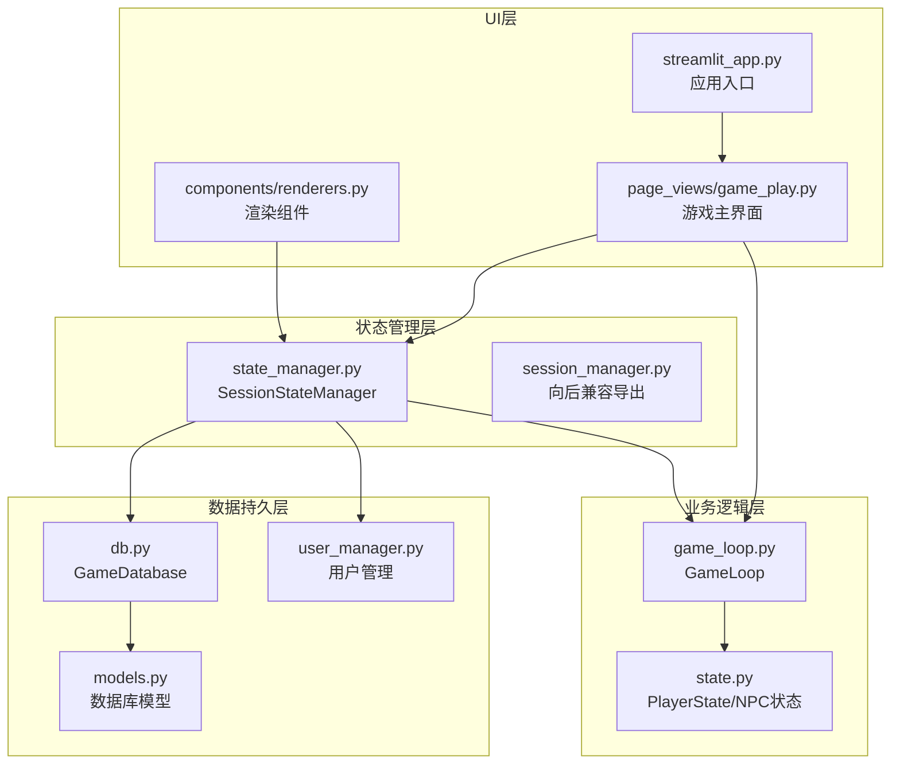
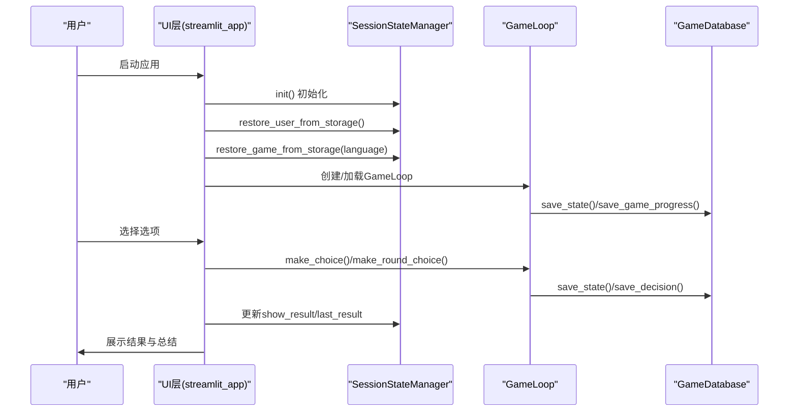
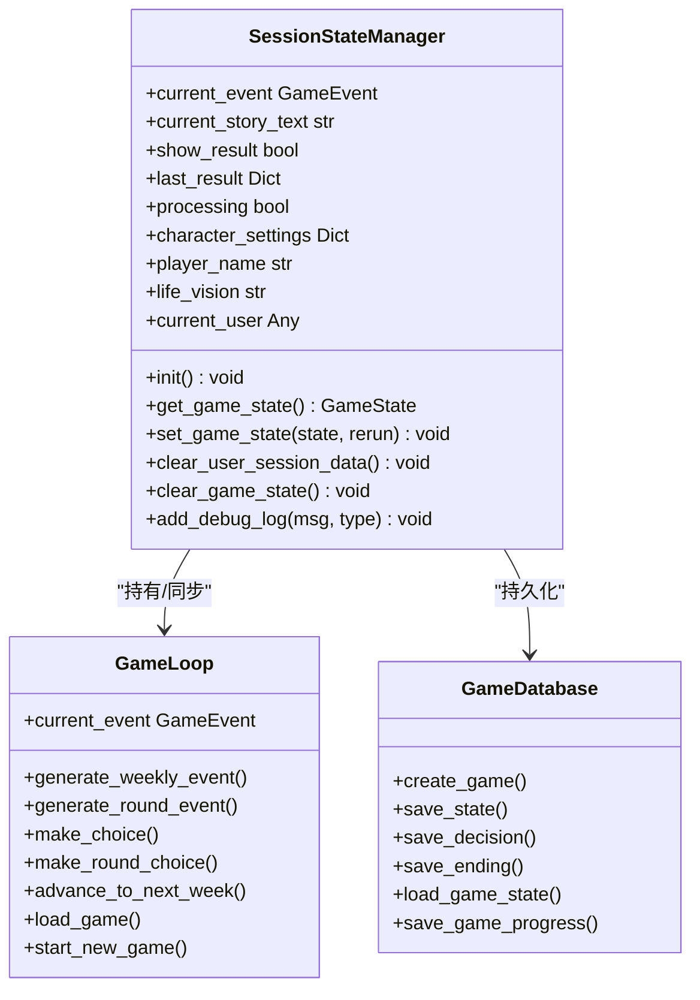
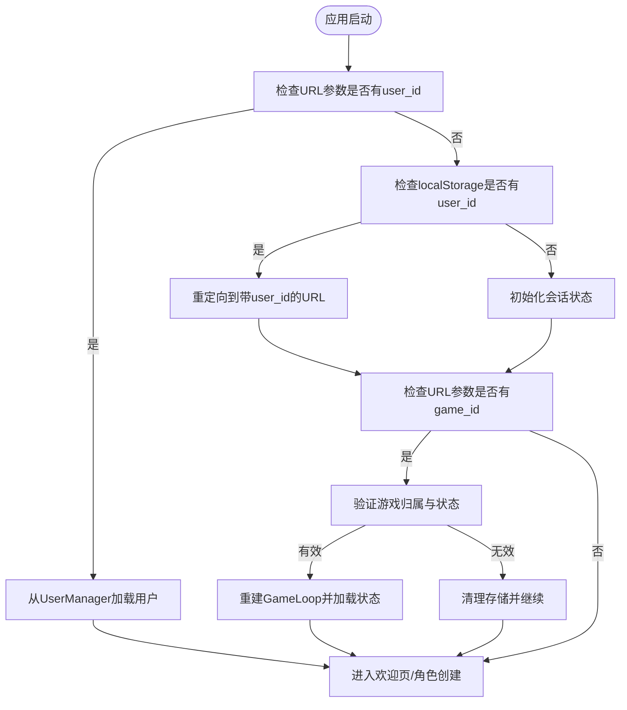
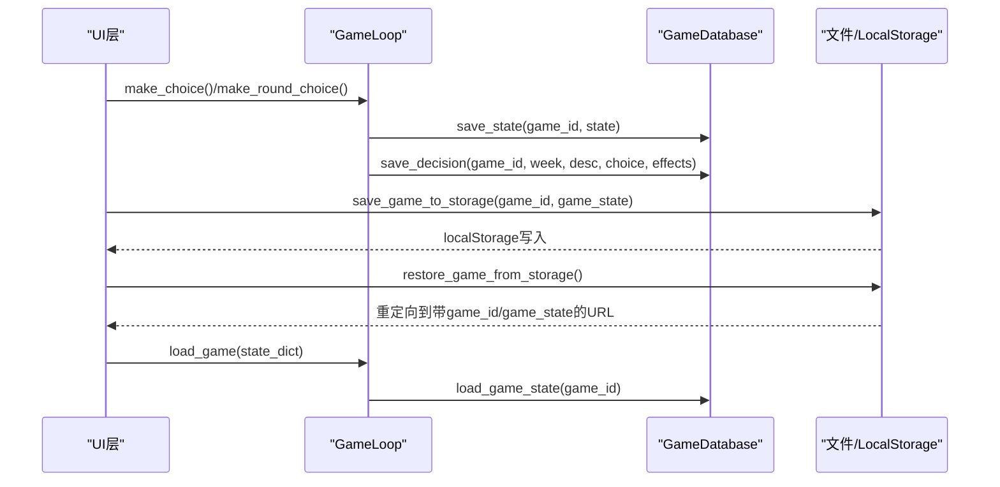
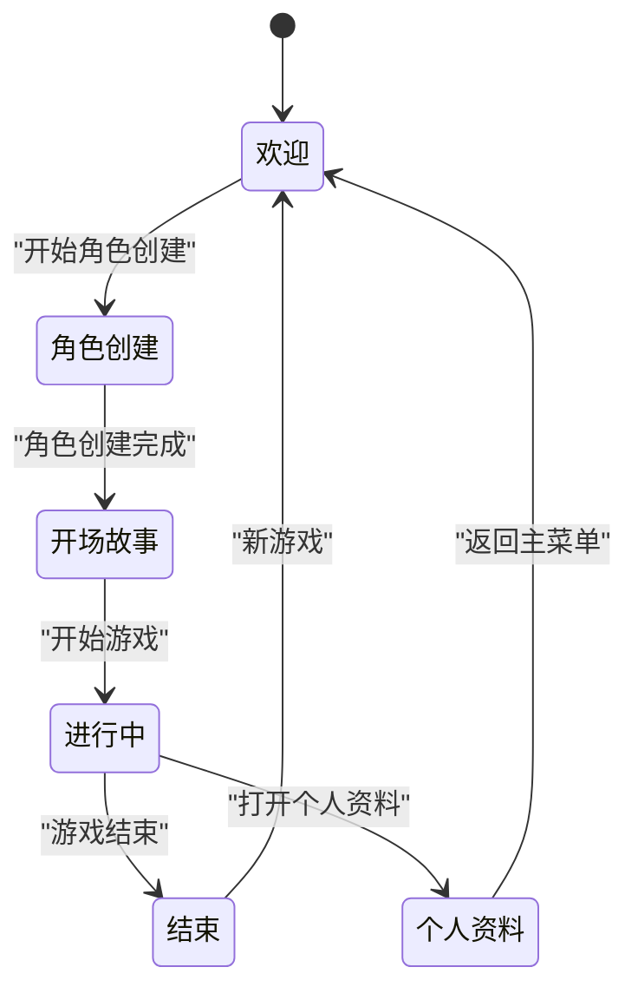
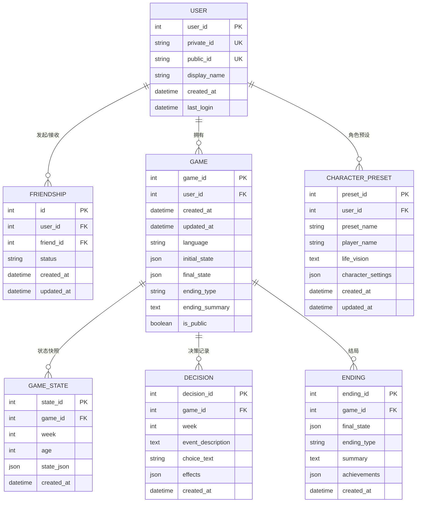
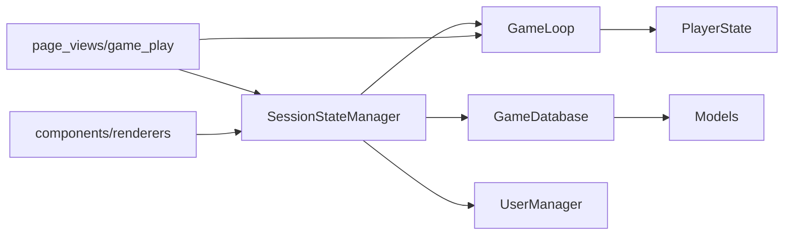

# 会话状态管理

<cite>
**本文档引用的文件**
- [src/ui/state_manager.py](file://src/ui/state_manager.py)
- [src/ui/session_manager.py](file://src/ui/session_manager.py)
- [src/game/state.py](file://src/game/state.py)
- [src/game/game_loop.py](file://src/game/game_loop.py)
- [src/database/db.py](file://src/database/db.py)
- [src/database/models.py](file://src/database/models.py)
- [src/database/user_manager.py](file://src/database/user_manager.py)
- [src/ui/streamlit_app.py](file://src/ui/streamlit_app.py)
- [src/ui/page_views/game_play.py](file://src/ui/page_views/game_play.py)
- [src/ui/components/renderers.py](file://src/ui/components/renderers.py)
- [src/ui/services/game_initializer.py](file://src/ui/services/game_initializer.py)
- [config/settings.py](file://config/settings.py)
</cite>

## 目录
1. [简介](#简介)
2. [项目结构](#项目结构)
3. [核心组件](#核心组件)
4. [架构总览](#架构总览)
5. [详细组件分析](#详细组件分析)
6. [依赖关系分析](#依赖关系分析)
7. [性能考虑](#性能考虑)
8. [故障排除指南](#故障排除指南)
9. [结论](#结论)
10. [附录](#附录)

## 简介
本文件系统性阐述该Streamlit应用的会话状态管理体系，覆盖状态初始化、用户状态恢复、游戏状态持久化、状态同步与备份恢复策略、调试模式监控与问题排查等方面。重点围绕状态管理器（SessionStateManager）的设计模式与状态转换逻辑，结合游戏循环（GameLoop）、数据库（GameDatabase）与UI渲染层的协作，形成统一、类型安全且可扩展的状态管理方案。

## 项目结构
该应用采用“UI层-状态管理层-业务逻辑层-数据持久层”的分层组织：
- UI层：入口脚本、页面视图、组件渲染器
- 状态管理层：集中式SessionStateManager，封装st.session_state访问
- 业务逻辑层：GameLoop负责游戏主循环、事件生成与决策处理
- 数据持久层：GameDatabase封装数据库操作，支持游戏状态快照与决策记录

图表来源
- [src/ui/streamlit_app.py](file://src/ui/streamlit_app.py#L139-L215)
- [src/ui/page_views/game_play.py](file://src/ui/page_views/game_play.py#L18-L67)
- [src/ui/components/renderers.py](file://src/ui/components/renderers.py#L277-L290)
- [src/ui/state_manager.py](file://src/ui/state_manager.py#L42-L76)
- [src/ui/session_manager.py](file://src/ui/session_manager.py#L9-L20)
- [src/game/game_loop.py](file://src/game/game_loop.py#L23-L60)
- [src/game/state.py](file://src/game/state.py#L244-L292)
- [src/database/db.py](file://src/database/db.py#L10-L16)
- [src/database/models.py](file://src/database/models.py#L61-L127)
- [src/database/user_manager.py](file://src/database/user_manager.py#L34-L46)

章节来源
- [src/ui/streamlit_app.py](file://src/ui/streamlit_app.py#L139-L215)
- [src/ui/state_manager.py](file://src/ui/state_manager.py#L42-L76)
- [src/game/game_loop.py](file://src/game/game_loop.py#L23-L60)
- [src/database/db.py](file://src/database/db.py#L10-L16)

## 核心组件
- SessionStateManager：集中式会话状态管理器，提供类型安全的getter/setter、初始化、清理与调试日志功能；统一current_event来源，确保事件状态一致性。
- GameLoop：游戏主循环，负责事件生成、决策处理、周推进与总结生成；维护PlayerState并持久化current_event数据。
- GameDatabase：数据库操作封装，支持状态快照、决策记录、结局保存与存档列表查询。
- PlayerState：玩家状态模型，包含资源、关系、角色、时间、回合、总结等完整游戏状态。
- UserManager：用户管理服务，支持用户创建、登录、好友系统与公开游戏查询。
- UI渲染层：页面视图与组件渲染器，负责事件展示、选项渲染、结果呈现与调试控制台。

章节来源
- [src/ui/state_manager.py](file://src/ui/state_manager.py#L42-L538)
- [src/game/game_loop.py](file://src/game/game_loop.py#L23-L151)
- [src/game/state.py](file://src/game/state.py#L244-L561)
- [src/database/db.py](file://src/database/db.py#L10-L517)
- [src/database/user_manager.py](file://src/database/user_manager.py#L34-L401)
- [src/ui/page_views/game_play.py](file://src/ui/page_views/game_play.py#L18-L67)

## 架构总览
状态管理采用“集中式状态+单一真相源”的设计：
- 单一真相源：current_event由GameLoop统一管理，SessionStateManager仅作为st.session_state的代理与类型安全接口。
- 类型安全：通过枚举GameState与属性装饰器，确保状态值域合法。
- 生命周期：应用启动时初始化状态，支持用户与游戏状态的URL/LocalStorage恢复，运行中实时持久化至数据库。

图表来源
- [src/ui/streamlit_app.py](file://src/ui/streamlit_app.py#L139-L159)
- [src/ui/state_manager.py](file://src/ui/state_manager.py#L587-L773)
- [src/game/game_loop.py](file://src/game/game_loop.py#L257-L298)
- [src/database/db.py](file://src/database/db.py#L48-L104)

## 详细组件分析

### 状态管理器（SessionStateManager）设计与实现
- 设计模式
  - 单例模式：全局唯一实例，通过工厂函数提供访问。
  - 代理模式：封装st.session_state，提供类型安全的属性访问与默认值初始化。
  - 统一真相源：current_event的读写统一委托给GameLoop，保证一致性。
- 初始化策略
  - 分类初始化：核心状态、事件状态、角色创建状态、多回合状态、用户状态、UI标志、调试状态。
  - 默认值注入：避免None值导致的分支异常，提升健壮性。
- 状态同步与清理
  - clear_user_session_data/clear_game_state：按需清理用户切换或重新开始游戏时的残留状态。
  - current_event同步：同时更新session_state与GameLoop，过渡期内保持兼容。
- 调试与可观测性
  - debug_logs：带时间戳的日志队列，上限100条，便于问题定位。

图表来源
- [src/ui/state_manager.py](file://src/ui/state_manager.py#L42-L538)
- [src/game/game_loop.py](file://src/game/game_loop.py#L23-L151)
- [src/database/db.py](file://src/database/db.py#L10-L517)

章节来源
- [src/ui/state_manager.py](file://src/ui/state_manager.py#L42-L538)

### 用户会话生命周期管理
- 用户登录与恢复
  - URL参数优先：优先从URL查询参数user_id恢复用户。
  - 本地存储回退：若URL无user_id，则通过localStorage读取并重定向补充URL参数。
  - 用户切换：clear_user_session_data清理当前用户的游戏会话数据。
- 游戏会话恢复
  - URL参数恢复：game_id与game_state，验证归属与有效性后重建GameLoop与状态。
  - 本地存储回退：通过localStorage重定向补充URL参数，避免跨设备/标签页丢失。
  - 状态一致性：恢复后同步current_event与current_story_text，清理结果与总结状态。

图表来源
- [src/ui/state_manager.py](file://src/ui/state_manager.py#L587-L773)
- [src/database/db.py](file://src/database/db.py#L145-L173)
- [src/database/user_manager.py](file://src/database/user_manager.py#L104-L127)

章节来源
- [src/ui/state_manager.py](file://src/ui/state_manager.py#L587-L773)
- [src/database/db.py](file://src/database/db.py#L145-L173)
- [src/database/user_manager.py](file://src/database/user_manager.py#L104-L127)

### 游戏状态持久化与同步机制
- 状态快照
  - save_state：按周保存GameState快照，支持断点续玩。
  - save_game_progress：更新最新状态并刷新更新时间。
- 决策记录
  - save_decision：记录每周事件描述、选项文本与效果，便于回溯与统计。
- 结局与成就
  - save_ending：保存最终状态、结局类型、总结与成就。
- 数据一致性
  - GameLoop.load_game：从数据库加载最新状态，恢复current_event与历史摘要。
  - PlayerState.to_dict/from_dict：Pydantic模型序列化/反序列化，确保字段完整性。

图表来源
- [src/ui/page_views/game_play.py](file://src/ui/page_views/game_play.py#L408-L466)
- [src/database/db.py](file://src/database/db.py#L48-L104)
- [src/ui/state_manager.py](file://src/ui/state_manager.py#L628-L773)

章节来源
- [src/ui/page_views/game_play.py](file://src/ui/page_views/game_play.py#L408-L466)
- [src/database/db.py](file://src/database/db.py#L48-L104)
- [src/ui/state_manager.py](file://src/ui/state_manager.py#L628-L773)

### 状态转换逻辑与UI路由
- 状态机
  - GameState枚举定义：欢迎、角色选项、角色创建、预设选择、保存预设、开场故事、进行中、结束、个人资料。
- 路由规则
  - 优先级：个人资料页 > 已保存游戏页 > 预设选择页 > 保存预设对话框 > 角色创建 > 开场故事 > 游戏进行 > 欢迎页。
- 多回合系统
  - use_multi_round控制是否启用多回合；每轮生成事件并流式展示故事续写；轮次结束后生成周总结与额外收益。

图表来源
- [src/ui/state_manager.py](file://src/ui/state_manager.py#L29-L40)
- [src/ui/streamlit_app.py](file://src/ui/streamlit_app.py#L175-L211)
- [src/ui/page_views/game_play.py](file://src/ui/page_views/game_play.py#L245-L274)

章节来源
- [src/ui/state_manager.py](file://src/ui/state_manager.py#L29-L40)
- [src/ui/streamlit_app.py](file://src/ui/streamlit_app.py#L175-L211)
- [src/ui/page_views/game_play.py](file://src/ui/page_views/game_play.py#L245-L274)

### 数据模型与关系
- 数据库模型
  - User/Friendship/Game/GameState/Decision/Ending/CharacterPreset：支持用户、好友、游戏会话、状态快照、决策记录、结局与角色预设。
- 关系映射
  - Game.user、Game.states、Game.decisions、User.games、User.sent_friend_requests等，确保级联删除与查询便利。

图表来源
- [src/database/models.py](file://src/database/models.py#L11-L144)

章节来源
- [src/database/models.py](file://src/database/models.py#L11-L144)

## 依赖关系分析
- 组件耦合
  - SessionStateManager与GameLoop强耦合：通过current_event统一真相源，避免分散更新。
  - SessionStateManager与GameDatabase弱耦合：仅在需要持久化时调用，降低耦合度。
- 外部依赖
  - Streamlit：st.session_state、st.query_params、st.components.v1.html用于状态与存储。
  - SQLAlchemy：ORM模型与会话管理。
  - Pydantic：PlayerState模型校验与序列化。
- 潜在循环依赖
  - 通过延迟导入（如GameDatabase/UserManager）避免循环导入。

图表来源
- [src/ui/state_manager.py](file://src/ui/state_manager.py#L78-L84)
- [src/game/game_loop.py](file://src/game/game_loop.py#L42-L56)
- [src/database/db.py](file://src/database/db.py#L13-L16)
- [src/database/user_manager.py](file://src/database/user_manager.py#L34-L46)

章节来源
- [src/ui/state_manager.py](file://src/ui/state_manager.py#L78-L84)
- [src/game/game_loop.py](file://src/game/game_loop.py#L42-L56)
- [src/database/db.py](file://src/database/db.py#L13-L16)
- [src/database/user_manager.py](file://src/database/user_manager.py#L34-L46)

## 性能考虑
- 状态快照频率
  - 建议在关键节点（周推进、结局保存）写入快照，避免过于频繁I/O。
- 流式渲染
  - 事件生成与故事续写采用流式回调，减少一次性渲染压力。
- 缓存与回放
  - 通过GameState表按周存储快照，支持快速回放与对比。
- 资源边界
  - PlayerState字段范围校验（MIN_RESOURCE/MAX_RESOURCE），防止异常状态导致计算开销。

## 故障排除指南
- 事件重复生成
  - 现象：脚本中断后再次生成相同事件。
  - 处理：SessionStateManager在生成前设置processing标志，生成后清除；GameLoop记录last_event_week避免重复。
- 选项不匹配
  - 现象：渲染选项与实际选项不一致。
  - 处理：process_choice前同步game_loop.current_event与session_state中的event，确保选项一致。
- 存储恢复失败
  - 现象：URL/LocalStorage恢复失败或权限不足。
  - 处理：restore_game_from_storage验证game_id归属与状态存在性，失败时清理存储并记录日志。
- 调试模式
  - 使用侧边栏Debug Console查看debug_logs，结合add_debug_log定位问题。

章节来源
- [src/ui/page_views/game_play.py](file://src/ui/page_views/game_play.py#L276-L381)
- [src/ui/page_views/game_play.py](file://src/ui/page_views/game_play.py#L468-L549)
- [src/ui/state_manager.py](file://src/ui/state_manager.py#L662-L773)
- [src/ui/components/renderers.py](file://src/ui/components/renderers.py#L277-L290)

## 结论
该状态管理体系通过集中式SessionStateManager实现了类型安全与单一真相源，结合GameLoop与GameDatabase的协同，提供了可靠的游戏状态持久化与恢复能力。多回合系统与流式渲染进一步提升了用户体验。建议在生产环境中：
- 明确状态变更点，减少不必要的快照写入；
- 在UI层统一通过SessionStateManager访问状态，避免直接操作st.session_state；
- 使用调试日志与错误捕获机制，持续优化状态一致性与性能表现。

## 附录
- 最佳实践
  - 使用get_state_manager()获取全局状态管理实例，避免重复构造。
  - 在事件生成与决策处理前后，确保current_event与session_state同步。
  - 定期清理临时状态（如show_result、last_result），避免内存膨胀。
- 配置要点
  - OPENAI_API_KEY、DATABASE_URL等环境变量需正确配置，否则初始化阶段会报错。
  - DEBUG_MODE开启后可在侧边栏查看调试日志。

章节来源
- [config/settings.py](file://config/settings.py#L30-L100)
- [src/ui/streamlit_app.py](file://src/ui/streamlit_app.py#L21-L41)
- [src/ui/components/renderers.py](file://src/ui/components/renderers.py#L277-L290)