# 样式与主题系统

<cite>
**本文档引用的文件**
- [styles.py](file://src/ui/styles.py)
- [streamlit_app.py](file://src/ui/streamlit_app.py)
- [renderers.py](file://src/ui/components/renderers.py)
- [state_manager.py](file://src/ui/state_manager.py)
- [config.toml](file://.streamlit/config.toml)
- [requirements.txt](file://requirements.txt)
- [Dockerfile](file://Dockerfile)
- [docker-compose.yml](file://docker-compose.yml)
- [docker-compose.prod.yml](file://docker-compose.prod.yml)
- [settings.py](file://config/settings.py)
</cite>

## 目录
1. [简介](#简介)
2. [项目结构](#项目结构)
3. [核心组件](#核心组件)
4. [架构概览](#架构概览)
5. [详细组件分析](#详细组件分析)
6. [依赖关系分析](#依赖关系分析)
7. [性能考虑](#性能考虑)
8. [故障排除指南](#故障排除指南)
9. [结论](#结论)

## 简介

本项目采用深度定制的样式与主题系统，为Streamlit应用提供了完整的视觉设计和样式定制机制。系统通过全局CSS注入、主题颜色配置、响应式布局设计等核心功能，实现了统一的视觉体验。

该样式系统的核心特点包括：
- **深色主题设计**：采用#0e1117作为主背景色，配合渐变色彩方案
- **组件级样式定制**：针对Streamlit各组件提供专门的样式适配
- **响应式布局支持**：适配不同屏幕尺寸的设备
- **动画效果集成**：包含淡入、脉冲、滑入等动画效果
- **下拉菜单优化**：解决默认浅色背景下的可读性问题

## 项目结构

项目采用模块化的样式架构，主要文件分布如下：

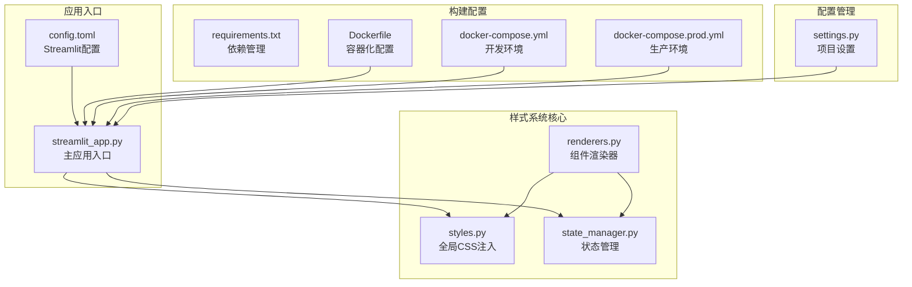

**图表来源**
- [styles.py](file://src/ui/styles.py#L1-L710)
- [streamlit_app.py](file://src/ui/streamlit_app.py#L1-L215)
- [renderers.py](file://src/ui/components/renderers.py#L1-L385)
- [state_manager.py](file://src/ui/state_manager.py#L1-L773)

**章节来源**
- [styles.py](file://src/ui/styles.py#L1-L710)
- [streamlit_app.py](file://src/ui/streamlit_app.py#L1-L215)

## 核心组件

### 全局样式注入器

样式系统的核心是`inject_custom_css()`函数，负责注入所有自定义CSS规则：

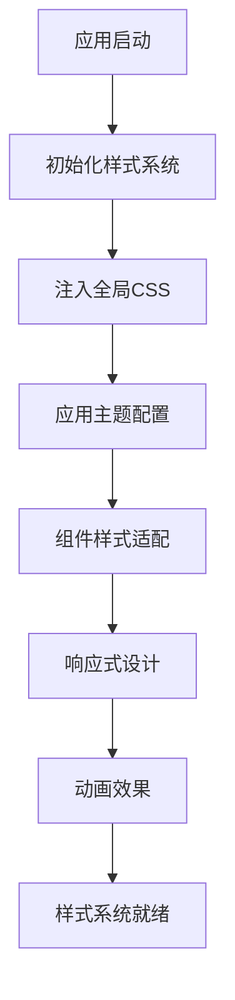

**图表来源**
- [styles.py](file://src/ui/styles.py#L5-L704)

### 主题颜色配置

系统采用统一的色彩方案，主要颜色包括：
- **主背景色**: #0e1117 (深蓝灰)
- **渐变色彩**: #667eea → #764ba2 (紫罗兰到深紫)
- **文字色彩**: #e2e8f0 (浅灰)、#ffffff (纯白)
- **强调色**: #a0aec0 (中灰)、#f0f0f0 (亮灰)

### 组件样式适配

针对Streamlit各组件提供专门的样式适配：

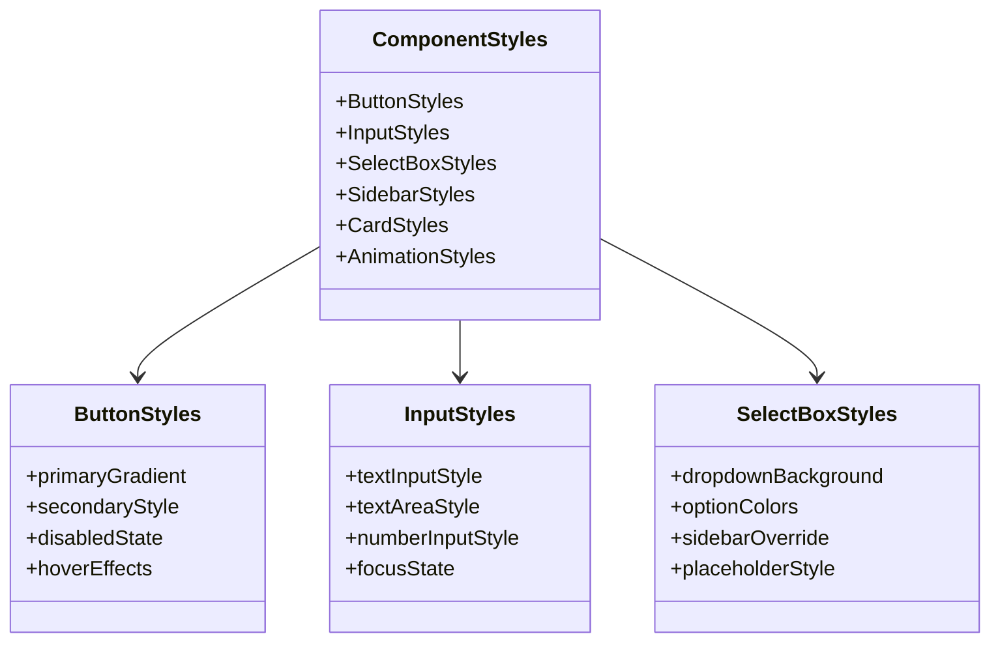

**图表来源**
- [styles.py](file://src/ui/styles.py#L135-L507)

**章节来源**
- [styles.py](file://src/ui/styles.py#L1-L710)

## 架构概览

样式系统的整体架构采用分层设计，确保代码的可维护性和扩展性：

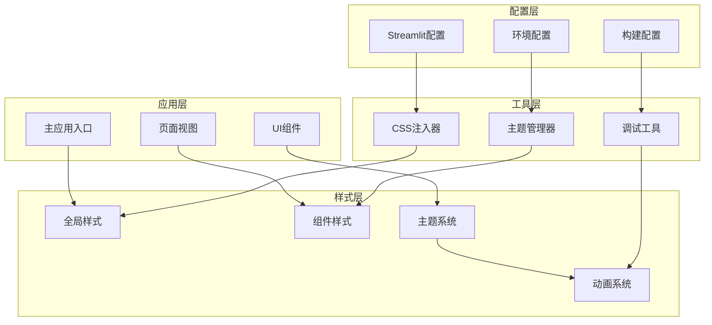

**图表来源**
- [streamlit_app.py](file://src/ui/streamlit_app.py#L139-L215)
- [styles.py](file://src/ui/styles.py#L5-L704)
- [state_manager.py](file://src/ui/state_manager.py#L42-L547)

## 详细组件分析

### CSS注入机制

样式系统通过`inject_custom_css()`函数实现全局CSS注入：

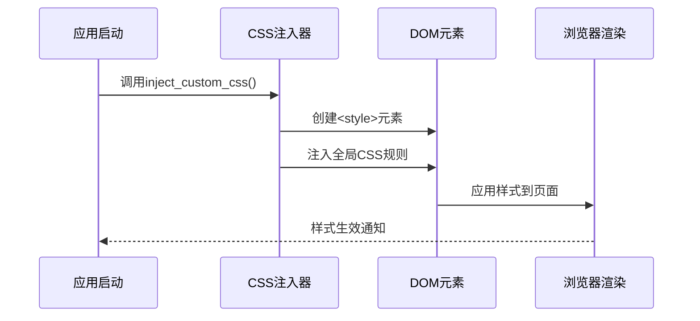

**图表来源**
- [styles.py](file://src/ui/styles.py#L5-L704)
- [streamlit_app.py](file://src/ui/streamlit_app.py#L139-L144)

### 主题颜色系统

系统实现了完整的颜色主题体系：

| 颜色类别 | 具体颜色 | 使用场景 |
|---------|---------|---------|
| 主背景色 | #0e1117 | 页面主背景 |
| 渐变起点 | #667eea | 按钮渐变起点 |
| 渐变终点 | #764ba2 | 按钮渐变终点 |
| 文字主色 | #e2e8f0 | 正文文字 |
| 标题颜色 | #ffffff | 标题文字 |
| 强调色彩 | #a0aec0 | 辅助文字 |
| 侧边栏色 | #2d3748 | 侧边栏背景 |

### 响应式设计实现

系统采用媒体查询实现响应式布局：

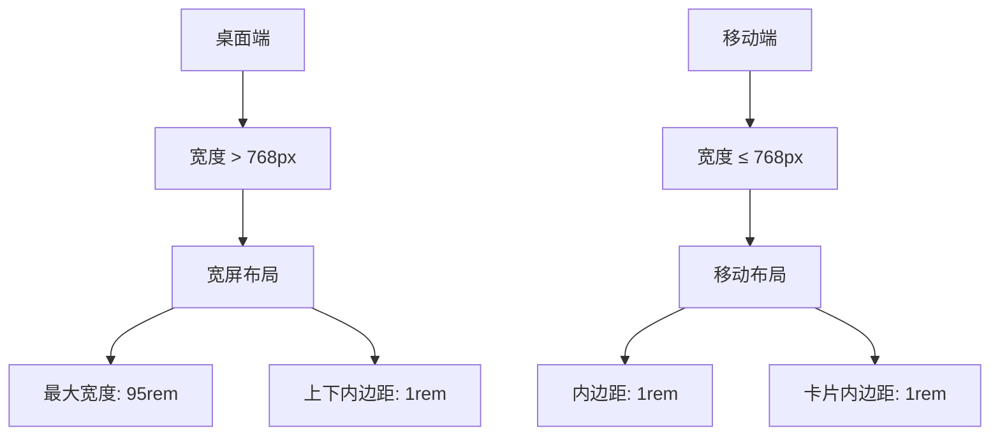

**图表来源**
- [styles.py](file://src/ui/styles.py#L693-L702)

### 动画效果系统

系统集成了多种CSS动画效果：

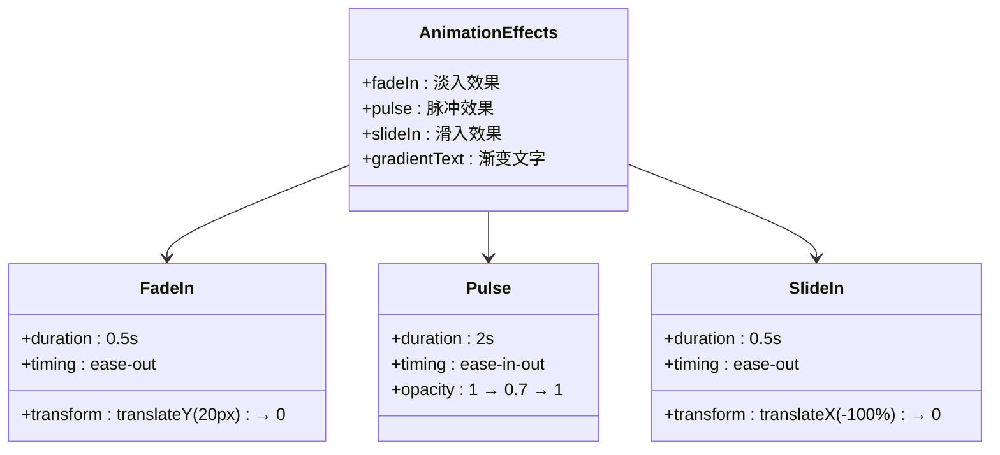

**图表来源**
- [styles.py](file://src/ui/styles.py#L540-L581)

**章节来源**
- [styles.py](file://src/ui/styles.py#L1-L710)

### 组件样式定制

针对不同Streamlit组件提供专门的样式适配：

#### 按钮组件样式

按钮组件采用统一的渐变设计：

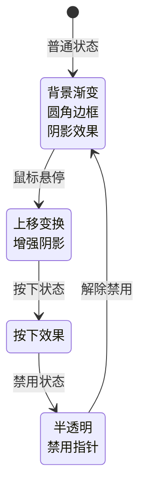

**图表来源**
- [styles.py](file://src/ui/styles.py#L135-L202)

#### 输入组件样式

输入组件提供统一的视觉风格：

| 组件类型 | 样式特征 | 特殊处理 |
|---------|---------|---------|
| TextInput | 圆角边框 淡色边框 焦点高亮 | 占位符浅色 |
| TextArea | 与TextInput相同 | 支持多行文本 |
| SelectBox | 自定义下拉菜单 | 侧边栏深色适配 |
| NumberInput | 数字输入专用 | 限制输入类型 |

**章节来源**
- [styles.py](file://src/ui/styles.py#L287-L507)
- [renderers.py](file://src/ui/components/renderers.py#L79-L143)

### 下拉菜单优化

系统特别优化了下拉菜单的可读性问题：

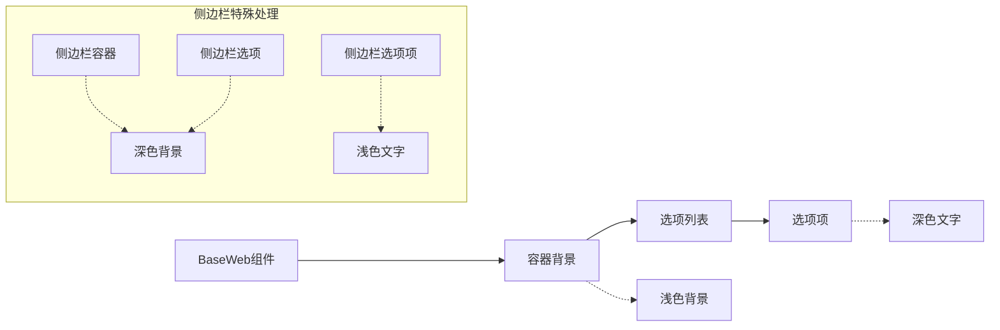

**图表来源**
- [styles.py](file://src/ui/styles.py#L316-L390)

**章节来源**
- [styles.py](file://src/ui/styles.py#L316-L390)

## 依赖关系分析

样式系统的依赖关系呈现清晰的层次结构：

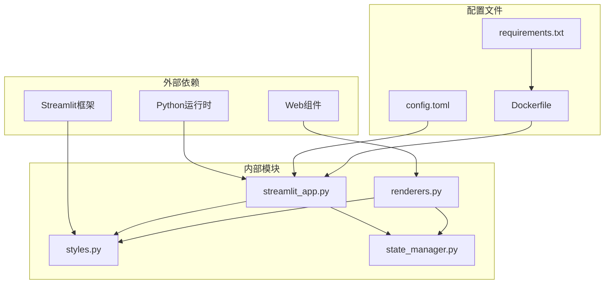

**图表来源**
- [streamlit_app.py](file://src/ui/streamlit_app.py#L1-L215)
- [styles.py](file://src/ui/styles.py#L1-L710)
- [requirements.txt](file://requirements.txt#L1-L9)

**章节来源**
- [streamlit_app.py](file://src/ui/streamlit_app.py#L1-L215)
- [requirements.txt](file://requirements.txt#L1-L9)

## 性能考虑

样式系统在性能方面采用了多项优化措施：

### CSS优化策略

1. **选择器优化**: 使用具体的选择器减少样式计算开销
2. **动画性能**: 优先使用transform和opacity属性
3. **渐变优化**: 使用硬件加速的渐变效果
4. **响应式媒体查询**: 仅在必要时应用响应式样式

### 运行时性能

- **一次性注入**: 样式在应用启动时一次性注入，避免重复计算
- **缓存机制**: 浏览器自动缓存CSS资源
- **最小化重绘**: 通过合理的样式组织减少页面重绘

### 内存管理

- **样式作用域**: 限定样式影响范围，避免全局污染
- **条件样式**: 仅在需要时应用复杂样式
- **清理机制**: 应用关闭时自动清理样式资源

## 故障排除指南

### 常见样式问题

#### 样式不生效

**症状**: 自定义样式未按预期显示

**排查步骤**:
1. 检查CSS注入是否成功执行
2. 验证选择器优先级
3. 确认样式作用域正确

**解决方案**:
- 确保`inject_custom_css()`在应用启动时调用
- 检查CSS选择器的特异性
- 验证样式是否被默认样式覆盖

#### 响应式布局问题

**症状**: 移动端显示异常

**排查步骤**:
1. 检查媒体查询语法
2. 验证断点设置
3. 确认容器宽度设置

**解决方案**:
- 调整媒体查询断点
- 检查容器最大宽度设置
- 验证移动端字体大小

#### 下拉菜单可读性问题

**症状**: 下拉菜单文字难以阅读

**排查步骤**:
1. 检查容器背景色对比度
2. 验证选项文字颜色
3. 确认侧边栏特殊处理

**解决方案**:
- 调整下拉菜单背景色
- 优化文字颜色对比度
- 确保侧边栏样式正确应用

### 调试工具

系统提供了多种调试工具：

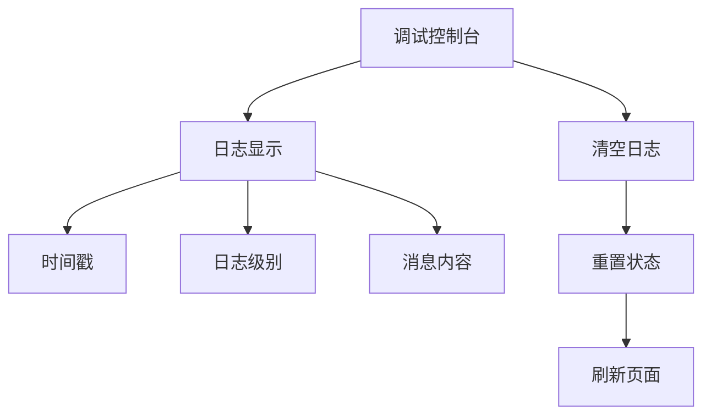

**图表来源**
- [renderers.py](file://src/ui/components/renderers.py#L277-L289)

**章节来源**
- [renderers.py](file://src/ui/components/renderers.py#L10-L289)

## 结论

本项目的样式与主题系统展现了高度的专业性和完整性。通过全局CSS注入、组件级样式定制、响应式设计和动画效果的有机结合，实现了统一而美观的视觉体验。

### 主要优势

1. **一致性**: 统一的颜色方案和设计语言
2. **可维护性**: 模块化的样式架构便于维护
3. **性能优化**: 采用多种优化策略提升运行效率
4. **可扩展性**: 留有充足的扩展空间

### 技术亮点

- 深度定制的深色主题设计
- 针对Streamlit组件的专门适配
- 完善的响应式布局支持
- 丰富的动画效果集成
- 专业的调试工具支持

该样式系统为类似的应用开发提供了优秀的参考模板，展示了如何在Streamlit环境中实现专业级的视觉设计和用户体验。