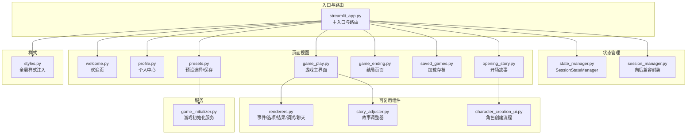
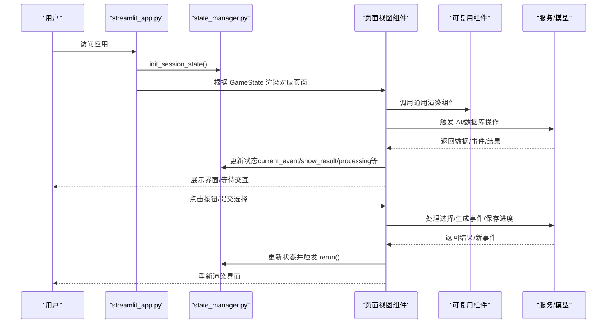
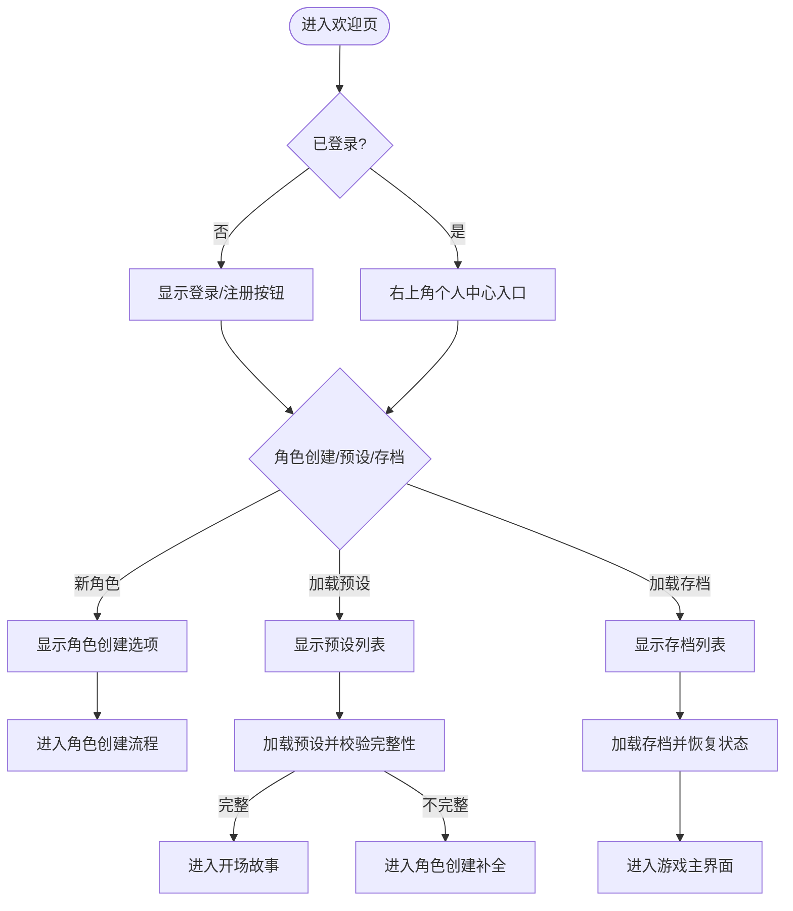
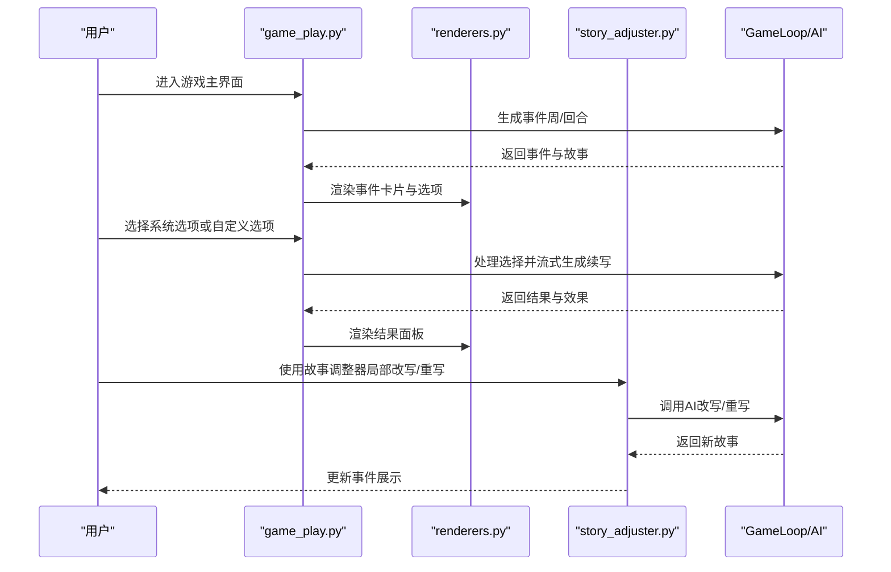
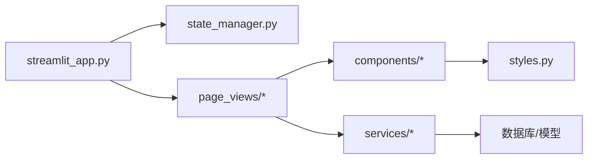

# 用户界面组件

<cite>
**本文引用的文件**
- [src/ui/streamlit_app.py](file://src/ui/streamlit_app.py)
- [src/ui/state_manager.py](file://src/ui/state_manager.py)
- [src/ui/session_manager.py](file://src/ui/session_manager.py)
- [src/ui/styles.py](file://src/ui/styles.py)
- [src/ui/page_views/welcome.py](file://src/ui/page_views/welcome.py)
- [src/ui/page_views/profile.py](file://src/ui/page_views/profile.py)
- [src/ui/page_views/game_play.py](file://src/ui/page_views/game_play.py)
- [src/ui/page_views/opening_story.py](file://src/ui/page_views/opening_story.py)
- [src/ui/page_views/game_ending.py](file://src/ui/page_views/game_ending.py)
- [src/ui/page_views/saved_games.py](file://src/ui/page_views/saved_games.py)
- [src/ui/page_views/presets.py](file://src/ui/page_views/presets.py)
- [src/ui/components/renderers.py](file://src/ui/components/renderers.py)
- [src/ui/components/story_adjuster.py](file://src/ui/components/story_adjuster.py)
- [src/ui/character_creation_ui.py](file://src/ui/character_creation_ui.py)
- [src/ui/services/game_initializer.py](file://src/ui/services/game_initializer.py)
</cite>

## 目录
1. [简介](#简介)
2. [项目结构](#项目结构)
3. [核心组件](#核心组件)
4. [架构总览](#架构总览)
5. [详细组件分析](#详细组件分析)
6. [依赖关系分析](#依赖关系分析)
7. [性能考量](#性能考量)
8. [故障排查指南](#故障排查指南)
9. [结论](#结论)
10. [附录](#附录)

## 简介
本文件系统性梳理 Streamlit 应用的用户界面组件，围绕页面视图组件（欢迎页、角色创建、游戏界面、结局页面）、可复用 UI 组件与样式体系、会话状态管理机制、用户交互流程、响应式设计与跨浏览器兼容性、无障碍与移动端适配等维度展开。目标是帮助开发者快速理解并扩展 UI 架构，同时为非技术读者提供清晰的使用指引。

## 项目结构
UI 子系统采用“页面视图 + 组件 + 状态管理 + 样式”的分层组织方式：
- 页面视图层：负责路由与页面级渲染（欢迎、角色创建、游戏、结局、档案、预设等）
- 组件层：可复用 UI 组件（事件渲染、选项渲染、结果展示、故事调整器、上下文聊天等）
- 状态管理层：统一的会话状态与 UI 状态管理（类型安全、集中初始化、持久化）
- 样式层：全局样式注入与主题定制（深色主题、动画、滚动条、响应式）

图表来源
- [src/ui/streamlit_app.py](file://src/ui/streamlit_app.py#L139-L211)
- [src/ui/state_manager.py](file://src/ui/state_manager.py#L29-L546)
- [src/ui/session_manager.py](file://src/ui/session_manager.py#L31-L65)
- [src/ui/page_views/welcome.py](file://src/ui/page_views/welcome.py#L11-L36)
- [src/ui/page_views/profile.py](file://src/ui/page_views/profile.py#L10-L30)
- [src/ui/page_views/opening_story.py](file://src/ui/page_views/opening_story.py#L11-L119)
- [src/ui/page_views/game_play.py](file://src/ui/page_views/game_play.py#L18-L66)
- [src/ui/page_views/game_ending.py](file://src/ui/page_views/game_ending.py#L8-L95)
- [src/ui/page_views/saved_games.py](file://src/ui/page_views/saved_games.py#L12-L50)
- [src/ui/page_views/presets.py](file://src/ui/page_views/presets.py#L15-L41)
- [src/ui/components/renderers.py](file://src/ui/components/renderers.py#L22-L143)
- [src/ui/components/story_adjuster.py](file://src/ui/components/story_adjuster.py#L10-L38)
- [src/ui/character_creation_ui.py](file://src/ui/character_creation_ui.py#L662-L800)
- [src/ui/services/game_initializer.py](file://src/ui/services/game_initializer.py#L49-L138)
- [src/ui/styles.py](file://src/ui/styles.py#L5-L704)

章节来源
- [src/ui/streamlit_app.py](file://src/ui/streamlit_app.py#L1-L215)
- [src/ui/state_manager.py](file://src/ui/state_manager.py#L1-L773)
- [src/ui/session_manager.py](file://src/ui/session_manager.py#L1-L65)
- [src/ui/styles.py](file://src/ui/styles.py#L1-L710)

## 核心组件
- 会话状态管理器（SessionStateManager）
  - 类型安全的全局状态接口，统一初始化、读取、设置与清理
  - 统一事件源（current_event）与多轮系统状态（周/回合/总结）
  - 用户态与 UI 标志位（如字符创建、预设选择、保存存档等）
- 页面视图组件
  - 欢迎页：用户入口、角色创建入口、预设加载、存档管理
  - 个人中心：登录/注册、好友系统、退出登录
  - 开场故事：角色设定生成后的首章故事流式展示
  - 游戏主界面：事件生成、选项展示、结果呈现、周/回合推进、剧情助手
  - 结局页面：统计与成就展示
  - 预设选择/保存：预设列表、加载、删除、保存为新预设
  - 加载存档：用户存档列表、加载、删除
- 可复用 UI 组件
  - renderers：事件卡片、选项按钮、结果面板、状态面板、调试控制台、上下文聊天
  - story_adjuster：局部改写与整段重写
  - character_creation_ui：角色创建步骤与关系人物生成
- 样式系统
  - 全局深色主题、动画、按钮/输入/下拉/表格/指标等组件样式
  - 响应式布局与滚动条美化

章节来源
- [src/ui/state_manager.py](file://src/ui/state_manager.py#L29-L546)
- [src/ui/page_views/welcome.py](file://src/ui/page_views/welcome.py#L11-L177)
- [src/ui/page_views/profile.py](file://src/ui/page_views/profile.py#L10-L183)
- [src/ui/page_views/opening_story.py](file://src/ui/page_views/opening_story.py#L11-L119)
- [src/ui/page_views/game_play.py](file://src/ui/page_views/game_play.py#L18-L662)
- [src/ui/page_views/game_ending.py](file://src/ui/page_views/game_ending.py#L8-L95)
- [src/ui/page_views/presets.py](file://src/ui/page_views/presets.py#L15-L425)
- [src/ui/page_views/saved_games.py](file://src/ui/page_views/saved_games.py#L12-L179)
- [src/ui/components/renderers.py](file://src/ui/components/renderers.py#L22-L384)
- [src/ui/components/story_adjuster.py](file://src/ui/components/story_adjuster.py#L10-L159)
- [src/ui/character_creation_ui.py](file://src/ui/character_creation_ui.py#L662-L800)
- [src/ui/styles.py](file://src/ui/styles.py#L5-L704)

## 架构总览
UI 架构以“路由 + 状态 + 组件”为核心，通过统一的状态管理器协调各页面与组件，确保状态一致性与可追踪性。

图表来源
- [src/ui/streamlit_app.py](file://src/ui/streamlit_app.py#L139-L211)
- [src/ui/state_manager.py](file://src/ui/state_manager.py#L67-L546)
- [src/ui/page_views/game_play.py](file://src/ui/page_views/game_play.py#L18-L662)
- [src/ui/components/renderers.py](file://src/ui/components/renderers.py#L64-L143)

## 详细组件分析

### 欢迎页（欢迎/角色创建/预设/存档）
- 功能要点
  - 用户入口：未登录显示登录/注册；已登录显示个人中心入口
  - 角色创建入口：新角色/加载预设两种路径
  - 预设选择：列出用户保存的预设，支持加载/删除
  - 存档管理：列出用户存档，支持加载/删除
- 交互逻辑
  - 通过状态标志（show_character_options/show_preset_selector/show_saved_games）控制显示
  - 加载预设后若设定不完整则进入角色创建流程
  - 加载存档后恢复事件与故事文本，进入游戏主界面

图表来源
- [src/ui/page_views/welcome.py](file://src/ui/page_views/welcome.py#L11-L177)
- [src/ui/page_views/presets.py](file://src/ui/page_views/presets.py#L15-L202)
- [src/ui/page_views/saved_games.py](file://src/ui/page_views/saved_games.py#L12-L179)

章节来源
- [src/ui/page_views/welcome.py](file://src/ui/page_views/welcome.py#L11-L177)
- [src/ui/page_views/presets.py](file://src/ui/page_views/presets.py#L15-L202)
- [src/ui/page_views/saved_games.py](file://src/ui/page_views/saved_games.py#L12-L179)

### 个人中心（Profile）
- 功能要点
  - 已登录：显示用户信息、退出登录、好友系统（添加/列表/请求）
  - 未登录：登录/注册切换、注册成功提示与私有ID保存
- 交互逻辑
  - 退出登录时清理用户会话与存储，返回欢迎页
  - 好友请求支持接受/拒绝

章节来源
- [src/ui/page_views/profile.py](file://src/ui/page_views/profile.py#L10-L183)

### 开场故事（Opening Story）
- 功能要点
  - 基于角色设定生成首章故事，支持流式展示
  - 缓存生成结果，避免重复计算
  - 进入游戏主界面（PLAYING）
- 交互逻辑
  - 若无角色设定则回退至欢迎页
  - 成功生成后进入 PLAYING 状态并持久化

章节来源
- [src/ui/page_views/opening_story.py](file://src/ui/page_views/opening_story.py#L11-L119)

### 游戏主界面（Game Play）
- 功能要点
  - 事件生成：按周/回合生成故事，支持多轮与单周模式
  - 选项展示：系统选项 + 自定义选项输入
  - 结果呈现：影响与总结展示，支持周总结与轮次小结
  - 周/回合推进：自动保存进度、生成总结
  - 剧情助手：上下文聊天，基于当前角色与事件
  - 故事调整器：局部改写与整段重写
- 交互逻辑
  - 选择选项后流式续写故事，应用效果并保存决策
  - 游戏结束时评估结局并展示统计与成就
  - 支持保存/主菜单返回

图表来源
- [src/ui/page_views/game_play.py](file://src/ui/page_views/game_play.py#L18-L662)
- [src/ui/components/renderers.py](file://src/ui/components/renderers.py#L64-L143)
- [src/ui/components/story_adjuster.py](file://src/ui/components/story_adjuster.py#L10-L159)

章节来源
- [src/ui/page_views/game_play.py](file://src/ui/page_views/game_play.py#L18-L662)
- [src/ui/components/renderers.py](file://src/ui/components/renderers.py#L64-L143)
- [src/ui/components/story_adjuster.py](file://src/ui/components/story_adjuster.py#L10-L159)

### 结局页面（Game Ending）
- 功能要点
  - 展示结局名称、总结与最终状态（能量/情绪/学识/财富/关系）
  - 成就列表展示
  - 新游戏按钮，清理状态并回到欢迎页
- 交互逻辑
  - 由游戏结束触发，保存结局数据

章节来源
- [src/ui/page_views/game_ending.py](file://src/ui/page_views/game_ending.py#L8-L95)

### 预设选择与保存（Presets）
- 功能要点
  - 列出用户保存的角色预设，支持加载/删除
  - 加载预设后若设定不完整则进入角色创建补全流程
  - 保存预设：仅保存或保存并开始游戏
- 交互逻辑
  - 加载成功后调用 GameInitializer 初始化游戏并进入开场故事

章节来源
- [src/ui/page_views/presets.py](file://src/ui/page_views/presets.py#L15-L425)
- [src/ui/services/game_initializer.py](file://src/ui/services/game_initializer.py#L49-L138)

### 加载存档（Saved Games）
- 功能要点
  - 列出用户存档，显示角色名、年龄、周数与更新时间
  - 支持加载与删除（二次确认）
- 交互逻辑
  - 加载成功后恢复事件与故事文本，进入游戏主界面

章节来源
- [src/ui/page_views/saved_games.py](file://src/ui/page_views/saved_games.py#L12-L179)

### 可复用 UI 组件
- renderers
  - 事件卡片：展示故事文本
  - 选项按钮：系统选项 + 自定义选项
  - 结果面板：展示结果与影响
  - 状态面板：侧边栏展示资源与关系
  - 调试控制台：查看/清理日志
  - 上下文聊天：基于当前角色与事件的剧情助手
- story_adjuster
  - 局部改写：指定段落与指令进行改写
  - 整段重写：基于上下文重新生成故事与选项
- character_creation_ui
  - 分步生成角色设定（时代/年龄/性别/世界/家庭/关系/特质/财富）
  - 关系人物逐一确认与总结生成
  - 支持反馈与重新生成

章节来源
- [src/ui/components/renderers.py](file://src/ui/components/renderers.py#L22-L384)
- [src/ui/components/story_adjuster.py](file://src/ui/components/story_adjuster.py#L10-L159)
- [src/ui/character_creation_ui.py](file://src/ui/character_creation_ui.py#L8-L800)

## 依赖关系分析
- 路由与状态
  - streamlit_app.py 作为主入口，根据 GameState 路由到各页面视图
  - 通过 get_state_manager() 获取统一状态实例，避免分散 st.session_state 访问
- 页面与组件
  - 游戏主界面依赖 renderers 与 story_adjuster 提供的通用 UI 能力
  - 预设与存档页面依赖 GameInitializer 与数据库服务
- 样式与主题
  - styles.py 注入全局样式，覆盖默认 Streamlit 样式，统一深色主题与动画

图表来源
- [src/ui/streamlit_app.py](file://src/ui/streamlit_app.py#L139-L211)
- [src/ui/state_manager.py](file://src/ui/state_manager.py#L67-L546)
- [src/ui/styles.py](file://src/ui/styles.py#L5-L704)

章节来源
- [src/ui/streamlit_app.py](file://src/ui/streamlit_app.py#L1-L215)
- [src/ui/state_manager.py](file://src/ui/state_manager.py#L1-L773)
- [src/ui/styles.py](file://src/ui/styles.py#L1-L710)

## 性能考量
- 事件与结果的流式渲染
  - 使用占位符与增量更新减少重绘开销
  - 事件生成与选择处理中设置 processing 标志，防止重复触发
- 状态持久化与恢复
  - URL 参数与 localStorage 双通道保存用户与游戏状态，提升断线重连体验
  - 游戏循环状态与事件文本缓存，避免重复计算
- 组件复用与懒加载
  - 通用渲染组件减少重复代码，提高维护效率
  - 预设/存档页面按需渲染，避免不必要的初始化

## 故障排查指南
- API 配置问题
  - 游戏初始化与事件生成依赖 OPENAI 等外部服务，若报错请检查环境变量与密钥配置
- 会话状态异常
  - 使用调试控制台查看日志，必要时清理 debug_logs
  - 通过 clear_user_session_data/clear_game_state 清理残留状态
- 断线重连
  - 检查 URL 参数与 localStorage 是否存在 user_id/game_id/game_state
  - 如异常，调用 clear_user_storage/clear_game_storage 清理后重试

章节来源
- [src/ui/page_views/game_play.py](file://src/ui/page_views/game_play.py#L369-L380)
- [src/ui/components/renderers.py](file://src/ui/components/renderers.py#L277-L289)
- [src/ui/state_manager.py](file://src/ui/state_manager.py#L552-L772)

## 结论
该 UI 架构通过统一的状态管理器与清晰的页面视图分层，实现了高内聚、低耦合的组件体系。配合可复用 UI 组件与完善的样式系统，既保证了开发效率，又提升了用户体验。建议后续在无障碍与移动端适配上进一步细化，以覆盖更广泛的用户群体。

## 附录
- 响应式设计与跨浏览器兼容
  - 使用宽屏布局与媒体查询适配移动端
  - 深色主题与统一色彩体系减少视觉差异
- 无障碍访问与移动端适配
  - 建议：为按钮与输入控件补充语义化标签与键盘导航支持；优化触摸目标尺寸与间距；提供高对比度模式开关
- 扩展指南与自定义样式方法
  - 新增页面：在 streamlit_app.py 的路由中新增分支，使用 get_state_manager() 管理状态
  - 新增组件：遵循 renderers 的模式，提供类型安全的状态读写与最小化副作用
  - 自定义样式：在 styles.py 中扩展 CSS，优先使用现有类名（如 card、option-button、fade-in），避免破坏整体风格