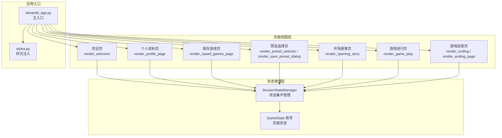
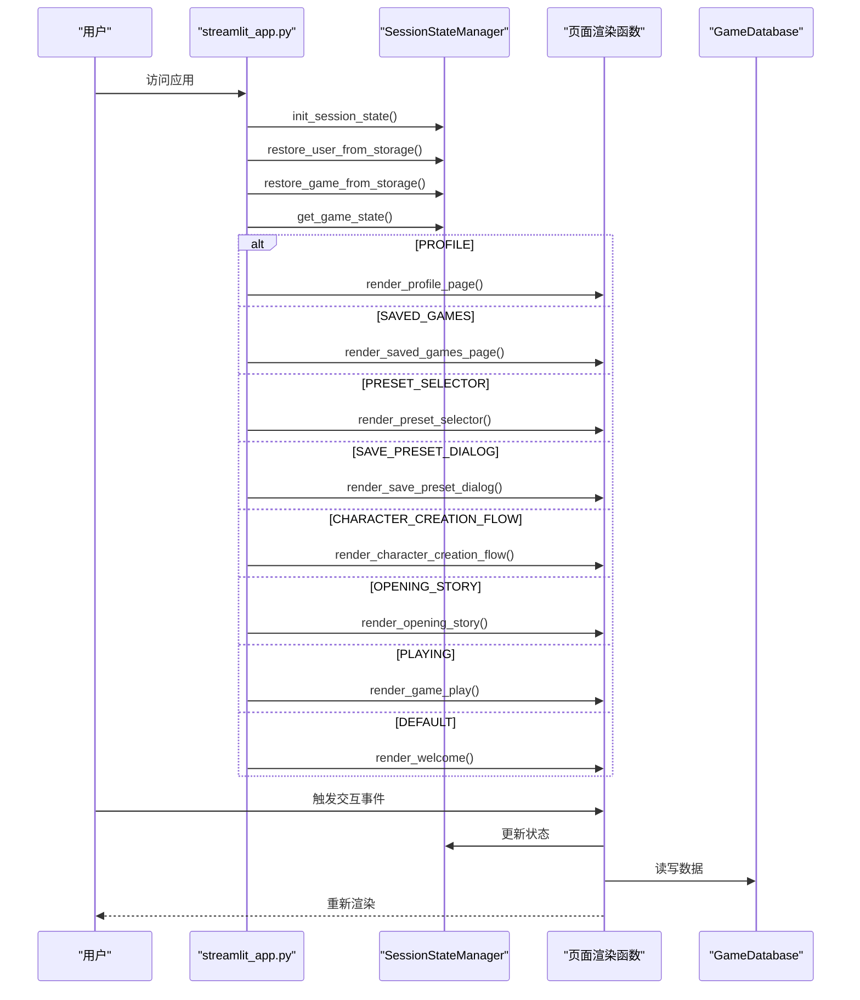
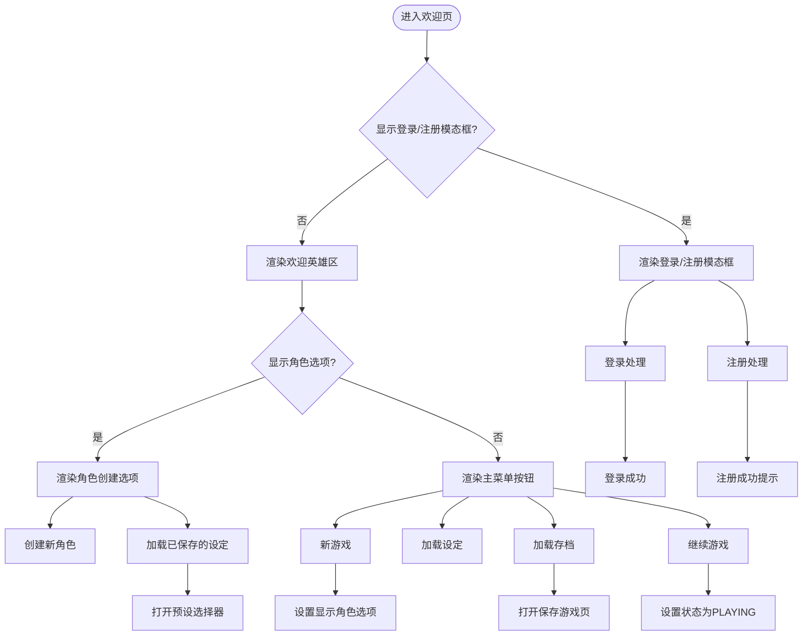
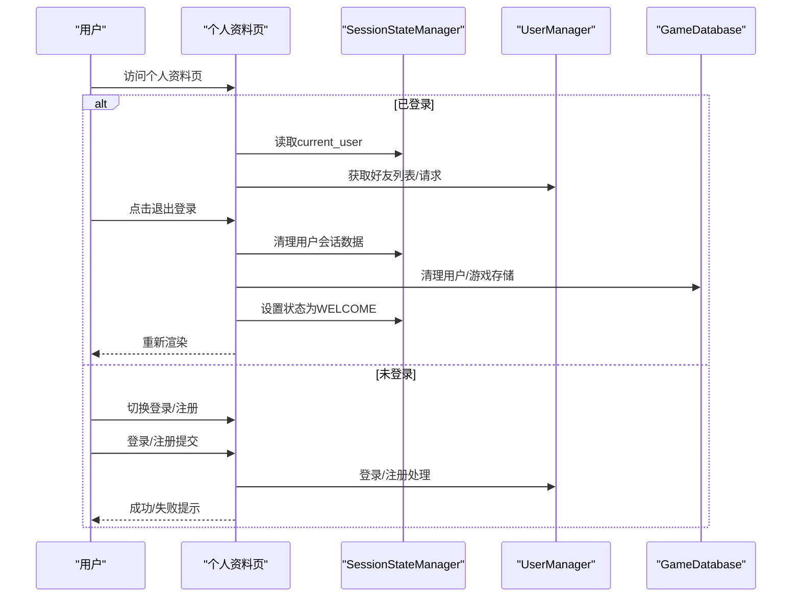
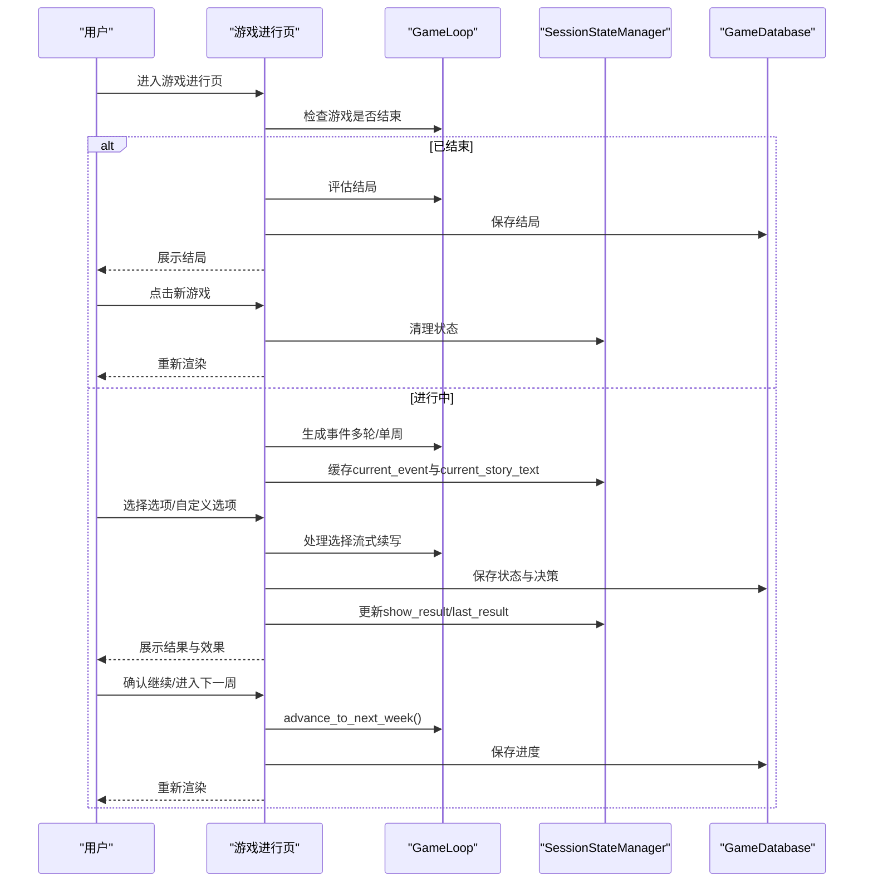
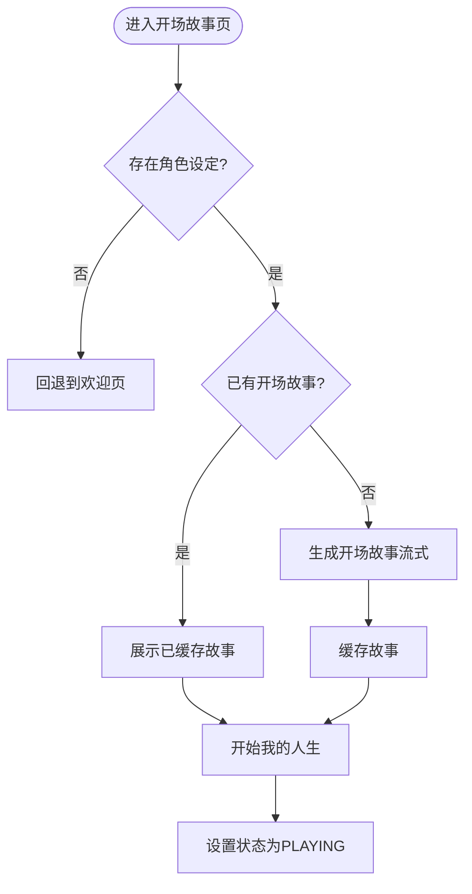
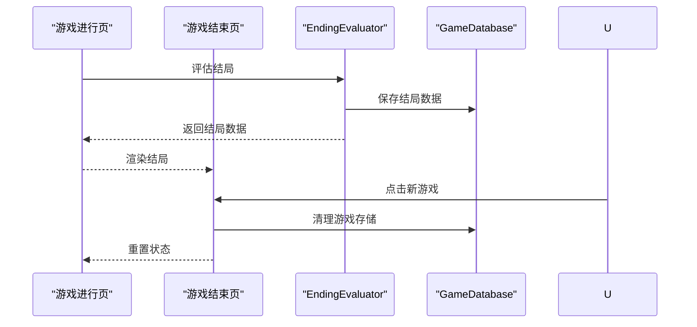
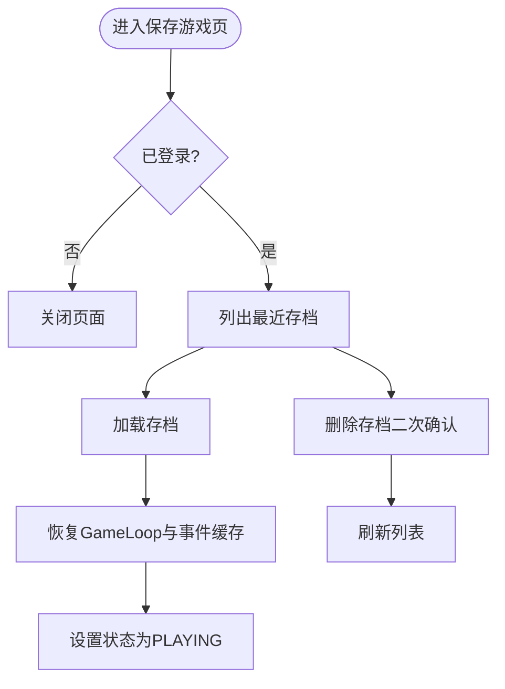
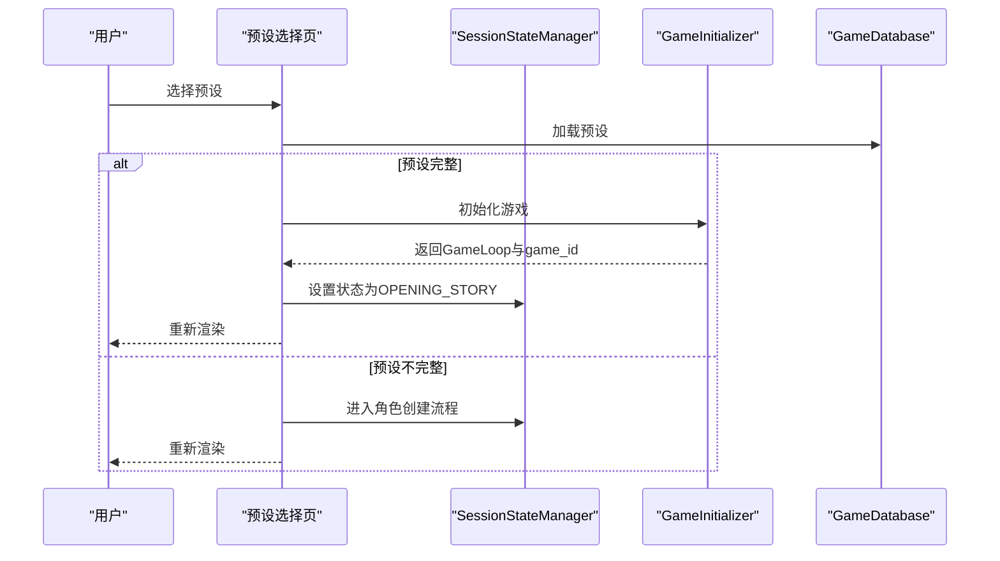
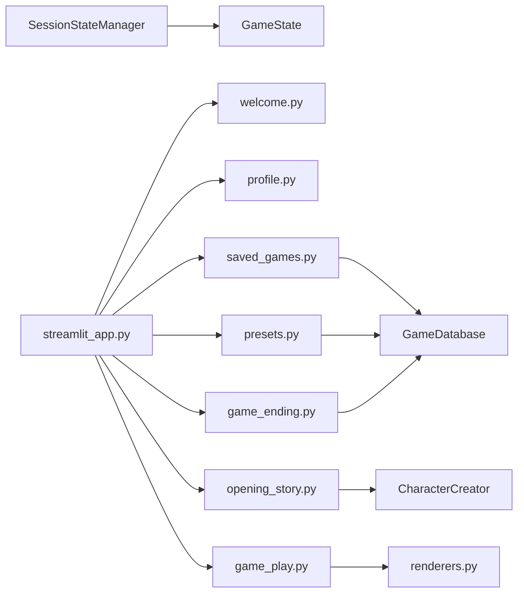

# 页面视图组件

<cite>
**本文引用的文件**
- [page_views/__init__.py](file://src/ui/page_views/__init__.py)
- [page_views/welcome.py](file://src/ui/page_views/welcome.py)
- [page_views/profile.py](file://src/ui/page_views/profile.py)
- [page_views/game_play.py](file://src/ui/page_views/game_play.py)
- [page_views/opening_story.py](file://src/ui/page_views/opening_story.py)
- [page_views/game_ending.py](file://src/ui/page_views/game_ending.py)
- [page_views/saved_games.py](file://src/ui/page_views/saved_games.py)
- [page_views/presets.py](file://src/ui/page_views/presets.py)
- [state_manager.py](file://src/ui/state_manager.py)
- [session_manager.py](file://src/ui/session_manager.py)
- [streamlit_app.py](file://src/ui/streamlit_app.py)
- [styles.py](file://src/ui/styles.py)
- [renderers.py](file://src/ui/components/renderers.py)
- [character_creation_ui.py](file://src/ui/character_creation_ui.py)
</cite>

## 目录
1. [简介](#简介)
2. [项目结构](#项目结构)
3. [核心组件](#核心组件)
4. [架构总览](#架构总览)
5. [详细组件分析](#详细组件分析)
6. [依赖关系分析](#依赖关系分析)
7. [性能考虑](#性能考虑)
8. [故障排查指南](#故障排查指南)
9. [结论](#结论)

## 简介
本文件系统性梳理了该Streamlit应用的页面视图组件，覆盖欢迎页、个人资料页、游戏进行页、开场故事页、游戏结束页、保存游戏页、预设选择页等核心页面。重点阐述各页面的状态管理、用户交互流程、数据绑定机制、页面间导航逻辑与状态转换规则，并给出参数配置、事件处理与错误处理策略，以及响应式布局与移动端适配方案。

## 项目结构
页面视图组件位于 `src/ui/page_views/` 目录，采用按功能模块划分的组织方式：
- 欢迎页：提供主菜单、角色创建入口、登录/注册、预设加载、存档加载等功能
- 个人资料页：用户中心，支持登录/注册、好友系统、登出
- 游戏进行页：事件展示、选项选择、结果呈现、上下文聊天、周/年度总结
- 开场故事页：角色设定完成后的故事开篇，支持流式展示
- 游戏结束页：结局评估与统计展示
- 保存游戏页：用户存档列表与操作
- 预设选择页：角色预设的加载、删除与保存

**图表来源**
- [streamlit_app.py](file://src/ui/streamlit_app.py#L139-L211)
- [page_views/__init__.py](file://src/ui/page_views/__init__.py#L1-L20)
- [state_manager.py](file://src/ui/state_manager.py#L29-L40)

**章节来源**
- [page_views/__init__.py](file://src/ui/page_views/__init__.py#L1-L20)
- [streamlit_app.py](file://src/ui/streamlit_app.py#L139-L211)

## 核心组件
- 页面渲染函数：每个页面均以独立函数导出，统一由应用入口根据状态分发调用
- 状态管理：通过集中式SessionStateManager统一管理会话状态，确保类型安全与一致性
- 用户系统：登录/注册、好友系统、用户持久化（URL参数与localStorage）
- 数据库接口：角色预设、游戏进度、结局信息的读写
- UI组件：事件渲染、选项渲染、结果展示、上下文聊天、调试控制台

**章节来源**
- [state_manager.py](file://src/ui/state_manager.py#L42-L536)
- [session_manager.py](file://src/ui/session_manager.py#L31-L65)
- [renderers.py](file://src/ui/components/renderers.py#L22-L385)

## 架构总览
应用采用“状态机路由 + 组件化渲染”的架构模式：
- 应用入口负责初始化数据库、注入样式、恢复用户与游戏状态
- 根据当前GameState决定渲染哪个页面
- 页面内部通过SessionStateManager读取/更新状态，触发st.rerun刷新
- 游戏进行页贯穿事件生成、选项处理、结果展示、周/年度总结、结局评估

**图表来源**
- [streamlit_app.py](file://src/ui/streamlit_app.py#L139-L211)
- [state_manager.py](file://src/ui/state_manager.py#L215-L244)

**章节来源**
- [streamlit_app.py](file://src/ui/streamlit_app.py#L139-L211)

## 详细组件分析

### 欢迎页（render_welcome）
- 功能要点
  - 登录/注册模态框：支持登录/注册切换、私有ID校验、注册成功提示与私有ID展示
  - 用户入口按钮：未登录显示登录/注册；已登录显示用户头像按钮，点击跳转个人资料页
  - 主菜单按钮：新游戏、加载设定、加载存档（需登录）、继续游戏（存在进行中游戏时）
  - 角色创建入口：提供“创建新角色”和“加载已保存的设定”
- 状态管理
  - 通过SessionStateManager维护show_auth_modal、show_character_options、character_creation、show_preset_selector、show_save_preset等标志位
  - 通过get_state_manager().set_game_state切换页面状态
- 交互流程
  - 登录/注册成功后清理用户会话数据并保存用户ID至存储
  - 选择“创建新角色”时清理旧状态，重置角色创建步骤索引
  - 选择“加载已保存的设定”时打开预设选择器
- 错误处理
  - 私有ID不存在时提示错误
  - 注册异常捕获并提示失败原因

**图表来源**
- [page_views/welcome.py](file://src/ui/page_views/welcome.py#L11-L177)

**章节来源**
- [page_views/welcome.py](file://src/ui/page_views/welcome.py#L11-L177)
- [state_manager.py](file://src/ui/state_manager.py#L215-L244)

### 个人资料页（render_profile_page）
- 功能要点
  - 已登录：显示用户信息、退出登录、好友系统（添加好友、好友列表、好友请求）
  - 未登录：登录/注册切换、登录/注册表单、注册成功提示
- 状态管理
  - 通过SessionStateManager维护current_user、show_login_tab、show_auth_modal等
  - 登录成功后保存用户ID至存储并返回欢迎页
- 交互流程
  - 退出登录时清理用户会话数据、用户存储与游戏存储，回到欢迎页
  - 好友请求接受/拒绝通过UserManager调用并刷新
- 错误处理
  - 登录失败提示私有ID不存在
  - 注册异常捕获并提示失败原因

**图表来源**
- [page_views/profile.py](file://src/ui/page_views/profile.py#L10-L184)

**章节来源**
- [page_views/profile.py](file://src/ui/page_views/profile.py#L10-L184)
- [state_manager.py](file://src/ui/state_manager.py#L412-L435)

### 游戏进行页（render_game_play）
- 功能要点
  - 控制栏：保存（登录且有game_id时可用）、返回主菜单
  - 上方最近一年总结：可关闭
  - 结果展示：选项处理后的结果与效果说明
  - 事件展示：事件生成（支持多轮/单周）、故事调整器、选项渲染
  - 周/年度总结：每周总结与额外收益、年度总结生成
  - 结束检测：游戏结束时评估结局并提供“新游戏”按钮
- 状态管理
  - processing防重复生成与处理
  - show_result/last_result/current_event/current_story_text/result处理
  - last_summary/round_summary/weekly_summary_data/showing_weekly_summary
  - use_multi_round控制多轮系统
- 交互流程
  - 事件生成：通过streaming回调逐步展示故事
  - 选项处理：支持系统选项与自定义选项，流式展示续写
  - 总结生成：生成年度总结并缓存
  - 结束评估：生成结局统计并保存至数据库
- 错误处理
  - 事件生成失败时清理processing并提示错误
  - 选项处理异常时恢复current_event并抛出

**图表来源**
- [page_views/game_play.py](file://src/ui/page_views/game_play.py#L18-L662)

**章节来源**
- [page_views/game_play.py](file://src/ui/page_views/game_play.py#L18-L662)
- [renderers.py](file://src/ui/components/renderers.py#L79-L144)

### 开场故事页（render_opening_story）
- 功能要点
  - 隐藏默认头部与浮动输入，仅展示故事内容
  - 支持从session_state恢复已生成故事，避免重复生成
  - 流式展示开场故事，失败时回退到模板故事
  - 完成后跳转到PLAYING状态
- 状态管理
  - opening_story缓存
  - set_game_state切换到PLAYING
- 交互流程
  - 无角色设定则回退到欢迎页
  - 已有故事直接展示；否则生成并缓存
  - 点击“开始我的人生”后清理事件缓存并进入PLAYING

**图表来源**
- [page_views/opening_story.py](file://src/ui/page_views/opening_story.py#L11-L120)

**章节来源**
- [page_views/opening_story.py](file://src/ui/page_views/opening_story.py#L11-L120)

### 游戏结束页（render_ending / render_ending_page）
- 功能要点
  - 展示结局名称、总结、最终状态（精力、情绪、学识、财富、关系）
  - 展示成就列表
  - “新游戏”按钮清理状态并重新开始
- 状态管理
  - 通过EndingEvaluator评估结局并保存至数据库
  - ending_processing防重复点击
- 交互流程
  - 游戏结束后自动评估并展示结局
  - 点击“新游戏”清理游戏状态并回到PLAYING之前的准备阶段

**图表来源**
- [page_views/game_ending.py](file://src/ui/page_views/game_ending.py#L8-L96)

**章节来源**
- [page_views/game_ending.py](file://src/ui/page_views/game_ending.py#L8-L96)

### 保存游戏页（render_saved_games_page）
- 功能要点
  - 仅登录用户可见；展示最近存档列表
  - 支持加载与删除存档；删除需二次确认
  - 加载后恢复GameLoop状态与事件缓存
- 状态管理
  - show_saved_games控制页面显示
  - 加载后清理结果与总结状态
- 交互流程
  - 列表为空时提示“暂无存档”
  - 加载成功后设置状态为PLAYING并保存到存储

**图表来源**
- [page_views/saved_games.py](file://src/ui/page_views/saved_games.py#L12-L180)

**章节来源**
- [page_views/saved_games.py](file://src/ui/page_views/saved_games.py#L12-L180)

### 预设选择页（render_preset_selector / render_save_preset_dialog）
- 功能要点
  - 预设选择：列出用户保存的角色预设，支持加载与删除
  - 保存预设：输入预设名称，支持仅保存或保存并开始游戏
  - 加载后若预设不完整则进入角色创建流程
- 状态管理
  - show_preset_selector/show_save_preset控制页面显示
  - preset_loading防止重复操作
- 交互流程
  - 选择预设后加载并初始化GameLoop，或进入角色创建
  - 保存预设后可直接开始游戏

**图表来源**
- [page_views/presets.py](file://src/ui/page_views/presets.py#L15-L425)

**章节来源**
- [page_views/presets.py](file://src/ui/page_views/presets.py#L15-L425)

## 依赖关系分析
- 页面视图与状态管理
  - 各页面通过get_state_manager()访问统一状态，避免分散的st.session_state直接操作
  - GameState枚举作为状态机的唯一来源，保证状态转换的类型安全
- 页面视图与组件
  - 游戏进行页依赖renderers.py中的事件/选项/结果/上下文聊天组件
  - 开场故事页依赖CharacterCreator生成故事
- 页面视图与数据库
  - 保存游戏页、预设选择页、游戏结束页均依赖GameDatabase进行读写
- 应用入口与页面视图
  - streamlit_app.py根据GameState路由到对应页面渲染函数

**图表来源**
- [streamlit_app.py](file://src/ui/streamlit_app.py#L13-L18)
- [state_manager.py](file://src/ui/state_manager.py#L29-L40)

**章节来源**
- [streamlit_app.py](file://src/ui/streamlit_app.py#L13-L18)
- [state_manager.py](file://src/ui/state_manager.py#L29-L40)

## 性能考虑
- 流式渲染
  - 事件生成与故事续写采用streaming回调，逐步更新UI，提升感知性能
- 防重复处理
  - processing标志位防止脚本中断导致的重复生成与处理
- 缓存策略
  - opening_story、current_event、current_story_text等关键数据缓存于session_state，避免重复计算
- 存储优化
  - 仅在必要时保存状态与决策，减少数据库压力
- 响应式布局
  - styles.py提供媒体查询，针对移动端进行适配（如侧边栏隐藏、按钮列布局）

[本节为通用指导，无需特定文件引用]

## 故障排查指南
- 登录/注册失败
  - 检查私有ID是否存在；注册异常查看错误提示
- 事件生成失败
  - 检查OPENAI_API_KEY配置；查看错误日志与traceback
- 选项处理异常
  - 查看备份事件是否恢复；确认processing标志位被正确清理
- 存档加载失败
  - 检查game_id与用户权限；确认数据库连接正常
- 预设加载不完整
  - 进入角色创建流程补齐缺失设定

**章节来源**
- [page_views/game_play.py](file://src/ui/page_views/game_play.py#L369-L381)
- [page_views/presets.py](file://src/ui/page_views/presets.py#L137-L142)
- [renderers.py](file://src/ui/components/renderers.py#L277-L290)

## 结论
该应用通过集中式状态管理与组件化页面渲染，实现了清晰的状态机路由与流畅的用户交互体验。各页面职责明确、状态转换规范、错误处理完备，并提供了良好的响应式布局与移动端适配。建议在后续迭代中进一步完善调试控制台与日志记录，增强开发与运维效率。