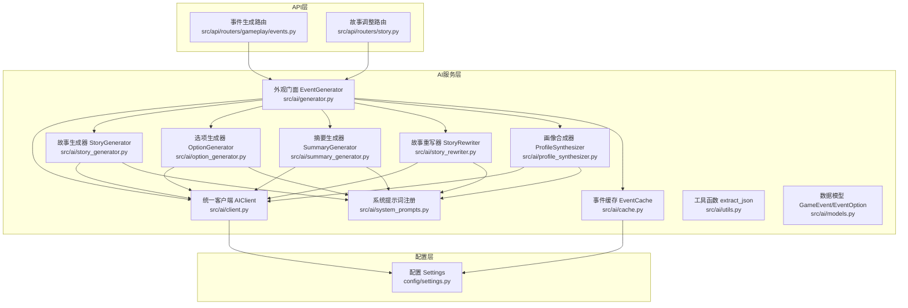
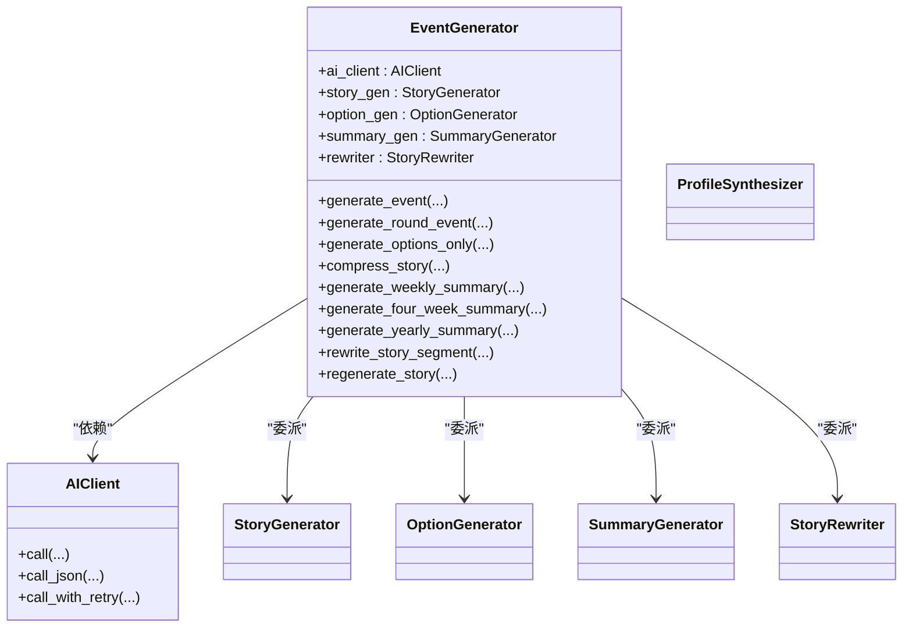
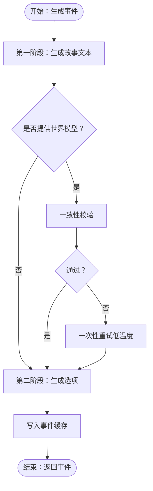
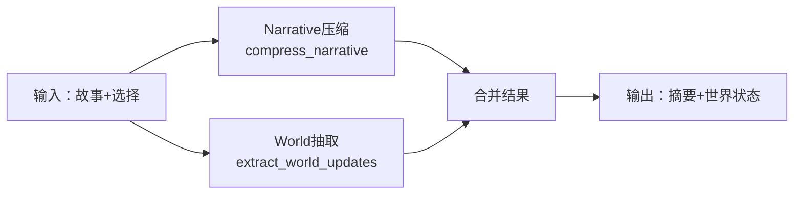
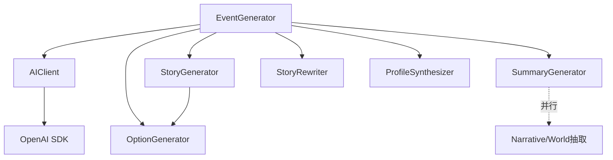

# AI服务集成架构

<cite>
**本文档引用的文件**
- [src/ai/__init__.py](file://src/ai/__init__.py)
- [src/ai/client.py](file://src/ai/client.py)
- [src/ai/generator.py](file://src/ai/generator.py)
- [src/ai/story_generator.py](file://src/ai/story_generator.py)
- [src/ai/option_generator.py](file://src/ai/option_generator.py)
- [src/ai/summary_generator.py](file://src/ai/summary_generator.py)
- [src/ai/story_rewriter.py](file://src/ai/story_rewriter.py)
- [src/ai/profile_synthesizer.py](file://src/ai/profile_synthesizer.py)
- [src/ai/cache.py](file://src/ai/cache.py)
- [src/ai/models.py](file://src/ai/models.py)
- [src/ai/system_prompts.py](file://src/ai/system_prompts.py)
- [src/ai/utils.py](file://src/ai/utils.py)
- [config/settings.py](file://config/settings.py)
- [src/api/routers/gameplay/events.py](file://src/api/routers/gameplay/events.py)
- [src/api/routers/story.py](file://src/api/routers/story.py)
</cite>

## 目录
1. [简介](#简介)
2. [项目结构](#项目结构)
3. [核心组件](#核心组件)
4. [架构总览](#架构总览)
5. [详细组件分析](#详细组件分析)
6. [依赖关系分析](#依赖关系分析)
7. [性能考虑](#性能考虑)
8. [故障排除指南](#故障排除指南)
9. [结论](#结论)
10. [附录](#附录)

## 简介
本文件面向“人生草稿本”项目的AI服务集成，系统化阐述AI服务的整体架构设计与实现要点，重点覆盖以下方面：
- 事件生成器、故事生成器、选项生成器与图像生成器的协作模式
- 外观模式在AI服务中的应用，如何通过统一接口管理多个AI提供商
- AI服务的配置管理，包括API密钥管理、模型参数配置与调用限制
- AI响应的处理流程，从API调用到数据转换再到业务逻辑集成
- 错误处理与重试机制，以及AI服务的监控与日志记录
- 成本控制策略，如API调用频率限制与缓存机制
- 扩展性设计，支持多模型并行与负载均衡

## 项目结构
AI服务位于src/ai目录，采用模块化分层设计：
- 统一客户端层：AIClient提供统一的AI调用抽象，屏蔽底层提供商差异
- 服务编排层：EventGenerator作为外观模式的门面，协调各子服务
- 业务能力层：故事生成、选项生成、摘要生成、故事重写、角色画像合成等
- 数据与工具层：事件缓存、系统提示词注册表、JSON提取工具、数据模型



图表来源
- [src/ai/generator.py](file://src/ai/generator.py#L30-L66)
- [src/ai/client.py](file://src/ai/client.py#L22-L48)
- [src/ai/story_generator.py](file://src/ai/story_generator.py#L24-L28)
- [src/ai/option_generator.py](file://src/ai/option_generator.py#L17-L21)
- [src/ai/summary_generator.py](file://src/ai/summary_generator.py#L17-L21)
- [src/ai/story_rewriter.py](file://src/ai/story_rewriter.py#L16-L20)
- [src/ai/profile_synthesizer.py](file://src/ai/profile_synthesizer.py#L16-L20)
- [src/ai/cache.py](file://src/ai/cache.py#L13-L26)
- [src/ai/system_prompts.py](file://src/ai/system_prompts.py#L242-L279)
- [src/ai/utils.py](file://src/ai/utils.py#L10-L77)
- [src/ai/models.py](file://src/ai/models.py#L7-L27)
- [config/settings.py](file://config/settings.py#L27-L168)

章节来源
- [src/ai/__init__.py](file://src/ai/__init__.py#L1-L18)
- [config/settings.py](file://config/settings.py#L1-L168)

## 核心组件
- 统一客户端AIClient：封装OpenAI SDK调用，提供同步/异步、流式回调、JSON解析、带错误反馈的重试等能力；集中处理API密钥、基础URL、模型名等配置
- 外观门面EventGenerator：对外暴露统一接口，内部委派给StoryGenerator、OptionGenerator、SummaryGenerator、StoryRewriter等子服务；支持预设事件、缓存、回退策略
- 业务子服务：
  - StoryGenerator：两阶段流水线第一步，生成纯故事文本，随后调用OptionGenerator生成选项
  - OptionGenerator：基于故事生成选项，进行关系名修正与质量校验
  - SummaryGenerator：故事压缩、周/4周/年总结、并行化的叙事与世界抽取
  - StoryRewriter：段落级重写与整篇再生
  - ProfileSynthesizer：从行为证据合成角色画像
- 缓存与提示词：EventCache基于状态签名生成MD5键，定期保存；SystemPrompts集中管理各类系统提示词，提升KV缓存命中率
- 工具与模型：extract_json增强JSON提取鲁棒性；GameEvent/EventOption为Pydantic模型，保证数据结构一致性

章节来源
- [src/ai/client.py](file://src/ai/client.py#L22-L233)
- [src/ai/generator.py](file://src/ai/generator.py#L30-L497)
- [src/ai/story_generator.py](file://src/ai/story_generator.py#L24-L439)
- [src/ai/option_generator.py](file://src/ai/option_generator.py#L17-L264)
- [src/ai/summary_generator.py](file://src/ai/summary_generator.py#L17-L589)
- [src/ai/story_rewriter.py](file://src/ai/story_rewriter.py#L16-L201)
- [src/ai/profile_synthesizer.py](file://src/ai/profile_synthesizer.py#L16-L85)
- [src/ai/cache.py](file://src/ai/cache.py#L13-L139)
- [src/ai/system_prompts.py](file://src/ai/system_prompts.py#L242-L279)
- [src/ai/utils.py](file://src/ai/utils.py#L10-L77)
- [src/ai/models.py](file://src/ai/models.py#L7-L27)

## 架构总览
AI服务采用“外观模式 + 分层流水线”的架构：
- 外观门面EventGenerator统一入口，隐藏内部子服务细节与调用复杂度
- 两阶段故事生成：先生成故事文本，再生成选项，确保输出结构化且可验证
- 并行化摘要与世界抽取：Narrative压缩与World抽取可并行执行，提升吞吐
- 统一客户端AIClient集中处理错误、重试、流式输出与JSON解析
- 系统提示词注册表保障提示词稳定性，提高KV缓存命中率
- 事件缓存降低重复调用，结合随机采样策略平衡多样性与成本

```mermaid
sequenceDiagram
participant Client as "客户端"
participant API as "FastAPI路由<br/>events.py / story.py"
participant Gen as "EventGenerator"
participant Story as "StoryGenerator"
participant Opt as "OptionGenerator"
participant Sum as "SummaryGenerator"
participant Rew as "StoryRewriter"
participant AC as "AIClient"
participant Cache as "EventCache"
Client->>API : 请求生成事件/重写/再生
API->>Gen : 调用外观门面
Gen->>Cache : 查询事件缓存
alt 命中缓存
Cache-->>Gen : 返回缓存事件
Gen-->>API : 返回事件
else 未命中缓存
Gen->>Story : 生成故事文本
Story->>AC : 调用LLM可流式
AC-->>Story : 返回故事文本
Story->>Opt : 基于故事生成选项
Opt->>AC : 调用LLMJSON解析
AC-->>Opt : 返回选项JSON
Opt-->>Story : 返回选项
Story->>Cache : 写入缓存
Story-->>Gen : 返回事件
Gen-->>API : 返回事件
end
API-->>Client : SSE/JSON响应
```

图表来源
- [src/api/routers/gameplay/events.py](file://src/api/routers/gameplay/events.py#L48-L212)
- [src/api/routers/story.py](file://src/api/routers/story.py#L26-L210)
- [src/ai/generator.py](file://src/ai/generator.py#L211-L291)
- [src/ai/story_generator.py](file://src/ai/story_generator.py#L32-L190)
- [src/ai/option_generator.py](file://src/ai/option_generator.py#L25-L132)
- [src/ai/cache.py](file://src/ai/cache.py#L78-L128)
- [src/ai/client.py](file://src/ai/client.py#L51-L123)

## 详细组件分析

### 外观模式与统一接口
- EventGenerator作为外观门面，聚合AIClient与各子服务，提供向后兼容的公共方法族，屏蔽内部实现细节
- 支持同步/异步、流式回调、JSON生成、带错误反馈的重试等统一能力
- 预设事件与缓存策略在外观层统一调度，便于业务侧透明使用



图表来源
- [src/ai/generator.py](file://src/ai/generator.py#L30-L66)
- [src/ai/client.py](file://src/ai/client.py#L22-L48)

章节来源
- [src/ai/generator.py](file://src/ai/generator.py#L30-L175)

### 事件生成流水线（两阶段）
- 第一阶段：StoryGenerator基于系统提示词与上下文生成故事文本，支持动态温度衰减与一致性校验重试
- 第二阶段：OptionGenerator基于故事生成选项，进行关系名修正与质量校验，确保输出结构化且可消费
- 一致性校验：当提供世界模型时，StoryGenerator可对故事进行一致性校验并在出现严重问题时触发一次性重试



图表来源
- [src/ai/story_generator.py](file://src/ai/story_generator.py#L32-L190)
- [src/ai/option_generator.py](file://src/ai/option_generator.py#L25-L132)

章节来源
- [src/ai/story_generator.py](file://src/ai/story_generator.py#L32-L331)
- [src/ai/option_generator.py](file://src/ai/option_generator.py#L25-L264)

### 选项生成与关系修复
- 从故事中提取选项，确保至少两个选项且格式正确
- 关系名称修复：优先精确匹配，其次大小写不敏感匹配，再次按角色身份匹配，最后保留原名（允许非关键人物的关系变化）
- 质量校验：检查效果字段完整性、合理性与权衡性

章节来源
- [src/ai/option_generator.py](file://src/ai/option_generator.py#L136-L264)

### 摘要与世界抽取（并行化）
- Narrative压缩：仅提取摘要、事件完结标记与剧情线更新
- World抽取：并行提取事实更新、伏笔种子、习惯变更、地点/职业/承诺/因果更新等
- 周/4周/年总结：分别针对不同粒度生成总结与奖励效果



图表来源
- [src/ai/summary_generator.py](file://src/ai/summary_generator.py#L144-L301)

章节来源
- [src/ai/summary_generator.py](file://src/ai/summary_generator.py#L25-L589)

### 故事重写与再生
- 段落重写：在保持上下文一致性的前提下，对指定段落进行改写
- 全篇再生：基于玩家状态与上下文生成全新故事，支持流式输出

章节来源
- [src/ai/story_rewriter.py](file://src/ai/story_rewriter.py#L24-L201)

### 角色画像合成
- 基于行为证据与既有画像，合成新的行为特征、言语风格、决策模式、情感倾向与边界约束
- 使用较低温度以提升稳定性

章节来源
- [src/ai/profile_synthesizer.py](file://src/ai/profile_synthesizer.py#L22-L85)

### 统一客户端与错误处理
- call/call_json/call_with_retry提供统一调用入口，内置错误反馈注入与重试策略
- 流式输出支持：首轮尝试支持流式回调，重试时不重复流式
- 截断警告：当输出被max_tokens截断时发出告警

章节来源
- [src/ai/client.py](file://src/ai/client.py#L51-L233)

### 事件缓存与成本控制
- 基于状态签名（年龄、资源、周数、决策计数等）生成MD5键，定期持久化
- 随机采样（约30%概率）命中缓存，平衡成本与多样性
- 配置开关：CACHE_EVENTS控制是否启用缓存

章节来源
- [src/ai/cache.py](file://src/ai/cache.py#L47-L139)
- [config/settings.py](file://config/settings.py#L72-L72)

### 系统提示词与稳定性
- 集中式提示词注册表，确保相同提示词获得KV缓存命中
- 多语言支持，键空间覆盖故事生成、选项生成、压缩、总结、重写、一致性校验、画像合成等

章节来源
- [src/ai/system_prompts.py](file://src/ai/system_prompts.py#L242-L279)

### API集成与并发控制
- SSE流式事件生成与非流式回退，支持断线重连
- 异步锁与生成标志位防并发，超时自动清理
- 重写/再生接口支持流式与非流式两种模式

章节来源
- [src/api/routers/gameplay/events.py](file://src/api/routers/gameplay/events.py#L48-L212)
- [src/api/routers/story.py](file://src/api/routers/story.py#L26-L210)

## 依赖关系分析
- 耦合与内聚
  - EventGenerator高内聚地组合各子服务，对外提供单一入口，降低上层耦合
  - AIClient作为唯一外部依赖，集中处理API细节
- 直接与间接依赖
  - 子服务均依赖AIClient；StoryGenerator依赖OptionGenerator；SummaryGenerator独立完成多类摘要
- 循环依赖
  - 未发现循环导入；各模块职责清晰
- 外部依赖与集成点
  - OpenAI SDK（通过AIClient），环境变量（OPENAI_*、IMAGE_*等）



图表来源
- [src/ai/client.py](file://src/ai/client.py#L14-L47)
- [src/ai/generator.py](file://src/ai/generator.py#L62-L65)

章节来源
- [src/ai/generator.py](file://src/ai/generator.py#L62-L65)

## 性能考虑
- 流式输出：在首轮尝试中启用流式回调，改善用户体验；重试时不重复流式，避免前端状态混乱
- 温度策略：故事生成采用渐进式温度衰减，重试时逐步降低温度，提升输出稳定性
- 并行化：Narrative压缩与World抽取可并行执行，缩短总延迟
- 缓存策略：事件缓存降低重复调用；随机采样平衡成本与多样性
- 超时与并发：API层设置生成超时与并发锁，避免资源争用与僵尸状态

## 故障排除指南
- 重试与错误反馈
  - call_with_retry在每次重试前注入上次错误信息，帮助模型避免重复问题
  - 最终失败抛出明确异常，便于上层捕获与提示
- 截断告警
  - 当输出被max_tokens截断时，记录警告并建议增大max_tokens
- 一致性校验
  - 仅在出现严重问题时触发一次性重试，避免过度重试
- JSON解析
  - extract_json支持多种包裹与嵌入场景，失败时记录警告并回退
- 缓存异常
  - 缓存加载/保存失败时记录错误并降级为不使用缓存

章节来源
- [src/ai/client.py](file://src/ai/client.py#L159-L233)
- [src/ai/story_generator.py](file://src/ai/story_generator.py#L334-L426)
- [src/ai/utils.py](file://src/ai/utils.py#L10-L77)
- [src/ai/cache.py](file://src/ai/cache.py#L28-L46)

## 结论
该AI服务集成架构通过外观模式实现了高层统一、低层解耦，结合两阶段故事生成、并行摘要与世界抽取、统一客户端与缓存策略，既满足了业务对稳定输出与良好体验的需求，又具备良好的扩展性与成本控制能力。未来可在以下方向演进：
- 多提供商适配：在AIClient层面抽象接口，支持多家LLM供应商切换
- 多模型并行：在同一流水线中并行调用不同模型，比较与融合输出
- 负载均衡：在外观层增加路由与限速策略，按模型能力与SLA分配请求
- 监控与可观测性：接入指标采集与链路追踪，完善告警与容量规划

## 附录
- 配置项概览（部分）
  - OPENAI_API_KEY/OPENAI_MODEL/OPENAI_BASE_URL：LLM调用配置
  - IMAGE_API_KEY/IMAGE_API_BASE_URL/IMAGE_MODEL：图像生成配置
  - CACHE_EVENTS：事件缓存开关
  - DEFAULT_LANGUAGE：默认语言
  - GENERATION_TIMEOUT：生成超时阈值

章节来源
- [config/settings.py](file://config/settings.py#L30-L168)