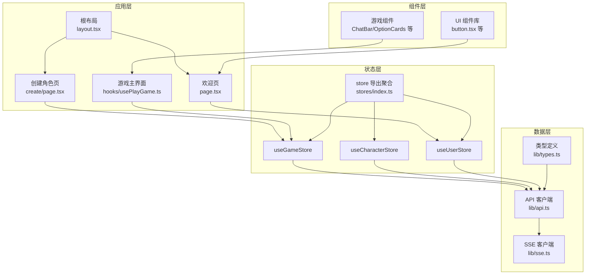
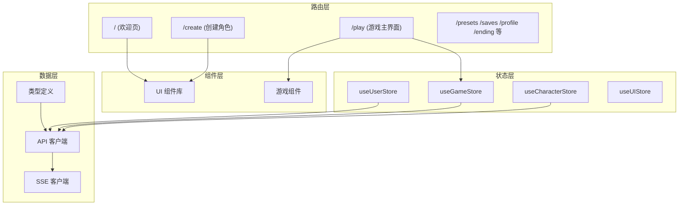
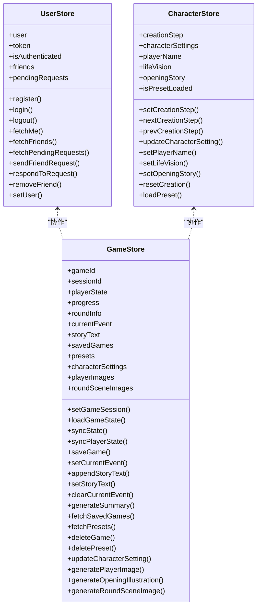
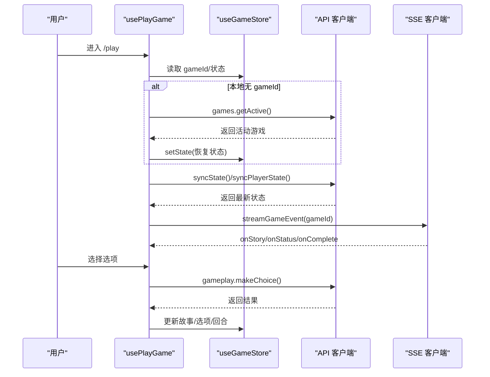
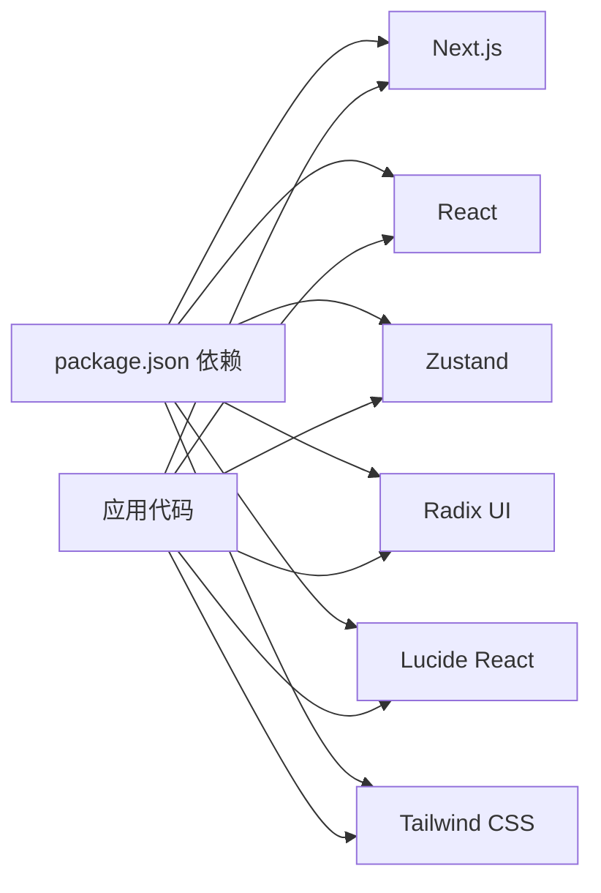

# 前端架构设计

<cite>
**本文档引用的文件**
- [frontend/src/app/layout.tsx](file://frontend/src/app/layout.tsx)
- [frontend/src/app/page.tsx](file://frontend/src/app/page.tsx)
- [frontend/next.config.ts](file://frontend/next.config.ts)
- [frontend/package.json](file://frontend/package.json)
- [frontend/src/lib/types.ts](file://frontend/src/lib/types.ts)
- [frontend/src/stores/index.ts](file://frontend/src/stores/index.ts)
- [frontend/src/stores/useGameStore.ts](file://frontend/src/stores/useGameStore.ts)
- [frontend/src/stores/useCharacterStore.ts](file://frontend/src/stores/useCharacterStore.ts)
- [frontend/src/stores/useUserStore.ts](file://frontend/src/stores/useUserStore.ts)
- [frontend/src/lib/api.ts](file://frontend/src/lib/api.ts)
- [frontend/src/components/ui/button.tsx](file://frontend/src/components/ui/button.tsx)
- [frontend/src/hooks/useHydration.ts](file://frontend/src/hooks/useHydration.ts)
- [frontend/src/hooks/usePlayGame.ts](file://frontend/src/hooks/usePlayGame.ts)
- [frontend/src/lib/sse.ts](file://frontend/src/lib/sse.ts)
- [frontend/src/app/create/page.tsx](file://frontend/src/app/create/page.tsx)
</cite>

## 目录
1. [引言](#引言)
2. [项目结构](#项目结构)
3. [核心组件](#核心组件)
4. [架构总览](#架构总览)
5. [详细组件分析](#详细组件分析)
6. [依赖分析](#依赖分析)
7. [性能考虑](#性能考虑)
8. [故障排除指南](#故障排除指南)
9. [结论](#结论)
10. [附录](#附录)

## 引言
本文件面向“人生草稿本”项目的前端团队与技术评审，系统化梳理基于 Next.js App Router 的前端架构设计，涵盖路由组织、页面组件层次、布局系统、状态管理（Zustand）、组件分层、国际化与主题、响应式设计、性能优化策略、前后端数据交互与错误处理等。目标是帮助开发者快速理解系统设计、高效协作与持续演进。

## 项目结构
项目采用 Next.js App Router 的 App 目录结构，按功能域划分目录，结合 TypeScript 类型约束与 Zustand 状态管理，形成清晰的分层与职责边界：

- 应用入口与全局布局：根布局负责字体、元数据、视口配置与全局错误兜底组件挂载。
- 页面路由：各功能页面（欢迎页、创建角色页、游戏主界面、预设、档案等）位于 app 下的独立路由。
- 组件层：通用 UI 组件（按钮、输入框等）与游戏业务组件（聊天栏、选项卡、场景图等）分离。
- 状态层：Zustand store 聚合用户、游戏、角色、UI 等状态，提供细粒度与组合式导出。
- 数据层：统一的 API 客户端封装，内置认证策略与错误处理；SSE 客户端独立实现，支持断点续传与自动重连。
- 工具与类型：集中定义 API 请求/响应类型，确保前后端契约一致。

图表来源
- [frontend/src/app/layout.tsx](file://frontend/src/app/layout.tsx#L1-L48)
- [frontend/src/app/page.tsx](file://frontend/src/app/page.tsx#L1-L352)
- [frontend/src/app/create/page.tsx](file://frontend/src/app/create/page.tsx#L1-L800)
- [frontend/src/hooks/usePlayGame.ts](file://frontend/src/hooks/usePlayGame.ts#L1-L455)
- [frontend/src/stores/index.ts](file://frontend/src/stores/index.ts#L1-L27)
- [frontend/src/stores/useGameStore.ts](file://frontend/src/stores/useGameStore.ts#L1-L996)
- [frontend/src/stores/useCharacterStore.ts](file://frontend/src/stores/useCharacterStore.ts#L1-L118)
- [frontend/src/stores/useUserStore.ts](file://frontend/src/stores/useUserStore.ts#L1-L126)
- [frontend/src/lib/api.ts](file://frontend/src/lib/api.ts#L1-L564)
- [frontend/src/lib/sse.ts](file://frontend/src/lib/sse.ts#L1-L520)
- [frontend/src/lib/types.ts](file://frontend/src/lib/types.ts#L1-L342)

章节来源
- [frontend/src/app/layout.tsx](file://frontend/src/app/layout.tsx#L1-L48)
- [frontend/src/app/page.tsx](file://frontend/src/app/page.tsx#L1-L352)
- [frontend/src/app/create/page.tsx](file://frontend/src/app/create/page.tsx#L1-L800)
- [frontend/src/stores/index.ts](file://frontend/src/stores/index.ts#L1-L27)

## 核心组件
本节聚焦前端核心构件与其职责划分，强调模块内聚与低耦合。

- 根布局与全局样式
  - 负责字体加载、元数据与视口配置，设置全局暗色主题基类，挂载全局错误报告组件，保证首屏一致性与可访问性。
  - 关键点：字体变量注入、主题色配置、移动端视口参数。

- 欢迎页（Welcome Page）
  - 负责用户认证态判断、活动游戏恢复、快捷导航至创建、加载存档、角色预设等入口。
  - 与用户 store、游戏 store 协作，使用水合钩子确保状态稳定后再做路由决策。

- 创建角色页（Create Page）
  - 分步骤引导用户完成角色设定，自动触发后台生成（家庭、关系、性格、财富），并在最后一步生成人物头像。
  - 与游戏 store 的角色创建步骤、图片生成能力深度集成，支持预设保存与自动预设命名。

- 游戏主界面（Play Page）
  - 通过组合多个子钩子（阶段管理、事件生成、选择处理、状态同步、历史查看）实现复杂交互。
  - 与 SSE 客户端协作，实现事件流式生成与断点续传；与游戏 store 协同管理故事文本、选项、回合信息与场景插画。

- UI 组件库
  - 基于 Radix UI 与 Tailwind，提供按钮、输入框、卡片、对话框等通用组件，遵循变体与尺寸规范，便于复用与一致性。

- 状态管理（Zustand）
  - 用户 store：认证、好友、请求管理。
  - 游戏 store：会话、事件、故事、存档、预设、图片、场景插画、角色创建等。
  - 角色 store：角色创建步骤与设定。
  - 统一导出：提供向后兼容与细粒度导入两种方式。

- API 客户端
  - 封装 fetch，自动注入 Cookie 或 Authorization 头，统一错误处理与远程日志上报。
  - 暴露认证、好友、游戏、角色、预设、玩法、故事调整、图片等模块化接口。

- SSE 客户端
  - 直连后端，支持断点续传、指数退避重连、网络状态感知与错误格式化，保障移动端弱网体验。

章节来源
- [frontend/src/app/layout.tsx](file://frontend/src/app/layout.tsx#L1-L48)
- [frontend/src/app/page.tsx](file://frontend/src/app/page.tsx#L1-L352)
- [frontend/src/app/create/page.tsx](file://frontend/src/app/create/page.tsx#L1-L800)
- [frontend/src/hooks/usePlayGame.ts](file://frontend/src/hooks/usePlayGame.ts#L1-L455)
- [frontend/src/components/ui/button.tsx](file://frontend/src/components/ui/button.tsx#L1-L65)
- [frontend/src/stores/index.ts](file://frontend/src/stores/index.ts#L1-L27)
- [frontend/src/stores/useGameStore.ts](file://frontend/src/stores/useGameStore.ts#L1-L996)
- [frontend/src/stores/useCharacterStore.ts](file://frontend/src/stores/useCharacterStore.ts#L1-L118)
- [frontend/src/stores/useUserStore.ts](file://frontend/src/stores/useUserStore.ts#L1-L126)
- [frontend/src/lib/api.ts](file://frontend/src/lib/api.ts#L1-L564)
- [frontend/src/lib/sse.ts](file://frontend/src/lib/sse.ts#L1-L520)

## 架构总览
整体架构采用“路由层-组件层-状态层-数据层”的分层设计，配合类型系统与工具链，确保可维护性与扩展性。

图表来源
- [frontend/src/app/page.tsx](file://frontend/src/app/page.tsx#L1-L352)
- [frontend/src/app/create/page.tsx](file://frontend/src/app/create/page.tsx#L1-L800)
- [frontend/src/hooks/usePlayGame.ts](file://frontend/src/hooks/usePlayGame.ts#L1-L455)
- [frontend/src/stores/useGameStore.ts](file://frontend/src/stores/useGameStore.ts#L1-L996)
- [frontend/src/stores/useUserStore.ts](file://frontend/src/stores/useUserStore.ts#L1-L126)
- [frontend/src/lib/api.ts](file://frontend/src/lib/api.ts#L1-L564)
- [frontend/src/lib/sse.ts](file://frontend/src/lib/sse.ts#L1-L520)
- [frontend/src/lib/types.ts](file://frontend/src/lib/types.ts#L1-L342)

## 详细组件分析

### 状态管理架构（Zustand）
- 设计模式
  - 使用 create + persist 实现状态持久化与水合控制，避免 SSR 与 CSR 的状态不一致。
  - store 细粒度拆分：用户、游戏、角色、UI、图片等，既支持组合式导出，也支持按需导入。
  - 深浅比较优化：针对频繁更新的字段（如属性、周数、回合）使用浅比较减少无意义重渲染。

- 关键 store 职责
  - useUserStore：用户认证、好友、请求管理，支持 Cookie 与 Token 双重认证策略。
  - useGameStore：游戏会话、事件流、故事文本、存档/预设、图片与场景插画、角色创建流程。
  - useCharacterStore：角色创建步骤与设定，支持预设加载与重置。
  - useUIStore：语言、主题、设置等 UI 相关状态（在本仓库中未见具体实现，但已在导出清单中声明）。

- 数据流管理
  - 读取：组件通过 hooks 订阅 store，按需选择状态片段。
  - 写入：通过 store 暴露的动作方法更新状态，必要时同步到后端。
  - 同步：提供同步方法（如同步玩家状态、同步游戏状态）与错误处理（如会话过期时自动重载）。

图表来源
- [frontend/src/stores/useUserStore.ts](file://frontend/src/stores/useUserStore.ts#L1-L126)
- [frontend/src/stores/useGameStore.ts](file://frontend/src/stores/useGameStore.ts#L1-L996)
- [frontend/src/stores/useCharacterStore.ts](file://frontend/src/stores/useCharacterStore.ts#L1-L118)

章节来源
- [frontend/src/stores/index.ts](file://frontend/src/stores/index.ts#L1-L27)
- [frontend/src/stores/useGameStore.ts](file://frontend/src/stores/useGameStore.ts#L1-L996)
- [frontend/src/stores/useCharacterStore.ts](file://frontend/src/stores/useCharacterStore.ts#L1-L118)
- [frontend/src/stores/useUserStore.ts](file://frontend/src/stores/useUserStore.ts#L1-L126)

### 游戏主流程（usePlayGame）
- 组合子钩子
  - 阶段管理：管理“加载/事件/选项/结果/总结/结束”等阶段与连接状态。
  - 事件生成：通过 SSE 客户端拉取事件流，支持断点续传与自动重连。
  - 选择处理：提交选择并更新状态，支持自定义选择。
  - 状态同步：定期同步玩家状态与游戏进度，处理会话过期与重载。
  - 历史查看：支持查看回合历史与回放。

- 会话恢复
  - 首次进入 /play 时，若本地无 gameId，则尝试从服务端恢复活动游戏；若无活动游戏则重定向首页。

- 场景插画
  - 基于轮次与阶段自动生成事件/结果场景插画，支持批量加载与重新生成。

图表来源
- [frontend/src/hooks/usePlayGame.ts](file://frontend/src/hooks/usePlayGame.ts#L1-L455)
- [frontend/src/stores/useGameStore.ts](file://frontend/src/stores/useGameStore.ts#L1-L996)
- [frontend/src/lib/api.ts](file://frontend/src/lib/api.ts#L1-L564)
- [frontend/src/lib/sse.ts](file://frontend/src/lib/sse.ts#L1-L520)

章节来源
- [frontend/src/hooks/usePlayGame.ts](file://frontend/src/hooks/usePlayGame.ts#L1-L455)

### 国际化、主题与响应式设计
- 国际化
  - 类型定义中包含语言字段，API 调用时传入语言参数，确保生成内容与交互文案符合用户偏好。
  - UI 组件库提供尺寸与变体，便于适配不同语言的文本长度。

- 主题系统
  - 根布局设置暗色主题基类，字体变量注入，Tailwind 类名统一管理视觉层级。
  - UI 组件遵循明暗模式下的颜色语义，确保在深色背景下可读性与对比度。

- 响应式设计
  - 使用 Tailwind 的响应式断点与触摸目标尺寸，保证移动端交互体验。
  - 对话框、抽屉等容器组件在移动端采用底部弹出式布局，提升可用性。

章节来源
- [frontend/src/lib/types.ts](file://frontend/src/lib/types.ts#L1-L342)
- [frontend/src/app/layout.tsx](file://frontend/src/app/layout.tsx#L1-L48)
- [frontend/src/components/ui/button.tsx](file://frontend/src/components/ui/button.tsx#L1-L65)

### 组件架构分层
- UI 组件库
  - 提供按钮、输入框、卡片、对话框等基础组件，遵循变体与尺寸规范，支持 asChild 与 SVG 图标组合。
- 游戏组件
  - 包含聊天栏、选项卡、历史抽屉、场景图、状态条、故事编辑器等，围绕游戏体验构建。
- 业务组件
  - 欢迎页、创建角色页、游戏主界面等页面级组件，协调 store 与 API，完成用户任务流。

章节来源
- [frontend/src/components/ui/button.tsx](file://frontend/src/components/ui/button.tsx#L1-L65)
- [frontend/src/app/page.tsx](file://frontend/src/app/page.tsx#L1-L352)
- [frontend/src/app/create/page.tsx](file://frontend/src/app/create/page.tsx#L1-L800)

## 依赖分析
- 外部依赖
  - Next.js 16、React 19、Zustand 5、Radix UI、Lucide React、Tailwind CSS v4。
- 内部依赖
  - store 之间通过动作方法协作；页面组件依赖 store 与 API；SSE 客户端直连后端，避免代理缓冲。
- 潜在风险
  - SSE 与代理的耦合：开发环境使用 rewrites 代理，但 SSE 需直连后端以保证流式传输；生产环境通过环境变量覆盖 API 基础地址。
  - 认证策略：优先使用 Cookie，降级使用 Token；需确保 Cookie 作用域与 SameSite 策略正确。

图表来源
- [frontend/package.json](file://frontend/package.json#L1-L49)

章节来源
- [frontend/package.json](file://frontend/package.json#L1-L49)
- [frontend/next.config.ts](file://frontend/next.config.ts#L1-L31)

## 性能考虑
- 代码分割与懒加载
  - 页面组件按路由自动分割；在需要时动态导入工具函数（如复制到剪贴板），减少首屏体积。
  - 游戏主界面在加载结局数据时采用动态导入 API 模块，避免不必要的包体积。

- 缓存机制
  - Zustand persist 将关键状态持久化到本地存储，结合水合钩子避免首屏闪烁与状态抖动。
  - API 层支持 Cookie 认证，减少重复鉴权开销；SSE 客户端支持断点续传，降低网络波动影响。

- 渲染优化
  - 深浅比较减少不必要的重渲染；UI 组件使用变体与尺寸枚举，避免运行时计算。
  - 场景插画采用懒加载与批量加载策略，避免一次性渲染过多资源。

- 网络优化
  - SSE 客户端指数退避重连、网络状态感知与超时控制，适配弱网环境。
  - 代理超时延长（2 分钟），满足图片生成等长耗时操作需求。

章节来源
- [frontend/src/app/page.tsx](file://frontend/src/app/page.tsx#L1-L352)
- [frontend/src/hooks/usePlayGame.ts](file://frontend/src/hooks/usePlayGame.ts#L1-L455)
- [frontend/next.config.ts](file://frontend/next.config.ts#L1-L31)
- [frontend/src/lib/sse.ts](file://frontend/src/lib/sse.ts#L1-L520)

## 故障排除指南
- 认证失败
  - 现象：登录/注册报错、Token 缺失。
  - 排查：检查 Cookie 是否可用、Token 是否存在、后端是否返回有效令牌；必要时清理本地存储并重试。
  - 参考：API 客户端的认证策略与错误处理。

- 会话过期
  - 现象：同步状态返回 404，页面重定向首页。
  - 排查：尝试服务端恢复活动游戏；若无活动游戏则引导用户回到欢迎页重新开始。
  - 参考：游戏 store 的同步与重载逻辑。

- SSE 连接问题
  - 现象：事件流中断、长时间无响应。
  - 排查：检查网络状态、代理配置（开发环境需直连后端）、超时与重连参数；确认 Last-Event-ID 是否正确传递。
  - 参考：SSE 客户端的自动重连与断点续传机制。

- 图片生成失败
  - 现象：头像或场景插画生成失败或为空。
  - 排查：检查 gameId 与角色设定是否完整、反馈提示是否合理、是否启用场景插画；尝试重新生成或完全重新生成。
  - 参考：图片 store 的生成与重新生成动作。

章节来源
- [frontend/src/lib/api.ts](file://frontend/src/lib/api.ts#L1-L564)
- [frontend/src/stores/useGameStore.ts](file://frontend/src/stores/useGameStore.ts#L1-L996)
- [frontend/src/lib/sse.ts](file://frontend/src/lib/sse.ts#L1-L520)

## 结论
本前端架构以 Next.js App Router 为基础，结合 Zustand 状态管理、模块化 API 客户端与专用 SSE 客户端，形成了高内聚、低耦合且具备良好扩展性的系统。通过类型约束、水合钩子与懒加载策略，兼顾了开发体验与用户体验。建议后续持续完善 UI store、国际化文案与主题切换机制，并在 CI 中加入性能回归测试，以保障长期演进质量。

## 附录
- 开发与构建
  - 开发：npm run dev；构建：npm run build；启动：npm run start。
  - 测试：npm run test、npm run test:watch、npm run test:coverage；E2E：npm run test:e2e。
- 配置要点
  - 开发环境允许特定来源访问，代理超时延长；生产环境通过环境变量覆盖 API 基础地址。
  - 根布局设置主题色与字体变量，确保全局一致性。

章节来源
- [frontend/package.json](file://frontend/package.json#L1-L49)
- [frontend/next.config.ts](file://frontend/next.config.ts#L1-L31)
- [frontend/src/app/layout.tsx](file://frontend/src/app/layout.tsx#L1-L48)