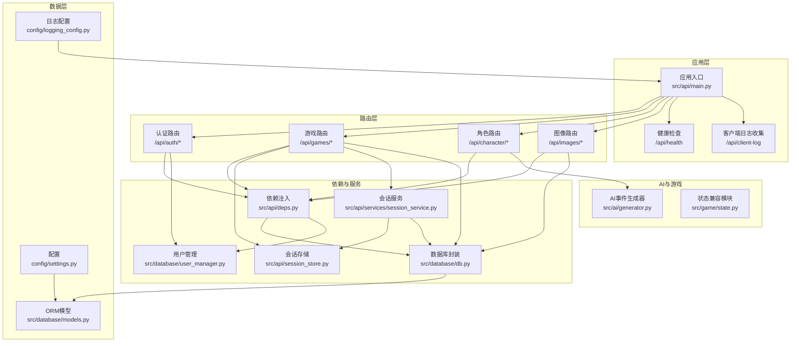
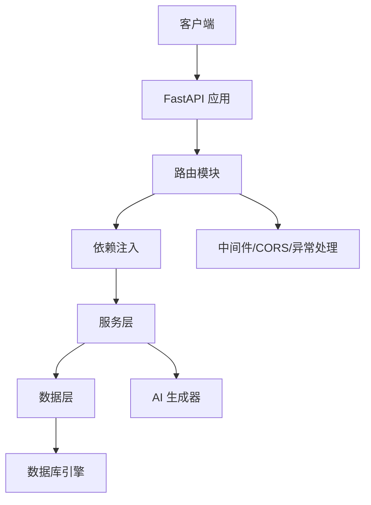
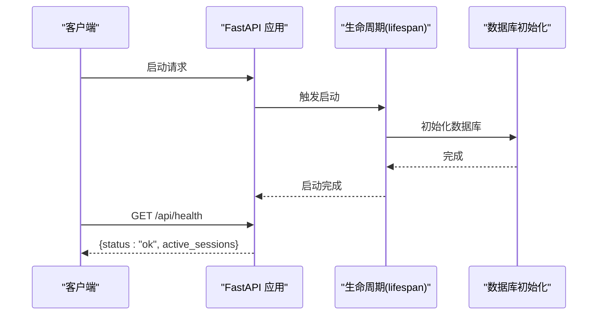
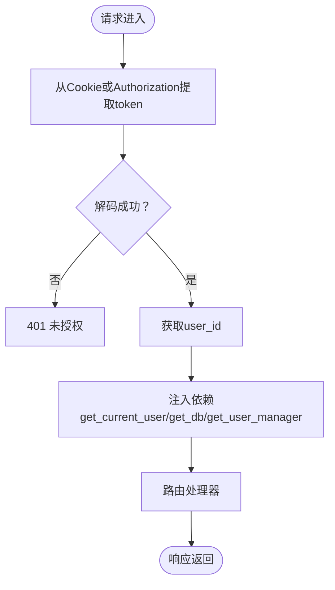
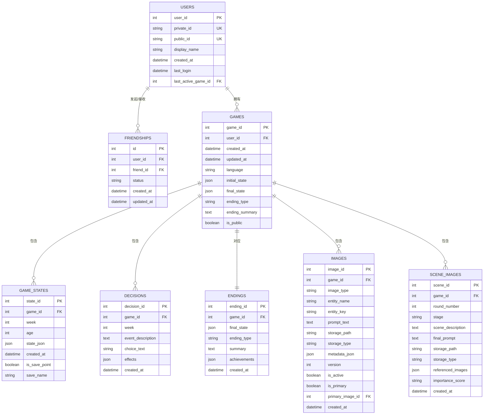
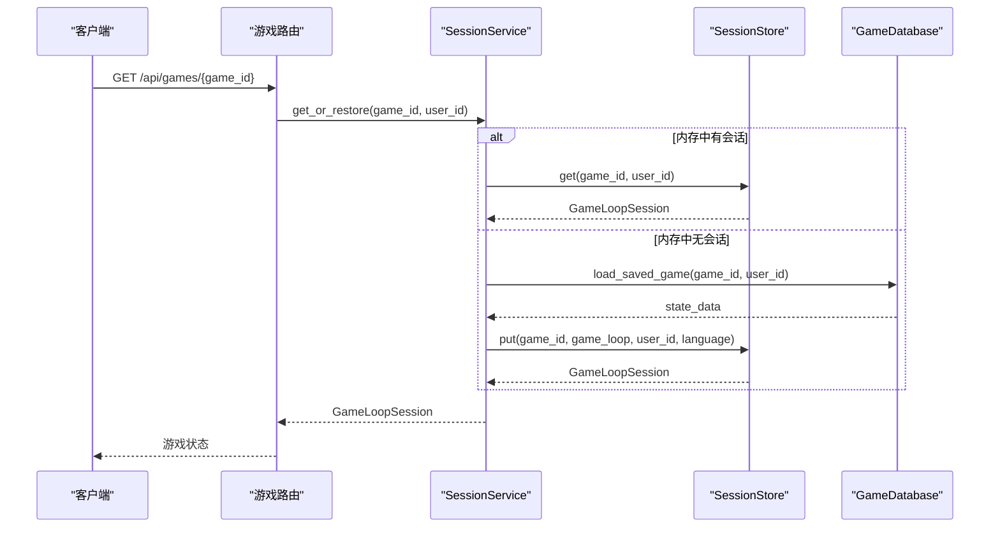
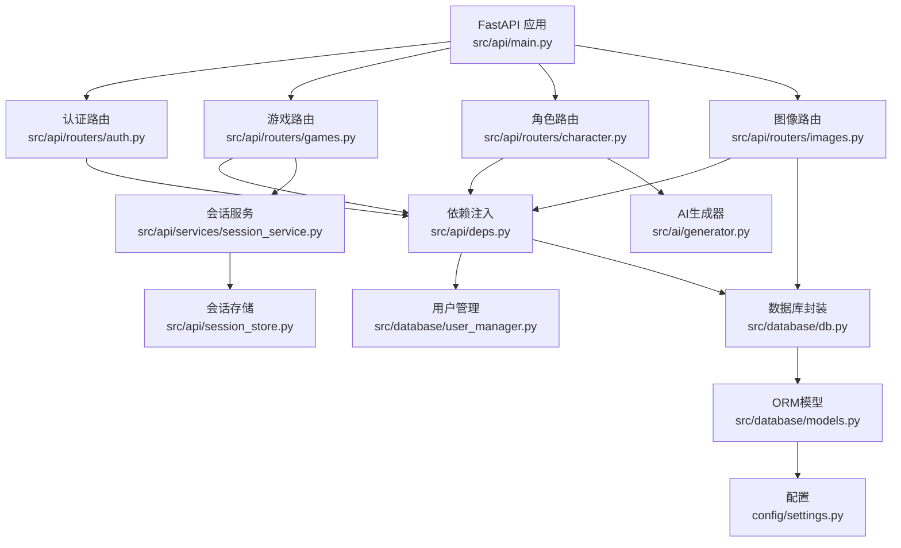

# 后端架构设计

<cite>
**本文档引用的文件**
- [src/api/main.py](file://src/api/main.py)
- [src/database/models.py](file://src/database/models.py)
- [src/database/db.py](file://src/database/db.py)
- [src/api/deps.py](file://src/api/deps.py)
- [src/api/session_store.py](file://src/api/session_store.py)
- [src/api/services/session_service.py](file://src/api/services/session_service.py)
- [src/database/user_manager.py](file://src/database/user_manager.py)
- [src/api/routers/auth.py](file://src/api/routers/auth.py)
- [src/api/routers/games.py](file://src/api/routers/games.py)
- [src/api/routers/character.py](file://src/api/routers/character.py)
- [src/api/routers/images.py](file://src/api/routers/images.py)
- [config/settings.py](file://config/settings.py)
- [config/logging_config.py](file://config/logging_config.py)
- [src/ai/generator.py](file://src/ai/generator.py)
- [src/game/state.py](file://src/game/state.py)
- [requirements.txt](file://requirements.txt)
</cite>

## 目录
1. [简介](#简介)
2. [项目结构](#项目结构)
3. [核心组件](#核心组件)
4. [架构总览](#架构总览)
5. [详细组件分析](#详细组件分析)
6. [依赖关系分析](#依赖关系分析)
7. [性能考量](#性能考量)
8. [故障排查指南](#故障排查指南)
9. [结论](#结论)

## 简介
本项目为人生命草稿本的后端，基于 FastAPI 构建，采用模块化路由组织、SQLAlchemy ORM 数据层、内存会话存储与数据库持久化协同的架构。系统围绕“认证、游戏、角色、图像”四大模块展开，提供角色创建、回合制叙事生成、图片生成与管理、存档与回溯、以及跨平台会话恢复能力。同时内置 CORS、全局异常处理、日志与配置管理，满足开发与生产的多样化需求。

## 项目结构
后端采用按功能分层的组织方式：
- 应用入口与生命周期：FastAPI 应用、CORS、全局异常处理、健康检查
- 路由层：按业务模块拆分，如认证、游戏、角色、图像等
- 依赖注入：JWT 解析、用户管理、数据库访问、会话存储
- 数据层：SQLAlchemy ORM 模型与数据库操作封装
- 服务层：会话服务、图像服务、AI 生成器等
- 配置与日志：环境变量、数据库连接、日志输出

图表来源
- [src/api/main.py](file://src/api/main.py#L1-L134)
- [src/api/routers/auth.py](file://src/api/routers/auth.py#L1-L125)
- [src/api/routers/games.py](file://src/api/routers/games.py#L1-L389)
- [src/api/routers/character.py](file://src/api/routers/character.py#L1-L210)
- [src/api/routers/images.py](file://src/api/routers/images.py#L1-L986)
- [src/api/deps.py](file://src/api/deps.py#L1-L150)
- [src/api/session_store.py](file://src/api/session_store.py#L1-L200)
- [src/api/services/session_service.py](file://src/api/services/session_service.py#L1-L158)
- [src/database/db.py](file://src/database/db.py#L1-L910)
- [src/database/models.py](file://src/database/models.py#L1-L295)
- [config/settings.py](file://config/settings.py#L1-L168)
- [config/logging_config.py](file://config/logging_config.py#L1-L78)
- [src/ai/generator.py](file://src/ai/generator.py#L1-L497)
- [src/game/state.py](file://src/game/state.py#L1-L18)

章节来源
- [src/api/main.py](file://src/api/main.py#L1-L134)
- [config/settings.py](file://config/settings.py#L1-L168)

## 核心组件
- 应用入口与生命周期：定义 FastAPI 应用、CORS、全局异常处理、健康检查与客户端日志收集端点
- 路由组织：按模块划分，统一前缀与标签，便于扩展与维护
- 依赖注入：提供 JWT 解析、用户管理、数据库访问、会话获取等依赖
- 数据层：SQLAlchemy ORM 模型与数据库操作封装，支持 SQLite/PostgreSQL
- 会话管理：内存会话存储与数据库持久化协同，支持会话恢复与时间回溯
- 配置与日志：集中配置管理与生产日志输出

章节来源
- [src/api/main.py](file://src/api/main.py#L1-L134)
- [src/api/deps.py](file://src/api/deps.py#L1-L150)
- [src/database/models.py](file://src/database/models.py#L1-L295)
- [src/database/db.py](file://src/database/db.py#L1-L910)
- [src/api/session_store.py](file://src/api/session_store.py#L1-L200)
- [src/api/services/session_service.py](file://src/api/services/session_service.py#L1-L158)
- [config/logging_config.py](file://config/logging_config.py#L1-L78)

## 架构总览
系统采用“路由-依赖-服务-数据”的分层架构：
- 路由层负责请求入口与参数校验
- 依赖层提供认证、用户、数据库、会话等通用能力
- 服务层封装业务流程（如会话恢复、图片生成）
- 数据层负责 ORM 模型与数据库操作

图表来源
- [src/api/main.py](file://src/api/main.py#L1-L134)
- [src/api/deps.py](file://src/api/deps.py#L1-L150)
- [src/database/db.py](file://src/database/db.py#L1-L910)
- [src/ai/generator.py](file://src/ai/generator.py#L1-L497)

## 详细组件分析

### 应用入口与生命周期
- 生命周期管理：通过 lifespan 管理应用启动与关闭，初始化数据库
- CORS 配置：支持 Next.js、Streamlit 与局域网访问，启用凭据传输
- 全局异常处理：捕获未处理异常并返回统一错误响应
- 健康检查：暴露 /api/health，统计活动会话数
- 客户端日志收集：接收前端上报的错误与上下文信息，便于移动端调试

图表来源
- [src/api/main.py](file://src/api/main.py#L24-L33)
- [src/api/main.py](file://src/api/main.py#L92-L99)

章节来源
- [src/api/main.py](file://src/api/main.py#L1-L134)

### 路由组织与模块职责
- 认证模块（/api/auth）：注册、登录、获取当前用户、登出；使用 Cookie 传输 JWT
- 游戏模块（/api/games）：创建/加载/保存/删除游戏；活跃游戏恢复；时间回溯存档
- 角色模块（/api/character）：角色设定生成、关系生成、属性生成、开场故事流式生成
- 图像模块（/api/images）：图片生成、批量生成、重新生成、场景插画、文件访问

章节来源
- [src/api/routers/auth.py](file://src/api/routers/auth.py#L1-L125)
- [src/api/routers/games.py](file://src/api/routers/games.py#L1-L389)
- [src/api/routers/character.py](file://src/api/routers/character.py#L1-L210)
- [src/api/routers/images.py](file://src/api/routers/images.py#L1-L986)

### 依赖注入与认证
- JWT 令牌：支持 Cookie 与 Bearer 两种方式，Cookie 优先，适配 iPad 等设备持久化
- 用户管理：提供用户创建、登录、显示名更新、好友系统等能力
- 数据库访问：提供 GameDatabase 封装，统一增删改查与事务管理
- 会话获取：提供 get_game_session 与 get_current_user 等依赖

图表来源
- [src/api/deps.py](file://src/api/deps.py#L70-L133)
- [src/api/routers/auth.py](file://src/api/routers/auth.py#L23-L42)

章节来源
- [src/api/deps.py](file://src/api/deps.py#L1-L150)
- [src/database/user_manager.py](file://src/database/user_manager.py#L1-L401)

### 数据库架构与 ORM 设计
- 模型设计：用户、好友关系、游戏、状态快照、决策、结局、图片、场景图片等
- 关系映射：明确外键与级联删除，支持用户-游戏、游戏-状态、游戏-决策等
- 事务管理：封装 CRUD 操作，使用 with_db_session 装饰器与 SessionLocal 管理会话
- 数据库连接：支持 SQLite 与 PostgreSQL，通过 settings.get_database_url 动态切换

图表来源
- [src/database/models.py](file://src/database/models.py#L11-L235)

章节来源
- [src/database/models.py](file://src/database/models.py#L1-L295)
- [src/database/db.py](file://src/database/db.py#L1-L910)
- [config/settings.py](file://config/settings.py#L132-L141)

### 会话管理与状态持久化
- 内存会话存储：SessionStore 以 user_game 键管理 GameLoopSession，支持超时清理与 SSE 缓存
- 会话服务：SessionService 统一获取/恢复逻辑，自动从数据库恢复过期会话
- 数据库持久化：GameDatabase 提供 save/load/restore 等方法，支持活跃游戏记录与时间回溯存档
- 服务端会话恢复：User.last_active_game_id 记录最近活跃游戏，支持 iPad 等设备断连恢复

图表来源
- [src/api/services/session_service.py](file://src/api/services/session_service.py#L49-L122)
- [src/api/session_store.py](file://src/api/session_store.py#L123-L167)
- [src/database/db.py](file://src/database/db.py#L385-L427)

章节来源
- [src/api/session_store.py](file://src/api/session_store.py#L1-L200)
- [src/api/services/session_service.py](file://src/api/services/session_service.py#L1-L158)
- [src/database/db.py](file://src/database/db.py#L601-L684)

### 异常处理、CORS 与中间件
- CORS：明确允许的 origin 列表，支持凭据传输，适配开发与局域网访问
- 全局异常处理：捕获未处理异常，统一返回 500 与错误信息
- 中间件：通过 FastAPI 中间件机制实现 CORS 与日志等横切关注点

章节来源
- [src/api/main.py](file://src/api/main.py#L42-L77)

### 安全考虑
- CSRF 防护：Cookie SameSite 设置，配合 Cookie httponly、secure 等属性
- 输入验证：路由层使用 Pydantic 模型进行请求参数校验
- 权限控制：依赖注入中 get_current_user/get_current_user_optional 提供鉴权与非严格模式
- 内容审核：图像生成模块对敏感内容进行拦截并返回友好错误

章节来源
- [src/api/routers/auth.py](file://src/api/routers/auth.py#L16-L42)
- [src/api/routers/images.py](file://src/api/routers/images.py#L204-L217)

### 性能优化与监控
- 会话缓存：内存会话减少数据库访问频率，支持 SSE 缓存提升断线重连体验
- 事件缓存：AI 事件生成器支持缓存与重试，降低重复计算
- 数据库连接：SessionLocal 与 with_db_session 管理会话生命周期
- 日志监控：生产环境日志配置，第三方库日志级别收敛

章节来源
- [src/api/session_store.py](file://src/api/session_store.py#L20-L98)
- [src/ai/generator.py](file://src/ai/generator.py#L54-L66)
- [config/logging_config.py](file://config/logging_config.py#L1-L78)

## 依赖关系分析

图表来源
- [src/api/main.py](file://src/api/main.py#L80-L89)
- [src/api/deps.py](file://src/api/deps.py#L28-L41)
- [src/database/db.py](file://src/database/db.py#L1-L910)
- [src/database/models.py](file://src/database/models.py#L1-L295)
- [src/api/services/session_service.py](file://src/api/services/session_service.py#L1-L158)
- [src/api/session_store.py](file://src/api/session_store.py#L1-L200)
- [src/ai/generator.py](file://src/ai/generator.py#L1-L497)

章节来源
- [requirements.txt](file://requirements.txt#L1-L12)

## 性能考量
- 会话超时与清理：定期清理过期会话，避免内存泄漏
- SSE 缓存：限制缓存大小，支持断线重连
- 数据库连接池：根据部署环境选择合适的连接策略
- AI 生成缓存：事件缓存与重试机制减少重复调用
- 图片生成限流：批处理与延迟策略应对速率限制

## 故障排查指南
- 认证失败：检查 Cookie 是否正确设置，确认 JWT_SECRET 与算法配置
- 404 会话缺失：确认游戏已加载或通过数据库恢复
- 图片生成失败：检查内容审核规则与 API 密钥配置
- 数据库连接异常：核对 DATABASE_URL 与驱动安装情况

章节来源
- [src/api/deps.py](file://src/api/deps.py#L118-L132)
- [src/api/services/session_service.py](file://src/api/services/session_service.py#L95-L121)
- [src/api/routers/images.py](file://src/api/routers/images.py#L204-L217)
- [config/settings.py](file://config/settings.py#L132-L141)

## 结论
本后端架构以 FastAPI 为核心，结合模块化路由、依赖注入、SQLAlchemy ORM 与内存会话存储，实现了角色创建、回合叙事、图片生成与存档回溯的完整闭环。通过严格的权限控制、CORS 配置与异常处理，兼顾安全性与可维护性。建议在生产环境中完善监控告警、数据库连接池与缓存策略，并持续优化 AI 生成与图片服务的稳定性与性能。