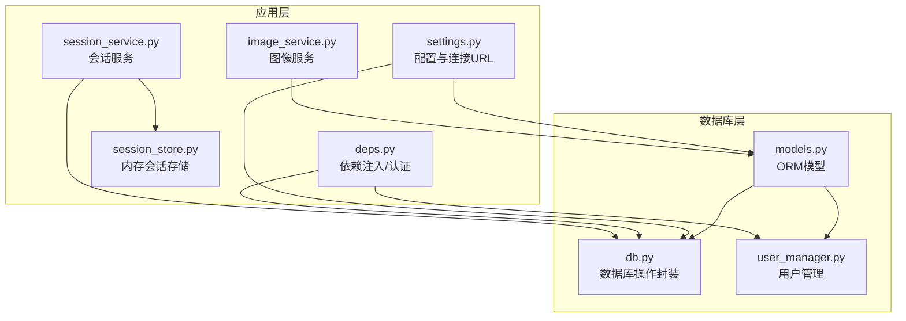
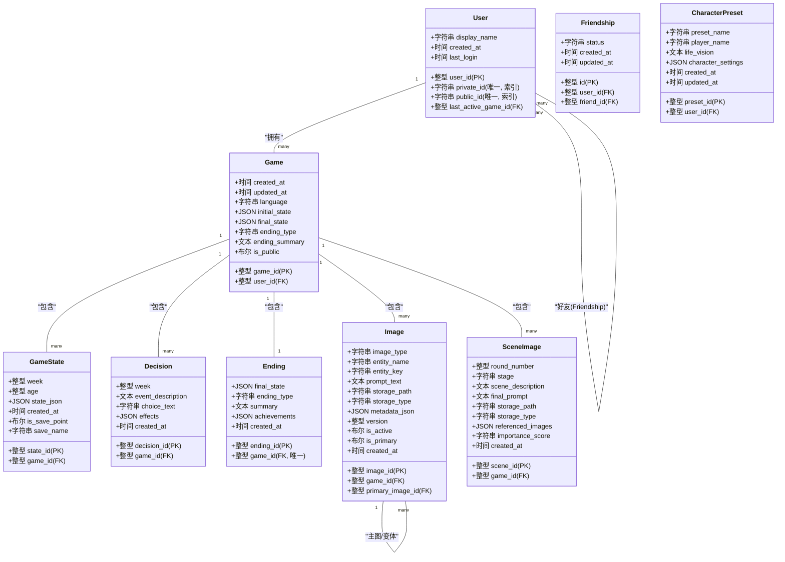
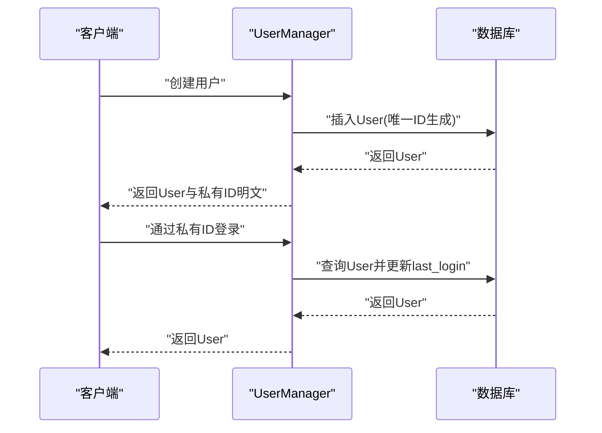
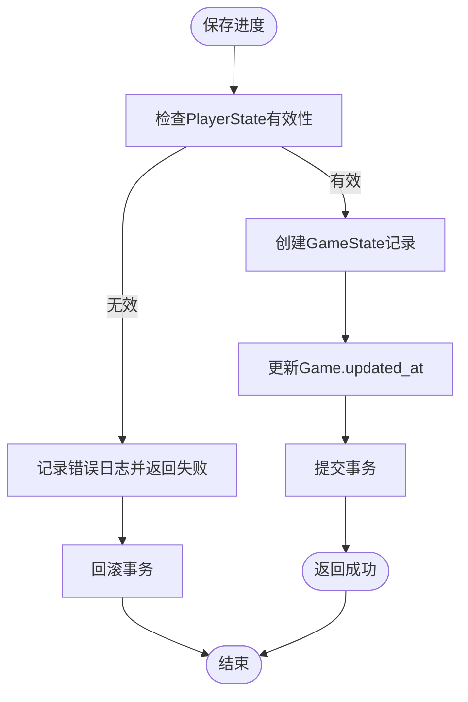
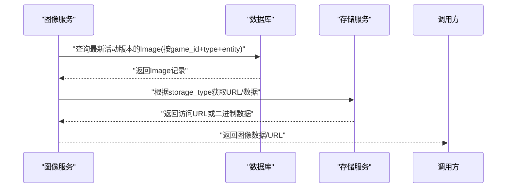
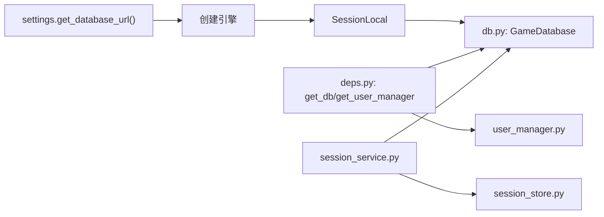

# 数据库设计

<cite>
**本文引用的文件**
- [src/database/models.py](file://src/database/models.py)
- [src/database/db.py](file://src/database/db.py)
- [src/database/user_manager.py](file://src/database/user_manager.py)
- [src/database/__init__.py](file://src/database/__init__.py)
- [migrate_add_user_id.py](file://migrate_add_user_id.py)
- [migrate_add_last_active_game.py](file://migrate_add_last_active_game.py)
- [migrate_add_image_primary_fields.py](file://migrate_add_image_primary_fields.py)
- [config/settings.py](file://config/settings.py)
- [src/api/deps.py](file://src/api/deps.py)
- [src/api/services/session_service.py](file://src/api/services/session_service.py)
- [src/api/session_store.py](file://src/api/session_store.py)
- [src/services/image_service.py](file://src/services/image_service.py)
</cite>

## 目录
1. [简介](#简介)
2. [项目结构](#项目结构)
3. [核心组件](#核心组件)
4. [架构总览](#架构总览)
5. [详细组件分析](#详细组件分析)
6. [依赖分析](#依赖分析)
7. [性能考虑](#性能考虑)
8. [故障排查指南](#故障排查指南)
9. [结论](#结论)
10. [附录](#附录)

## 简介
本文件为“人生草稿本”项目的数据库设计文档，聚焦于基于 SQLAlchemy 的 ORM 模型设计与实现细节。内容涵盖用户、游戏状态、决策、结局、角色预设、图像与场景图像等核心实体的关系映射；说明主键、外键约束与索引设计；阐述数据完整性保障机制；梳理业务规则（如用户状态管理、游戏进度存储、图像元数据管理）；给出数据库初始化流程、迁移策略与版本控制方案；总结数据访问模式（查询优化、批量操作、事务处理）；并讨论缓存策略、数据同步机制以及数据安全、备份恢复与性能监控的设计考虑。

## 项目结构
数据库相关代码主要集中在以下模块：
- 模型定义：src/database/models.py
- 数据库操作封装：src/database/db.py
- 用户管理与登录：src/database/user_manager.py
- 配置与连接：config/settings.py
- API 依赖注入与认证：src/api/deps.py
- 会话管理与恢复：src/api/services/session_service.py、src/api/session_store.py
- 图像服务与存储：src/services/image_service.py

图表来源
- [src/database/models.py](file://src/database/models.py#L1-L295)
- [src/database/db.py](file://src/database/db.py#L1-L910)
- [src/database/user_manager.py](file://src/database/user_manager.py#L1-L401)
- [config/settings.py](file://config/settings.py#L107-L141)
- [src/api/deps.py](file://src/api/deps.py#L28-L42)
- [src/api/services/session_service.py](file://src/api/services/session_service.py#L24-L70)
- [src/api/session_store.py](file://src/api/session_store.py#L158-L199)
- [src/services/image_service.py](file://src/services/image_service.py#L391-L437)

章节来源
- [src/database/models.py](file://src/database/models.py#L1-L295)
- [src/database/db.py](file://src/database/db.py#L1-L910)
- [src/database/user_manager.py](file://src/database/user_manager.py#L1-L401)
- [config/settings.py](file://config/settings.py#L107-L141)

## 核心组件
本项目采用 SQLAlchemy 声明式基类定义实体，并通过关系映射实现跨表关联。核心实体包括：
- 用户（User）：支持私有ID登录与公有ID加好友，维护最后活跃游戏ID以支持服务端会话恢复。
- 好友关系（Friendship）：双向外键，确保同一对用户仅一条关系记录。
- 游戏（Game）：记录语言、初始/最终状态、结局摘要、公开状态等；与状态、决策、结局、图像、场景图像关联。
- 游戏状态（GameState）：按周/年龄快照存储状态 JSON，支持手动存档点标记。
- 决策（Decision）：记录每周事件描述、选择文本与效果。
- 结局（Ending）：记录最终状态、结局类型与成就。
- 角色预设（CharacterPreset）：保存角色创建设置，支持用户专属与公共预设。
- 图像（Image）：存储生成图片，支持类型、实体标识、版本控制与主图/变体关系。
- 场景图像（SceneImage）：存储每轮场景插图，记录阶段（事件/结果）、引用实体图片列表与重要性评分。

章节来源
- [src/database/models.py](file://src/database/models.py#L11-L235)

## 架构总览
数据库层通过 models.py 定义实体与关系，db.py 封装常用 CRUD 与聚合查询，user_manager.py 提供用户生命周期管理，配置由 settings.py 统一管理，API 层通过 deps.py 注入依赖并在 session_service.py 中结合内存会话进行恢复。

图表来源
- [src/database/models.py](file://src/database/models.py#L11-L235)

## 详细组件分析

### 用户与好友关系
- 用户模型包含私有ID（登录用）、公有ID（展示/加好友用），并维护最后活跃游戏ID用于服务端会话恢复。
- 好友关系通过双向外键建立，status 字段跟踪请求状态；通过唯一复合索引确保同一对用户仅一条记录。
- 用户管理器负责创建用户、登录校验、显示名更新、好友请求发送/响应、删除好友、公开游戏查询等。

图表来源
- [src/database/user_manager.py](file://src/database/user_manager.py#L68-L127)
- [src/database/models.py](file://src/database/models.py#L11-L47)

章节来源
- [src/database/models.py](file://src/database/models.py#L11-L68)
- [src/database/user_manager.py](file://src/database/user_manager.py#L68-L162)

### 游戏与状态快照
- 游戏模型记录语言、初始/最终状态、结局摘要、公开状态等；与状态、决策、结局、图像、场景图像形成一对多关系。
- 游戏状态快照按周/年龄存储，支持手动存档点标记与名称；提供加载最新状态、保存进度、列出存档点、加载/删除存档点、获取完整时间线等能力。
- 数据库封装提供批量查询、关键字检索历史故事、列表最近游戏等方法，满足一致性验证与关键行为核查需求。

图表来源
- [src/database/db.py](file://src/database/db.py#L336-L384)

章节来源
- [src/database/models.py](file://src/database/models.py#L70-L143)
- [src/database/db.py](file://src/database/db.py#L139-L164)
- [src/database/db.py](file://src/database/db.py#L336-L384)
- [src/database/db.py](file://src/database/db.py#L687-L742)
- [src/database/db.py](file://src/database/db.py#L743-L787)
- [src/database/db.py](file://src/database/db.py#L788-L825)
- [src/database/db.py](file://src/database/db.py#L826-L862)
- [src/database/db.py](file://src/database/db.py#L863-L910)

### 图像与场景图像
- 图像模型支持类型（人物/地点/物品）、实体标识、版本控制与主图/变体关系；通过唯一索引加速按游戏+类型+实体名的查询。
- 场景图像模型记录轮次、阶段（事件/结果）、场景描述与最终 prompt，以及引用的实体图片列表与重要性评分。
- 图像服务提供按类型/实体过滤、获取 URL/二进制数据、生成地点/角色/场景图片等能力。

图表来源
- [src/database/models.py](file://src/database/models.py#L162-L201)
- [src/services/image_service.py](file://src/services/image_service.py#L391-L437)

章节来源
- [src/database/models.py](file://src/database/models.py#L162-L235)
- [src/services/image_service.py](file://src/services/image_service.py#L391-L437)

### 决策与结局
- 决策模型记录每周事件描述、选择文本与效果，支持历史故事检索与关键字匹配。
- 结局模型记录最终状态、结局类型、摘要与成就，与游戏一对一关联。

章节来源
- [src/database/models.py](file://src/database/models.py#L113-L143)
- [src/database/db.py](file://src/database/db.py#L203-L283)
- [src/database/db.py](file://src/database/db.py#L102-L138)

### 角色预设
- 角色预设支持用户专属与公共预设；提供保存、加载、列表与删除，支持按用户过滤与公共可见性。

章节来源
- [src/database/models.py](file://src/database/models.py#L145-L160)
- [src/database/db.py](file://src/database/db.py#L454-L564)

## 依赖分析
- 配置与连接：settings.py 提供 get_database_url()，支持本地 SQLite 与云数据库（如 PostgreSQL），驱动引擎创建与会话工厂。
- 依赖注入：deps.py 提供 get_db()/get_user_manager() 单例，API 层通过 FastAPI 依赖注入使用。
- 会话管理：session_service.py 与 session_store.py 负责内存会话生命周期与过期清理，必要时从数据库恢复。

图表来源
- [config/settings.py](file://config/settings.py#L133-L141)
- [src/database/db.py](file://src/database/db.py#L16-L18)
- [src/api/deps.py](file://src/api/deps.py#L28-L42)
- [src/api/services/session_service.py](file://src/api/services/session_service.py#L24-L70)
- [src/api/session_store.py](file://src/api/session_store.py#L158-L199)

章节来源
- [config/settings.py](file://config/settings.py#L133-L141)
- [src/api/deps.py](file://src/api/deps.py#L28-L42)
- [src/api/services/session_service.py](file://src/api/services/session_service.py#L24-L70)
- [src/api/session_store.py](file://src/api/session_store.py#L158-L199)

## 性能考虑
- 索引设计
  - 用户：private_id、public_id、last_active_game_id（索引）
  - 游戏：user_id、is_public（索引）
  - 角色预设：user_id（索引）
  - 图像：game_id、image_type、entity_name（联合唯一索引）、primary_image_id（索引）
  - 场景图像：game_id、round_number（索引）
- 查询优化
  - 使用 order_by + limit 限制结果集大小，避免全表扫描。
  - 使用 exists/first 代替 count 以减少开销。
  - 批量查询时尽量合并条件，减少往返次数。
- 事务处理
  - 保存进度与更新游戏 updated_at 应在单事务内完成，失败回滚。
  - 删除游戏时依赖 ORM cascade 删除关联快照/决策/图像等。
- 缓存策略
  - 内存会话缓存：session_store.py 维护活跃会话，定期清理过期会话。
  - 前端缓存：前端具备静态资源与页面缓存策略（非数据库层面）。
- 并发与锁
  - 使用 SessionLocal 管理会话生命周期，避免跨线程共享会话。
  - PostgreSQL 使用 pool_pre_ping 保持连接健康。

章节来源
- [src/database/models.py](file://src/database/models.py#L16-L23)
- [src/database/models.py](file://src/database/models.py#L64-L67)
- [src/database/models.py](file://src/database/models.py#L198-L200)
- [src/database/models.py](file://src/database/models.py#L232-L234)
- [src/database/db.py](file://src/database/db.py#L356-L383)
- [src/api/session_store.py](file://src/api/session_store.py#L184-L196)

## 故障排查指南
- 数据库初始化失败
  - 检查 DATABASE_URL 或本地 SQLite 路径配置。
  - 确认 init_db() 被正确调用。
- 迁移脚本执行异常
  - 确认目标列是否存在，避免重复添加。
  - SQLite 迁移脚本需注意 PRAGMA table_info 查询列名。
- 权限与数据隔离
  - 所有涉及用户数据的操作均需校验 user_id，防止越权访问。
- 会话恢复问题
  - last_active_game_id 需与实际存在的游戏记录一致，否则清除引用。
- 图像版本与主图关系
  - is_active 与 version 控制当前版本；主图/变体关系通过 is_primary/primary_image_id 管理。

章节来源
- [config/settings.py](file://config/settings.py#L133-L141)
- [src/database/db.py](file://src/database/db.py#L616-L683)
- [migrate_add_user_id.py](file://migrate_add_user_id.py#L9-L77)
- [migrate_add_last_active_game.py](file://migrate_add_last_active_game.py#L19-L54)
- [migrate_add_image_primary_fields.py](file://migrate_add_image_primary_fields.py#L16-L68)

## 结论
本数据库设计围绕“用户—游戏—状态—图像”的核心业务流构建，通过清晰的主外键关系与索引策略保障数据完整性与查询效率。配合迁移脚本与配置抽象，实现了本地 SQLite 与云数据库的平滑切换。ORM 封装与依赖注入使业务逻辑与数据访问解耦，内存会话与服务端会话恢复机制提升了用户体验。建议在生产环境启用 PostgreSQL 并结合连接池与监控工具持续优化性能与稳定性。

## 附录

### 数据库初始化流程
- 通过 settings.get_database_url() 获取连接 URL。
- 创建引擎与 SessionLocal。
- 调用 init_db() 创建所有表（幂等）。

章节来源
- [config/settings.py](file://config/settings.py#L133-L141)
- [src/database/models.py](file://src/database/models.py#L250-L253)

### 迁移策略与版本控制
- 用户ID与公开状态：向 games 表添加 user_id、is_public、updated_at 并创建索引。
- 服务端会话恢复：向 users 表添加 last_active_game_id 并创建索引。
- 图像主图关系：向 images 表添加 is_primary、primary_image_id 并创建索引。
- 建议采用迁移脚本与版本号管理，确保多环境一致性。

章节来源
- [migrate_add_user_id.py](file://migrate_add_user_id.py#L9-L77)
- [migrate_add_last_active_game.py](file://migrate_add_last_active_game.py#L19-L54)
- [migrate_add_image_primary_fields.py](file://migrate_add_image_primary_fields.py#L16-L68)

### 数据访问模式
- 查询优化：使用索引列过滤、合理排序与限制数量。
- 批量操作：合并条件、减少往返；使用 ORM 的批量插入/更新。
- 事务处理：关键写入操作置于单事务，失败回滚。
- 一致性校验：通过历史故事检索与关键字匹配验证 AI 输出。

章节来源
- [src/database/db.py](file://src/database/db.py#L213-L283)
- [src/database/db.py](file://src/database/db.py#L356-L383)

### 缓存策略与数据同步
- 内存会话缓存：session_store.py 维护活跃会话并定期清理。
- 数据同步：服务端会话恢复依赖 last_active_game_id 与游戏记录一致性。

章节来源
- [src/api/session_store.py](file://src/api/session_store.py#L158-L199)
- [src/database/db.py](file://src/database/db.py#L603-L683)

### 数据安全、备份恢复与性能监控
- 认证与授权：JWT 令牌优先从 Cookie 读取，支持 iPad 等设备持久化；API 层通过依赖注入获取当前用户。
- 备份恢复：SQLite 文件可直接备份；云数据库建议使用供应商提供的备份工具。
- 性能监控：建议接入数据库性能指标（连接数、慢查询、锁等待）与应用侧埋点（请求耗时、错误率）。

章节来源
- [src/api/deps.py](file://src/api/deps.py#L70-L133)
- [config/settings.py](file://config/settings.py#L107-L141)