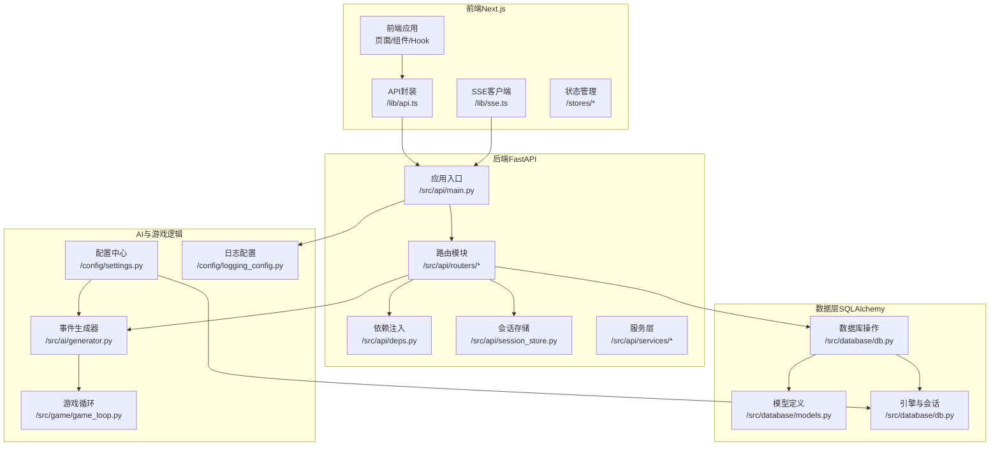
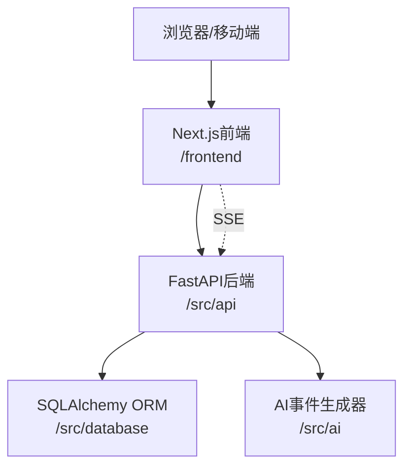
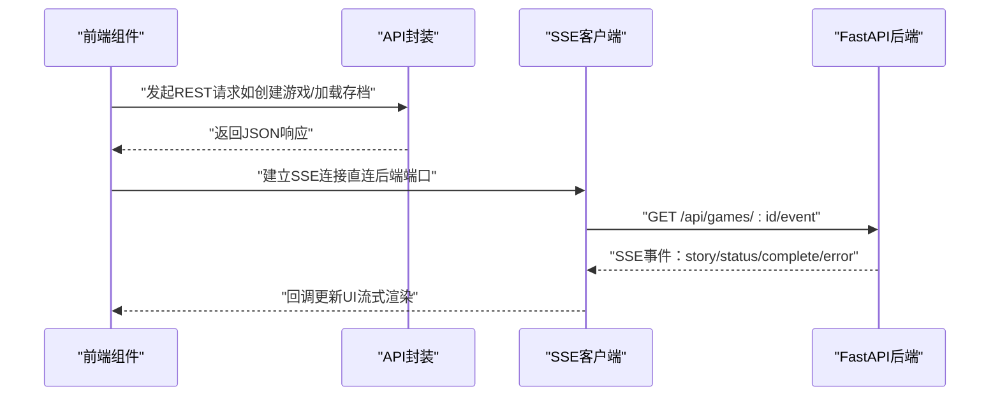
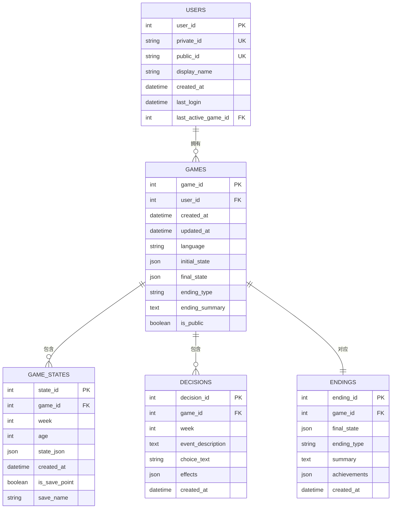
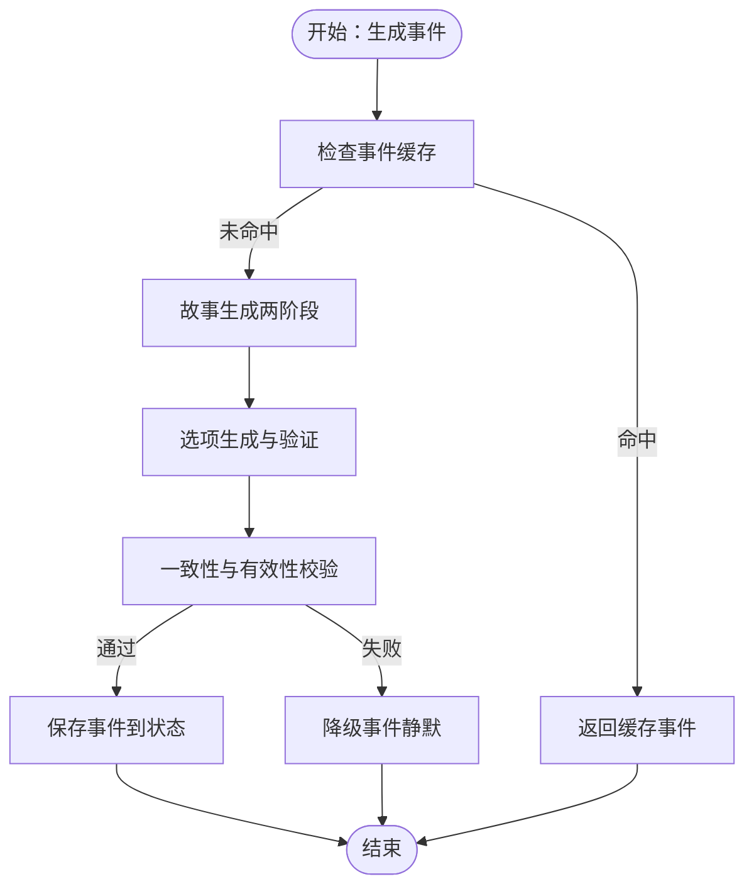
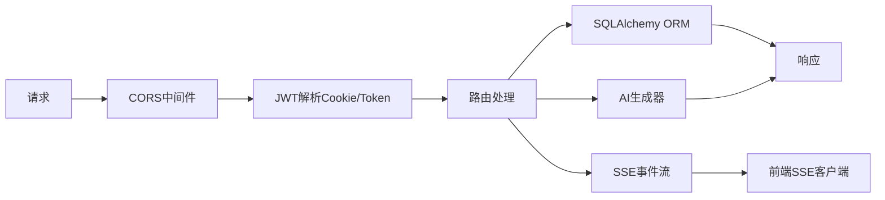

# 整体架构设计

<cite>
**本文档引用的文件**
- [README.md](file://README.md)
- [src/api/main.py](file://src/api/main.py)
- [frontend/src/app/layout.tsx](file://frontend/src/app/layout.tsx)
- [config/settings.py](file://config/settings.py)
- [config/logging_config.py](file://config/logging_config.py)
- [src/database/db.py](file://src/database/db.py)
- [src/database/models.py](file://src/database/models.py)
- [src/api/routers/games.py](file://src/api/routers/games.py)
- [frontend/src/lib/api.ts](file://frontend/src/lib/api.ts)
- [frontend/src/hooks/usePlayGame.ts](file://frontend/src/hooks/usePlayGame.ts)
- [src/game/game_loop.py](file://src/game/game_loop.py)
- [src/ai/generator.py](file://src/ai/generator.py)
- [src/api/deps.py](file://src/api/deps.py)
- [frontend/src/lib/sse.ts](file://frontend/src/lib/sse.ts)
- [requirements.txt](file://requirements.txt)
</cite>

## 目录
1. [简介](#简介)
2. [项目结构](#项目结构)
3. [核心组件](#核心组件)
4. [架构总览](#架构总览)
5. [详细组件分析](#详细组件分析)
6. [依赖关系分析](#依赖关系分析)
7. [性能考虑](#性能考虑)
8. [故障排除指南](#故障排除指南)
9. [结论](#结论)

## 简介
本项目“人生草稿本”是一个基于文本的沉浸式人生模拟游戏，采用分层架构设计：表现层（Next.js前端）、业务逻辑层（FastAPI后端）、数据访问层（SQLAlchemy ORM）。系统通过AI生成动态事件与故事，结合资源管理、决策制定与多结局机制，支持实时交互与流式输出（SSE）。技术选型上，FastAPI提供高性能异步API与强类型校验，Next.js提供现代化前端开发体验与SSR/CSR混合渲染；SQLAlchemy负责统一的数据访问抽象，支持本地SQLite与云数据库（PostgreSQL/MySQL）切换。

## 项目结构
项目采用前后端分离的单仓结构，主要目录与职责如下：
- config：全局配置与日志配置（环境变量、数据库URL、AI模型参数、日志策略）
- src：后端核心代码
  - api：FastAPI应用入口与路由模块（认证、角色、好友、游戏会话、剧情、图片等）
  - database：数据库模型与ORM操作封装
  - game：游戏核心逻辑（回合系统、决策处理、故事服务、年度总结等）
  - ai：AI事件生成与选项生成的子服务（故事生成、选项生成、摘要生成、重写）
  - mcp：关系管理服务（面向未来扩展）
  - services：图像服务与存储服务
  - utils：语言工具
- frontend：Next.js前端应用，包含页面、组件、Hooks、状态管理与API封装
- data：预设事件、缓存与图片存储
- tests：单元与集成测试
- 文档与部署相关文件：README、部署指南、Docker配置等



图表来源
- [src/api/main.py](file://src/api/main.py#L1-L134)
- [src/database/models.py](file://src/database/models.py#L1-L295)
- [src/database/db.py](file://src/database/db.py#L1-L910)
- [src/ai/generator.py](file://src/ai/generator.py#L1-L497)
- [src/game/game_loop.py](file://src/game/game_loop.py#L1-L592)
- [config/settings.py](file://config/settings.py#L1-L168)
- [config/logging_config.py](file://config/logging_config.py#L1-L78)
- [frontend/src/lib/api.ts](file://frontend/src/lib/api.ts#L1-L564)
- [frontend/src/lib/sse.ts](file://frontend/src/lib/sse.ts#L1-L520)

章节来源
- [README.md](file://README.md#L74-L87)
- [requirements.txt](file://requirements.txt#L1-L12)

## 核心组件
- 表现层（Next.js前端）
  - 页面与组件：布局、游戏主界面、角色创建、预设、存档、个人资料等
  - API封装：统一的REST客户端，支持Cookie与Bearer Token双认证策略
  - SSE客户端：直连后端的SSE流式客户端，支持断点续传与自动重连
  - 状态管理：集中式状态与局部Hook，解耦UI与业务逻辑
- 业务逻辑层（FastAPI后端）
  - 应用入口：生命周期管理、CORS配置、全局异常处理、健康检查与客户端日志收集
  - 路由模块：认证、好友、游戏会话（创建/加载/保存/删除/活跃会话）、剧情（事件/SSE/总结/重写）、图片（生成/重新生成/批量/场景插画）
  - 依赖注入：JWT解析、用户鉴权、数据库与用户管理、游戏会话获取
  - 会话存储：内存级会话缓存，配合数据库实现持久化
- 数据访问层（SQLAlchemy ORM）
  - 模型定义：用户、好友关系、游戏会话、状态快照、决策、结局、角色预设、图片与场景图片
  - 数据库操作：游戏CRUD、存档点与时间线、角色预设、图片元数据、活跃游戏管理
  - 引擎与会话：支持本地SQLite与云数据库（PostgreSQL/MySQL），连接池与预热

章节来源
- [frontend/src/app/layout.tsx](file://frontend/src/app/layout.tsx#L1-L48)
- [frontend/src/lib/api.ts](file://frontend/src/lib/api.ts#L1-L564)
- [frontend/src/lib/sse.ts](file://frontend/src/lib/sse.ts#L1-L520)
- [src/api/main.py](file://src/api/main.py#L1-L134)
- [src/api/routers/games.py](file://src/api/routers/games.py#L1-L389)
- [src/api/deps.py](file://src/api/deps.py#L1-L150)
- [src/database/models.py](file://src/database/models.py#L1-L295)
- [src/database/db.py](file://src/database/db.py#L1-L910)

## 架构总览
系统边界与交互关系：
- 前端通过REST与SSE与后端通信，SSE直连后端端口避免代理缓冲
- 后端通过依赖注入获取数据库与用户管理实例，路由层协调会话存储与业务服务
- 数据层统一通过SQLAlchemy ORM访问，支持SQLite与云数据库无缝切换
- AI生成器作为子服务聚合，提供事件生成、选项生成、摘要与重写能力



图表来源
- [frontend/src/lib/api.ts](file://frontend/src/lib/api.ts#L1-L564)
- [frontend/src/lib/sse.ts](file://frontend/src/lib/sse.ts#L1-L520)
- [src/api/main.py](file://src/api/main.py#L1-L134)
- [src/database/db.py](file://src/database/db.py#L1-L910)
- [src/ai/generator.py](file://src/ai/generator.py#L1-L497)

## 详细组件分析

### 表现层（Next.js前端）
- 组件与页面
  - 根布局与主题：全局样式、字体、viewport与错误上报组件
  - 游戏主流程：usePlayGame整合事件生成、选择处理、历史查看、存档与场景插画
- API封装
  - 双重认证：Cookie（httpOnly）优先，Authorization Header备选，自动检测可用性
  - 统一错误处理：捕获HTTP错误与JSON解析失败，远程上报
- SSE客户端
  - 直连后端端口，避免代理缓冲
  - 断点续传（Last-Event-ID）、指数退避重连、离线等待网络恢复
  - 事件类型：故事流、状态心跳、完成与错误



图表来源
- [frontend/src/lib/api.ts](file://frontend/src/lib/api.ts#L69-L124)
- [frontend/src/lib/sse.ts](file://frontend/src/lib/sse.ts#L120-L258)
- [src/api/main.py](file://src/api/main.py#L1-L134)

章节来源
- [frontend/src/app/layout.tsx](file://frontend/src/app/layout.tsx#L1-L48)
- [frontend/src/lib/api.ts](file://frontend/src/lib/api.ts#L1-L564)
- [frontend/src/lib/sse.ts](file://frontend/src/lib/sse.ts#L1-L520)
- [frontend/src/hooks/usePlayGame.ts](file://frontend/src/hooks/usePlayGame.ts#L1-L455)

### 业务逻辑层（FastAPI后端）
- 应用入口
  - 生命周期：启动初始化数据库，关闭清理
  - CORS：明确白名单（支持本地与局域网），允许凭证（Cookie认证）
  - 全局异常：统一500错误与客户端日志收集端点
  - 健康检查：会话统计
- 路由模块（示例：游戏会话）
  - 创建/列出/加载/保存/删除游戏
  - 活跃游戏恢复（服务端会话管理）
  - 存档点与时间线（手动存档与自动快照）
  - 事件生成与选择处理（同步回退方案）
- 依赖注入
  - JWT解析：Cookie优先，Authorization备选
  - 用户鉴权：非抛出式与抛出式两种依赖
  - 数据库与用户管理：单例懒加载
  - 游戏会话：从会话存储获取或重建

```mermaid
sequenceDiagram
participant FE as "前端"
participant API as "FastAPI路由"
participant DEPS as "依赖注入"
participant DB as "数据库操作"
participant AI as "AI生成器"
participant LOOP as "游戏循环"
FE->>API : "POST /api/games"
API->>DEPS : "获取当前用户/数据库"
DEPS-->>API : "用户ID/数据库实例"
API->>LOOP : "初始化游戏循环"
API->>DB : "持久化初始状态"
API-->>FE : "返回游戏状态"
FE->>API : "POST /api/games/ : id/save"
API->>DB : "保存进度快照"
API-->>FE : "保存结果"
```

图表来源
- [src/api/routers/games.py](file://src/api/routers/games.py#L26-L58)
- [src/api/deps.py](file://src/api/deps.py#L90-L150)
- [src/database/db.py](file://src/database/db.py#L336-L384)
- [src/game/game_loop.py](file://src/game/game_loop.py#L69-L98)

章节来源
- [src/api/main.py](file://src/api/main.py#L1-L134)
- [src/api/routers/games.py](file://src/api/routers/games.py#L1-L389)
- [src/api/deps.py](file://src/api/deps.py#L1-L150)

### 数据访问层（SQLAlchemy ORM）
- 模型关系
  - 用户与游戏：一对多，支持活跃游戏ID关联
  - 游戏与状态快照：一对多（自动快照与手动存档点）
  - 游戏与决策：一对多（记录选择与效果）
  - 游戏与结局：一对一（游戏结束时写入）
  - 图片与场景图片：多对多关联实体与版本控制
- 数据库操作
  - 游戏CRUD：创建、加载、保存、删除、列表
  - 存档系统：手动存档点、时间线查询、回溯加载
  - 角色预设：增删改查，支持公共与私有
  - 图片元数据：存储路径、版本、主图标记、引用关系
  - 会话恢复：活跃游戏ID记录与清理



图表来源
- [src/database/models.py](file://src/database/models.py#L11-L235)
- [src/database/db.py](file://src/database/db.py#L1-L910)

章节来源
- [src/database/models.py](file://src/database/models.py#L1-L295)
- [src/database/db.py](file://src/database/db.py#L1-L910)

### AI与游戏核心
- 事件生成器（Facade）
  - 子服务：故事生成、选项生成、摘要生成、重写
  - 缓存与预设：事件缓存与里程碑预设
  - 向后兼容：保留原有调用签名
- 游戏循环
  - 多回合系统：周推进、里程碑事件、4周/年总结
  - 决策处理：选项效果评估与状态更新
  - 回退机制：AI失败时的降级事件
- 配置与日志
  - 配置中心：AI模型、图像生成、数据库URL、调试开关
  - 日志配置：生产环境滚动日志与第三方库抑制



图表来源
- [src/ai/generator.py](file://src/ai/generator.py#L211-L268)
- [src/game/game_loop.py](file://src/game/game_loop.py#L161-L264)

章节来源
- [src/ai/generator.py](file://src/ai/generator.py#L1-L497)
- [src/game/game_loop.py](file://src/game/game_loop.py#L1-L592)
- [config/settings.py](file://config/settings.py#L1-L168)
- [config/logging_config.py](file://config/logging_config.py#L1-L78)

## 依赖关系分析
- 技术栈与版本
  - Python生态：FastAPI、SQLAlchemy、Pydantic、httpx、python-jose、pytest
  - 前端生态：Next.js、React、TypeScript
- 跨层关注点
  - CORS：后端明确白名单与凭证支持，前端Cookie自动发送
  - 认证：JWT优先Cookie，Authorization备选，统一解析与校验
  - 异常与日志：全局异常捕获与客户端日志上报，生产环境滚动日志
  - SSE：前端直连后端端口，避免代理缓冲，支持断点续传与自动重连



图表来源
- [src/api/main.py](file://src/api/main.py#L42-L66)
- [src/api/deps.py](file://src/api/deps.py#L70-L132)
- [frontend/src/lib/sse.ts](file://frontend/src/lib/sse.ts#L36-L44)

章节来源
- [requirements.txt](file://requirements.txt#L1-L12)
- [src/api/main.py](file://src/api/main.py#L1-L134)
- [src/api/deps.py](file://src/api/deps.py#L1-L150)
- [frontend/src/lib/sse.ts](file://frontend/src/lib/sse.ts#L1-L520)

## 性能考虑
- SSE流式渲染：减少首屏等待，提升实时交互体验
- 事件缓存：降低重复AI调用成本，提高响应速度
- 数据库连接：云数据库使用预热与连接池，本地SQLite满足开发需求
- 会话存储：内存级会话缓存，结合数据库持久化，平衡性能与可靠性
- 图像生成：支持多模型降级与重试，保障生成稳定性

## 故障排除指南
- CORS错误
  - 确认前端Origin已在后端白名单中，或通过环境变量追加
  - Cookie认证需allow_credentials=True
- 认证失败
  - 检查Cookie与Authorization头是否正确设置
  - 确认JWT密钥与算法一致
- SSE连接失败
  - 确认直连后端端口，避免代理缓冲
  - 检查网络状态与自动重连策略
- 数据库连接
  - 本地：SQLite路径与权限
  - 云数据库：DATABASE_URL配置与驱动安装

章节来源
- [src/api/main.py](file://src/api/main.py#L42-L66)
- [src/api/deps.py](file://src/api/deps.py#L70-L132)
- [frontend/src/lib/sse.ts](file://frontend/src/lib/sse.ts#L36-L44)
- [config/settings.py](file://config/settings.py#L107-L141)

## 结论
本项目通过清晰的分层架构实现了高内聚、低耦合的系统设计：前端专注用户体验与实时交互，后端提供稳定可靠的业务能力，数据层统一抽象与可扩展。FastAPI + Next.js的组合兼顾了开发效率与运行性能，SQLAlchemy与AI子服务进一步增强了可维护性与可扩展性。跨层关注点（CORS、认证、日志、SSE）均在架构层面得到妥善处理，为AI生成与实时交互提供了坚实的技术基础。