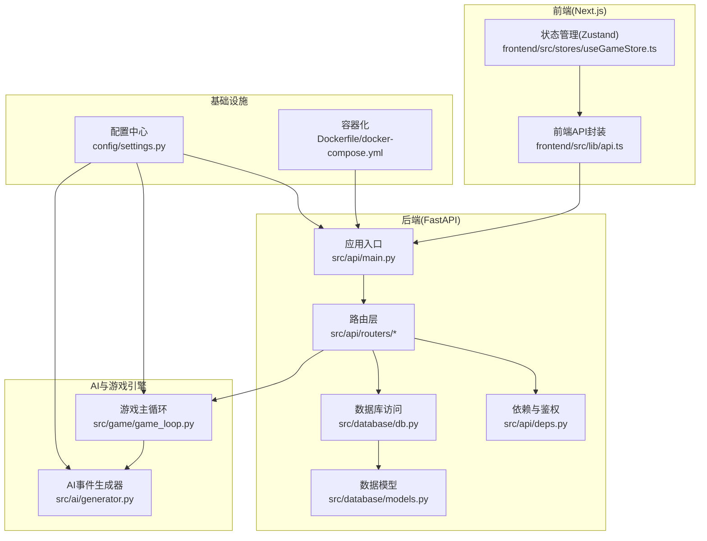
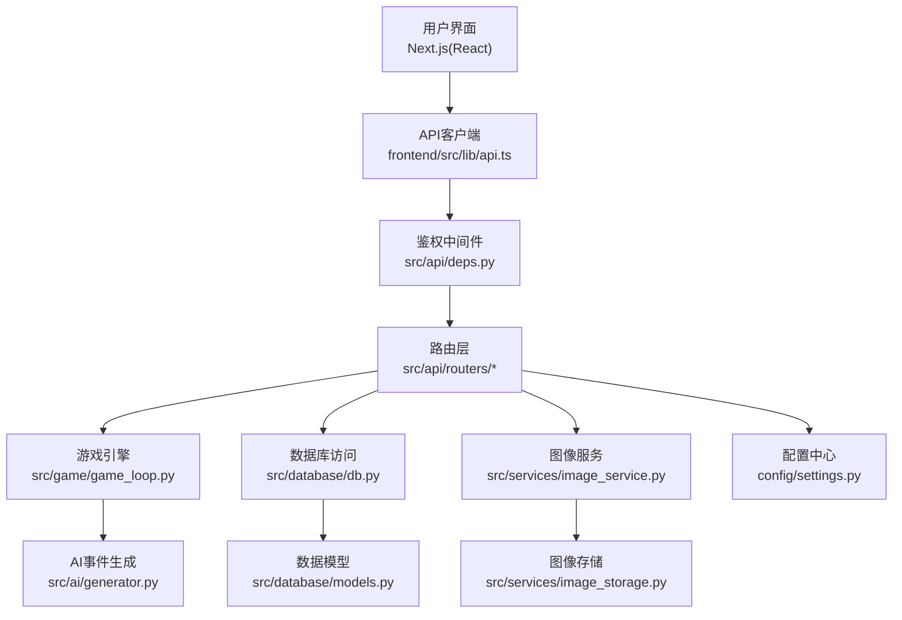
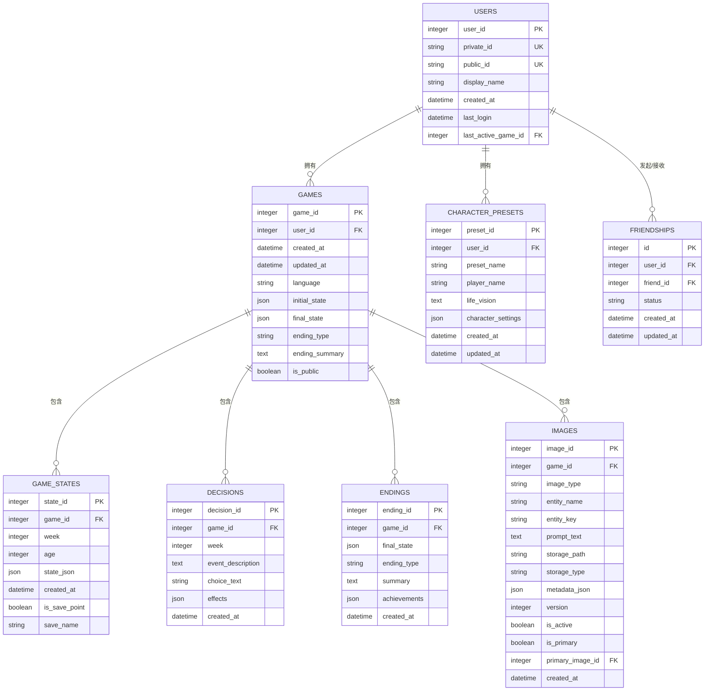
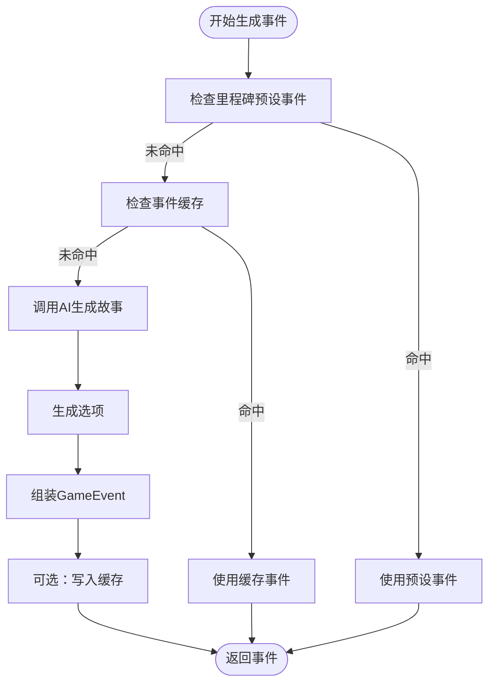
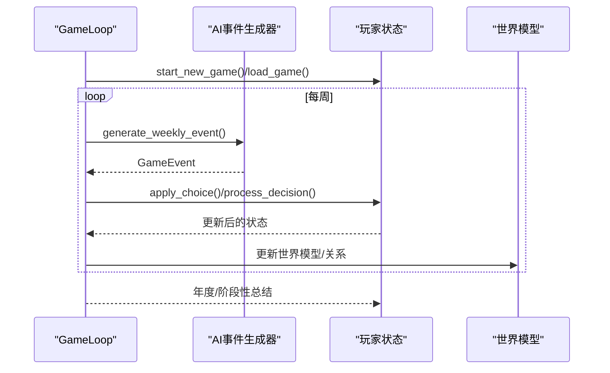
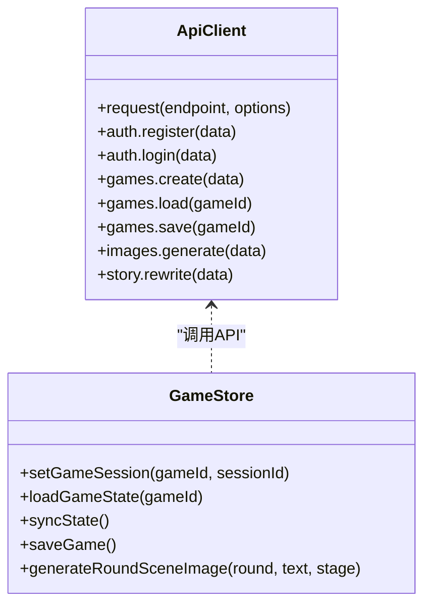
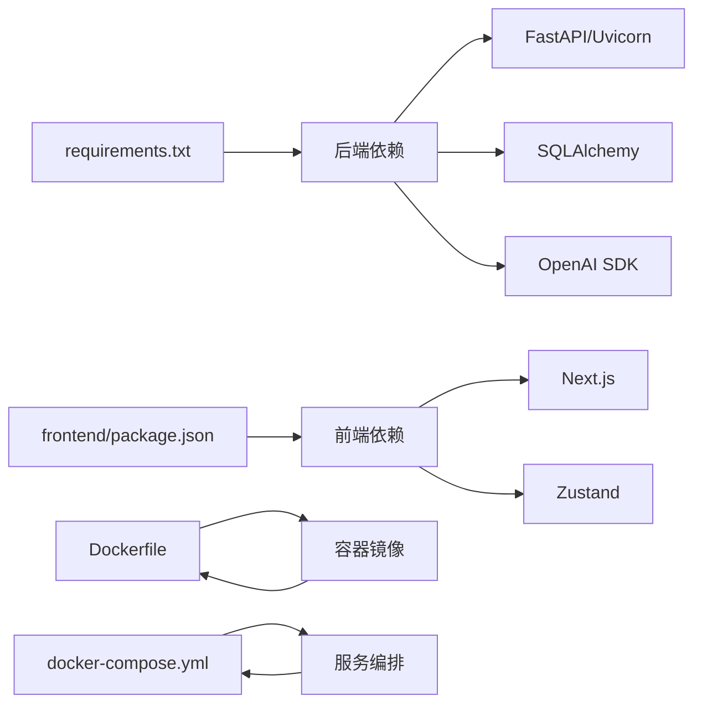

# 系统架构

<cite>
**本文引用的文件**
- [README.md](file://README.md)
- [requirements.txt](file://requirements.txt)
- [package.json](file://frontend/package.json)
- [Dockerfile](file://Dockerfile)
- [docker-compose.yml](file://docker-compose.yml)
- [DEPLOYMENT.md](file://DEPLOYMENT.md)
- [config/settings.py](file://config/settings.py)
- [src/api/main.py](file://src/api/main.py)
- [src/api/routers/games.py](file://src/api/routers/games.py)
- [src/api/deps.py](file://src/api/deps.py)
- [src/database/models.py](file://src/database/models.py)
- [src/database/db.py](file://src/database/db.py)
- [src/ai/generator.py](file://src/ai/generator.py)
- [src/game/game_loop.py](file://src/game/game_loop.py)
- [frontend/src/lib/api.ts](file://frontend/src/lib/api.ts)
- [frontend/src/stores/useGameStore.ts](file://frontend/src/stores/useGameStore.ts)
</cite>

## 目录
1. [简介](#简介)
2. [项目结构](#项目结构)
3. [核心组件](#核心组件)
4. [架构总览](#架构总览)
5. [详细组件分析](#详细组件分析)
6. [依赖关系分析](#依赖关系分析)
7. [性能考量](#性能考量)
8. [故障排查指南](#故障排查指南)
9. [结论](#结论)
10. [附录](#附录)

## 简介
“人生草稿本”是一个基于文本的互动叙事游戏，结合AI动态生成事件、资源管理与多结局剧情。系统采用分层架构，包含表现层（Next.js 前端）、业务逻辑层（FastAPI 后端 + 游戏引擎）、数据访问层（SQLAlchemy + SQLite/PostgreSQL），并通过容器化与多部署方案实现可扩展与可运维。

## 项目结构
项目采用按功能域划分的分层组织：
- config：配置与提示词管理
- src：核心业务代码（AI、游戏引擎、API、数据库、服务）
- frontend：Next.js 前端（TypeScript + Zustand 状态管理）
- data：预设事件、缓存与图片存储
- tests：单元与集成测试
- docs：文档与测试计划
- 根目录：Docker 配置、部署脚本与环境变量



图表来源
- [src/api/main.py](file://src/api/main.py#L1-L134)
- [src/api/routers/games.py](file://src/api/routers/games.py#L1-L200)
- [src/database/db.py](file://src/database/db.py#L1-L120)
- [src/database/models.py](file://src/database/models.py#L1-L200)
- [src/ai/generator.py](file://src/ai/generator.py#L1-L120)
- [src/game/game_loop.py](file://src/game/game_loop.py#L1-L120)
- [frontend/src/lib/api.ts](file://frontend/src/lib/api.ts#L1-L120)
- [frontend/src/stores/useGameStore.ts](file://frontend/src/stores/useGameStore.ts#L1-L120)
- [config/settings.py](file://config/settings.py#L1-L168)
- [Dockerfile](file://Dockerfile#L1-L40)
- [docker-compose.yml](file://docker-compose.yml#L1-L65)

章节来源
- [README.md](file://README.md#L74-L87)
- [config/settings.py](file://config/settings.py#L1-L168)
- [Dockerfile](file://Dockerfile#L1-L40)
- [docker-compose.yml](file://docker-compose.yml#L1-L65)

## 核心组件
- 配置与设置：集中于 config/settings.py，统一管理AI、图像、数据库、语言与游戏常量。
- 后端服务：FastAPI 应用入口与路由，负责认证、游戏会话、存档与事件生成。
- 数据层：SQLAlchemy 模型与数据库操作封装，支持 SQLite 与 PostgreSQL。
- AI 与叙事：事件生成器与故事压缩/重写模块，支撑多轮叙事与一致性校验。
- 游戏引擎：游戏主循环与回合系统，协调事件生成、决策处理与世界模型更新。
- 前端：Next.js + Zustand，提供会话状态、事件流、图片生成与回溯存档。

章节来源
- [config/settings.py](file://config/settings.py#L27-L168)
- [src/api/main.py](file://src/api/main.py#L1-L134)
- [src/database/models.py](file://src/database/models.py#L1-L200)
- [src/database/db.py](file://src/database/db.py#L1-L120)
- [src/ai/generator.py](file://src/ai/generator.py#L1-L120)
- [src/game/game_loop.py](file://src/game/game_loop.py#L1-L120)
- [frontend/src/lib/api.ts](file://frontend/src/lib/api.ts#L1-L120)
- [frontend/src/stores/useGameStore.ts](file://frontend/src/stores/useGameStore.ts#L1-L120)

## 架构总览
系统采用分层架构与清晰的职责分离：
- 表现层：Next.js 前端，Zustand 管理游戏状态，API 封装统一鉴权与错误处理。
- 业务逻辑层：FastAPI 路由与服务，会话管理与鉴权，调用游戏引擎与AI模块。
- 数据访问层：SQLAlchemy ORM，抽象数据库操作，支持本地 SQLite 与云数据库。
- 集成模式：CORS 支持 Cookie 认证；SSE 与同步回退；图像生成与存储抽象。
- 安全性：JWT Cookie 认证优先，支持 Authorization Header 备选；全局异常处理与健康检查。
- 可观测性：客户端日志上报、健康检查端点、Docker 健康检查与资源限制。



图表来源
- [frontend/src/lib/api.ts](file://frontend/src/lib/api.ts#L1-L120)
- [src/api/deps.py](file://src/api/deps.py#L44-L87)
- [src/api/routers/games.py](file://src/api/routers/games.py#L1-L200)
- [src/game/game_loop.py](file://src/game/game_loop.py#L1-L120)
- [src/ai/generator.py](file://src/ai/generator.py#L1-L120)
- [src/database/db.py](file://src/database/db.py#L1-L120)
- [src/database/models.py](file://src/database/models.py#L1-L200)

## 详细组件分析

### 后端应用与路由
- 应用入口：初始化数据库、注册路由、CORS 配置、全局异常处理与健康检查端点。
- 路由层：认证、好友、游戏、角色、预设、玩法、故事与图像路由，统一前缀与标签。
- 会话与鉴权：支持 Cookie 与 Authorization 双重认证，优先 Cookie；提供当前活跃游戏恢复。

```mermaid
sequenceDiagram
participant C as "客户端"
participant API as "FastAPI应用"
participant AUTH as "鉴权中间件"
participant ROUTE as "游戏路由"
participant DB as "数据库访问"
participant LOOP as "游戏引擎"
C->>API : GET /api/games/active
API->>AUTH : 提取并验证token(Cookie/Authorization)
AUTH-->>API : user_id
API->>ROUTE : get_active_game(user_id)
ROUTE->>DB : get_active_game(user_id)
DB-->>ROUTE : game_id
ROUTE->>DB : load_saved_game(game_id, user_id)
DB-->>ROUTE : state_data
ROUTE->>LOOP : GameLoop.load_game(state_data)
ROUTE-->>API : GameStateResponse
API-->>C : 200 OK
```

图表来源
- [src/api/main.py](file://src/api/main.py#L1-L134)
- [src/api/routers/games.py](file://src/api/routers/games.py#L83-L127)
- [src/database/db.py](file://src/database/db.py#L385-L427)
- [src/game/game_loop.py](file://src/game/game_loop.py#L100-L160)
- [src/api/deps.py](file://src/api/deps.py#L70-L87)

章节来源
- [src/api/main.py](file://src/api/main.py#L24-L100)
- [src/api/routers/games.py](file://src/api/routers/games.py#L83-L127)
- [src/api/deps.py](file://src/api/deps.py#L44-L87)

### 数据模型与持久化
- 用户、好友关系、游戏会话、状态快照、决策记录、结局、角色预设、图像与场景图等模型。
- 数据库访问封装：创建/查询/删除、存档点管理、活跃游戏记录、故事检索与搜索。
- 多数据库支持：优先 DATABASE_URL（云数据库），否则使用本地 SQLite。



图表来源
- [src/database/models.py](file://src/database/models.py#L11-L200)

章节来源
- [src/database/models.py](file://src/database/models.py#L1-L200)
- [src/database/db.py](file://src/database/db.py#L1-L120)

### AI 事件生成与故事管理
- 事件生成器：门面模式整合故事生成、选项生成、摘要与重写。
- 缓存与预设：事件缓存与里程碑预设事件优先。
- 一致性与检索：历史故事检索与关键词搜索，支持一致性校验。



图表来源
- [src/ai/generator.py](file://src/ai/generator.py#L211-L268)

章节来源
- [src/ai/generator.py](file://src/ai/generator.py#L1-L120)
- [src/ai/generator.py](file://src/ai/generator.py#L211-L268)

### 游戏主循环与回合系统
- 初始化与加载：从初始状态或存档加载，恢复周数、年份摘要与当前事件。
- 事件生成：每周生成事件，里程碑优先；并发与超时保护。
- 决策处理：处理选择与效果，推进周/回合进度。
- 年度总结：周期性生成周/月/年总结，维护世界模型。



图表来源
- [src/game/game_loop.py](file://src/game/game_loop.py#L69-L160)
- [src/ai/generator.py](file://src/ai/generator.py#L211-L268)

章节来源
- [src/game/game_loop.py](file://src/game/game_loop.py#L1-L120)

### 前端状态管理与API封装
- API 客户端：统一 Base URL、Cookie 与 Authorization 双重认证、错误处理与远程日志上报。
- 状态管理：useGameStore 组合事件、图片、角色创建、存档与预设等子状态，支持持久化。
- 功能覆盖：创建/加载/保存/删除游戏、生成事件、做选择、生成/重生成图片、时间回溯存档。



图表来源
- [frontend/src/lib/api.ts](file://frontend/src/lib/api.ts#L1-L120)
- [frontend/src/stores/useGameStore.ts](file://frontend/src/stores/useGameStore.ts#L161-L200)

章节来源
- [frontend/src/lib/api.ts](file://frontend/src/lib/api.ts#L1-L120)
- [frontend/src/stores/useGameStore.ts](file://frontend/src/stores/useGameStore.ts#L1-L120)

## 依赖关系分析
- 技术栈与版本：
  - 后端：FastAPI、Uvicorn、SQLAlchemy、Pydantic、OpenAI SDK、Jinja/模板（用于文档）。
  - 前端：Next.js 16、React 19、Zustand、Radix UI、TailwindCSS。
  - 基础设施：Docker、Docker Compose、PostgreSQL（可选）。
- 第三方依赖与兼容性：
  - Python 依赖集中在 requirements.txt；前端依赖在 package.json。
  - Dockerfile 固定 Python 3.9 基础镜像，安装系统依赖与应用依赖。
- 外部集成：
  - OpenAI 兼容接口（文本/图像/场景分析），支持多模型降级与超时重试。
  - 图像存储支持本地与 OSS，抽象化存储接口。



图表来源
- [requirements.txt](file://requirements.txt#L1-L12)
- [package.json](file://frontend/package.json#L1-L49)
- [Dockerfile](file://Dockerfile#L1-L40)
- [docker-compose.yml](file://docker-compose.yml#L1-L65)

章节来源
- [requirements.txt](file://requirements.txt#L1-L12)
- [package.json](file://frontend/package.json#L1-L49)
- [Dockerfile](file://Dockerfile#L1-L40)
- [docker-compose.yml](file://docker-compose.yml#L1-L65)

## 性能考量
- 事件生成与缓存：启用事件缓存与多模型降级，减少重复调用与成本。
- 数据库：SQLite 适用于开发/小规模，生产建议 PostgreSQL；索引与查询优化（如按游戏/类型/实体名）。
- 并发与超时：游戏循环防止并发生成，设置生成超时自动恢复。
- 前端：Zustand 减少不必要的重渲染；图片批量生成与版本控制降低网络压力。
- 容器：资源限制与健康检查保障稳定性。

## 故障排查指南
- 认证问题：确认 Cookie 是否可用，若不可用检查 Authorization Header；核对鉴权中间件提取逻辑。
- 数据库问题：检查 DATABASE_URL 与本地 SQLite 路径；确认表结构与索引是否存在。
- AI 服务问题：检查 OPENAI_API_KEY/OPENAI_BASE_URL 与模型配置；查看超时与重试策略。
- 健康检查：后端健康端点与 Docker 健康检查；Nginx/SSL 配置（生产环境）。
- 日志与追踪：后端全局异常处理与客户端日志上报；Docker 日志与系统日志。

章节来源
- [src/api/main.py](file://src/api/main.py#L69-L77)
- [src/api/deps.py](file://src/api/deps.py#L70-L87)
- [config/settings.py](file://config/settings.py#L107-L141)
- [DEPLOYMENT.md](file://DEPLOYMENT.md#L203-L234)

## 结论
本系统通过清晰的分层架构与模块化设计，实现了从表现层到业务逻辑再到数据访问的解耦。借助 FastAPI、SQLAlchemy、Next.js 与 Zustand，系统具备良好的可维护性与扩展性。结合容器化与多部署方案，满足从小规模到生产环境的不同需求。AI 与图像服务的抽象化设计，便于未来接入更多模型与存储方案。

## 附录
- 部署拓扑：单容器（开发/演示）与多服务编排（生产）两种模式；支持 HTTPS 与健康检查。
- 安全性：Cookie 优先认证、CORS 明确白名单、全局异常处理与客户端日志上报。
- 可观测性：健康检查端点、Docker 健康检查、日志与备份策略。

章节来源
- [DEPLOYMENT.md](file://DEPLOYMENT.md#L1-L352)
- [Dockerfile](file://Dockerfile#L34-L40)
- [docker-compose.yml](file://docker-compose.yml#L28-L33)