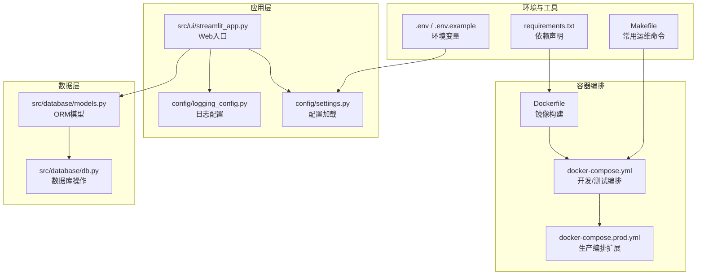
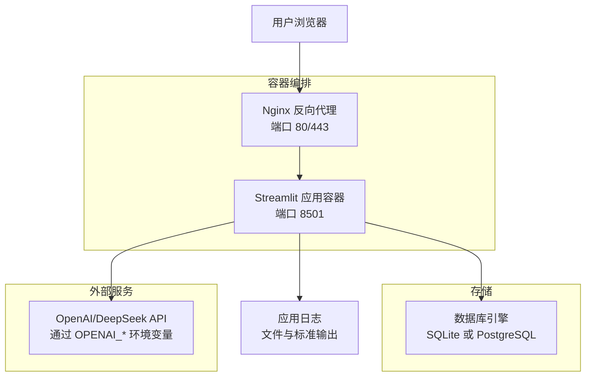
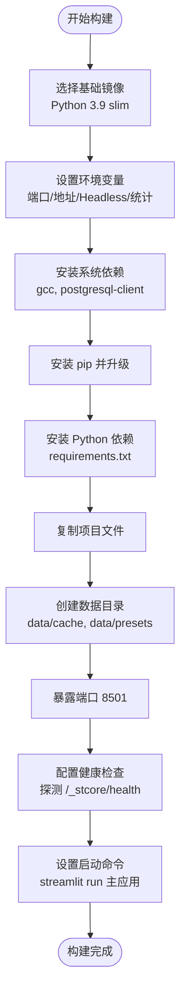
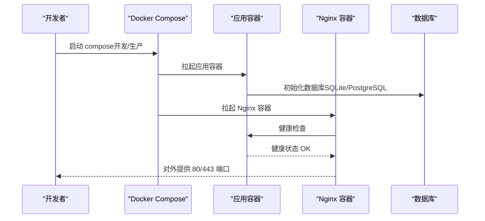
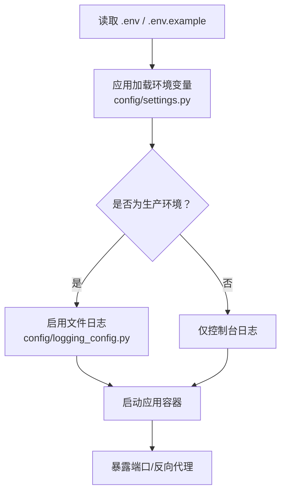
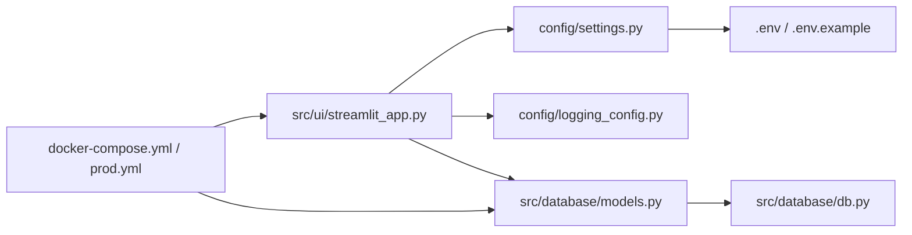

# 部署与运维

<cite>
**本文引用的文件**
- [Dockerfile](file://Dockerfile)
- [docker-compose.yml](file://docker-compose.yml)
- [docker-compose.prod.yml](file://docker-compose.prod.yml)
- [DEPLOYMENT.md](file://DEPLOYMENT.md)
- [requirements.txt](file://requirements.txt)
- [.env](file://.env)
- [.env.example](file://.env.example)
- [Makefile](file://Makefile)
- [config/settings.py](file://config/settings.py)
- [config/logging_config.py](file://config/logging_config.py)
- [src/ui/streamlit_app.py](file://src/ui/streamlit_app.py)
- [src/database/models.py](file://src/database/models.py)
- [src/database/db.py](file://src/database/db.py)
- [check_flow.py](file://check_flow.py)
</cite>

## 目录
1. [简介](#简介)
2. [项目结构](#项目结构)
3. [核心组件](#核心组件)
4. [架构总览](#架构总览)
5. [详细组件分析](#详细组件分析)
6. [依赖关系分析](#依赖关系分析)
7. [性能考虑](#性能考虑)
8. [故障排除指南](#故障排除指南)
9. [结论](#结论)
10. [附录](#附录)

## 简介
本指南面向“人生草稿本”项目的部署与运维，覆盖容器化构建、编排与服务发现、多环境部署策略（开发、测试、生产）、配置管理、负载均衡与健康检查、自动扩缩容、监控与日志、告警、备份与灾难恢复、安全加固以及性能调优与故障排除流程。文档基于仓库中的实际配置文件与代码进行说明，并提供可视化图示帮助理解。

## 项目结构
项目采用分层组织方式，前端为 Streamlit Web 应用，后端为 Python 应用，数据库支持 SQLite 与 PostgreSQL。容器化通过 Dockerfile 和 docker-compose 进行编排，生产环境通过 docker-compose.prod.yml 扩展 Nginx 反向代理与日志策略。

图表来源
- [Dockerfile](file://Dockerfile#L1-L48)
- [docker-compose.yml](file://docker-compose.yml#L1-L65)
- [docker-compose.prod.yml](file://docker-compose.prod.yml#L1-L43)
- [src/ui/streamlit_app.py](file://src/ui/streamlit_app.py#L1-L215)
- [config/settings.py](file://config/settings.py#L1-L100)
- [config/logging_config.py](file://config/logging_config.py#L1-L78)
- [src/database/models.py](file://src/database/models.py#L1-L171)
- [src/database/db.py](file://src/database/db.py#L1-L200)
- [.env](file://.env#L1-L9)
- [.env.example](file://.env.example#L1-L18)
- [requirements.txt](file://requirements.txt#L1-L9)
- [Makefile](file://Makefile#L1-L93)

章节来源
- [Dockerfile](file://Dockerfile#L1-L48)
- [docker-compose.yml](file://docker-compose.yml#L1-L65)
- [docker-compose.prod.yml](file://docker-compose.prod.yml#L1-L43)
- [src/ui/streamlit_app.py](file://src/ui/streamlit_app.py#L1-L215)
- [config/settings.py](file://config/settings.py#L1-L100)
- [config/logging_config.py](file://config/logging_config.py#L1-L78)
- [src/database/models.py](file://src/database/models.py#L1-L171)
- [src/database/db.py](file://src/database/db.py#L1-L200)
- [.env](file://.env#L1-L9)
- [.env.example](file://.env.example#L1-L18)
- [requirements.txt](file://requirements.txt#L1-L9)
- [Makefile](file://Makefile#L1-L93)

## 核心组件
- 容器镜像与构建
  - 基于精简 Python 3.9 镜像，安装系统依赖（如 PostgreSQL 客户端），复制依赖与项目文件，设置工作目录与数据目录权限，暴露端口并配置健康检查，最终以 Streamlit 运行应用。
- 编排与服务
  - docker-compose.yml 提供开发/测试环境，包含应用服务、环境变量注入、持久化卷、健康检查与资源限制；docker-compose.prod.yml 在此基础上扩展 Nginx 反向代理、日志轮转与生产安全参数。
- 配置管理
  - .env 与 .env.example 提供 API 密钥、模型、语言、缓存开关与数据库 URL 等配置；config/settings.py 加载环境变量并提供数据库 URL 解析逻辑；config/logging_config.py 在生产环境启用文件日志与第三方库日志级别控制。
- 数据层
  - SQLAlchemy 模型定义用户、好友关系、游戏会话、状态快照、决策与结局；db.py 提供增删改查与状态恢复能力；models.py 根据 DATABASE_URL 判断使用 SQLite 或 PostgreSQL。
- 运维工具
  - Makefile 提供一键构建、启动、停止、查看日志、状态与部署命令，简化本地与 CI/CD 流程。

章节来源
- [Dockerfile](file://Dockerfile#L1-L48)
- [docker-compose.yml](file://docker-compose.yml#L1-L65)
- [docker-compose.prod.yml](file://docker-compose.prod.yml#L1-L43)
- [.env](file://.env#L1-L9)
- [.env.example](file://.env.example#L1-L18)
- [config/settings.py](file://config/settings.py#L1-L100)
- [config/logging_config.py](file://config/logging_config.py#L1-L78)
- [src/database/models.py](file://src/database/models.py#L1-L171)
- [src/database/db.py](file://src/database/db.py#L1-L200)
- [Makefile](file://Makefile#L1-L93)

## 架构总览
下图展示从客户端到应用、数据库与外部 AI 服务的整体交互，以及生产环境通过 Nginx 的反向代理与 HTTPS 支持。

图表来源
- [docker-compose.prod.yml](file://docker-compose.prod.yml#L1-L43)
- [docker-compose.yml](file://docker-compose.yml#L1-L65)
- [src/ui/streamlit_app.py](file://src/ui/streamlit_app.py#L1-L215)
- [config/settings.py](file://config/settings.py#L1-L100)
- [config/logging_config.py](file://config/logging_config.py#L1-L78)
- [src/database/models.py](file://src/database/models.py#L1-L171)

## 详细组件分析

### 容器镜像构建流程
- 基础镜像与工作目录
  - 使用 slim 版 Python 3.9，设置工作目录与环境变量（端口、地址、Headless、统计关闭等）。
- 系统依赖与 Python 依赖
  - 安装 gcc 与 postgresql-client，安装 pip 并升级 pip，再安装 requirements.txt 中的依赖。
- 项目与数据目录
  - 复制项目文件，创建 data/cache 与 data/presets 目录并赋予权限。
- 端口与健康检查
  - 暴露 8501 端口，使用健康检查命令探测 Streamlit 内部健康端点。
- 启动命令
  - 以 streamlit run 启动主应用文件，并传递服务器参数。

图表来源
- [Dockerfile](file://Dockerfile#L1-L48)

章节来源
- [Dockerfile](file://Dockerfile#L1-L48)

### 编排与服务发现
- 开发/测试编排
  - 应用服务绑定主机 8501 端口映射，注入 OPENAI_*、DATABASE_URL、DEFAULT_LANGUAGE、CACHE_EVENTS 等环境变量，挂载 data 目录实现持久化，配置健康检查与资源限制。
- 生产环境扩展
  - 继承基础配置，设置 ENVIRONMENT=production、CORS 关闭、XSRF 保护开启，移除端口暴露并通过 Nginx 反向代理，配置 Nginx 容器与 SSL 证书挂载，启用 json-file 日志轮转。
- 服务发现
  - 应用内部通过 DATABASE_URL 判定数据库类型；Nginx 通过依赖关系等待应用就绪后再对外提供服务。

图表来源
- [docker-compose.yml](file://docker-compose.yml#L1-L65)
- [docker-compose.prod.yml](file://docker-compose.prod.yml#L1-L43)

章节来源
- [docker-compose.yml](file://docker-compose.yml#L1-L65)
- [docker-compose.prod.yml](file://docker-compose.prod.yml#L1-L43)

### 多环境部署策略与配置管理
- 环境变量优先级
  - .env 与 .env.example 提供默认值与占位符；应用通过 config/settings.py 读取环境变量；Streamlit Cloud 通过 secrets 注入环境变量。
- 开发环境
  - 本地 docker-compose 启动，端口映射便于调试，健康检查与资源限制可按需调整。
- 测试环境
  - 可复用开发配置，结合 Makefile 的测试与质量检查目标进行自动化验证。
- 生产环境
  - 使用 docker-compose.prod.yml 启动，Nginx 反代、HTTPS、日志轮转、安全参数与健康检查均在编排中体现。

图表来源
- [.env](file://.env#L1-L9)
- [.env.example](file://.env.example#L1-L18)
- [config/settings.py](file://config/settings.py#L1-L100)
- [config/logging_config.py](file://config/logging_config.py#L1-L78)
- [docker-compose.yml](file://docker-compose.yml#L1-L65)
- [docker-compose.prod.yml](file://docker-compose.prod.yml#L1-L43)

章节来源
- [.env](file://.env#L1-L9)
- [.env.example](file://.env.example#L1-L18)
- [config/settings.py](file://config/settings.py#L1-L100)
- [config/logging_config.py](file://config/logging_config.py#L1-L78)
- [docker-compose.yml](file://docker-compose.yml#L1-L65)
- [docker-compose.prod.yml](file://docker-compose.prod.yml#L1-L43)

### 负载均衡、健康检查与自动扩缩容
- 负载均衡
  - 生产环境通过 Nginx 反向代理统一入口，支持 HTTP/HTTPS。
- 健康检查
  - 应用与 Nginx 均配置健康检查探针，确保服务可用性。
- 自动扩缩容
  - docker-compose.yml 中提供 deploy.resources 限制，可在更高层编排（如 Swarm/Kubernetes）中进一步启用副本与扩缩容策略。

章节来源
- [docker-compose.yml](file://docker-compose.yml#L1-L65)
- [docker-compose.prod.yml](file://docker-compose.prod.yml#L1-L43)

### 监控、日志与告警
- 日志
  - 生产环境启用文件日志与第三方库日志级别控制；Nginx 使用 json-file 驱动并配置轮转大小与文件数。
- 监控与告警
  - 建议结合系统监控（如 cAdvisor/Prometheus/Grafana）与日志聚合（如 ELK/Fluent Bit/Loki）实现指标采集与告警。

章节来源
- [config/logging_config.py](file://config/logging_config.py#L1-L78)
- [docker-compose.prod.yml](file://docker-compose.prod.yml#L1-L43)

### 备份、灾难恢复与安全加固
- 备份
  - 数据目录持久化，可通过 tar 备份 data；PostgreSQL 可使用 pg_dump 备份。
- 灾难恢复
  - 恢复时先还原 data 目录，再导入数据库备份。
- 安全加固
  - 生产环境启用 XSRF 保护、关闭 CORS、使用 HTTPS、限制服务器访问、定期更新依赖、避免提交 .env 至版本库。

章节来源
- [DEPLOYMENT.md](file://DEPLOYMENT.md#L226-L308)
- [docker-compose.prod.yml](file://docker-compose.prod.yml#L1-L43)
- [config/settings.py](file://config/settings.py#L1-L100)

### 性能调优建议
- 数据库
  - 生产环境使用 PostgreSQL 替代 SQLite。
- 缓存
  - 启用事件缓存（CACHE_EVENTS=true）。
- 静态资源与中间层
  - 使用 CDN 与 Nginx 缓存（可选）。
- 资源限制
  - 根据服务器配置调整 compose 中的 CPU 与内存限制。

章节来源
- [DEPLOYMENT.md](file://DEPLOYMENT.md#L310-L317)
- [docker-compose.yml](file://docker-compose.yml#L1-L65)

## 依赖关系分析
应用层依赖配置层与数据库层，编排层负责容器生命周期与网络拓扑，环境变量贯穿配置与运行时行为。

图表来源
- [src/ui/streamlit_app.py](file://src/ui/streamlit_app.py#L1-L215)
- [config/settings.py](file://config/settings.py#L1-L100)
- [config/logging_config.py](file://config/logging_config.py#L1-L78)
- [src/database/models.py](file://src/database/models.py#L1-L171)
- [src/database/db.py](file://src/database/db.py#L1-L200)
- [.env](file://.env#L1-L9)
- [.env.example](file://.env.example#L1-L18)
- [docker-compose.yml](file://docker-compose.yml#L1-L65)
- [docker-compose.prod.yml](file://docker-compose.prod.yml#L1-L43)

章节来源
- [src/ui/streamlit_app.py](file://src/ui/streamlit_app.py#L1-L215)
- [config/settings.py](file://config/settings.py#L1-L100)
- [config/logging_config.py](file://config/logging_config.py#L1-L78)
- [src/database/models.py](file://src/database/models.py#L1-L171)
- [src/database/db.py](file://src/database/db.py#L1-L200)
- [.env](file://.env#L1-L9)
- [.env.example](file://.env.example#L1-L18)
- [docker-compose.yml](file://docker-compose.yml#L1-L65)
- [docker-compose.prod.yml](file://docker-compose.prod.yml#L1-L43)

## 性能考虑
- 数据库选择
  - 生产环境优先 PostgreSQL，提升并发与稳定性。
- 缓存策略
  - 启用事件缓存减少重复请求。
- 静态资源与反代
  - Nginx 提供静态资源与缓存能力，降低应用压力。
- 资源配额
  - 合理设置 CPU 与内存上限，避免资源争抢。

章节来源
- [DEPLOYMENT.md](file://DEPLOYMENT.md#L310-L317)
- [docker-compose.yml](file://docker-compose.yml#L1-L65)

## 故障排除指南
- 更新应用
  - 拉取代码、重建镜像、重启服务。
- 查看日志
  - 应用与 Nginx 日志分别查看；容器内可查看 logs/app.log。
- 健康检查
  - 应用健康端点与 Nginx 健康检查命令验证。
- 数据库配置
  - SQLite 默认无需额外配置；PostgreSQL 需取消注释对应服务并设置 DATABASE_URL。
- HTTPS 设置
  - 使用 Let’s Encrypt 或手动放置证书文件。
- 资源限制
  - 根据服务器配置调整 compose 中的 deploy.resources。
- 备份与恢复
  - 备份 data 目录与数据库；恢复时按顺序还原。

章节来源
- [DEPLOYMENT.md](file://DEPLOYMENT.md#L237-L308)
- [docker-compose.yml](file://docker-compose.yml#L1-L65)
- [docker-compose.prod.yml](file://docker-compose.prod.yml#L1-L43)

## 结论
本指南基于仓库现有配置与代码，给出了从容器化构建、编排到生产部署与运维的完整实践路径。建议在生产环境中结合 Nginx 反代、HTTPS、日志轮转与健康检查，并配合监控与告警体系，持续优化数据库与缓存策略，确保系统的高可用与可维护性。

## 附录
- 常用运维命令
  - Makefile 提供构建、启动、停止、查看日志、状态与部署命令，便于本地与 CI/CD 使用。
- 配置文件清单
  - Dockerfile、docker-compose.yml、docker-compose.prod.yml、.env、.env.example、requirements.txt、Makefile、config/settings.py、config/logging_config.py、src/ui/streamlit_app.py、src/database/models.py、src/database/db.py、check_flow.py。

章节来源
- [Makefile](file://Makefile#L1-L93)
- [requirements.txt](file://requirements.txt#L1-L9)
- [check_flow.py](file://check_flow.py#L1-L235)