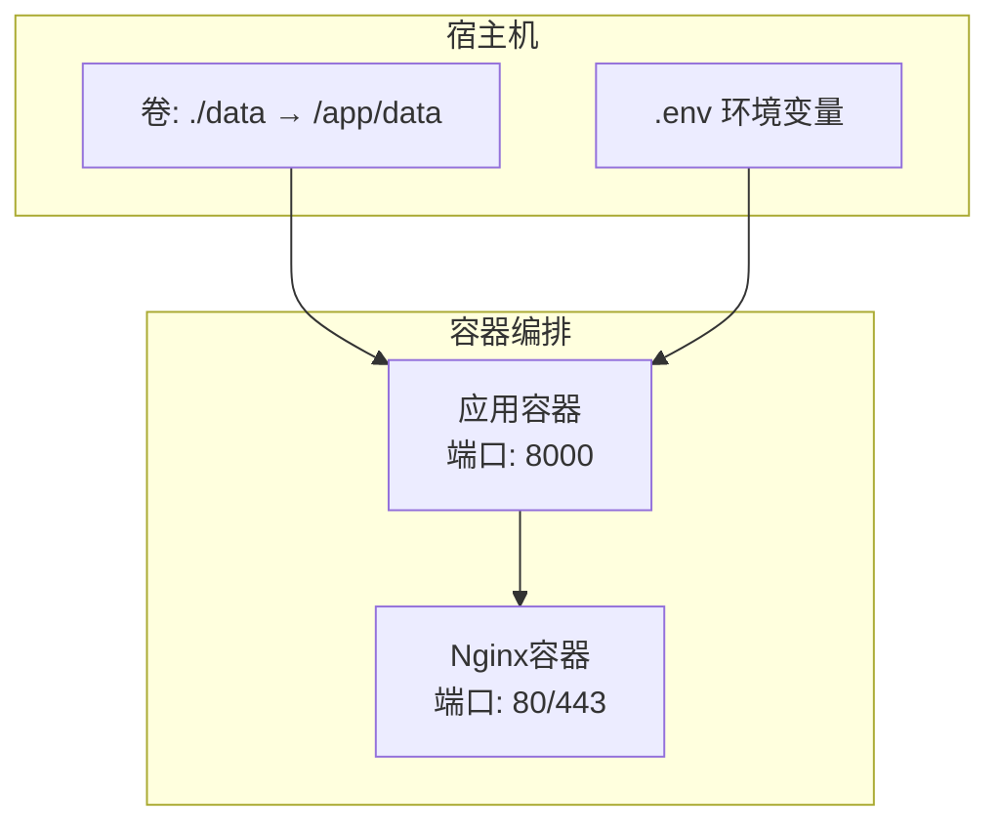
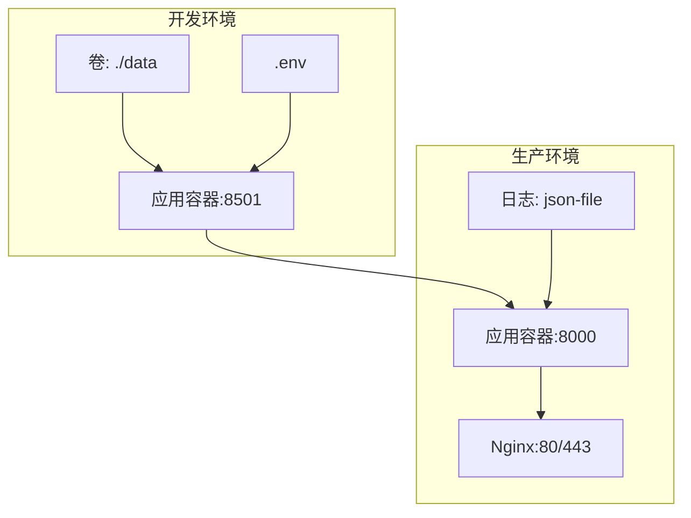
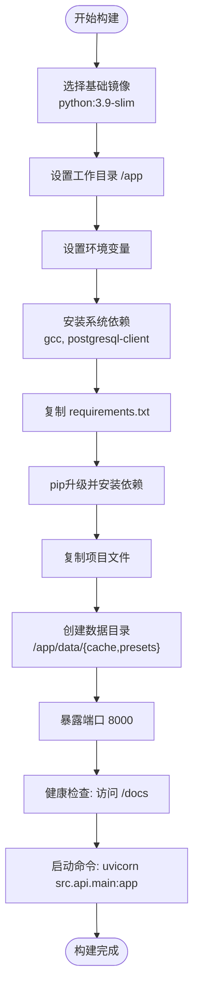
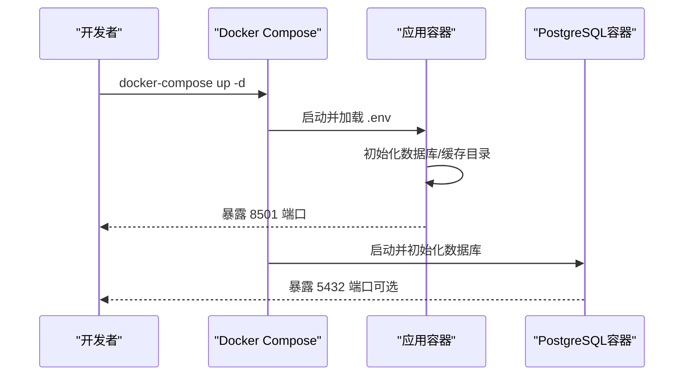
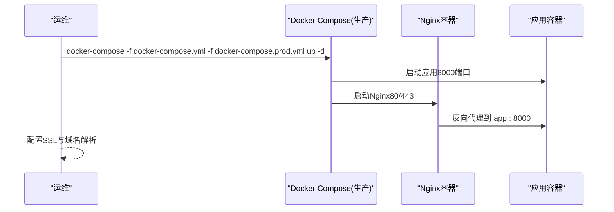
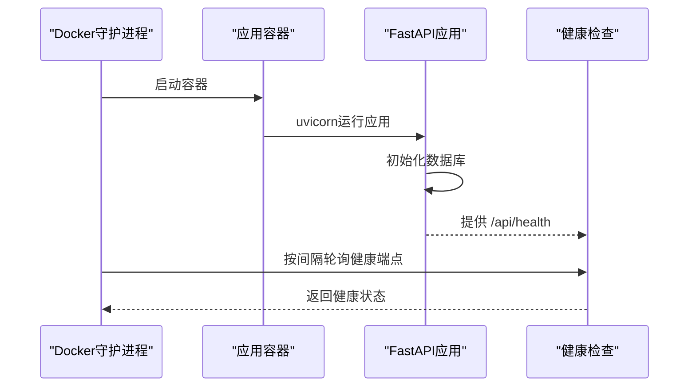
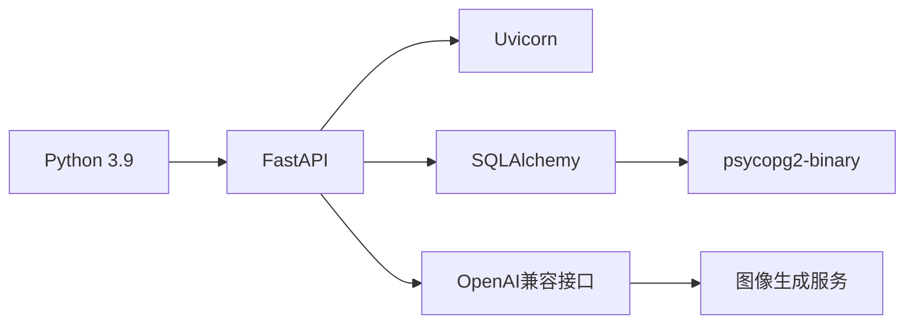

# Docker容器化部署

<cite>
**本文引用的文件**
- [Dockerfile](file://Dockerfile)
- [docker-compose.yml](file://docker-compose.yml)
- [docker-compose.prod.yml](file://docker-compose.prod.yml)
- [DEPLOYMENT.md](file://DEPLOYMENT.md)
- [requirements.txt](file://requirements.txt)
- [.env](file://.env)
- [src/api/main.py](file://src/api/main.py)
- [run_api.py](file://run_api.py)
- [start.sh](file://start.sh)
- [Makefile](file://Makefile)
- [阿里云部署指南.md](file://阿里云部署指南.md)
</cite>

## 目录
1. [简介](#简介)
2. [项目结构](#项目结构)
3. [核心组件](#核心组件)
4. [架构总览](#架构总览)
5. [详细组件分析](#详细组件分析)
6. [依赖关系分析](#依赖关系分析)
7. [性能考虑](#性能考虑)
8. [故障排除指南](#故障排除指南)
9. [结论](#结论)
10. [附录](#附录)

## 简介
本指南面向“人生草稿本”项目的Docker容器化部署，覆盖从单机开发到生产级高可用部署的完整流程。内容包括：
- Dockerfile构建过程详解（基础镜像、依赖安装、环境配置、健康检查）
- docker-compose.yml与docker-compose.prod.yml配置说明（服务定义、网络、卷挂载、环境变量、负载均衡、健康检查、日志管理）
- 生产环境部署命令与步骤
- 容器监控与日志查看方法
- 常见问题与故障排除

## 项目结构
该项目采用前后端分离的多服务架构，主要由以下容器组成：
- 应用容器（FastAPI后端）：提供API服务与健康检查
- Nginx反向代理容器（生产环境可选）：统一入口、HTTPS终止与健康检查
- 数据持久化：通过卷挂载将本地data目录映射到容器内，保证SQLite数据库与图片缓存持久化

图表来源
- [docker-compose.yml](file://docker-compose.yml#L1-L65)
- [docker-compose.prod.yml](file://docker-compose.prod.yml#L1-L43)
- [Dockerfile](file://Dockerfile#L24-L32)

章节来源
- [docker-compose.yml](file://docker-compose.yml#L1-L65)
- [docker-compose.prod.yml](file://docker-compose.prod.yml#L1-L43)
- [Dockerfile](file://Dockerfile#L1-L40)

## 核心组件
- 应用容器（FastAPI后端）
  - 基础镜像：python:3.9-slim
  - 依赖安装：基于requirements.txt，含FastAPI、Uvicorn、SQLAlchemy、OpenAI等
  - 端口暴露：8000
  - 健康检查：访问/docs端点
  - 启动命令：uvicorn运行src.api.main:app
- Nginx容器（生产环境）
  - 反代应用容器（app:8000）
  - 端口映射：80/443
  - 健康检查：nginx -t
  - 日志驱动：json-file，轮转大小与文件数限制

章节来源
- [Dockerfile](file://Dockerfile#L1-L40)
- [requirements.txt](file://requirements.txt#L1-L12)
- [docker-compose.prod.yml](file://docker-compose.prod.yml#L25-L43)
- [src/api/main.py](file://src/api/main.py#L92-L99)

## 架构总览
下图展示开发与生产两种部署形态的交互关系：

图表来源
- [docker-compose.yml](file://docker-compose.yml#L3-L65)
- [docker-compose.prod.yml](file://docker-compose.prod.yml#L1-L43)

## 详细组件分析

### Dockerfile 构建流程
- 基础镜像与工作目录
  - 使用python:3.9-slim作为基础镜像，设置工作目录/app
- 环境变量
  - 设置Python相关环境变量，确保日志输出与字节码行为符合容器化预期
- 系统依赖
  - 安装gcc与postgresql-client，便于后续安装psycopg2-binary等依赖
- Python依赖
  - 升级pip后安装requirements.txt中的依赖
- 项目文件与数据目录
  - 复制项目文件；创建/data/cache与/data/presets目录并赋予合适权限
- 端口与健康检查
  - 暴露8000端口；健康检查通过访问/docs端点
- 启动命令
  - 使用uvicorn运行FastAPI应用

图表来源
- [Dockerfile](file://Dockerfile#L1-L40)
- [requirements.txt](file://requirements.txt#L1-L12)

章节来源
- [Dockerfile](file://Dockerfile#L1-L40)

### docker-compose.yml 服务配置
- 应用服务（app）
  - 构建上下文与Dockerfile路径
  - 容器名：story2-app
  - 端口映射：8501:8501（开发环境直连应用）
  - 环境变量：从.env注入OpenAI、数据库、语言与缓存开关等
  - 卷挂载：./data → /app/data，实现SQLite与图片缓存持久化
  - 重启策略：unless-stopped
  - 健康检查：访问/_stcore/health
  - 资源限制：CPU与内存上限与预留（可按需调整）
- PostgreSQL服务（可选）
  - 使用postgres:15-alpine镜像
  - 环境变量：数据库名、用户、密码
  - 卷：postgres_data
  - 端口：5432:5432
  - 健康检查：pg_isready

图表来源
- [docker-compose.yml](file://docker-compose.yml#L3-L65)

章节来源
- [docker-compose.yml](file://docker-compose.yml#L1-L65)

### docker-compose.prod.yml 生产配置
- 继承基础配置并扩展
  - 环境变量：强制ENVIRONMENT=production，关闭CORS与开启XSRF保护
  - 端口：不直接暴露应用端口，交由Nginx反向代理
  - 日志：json-file驱动，限制单文件大小与保留文件数
- Nginx服务
  - 镜像：nginx:alpine
  - 端口：80/443
  - 卷：挂载nginx.conf与SSL证书目录
  - 依赖：depends_on app
  - 健康检查：nginx -t

图表来源
- [docker-compose.prod.yml](file://docker-compose.prod.yml#L1-L43)

章节来源
- [docker-compose.prod.yml](file://docker-compose.prod.yml#L1-L43)

### API健康检查与启动流程
- 应用启动
  - run_api.py负责读取环境变量并调用uvicorn运行src.api.main:app
  - src/api/main.py在生命周期中初始化数据库，并提供/api/health健康检查端点
- 健康检查
  - Dockerfile中HEALTHCHECK访问/docs
  - docker-compose.yml中app健康检查访问/_stcore/health
  - docker-compose.prod.yml中Nginx健康检查执行nginx -t

图表来源
- [run_api.py](file://run_api.py#L18-L31)
- [src/api/main.py](file://src/api/main.py#L24-L33)
- [src/api/main.py](file://src/api/main.py#L92-L99)
- [Dockerfile](file://Dockerfile#L34-L36)
- [docker-compose.yml](file://docker-compose.yml#L28-L33)
- [docker-compose.prod.yml](file://docker-compose.prod.yml#L38-L42)

章节来源
- [run_api.py](file://run_api.py#L1-L36)
- [src/api/main.py](file://src/api/main.py#L1-L134)
- [Dockerfile](file://Dockerfile#L34-L36)

## 依赖关系分析
- 语言与框架
  - Python 3.9 + FastAPI + Uvicorn
  - SQLAlchemy（数据库ORM），psycopg2-binary（PostgreSQL驱动）
- 第三方服务
  - OpenAI兼容接口（DeepSeek等），图像生成服务（DashScope）
- 开发与运维
  - Docker Compose（服务编排）、Nginx（反向代理与HTTPS）

图表来源
- [requirements.txt](file://requirements.txt#L1-L12)
- [.env](file://.env#L1-L29)

章节来源
- [requirements.txt](file://requirements.txt#L1-L12)
- [.env](file://.env#L1-L29)

## 性能考虑
- 数据库选择
  - 开发：SQLite（默认，无需额外服务）
  - 生产：PostgreSQL（提升并发与稳定性）
- 缓存与I/O
  - 启用事件缓存（CACHE_EVENTS=true）
  - 持久化卷挂载data目录，减少I/O阻塞
- 反向代理
  - 生产环境使用Nginx统一入口，支持HTTP/2与TLS终止
- 资源限制
  - docker-compose.yml中已配置CPU与内存限制，可根据服务器能力调整

章节来源
- [DEPLOYMENT.md](file://DEPLOYMENT.md#L262-L271)
- [docker-compose.yml](file://docker-compose.yml#L35-L42)

## 故障排除指南
- 应用无法启动或频繁重启
  - 检查环境变量是否正确（OPENAI_API_KEY、DATABASE_URL等）
  - 查看容器日志：docker-compose logs -f app
- 端口占用或访问失败
  - 确认宿主机端口未被占用（8501/8000/80/443）
  - 检查防火墙与安全组放通相应端口
- 健康检查失败
  - Dockerfile健康检查访问/docs
  - docker-compose.yml app健康检查访问/_stcore/health
  - docker-compose.prod.yml Nginx健康检查执行nginx -t
- 数据丢失或缓存异常
  - 确认卷挂载：./data → /app/data
  - 备份数据目录与数据库（生产环境可选PostgreSQL）
- HTTPS证书问题
  - 使用Let's Encrypt或手动上传证书
  - 确认nginx.conf中证书路径与域名一致

章节来源
- [DEPLOYMENT.md](file://DEPLOYMENT.md#L237-L351)
- [阿里云部署指南.md](file://阿里云部署指南.md#L619-L760)

## 结论
通过Docker与Docker Compose，项目实现了从开发到生产的标准化部署。结合Nginx反向代理与健康检查机制，可在生产环境中获得更高的可用性与可观测性。建议在生产中启用PostgreSQL、配置HTTPS与定期备份，并结合监控工具进行持续运维。

## 附录

### 部署命令与步骤
- 开发环境
  - 构建镜像：docker-compose build
  - 启动服务：docker-compose up -d
  - 查看日志：docker-compose logs -f app
  - 停止服务：docker-compose down
- 生产环境
  - 合并配置启动：docker-compose -f docker-compose.yml -f docker-compose.prod.yml up -d
  - 配置Nginx与SSL后访问域名
- 快捷命令（Makefile）
  - 构建：make docker-build
  - 启动：make deploy-dev 或 make start
  - 停止：make stop
  - 日志：make logs
  - 状态：make status

章节来源
- [DEPLOYMENT.md](file://DEPLOYMENT.md#L112-L142)
- [DEPLOYMENT.md](file://DEPLOYMENT.md#L171-L201)
- [Makefile](file://Makefile#L48-L93)

### 环境变量参考
- OpenAI相关：OPENAI_API_KEY、OPENAI_MODEL、OPENAI_BASE_URL
- 数据库：DATABASE_URL（可选，使用PostgreSQL时必填）
- 应用配置：DEFAULT_LANGUAGE、CACHE_EVENTS
- 生产环境：ENVIRONMENT=production、STREAMLIT_SERVER_ENABLE_CORS、STREAMLIT_SERVER_ENABLE_XSRF_PROTECTION

章节来源
- [.env](file://.env#L1-L29)
- [docker-compose.yml](file://docker-compose.yml#L12-L21)
- [docker-compose.prod.yml](file://docker-compose.prod.yml#L11-L16)