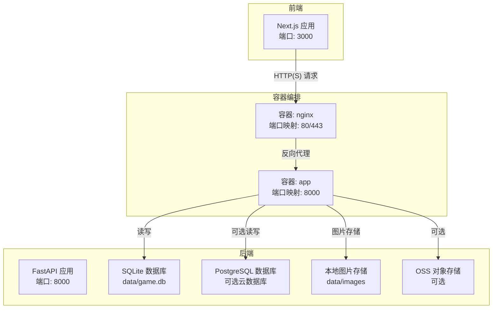
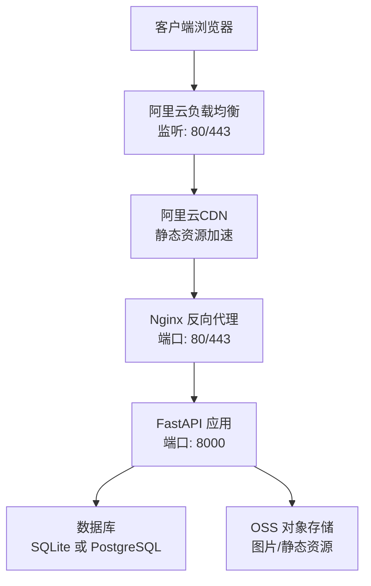
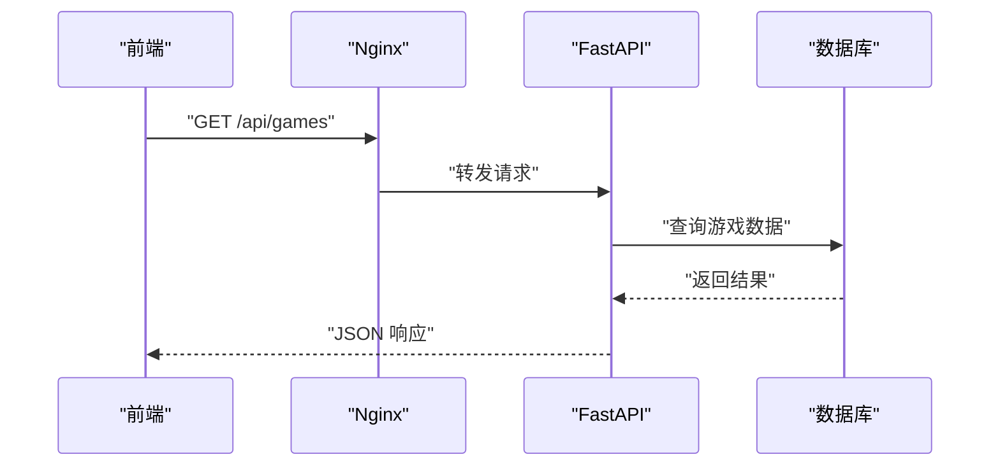
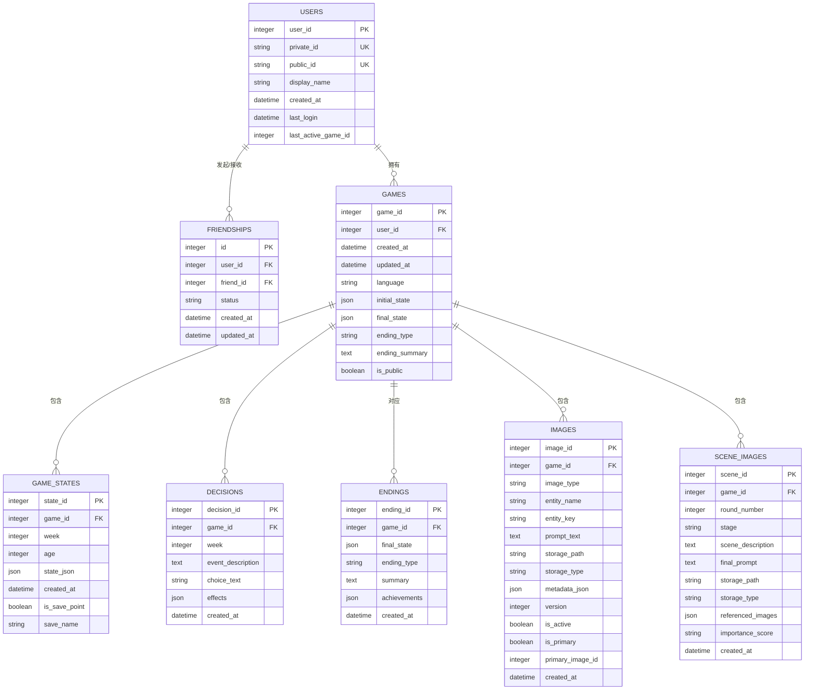
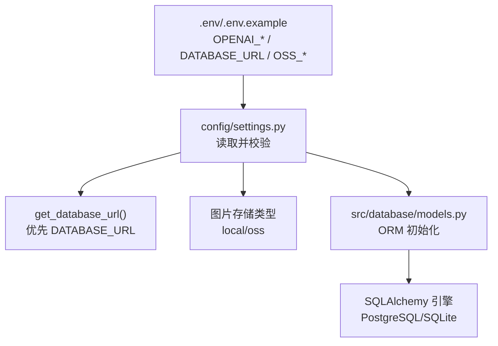

# 云平台部署

<cite>
**本文引用的文件**
- [阿里云部署指南.md](file://阿里云部署指南.md)
- [DEPLOYMENT.md](file://DEPLOYMENT.md)
- [Dockerfile](file://Dockerfile)
- [docker-compose.yml](file://docker-compose.yml)
- [docker-compose.prod.yml](file://docker-compose.prod.yml)
- [requirements.txt](file://requirements.txt)
- [src/api/main.py](file://src/api/main.py)
- [config/settings.py](file://config/settings.py)
- [.env.example](file://.env.example)
- [frontend/next.config.ts](file://frontend/next.config.ts)
- [src/database/models.py](file://src/database/models.py)
</cite>

## 目录
1. [简介](#简介)
2. [项目结构](#项目结构)
3. [核心组件](#核心组件)
4. [架构总览](#架构总览)
5. [详细组件分析](#详细组件分析)
6. [依赖关系分析](#依赖关系分析)
7. [性能考虑](#性能考虑)
8. [故障排除指南](#故障排除指南)
9. [结论](#结论)
10. [附录](#附录)

## 简介
本指南面向“人生草稿本”项目在云平台（以阿里云为主）的完整部署实践，覆盖从ECS实例配置、数据库与对象存储（OSS）设置，到负载均衡、CDN加速、安全组与HTTPS配置，再到监控告警、成本优化与运维排障的全流程。文档同时提供多套部署方案（Streamlit Cloud、Docker、完整生产环境），并给出针对阿里云的落地步骤与最佳实践。

## 项目结构
项目采用前后端分离架构：后端基于FastAPI提供REST API，前端基于Next.js，数据库支持SQLite与PostgreSQL，容器化通过Docker与Compose实现。生产环境推荐使用Nginx反向代理+HTTPS，并结合阿里云的负载均衡、CDN与安全组进行加固。

图表来源
- [docker-compose.yml](file://docker-compose.yml#L1-L65)
- [docker-compose.prod.yml](file://docker-compose.prod.yml#L1-L43)
- [src/api/main.py](file://src/api/main.py#L1-L134)
- [src/database/models.py](file://src/database/models.py#L1-L295)
- [config/settings.py](file://config/settings.py#L1-L168)

章节来源
- [DEPLOYMENT.md](file://DEPLOYMENT.md#L1-L352)
- [阿里云部署指南.md](file://阿里云部署指南.md#L1-L807)

## 核心组件
- 后端服务（FastAPI）
  - 提供认证、角色、游戏、剧情、图片等路由，内置健康检查与全局异常处理。
  - 支持CORS配置，便于前端跨域访问。
- 数据库层
  - 默认使用SQLite；可通过环境变量切换为PostgreSQL（云数据库）。
  - ORM模型涵盖用户、好友、游戏、决策、结局、图片与场景图等。
- 前端（Next.js）
  - 通过重写将/api前缀转发至后端8000端口；开发时允许局域网访问。
- 容器化与编排
  - Dockerfile定义基础镜像、依赖安装与健康检查。
  - docker-compose.yml定义应用与可选PostgreSQL服务；docker-compose.prod.yml增加Nginx反向代理与生产环境变量。

章节来源
- [src/api/main.py](file://src/api/main.py#L1-L134)
- [src/database/models.py](file://src/database/models.py#L1-L295)
- [config/settings.py](file://config/settings.py#L1-L168)
- [Dockerfile](file://Dockerfile#L1-L40)
- [docker-compose.yml](file://docker-compose.yml#L1-L65)
- [docker-compose.prod.yml](file://docker-compose.prod.yml#L1-L43)

## 架构总览
生产环境典型拓扑如下：客户端通过Nginx（80/443）接入，Nginx反向代理到后端FastAPI（8000）。数据库可选本地SQLite或云数据库（PostgreSQL），图片存储可选本地或OSS。可按需叠加阿里云负载均衡、CDN与WAF等。

图表来源
- [阿里云部署指南.md](file://阿里云部署指南.md#L680-L696)
- [docker-compose.prod.yml](file://docker-compose.prod.yml#L25-L43)
- [src/api/main.py](file://src/api/main.py#L92-L99)

## 详细组件分析

### 后端服务（FastAPI）
- 路由组织：认证、角色、游戏、剧情、图片等模块化路由。
- 健康检查：/api/health返回活动会话数。
- 客户端日志收集：/api/client-log接收前端上报的日志。
- CORS策略：允许开发/局域网/Streamlit访问，生产环境建议明确白名单。
- 全局异常处理：统一返回500与错误详情。

图表来源
- [src/api/main.py](file://src/api/main.py#L80-L99)
- [docker-compose.prod.yml](file://docker-compose.prod.yml#L25-L43)

章节来源
- [src/api/main.py](file://src/api/main.py#L1-L134)

### 数据库与存储
- 数据库选择
  - SQLite：默认本地文件，适合小规模/测试。
  - PostgreSQL：生产推荐，支持云托管（RDS）。
- 图片存储
  - 本地存储：data/images。
  - OSS：通过配置开启，适合大规模图片与CDN加速。
- 关系模型
  - 用户、好友、游戏、状态、决策、结局、图片、场景图等，具备索引与级联删除。

图表来源
- [src/database/models.py](file://src/database/models.py#L11-L234)

章节来源
- [config/settings.py](file://config/settings.py#L107-L141)
- [src/database/models.py](file://src/database/models.py#L237-L295)

### 前端（Next.js）
- 代理转发：将/api前缀重写到后端8000端口。
- 开发模式：允许局域网访问，禁用Strict Mode避免SSE重复连接。
- 图片生成超时：提升代理超时至2分钟，适配长耗时生成。

章节来源
- [frontend/next.config.ts](file://frontend/next.config.ts#L1-L31)

### 容器化与编排
- Dockerfile
  - 基础镜像：python:3.9-slim。
  - 安装系统依赖与Python依赖。
  - 暴露端口8000，健康检查调用/docs。
- docker-compose.yml
  - app服务：8501端口映射，挂载data目录，健康检查调用/_stcore/health。
  - 可选PostgreSQL服务（注释可启用）。
- docker-compose.prod.yml
  - app：生产环境变量、日志驱动、端口清空（由Nginx接管）。
  - nginx：80/443映射，挂载nginx.conf与SSL证书，健康检查nginx -t。

章节来源
- [Dockerfile](file://Dockerfile#L1-L40)
- [docker-compose.yml](file://docker-compose.yml#L1-L65)
- [docker-compose.prod.yml](file://docker-compose.prod.yml#L1-L43)

## 依赖关系分析
- 环境变量
  - OPENAI_*：文本/图像/场景分析API配置。
  - DATABASE_URL：云数据库连接串（优先级高于本地SQLite）。
  - IMAGE_STORAGE_TYPE/OSS_*：图片存储类型与OSS参数。
  - CORS_ORIGINS：CORS白名单扩展。
- 依赖清单
  - FastAPI、Uvicorn、SQLAlchemy、Pydantic、OpenAI等。

图表来源
- [.env.example](file://.env.example#L1-L22)
- [config/settings.py](file://config/settings.py#L107-L141)
- [src/database/models.py](file://src/database/models.py#L237-L246)

章节来源
- [.env.example](file://.env.example#L1-L22)
- [requirements.txt](file://requirements.txt#L1-L12)
- [config/settings.py](file://config/settings.py#L1-L168)

## 性能考虑
- 数据库
  - 生产环境优先使用PostgreSQL，支持连接池与并发。
  - 本地SQLite适合小规模/测试，避免高并发写入。
- 图片与存储
  - 大量图片建议使用OSS，结合CDN加速静态资源。
  - 控制图片分辨率与数量，减少I/O压力。
- 反向代理与缓存
  - Nginx负责静态资源与健康检查，后端专注业务逻辑。
  - 可在Nginx层配置缓存与压缩（视业务需求）。
- 资源限制
  - docker-compose中已配置CPU/内存限制，可根据ECS规格调整。

章节来源
- [阿里云部署指南.md](file://阿里云部署指南.md#L685-L696)
- [docker-compose.yml](file://docker-compose.yml#L34-L42)

## 故障排除指南

### 常见问题与排查
- 域名访问提示“无法访问此网站”
  - 检查DNS解析、安全组80/443放通、Nginx容器状态与日志。
- HTTPS证书错误
  - 校验证书路径、有效期，必要时重新申请。
- 应用更新部署
  - 拉取代码、重建镜像、使用生产配置重启服务。
- 备份与恢复
  - 备份data目录与数据库（PostgreSQL）。
- 证书自动续期
  - Let's Encrypt证书每90天续期，建议配置定时任务。

章节来源
- [阿里云部署指南.md](file://阿里云部署指南.md#L619-L706)

### 云平台特定排障
- 阿里云ECS
  - 安全组：开放SSH、HTTP、HTTPS端口；仅限必要范围。
  - 防火墙：启用ufw并仅允许必要端口。
  - SSH：修改默认端口、使用密钥登录、禁用密码登录。
- 负载均衡与CDN
  - 健康检查：Nginx健康端点/后端健康检查。
  - CDN：静态资源走CDN，动态接口直连后端。
- 监控与告警
  - 阿里云云监控、UptimeRobot等工具配合使用。
  - 日志：容器日志与应用日志分级采集。

章节来源
- [阿里云部署指南.md](file://阿里云部署指南.md#L700-L754)

## 结论
通过本指南，可在阿里云上完成从ECS实例到数据库、对象存储、负载均衡、CDN与HTTPS的全链路部署。生产环境建议采用Nginx反向代理+PostgreSQL+OSS+CDN的组合，并配套监控告警与自动化运维，以获得稳定、可扩展且成本可控的服务。

## 附录

### 阿里云部署步骤（摘要）
- ECS实例
  - 选择2核4G起步，Ubuntu 22.04，按流量计费带宽。
  - 安全组开放22、80、443端口。
- 域名与证书
  - 购买域名并完成ICP备案（中国大陆）。
  - 申请Let's Encrypt或阿里云免费证书。
- 应用部署
  - 安装Docker与Docker Compose，拉取代码，配置.env。
  - 使用docker-compose.prod.yml启动，配置Nginx与SSL。
- 域名解析
  - A记录指向ECS公网IP，等待DNS生效。
- 监控与告警
  - 配置阿里云云监控、UptimeRobot等，设置日志与告警。

章节来源
- [阿里云部署指南.md](file://阿里云部署指南.md#L40-L164)
- [阿里云部署指南.md](file://阿里云部署指南.md#L233-L320)
- [阿里云部署指南.md](file://阿里云部署指南.md#L322-L567)
- [阿里云部署指南.md](file://阿里云部署指南.md#L570-L617)

### 环境变量与配置要点
- OPENAI_*：文本/图像/场景分析API配置。
- DATABASE_URL：云数据库连接串（优先于本地SQLite）。
- IMAGE_STORAGE_TYPE/OSS_*：图片存储类型与OSS参数。
- CORS_ORIGINS：CORS白名单扩展。
- 生产环境：ENVIRONMENT=production，日志级别与安全策略。

章节来源
- [.env.example](file://.env.example#L1-L22)
- [config/settings.py](file://config/settings.py#L30-L59)
- [config/settings.py](file://config/settings.py#L107-L141)
- [docker-compose.prod.yml](file://docker-compose.prod.yml#L11-L17)