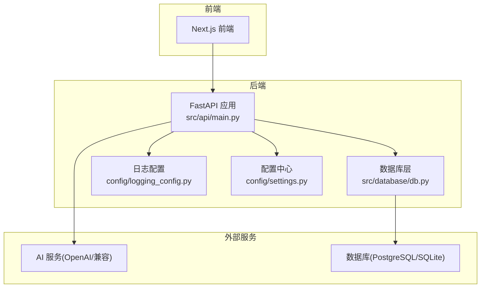
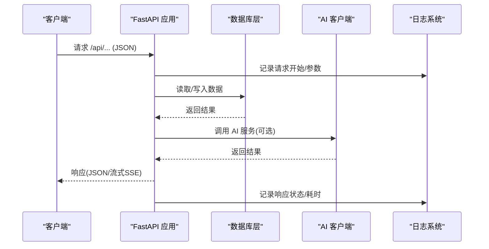
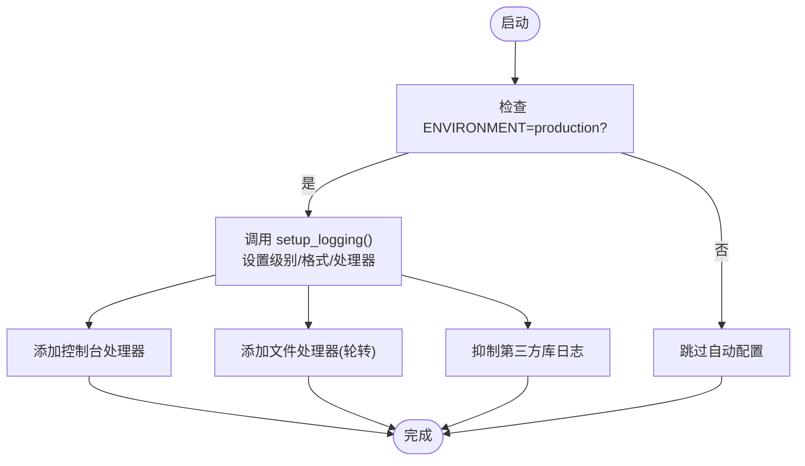
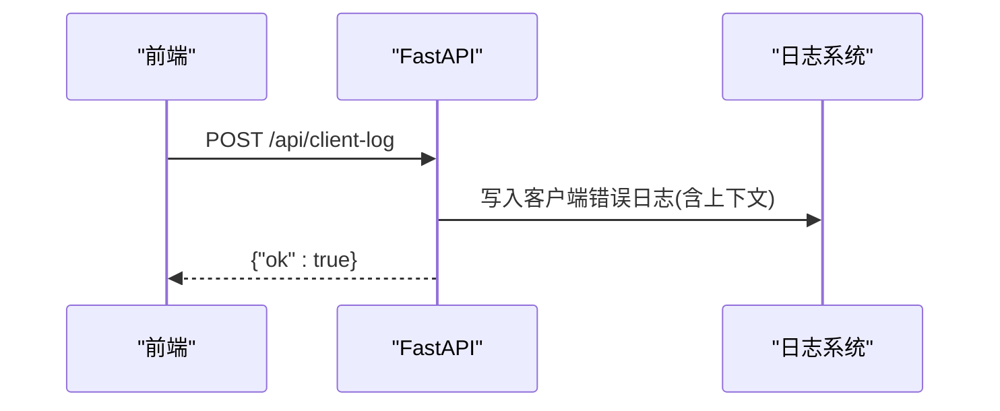
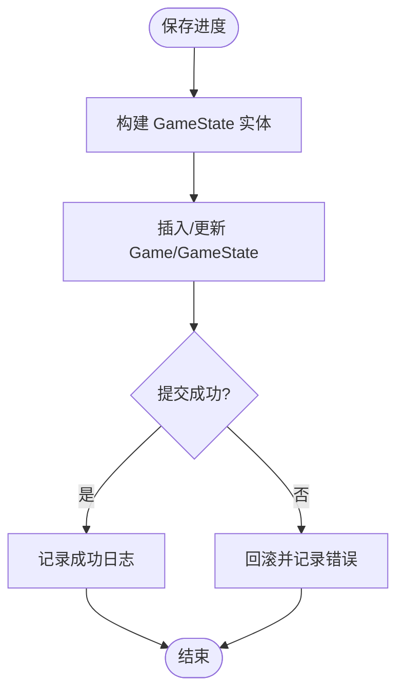
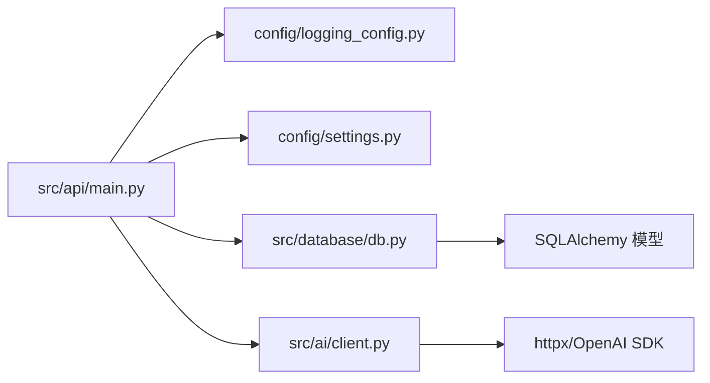

# 性能监控与日志

<cite>
**本文档引用的文件**
- [config/logging_config.py](file://config/logging_config.py)
- [config/settings.py](file://config/settings.py)
- [src/api/main.py](file://src/api/main.py)
- [src/database/db.py](file://src/database/db.py)
- [tests/performance/locustfile.py](file://tests/performance/locustfile.py)
- [src/ai/client.py](file://src/ai/client.py)
- [logs/api_restart.log](file://logs/api_restart.log)
- [logs/test.log](file://logs/test.log)
- [requirements.txt](file://requirements.txt)
</cite>

## 目录
1. [简介](#简介)
2. [项目结构](#项目结构)
3. [核心组件](#核心组件)
4. [架构总览](#架构总览)
5. [详细组件分析](#详细组件分析)
6. [依赖关系分析](#依赖关系分析)
7. [性能考量](#性能考量)
8. [故障排查指南](#故障排查指南)
9. [结论](#结论)
10. [附录](#附录)

## 简介
本指南面向“人生草稿本”项目的运维与开发团队，提供一套完整的性能监控与日志管理方案。内容涵盖：
- 日志配置：日志级别、输出格式、轮转策略与第三方库日志抑制
- 性能监控指标：API 响应时间、数据库查询性能、AI 接口耗时与内存使用
- 日志分析方法与工具使用
- 监控告警配置建议与阈值设定
- 性能优化建议与瓶颈识别方法
- 故障诊断流程与日志存储备份策略

## 项目结构
项目采用前后端分离架构，后端基于 FastAPI，数据库使用 SQLAlchemy，AI 服务通过统一客户端封装。日志与性能相关的关键位置如下：
- 后端入口与全局异常处理：src/api/main.py
- 生产日志配置：config/logging_config.py
- 应用配置与数据库连接：config/settings.py
- 数据库操作与性能日志：src/database/db.py
- 性能压测脚本：tests/performance/locustfile.py
- AI 客户端与超时/截断提示：src/ai/client.py
- 日志文件：logs/

图表来源
- [src/api/main.py](file://src/api/main.py#L1-L134)
- [config/logging_config.py](file://config/logging_config.py#L1-L78)
- [config/settings.py](file://config/settings.py#L1-L168)
- [src/database/db.py](file://src/database/db.py#L1-L910)
- [src/ai/client.py](file://src/ai/client.py#L1-L233)

章节来源
- [src/api/main.py](file://src/api/main.py#L1-L134)
- [config/logging_config.py](file://config/logging_config.py#L1-L78)
- [config/settings.py](file://config/settings.py#L1-L168)
- [src/database/db.py](file://src/database/db.py#L1-L910)
- [src/ai/client.py](file://src/ai/client.py#L1-L233)

## 核心组件
- 日志系统
  - 生产环境日志初始化：自动根据环境变量设置日志级别与文件轮转
  - 控制台与文件双通道输出，抑制第三方库噪音
- API 层
  - 全局生命周期钩子、CORS 配置、健康检查端点
  - 全局异常处理与客户端错误上报接口
- 数据库层
  - 游戏状态、决策、结局等实体持久化
  - 关键操作带日志，便于追踪性能与异常
- 性能压测
  - 基于 Locust 的多场景负载测试脚本
- AI 客户端
  - 统一调用抽象、重试与错误反馈注入、超长输出截断告警

章节来源
- [config/logging_config.py](file://config/logging_config.py#L12-L69)
- [src/api/main.py](file://src/api/main.py#L24-L134)
- [src/database/db.py](file://src/database/db.py#L336-L383)
- [tests/performance/locustfile.py](file://tests/performance/locustfile.py#L1-L224)
- [src/ai/client.py](file://src/ai/client.py#L51-L124)

## 架构总览
后端通过 FastAPI 提供 REST 接口，数据库层负责持久化，AI 客户端封装外部服务调用。日志系统贯穿全链路，性能压测脚本用于评估系统在不同负载下的表现。

图表来源
- [src/api/main.py](file://src/api/main.py#L92-L134)
- [src/database/db.py](file://src/database/db.py#L336-L383)
- [src/ai/client.py](file://src/ai/client.py#L51-L124)
- [config/logging_config.py](file://config/logging_config.py#L39-L62)

## 详细组件分析

### 日志配置与轮转策略
- 日志级别与输出
  - 支持通过环境变量设置日志级别；默认 INFO
  - 控制台输出始终开启，文件输出可配置
  - 输出格式包含时间戳、模块名、级别与消息
- 文件轮转
  - 默认单文件最大 10MB，保留 5 个备份
  - 日志目录自动创建
- 第三方库日志抑制
  - 对 httpx、openai、urllib3 设置警告级别，降低噪音
- 生产环境自动加载
  - 当 ENVIRONMENT=production 时自动应用配置

图表来源
- [config/logging_config.py](file://config/logging_config.py#L12-L69)
- [config/logging_config.py](file://config/logging_config.py#L72-L78)

章节来源
- [config/logging_config.py](file://config/logging_config.py#L12-L69)
- [config/logging_config.py](file://config/logging_config.py#L72-L78)

### API 层性能与可观测性
- 生命周期与健康检查
  - 启停日志与数据库初始化
  - /api/health 返回存活状态与会话计数
- 全局异常处理
  - 未捕获异常统一记录并返回标准错误响应
- 客户端日志上报
  - /api/client-log 接收前端上报的错误上下文，包含页面 URL、IP、UA 等

图表来源
- [src/api/main.py](file://src/api/main.py#L117-L134)

章节来源
- [src/api/main.py](file://src/api/main.py#L24-L134)

### 数据库性能与日志
- 关键操作日志
  - 保存/加载游戏进度、存档点、活跃游戏等均记录详细信息
  - 失败时记录错误原因并回滚
- 查询模式
  - 使用 SQLAlchemy ORM，按需排序与限制返回条数
  - 历史检索与关键词搜索支持上限控制，避免全表扫描

图表来源
- [src/database/db.py](file://src/database/db.py#L336-L383)

章节来源
- [src/database/db.py](file://src/database/db.py#L336-L383)

### 性能压测与指标采集
- 测试场景
  - 匿名用户：文档、健康检查、注册
  - 游戏用户：获取存档、预设、创建游戏、获取状态
  - 高强度压力：快速健康检查与列表请求
  - 快速冒烟：CI 管道快速验证
- 指标采集
  - 通过 Locust 统计请求次数、错误率、响应时间分布
  - 可结合环境变量配置目标主机与认证头

章节来源
- [tests/performance/locustfile.py](file://tests/performance/locustfile.py#L1-L224)

### AI 客户端与外部依赖性能
- 统一调用抽象
  - 支持同步与流式回调两种模式
  - 截断告警：当输出被 max_tokens 截断时发出警告
- 重试与错误反馈
  - 多次尝试并注入上次错误原因，提升成功率
- 超时与重试配置
  - 通过配置中心设置生成超时与最大重试次数

章节来源
- [src/ai/client.py](file://src/ai/client.py#L51-L124)
- [src/ai/client.py](file://src/ai/client.py#L159-L233)
- [config/settings.py](file://config/settings.py#L57-L58)
- [config/settings.py](file://config/settings.py#L104-L106)

## 依赖关系分析
- 外部依赖
  - FastAPI、Uvicorn、SQLAlchemy、httpx、openai 等
- 内部依赖
  - API 层依赖日志配置与设置中心
  - 数据库层依赖 ORM 模型与日志记录
  - AI 客户端依赖配置中心与 JSON 解析工具

图表来源
- [src/api/main.py](file://src/api/main.py#L1-L134)
- [config/logging_config.py](file://config/logging_config.py#L1-L78)
- [config/settings.py](file://config/settings.py#L1-L168)
- [src/database/db.py](file://src/database/db.py#L1-L910)
- [src/ai/client.py](file://src/ai/client.py#L1-L233)
- [requirements.txt](file://requirements.txt#L1-L12)

章节来源
- [requirements.txt](file://requirements.txt#L1-L12)

## 性能考量
- API 响应时间
  - 通过健康检查与压测脚本观察平均/分位响应时间
  - 关注慢请求与错误率上升节点
- 数据库查询性能
  - 使用索引友好的查询条件，避免 N+1 查询
  - 对高频查询增加 LIMIT 并使用排序字段建立索引
- AI 接口性能
  - 监控截断告警频率，必要时提高 max_tokens
  - 控制并发与重试次数，避免外部服务限流
- 内存使用
  - 关注长时间运行任务与大对象序列化
  - 使用流式处理减少峰值内存占用

## 故障排查指南
- 常见问题定位步骤
  - 查看后端日志：确认请求进入、异常堆栈与关键操作日志
  - 核对数据库状态：检查保存/加载是否成功，事务是否回滚
  - 检查 AI 调用：关注截断告警与重试次数
  - 使用健康检查：确认服务存活与会话状态
- 日志文件位置
  - 后端日志：logs/ 目录
  - 示例：api_restart.log、test.log
- 客户端错误上报
  - 通过 /api/client-log 接收前端错误上下文，辅助移动端/浏览器问题定位

章节来源
- [src/api/main.py](file://src/api/main.py#L92-L134)
- [logs/api_restart.log](file://logs/api_restart.log#L1-L570)
- [logs/test.log](file://logs/test.log#L1-L1)

## 结论
通过完善的日志体系、统一的性能压测与可观测性设计，项目可在开发与生产环境中实现稳定、可追踪、可优化的运行状态。建议持续完善告警阈值与自动化巡检，结合压测结果迭代优化数据库与 AI 服务的资源配置。

## 附录
- 日志级别建议
  - 开发：DEBUG
  - 测试：INFO
  - 生产：INFO（可通过环境变量调整）
- 日志轮转建议
  - 10MB 单文件，保留 5 份；可根据磁盘空间与合规要求调整
- 监控告警阈值示例
  - API 响应时间 P95 > 5s
  - 错误率 > 1%
  - 数据库事务回滚率 > 0.1%
  - AI 截断频率 > 5%（需结合业务阈值）