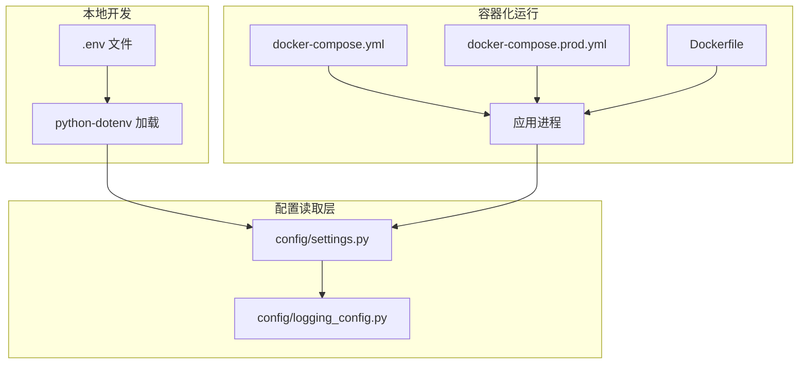
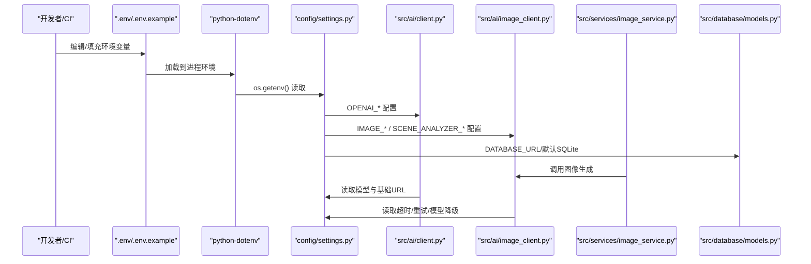
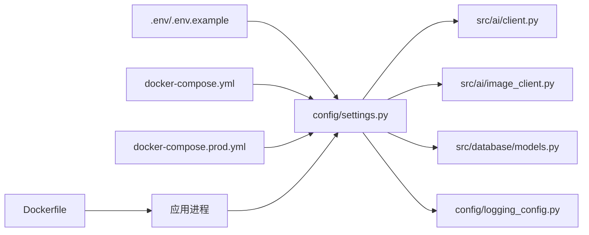
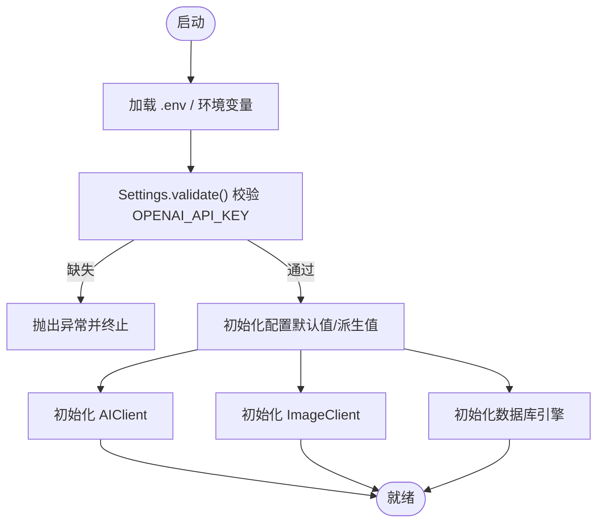

# 环境变量配置

<cite>
**本文档引用的文件**
- [.env](file://.env)
- [.env.example](file://.env.example)
- [config/settings.py](file://config/settings.py)
- [src/ai/client.py](file://src/ai/client.py)
- [src/ai/image_client.py](file://src/ai/image_client.py)
- [src/services/image_service.py](file://src/services/image_service.py)
- [src/database/models.py](file://src/database/models.py)
- [config/logging_config.py](file://config/logging_config.py)
- [docker-compose.yml](file://docker-compose.yml)
- [docker-compose.prod.yml](file://docker-compose.prod.yml)
- [Dockerfile](file://Dockerfile)
- [阿里云部署指南.md](file://阿里云部署指南.md)
</cite>

## 目录
1. [简介](#简介)
2. [项目结构](#项目结构)
3. [核心组件](#核心组件)
4. [架构总览](#架构总览)
5. [详细组件分析](#详细组件分析)
6. [依赖分析](#依赖分析)
7. [性能考虑](#性能考虑)
8. [故障排除指南](#故障排除指南)
9. [结论](#结论)
10. [附录](#附录)

## 简介
本指南面向“人生草稿本”项目的运维与开发人员，提供完整的环境变量配置说明。内容涵盖：
- 必需与可选环境变量清单、作用、默认值与推荐设置
- OpenAI API 与图像生成 API 的配置要点
- 数据库连接设置（SQLite 与 PostgreSQL）
- 不同部署环境（开发、测试、生产）的配置策略
- 配置验证与错误处理机制
- 最佳实践与安全建议

## 项目结构
项目采用前后端分离与容器化部署，环境变量主要通过 .env 文件与 Docker 环境变量注入，由 Python 后端读取并进行统一配置管理。

图表来源
- [docker-compose.yml](file://docker-compose.yml#L1-L65)
- [docker-compose.prod.yml](file://docker-compose.prod.yml#L1-L43)
- [Dockerfile](file://Dockerfile#L1-L40)
- [config/settings.py](file://config/settings.py#L1-L168)
- [config/logging_config.py](file://config/logging_config.py#L1-L78)

章节来源
- [docker-compose.yml](file://docker-compose.yml#L1-L65)
- [docker-compose.prod.yml](file://docker-compose.prod.yml#L1-L43)
- [Dockerfile](file://Dockerfile#L1-L40)
- [config/settings.py](file://config/settings.py#L1-L168)
- [config/logging_config.py](file://config/logging_config.py#L1-L78)

## 核心组件
本节概述与环境变量直接相关的组件及其职责：
- 配置中心：集中读取与校验环境变量，提供默认值与派生配置
- AI 客户端：封装 OpenAI 兼容接口调用，读取语言模型与基础 URL
- 图像客户端：封装图像生成与图生图接口，支持模型降级与重试
- 图像服务：编排图像生成、存储与数据库记录
- 数据库模型：根据 DATABASE_URL 选择 SQLite 或 PostgreSQL
- 日志配置：生产环境日志开关与级别

章节来源
- [config/settings.py](file://config/settings.py#L27-L167)
- [src/ai/client.py](file://src/ai/client.py#L22-L48)
- [src/ai/image_client.py](file://src/ai/image_client.py#L30-L66)
- [src/services/image_service.py](file://src/services/image_service.py#L30-L50)
- [src/database/models.py](file://src/database/models.py#L237-L262)
- [config/logging_config.py](file://config/logging_config.py#L12-L78)

## 架构总览
下图展示了环境变量在系统中的流转与使用：

图表来源
- [.env](file://.env#L1-L29)
- [.env.example](file://.env.example#L1-L22)
- [config/settings.py](file://config/settings.py#L30-L141)
- [src/ai/client.py](file://src/ai/client.py#L37-L47)
- [src/ai/image_client.py](file://src/ai/image_client.py#L47-L66)
- [src/database/models.py](file://src/database/models.py#L237-L246)

## 详细组件分析

### 配置中心：config/settings.py
- 职责：统一读取与校验环境变量，提供默认值与派生配置
- 关键点：
  - 优先级：DATABASE_URL > 本地 SQLite 路径
  - 派生配置：图像与场景分析 API 密钥与基础 URL 可回退到 OpenAI 配置
  - 校验：OPENAI_API_KEY 必填，否则抛出异常
  - 图片目录：本地存储时确保目录存在

章节来源
- [config/settings.py](file://config/settings.py#L27-L167)

### OpenAI API 配置
- 必需项
  - OPENAI_API_KEY：AI 生成与图像生成的主密钥
- 可选项
  - OPENAI_MODEL：默认模型名（如 gpt-4）
  - OPENAI_BASE_URL：自定义基础 URL（如 DeepSeek 代理）
- 用途
  - AIClient 初始化时读取
  - 图像客户端在未配置 IMAGE_* 时回退使用
- 默认值与推荐
  - OPENAI_MODEL：默认 gpt-4
  - OPENAI_BASE_URL：留空使用官方服务
- 配置验证
  - Settings.validate() 校验 OPENAI_API_KEY 是否存在

章节来源
- [config/settings.py](file://config/settings.py#L30-L33)
- [src/ai/client.py](file://src/ai/client.py#L37-L47)
- [config/settings.py](file://config/settings.py#L143-L149)

### 图像生成 API 配置
- 必需项
  - IMAGE_API_KEY：图像生成 API 密钥（如 DashScope）
  - IMAGE_API_BASE_URL：图像生成 API 基础 URL（如千问图像）
  - IMAGE_MODEL：默认图像模型名（如 qwen-image-max）
- 可选项
  - SCENE_ANALYZER_API_KEY / SCENE_ANALYZER_BASE_URL / SCENE_ANALYZER_MODEL：场景分析（DeepSeek）备用配置
  - TEXT_TO_IMAGE_MODELS / IMAGE_EDIT_MODELS：模型降级列表（逗号分隔）
  - IMAGE_GENERATION_TIMEOUT / IMAGE_MAX_RETRIES：超时与重试策略
- 用途
  - ImageClient 初始化时读取
  - 支持模型降级与速率限制处理
- 默认值与推荐
  - IMAGE_GENERATION_TIMEOUT：60 秒
  - IMAGE_MAX_RETRIES：3 次
  - TEXT_TO_IMAGE_MODELS：qwen-image-max,qwen-image-plus,qwen-image
  - IMAGE_EDIT_MODELS：qwen-image-edit-max,qwen-image-edit-plus
- 回退策略
  - 若未配置 IMAGE_*，自动回退到 OPENAI_* 配置

章节来源
- [config/settings.py](file://config/settings.py#L35-L68)
- [src/ai/image_client.py](file://src/ai/image_client.py#L47-L66)
- [config/settings.py](file://config/settings.py#L113-L130)

### 数据库配置
- 优先级
  - DATABASE_URL：云数据库（PostgreSQL/MySQL 等）
  - 未设置：使用本地 SQLite（data/game.db）
- 用途
  - models.py 根据 DATABASE_URL 选择引擎与池配置
- 默认值与推荐
  - 本地开发：留空 DATABASE_URL，使用 SQLite
  - 生产：设置 DATABASE_URL 指向云数据库

章节来源
- [config/settings.py](file://config/settings.py#L107-L111)
- [src/database/models.py](file://src/database/models.py#L237-L246)

### 应用与语言配置
- DEFAULT_LANGUAGE：应用默认语言（zh/en）
- CACHE_EVENTS：是否启用事件缓存
- DEBUG_MODE：调试模式（仅开发）
- 用途
  - 影响游戏语言与缓存策略

章节来源
- [config/settings.py](file://config/settings.py#L70-L73)

### 生产环境与日志
- ENVIRONMENT=production：触发生产日志配置
- LOG_LEVEL：日志级别（INFO/WARNING/ERROR 等）
- 用途
  - 自动启用文件日志与第三方库日志抑制

章节来源
- [config/logging_config.py](file://config/logging_config.py#L72-L77)

### Docker 环境变量注入
- docker-compose.yml 将 .env 中的关键变量注入容器
- docker-compose.prod.yml 覆盖生产环境变量（如 ENVIRONMENT=production）

章节来源
- [docker-compose.yml](file://docker-compose.yml#L12-L21)
- [docker-compose.prod.yml](file://docker-compose.prod.yml#L11-L16)

## 依赖分析
环境变量在各模块之间的依赖关系如下：

图表来源
- [.env](file://.env#L1-L29)
- [.env.example](file://.env.example#L1-L22)
- [config/settings.py](file://config/settings.py#L1-L168)
- [src/ai/client.py](file://src/ai/client.py#L1-L233)
- [src/ai/image_client.py](file://src/ai/image_client.py#L1-L1240)
- [src/database/models.py](file://src/database/models.py#L1-L295)
- [config/logging_config.py](file://config/logging_config.py#L1-L78)
- [docker-compose.yml](file://docker-compose.yml#L1-L65)
- [docker-compose.prod.yml](file://docker-compose.prod.yml#L1-L43)
- [Dockerfile](file://Dockerfile#L1-L40)

章节来源
- [config/settings.py](file://config/settings.py#L1-L168)
- [src/ai/client.py](file://src/ai/client.py#L1-L233)
- [src/ai/image_client.py](file://src/ai/image_client.py#L1-L1240)
- [src/database/models.py](file://src/database/models.py#L1-L295)
- [config/logging_config.py](file://config/logging_config.py#L1-L78)
- [docker-compose.yml](file://docker-compose.yml#L1-L65)
- [docker-compose.prod.yml](file://docker-compose.prod.yml#L1-L43)
- [Dockerfile](file://Dockerfile#L1-L40)

## 性能考虑
- 图像生成超时与重试
  - IMAGE_GENERATION_TIMEOUT：控制单次请求最长等待时间
  - IMAGE_MAX_RETRIES：指数退避与速率限制下的重试次数
- 模型降级
  - TEXT_TO_IMAGE_MODELS 与 IMAGE_EDIT_MODELS 提供多模型回退，提升成功率
- 数据库连接
  - PostgreSQL 使用 pool_pre_ping，提高连接稳定性
- 日志轮转
  - 生产环境日志文件大小与备份数量可控，避免磁盘膨胀

章节来源
- [config/settings.py](file://config/settings.py#L56-L68)
- [src/ai/image_client.py](file://src/ai/image_client.py#L190-L258)
- [src/database/models.py](file://src/database/models.py#L242-L245)
- [config/logging_config.py](file://config/logging_config.py#L12-L69)

## 故障排除指南
- 缺少 OPENAI_API_KEY
  - 现象：启动时报错，提示未设置 OPENAI_API_KEY
  - 处理：在 .env 或环境变量中补全
- 图像生成失败
  - 现象：ImageGenerationError 或 ContentInspectionError
  - 处理：检查 IMAGE_API_KEY/IMAGE_API_BASE_URL；查看日志；启用模型降级
- 数据库连接异常
  - 现象：PostgreSQL 连接失败或 SQLite 文件权限问题
  - 处理：确认 DATABASE_URL 格式；检查容器内 data 目录权限
- 生产日志未输出
  - 现象：控制台有日志，但文件无输出
  - 处理：确认 ENVIRONMENT=production 与 LOG_LEVEL 设置

章节来源
- [config/settings.py](file://config/settings.py#L143-L149)
- [src/ai/image_client.py](file://src/ai/image_client.py#L18-L28)
- [src/database/models.py](file://src/database/models.py#L237-L262)
- [config/logging_config.py](file://config/logging_config.py#L72-L77)

## 结论
通过统一的配置中心与严格的校验机制，“人生草稿本”的环境变量配置具备良好的可维护性与可移植性。建议在不同环境中遵循本文档的配置策略，并结合安全与性能最佳实践进行落地。

## 附录

### 环境变量清单与说明
- OpenAI 相关
  - OPENAI_API_KEY：必填，AI 与图像生成主密钥
  - OPENAI_MODEL：可选，默认 gpt-4
  - OPENAI_BASE_URL：可选，自定义基础 URL
- 图像生成相关
  - IMAGE_API_KEY：必填，图像生成 API 密钥
  - IMAGE_API_BASE_URL：必填，图像生成 API 基础 URL
  - IMAGE_MODEL：可选，默认 qwen-image-max
  - SCENE_ANALYZER_API_KEY / SCENE_ANALYZER_BASE_URL / SCENE_ANALYZER_MODEL：可选，场景分析备用配置
  - TEXT_TO_IMAGE_MODELS / IMAGE_EDIT_MODELS：可选，模型降级列表（逗号分隔）
  - IMAGE_GENERATION_TIMEOUT：可选，默认 60 秒
  - IMAGE_MAX_RETRIES：可选，默认 3 次
- 数据库相关
  - DATABASE_URL：可选，云数据库连接串（优先级高于本地 SQLite）
- 应用与语言
  - DEFAULT_LANGUAGE：可选，默认 zh
  - CACHE_EVENTS：可选，默认 true
  - DEBUG_MODE：可选，默认 false
- 生产环境
  - ENVIRONMENT：可选，production 启用生产日志
  - LOG_LEVEL：可选，默认 INFO

章节来源
- [config/settings.py](file://config/settings.py#L30-L111)
- [.env](file://.env#L1-L29)
- [.env.example](file://.env.example#L1-L22)

### .env 示例与模板
- .env 示例
  - 参考文件：[.env 示例](file://.env.example#L1-L22)
- .env 模板
  - 参考文件：[.env 模板](file://.env#L1-L29)

章节来源
- [.env.example](file://.env.example#L1-L22)
- [.env](file://.env#L1-L29)

### 不同部署环境的配置策略
- 开发环境
  - 使用 .env 填写密钥与本地 SQLite
  - docker-compose.yml 注入环境变量
- 测试环境
  - 与开发一致，可使用独立的 DATABASE_URL
- 生产环境
  - docker-compose.prod.yml 注入 ENVIRONMENT=production
  - 配置 Nginx 与 SSL（参考阿里云部署指南）
  - 使用 DATABASE_URL 指向云数据库

章节来源
- [docker-compose.yml](file://docker-compose.yml#L12-L21)
- [docker-compose.prod.yml](file://docker-compose.prod.yml#L11-L16)
- [阿里云部署指南.md](file://阿里云部署指南.md#L322-L556)

### 配置验证与错误处理流程

图表来源
- [config/settings.py](file://config/settings.py#L143-L149)
- [src/ai/client.py](file://src/ai/client.py#L37-L47)
- [src/ai/image_client.py](file://src/ai/image_client.py#L47-L66)
- [src/database/models.py](file://src/database/models.py#L237-L246)

### 安全建议
- 保护 .env 文件权限（如 600）
- 生产环境使用 HTTPS 与强密码
- 定期轮换 API 密钥
- 限制容器资源与健康检查

章节来源
- [阿里云部署指南.md](file://阿里云部署指南.md#L709-L758)