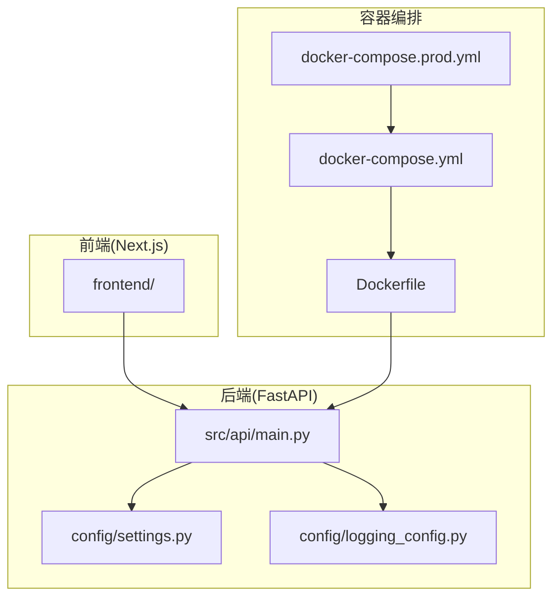
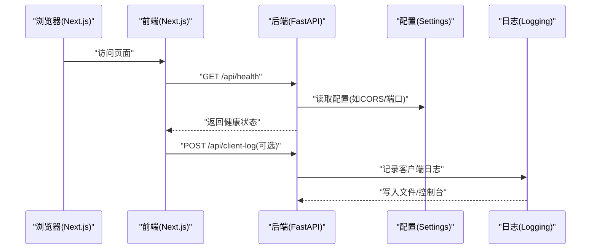
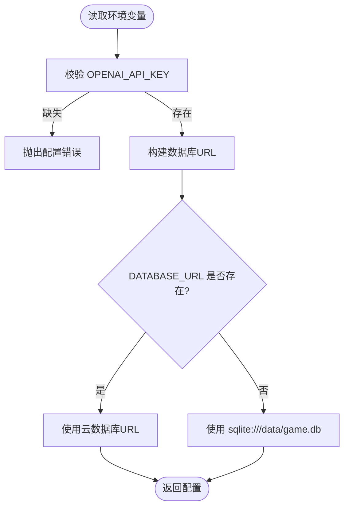
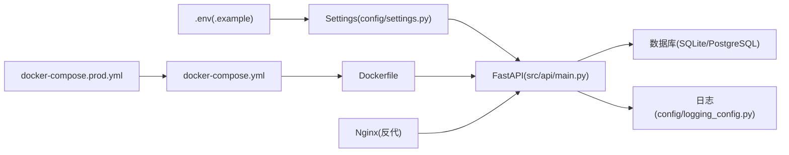

# 配置与部署

<cite>
**本文引用的文件**
- [config/settings.py](file://config/settings.py)
- [config/logging_config.py](file://config/logging_config.py)
- [.env.example](file://.env.example)
- [Dockerfile](file://Dockerfile)
- [docker-compose.yml](file://docker-compose.yml)
- [docker-compose.prod.yml](file://docker-compose.prod.yml)
- [DEPLOYMENT.md](file://DEPLOYMENT.md)
- [阿里云部署指南.md](file://阿里云部署指南.md)
- [requirements.txt](file://requirements.txt)
- [run_api.py](file://run_api.py)
- [src/api/main.py](file://src/api/main.py)
- [tests/test_config.py](file://tests/test_config.py)
</cite>

## 目录
1. [简介](#简介)
2. [项目结构](#项目结构)
3. [核心组件](#核心组件)
4. [架构总览](#架构总览)
5. [详细组件分析](#详细组件分析)
6. [依赖关系分析](#依赖关系分析)
7. [性能考虑](#性能考虑)
8. [故障排除指南](#故障排除指南)
9. [结论](#结论)
10. [附录](#附录)

## 简介
本指南面向“人生草稿本”项目的运维与开发者，提供从环境变量、AI服务、数据库、日志与监控，到Docker容器化与云平台部署的完整配置与部署说明，并给出性能监控、日志分析、故障排除与安全最佳实践。

## 项目结构
项目采用前后端分离与模块化设计：
- 后端基于 FastAPI，提供 REST API 与 SSE 辅助能力
- 前端基于 Next.js（位于 frontend/），通过环境变量与后端交互
- 配置集中在 config/，包含设置与日志
- 部署通过 Docker 与 docker-compose 完成，支持开发与生产环境

图表来源
- [src/api/main.py](file://src/api/main.py#L1-L134)
- [config/settings.py](file://config/settings.py#L1-L168)
- [config/logging_config.py](file://config/logging_config.py#L1-L78)
- [Dockerfile](file://Dockerfile#L1-L40)
- [docker-compose.yml](file://docker-compose.yml#L1-L65)
- [docker-compose.prod.yml](file://docker-compose.prod.yml#L1-L43)

章节来源
- [src/api/main.py](file://src/api/main.py#L1-L134)
- [config/settings.py](file://config/settings.py#L1-L168)
- [config/logging_config.py](file://config/logging_config.py#L1-L78)
- [Dockerfile](file://Dockerfile#L1-L40)
- [docker-compose.yml](file://docker-compose.yml#L1-L65)
- [docker-compose.prod.yml](file://docker-compose.prod.yml#L1-L43)

## 核心组件
- 环境变量与配置中心：集中于 config/settings.py，负责读取 .env 并提供统一配置入口
- 日志系统：config/logging_config.py 提供生产环境日志配置与自动开关
- API 服务：src/api/main.py 提供路由、CORS、健康检查与客户端日志收集
- 容器与编排：Dockerfile、docker-compose.yml、docker-compose.prod.yml
- 部署文档：DEPLOYMENT.md 与 阿里云部署指南.md 提供多平台部署流程

章节来源
- [config/settings.py](file://config/settings.py#L1-L168)
- [config/logging_config.py](file://config/logging_config.py#L1-L78)
- [src/api/main.py](file://src/api/main.py#L1-L134)
- [Dockerfile](file://Dockerfile#L1-L40)
- [docker-compose.yml](file://docker-compose.yml#L1-L65)
- [docker-compose.prod.yml](file://docker-compose.prod.yml#L1-L43)
- [.env.example](file://.env.example#L1-L22)

## 架构总览
后端服务通过 FastAPI 提供 API，前端 Next.js 通过环境变量自动探测后端地址；日志系统在生产环境启用文件轮转；容器化通过 Dockerfile 与 docker-compose 管理，支持开发与生产双栈。

图表来源
- [src/api/main.py](file://src/api/main.py#L92-L134)
- [config/settings.py](file://config/settings.py#L46-L66)
- [config/logging_config.py](file://config/logging_config.py#L12-L69)

章节来源
- [src/api/main.py](file://src/api/main.py#L1-L134)
- [config/settings.py](file://config/settings.py#L1-L168)
- [config/logging_config.py](file://config/logging_config.py#L1-L78)

## 详细组件分析

### 环境变量与配置中心（config/settings.py）
- 关键配置项
  - OpenAI API：OPENAI_API_KEY、OPENAI_MODEL、OPENAI_BASE_URL
  - 图像生成：IMAGE_API_KEY、IMAGE_API_BASE_URL、IMAGE_MODEL、IMAGE_GENERATION_TIMEOUT、IMAGE_MAX_RETRIES、TEXT_TO_IMAGE_MODELS、IMAGE_EDIT_MODELS
  - 场景分析：SCENE_ANALYZER_API_KEY、SCENE_ANALYZER_BASE_URL、SCENE_ANALYZER_MODEL
  - 图片存储：IMAGE_STORAGE_TYPE、IMAGE_LOCAL_PATH、OSS_*（OSS_ACCESS_KEY_ID、OSS_ACCESS_KEY_SECRET、OSS_ENDPOINT、OSS_BUCKET_NAME）
  - 应用行为：DEFAULT_LANGUAGE、CACHE_EVENTS、DEBUG_MODE、GENERATION_TIMEOUT
  - 数据库：DATABASE_URL（云）优先于 DATABASE_PATH（本地 SQLite）
- 配置获取策略
  - get_image_api_key/get_image_api_base_url/get_scene_analyzer_* 提供回退逻辑（优先图像/场景配置，否则复用 OpenAI）
  - get_database_url 决定云数据库或本地 SQLite
  - validate 校验必填项（如 OPENAI_API_KEY）

图表来源
- [config/settings.py](file://config/settings.py#L104-L149)

章节来源
- [config/settings.py](file://config/settings.py#L1-L168)
- [.env.example](file://.env.example#L1-L22)
- [tests/test_config.py](file://tests/test_config.py#L45-L59)

### 日志与监控配置（config/logging_config.py）
- 生产环境自动启用：当 ENVIRONMENT=production 时，按 LOG_LEVEL 初始化日志
- 输出目标：控制台（始终）+ 文件（生产环境轮转）
- 轮转策略：单文件最大 10MB，保留 5 份备份
- 第三方库抑制：降低 httpx、openai、urllib3 的日志噪声
- 建议：结合容器日志驱动（json-file）与 Nginx 访问日志进行统一采集

章节来源
- [config/logging_config.py](file://config/logging_config.py#L1-L78)
- [docker-compose.prod.yml](file://docker-compose.prod.yml#L18-L24)

### API 服务与健康检查（src/api/main.py）
- 生命周期：启动时初始化数据库，关闭时优雅退出
- CORS：允许本地开发与局域网访问，支持 Cookie 认证（allow_credentials=True）
- 健康检查：/api/health 返回服务状态与活动会话数
- 客户端日志：/api/client-log 接收前端上报的错误上下文，便于移动端调试
- 全局异常处理：统一返回 500 与错误详情

章节来源
- [src/api/main.py](file://src/api/main.py#L24-L134)

### 容器化与编排（Dockerfile、docker-compose.yml、docker-compose.prod.yml）
- Dockerfile
  - 基础镜像：python:3.9-slim
  - 系统依赖：PostgreSQL 客户端
  - 工作目录与数据卷：/app/data/cache、/app/data/presets
  - 健康检查：后端 /docs、前端 /_stcore/health
  - 端口：8000（后端）、8501（前端）
- docker-compose.yml
  - 开发环境：映射 .env 至容器，暴露 8501 端口，挂载数据目录
  - 环境变量：OPENAI_*、DATABASE_URL、DEFAULT_LANGUAGE、CACHE_EVENTS
  - 可选：内置 PostgreSQL 服务（注释可启用）
- docker-compose.prod.yml
  - 继承开发配置，强制 ENVIRONMENT=production
  - Nginx 反向代理：80/443，健康检查 nginx -t
  - 容器日志驱动：json-file，单文件 10MB，最多 3 个

章节来源
- [Dockerfile](file://Dockerfile#L1-L40)
- [docker-compose.yml](file://docker-compose.yml#L1-L65)
- [docker-compose.prod.yml](file://docker-compose.prod.yml#L1-L43)

### 部署与云平台指南（DEPLOYMENT.md、阿里云部署指南.md）
- 方案一：Streamlit Cloud（最简）
  - 适合快速上线与个人项目
  - Secrets 中配置 OPENAI_API_KEY、DATABASE_URL、DEFAULT_LANGUAGE、CACHE_EVENTS
- 方案二：Docker 部署（推荐）
  - 本地准备 .env，构建并启动
  - 常用命令：build、up -d、logs -f、restart、ps
- 方案三：完整生产环境（高级）
  - 使用 docker-compose.prod.yml 启动 Nginx 与应用
  - 配置 HTTPS（Let’s Encrypt 或阿里云免费证书）
  - DNS 解析与健康检查
- 阿里云部署
  - ECS 服务器、域名与 DNS、Nginx 与 SSL、证书续期、安全加固
  - 备份与监控建议

章节来源
- [DEPLOYMENT.md](file://DEPLOYMENT.md#L1-L352)
- [阿里云部署指南.md](file://阿里云部署指南.md#L1-L807)

## 依赖关系分析
- 配置依赖：API 服务依赖 Settings 读取环境变量与数据库 URL
- 日志依赖：API 服务初始化日志；生产环境由 logging_config 自动接管
- 容器依赖：Dockerfile 安装依赖；compose 定义服务与网络；prod 扩展 Nginx

图表来源
- [config/settings.py](file://config/settings.py#L107-L141)
- [src/api/main.py](file://src/api/main.py#L15-L33)
- [config/logging_config.py](file://config/logging_config.py#L72-L78)
- [Dockerfile](file://Dockerfile#L17-L29)
- [docker-compose.yml](file://docker-compose.yml#L5-L27)
- [docker-compose.prod.yml](file://docker-compose.prod.yml#L25-L42)

章节来源
- [config/settings.py](file://config/settings.py#L1-L168)
- [src/api/main.py](file://src/api/main.py#L1-L134)
- [config/logging_config.py](file://config/logging_config.py#L1-L78)
- [Dockerfile](file://Dockerfile#L1-L40)
- [docker-compose.yml](file://docker-compose.yml#L1-L65)
- [docker-compose.prod.yml](file://docker-compose.prod.yml#L1-L43)

## 性能考虑
- 数据库
  - 生产建议使用 PostgreSQL（云部署）以提升并发与稳定性
  - SQLite 适用于开发与小规模使用
- 超时与重试
  - IMAGE_GENERATION_TIMEOUT、IMAGE_MAX_RETRIES、GENERATION_TIMEOUT 可按业务压力调整
- 容器资源
  - docker-compose.yml 中已配置 CPU 与内存限制，可根据实际负载调整
- 前端请求
  - 前端侧具备连接超时与重试策略，建议与后端超时保持一致

章节来源
- [config/settings.py](file://config/settings.py#L57-L106)
- [docker-compose.yml](file://docker-compose.yml#L34-L43)
- [frontend/.next/dev/server/chunks/ssr/*](file://frontend/.next/dev/server/chunks/ssr/[root-of-the-server]__b2d997aa._.js#L2385-L2422)

## 故障排除指南
- 环境变量未生效
  - 确认 .env 已正确复制并命名
  - docker-compose.yml 中已将 .env 注入容器
- OpenAI API 密钥错误
  - 核对 OPENAI_API_KEY 是否存在且有效
  - 若使用图像/场景分析，需同时配置对应 API Key 与 Base URL
- 数据库连接失败
  - 未设置 DATABASE_URL 时使用本地 SQLite；若使用云数据库，请提供正确的 DATABASE_URL
- 健康检查失败
  - 后端：/api/health
  - 前端：/_stcore/health
  - Nginx：/health
- 日志定位
  - 容器日志：docker-compose logs -f app
  - 应用日志文件：/app/logs/app.log
- 常见问题清单
  - 更新应用：git pull → docker-compose build → docker-compose up -d
  - 查看日志：docker-compose logs -f app
  - 配置数据库：SQLite 默认；PostgreSQL 需设置 DATABASE_URL
  - HTTPS：Let’s Encrypt 或阿里云免费证书
  - 资源限制：调整 docker-compose.yml 中 deploy.resources

章节来源
- [DEPLOYMENT.md](file://DEPLOYMENT.md#L237-L318)
- [docker-compose.yml](file://docker-compose.yml#L28-L33)
- [docker-compose.prod.yml](file://docker-compose.prod.yml#L38-L42)
- [config/logging_config.py](file://config/logging_config.py#L52-L62)

## 结论
通过统一的配置中心、完善的日志与容器化编排，以及多平台部署文档，“人生草稿本”可在本地、云服务器与生产环境中稳定运行。建议在生产环境使用 PostgreSQL、Nginx 反代与 HTTPS，并建立日志与监控体系，持续优化超时与重试策略以提升用户体验。

## 附录

### 环境变量清单与用途
- OpenAI API
  - OPENAI_API_KEY：必填
  - OPENAI_MODEL：默认 gpt-4
  - OPENAI_BASE_URL：可选
- 图像生成
  - IMAGE_API_KEY：可选（未配置则复用 OPENAI_API_KEY）
  - IMAGE_API_BASE_URL：可选（未配置则复用 OPENAI_BASE_URL）
  - IMAGE_MODEL：默认 wanx-v1
  - IMAGE_GENERATION_TIMEOUT：默认 60 秒
  - IMAGE_MAX_RETRIES：默认 3 次
  - TEXT_TO_IMAGE_MODELS、IMAGE_EDIT_MODELS：逗号分隔的模型降级列表
- 场景分析
  - SCENE_ANALYZER_API_KEY：可选（未配置则复用 OPENAI_API_KEY）
  - SCENE_ANALYZER_BASE_URL：可选（未配置则复用 OPENAI_BASE_URL）
  - SCENE_ANALYZER_MODEL：默认 deepseek-chat
- 图片存储
  - IMAGE_STORAGE_TYPE：local 或 oss，默认 local
  - OSS_*：OSS 访问所需密钥与 Endpoint、Bucket
- 应用行为
  - DEFAULT_LANGUAGE：默认 zh
  - CACHE_EVENTS：默认 true
  - DEBUG_MODE：默认 false
  - GENERATION_TIMEOUT：默认 60 秒
- 数据库
  - DATABASE_URL：云数据库优先
  - DATABASE_PATH：本地 SQLite 默认路径

章节来源
- [config/settings.py](file://config/settings.py#L30-L141)
- [.env.example](file://.env.example#L1-L22)

### 启动与运行参数
- 后端服务
  - API_HOST、API_PORT、API_RELOAD：run_api.py 读取并传给 Uvicorn
- 前端
  - NEXT_PUBLIC_API_BASE：生产部署时覆盖后端地址
  - 前端自动检测当前访问主机 + 8000 端口

章节来源
- [run_api.py](file://run_api.py#L18-L31)
- [frontend/.next/dev/server/chunks/ssr/*](file://frontend/.next/dev/server/chunks/ssr/[root-of-the-server]__b2d997aa._.js#L2395-L2396)

### 安全与最佳实践
- 保护 .env：禁止提交至版本库，权限设为 600
- 使用 HTTPS：生产环境强制 HTTPS，证书可使用 Let’s Encrypt 或阿里云免费证书
- 防火墙与密钥：禁用 root 密码登录，使用 SSH 密钥；开启防火墙仅放通必要端口
- 定期更新：系统、Docker 与依赖定期升级
- 备份策略：数据目录与数据库定期备份，测试恢复流程

章节来源
- [阿里云部署指南.md](file://阿里云部署指南.md#L709-L760)
- [DEPLOYMENT.md](file://DEPLOYMENT.md#L320-L329)