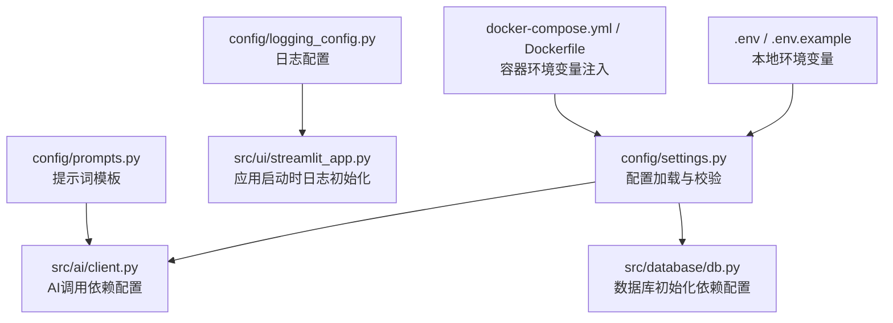
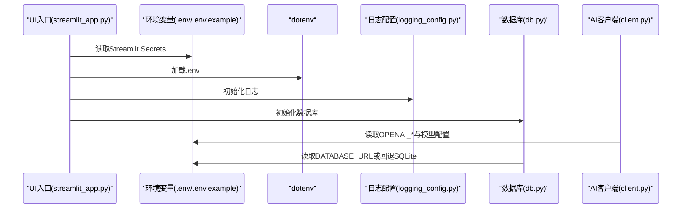
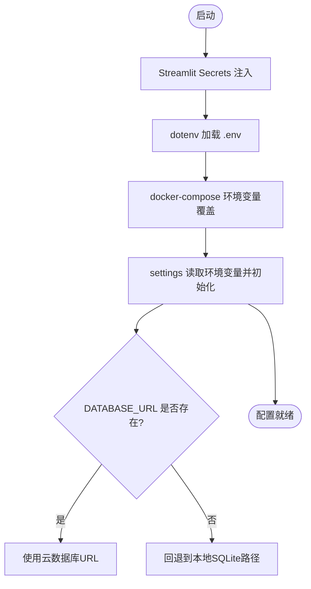
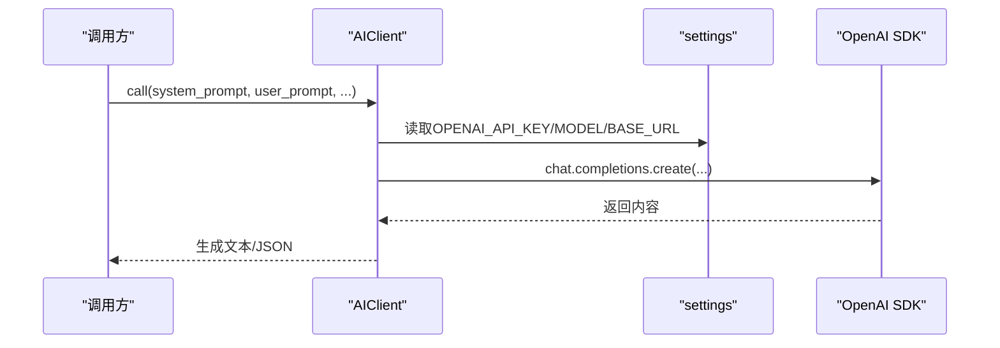
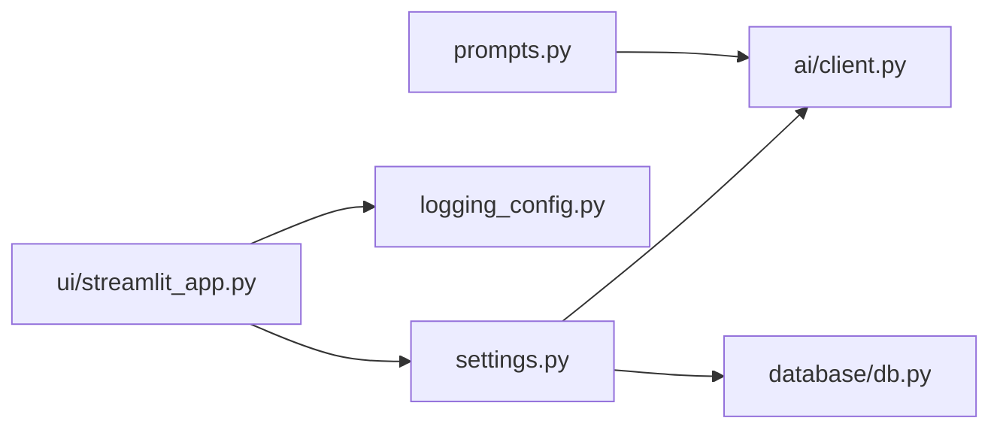

# 配置管理

<cite>
**本文引用的文件**
- [config/settings.py](file://config/settings.py)
- [config/logging_config.py](file://config/logging_config.py)
- [config/prompts.py](file://config/prompts.py)
- [src/ai/client.py](file://src/ai/client.py)
- [src/database/db.py](file://src/database/db.py)
- [src/ui/streamlit_app.py](file://src/ui/streamlit_app.py)
- [.env](file://.env)
- [.env.example](file://.env.example)
- [tests/test_config.py](file://tests/test_config.py)
- [Dockerfile](file://Dockerfile)
- [docker-compose.yml](file://docker-compose.yml)
- [requirements.txt](file://requirements.txt)
</cite>

## 目录
1. [简介](#简介)
2. [项目结构](#项目结构)
3. [核心组件](#核心组件)
4. [架构总览](#架构总览)
5. [详细组件分析](#详细组件分析)
6. [依赖分析](#依赖分析)
7. [性能考虑](#性能考虑)
8. [故障排查指南](#故障排查指南)
9. [结论](#结论)
10. [附录](#附录)

## 简介
本文件系统性梳理本项目的配置管理架构与策略，覆盖环境变量配置、系统设置参数、提示词模板设计、配置加载顺序与优先级、日志与数据库配置、AI服务配置、配置验证与错误处理、多环境（开发/测试/生产）差异管理，以及配置安全与敏感信息保护的最佳实践。目标是帮助开发者与运维人员快速理解并正确使用配置体系。

## 项目结构
配置相关的关键位置与职责如下：
- config/settings.py：集中定义与加载环境变量、项目路径、游戏常量、数据库URL选择逻辑与配置校验。
- config/logging_config.py：生产环境日志初始化与第三方库日志级别控制。
- config/prompts.py：提示词模板与上下文构建函数，支撑AI事件生成。
- src/ai/client.py：统一的AI调用抽象层，依赖配置读取API密钥、模型与基础URL。
- src/database/db.py：数据库操作封装，依赖SQLAlchemy初始化与配置。
- src/ui/streamlit_app.py：UI入口，负责将Streamlit Secrets注入环境变量并在启动时初始化数据库与日志。
- .env 与 .env.example：本地开发的环境变量示例与默认值占位。
- docker-compose.yml 与 Dockerfile：容器化部署时的环境变量注入与运行参数。
- tests/test_config.py：配置层单元测试，覆盖Settings与日志配置。

图表来源
- [config/settings.py](file://config/settings.py#L1-L100)
- [src/ai/client.py](file://src/ai/client.py#L1-L214)
- [src/database/db.py](file://src/database/db.py#L1-L517)
- [config/logging_config.py](file://config/logging_config.py#L1-L78)
- [src/ui/streamlit_app.py](file://src/ui/streamlit_app.py#L1-L215)
- [.env](file://.env#L1-L9)
- [docker-compose.yml](file://docker-compose.yml#L1-L65)
- [Dockerfile](file://Dockerfile#L1-L48)

章节来源
- [config/settings.py](file://config/settings.py#L1-L100)
- [config/logging_config.py](file://config/logging_config.py#L1-L78)
- [config/prompts.py](file://config/prompts.py#L1-L800)
- [src/ai/client.py](file://src/ai/client.py#L1-L214)
- [src/database/db.py](file://src/database/db.py#L1-L517)
- [src/ui/streamlit_app.py](file://src/ui/streamlit_app.py#L1-L215)
- [.env](file://.env#L1-L9)
- [.env.example](file://.env.example#L1-L18)
- [docker-compose.yml](file://docker-compose.yml#L1-L65)
- [Dockerfile](file://Dockerfile#L1-L48)

## 核心组件
- 配置加载与校验（config/settings.py）
  - 通过dotenv加载本地环境变量，随后从环境变量读取API密钥、模型、基础URL、语言、缓存开关、调试模式等。
  - 定义项目根目录、数据目录、预设与缓存目录，并在本地尝试创建目录（云环境可忽略失败）。
  - 提供数据库URL选择逻辑：优先使用云数据库URL，否则回退到本地SQLite路径。
  - 提供validate方法进行必要配置校验（如API密钥）。
- 日志配置（config/logging_config.py）
  - 支持控制台与轮转文件日志，支持第三方库日志级别抑制。
  - 在生产环境自动按环境变量设置日志级别与文件输出。
- 提示词模板（config/prompts.py）
  - 提供事件生成提示词的上下文拼装函数，包括时间、人物、剧情线、世界事实、逻辑约束、伏笔回响等。
  - 支持中英文双语上下文与约束，保证故事一致性与可读性。
- AI调用抽象层（src/ai/client.py）
  - 从配置读取API密钥、模型与基础URL，构造OpenAI客户端。
  - 提供统一的文本与JSON调用接口，支持重试与错误反馈注入。
- 数据库封装（src/database/db.py）
  - 通过SQLAlchemy进行ORM操作，依赖配置初始化数据库连接。
- UI入口（src/ui/streamlit_app.py）
  - 将Streamlit Secrets注入环境变量，启动时初始化数据库与日志。

章节来源
- [config/settings.py](file://config/settings.py#L1-L100)
- [config/logging_config.py](file://config/logging_config.py#L1-L78)
- [config/prompts.py](file://config/prompts.py#L1-L800)
- [src/ai/client.py](file://src/ai/client.py#L1-L214)
- [src/database/db.py](file://src/database/db.py#L1-L517)
- [src/ui/streamlit_app.py](file://src/ui/streamlit_app.py#L1-L215)

## 架构总览
配置在系统中的流向如下：
- 启动阶段：UI入口加载Streamlit Secrets到环境变量；dotenv加载本地变量；随后初始化日志与数据库。
- 运行阶段：AI模块从配置读取API密钥与模型；数据库模块基于配置选择云或本地数据库；提示词模板根据语言与上下文动态组装。

图表来源
- [src/ui/streamlit_app.py](file://src/ui/streamlit_app.py#L21-L41)
- [.env](file://.env#L1-L9)
- [.env.example](file://.env.example#L1-L18)
- [config/logging_config.py](file://config/logging_config.py#L72-L78)
- [src/database/db.py](file://src/database/db.py#L1-L517)
- [src/ai/client.py](file://src/ai/client.py#L25-L48)

## 详细组件分析

### 配置加载顺序与优先级
- 环境变量注入顺序
  1) Streamlit Secrets注入到进程环境变量（UI入口）。
  2) .env文件通过dotenv加载（settings模块）。
  3) docker-compose环境变量覆盖上述值（容器部署）。
- 优先级说明
  - Streamlit Secrets > .env > docker-compose环境变量（容器部署时）。
  - 数据库URL优先级：DATABASE_URL > 本地SQLite路径。
  - 语言与缓存等参数遵循相同“最后设置生效”的原则。
- 继承关系
  - settings模块提供全局单例实例，其他模块通过导入settings访问配置。
  - AI与数据库模块均依赖settings提供的常量与方法（如get_database_url）。

图表来源
- [src/ui/streamlit_app.py](file://src/ui/streamlit_app.py#L21-L28)
- [config/settings.py](file://config/settings.py#L70-L82)
- [docker-compose.yml](file://docker-compose.yml#L12-L21)
- [.env](file://.env#L1-L9)

章节来源
- [src/ui/streamlit_app.py](file://src/ui/streamlit_app.py#L21-L28)
- [config/settings.py](file://config/settings.py#L70-L82)
- [docker-compose.yml](file://docker-compose.yml#L12-L21)
- [.env](file://.env#L1-L9)

### 系统设置参数与验证
- 关键参数
  - OPENAI_API_KEY、OPENAI_MODEL、OPENAI_BASE_URL：AI服务配置。
  - DEFAULT_LANGUAGE、CACHE_EVENTS、DEBUG_MODE：应用行为参数。
  - DATABASE_URL、DATABASE_PATH：数据库连接参数。
- 验证机制
  - settings.validate在缺少API密钥时抛出异常，阻止应用继续运行。
- 测试覆盖
  - 单测验证数据库URL选择逻辑、语言获取、单例实例有效性与配置校验。

章节来源
- [config/settings.py](file://config/settings.py#L33-L91)
- [tests/test_config.py](file://tests/test_config.py#L72-L98)

### 日志配置
- 功能特性
  - 控制台处理器与可选文件处理器（轮转文件）。
  - 第三方库日志级别统一降噪（httpx、openai、urllib3）。
  - 生产环境自动按环境变量设置日志级别与文件输出。
- 使用方式
  - UI入口在启动时配置日志；logging_config模块在生产环境自动初始化。

章节来源
- [config/logging_config.py](file://config/logging_config.py#L12-L78)
- [src/ui/streamlit_app.py](file://src/ui/streamlit_app.py#L30-L41)

### 数据库连接配置
- URL选择逻辑
  - 若设置DATABASE_URL则使用云数据库（PostgreSQL/MySQL等）。
  - 否则回退到sqlite:///相对路径。
- ORM封装
  - db模块通过SQLAlchemy进行增删改查与快照保存，依赖settings提供的数据库URL。

章节来源
- [config/settings.py](file://config/settings.py#L68-L82)
- [src/database/db.py](file://src/database/db.py#L1-L517)

### AI服务配置与调用
- 配置读取
  - 从settings读取API密钥、模型与基础URL，构造OpenAI客户端。
- 调用能力
  - 文本与JSON两类调用接口，支持流式回调与非流式两种模式。
  - 提供带错误反馈注入的重试机制，提升生成稳定性。

图表来源
- [src/ai/client.py](file://src/ai/client.py#L25-L48)
- [src/ai/client.py](file://src/ai/client.py#L51-L104)
- [config/settings.py](file://config/settings.py#L34-L36)

章节来源
- [src/ai/client.py](file://src/ai/client.py#L22-L214)
- [config/settings.py](file://config/settings.py#L33-L41)

### 提示词模板设计
- 设计要点
  - 以函数组合方式构建上下文：时间、人物、剧情线、世界事实、逻辑约束、伏笔回响、角色习惯等。
  - 支持中英文双语，自动切换约束与提示风格。
  - 通过WorldModel与历史摘要等上下文增强一致性与沉浸感。
- 使用场景
  - 事件生成、周/年总结、结局生成、一致性校验等。

章节来源
- [config/prompts.py](file://config/prompts.py#L674-L800)

### 多环境配置管理
- 开发环境
  - 使用.docker-compose.yml挂载环境变量，.env.example提供默认占位。
  - DEBUG_MODE可用于开启调试控制台与更详细日志。
- 测试环境
  - 单元测试覆盖配置加载与日志初始化，确保配置变更不影响核心逻辑。
- 生产环境
  - 通过Dockerfile设置默认端口与健康检查；生产日志自动按环境变量启用文件输出。

章节来源
- [.env.example](file://.env.example#L1-L18)
- [docker-compose.yml](file://docker-compose.yml#L12-L21)
- [Dockerfile](file://Dockerfile#L8-L13)
- [config/logging_config.py](file://config/logging_config.py#L72-L78)
- [tests/test_config.py](file://tests/test_config.py#L108-L168)

### 配置安全与敏感信息保护
- 最佳实践
  - 不在代码仓库中提交真实密钥；使用环境变量注入（Secrets/Docker/CI）。
  - 本地开发使用.env，生产使用平台Secrets或编排工具注入。
  - 对第三方库日志进行降噪，避免在日志中泄露请求体或响应体。
- 已有实现
  - Streamlit Secrets注入到进程环境变量。
  - dotenv仅用于本地开发。
  - 日志模块对第三方库日志级别进行统一设置。

章节来源
- [src/ui/streamlit_app.py](file://src/ui/streamlit_app.py#L21-L28)
- [.env](file://.env#L1-L9)
- [config/logging_config.py](file://config/logging_config.py#L64-L67)

## 依赖分析
- 组件耦合
  - settings是全局单例，AI与数据库模块均依赖它提供的常量与方法。
  - UI入口负责环境变量注入与日志初始化，降低其他模块对部署细节的耦合。
- 外部依赖
  - openai、sqlalchemy、streamlit、python-dotenv等。
- 潜在循环依赖
  - 通过模块导入与延迟初始化避免循环依赖风险。

图表来源
- [config/settings.py](file://config/settings.py#L98-L100)
- [src/ai/client.py](file://src/ai/client.py#L16-L48)
- [src/database/db.py](file://src/database/db.py#L1-L8)
- [src/ui/streamlit_app.py](file://src/ui/streamlit_app.py#L19-L41)
- [config/prompts.py](file://config/prompts.py#L1-L5)

章节来源
- [config/settings.py](file://config/settings.py#L98-L100)
- [src/ai/client.py](file://src/ai/client.py#L16-L48)
- [src/database/db.py](file://src/database/db.py#L1-L8)
- [src/ui/streamlit_app.py](file://src/ui/streamlit_app.py#L19-L41)
- [config/prompts.py](file://config/prompts.py#L1-L5)

## 性能考虑
- 日志轮转
  - 文件大小与备份数量可配置，避免单文件过大影响IO。
- 数据库连接
  - 云数据库与本地SQLite的选择直接影响连接开销与并发能力，建议在生产使用云数据库。
- AI调用
  - 提供流式回调接口，减少前端等待时间；合理设置温度与最大token数，平衡质量与成本。

章节来源
- [config/logging_config.py](file://config/logging_config.py#L16-L17)
- [config/settings.py](file://config/settings.py#L68-L82)
- [src/ai/client.py](file://src/ai/client.py#L51-L104)

## 故障排查指南
- 缺少API密钥
  - 现象：配置校验抛出异常，应用无法启动。
  - 排查：确认环境变量注入顺序（Secrets > .env > compose），检查密钥是否正确设置。
- 数据库连接失败
  - 现象：数据库初始化报错或查询异常。
  - 排查：确认DATABASE_URL是否正确；若为空则检查SQLite路径是否存在且可写。
- 日志未输出到文件
  - 现象：仅控制台输出，无文件日志。
  - 排查：确认生产环境变量设置与日志目录权限。
- 提示词生成异常
  - 现象：AI返回格式不符合预期。
  - 排查：使用call_json接口解析；结合重试与错误反馈注入机制逐步定位问题。

章节来源
- [config/settings.py](file://config/settings.py#L84-L91)
- [src/database/db.py](file://src/database/db.py#L1-L517)
- [config/logging_config.py](file://config/logging_config.py#L72-L78)
- [src/ai/client.py](file://src/ai/client.py#L140-L214)

## 结论
本项目的配置管理以settings为中心，结合dotenv、docker-compose与Streamlit Secrets实现多环境无缝切换；通过统一的AI与数据库抽象层，确保配置变更对业务逻辑的影响最小化。配合完善的日志与测试覆盖，能够在开发、测试与生产环境中稳定运行。建议持续完善Secrets管理与日志脱敏策略，进一步提升安全性与可观测性。

## 附录
- 环境变量清单
  - OPENAI_API_KEY：AI服务密钥
  - OPENAI_MODEL：模型名称
  - OPENAI_BASE_URL：AI服务基础URL
  - DATABASE_URL：云数据库连接串
  - DEFAULT_LANGUAGE：默认语言（zh/en）
  - CACHE_EVENTS：事件缓存开关
  - DEBUG_MODE：调试模式
  - ENVIRONMENT：环境标识（production）
  - LOG_LEVEL：日志级别
- 容器运行参数
  - 端口：8501
  - 健康检查：/_stcore/health
  - 数据卷：/app/data

章节来源
- [.env.example](file://.env.example#L1-L18)
- [docker-compose.yml](file://docker-compose.yml#L12-L21)
- [Dockerfile](file://Dockerfile#L8-L13)
- [Dockerfile](file://Dockerfile#L39-L40)