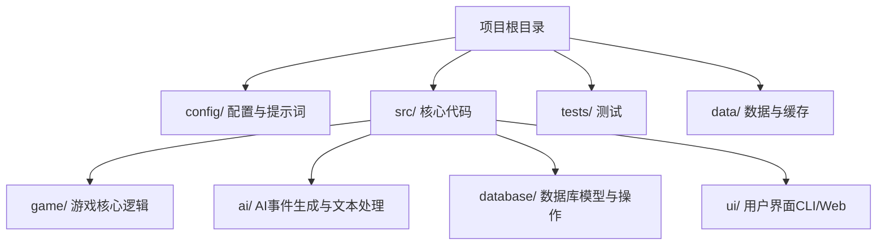
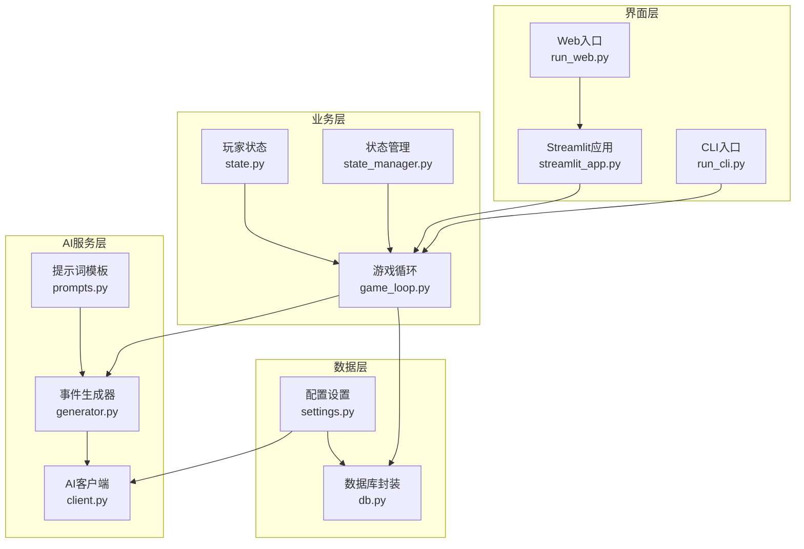
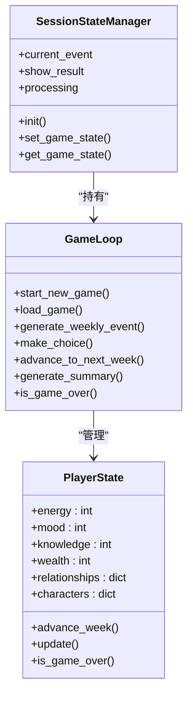
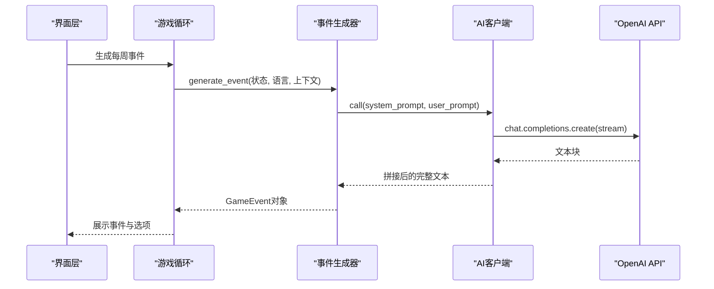
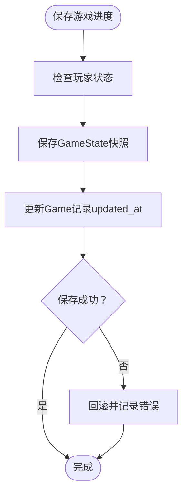
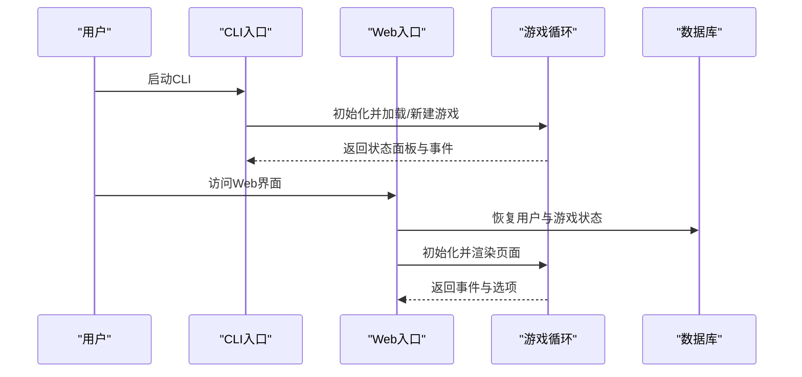
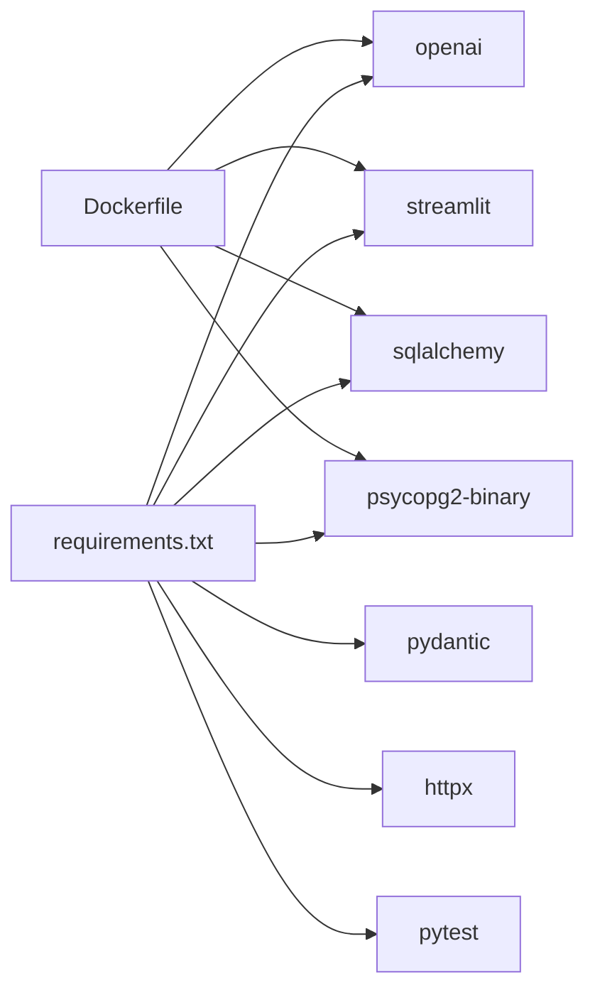

# 项目概述

<cite>
**本文档引用的文件**
- [README.md](file://README.md)
- [requirements.txt](file://requirements.txt)
- [run_web.py](file://run_web.py)
- [run_cli.py](file://run_cli.py)
- [src/ui/streamlit_app.py](file://src/ui/streamlit_app.py)
- [src/ui/cli.py](file://src/ui/cli.py)
- [config/settings.py](file://config/settings.py)
- [src/game/game_loop.py](file://src/game/game_loop.py)
- [src/ai/generator.py](file://src/ai/generator.py)
- [src/ai/client.py](file://src/ai/client.py)
- [src/database/db.py](file://src/database/db.py)
- [src/ui/state_manager.py](file://src/ui/state_manager.py)
- [src/game/state.py](file://src/game/state.py)
- [config/prompts.py](file://config/prompts.py)
- [Dockerfile](file://Dockerfile)
- [DEPLOYMENT.md](file://DEPLOYMENT.md)
</cite>

## 目录
1. [项目简介](#项目简介)
2. [项目结构](#项目结构)
3. [核心组件](#核心组件)
4. [架构总览](#架构总览)
5. [详细组件分析](#详细组件分析)
6. [依赖关系分析](#依赖关系分析)
7. [性能考虑](#性能考虑)
8. [故障排除指南](#故障排除指南)
9. [结论](#结论)
10. [附录](#附录)

## 项目简介
人生草稿本是一个基于AI的文本式人生模拟游戏，融合了AI生成事件、资源管理与决策制定等核心玩法。玩家从22岁开始，经历约8年的虚拟人生（96周），每周面对2-3个AI生成的个性化事件，通过做出选择来影响自身的能量、情绪、知识与财富等资源，并管理与关键NPC的关系。游戏提供双界面支持：命令行界面（CLI）与Web界面（Streamlit），并具备多语言（中英）支持与多种结局。

- 核心目标：通过AI驱动的动态叙事，让玩家在可控的资源与关系系统中体验不同的人生轨迹。
- 技术价值主张：以轻量级模块化架构实现AI事件生成、多轮叙事与持久化，兼顾易用性与可扩展性。
- 开发阶段：当前处于第二阶段（Web界面与完整游戏循环），计划逐步迭代至内容优化与增强。

**章节来源**
- [README.md](file://README.md#L1-L84)

## 项目结构
项目采用按功能域划分的模块化组织方式，核心目录包括：
- config：配置与提示词模板
- src：核心业务代码（game、ai、database、ui）
- tests：单元与集成测试
- data：数据与缓存（数据库、事件缓存、预设）

**图表来源**
- [README.md](file://README.md#L61-L73)

**章节来源**
- [README.md](file://README.md#L61-L73)

## 核心组件
- 配置与设置：集中管理OpenAI API、数据库连接、游戏常量与调试开关。
- AI事件生成器：统一的AI调用抽象层，负责故事生成、选项生成、摘要与重写。
- 游戏循环：驱动每周事件生成、决策处理、资源衰减与总结生成。
- 数据库层：提供游戏状态、决策与结局的持久化能力。
- UI层：CLI与Streamlit双入口，统一的状态管理与页面路由。
- 提示词模板：为AI生成提供结构化的上下文约束与叙事连续性保障。

**章节来源**
- [config/settings.py](file://config/settings.py#L30-L100)
- [src/ai/generator.py](file://src/ai/generator.py#L30-L66)
- [src/game/game_loop.py](file://src/game/game_loop.py#L23-L60)
- [src/database/db.py](file://src/database/db.py#L10-L16)
- [src/ui/state_manager.py](file://src/ui/state_manager.py#L29-L40)

## 架构总览
系统采用分层架构：UI层（CLI/Web）→ 业务层（游戏循环）→ AI服务层（事件生成/选项/摘要）→ 数据层（数据库/缓存）。AI服务通过统一的客户端封装OpenAI调用，支持流式输出与重试机制；数据库层支持SQLite与PostgreSQL，便于本地开发与云端部署。

**图表来源**
- [run_cli.py](file://run_cli.py#L1-L7)
- [run_web.py](file://run_web.py#L1-L11)
- [src/ui/streamlit_app.py](file://src/ui/streamlit_app.py#L1-L215)
- [src/game/game_loop.py](file://src/game/game_loop.py#L23-L60)
- [src/ai/client.py](file://src/ai/client.py#L22-L48)
- [src/ai/generator.py](file://src/ai/generator.py#L30-L66)
- [config/prompts.py](file://config/prompts.py#L674-L800)
- [src/database/db.py](file://src/database/db.py#L10-L16)
- [config/settings.py](file://config/settings.py#L30-L100)

**章节来源**
- [run_cli.py](file://run_cli.py#L1-L7)
- [run_web.py](file://run_web.py#L1-L11)
- [src/ui/streamlit_app.py](file://src/ui/streamlit_app.py#L1-L215)
- [src/game/game_loop.py](file://src/game/game_loop.py#L23-L60)
- [src/ai/client.py](file://src/ai/client.py#L22-L48)
- [src/ai/generator.py](file://src/ai/generator.py#L30-L66)
- [config/prompts.py](file://config/prompts.py#L674-L800)
- [src/database/db.py](file://src/database/db.py#L10-L16)
- [config/settings.py](file://config/settings.py#L30-L100)

## 详细组件分析

### 游戏循环与状态管理
- 游戏循环负责驱动每周事件生成、决策处理、资源衰减与总结生成，并维护里程碑事件与多轮叙事。
- 玩家状态模型包含资源、关系、NPC角色系统、多轮回合、历史摘要与世界模型等，确保叙事一致性与可扩展性。
- 状态管理器提供统一的会话状态接口，屏蔽Streamlit的st.session_state直接访问，保证类型安全与可维护性。

**图表来源**
- [src/game/game_loop.py](file://src/game/game_loop.py#L23-L120)
- [src/game/state.py](file://src/game/state.py#L244-L290)
- [src/ui/state_manager.py](file://src/ui/state_manager.py#L42-L90)

**章节来源**
- [src/game/game_loop.py](file://src/game/game_loop.py#L23-L120)
- [src/game/state.py](file://src/game/state.py#L244-L290)
- [src/ui/state_manager.py](file://src/ui/state_manager.py#L42-L90)

### AI事件生成与提示工程
- AI客户端封装OpenAI调用，支持流式回调与重试机制，确保生成质量与稳定性。
- 事件生成器采用门面模式，将故事生成、选项生成、摘要与重写拆分为子服务，便于演进与测试。
- 提示词模板提供时间一致性、人物可用性、未完结剧情线、世界事实、伏笔回响与逻辑约束等上下文，保障叙事连贯与角色一致性。

**图表来源**
- [src/game/game_loop.py](file://src/game/game_loop.py#L153-L256)
- [src/ai/generator.py](file://src/ai/generator.py#L159-L214)
- [src/ai/client.py](file://src/ai/client.py#L51-L104)

**章节来源**
- [src/ai/client.py](file://src/ai/client.py#L22-L104)
- [src/ai/generator.py](file://src/ai/generator.py#L30-L66)
- [config/prompts.py](file://config/prompts.py#L674-L800)

### 数据持久化与用户系统
- 数据库封装提供游戏记录、状态快照、决策历史与结局的持久化，支持SQLite与PostgreSQL。
- 支持角色预设的保存与加载，便于快速开始新游戏或复用设定。
- 通过统一的GameDatabase类管理CRUD操作，确保数据一致性与可扩展性。

**图表来源**
- [src/database/db.py](file://src/database/db.py#L274-L321)

**章节来源**
- [src/database/db.py](file://src/database/db.py#L10-L16)
- [src/database/db.py](file://src/database/db.py#L274-L321)

### 双界面支持（CLI与Web）
- CLI入口提供纯文本交互，支持语言切换与存档加载，适合快速体验与自动化场景。
- Web入口基于Streamlit，提供图形化界面与状态恢复能力，支持多语言与调试控制台。
- 两套入口共享同一套业务逻辑与AI服务，确保体验一致性。

**图表来源**
- [run_cli.py](file://run_cli.py#L1-L7)
- [src/ui/cli.py](file://src/ui/cli.py#L120-L253)
- [run_web.py](file://run_web.py#L6-L10)
- [src/ui/streamlit_app.py](file://src/ui/streamlit_app.py#L139-L215)

**章节来源**
- [run_cli.py](file://run_cli.py#L1-L7)
- [src/ui/cli.py](file://src/ui/cli.py#L120-L253)
- [run_web.py](file://run_web.py#L1-L11)
- [src/ui/streamlit_app.py](file://src/ui/streamlit_app.py#L139-L215)

## 依赖关系分析
- Python运行时与第三方库：OpenAI SDK、Streamlit、Pydantic、SQLAlchemy、PostgreSQL驱动、pytest等。
- 部署与运维：Docker容器化、健康检查、端口暴露与环境变量配置。
- 配置与提示：集中式配置管理与提示词模板，确保AI生成质量与一致性。

**图表来源**
- [requirements.txt](file://requirements.txt#L1-L9)
- [Dockerfile](file://Dockerfile#L1-L48)

**章节来源**
- [requirements.txt](file://requirements.txt#L1-L9)
- [Dockerfile](file://Dockerfile#L1-L48)

## 性能考虑
- AI调用优化：通过事件缓存与重试机制减少重复生成与失败重试成本；合理设置温度与最大令牌数平衡创意与稳定性。
- 数据持久化：SQLite适合本地开发，生产环境建议使用PostgreSQL以提升并发与可靠性；定期清理缓存与归档历史数据。
- UI渲染：Streamlit页面路由与状态管理器避免不必要的重绘；在调试模式下启用控制台日志，便于定位性能瓶颈。
- 部署层面：容器健康检查与资源限制确保服务稳定；CDN与反向代理可提升静态资源访问效率。

[本节为通用指导，无需特定文件引用]

## 故障排除指南
- OpenAI API密钥缺失：配置OPENAI_API_KEY或在环境变量中设置，否则初始化会抛出异常。
- 数据库连接问题：检查DATABASE_URL或本地SQLite路径；生产环境建议使用PostgreSQL并配置连接参数。
- Web界面无法访问：确认端口8501未被占用，Docker容器已启动并映射端口；健康检查失败时查看容器日志。
- 事件生成失败：启用缓存与重试机制；检查提示词模板与上下文完整性；必要时降级为回退事件。

**章节来源**
- [config/settings.py](file://config/settings.py#L84-L90)
- [src/ai/client.py](file://src/ai/client.py#L140-L214)
- [src/database/db.py](file://src/database/db.py#L174-L194)
- [Dockerfile](file://Dockerfile#L38-L41)

## 结论
人生草稿本以模块化架构与清晰的职责分离，实现了AI驱动的文本式人生模拟。通过双界面支持与完善的配置体系，项目既适合初学者快速上手，也为有经验的开发者提供了良好的扩展空间。随着开发阶段推进，建议持续优化AI提示工程、增强叙事一致性与用户体验，并完善测试与监控体系。

[本节为总结性内容，无需特定文件引用]

## 附录

### 开发阶段规划
- Phase 1：核心原型（CLI）
- Phase 2：Web界面与完整游戏循环
- Phase 3：内容优化与增强

**章节来源**
- [README.md](file://README.md#L75-L80)

### 许可证信息
- 项目采用MIT许可证，允许自由使用、修改与分发。

**章节来源**
- [README.md](file://README.md#L81-L84)

### 社区贡献指南
- 代码规范：遵循Python风格指南，保持模块化与高内聚低耦合。
- 提交流程：先在本地运行测试，再提交PR并附带变更说明。
- 测试要求：新增功能需配套单元测试与集成测试。
- 文档更新：涉及用户可见的变更需同步更新README与部署文档。

**章节来源**
- [DEPLOYMENT.md](file://DEPLOYMENT.md#L332-L352)