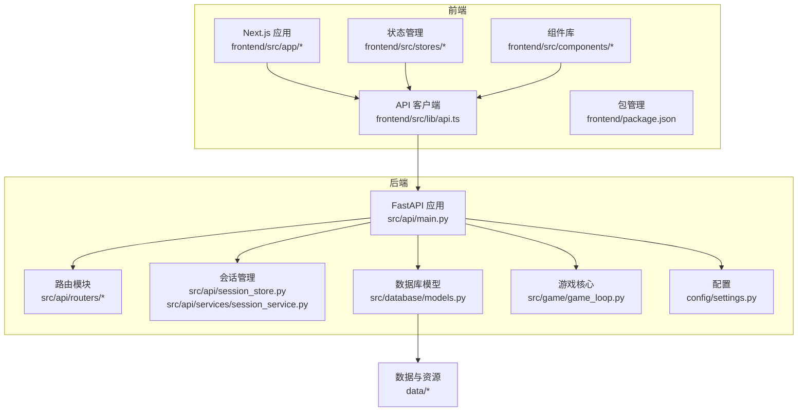
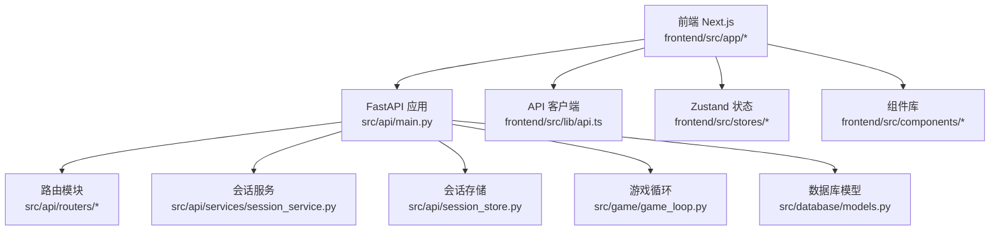
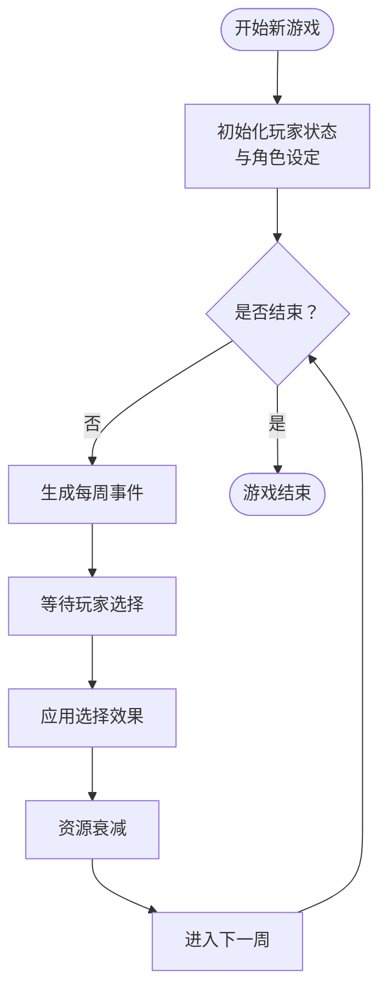
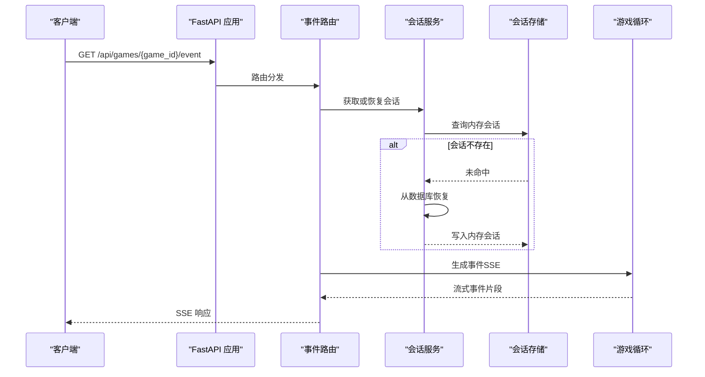
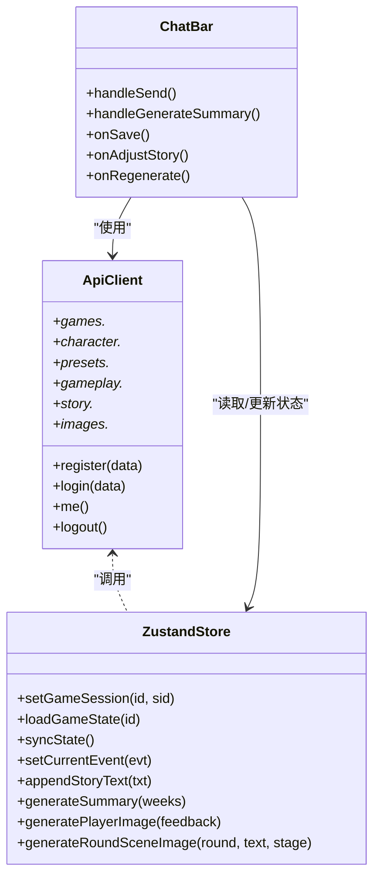
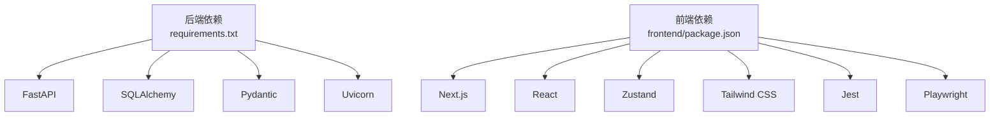

# 开发阶段说明

<cite>
**本文引用的文件**
- [README.md](file://README.md)
- [src/game/game_loop.py](file://src/game/game_loop.py)
- [src/api/main.py](file://src/api/main.py)
- [src/api/routers/gameplay/events.py](file://src/api/routers/gameplay/events.py)
- [src/api/session_store.py](file://src/api/session_store.py)
- [src/api/services/session_service.py](file://src/api/services/session_service.py)
- [src/database/models.py](file://src/database/models.py)
- [config/settings.py](file://config/settings.py)
- [frontend/src/app/layout.tsx](file://frontend/src/app/layout.tsx)
- [frontend/src/lib/api.ts](file://frontend/src/lib/api.ts)
- [frontend/src/components/game/ChatBar.tsx](file://frontend/src/components/game/ChatBar.tsx)
- [frontend/src/stores/useGameStore.ts](file://frontend/src/stores/useGameStore.ts)
- [frontend/package.json](file://frontend/package.json)
- [requirements.txt](file://requirements.txt)
</cite>

## 目录
1. [简介](#简介)
2. [项目结构](#项目结构)
3. [核心组件](#核心组件)
4. [架构总览](#架构总览)
5. [详细组件分析](#详细组件分析)
6. [依赖分析](#依赖分析)
7. [性能考虑](#性能考虑)
8. [故障排查指南](#故障排查指南)
9. [结论](#结论)
10. [附录](#附录)

## 简介
本项目“人生草稿本”是一个基于文本的交互式人生模拟游戏，采用三阶段开发路线：
- Phase 1：命令行界面（CLI）原型阶段，验证核心玩法与事件生成。
- Phase 2：FastAPI 后端阶段，提供 REST API、数据库持久化与会话管理。
- Phase 3：Next.js 前端阶段，构建现代化 Web 应用，集成状态管理与实时交互。

项目目标是通过 AI 动态生成事件、资源管理与决策影响，让玩家体验不同的人生轨迹，并在多终端上获得一致的交互体验。

章节来源
- file://README.md#L1-L98

## 项目结构
项目采用模块化分层组织：
- config：配置与提示词管理
- src：核心业务逻辑（游戏、AI、API、数据库、服务）
- frontend：Next.js 前端应用
- data：预设事件与缓存、图片资源
- tests：单元与集成测试
- docs：文档与测试计划

图表来源
- [src/api/main.py](file://src/api/main.py#L1-L134)
- [src/game/game_loop.py](file://src/game/game_loop.py#L1-L592)
- [src/database/models.py](file://src/database/models.py#L1-L295)
- [frontend/src/lib/api.ts](file://frontend/src/lib/api.ts#L1-L564)
- [frontend/src/app/layout.tsx](file://frontend/src/app/layout.tsx#L1-L48)
- [frontend/package.json](file://frontend/package.json#L1-L49)

章节来源
- file://README.md#L74-L87

## 核心组件
- 游戏循环与事件生成：负责每周事件生成、决策处理、资源衰减与总结生成。
- FastAPI 应用：提供健康检查、CORS、异常处理与路由注册。
- 会话管理：内存会话存储、自动恢复、并发锁与 SSE 缓存。
- 数据库模型：用户、好友、游戏会话、状态快照、决策、结局、图片与场景图等。
- 前端应用：Next.js 布局、API 客户端、Zustand 状态管理、聊天栏与组件库。

章节来源
- file://src/game/game_loop.py#L25-L592
- file://src/api/main.py#L1-L134
- file://src/api/session_store.py#L1-L200
- file://src/database/models.py#L1-L295
- file://frontend/src/lib/api.ts#L1-L564

## 架构总览
后端采用 FastAPI，前端采用 Next.js，两者通过 REST API 通信；游戏核心逻辑在后端，前端负责展示与交互。

图表来源
- [src/api/main.py](file://src/api/main.py#L1-L134)
- [src/api/routers/gameplay/events.py](file://src/api/routers/gameplay/events.py#L1-L212)
- [src/api/session_store.py](file://src/api/session_store.py#L1-L200)
- [src/api/services/session_service.py](file://src/api/services/session_service.py#L1-L158)
- [src/game/game_loop.py](file://src/game/game_loop.py#L1-L592)
- [src/database/models.py](file://src/database/models.py#L1-L295)
- [frontend/src/lib/api.ts](file://frontend/src/lib/api.ts#L1-L564)
- [frontend/src/stores/useGameStore.ts](file://frontend/src/stores/useGameStore.ts#L1-L996)

## 详细组件分析

### Phase 1：CLI 原型阶段
- 目标：验证游戏循环、事件生成与文本输出的基本流程。
- 关键实现：
  - 游戏循环类负责每周事件生成、决策处理与资源衰减。
  - 事件生成器通过 AI 模块生成动态事件与选项。
  - 支持里程碑事件与回退事件生成，保证稳定性。
- 技术特点：
  - 基于 Python 的命令行入口与状态持久化。
  - 事件与故事文本的流式输出与缓存。
  - 失败回退与错误日志记录，提升健壮性。

图表来源
- [src/game/game_loop.py](file://src/game/game_loop.py#L69-L159)
- [src/game/game_loop.py](file://src/game/game_loop.py#L161-L264)
- [src/game/game_loop.py](file://src/game/game_loop.py#L266-L358)

章节来源
- file://README.md#L36-L42
- file://src/game/game_loop.py#L1-L592

### Phase 2：FastAPI 后端阶段
- 目标：构建可扩展的后端服务，提供 REST API、数据库模型与会话管理。
- 关键实现：
  - FastAPI 应用：生命周期管理、CORS 配置、全局异常处理、健康检查与客户端日志收集。
  - 路由模块：认证、好友、游戏、角色、预设、游戏玩法、故事与图片等。
  - 事件生成：SSE 流式事件生成与非流式回退，支持断线重连与并发控制。
  - 会话管理：内存会话存储、自动恢复、生成锁与 SSE 缓存。
  - 数据库模型：用户、好友关系、游戏会话、状态快照、决策、结局、图片与场景图。
  - 配置管理：统一配置中心，支持本地 SQLite 与云数据库。
- 技术特点：
  - SSE 事件流与 asyncio 并发锁，保障事件生成一致性。
  - 会话自动恢复与超时清理，提升用户体验。
  - 统一异常处理与客户端日志上报，便于问题定位。

图表来源
- [src/api/main.py](file://src/api/main.py#L1-L134)
- [src/api/routers/gameplay/events.py](file://src/api/routers/gameplay/events.py#L48-L164)
- [src/api/services/session_service.py](file://src/api/services/session_service.py#L49-L122)
- [src/api/session_store.py](file://src/api/session_store.py#L100-L196)
- [src/game/game_loop.py](file://src/game/game_loop.py#L161-L264)

章节来源
- file://src/api/main.py#L1-L134
- file://src/api/routers/gameplay/events.py#L1-L212
- file://src/api/session_store.py#L1-L200
- file://src/api/services/session_service.py#L1-L158
- file://src/database/models.py#L1-L295
- file://config/settings.py#L1-L168

### Phase 3：Next.js 前端阶段
- 目标：构建现代化 Web 应用，提供流畅的交互体验与状态管理。
- 关键实现：
  - Next.js 布局与字体配置，统一主题与视口设置。
  - API 客户端：封装 fetch、双认证机制（Cookie 优先、Authorization 备份）、错误处理与远程日志。
  - Zustand 状态管理：组合多个子 store，集中管理游戏会话、事件、图片、角色与设置。
  - 组件库：聊天栏、选项卡、状态栏、故事渲染与场景插画组件。
  - 包管理：依赖声明与测试脚本，支持开发、构建、测试与端到端测试。
- 技术特点：
  - 双认证机制适配多终端与浏览器限制。
  - 状态分层与持久化，减少网络往返。
  - 组件职责清晰，易于扩展与维护。

图表来源
- [frontend/src/lib/api.ts](file://frontend/src/lib/api.ts#L1-L564)
- [frontend/src/stores/useGameStore.ts](file://frontend/src/stores/useGameStore.ts#L1-L996)
- [frontend/src/components/game/ChatBar.tsx](file://frontend/src/components/game/ChatBar.tsx#L1-L323)
- [frontend/src/app/layout.tsx](file://frontend/src/app/layout.tsx#L1-L48)

章节来源
- file://frontend/src/app/layout.tsx#L1-L48
- file://frontend/src/lib/api.ts#L1-L564
- file://frontend/src/stores/useGameStore.ts#L1-L996
- file://frontend/src/components/game/ChatBar.tsx#L1-L323
- file://frontend/package.json#L1-L49

## 依赖分析
- 后端依赖：FastAPI、SQLAlchemy、Pydantic、Uvicorn、CORS、dotenv 等。
- 前端依赖：Next.js、React、Zustand、Radix UI、Tailwind CSS、Jest、Playwright 等。
- 数据库：SQLite（本地）与 PostgreSQL（云），统一通过 SQLAlchemy ORM 管理。

图表来源
- [requirements.txt](file://requirements.txt#L1-L12)
- [frontend/package.json](file://frontend/package.json#L1-L49)

章节来源
- file://requirements.txt#L1-L12
- file://frontend/package.json#L1-L49

## 性能考虑
- SSE 事件流：支持 Last-Event-ID 断线重连，配合内存会话与缓存减少重复生成。
- 并发控制：每游戏实例级 asyncio 锁，防止并发事件生成导致状态不一致。
- 会话超时：2 小时会话超时与定期清理，释放内存资源。
- 数据库连接：根据数据库类型选择合适引擎与连接池配置，降低延迟。
- 前端状态：Zustand 分层 store 与浅比较更新，减少不必要的渲染。

## 故障排查指南
- 事件生成冲突：检查会话生成标志位与锁状态，必要时强制重置生成状态。
- 会话丢失：确认 Cookie 认证可用性与自动恢复逻辑，必要时重新加载游戏。
- API 异常：利用全局异常处理器与客户端日志上报，快速定位错误上下文。
- 数据库迁移：遵循迁移脚本命名规范，确保字段与索引一致。

章节来源
- file://src/api/routers/gameplay/events.py#L88-L121
- file://src/api/session_store.py#L48-L62
- file://src/api/main.py#L69-L77
- file://src/api/services/session_service.py#L74-L122

## 结论
本项目通过三阶段演进，逐步完善了从原型到完整 Web 应用的开发路径。后端以 FastAPI 为核心，结合会话管理与数据库模型，提供了稳定的服务能力；前端以 Next.js 为基础，配合 Zustand 状态管理与组件化设计，实现了良好的用户体验。三阶段的演进体现了从简单到复杂、从单机到网络化的技术升级路径。

## 附录
- 运行与开发：参考项目根目录的 README 与启动脚本，按阶段启动后端 API 与前端服务。
- 配置项：通过 .env 文件与 config/settings.py 管理 API 密钥、数据库连接与图像生成参数。
- 测试：后端与前端均包含单元测试与端到端测试，建议在变更后执行测试套件。

章节来源
- file://README.md#L13-L64
- file://config/settings.py#L1-L168