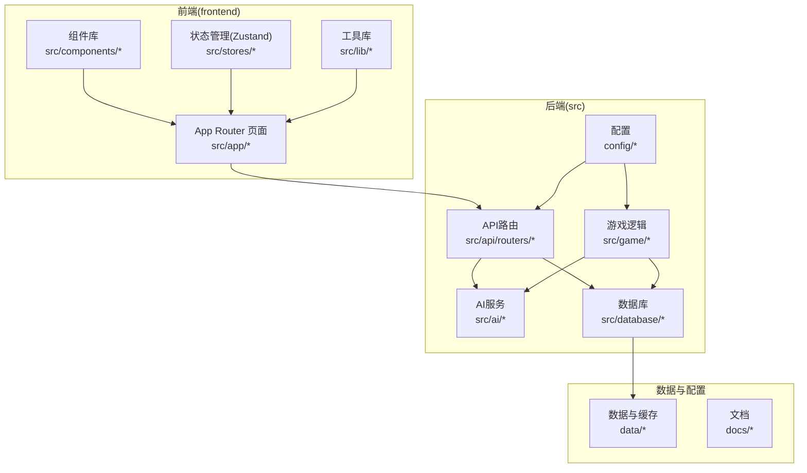
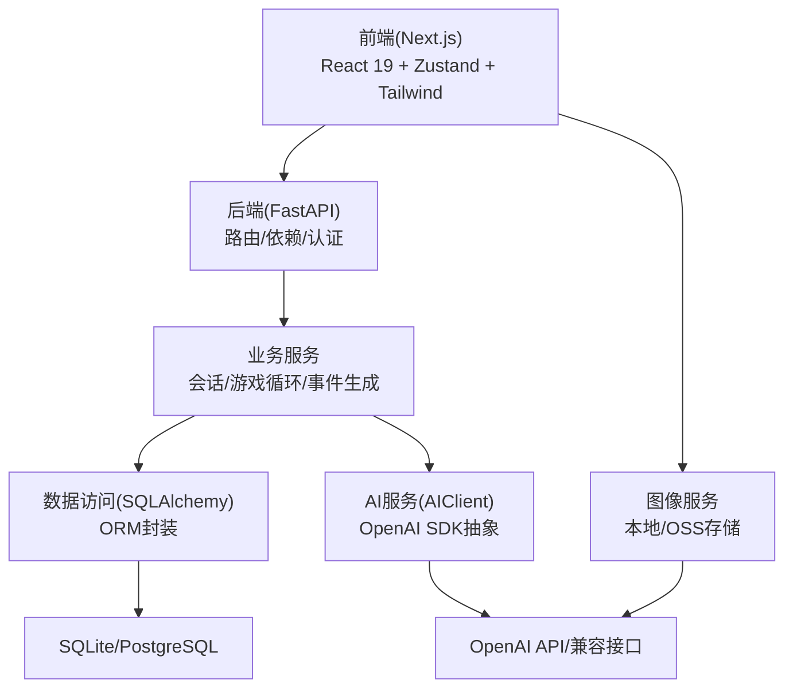
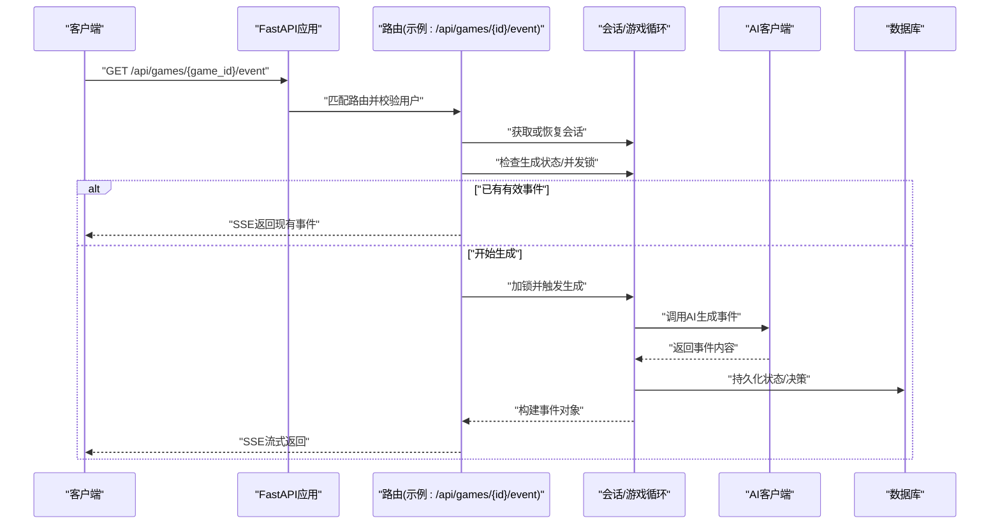
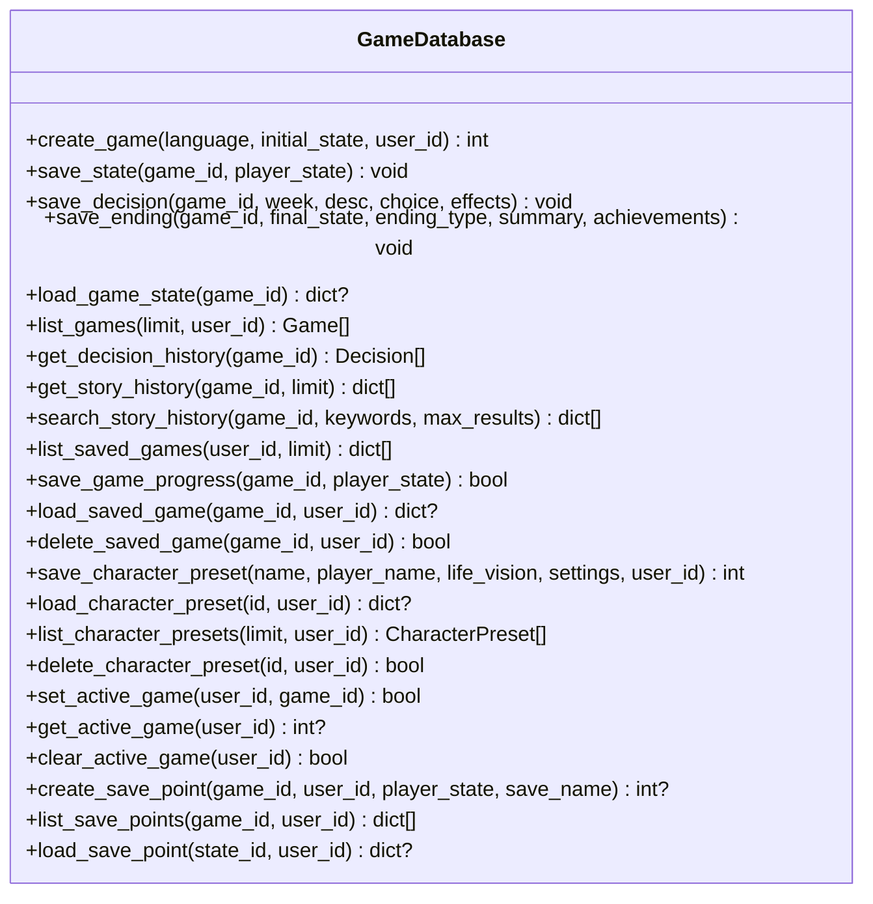
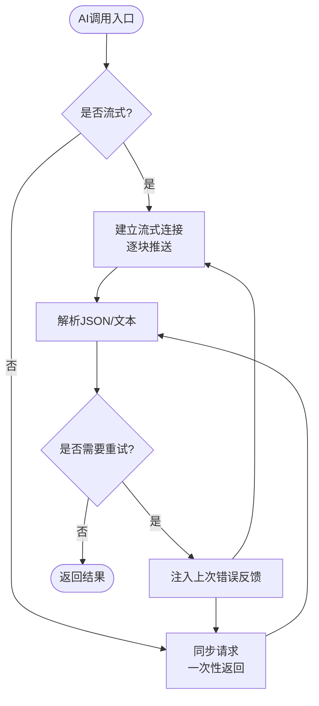
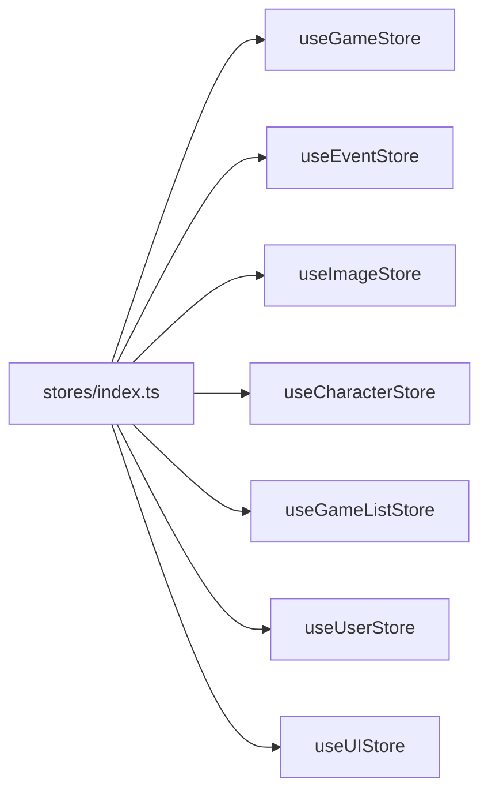
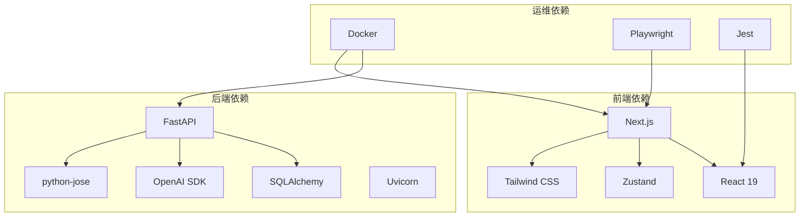

# 技术架构概览

<cite>
**本文档引用的文件**
- [README.md](file://README.md)
- [requirements.txt](file://requirements.txt)
- [package.json](file://frontend/package.json)
- [Dockerfile](file://Dockerfile)
- [docker-compose.yml](file://docker-compose.yml)
- [src/api/main.py](file://src/api/main.py)
- [src/database/db.py](file://src/database/db.py)
- [src/ai/client.py](file://src/ai/client.py)
- [src/api/routers/gameplay/events.py](file://src/api/routers/gameplay/events.py)
- [src/api/deps.py](file://src/api/deps.py)
- [config/settings.py](file://config/settings.py)
- [frontend/src/stores/index.ts](file://frontend/src/stores/index.ts)
- [frontend/jest.config.js](file://frontend/jest.config.js)
- [frontend/playwright.config.ts](file://frontend/playwright.config.ts)
</cite>

## 目录
1. [引言](#引言)
2. [项目结构](#项目结构)
3. [核心组件](#核心组件)
4. [架构总览](#架构总览)
5. [详细组件分析](#详细组件分析)
6. [依赖关系分析](#依赖关系分析)
7. [性能考量](#性能考量)
8. [故障排查指南](#故障排查指南)
9. [结论](#结论)
10. [附录](#附录)

## 引言
本项目“人生草稿本”是一个基于文本的交互式人生模拟游戏，通过AI实时生成个性化事件，结合资源管理与决策机制，为用户提供多结局、可回溯的人生体验。技术架构采用全栈分离设计：后端以FastAPI为核心，配合SQLAlchemy进行数据持久化；前端采用Next.js 16.1.6（React 19），使用Zustand进行状态管理，Tailwind CSS实现样式；数据库默认使用SQLite，同时支持云部署的PostgreSQL；AI服务通过OpenAI SDK统一抽象，提供事件生成与图像生成能力；开发与运维方面采用Docker容器化、Jest与Playwright测试体系。

## 项目结构
项目采用按功能域分层的组织方式，后端src目录下划分为API路由、AI服务、游戏逻辑、数据库模型与服务；前端采用Next.js App Router结构，按页面与组件模块化；配置集中在config目录，数据与缓存位于data目录。

图表来源
- [src/api/main.py](file://src/api/main.py#L79-L89)
- [src/database/db.py](file://src/database/db.py#L13-L18)
- [config/settings.py](file://config/settings.py#L107-L141)

章节来源
- [README.md](file://README.md#L74-L87)

## 核心组件
- 后端框架与API
  - FastAPI应用入口与生命周期管理，注册CORS中间件与全局异常处理，按模块注册路由。
  - 依赖注入与认证：JWT令牌解析优先从Cookie读取，支持Bearer Token与Cookie双通道认证。
- 数据层
  - SQLAlchemy ORM封装GameDatabase类，提供游戏状态、决策、结局、角色预设等CRUD与查询方法，并内置会话恢复与时间回溯存档能力。
- AI服务
  - AIClient统一封装OpenAI SDK调用，支持流式与非流式响应、JSON解析、重试与错误反馈注入，便于替换底层Provider。
- 前端框架与状态管理
  - Next.js 16.1.6 + React 19，使用Zustand替代Redux，提供轻量、易用的状态管理；Tailwind CSS实现快速样式迭代。
- 配置与环境
  - config/settings.py集中管理OpenAI、图像生成、数据库、语言与调试等配置项，支持本地SQLite与云数据库URL切换。
- 开发与运维
  - Dockerfile与docker-compose.yml提供容器化部署与健康检查；Jest与Playwright分别覆盖单元测试与端到端测试。

章节来源
- [src/api/main.py](file://src/api/main.py#L24-L100)
- [src/api/deps.py](file://src/api/deps.py#L28-L150)
- [src/database/db.py](file://src/database/db.py#L13-L384)
- [src/ai/client.py](file://src/ai/client.py#L22-L233)
- [config/settings.py](file://config/settings.py#L27-L168)
- [frontend/package.json](file://frontend/package.json#L16-L47)
- [Dockerfile](file://Dockerfile#L1-L40)
- [docker-compose.yml](file://docker-compose.yml#L1-L65)

## 架构总览
整体架构遵循分层设计：表现层（Next.js前端）、业务逻辑层（FastAPI路由与服务）、数据访问层（SQLAlchemy + SQLite/PostgreSQL）。AI服务作为外部集成，通过统一客户端适配器接入。事件生成采用SSE流式传输，移动端提供同步回退方案；图像生成通过OpenAI兼容接口与本地/对象存储策略实现。

图表来源
- [src/api/main.py](file://src/api/main.py#L35-L100)
- [src/database/db.py](file://src/database/db.py#L13-L18)
- [src/ai/client.py](file://src/ai/client.py#L22-L48)
- [config/settings.py](file://config/settings.py#L35-L69)

## 详细组件分析

### 后端API与路由
- 应用入口与生命周期：初始化数据库、设置日志、注册CORS（支持Cookie认证与局域网访问）、全局异常处理。
- 路由注册：按模块include多个子路由，涵盖认证、好友、游戏、角色、预设、玩法、故事与图像。
- 健康检查与客户端日志收集：提供/health端点与/health/client-log端点，便于监控与移动端调试。

图表来源
- [src/api/main.py](file://src/api/main.py#L79-L100)
- [src/api/routers/gameplay/events.py](file://src/api/routers/gameplay/events.py#L48-L164)
- [src/api/deps.py](file://src/api/deps.py#L90-L150)
- [src/ai/client.py](file://src/ai/client.py#L51-L124)
- [src/database/db.py](file://src/database/db.py#L336-L384)

章节来源
- [src/api/main.py](file://src/api/main.py#L24-L134)
- [src/api/routers/gameplay/events.py](file://src/api/routers/gameplay/events.py#L1-L212)
- [src/api/deps.py](file://src/api/deps.py#L1-L150)

### 数据访问层（SQLAlchemy）
- 封装类GameDatabase提供：
  - 游戏创建、状态保存与加载、决策与结局记录、角色预设管理。
  - 会话恢复与活跃游戏ID维护，支持时间回溯存档点（手动存档）。
  - 历史故事检索与关键词搜索，用于一致性验证与事实核查。
- 数据库URL优先级：DATABASE_URL（云）> 本地SQLite路径，确保开发与生产无缝切换。

图表来源
- [src/database/db.py](file://src/database/db.py#L13-L800)
- [config/settings.py](file://config/settings.py#L107-L141)

章节来源
- [src/database/db.py](file://src/database/db.py#L13-L800)
- [config/settings.py](file://config/settings.py#L107-L141)

### AI服务与图像生成
- AIClient统一抽象OpenAI SDK调用，支持：
  - 流式与非流式两种模式，回调驱动增量渲染。
  - JSON解析与错误反馈注入的重试机制，提升稳定性。
  - 可配置的基础URL与模型参数，便于多Provider迁移。
- 图像生成与场景分析：
  - 支持图像生成API（OpenAI兼容）、场景分析服务（可复用OpenAI配置或独立配置）。
  - 图片存储类型可选本地或OSS，提供超时与重试策略。

图表来源
- [src/ai/client.py](file://src/ai/client.py#L51-L233)
- [config/settings.py](file://config/settings.py#L35-L69)

章节来源
- [src/ai/client.py](file://src/ai/client.py#L22-L233)
- [config/settings.py](file://config/settings.py#L35-L69)

### 前端状态管理（Zustand）
- stores/index.ts提供主store与子store的统一导出，便于向后兼容与细粒度使用。
- 与Next.js App Router结合，按页面拆分状态，减少不必要的重渲染。
- 相比Redux，Zustand以更少样板代码实现相同功能，降低心智负担。

图表来源
- [frontend/src/stores/index.ts](file://frontend/src/stores/index.ts#L1-L27)

章节来源
- [frontend/src/stores/index.ts](file://frontend/src/stores/index.ts#L1-L27)

### 测试与质量保障
- 单元测试：Jest配置启用TypeScript转换、JSOMD环境、覆盖率阈值与缓存目录，排除类型声明与工具类型文件。
- 端到端测试：Playwright配置支持Chrome与移动Safari，自动启动本地开发服务器，收集失败截图与Trace。
- 建议在CI中启用重试与串行执行，确保跨平台稳定性。

章节来源
- [frontend/jest.config.js](file://frontend/jest.config.js#L1-L38)
- [frontend/playwright.config.ts](file://frontend/playwright.config.ts#L1-L58)

## 依赖关系分析
- 后端依赖
  - FastAPI、SQLAlchemy、Pydantic、OpenAI SDK、Uvicorn、python-jose等，满足高性能API、强类型校验、数据库ORM与JWT认证需求。
- 前端依赖
  - Next.js 16.1.6、React 19、Zustand、Tailwind CSS及相关UI与测试工具，支撑现代Web开发体验。
- 运维依赖
  - Dockerfile定义Python 3.9基础镜像、健康检查与端口暴露；docker-compose提供可选PostgreSQL服务与资源限制。

图表来源
- [requirements.txt](file://requirements.txt#L1-L12)
- [frontend/package.json](file://frontend/package.json#L16-L47)
- [Dockerfile](file://Dockerfile#L1-L40)
- [docker-compose.yml](file://docker-compose.yml#L1-L65)

章节来源
- [requirements.txt](file://requirements.txt#L1-L12)
- [frontend/package.json](file://frontend/package.json#L16-L47)
- [Dockerfile](file://Dockerfile#L1-L40)
- [docker-compose.yml](file://docker-compose.yml#L1-L65)

## 性能考量
- API性能
  - FastAPI异步与自动OpenAPI文档生成，结合限流与并发控制（事件生成使用asyncio锁），避免重复计算与竞态条件。
- 数据访问
  - ORM层封装查询与事务，建议在高频查询上增加索引与分页；对历史故事检索与关键词搜索进行分页与上限控制。
- AI调用
  - 流式响应降低首字节延迟；合理设置max_tokens与温度参数；对重试与错误反馈注入进行限频与退避。
- 前端性能
  - Zustand细粒度状态拆分，避免全局重渲染；Tailwind按需引入与Tree Shaking；组件懒加载与Suspense配合。
- 容器化
  - Dockerfile设置健康检查与资源限制；生产环境建议使用云数据库URL与持久化卷。

## 故障排查指南
- CORS与认证
  - 若出现跨域或Cookie认证失败，检查CORS_ORIGINS环境变量与allow_credentials设置；确认Cookie与Authorization头的优先级逻辑。
- 事件生成阻塞
  - 观察并发锁与生成标志位，必要时清理卡住的生成状态；移动端使用同步回退接口。
- 数据库连接
  - 本地SQLite与云数据库URL切换时，确认DATABASE_URL优先级与路径权限；检查数据目录可写性。
- AI调用失败
  - 检查OPENAI_API_KEY与模型配置；开启重试与错误反馈注入；关注长度截断警告。
- 前端测试
  - Jest与Playwright失败时，检查缓存目录权限、TS配置与浏览器设备映射；在CI中启用重试与Trace收集。

章节来源
- [src/api/main.py](file://src/api/main.py#L46-L66)
- [src/api/routers/gameplay/events.py](file://src/api/routers/gameplay/events.py#L30-L164)
- [config/settings.py](file://config/settings.py#L107-L141)
- [src/ai/client.py](file://src/ai/client.py#L159-L233)
- [frontend/jest.config.js](file://frontend/jest.config.js#L8-L35)
- [frontend/playwright.config.ts](file://frontend/playwright.config.ts#L50-L57)

## 结论
本项目通过FastAPI + SQLAlchemy + Next.js + Zustand的组合，实现了高性能、可扩展且易于维护的全栈架构。AI服务与图像生成通过统一抽象适配器实现解耦，数据库支持本地SQLite与云数据库无缝切换。完善的测试与容器化体系为持续交付提供保障。建议在生产环境中进一步完善监控告警、数据库索引优化与AI调用限流策略。

## 附录
- 版本兼容性与升级路径
  - Python 3.9（Dockerfile固定基础镜像），建议在升级时同步检查依赖版本范围与语法兼容性。
  - FastAPI 0.115+、SQLAlchemy 2.0+、OpenAI SDK 2.0+，建议遵循语义化版本升级并进行回归测试。
  - Next.js 16.1.6、React 19、Zustand 5.x，注意React 19的实验特性与Zustand API变更。
  - Docker与Compose版本遵循官方推荐，生产环境建议锁定镜像标签与依赖版本。

章节来源
- [Dockerfile](file://Dockerfile#L1-L40)
- [requirements.txt](file://requirements.txt#L1-L12)
- [frontend/package.json](file://frontend/package.json#L16-L47)
- [README.md](file://README.md#L13-L64)