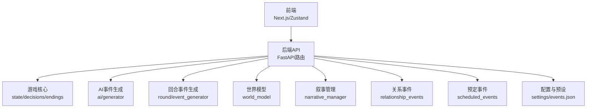
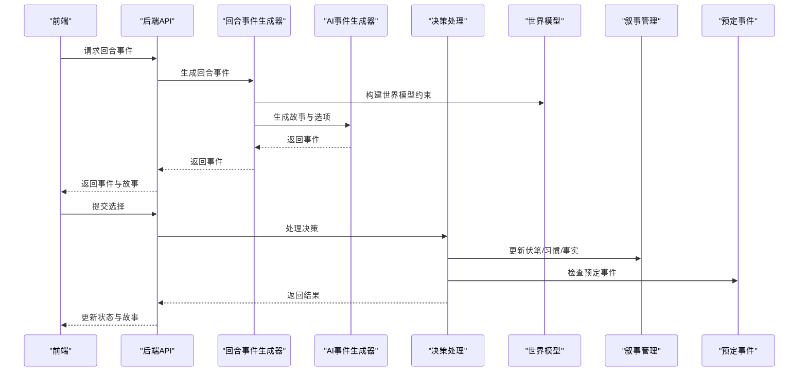
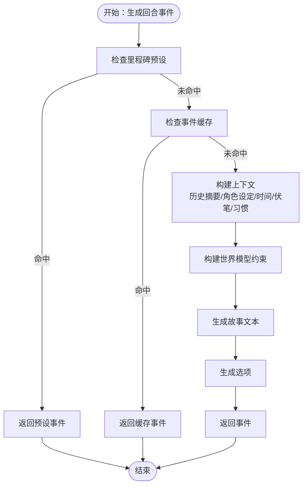
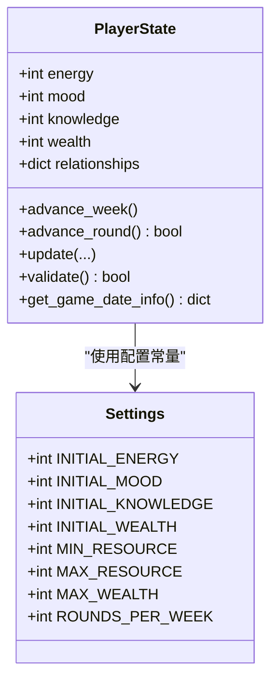
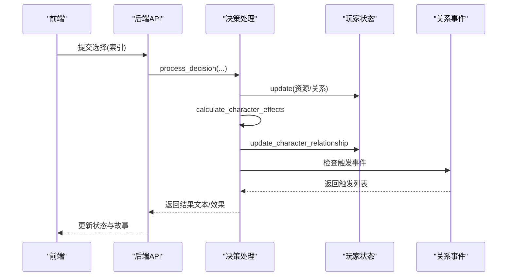
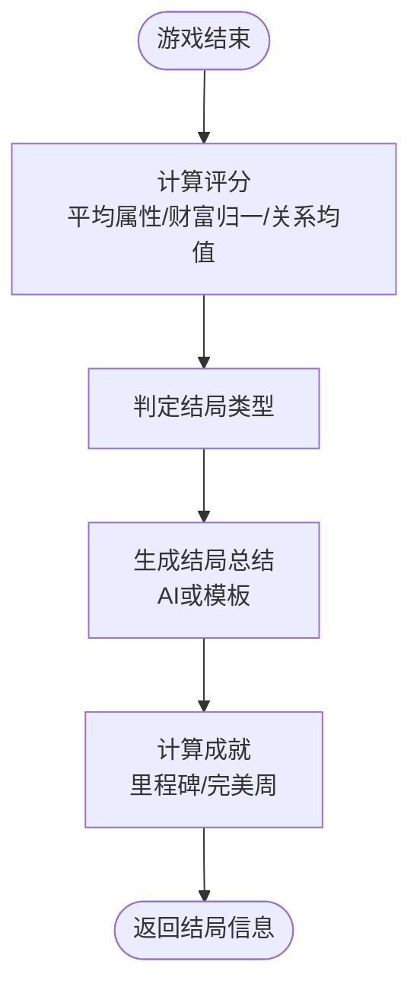
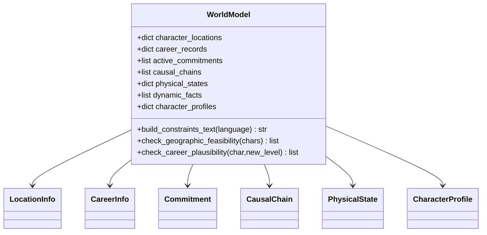
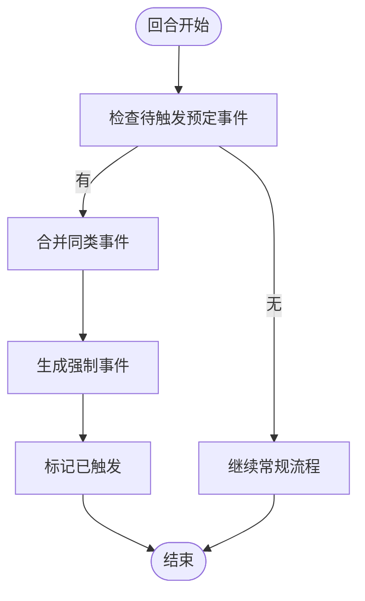
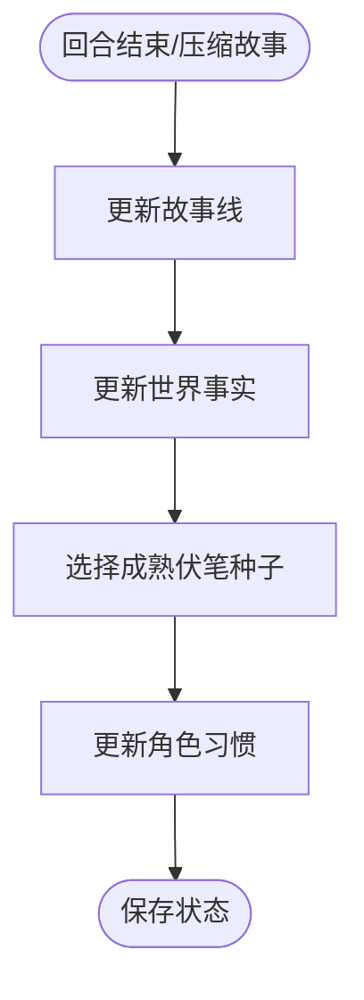
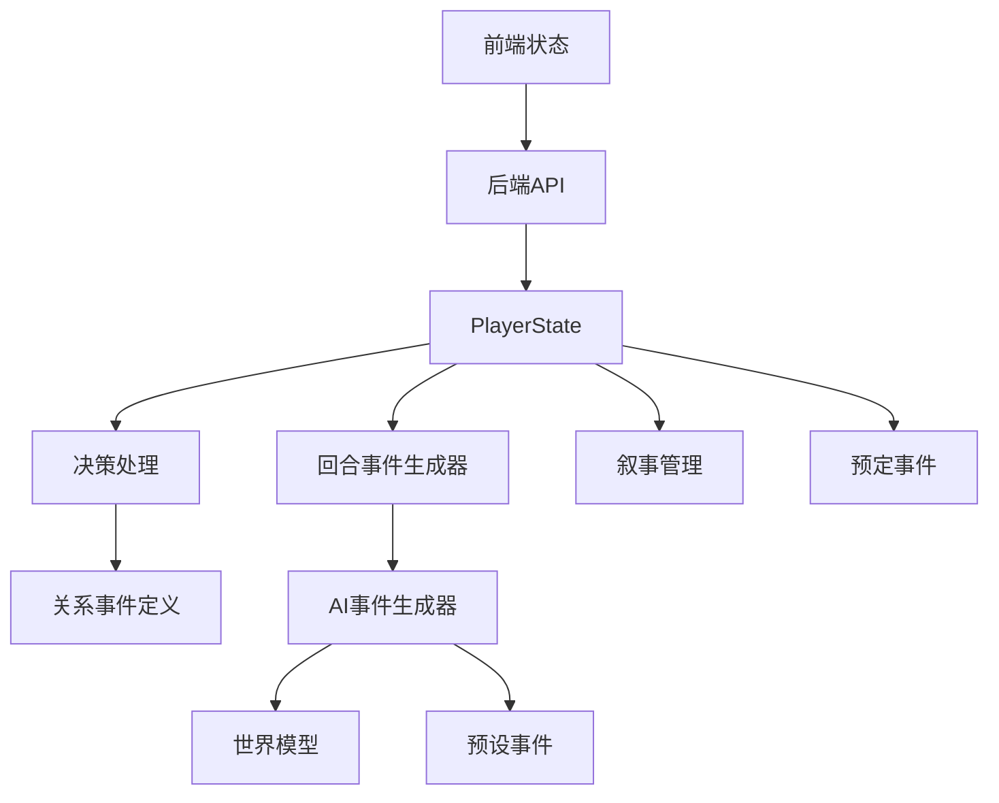

# 核心功能特性

<cite>
**本文引用的文件**
- [src/game/state/player_state.py](file://src/game/state/player_state.py)
- [src/game/decisions.py](file://src/game/decisions.py)
- [src/game/endings.py](file://src/game/endings.py)
- [src/game/world_model.py](file://src/game/world_model.py)
- [src/ai/generator.py](file://src/ai/generator.py)
- [src/game/round/event_generator.py](file://src/game/round/event_generator.py)
- [src/game/narrative_manager.py](file://src/game/narrative_manager.py)
- [src/game/scheduled_events.py](file://src/game/scheduled_events.py)
- [src/game/relationship_events.py](file://src/game/relationship_events.py)
- [config/settings.py](file://config/settings.py)
- [data/presets/events.json](file://data/presets/events.json)
- [frontend/src/stores/useGameStore.ts](file://frontend/src/stores/useGameStore.ts)
</cite>

## 目录
1. [简介](#简介)
2. [项目结构](#项目结构)
3. [核心组件](#核心组件)
4. [架构总览](#架构总览)
5. [详细组件分析](#详细组件分析)
6. [依赖分析](#依赖分析)
7. [性能考量](#性能考量)
8. [故障排查指南](#故障排查指南)
9. [结论](#结论)
10. [附录](#附录)

## 简介
本文件面向“人生草稿本”项目的开发者与技术读者，系统梳理并阐释四大核心功能模块：AI生成事件系统、资源管理系统、决策影响机制、多结局体验。文档从架构设计、数据流、处理逻辑、集成点与错误处理等方面进行深入分析，并辅以可视化图示与代码路径定位，帮助快速理解与落地实现。

## 项目结构
项目采用前后端分离与模块化组织：
- 后端（Python）：游戏状态、AI事件生成、世界模型、关系事件、回合事件生成、结局评估等核心逻辑位于 src/ 目录。
- 前端（Next.js + Zustand）：游戏会话状态、事件与故事状态、图片生成与展示等位于 frontend/src/ 目录。
- 配置与预设：config/settings.py 提供全局配置；data/presets/events.json 提供里程碑与特殊事件预设。

图表来源
- [frontend/src/stores/useGameStore.ts](file://frontend/src/stores/useGameStore.ts#L161-L504)
- [src/ai/generator.py](file://src/ai/generator.py#L30-L120)
- [src/game/round/event_generator.py](file://src/game/round/event_generator.py#L16-L75)
- [src/game/world_model.py](file://src/game/world_model.py#L196-L212)
- [src/game/narrative_manager.py](file://src/game/narrative_manager.py#L15-L20)
- [src/game/relationship_events.py](file://src/game/relationship_events.py#L18-L50)
- [src/game/scheduled_events.py](file://src/game/scheduled_events.py#L19-L40)
- [config/settings.py](file://config/settings.py#L27-L106)
- [data/presets/events.json](file://data/presets/events.json#L1-L239)

章节来源
- [config/settings.py](file://config/settings.py#L27-L106)
- [data/presets/events.json](file://data/presets/events.json#L1-L239)
- [frontend/src/stores/useGameStore.ts](file://frontend/src/stores/useGameStore.ts#L161-L504)

## 核心组件
- 玩家状态与资源系统：统一管理能量、情绪、知识、财富四维资源，以及关系、角色、时间、历史摘要、伏笔与习惯等。
- 决策处理：解析选项效果，更新玩家与角色状态，触发特殊关系事件。
- AI事件生成：两阶段流水线（故事生成+选项生成），支持缓存、预设里程碑事件与流式输出。
- 世界模型：结构化约束（地理、职业、承诺、因果链、身体状态、动态事实、角色画像）保障故事一致性。
- 预定事件系统：基于具体轮次的承诺强制触发，支持合并与优先级。
- 多结局系统：基于最终状态评分，生成结局类型、总结与成就。

章节来源
- [src/game/state/player_state.py](file://src/game/state/player_state.py#L15-L122)
- [src/game/decisions.py](file://src/game/decisions.py#L135-L240)
- [src/ai/generator.py](file://src/ai/generator.py#L211-L268)
- [src/game/world_model.py](file://src/game/world_model.py#L196-L212)
- [src/game/scheduled_events.py](file://src/game/scheduled_events.py#L19-L93)
- [src/game/endings.py](file://src/game/endings.py#L47-L95)

## 架构总览
整体流程：前端发起回合事件请求，后端通过回合事件生成器构建上下文，结合AI事件生成器产出故事与选项；随后决策处理器更新状态并触发关系事件与世界模型约束；叙事管理维护伏笔与习惯；预定事件在指定轮次强制触发；游戏结束时由结局评估生成总结与成就。

图表来源
- [src/game/round/event_generator.py](file://src/game/round/event_generator.py#L75-L260)
- [src/ai/generator.py](file://src/ai/generator.py#L270-L314)
- [src/game/decisions.py](file://src/game/decisions.py#L135-L240)
- [src/game/world_model.py](file://src/game/world_model.py#L214-L300)
- [src/game/narrative_manager.py](file://src/game/narrative_manager.py#L187-L285)
- [src/game/scheduled_events.py](file://src/game/scheduled_events.py#L313-L328)

## 详细组件分析

### AI生成事件系统
- 设计要点
  - 两阶段流水线：故事生成（Step 1）+ 选项生成（Step 2），支持压缩、重写与全量再生。
  - 缓存与预设：事件缓存与里程碑事件预设，减少重复生成成本。
  - 流式输出：支持流式回调，前端可渐进渲染。
  - 上下文注入：整合历史摘要、角色设定、时间信息、伏笔种子、角色习惯、世界模型约束等。
- 关键流程
  - 里程碑事件优先：按周检查预设事件，命中则直接返回。
  - 缓存命中：若缓存存在且未强制刷新，直接返回缓存。
  - 世界模型约束：构建地理、职业、承诺、因果链、身体状态、动态事实与角色画像约束文本注入提示词。
  - 选项生成：基于事件描述与上下文生成选项，确保权衡与一致性。
- 代码路径
  - 事件生成入口：[src/ai/generator.py](file://src/ai/generator.py#L211-L268)
  - 回合事件生成：[src/game/round/event_generator.py](file://src/game/round/event_generator.py#L75-L260)
  - 世界模型构建与约束：[src/game/world_model.py](file://src/game/world_model.py#L214-L447)
  - 预设里程碑事件：[data/presets/events.json](file://data/presets/events.json#L1-L131)

图表来源
- [src/ai/generator.py](file://src/ai/generator.py#L211-L268)
- [src/game/round/event_generator.py](file://src/game/round/event_generator.py#L141-L221)
- [src/game/world_model.py](file://src/game/world_model.py#L214-L447)
- [data/presets/events.json](file://data/presets/events.json#L1-L131)

章节来源
- [src/ai/generator.py](file://src/ai/generator.py#L211-L268)
- [src/game/round/event_generator.py](file://src/game/round/event_generator.py#L75-L260)
- [src/game/world_model.py](file://src/game/world_model.py#L214-L447)
- [data/presets/events.json](file://data/presets/events.json#L1-L131)

### 资源管理系统
- 资源维度
  - 能量、情绪、知识：0-100范围，边界裁剪。
  - 财富：非负整数，上限策略在配置中定义。
  - 关系：以角色名为键的亲密度映射，与角色状态同步。
- 更新与验证
  - update方法批量更新资源，边界裁剪，支持关系增量。
  - validate方法在每次变更后校验，防止越界。
- 时间与阶段
  - 周推进与年龄演算，按周数计算年份、月份、季度。
  - 多轮系统：每周固定轮次，轮次推进与周推进联动。
- 代码路径
  - 状态定义与更新：[src/game/state/player_state.py](file://src/game/state/player_state.py#L15-L122)
  - 边界与验证：[src/game/state/player_state.py](file://src/game/state/player_state.py#L159-L196)
  - 周推进与年龄：[src/game/state/player_state.py](file://src/game/state/player_state.py#L197-L206)
  - 多轮推进与周结束判定：[src/game/state/player_state.py](file://src/game/state/player_state.py#L207-L229)
  - 时间信息构建：[src/game/state/player_state.py](file://src/game/state/player_state.py#L239-L273)
  - 配置常量：[config/settings.py](file://config/settings.py#L75-L106)

图表来源
- [src/game/state/player_state.py](file://src/game/state/player_state.py#L15-L122)
- [config/settings.py](file://config/settings.py#L75-L106)

章节来源
- [src/game/state/player_state.py](file://src/game/state/player_state.py#L15-L122)
- [config/settings.py](file://config/settings.py#L75-L106)

### 决策影响机制
- 效果解析与应用
  - 从选项effects中解析资源变化与关系变化。
  - 计算角色属性变化（亲密度、信任、尊重、情绪），并触发角色特殊事件。
- 决策记录与回放
  - 记录事件描述、选择文本、效果与角色影响，便于回溯与总结。
- 代码路径
  - 决策处理入口：[src/game/decisions.py](file://src/game/decisions.py#L135-L240)
  - 角色效果计算与应用：[src/game/decisions.py](file://src/game/decisions.py#L14-L108)
  - 关系事件触发：[src/game/relationship_events.py](file://src/game/relationship_events.py#L95-L338)

图表来源
- [src/game/decisions.py](file://src/game/decisions.py#L135-L240)
- [src/game/relationship_events.py](file://src/game/relationship_events.py#L95-L338)

章节来源
- [src/game/decisions.py](file://src/game/decisions.py#L135-L240)
- [src/game/relationship_events.py](file://src/game/relationship_events.py#L95-L338)

### 多结局体验
- 结局类型与评分
  - 基于平均属性、财富归一化、关系均值综合评分，判定平衡、财富自由、学者、社交达人、艰难前行五类结局。
- 总结与成就
  - 通过AI生成或模板生成结局总结；统计成就（财富里程碑、知识里程碑、关系里程碑、决策里程碑、完美周等）。
- 代码路径
  - 结局评估器：[src/game/endings.py](file://src/game/endings.py#L47-L95)
  - 类型判定：[src/game/endings.py](file://src/game/endings.py#L97-L122)
  - 总结生成：[src/game/endings.py](file://src/game/endings.py#L124-L224)
  - 成就计算：[src/game/endings.py](file://src/game/endings.py#L251-L286)

图表来源
- [src/game/endings.py](file://src/game/endings.py#L47-L95)
- [src/game/endings.py](file://src/game/endings.py#L97-L122)
- [src/game/endings.py](file://src/game/endings.py#L124-L224)
- [src/game/endings.py](file://src/game/endings.py#L251-L286)

章节来源
- [src/game/endings.py](file://src/game/endings.py#L47-L95)
- [src/game/endings.py](file://src/game/endings.py#L97-L122)
- [src/game/endings.py](file://src/game/endings.py#L124-L224)
- [src/game/endings.py](file://src/game/endings.py#L251-L286)

### 世界模型与一致性约束
- 数据结构
  - 地点、职业、承诺、因果链、身体状态、动态事实、角色画像等结构化数据。
- 约束生成
  - 构建地理可行性、职业合理性、承诺到期、因果链、身体状态、动态事实与角色画像约束文本，注入AI提示词。
- 代码路径
  - 数据结构与工厂：[src/game/world_model.py](file://src/game/world_model.py#L196-L300)
  - 约束文本生成：[src/game/world_model.py](file://src/game/world_model.py#L394-L447)
  - 验证方法：[src/game/world_model.py](file://src/game/world_model.py#L302-L361)

图表来源
- [src/game/world_model.py](file://src/game/world_model.py#L196-L300)
- [src/game/world_model.py](file://src/game/world_model.py#L394-L447)

章节来源
- [src/game/world_model.py](file://src/game/world_model.py#L196-L300)
- [src/game/world_model.py](file://src/game/world_model.py#L394-L447)

### 预定事件系统
- 功能概述
  - 承诺在具体轮次强制触发，支持重要度排序、合并与过期处理。
  - 解析时间表述（如“下周三”、“明天”）为周数与轮次。
- 代码路径
  - 预定事件数据结构与工具：[src/game/scheduled_events.py](file://src/game/scheduled_events.py#L19-L93)
  - 时间解析：[src/game/scheduled_events.py](file://src/game/scheduled_events.py#L174-L277)
  - 管理器：[src/game/scheduled_events.py](file://src/game/scheduled_events.py#L280-L426)
  - 回合事件生成中的触发：[src/game/round/event_generator.py](file://src/game/round/event_generator.py#L124-L139)

图表来源
- [src/game/scheduled_events.py](file://src/game/scheduled_events.py#L313-L328)
- [src/game/round/event_generator.py](file://src/game/round/event_generator.py#L124-L139)

章节来源
- [src/game/scheduled_events.py](file://src/game/scheduled_events.py#L19-L93)
- [src/game/scheduled_events.py](file://src/game/scheduled_events.py#L174-L277)
- [src/game/scheduled_events.py](file://src/game/scheduled_events.py#L280-L426)
- [src/game/round/event_generator.py](file://src/game/round/event_generator.py#L124-L139)

### 叙事管理与伏笔系统
- 功能概述
  - 故事线增删改、事实更新、伏笔种子成熟概率选择与回收、角色习惯强化/弱化/改变。
- 代码路径
  - 故事线与事实更新：[src/game/narrative_manager.py](file://src/game/narrative_manager.py#L22-L182)
  - 伏笔种子选择与处理：[src/game/narrative_manager.py](file://src/game/narrative_manager.py#L187-L414)
  - 角色习惯更新：[src/game/narrative_manager.py](file://src/game/narrative_manager.py#L420-L584)

图表来源
- [src/game/narrative_manager.py](file://src/game/narrative_manager.py#L22-L182)
- [src/game/narrative_manager.py](file://src/game/narrative_manager.py#L187-L414)
- [src/game/narrative_manager.py](file://src/game/narrative_manager.py#L420-L584)

章节来源
- [src/game/narrative_manager.py](file://src/game/narrative_manager.py#L22-L182)
- [src/game/narrative_manager.py](file://src/game/narrative_manager.py#L187-L414)
- [src/game/narrative_manager.py](file://src/game/narrative_manager.py#L420-L584)

## 依赖分析
- 组件耦合
  - PlayerState作为核心载体，被决策、回合事件生成、世界模型、叙事管理广泛依赖。
  - AI事件生成器通过facade模式解耦具体子服务（故事生成、选项生成、压缩、重写）。
  - 预定事件与回合事件生成器通过PlayerState查询当前周/轮次与待触发事件。
- 外部依赖
  - 配置中心：config/settings.py提供API密钥、模型、缓存开关、游戏常量等。
  - 预设事件：data/presets/events.json提供里程碑与特殊事件模板。
  - 前端状态：frontend/src/stores/useGameStore.ts负责会话、事件、图片等状态管理。

图表来源
- [src/game/state/player_state.py](file://src/game/state/player_state.py#L15-L122)
- [src/game/decisions.py](file://src/game/decisions.py#L135-L240)
- [src/game/round/event_generator.py](file://src/game/round/event_generator.py#L75-L260)
- [src/game/narrative_manager.py](file://src/game/narrative_manager.py#L15-L20)
- [src/game/scheduled_events.py](file://src/game/scheduled_events.py#L19-L93)
- [src/ai/generator.py](file://src/ai/generator.py#L30-L120)
- [src/game/world_model.py](file://src/game/world_model.py#L196-L212)
- [data/presets/events.json](file://data/presets/events.json#L1-L239)
- [frontend/src/stores/useGameStore.ts](file://frontend/src/stores/useGameStore.ts#L161-L504)

章节来源
- [src/game/state/player_state.py](file://src/game/state/player_state.py#L15-L122)
- [src/game/decisions.py](file://src/game/decisions.py#L135-L240)
- [src/game/round/event_generator.py](file://src/game/round/event_generator.py#L75-L260)
- [src/game/narrative_manager.py](file://src/game/narrative_manager.py#L15-L20)
- [src/game/scheduled_events.py](file://src/game/scheduled_events.py#L19-L93)
- [src/ai/generator.py](file://src/ai/generator.py#L30-L120)
- [src/game/world_model.py](file://src/game/world_model.py#L196-L212)
- [data/presets/events.json](file://data/presets/events.json#L1-L239)
- [frontend/src/stores/useGameStore.ts](file://frontend/src/stores/useGameStore.ts#L161-L504)

## 性能考量
- 事件缓存：启用缓存可显著降低重复生成成本，建议在稳定场景开启。
- Token控制：世界模型约束文本与历史摘要长度需限制，避免超限。
- 并发与超时：回合事件生成器内置并发标志与超时重置，避免重复生成。
- 前端状态同步：前端store使用浅比较字段，减少不必要的重渲染。
- 配置优化：合理设置生成超时、轮次与里程碑周，平衡体验与成本。

## 故障排查指南
- 事件生成失败
  - 检查AI客户端配置与密钥；查看回退事件生成逻辑。
  - 参考：[src/game/round/event_generator.py](file://src/game/round/event_generator.py#L262-L288)
- 状态越界
  - validate抛错时检查update参数与边界裁剪逻辑。
  - 参考：[src/game/state/player_state.py](file://src/game/state/player_state.py#L159-L196)
- 世界模型约束冲突
  - 检查地理、职业、承诺、因果链与身体状态的合理性。
  - 参考：[src/game/world_model.py](file://src/game/world_model.py#L302-L361)
- 预定事件未触发
  - 检查时间解析与轮次匹配，确认事件状态为pending。
  - 参考：[src/game/scheduled_events.py](file://src/game/scheduled_events.py#L313-L328)
- 前端状态未更新
  - 检查useGameStore的同步逻辑与浅比较字段。
  - 参考：[frontend/src/stores/useGameStore.ts](file://frontend/src/stores/useGameStore.ts#L346-L475)

章节来源
- [src/game/round/event_generator.py](file://src/game/round/event_generator.py#L262-L288)
- [src/game/state/player_state.py](file://src/game/state/player_state.py#L159-L196)
- [src/game/world_model.py](file://src/game/world_model.py#L302-L361)
- [src/game/scheduled_events.py](file://src/game/scheduled_events.py#L313-L328)
- [frontend/src/stores/useGameStore.ts](file://frontend/src/stores/useGameStore.ts#L346-L475)

## 结论
本项目通过清晰的模块划分与强一致性的世界模型，实现了可扩展的AI驱动叙事体验。资源系统、决策机制、预定事件与多结局系统协同工作，既保证了玩家选择的深远影响，又提供了丰富的个性化与多样性。建议在生产环境中重点关注缓存策略、Token控制与前端状态同步，以获得更稳定的用户体验。

## 附录
- 关键配置项
  - 资源初始值与边界：[config/settings.py](file://config/settings.py#L85-L94)
  - 轮次与里程碑：[config/settings.py](file://config/settings.py#L100-L102)
  - 生成超时与缓存开关：[config/settings.py](file://config/settings.py#L104-L72)
- 预设事件
  - 里程碑与特殊事件：[data/presets/events.json](file://data/presets/events.json#L1-L239)