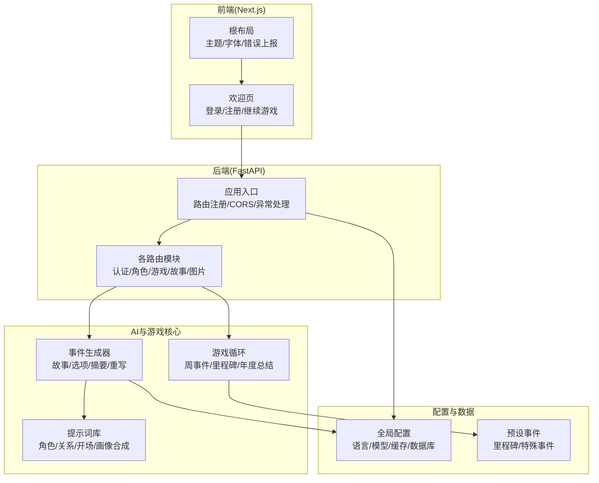
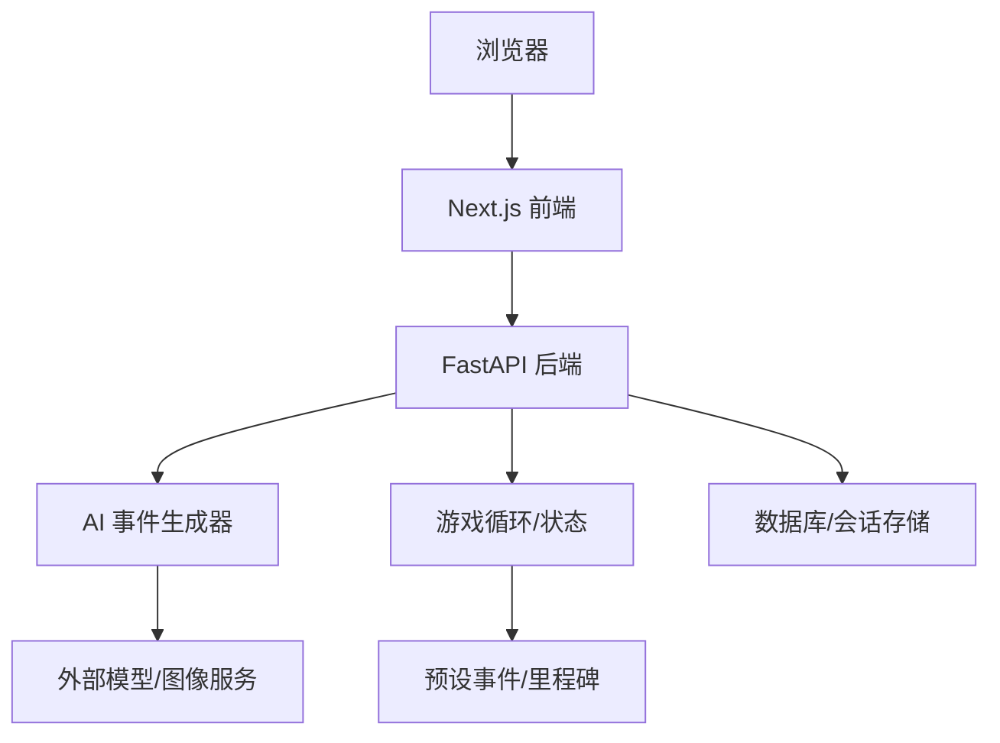
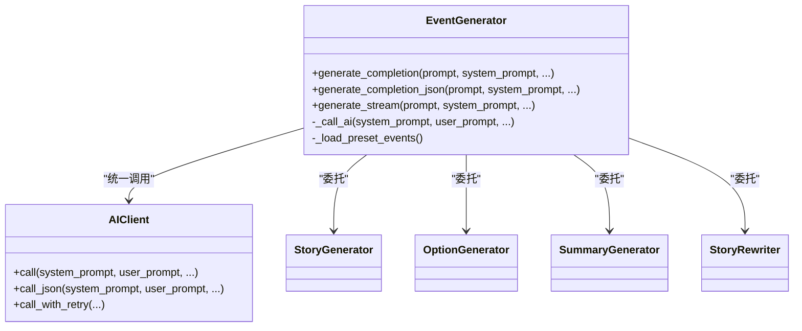
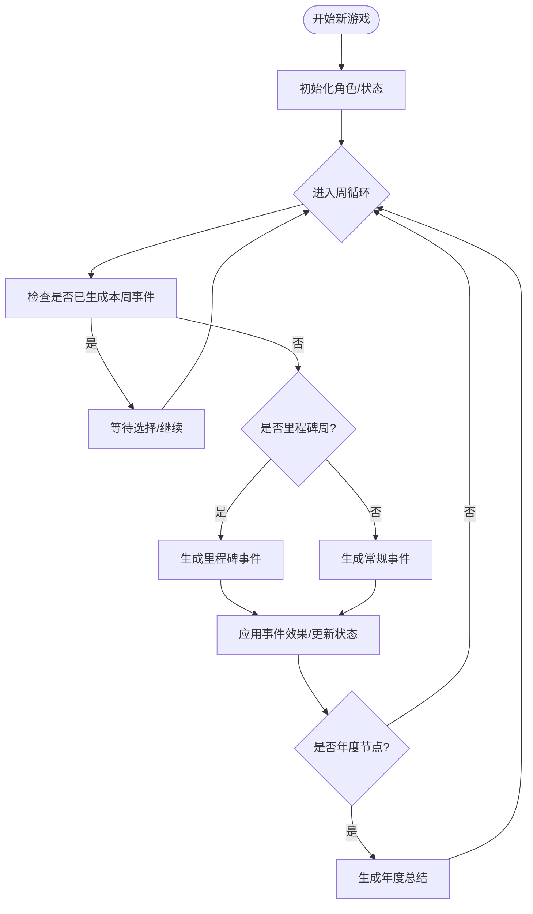
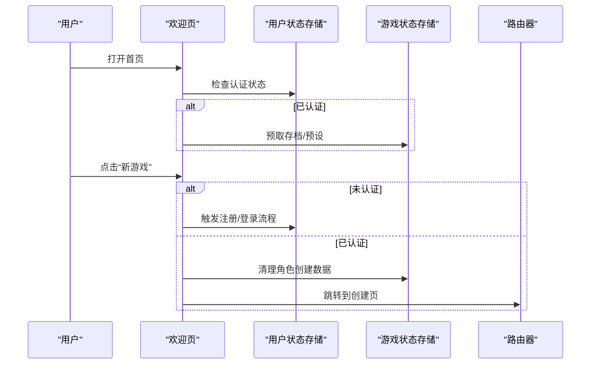
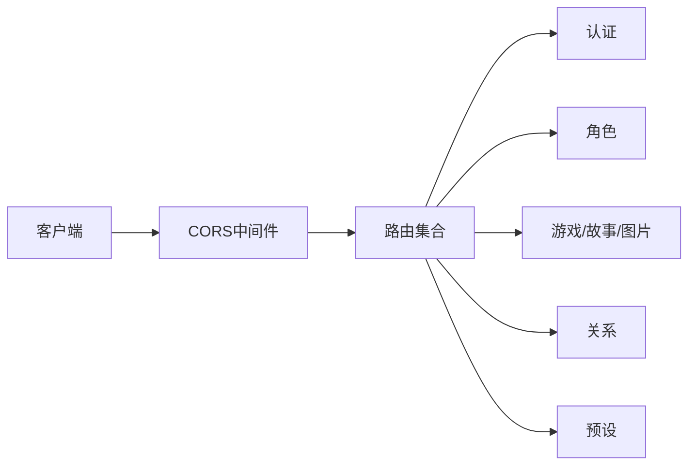
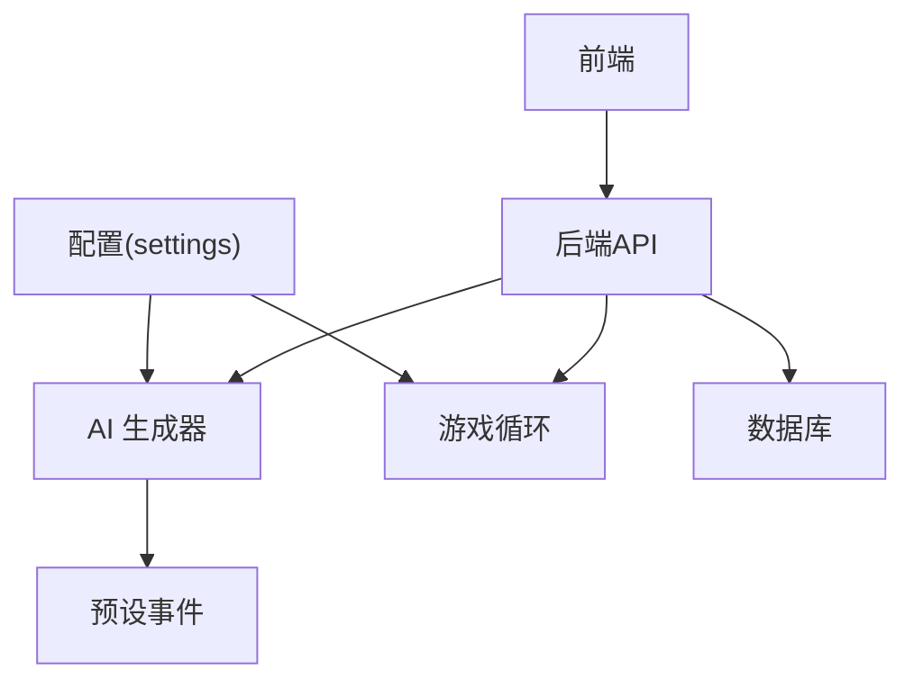

# 项目介绍与愿景

<cite>
**本文引用的文件**
- [README.md](file://README.md)
- [frontend/README.md](file://frontend/README.md)
- [src/__init__.py](file://src/__init__.py)
- [config/settings.py](file://config/settings.py)
- [src/api/main.py](file://src/api/main.py)
- [frontend/src/app/layout.tsx](file://frontend/src/app/layout.tsx)
- [frontend/src/app/page.tsx](file://frontend/src/app/page.tsx)
- [src/ai/__init__.py](file://src/ai/__init__.py)
- [src/game/__init__.py](file://src/game/__init__.py)
- [src/game/game_loop.py](file://src/game/game_loop.py)
- [src/ai/generator.py](file://src/ai/generator.py)
- [data/presets/events.json](file://data/presets/events.json)
- [config/prompts/character_prompts.py](file://config/prompts/character_prompts.py)
- [阿里云部署指南.md](file://阿里云部署指南.md)
</cite>

## 目录
1. [引言](#引言)
2. [项目结构](#项目结构)
3. [核心组件](#核心组件)
4. [架构总览](#架构总览)
5. [详细组件分析](#详细组件分析)
6. [依赖关系分析](#依赖关系分析)
7. [性能考量](#性能考量)
8. [故障排除指南](#故障排除指南)
9. [结论](#结论)
10. [附录](#附录)

## 引言
“人生草稿本”是一个以AI为核心驱动力的生活模拟游戏，旨在通过个性化事件生成、资源管理与多结局叙事，为用户提供沉浸式的人生体验与决策训练。项目从最初的命令行原型起步，逐步发展为具备完整后端API、数据库与现代化前端的全功能Web应用。其愿景是借助AI技术，帮助不同背景的用户在虚拟人生中探索无限可能，同时提升对自我选择与后果的认知。

项目的核心价值在于：
- 个性化AI事件生成：每周动态生成符合玩家设定与情境的事件，保证每次游玩的独特性。
- 资源与关系管理系统：围绕精力、情绪、知识、财富等维度进行平衡管理，增强策略深度。
- 多结局与可重玩性：里程碑事件与随机事件共同塑造不同的人生轨迹，鼓励多次体验。
- 教育与启发：通过模拟真实世界的复杂性，帮助用户思考价值观、目标与选择的代价。

## 项目结构
项目采用前后端分离架构，后端基于FastAPI提供REST与流式接口，前端使用Next.js构建交互式界面；AI模块负责事件与故事生成，游戏核心逻辑管理生命周期与状态。

图表来源
- [frontend/src/app/page.tsx](file://frontend/src/app/page.tsx#L31-L174)
- [frontend/src/app/layout.tsx](file://frontend/src/app/layout.tsx#L32-L47)
- [src/api/main.py](file://src/api/main.py#L80-L89)
- [src/ai/generator.py](file://src/ai/generator.py#L30-L66)
- [src/game/game_loop.py](file://src/game/game_loop.py#L25-L68)
- [config/settings.py](file://config/settings.py#L27-L167)
- [data/presets/events.json](file://data/presets/events.json#L1-L239)
- [config/prompts/character_prompts.py](file://config/prompts/character_prompts.py#L18-L127)

章节来源
- [README.md](file://README.md#L74-L87)
- [frontend/README.md](file://frontend/README.md#L1-L37)
- [src/__init__.py](file://src/__init__.py#L1-L2)

## 核心组件
- 全局配置与常量：集中管理语言、模型、缓存、数据库与游戏常量，确保一致性与可维护性。
- AI事件生成器：以统一客户端抽象为基础，提供故事生成、选项生成、摘要与重写等能力，并支持缓存与预设事件。
- 游戏循环：负责周事件生成、里程碑事件、年度总结与角色关系的演进，支撑多回合与多结局体验。
- 前后端路由：后端提供认证、角色、游戏、故事与图片等接口；前端通过页面与组件完成交互与状态管理。
- 提示词体系：涵盖角色画像合成、关系人物生成、初始属性与开场故事等，确保生成内容的一致性与可扩展性。

章节来源
- [config/settings.py](file://config/settings.py#L27-L167)
- [src/ai/generator.py](file://src/ai/generator.py#L30-L66)
- [src/game/game_loop.py](file://src/game/game_loop.py#L25-L68)
- [src/api/main.py](file://src/api/main.py#L80-L89)
- [config/prompts/character_prompts.py](file://config/prompts/character_prompts.py#L18-L127)

## 架构总览
后端采用FastAPI，内置CORS与全局异常处理，按模块注册路由；前端Next.js提供响应式UI与状态管理，通过API实现数据流转。AI与游戏逻辑位于后端，前端负责展示与交互。

图表来源
- [src/api/main.py](file://src/api/main.py#L35-L90)
- [src/ai/generator.py](file://src/ai/generator.py#L30-L66)
- [src/game/game_loop.py](file://src/game/game_loop.py#L25-L68)
- [config/settings.py](file://config/settings.py#L30-L141)

## 详细组件分析

### AI事件生成器（EventGenerator）
- 设计模式：门面模式，封装多个子服务（故事生成、选项生成、摘要、重写），对外保持向后兼容的接口。
- 关键能力：
  - 文本生成与JSON提取：支持流式与非流式两种生成方式。
  - 缓存与预设：可按配置启用事件缓存与里程碑/特殊事件预设。
  - 统一客户端：通过统一AI客户端抽象屏蔽底层模型差异。
- 适用场景：周事件生成、选项校验、故事压缩与重写、错误重试与反馈。

图表来源
- [src/ai/generator.py](file://src/ai/generator.py#L30-L129)
- [src/ai/__init__.py](file://src/ai/__init__.py#L1-L18)

章节来源
- [src/ai/generator.py](file://src/ai/generator.py#L30-L129)
- [src/ai/__init__.py](file://src/ai/__init__.py#L1-L18)

### 游戏循环（GameLoop）
- 生命周期：支持新建与加载存档，跟踪周事件、里程碑与年度总结；维护角色关系与历史摘要。
- 事件生成：按周生成常规事件或里程碑事件，支持强制刷新与超时保护。
- 服务拆分：将叙事、世界模型更新与历史摘要选择等职责委派给专用服务，降低耦合度。

图表来源
- [src/game/game_loop.py](file://src/game/game_loop.py#L69-L159)

章节来源
- [src/game/game_loop.py](file://src/game/game_loop.py#L69-L159)

### 前端交互（欢迎页与布局）
- 欢迎页：提供继续游戏、新游戏、加载存档、角色预设等入口，支持登录/注册与私有ID复制。
- 布局：设置站点元数据、视口与深色主题，集成全局错误上报组件。

图表来源
- [frontend/src/app/page.tsx](file://frontend/src/app/page.tsx#L31-L174)

章节来源
- [frontend/src/app/page.tsx](file://frontend/src/app/page.tsx#L31-L174)
- [frontend/src/app/layout.tsx](file://frontend/src/app/layout.tsx#L20-L47)

### 后端API与CORS
- 应用入口：初始化数据库、注册路由、设置CORS与全局异常处理。
- 路由组织：按模块划分认证、角色、游戏、故事与图片等接口，便于扩展与维护。
- CORS策略：明确允许来源列表，支持Cookie认证与跨域访问。

图表来源
- [src/api/main.py](file://src/api/main.py#L42-L66)
- [src/api/main.py](file://src/api/main.py#L80-L89)

章节来源
- [src/api/main.py](file://src/api/main.py#L24-L90)

### 提示词与角色系统
- 行为画像合成：基于每周行为证据与初始设定，生成可注入后续生成的约束描述。
- 角色设定：包含时代、年龄、性别、世界、家庭、个性与财富等维度，支持中英文双语。
- 开场故事：整合角色设定生成引人入胜的叙事开端。

章节来源
- [config/prompts/character_prompts.py](file://config/prompts/character_prompts.py#L18-L127)
- [config/prompts/character_prompts.py](file://config/prompts/character_prompts.py#L704-L775)

### 预设事件与里程碑
- 里程碑事件：在特定周触发，提供关键决策点，影响资源与关系。
- 特殊事件：随机出现，带来意外收益或挑战，增加不确定性与重玩价值。

章节来源
- [data/presets/events.json](file://data/presets/events.json#L1-L239)

## 依赖关系分析
- 配置层：全局设置贯穿AI与游戏模块，确保语言、模型、缓存与数据库等参数一致。
- 路由层：后端路由依赖AI与游戏服务，前端通过API与后端通信。
- 数据层：预设事件与缓存提升性能与一致性；数据库持久化用户与会话状态。

图表来源
- [config/settings.py](file://config/settings.py#L27-L167)
- [src/ai/generator.py](file://src/ai/generator.py#L30-L66)
- [src/game/game_loop.py](file://src/game/game_loop.py#L25-L68)
- [src/api/main.py](file://src/api/main.py#L80-L89)

章节来源
- [config/settings.py](file://config/settings.py#L27-L167)
- [src/api/main.py](file://src/api/main.py#L80-L89)

## 性能考量
- 事件缓存：通过配置开关启用缓存，减少重复生成的开销。
- 流式生成：前端可实时接收AI输出，改善交互体验。
- 超时与重试：生成超时保护与错误重试机制，提升稳定性。
- 数据库选择：支持本地SQLite与云数据库URL，按部署需求灵活切换。

章节来源
- [config/settings.py](file://config/settings.py#L56-L106)
- [src/ai/generator.py](file://src/ai/generator.py#L69-L129)
- [config/settings.py](file://config/settings.py#L108-L141)

## 故障排除指南
- 启动与访问
  - 后端：确认API服务已启动并通过健康检查端点可用。
  - 前端：确认Next.js开发服务器正常运行，端口未被占用。
- CORS与认证
  - 检查CORS允许来源列表与Cookie认证配置，确保前端与后端同源或允许跨域。
- 环境变量
  - 确认OpenAI API Key、默认语言与缓存开关等配置项正确。
- 部署与域名
  - 参考部署指南，确保安全组放行、Nginx反代与SSL证书配置正确。

章节来源
- [src/api/main.py](file://src/api/main.py#L92-L99)
- [frontend/README.md](file://frontend/README.md#L5-L17)
- [阿里云部署指南.md](file://阿里云部署指南.md#L320-L566)

## 结论
“人生草稿本”以AI事件生成为核心，结合资源管理与多结局叙事，为用户提供了富有教育意义与娱乐性的模拟体验。项目从CLI原型发展为全功能Web应用，体现了清晰的架构设计与持续迭代能力。面向未来，项目可在以下方面进一步完善：
- 扩展提示词体系与角色画像，提升生成质量与一致性。
- 优化前端交互与移动端适配，增强可访问性。
- 引入更多文化与时代背景，丰富预设事件与故事多样性。
- 加强数据分析与用户反馈收集，持续改进AI生成效果与游戏体验。

## 附录
- 项目特性概览：AI生成事件、资源管理、决策训练、中英文双语、多结局体验。
- 发展阶段：CLI原型 → 后端与数据库 → 全功能Web前端。
- 目标用户：对AI技术感兴趣的学生、开发者与寻求创意表达的普通用户。
- 创新点与优势：中英文双语支持、智能图像生成、事件缓存与预设、里程碑与随机事件组合、可扩展的提示词体系。

章节来源
- [README.md](file://README.md#L3-L12)
- [README.md](file://README.md#L89-L94)