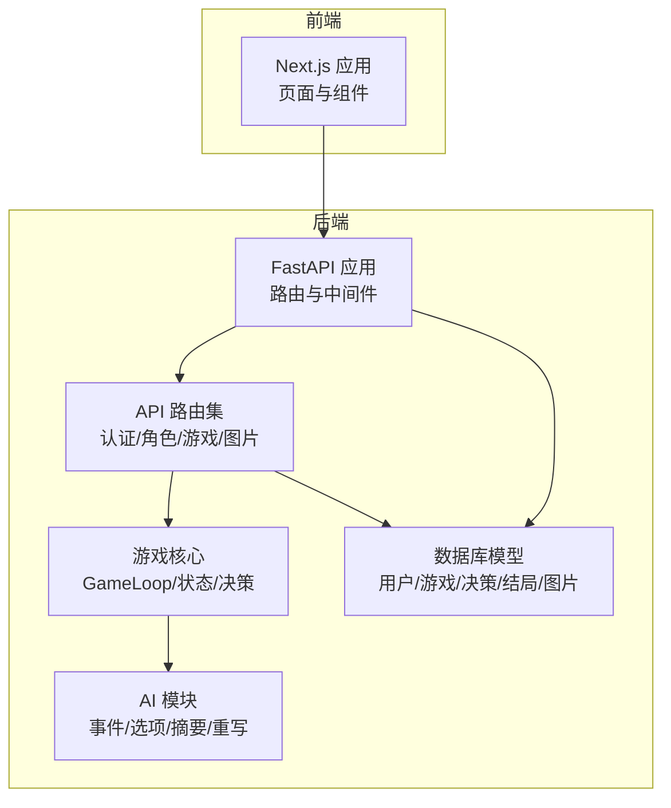
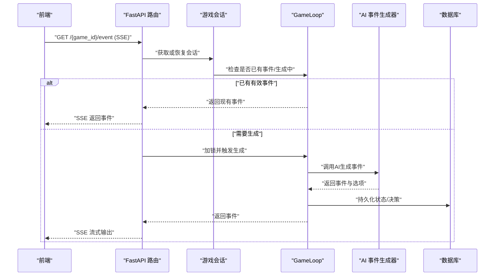
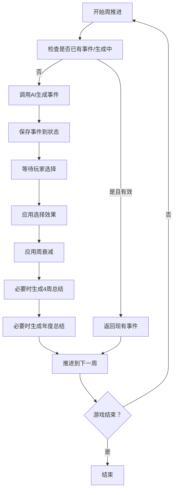
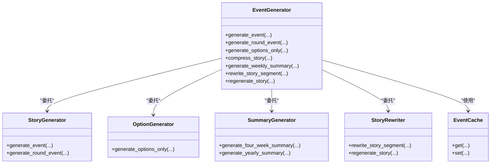
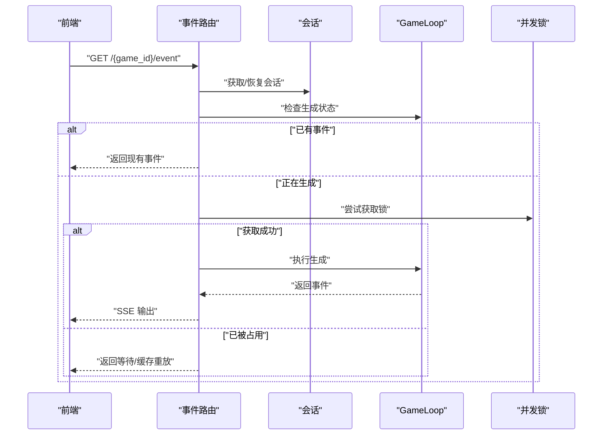
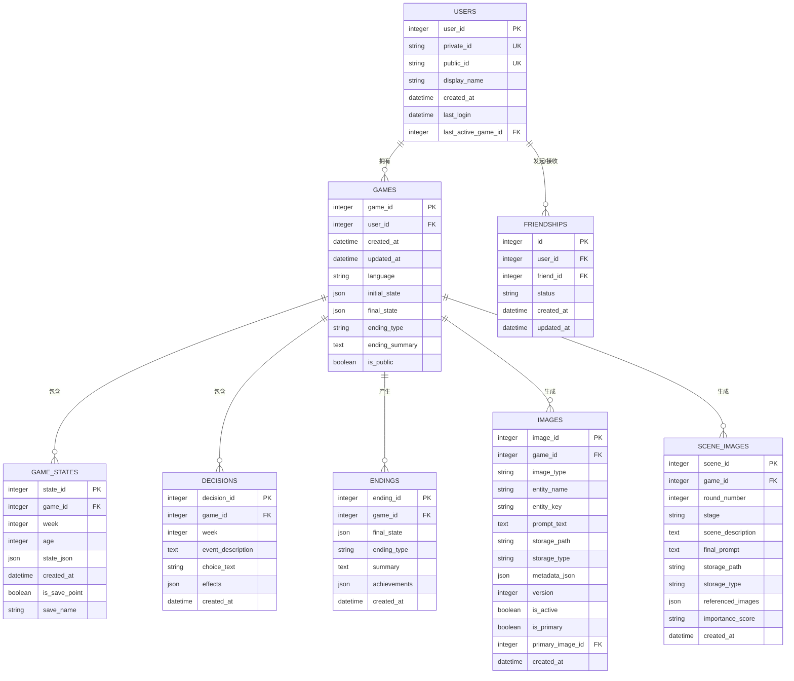
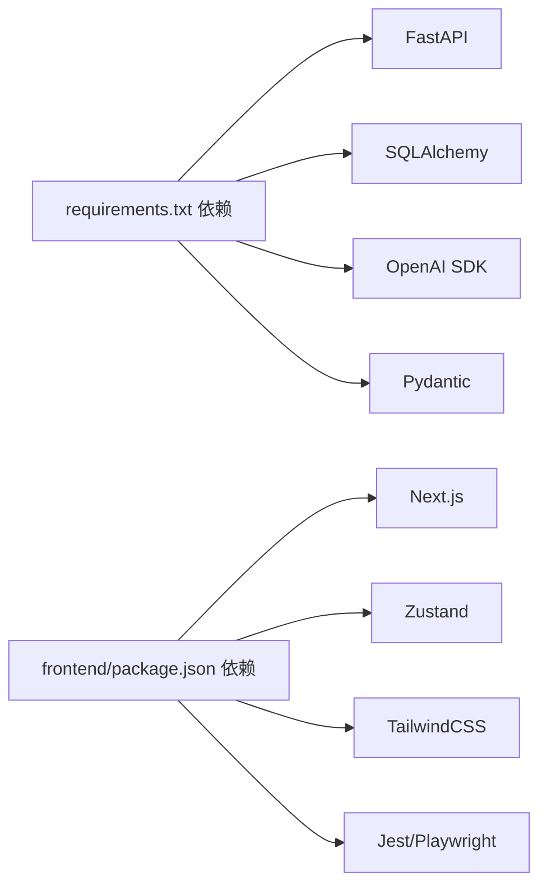

# 项目概述

<cite>
**本文引用的文件**
- [README.md](file://README.md)
- [requirements.txt](file://requirements.txt)
- [frontend/package.json](file://frontend/package.json)
- [src/api/main.py](file://src/api/main.py)
- [config/settings.py](file://config/settings.py)
- [src/game/game_loop.py](file://src/game/game_loop.py)
- [src/ai/generator.py](file://src/ai/generator.py)
- [src/database/models.py](file://src/database/models.py)
- [src/api/routers/gameplay/events.py](file://src/api/routers/gameplay/events.py)
- [src/game/state.py](file://src/game/state.py)
</cite>

## 目录
1. [简介](#简介)
2. [项目结构](#项目结构)
3. [核心组件](#核心组件)
4. [架构总览](#架构总览)
5. [详细组件分析](#详细组件分析)
6. [依赖分析](#依赖分析)
7. [性能考虑](#性能考虑)
8. [故障排查指南](#故障排查指南)
9. [结论](#结论)
10. [附录](#附录)

## 简介
人生草稿本是一个以文本为基础的AI驱动生活模拟游戏。玩家从22岁开始，在约两年时间里每周面对由AI生成的个性化事件，通过做出影响资源（体力、情绪、知识、财富）与关系的决策，体验多结局的人生故事。项目采用“渐进式开发”路线：从命令行原型起步，逐步完善到具备数据库与Web前端的完整交互体验。

- 核心理念：以AI叙事与资源管理为核心，强调“选择塑造人生”的沉浸式体验。
- 主要特性：AI动态事件生成、资源与关系系统、决策影响机制、多语言支持、多结局体验、存档与回放。
- 技术价值：将大型语言模型与游戏循环解耦，构建可扩展的事件生成与叙事管线；通过FastAPI提供稳定API，Next.js提供现代化前端交互；数据库模型覆盖用户、游戏会话、决策、结局与图像资产，支撑社交分享与回溯。

## 项目结构
项目采用前后端分离与模块化设计，核心目录与职责如下：
- config：统一配置与提示词管理，集中化设置项与默认常量。
- src：后端核心逻辑
  - ai：AI事件生成与选项生成的子服务，包含故事生成、选项生成、摘要生成、重写与缓存。
  - api：FastAPI应用入口与路由集合，提供认证、角色、剧情、游戏玩法、图片等接口。
  - database：基于SQLAlchemy的ORM模型与数据库初始化。
  - game：游戏主循环、状态管理、决策处理、世界模型更新与总结生成。
- frontend：Next.js前端应用，提供创建角色、游玩、预设、档案、故事开篇等页面与组件。
- data：预设事件、缓存与图片存储目录。
- tests：单元与集成测试，覆盖AI模块、API、数据库、游戏流程等。

图表来源
- [src/api/main.py](file://src/api/main.py#L35-L90)
- [src/api/routers/gameplay/events.py](file://src/api/routers/gameplay/events.py#L28-L28)
- [src/game/game_loop.py](file://src/game/game_loop.py#L25-L68)
- [src/ai/generator.py](file://src/ai/generator.py#L30-L66)
- [src/database/models.py](file://src/database/models.py#L11-L91)

章节来源
- [README.md](file://README.md#L74-L87)

## 核心组件
- 游戏循环与状态
  - GameLoop负责周推进、事件生成、决策处理与阶段性总结；继承多轮系统能力，支持里程碑事件与回退事件生成。
  - 状态管理通过PlayerState/CharacterState承载资源、年龄、周数、故事历史、决策历史、年/季度总结等。
- AI事件生成
  - EventGenerator作为门面，委托StoryGenerator、OptionGenerator、SummaryGenerator、StoryRewriter等子模块完成两阶段故事生成与选项校验，并支持缓存与预设事件。
- 数据层
  - ORM模型覆盖用户、好友关系、游戏会话、状态快照、决策、结局、人物/场景图片等，支持本地SQLite与云数据库（PostgreSQL/MySQL）。
- API与前端
  - FastAPI提供认证、角色、游戏、图片等REST接口；前端Next.js通过Zustand状态管理与SSE流式渲染实现交互体验。

章节来源
- [src/game/game_loop.py](file://src/game/game_loop.py#L25-L68)
- [src/ai/generator.py](file://src/ai/generator.py#L30-L66)
- [src/database/models.py](file://src/database/models.py#L70-L91)
- [src/api/main.py](file://src/api/main.py#L35-L90)

## 架构总览
整体架构围绕“AI叙事管线 + 游戏循环 + API服务 + 前端交互”展开。AI模块负责生成个性化故事与选项，游戏循环将AI输出与资源/关系系统耦合，API提供持久化与会话管理，前端通过SSE与异步锁保障事件生成的幂等与一致性。

图表来源
- [src/api/routers/gameplay/events.py](file://src/api/routers/gameplay/events.py#L48-L164)
- [src/game/game_loop.py](file://src/game/game_loop.py#L161-L264)
- [src/ai/generator.py](file://src/ai/generator.py#L211-L268)
- [src/database/models.py](file://src/database/models.py#L70-L91)

## 详细组件分析

### 游戏循环与资源管理
- 周推进与事件生成
  - 每周生成一次AI事件，支持里程碑事件优先策略与回退事件兜底；事件生成受并发锁与超时保护约束，避免重复与卡死。
- 决策处理
  - 将玩家选择映射到资源变化与关系波动，支持即时反馈与后续故事重写。
- 总结与回溯
  - 定期生成4周与年度总结，支持用户触发的自定义周期总结；提供时间回溯存档点标记与命名。

图表来源
- [src/game/game_loop.py](file://src/game/game_loop.py#L309-L358)
- [src/game/game_loop.py](file://src/game/game_loop.py#L360-L444)
- [src/game/game_loop.py](file://src/game/game_loop.py#L445-L457)

章节来源
- [src/game/game_loop.py](file://src/game/game_loop.py#L161-L264)
- [src/game/game_loop.py](file://src/game/game_loop.py#L309-L358)

### AI事件生成与选项系统
- 事件生成门面
  - EventGenerator封装故事生成、选项生成、摘要与重写，支持缓存命中与预设里程碑事件优先。
- 两阶段流水线
  - 第一阶段：StoryGenerator生成故事文本；
  - 第二阶段：OptionGenerator生成选项并进行一致性验证；
  - 支持压缩、重写与再生成，保证叙事连贯与可编辑性。
- 缓存与容错
  - 基于玩家状态与语言的事件缓存，失败时回退到静态事件模板。

图表来源
- [src/ai/generator.py](file://src/ai/generator.py#L30-L66)
- [src/ai/generator.py](file://src/ai/generator.py#L211-L268)

章节来源
- [src/ai/generator.py](file://src/ai/generator.py#L30-L66)
- [src/ai/generator.py](file://src/ai/generator.py#L211-L268)

### API与会话管理（SSE与并发控制）
- SSE事件流
  - 提供SSE端点，支持断线重连（Last-Event-ID），在生成中时返回等待消息或缓存重放，确保移动端网络鲁棒性。
- 并发与超时
  - 使用进程内锁与生成标志位双重保护，防止并发生成；超过阈值自动清理卡住状态，避免阻塞。
- 路由组织
  - 分模块注册认证、角色、游戏、图片等路由，统一异常处理与健康检查。

图表来源
- [src/api/routers/gameplay/events.py](file://src/api/routers/gameplay/events.py#L48-L164)
- [src/api/routers/gameplay/events.py](file://src/api/routers/gameplay/events.py#L167-L212)

章节来源
- [src/api/routers/gameplay/events.py](file://src/api/routers/gameplay/events.py#L48-L164)
- [src/api/main.py](file://src/api/main.py#L69-L77)

### 数据模型与持久化
- 用户与好友
  - 用户表含私有ID与公开ID，支持好友关系与请求状态。
- 游戏会话
  - 游戏表记录初始/最终状态、语言、结局类型与公开属性；状态快照表支持手动/自动存档点。
- 决策与结局
  - 决策表记录事件描述、选择文本与效果；结局表记录最终状态、类型与成就。
- 图像资产
  - 人物/场景图片表支持类型、实体标识、存储路径与版本控制，便于重生成与关联。

图表来源
- [src/database/models.py](file://src/database/models.py#L11-L91)
- [src/database/models.py](file://src/database/models.py#L94-L143)
- [src/database/models.py](file://src/database/models.py#L162-L234)

章节来源
- [src/database/models.py](file://src/database/models.py#L70-L91)
- [src/database/models.py](file://src/database/models.py#L94-L143)
- [src/database/models.py](file://src/database/models.py#L162-L234)

## 依赖分析
- 后端技术栈
  - FastAPI：提供高性能API与自动文档；内置CORS、异常处理与生命周期管理。
  - SQLAlchemy：ORM建模与数据库抽象，支持本地SQLite与云数据库。
  - OpenAI SDK：事件生成与文本/JSON生成、流式响应。
  - Pydantic：数据模型与序列化。
- 前端技术栈
  - Next.js App Router：页面与路由组织。
  - Zustand：轻量状态管理。
  - TailwindCSS：样式工具。
  - Jest/Playwright：测试体系。
- 运行与部署
  - Uvicorn：ASGI服务器。
  - Docker/Compose：容器化与编排。

图表来源
- [requirements.txt](file://requirements.txt#L1-L12)
- [frontend/package.json](file://frontend/package.json#L16-L47)

章节来源
- [requirements.txt](file://requirements.txt#L1-L12)
- [frontend/package.json](file://frontend/package.json#L16-L47)

## 性能考虑
- 事件生成并发控制
  - 使用异步锁与生成标志位，避免重复生成与长时间卡死；超时自动清理，保障服务稳定性。
- 流式输出与缓存
  - SSE流式输出降低首帧延迟；断线重连支持与缓存重放提升移动端体验。
- 数据库连接池
  - 云数据库模式启用预检与连接池，减少慢查询与连接抖动。
- AI调用与缓存
  - 事件缓存与预设里程碑事件优先，减少重复调用与成本。

章节来源
- [src/api/routers/gameplay/events.py](file://src/api/routers/gameplay/events.py#L30-L41)
- [src/api/routers/gameplay/events.py](file://src/api/routers/gameplay/events.py#L88-L121)
- [src/database/models.py](file://src/database/models.py#L242-L245)

## 故障排查指南
- 常见问题定位
  - 事件生成卡住：检查生成标志位与超时日志，确认是否因并发锁导致；必要时重启服务清理状态。
  - SSE断线：确认Last-Event-ID头与缓存重放逻辑；检查网络与代理配置。
  - AI调用失败：查看全局异常处理器返回的错误详情；确认API密钥与模型配置。
- 日志与监控
  - 后端提供客户端日志收集端点，便于移动端问题诊断。
  - 健康检查端点可快速判断服务与会话数量状态。

章节来源
- [src/api/main.py](file://src/api/main.py#L69-L77)
- [src/api/main.py](file://src/api/main.py#L117-L134)
- [src/api/main.py](file://src/api/main.py#L92-L99)

## 结论
人生草稿本以“AI叙事 + 资源管理 + 决策影响”为核心，构建了可扩展、可持久化的交互式生活模拟体验。通过模块化的AI事件生成、稳健的API与并发控制、完善的数据库模型以及现代化的前端交互，项目在技术深度与可玩性之间取得平衡。未来可在多结局判定、NPC关系深化与图像生成能力上持续迭代，进一步增强叙事分支与视觉表现力。

## 附录
- 开发阶段
  - Phase 1：CLI原型与核心逻辑
  - Phase 2：FastAPI后端与数据库
  - Phase 3：Next.js前端与全功能体验
- 项目愿景
  - 用AI生成个性化人生故事，让每个选择都有意义，每段旅程都值得回味。
- 目标用户
  - 喜欢文字冒险与自我反思的玩家；希望探索不同人生可能的创作者与教育者。
- 核心优势
  - AI事件生成与选项校验保证叙事一致性；资源与关系系统提供策略深度；多语言与多结局增强可玩性；前后端分离与模块化便于扩展与维护。